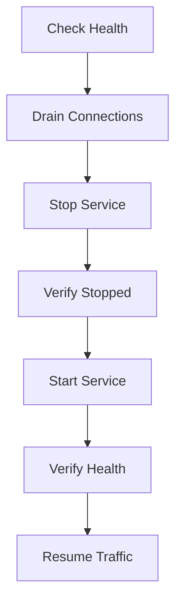

# Service Restart Runbook

## Overview
Procedures for restarting all services in the Portfolio platform.

## Services

| Service | Type | Restart Method | Typical Time |
|---------|------|----------------|-------------|
| web (Next.js) | Node.js | Vercel redeploy / local npm | 30-60s |
| api (NestJS) | Node.js | Process restart / Vercel | 20-40s |
| ai (FastAPI) | Python | Uvicorn restart / Railway | 15-30s |
| postgres | Database | Docker restart / Supabase | 10-30s |
| redis | Cache | Docker restart / Upstash | 5-10s |

## Local Development Restart

### Full Stack Restart
```bash
# Stop all services
# (Ctrl+C on the running `npm run dev` terminal)

# Restart
npm run dev
```

### Restart Individual Service
```bash
# API only
npm run dev:api

# Web only
npm run dev:web

# AI only
npm run dev:ai
```

### Database Restart (Docker)
```bash
docker compose -f infrastructure/docker/docker-compose.yml restart postgres
docker compose -f infrastructure/docker/docker-compose.yml restart redis
```

## Production Restart

### Vercel (Web + API)
1. Go to Vercel dashboard
2. Select project
3. Navigate to Deployments
4. Select "Redeploy" on last known-good deployment
5. Or: `npx vercel redeploy`

### Railway (AI Service)
1. Go to Railway dashboard
2. Select project
3. Click "Restart"

### Supabase (Database)
- Supabase manages automatically
- Forced restart: Supabase dashboard → Database → Restart

## Verification
After restart, verify:
```bash
# Health checks
curl http://localhost:3001/api/health/liveness
curl http://localhost:3001/api/health/readiness

# Frontend renders
curl -s http://localhost:3000 | head -20

# AI service
curl http://localhost:8000/health

# Check logs for errors
docker compose -f infrastructure/docker/docker-compose.yml logs --tail=50
```

## Restart Procedure Diagram



## Troubleshooting Restart Issues
- **Service won't start:** Check port availability, configuration
- **Database won't connect:** Check credentials, network
- **Process crashes on startup:** Check logs for initialization errors
- **Timeout waiting for service:** Increase wait time, check resource limits

## Cross-References
- [MASTER-INDEX.md](../MASTER-INDEX.md) — Documentation master index
- [CROSS-REFERENCE-INDEX.md](../26-reference/CROSS-REFERENCE-INDEX.md) — Cross-reference system
