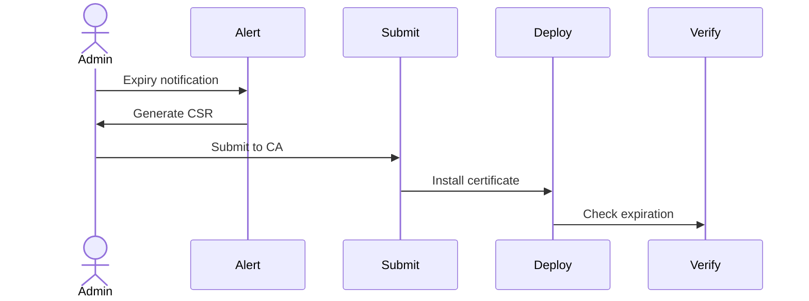

# SSL Certificate Renewal Runbook

## Overview
SSL/TLS certificate management for the Portfolio platform.

## Certificate Management

| Domain | Provider | Renewal Method | Auto-Renewal | Expiry Monitoring |
|--------|----------|----------------|--------------|-------------------|
| portfolio.dev | Vercel (automatic) | Automatic via Vercel | ✅ Yes | Vercel handles |
| api.portfolio.dev | Vercel (automatic) | Automatic via Vercel | ✅ Yes | Vercel handles |
| Custom domains | Cloudflare | Manual if not proxied | ❌ Manual | Set calendar reminder |

## Automated Renewal (Vercel)
Vercel automatically provisions and renews SSL certificates for all deployments.
- No action needed for `*.vercel.app` domains
- Custom domains: Ensure DNS records point to Vercel

## Manual Renewal (if not using Vercel proxy)

### Step 1: Check Current Certificate
```bash
openssl s_client -connect portfolio.dev:443 -servername portfolio.dev 2>/dev/null | openssl x509 -noout -dates
```

### Step 2: Generate New Certificate
Using Let's Encrypt / Certbot:
```bash
certbot certonly --standalone -d portfolio.dev -d api.portfolio.dev
```

### Step 3: Upload Certificate
To Vercel:
```bash
npx vercel certs add certificate.crt private.key
```

### Step 4: Verify
```bash
curl -vI https://portfolio.dev 2>&1 | grep -i "ssl\|certificate"
```

## SSL Renewal Flow Diagram



## Monitoring
- Set calendar reminders 30 days before expiry
- Use uptime monitor (Better Stack) with SSL expiry check
- Check monthly: `openssl s_client -connect portfolio.dev:443`

## Cross-References
- [MASTER-INDEX.md](../MASTER-INDEX.md) — Documentation master index
- [CROSS-REFERENCE-INDEX.md](../26-reference/CROSS-REFERENCE-INDEX.md) — Cross-reference system
