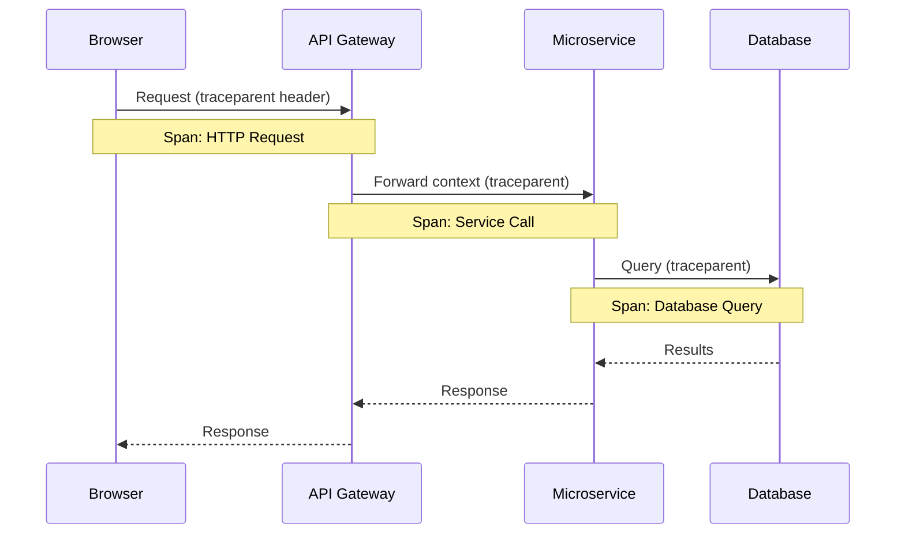

# Tracing Strategy

## 1. Overview

In our distributed architecture—spanning a Next.js frontend, a NestJS backend, and a FastAPI AI microservice—a single user request often crosses multiple service boundaries. Our Tracing Strategy ensures we can track the lifecycle of a request from the user's browser all the way down to the Supabase database and external LLM APIs.

## 2. Distributed Tracing Standard

We utilize **W3C Trace Context** as our standard for distributed tracing. This ensures interoperability between different layers and observability tools (Datadog APM, Sentry).

Every trace consists of:

- **Trace ID**: A globally unique identifier for the entire request lifecycle.
- **Span ID**: A unique identifier for a specific operation or segment within the trace.
- **Parent Span ID**: Links spans together to form a causal tree.

## 3. Architecture & Implementation

### 3.1 Next.js 14 (Frontend & Edge)

- **Initiation**: The trace is initiated in the browser via Datadog RUM or Sentry SDK.
- **Propagation**: When the frontend makes an API call to the NestJS backend via `fetch` or React Query, it injects the `traceparent` and `tracestate` headers into the HTTP request.
- **Server Components**: Next.js Server Actions and SSR data fetching also propagate trace context.

### 3.2 NestJS (Core Backend)

- **Extraction**: A global interceptor extracts the trace context from incoming HTTP request headers.
- **APM Integration**: Datadog APM (`dd-trace`) auto-instruments Express/Fastify, HTTP clients, and Prisma.
- **Database Spans**: Prisma tracing is enabled to create spans for every database query sent to Supabase, allowing us to identify N+1 query problems or slow joins.
- **Propagation to AI**: When NestJS calls the FastAPI service, it forwards the trace context headers.

### 3.3 FastAPI (AI & RAG Service)

- **Extraction**: FastAPI middleware extracts the incoming trace context.
- **LangChain Instrumentation**: We use **LangSmith** (or Datadog LLM Observability) to trace deep into the LangChain execution. This creates spans for:
  - Embedding generation
  - Vector store retrieval (pgvector)
  - Prompt formatting
  - LLM invocation (including token counts and latency)
- **External APIs**: Spans are automatically created for outbound HTTP requests to OpenAI, Anthropic, or other third-party APIs.

## 4. Sampling Strategy

Tracing every single request in a high-traffic system is cost-prohibitive. We implement a **tail-based sampling strategy**:

- **Head-based Sampling**: In development and staging, we keep 100% of traces.
- **Production Sampling**: We sample a baseline of 5% of all successful requests for statistical baselining.
- **Error & High Latency Retention**: We dynamically retain 100% of traces that result in an error (HTTP 5xx) or exceed a latency threshold (e.g., > 2000ms).

## 6. Distributed Tracing Diagram

## 5. Utilizing Traces for Debugging

When an error occurs or a performance degradation is reported:

1. Locate the `trace_id` from the Sentry error report, user feedback, or Datadog log.
2. Search for the `trace_id` in Datadog APM.
3. Analyze the Flame Graph to identify exactly which span (Next.js render, NestJS controller, Prisma query, or LLM call) was responsible for the error or latency.

## Cross-References

- [MASTER-INDEX.md](../MASTER-INDEX.md) — Documentation master index
- [CROSS-REFERENCE-INDEX.md](../26-reference/CROSS-REFERENCE-INDEX.md) — Cross-reference system
