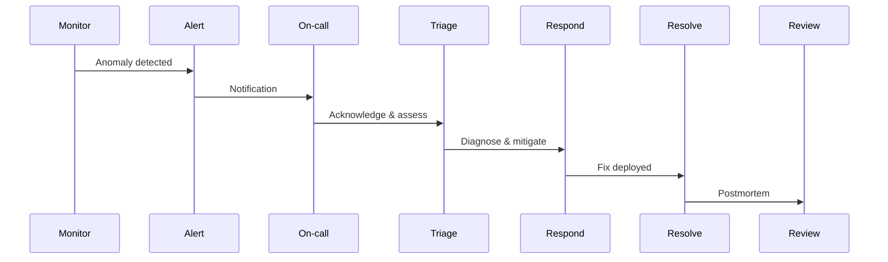

# Incident Response Playbook

> **Document:** `incident-response-playbook.md` | **Version:** 1.0 | **Last Updated:** July 2026  
> **Status:** ✅ Active | **Owner:** DevOps Lead | **Review Cadence:** Quarterly  
> **Related:** [56-SLA-SLO.md](./56-SLA-SLO.md) | [Disaster Recovery](./55-DISASTER-RECOVERY.md) | [Incident Management](./IncidentManagement.md)

---

## Incident Severity Levels

| Severity | Label | Response Time | Example | Escalation |
|----------|-------|---------------|---------|------------|
| P0 — Critical | SEV-1 | 15 min | Site down, data breach, auth failure | All hands |
| P1 — High | SEV-2 | 30 min | API errors >5%, degraded performance | Engineering lead |
| P2 — Medium | SEV-3 | 2 hours | Partial feature failure, slower queries | Team lead |
| P3 — Low | SEV-4 | Next business day | Cosmetic issues, non-critical bugs | Self-service |

Refer to [56-SLA-SLO.md](./56-SLA-SLO.md#81-violation-severity-classification) for the full severity classification matrix and SLO burn rate thresholds.

---

## Full Response Flow Diagram



## Incident Lifecycle

### 1. Detection

Sources (ranked by reliability):
1. **Automated alerts** — Sentry error spike, Better Uptime health check failure, Telegram bot notification
2. **Monitoring dashboard anomalies** — Vercel Analytics, Railway Metrics, Cloudflare WAF
3. **User reports** — Contact form submissions, social media mentions

### 2. Triage (within 5 min of alert)

```bash
# 1. Confirm the alert — check health endpoints
curl -s http://localhost:3001/api/health/liveness | jq .
curl -s http://localhost:3001/api/health/readiness | jq .

# 2. Identify what changed — check recent deployments
git log --oneline -10 --all

# 3. Check error tracking — Sentry for error spike
# Navigate to: https://sentry.io/organizations/<org>/issues/

# 4. Check logs
# API:   heroku logs --tail --app portfolio-api
# AI:    railway logs --service ai-service
# Web:   vercel logs --limit 50

# 5. Check upstream providers
# Vercel:    https://www.vercel-status.com/
# Railway:   https://status.railway.app/
# Supabase:  https://status.supabase.com/
# OpenAI:    https://status.openai.com/
```

### 3. Diagnosis

Follow the scenario that matches the symptoms:

#### Scenario A: 500 Errors
1. Check Sentry for error stack traces and affected endpoints
2. Check recent deploys — `git log --oneline -5`
3. Check environment variables — verify secrets are set in deployment platform
4. Check database connectivity — `curl localhost:3001/api/health/readiness`
5. **If API:** Check NestJS logs for unhandled exceptions
6. **If Web:** Check Next.js build output for static generation failures

#### Scenario B: Slow Responses
1. Check P50/P95/P99 in Sentry Performance
2. Check Redis connection pool — verify `REDIS_URL` is set and reachable
3. Check database CPU — Supabase dashboard > Database > Reports
4. Check for slow queries — Supabase > Query Performance
5. Check external API latency — especially OpenAI if AI service is involved

#### Scenario C: Auth Failures
1. Check JWT expiry — verify `JWT_SECRET` and `JWT_EXPIRATION` env vars
2. Check Supabase Auth status — https://status.supabase.com/
3. Check OAuth provider status (Google/GitHub)
4. Verify Passport.js strategy configuration
5. Check for token validation errors in API logs

#### Scenario D: Database Errors
1. Check connection pool exhaustion — `SELECT count(*) FROM pg_stat_activity;`
2. Check query performance — Supabase Query Performance dashboard
3. Check disk usage — Supabase > Database > Reports > Disk
4. Check for table bloat or missing indexes
5. Verify Prisma migrations are up to date — `npx prisma migrate status`

#### Scenario E: AI Service Down
1. Check FastAPI health — `curl https://ai-service.railway.app/health`
2. Check OpenAI/Anthropic API status — https://status.openai.com/
3. Check Railway service logs — `railway logs --service ai`
4. Verify API keys — check `OPENAI_API_KEY`, `ANTHROPIC_API_KEY` env vars
5. Check for rate limit errors — look for 429 responses in logs

### 4. Mitigation

| Action | When | How |
|--------|------|-----|
| **Rollback deployment** | Recent deploy triggered regression | `git revert HEAD` + push, or Vercel/Railway rollback UI |
| **Feature flag disabled** | Non-critical feature causing errors | Toggle flag in admin dashboard or env var |
| **Scale resources** | Traffic spike, CPU saturation | Railway scale up (vertical), Vercer Pro auto-scales |
| **Redirect traffic** | Regional outage | Cloudflare load balancing rules |
| **Fail over** | Database region failure | Supabase read replica promotion |
| **Degrade gracefully** | AI service unavailable | Disable AI chat, show fallback UI |

### 5. Resolution

1. **Apply fix** in development environment
2. **Verify** in staging — run tests and manual smoke tests
3. **Deploy** to production via CI/CD pipeline
4. **Monitor** for 30 minutes post-fix — check error rates, latency, and health endpoints
5. **Confirm** alert is resolved — acknowledge and close in monitoring tools

### 6. Post-Incident

| Step | Owner | Timeline | Artifact |
|------|-------|----------|----------|
| Draft postmortem | On-call engineer | Within 48 hours | `docs/postmortems/YYYY-MM-DD-description.md` |
| Root cause analysis | Engineering lead | Within 48 hours | Documented in postmortem |
| Action items with owners | Engineering team | Within 5 business days | Added to sprint backlog |
| Update runbooks | DevOps Lead | Within 1 week | PR to this playbook |
| Review SLO impact | Architecture Lead | Next monthly review | Update error budget |

---

## Communication Templates

### Incident Announcement

> **Subject:** [SEV-1] [Service] — [Brief Description]
>
> **Status:** Investigating / Mitigating / Resolved
>
> **Impact:** What's affected — specific features, users, regions
>
> **Started:** YYYY-MM-DD HH:MM UTC
>
> **Team:** Engineer(s) working on it
>
> **ETA:** Estimated resolution time or next update time

### Status Update

> **Update:** What we've found / done since last update
>
> **Next step:** What we're doing next
>
> **Timeline:** Updated ETA if changed

### Resolution Notice

> **Status:** Resolved
>
> **Root cause:** Brief description of what caused the incident
>
> **Fix applied:** What was done to resolve
>
> **Monitoring:** Verified stable for 30 minutes post-fix
>
> **Postmortem:** Link to postmortem document (will be available within 48h)

---

## Emergency Contacts

| Role | Contact | Channel |
|------|---------|---------|
| Primary on-call | [on-call@portfolio.dev] | Telegram + SMS |
| Engineering Lead | [lead@portfolio.dev] | Telegram |
| DevOps Lead | [devops@portfolio.dev] | Telegram + Phone |
| Security Lead | [security@portfolio.dev] | Telegram |
| Architecture Lead | [arch@portfolio.dev] | Telegram |
| CTO | [cto@portfolio.dev] | Phone |

---

## Recovery Runbooks

| Scenario | Runbook |
|----------|---------|
| Full disaster recovery | [55-DISASTER-RECOVERY.md](./55-DISASTER-RECOVERY.md) |
| Database restore | [Runbook: DB Recovery](../runbooks/db-recovery.md) |
| Deployment rollback | [Runbook: Rollback](../runbooks/deployment-rollback.md) |
| SSL certificate renewal | [Runbook: SSL](../runbooks/ssl-renewal.md) |
| API key rotation | [Runbook: Key Rotation](../runbooks/api-key-rotation.md) |
| AI service failover | [Runbook: AI Failover](../runbooks/ai-failover.md) |
| Provider migration | [54-INFRASTRUCTURE.md](./54-INFRASTRUCTURE.md) |

---

## On-Call Rotation

| Week | Primary | Secondary |
|------|---------|-----------|
| Week 1 | TBD | TBD |
| Week 2 | TBD | TBD |
| Week 3 | TBD | TBD |
| Week 4 | TBD | TBD |

On-call shifts run Mon–Mon, 09:00 UTC handover. Schedule maintained in Team Calendar.

---

## Postmortem Template

```markdown
# Postmortem: [Date] — [Title]

## Incident Summary
- **Date:** YYYY-MM-DD
- **Duration:** HH:MM — HH:MM UTC
- **Severity:** P0/P1/P2/P3
- **Services affected:** [list]
- **Users affected:** [count/description]

## Timeline
| Time (UTC) | Event |
|------------|-------|
| 12:00 | Alert triggered |
| 12:03 | On-call acknowledged |
| 12:05 | Triage started |
| ... | ... |

## Root Cause
[Description of what caused the incident]

## Impact
- Downtime: X minutes
- Errors: X 5xx responses
- Users: X affected

## Action Items
| Action | Owner | Ticket | Status |
|--------|-------|--------|--------|
| Fix root cause | @name | JIRA-123 | ✅ Done |
| Add monitoring | @name | JIRA-124 | 🔄 In Progress |
| Update runbook | @name | JIRA-125 | 📋 Backlog |

## Lessons Learned
- What went well:
- What went wrong:
- What to improve:

## Blameless Statement
This incident was caused by systemic issues, not individual failure.
```

---

## Appendices

### A. Health Check Endpoints

| Service | Endpoint | Expected Response |
|---------|----------|-------------------|
| API | `GET /api/health/liveness` | `200 { status: "ok" }` |
| API | `GET /api/health/readiness` | `200 { status: "ok", db: true, redis: true }` |
| AI | `GET /health` | `200 { status: "healthy" }` |
| Web | `GET /` | `200 HTML` |

### B. Quick Reference — Common Commands

```bash
# Check deployment status
vercel list
railway status
git log --oneline -5 --all

# Check logs
vercel logs --limit 20
railway logs --service api --limit 50

# Rollback
vercel rollback <deployment-id>
railway rollback

# Database
npx prisma migrate status
psql "$DATABASE_URL" -c "SELECT pg_database_size(current_database())"
```

### C. Alert Severity Reference

See [56-SLA-SLO.md §6.3 Alerting Thresholds](./56-SLA-SLO.md#63-alerting-thresholds) for the complete alert configuration.

---

*Document Version: 1.0 — Incident Response Playbook*  
*Last Updated: July 2026*  
*Next Review Date: October 2026*

## Cross-References
- [MASTER-INDEX.md](../MASTER-INDEX.md) — Documentation master index
- [CROSS-REFERENCE-INDEX.md](../26-reference/CROSS-REFERENCE-INDEX.md) — Cross-reference system
