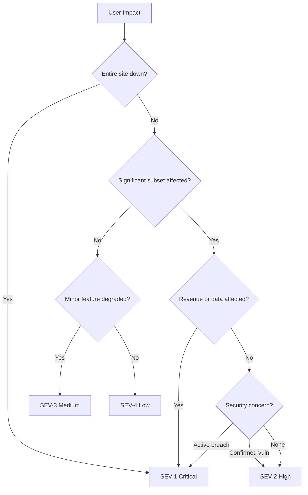
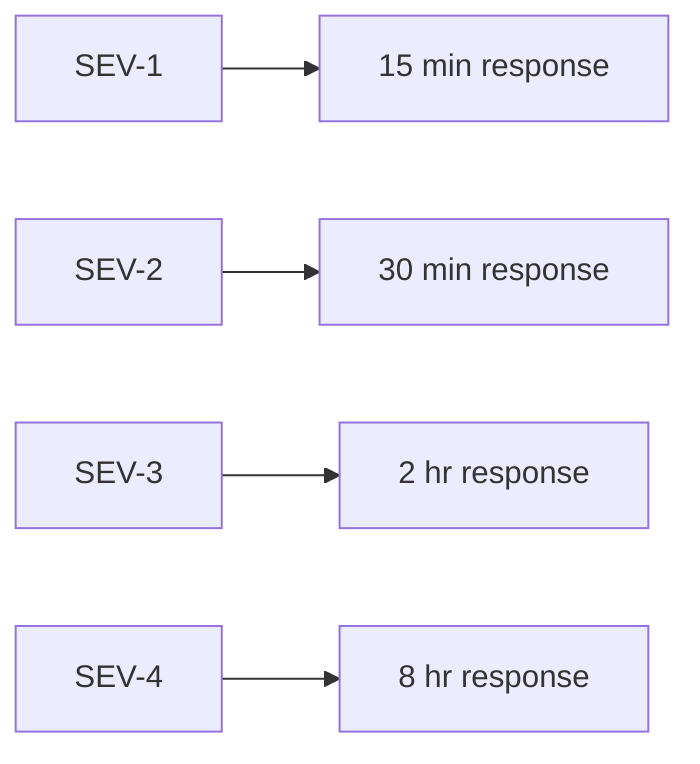

# Incident Severity Criteria — Classification Matrix

> **Document:** `incident-severity-criteria.md` | **Version:** 1.0 | **Last Updated:** July 2026
> **Status:** Active | **Owner:** DevOps Lead | **Review Cadence:** Quarterly
> **Related:** [incident-response-playbook.md](./incident-response-playbook.md) | [on-call-schedule.md](./on-call-schedule.md) | [56-SLA-SLO.md](./56-SLA-SLO.md)

---

## 1. Severity Classification Matrix

| Criteria | SEV-1 (Critical) | SEV-2 (High) | SEV-3 (Medium) | SEV-4 (Low) |
|----------|------------------|--------------|----------------|-------------|
| **User Impact** | All users unable to use site | Significant subset affected | Minor feature degraded | Cosmetic issue |
| **Revenue Impact** | Revenue loss > $1K/hr | Revenue loss < $1K/hr | No revenue impact | No revenue impact |
| **Data Integrity** | Data loss or corruption confirmed | Data at risk, not yet lost | No data risk | No data risk |
| **Security** | Active breach, PII exposed | Vulnerability with evidence | Theoretical vulnerability | Best practice gap |
| **Response SLA** | 5 minutes | 15 minutes | 1 hour | 4 hours |
| **Fix SLA** | 4 hours | 8 hours | 48 hours | Next sprint |
| **Communication** | Email + Slack to all team | Slack to engineering | Slack to team lead | PR description |
| **Postmortem** | Required within 5 days | Required within 10 days | Not required | Not required |
| **Escalation** | All-hands, CTO notified | Engineering lead | Team lead | Self-service |

---

## 2. Severity Classification Diagram



## 3. Response SLA Diagram



## 2. Determining Severity

When an incident is reported, the on-call engineer determines severity using the following decision tree:

### 2.1 Severity Decision Flow

```
Is the entire site down or unusable?
    ├── Yes ──► SEV-1
    └── No
         └── Is a significant subset of users affected?
              ├── Yes ──► Go to "Is revenue or data affected?"
              └── No
                   └── Is a non-critical feature degraded?
                        ├── Yes ──► SEV-3
                        └── No ──► SEV-4

Is revenue or data affected? (for significant subset)
    ├── Yes (revenue loss > $1K/hr OR data loss/corruption) ──► SEV-1
    └── No
         └── Is there a security concern?
              ├── Yes (active breach / PII exposed) ──► SEV-1
              ├── Yes (vulnerability with PoC) ──► SEV-2
              └── No ──► SEV-2 (significant subset but no $/data/security)
```

### 2.2 Severity Scoring Sheet

For ambiguous cases, score each dimension 1–4 and take the highest:

| Dimension | 4 (SEV-1) | 3 (SEV-2) | 2 (SEV-3) | 1 (SEV-4) |
|-----------|-----------|-----------|-----------|-----------|
| User impact | All users | >25% users | Single feature | Visual only |
| Revenue | >$1K/hr | <$1K/hr | None | None |
| Data | Lost/corrupted | At risk | None | None |
| Security | Active breach | Confirmed vuln | Theoretical | Best practice |
| **Score** | Highest single dimension determines severity | | | |

---

## 3. SEV-1 — Critical

### 3.1 Definition

A **critical incident** that renders the entire platform unusable, causes active data loss, or involves a confirmed security breach. Immediate, all-hands response required.

### 3.2 Examples from Portfolio Application

| Scenario | Why SEV-1 |
|----------|-----------|
| **Database down** — Supabase PostgreSQL unreachable. All API endpoints returning 500. Every page fails. | All users unable to use site. No data access. |
| **Auth system compromised** — JWT secret leaked. Attacker can forge tokens and access any account. | Active security breach. PII at risk. |
| **Data breach** — Customer contact form submissions exposed via misconfigured Supabase bucket. | PII exposed. Regulatory notification required. |
| **Complete Vercel outage** — Portfolio domain returns 502 for all visitors. | All users unable to access site. |
| **Database corruption** — Migration script drops critical table. Data unrecoverable without PITR. | Data loss confirmed. |
| **Cloudflare WAF misconfiguration** — All traffic blocked by overly restrictive firewall rule. | All users unable to access site. |

### 3.3 Response Requirements

| Requirement | Target |
|-------------|--------|
| Acknowledge | 5 minutes |
| First status update | 15 minutes |
| Status update cadence | Every 30 minutes |
| Fix applied within | 4 hours |
| Postmortem draft | 5 days |
| Communications | Email to all team + Slack #ops-alerts + #ops-incident |

---

## 4. SEV-2 — High

### 4.1 Definition

A **high-severity incident** affecting a significant subset of users, causing revenue impact under $1K/hr, or involving a confirmed vulnerability. Requires prompt engineering response.

### 4.2 Examples from Portfolio Application

| Scenario | Why SEV-2 |
|----------|-----------|
| **API returning 500s** — NestJS throws unhandled exceptions on project listing endpoint. Users see error instead of portfolio. | Significant subset affected — all visitors to portfolio pages. |
| **AI assistant unresponsive** — FastAPI service returns 503. Chat widget shows error state. | Significant feature degraded — all users who try AI chat. |
| **Lead submissions failing** — Contact form POST returns 400. Inquiries not reaching database. | Revenue impact — potential client leads lost. |
| **Blog search broken** — Full-text search returns empty results. Users cannot find articles. | Significant feature degraded. |
| **3D animation causing browser crash** — R3F scene leaks memory on certain GPUs. Users on affected hardware cannot view home page. | Significant subset affected — users with specific GPU/driver combos. |
| **Slow page loads on project pages** — P95 response time > 5 seconds. Users wait or leave. | Performance degradation affecting all visitors to project section. |

### 4.3 Response Requirements

| Requirement | Target |
|-------------|--------|
| Acknowledge | 15 minutes |
| First status update | 30 minutes |
| Status update cadence | Every 60 minutes |
| Fix applied within | 8 hours |
| Postmortem draft | 10 days |
| Communications | Slack to engineering (channel: #ops-incident) |

---

## 5. SEV-3 — Medium

### 5.1 Definition

A **medium-severity incident** where a minor feature is degraded or partially unavailable. No revenue or data impact. Acknowledged within one hour, fixed within 48 hours.

### 5.2 Examples from Portfolio Application

| Scenario | Why SEV-3 |
|----------|-----------|
| **Portfolio page loads slowly** — Lighthouse score drops from 95 to 60 but page still renders. | Minor feature degraded — performance, not availability. |
| **Blog search broken** — Elasticsearch index stale. New posts not showing for 24+ hours. | Minor feature partially unavailable. |
| **3D animation not rendering** — WebGL context lost on certain browsers. Fallback image displays instead. | Single feature degraded — visual, not functional. |
| **Theme switcher not persisting** — Dark mode preference resets on page reload. | Minor feature broken — cosmetic preference. |
| **Social preview images broken** — Open Graph tags not rendering correct images on social shares. | Minor feature degraded — no revenue/data impact. |
| **Contact form CAPTCHA too strict** — Legitimate users failing reCAPTCHA. Need to refresh and retry. | Minor feature degraded — workaround exists. |

### 5.3 Response Requirements

| Requirement | Target |
|-------------|--------|
| Acknowledge | 1 hour |
| First status update | 2 hours |
| Fix applied within | 48 hours |
| Postmortem | Not required |
| Communications | Slack to team lead |

---

## 6. SEV-4 — Low

### 6.1 Definition

A **low-severity incident** involving cosmetic issues, non-critical bugs, or best-practice gaps. No functional impact on users. Fixed in the next sprint.

### 6.2 Examples from Portfolio Application

| Scenario | Why SEV-4 |
|----------|-----------|
| **Missing alt text on image** — Accessibility issue on project thumbnail. Visually unaffected. | Cosmetic / accessibility — no functional impact. |
| **Broken link in footer** — Social media link returns 404. | Cosmetic issue — non-critical navigation. |
| **Typo in content** — Misspelled word on about page. | Cosmetic issue — content only. |
| **Email input not validating format** — User can submit "abc" as email but gets API error. | Minor UX gap — functional validation exists server-side. |
| **Loading spinner shown too long** — Skeleton loader displays for 3+ seconds on fast connection. | Cosmetic — no functional impact. |
| **Missing meta description** — SEO best practice gap. | Best practice — no user-facing impact. |

### 6.3 Response Requirements

| Requirement | Target |
|-------------|--------|
| Acknowledge | 4 hours |
| Fix applied within | Next sprint |
| Postmortem | Not required |
| Communications | PR description or issue comment |

---

## 7. Severity Changes During Incident

Severity is not static. It can change as more information becomes available:

### 7.1 Upgrade Path

| Trigger | Action |
|---------|--------|
| Impact expands to more users | Upgrade severity immediately |
| Revenue impact discovered | Upgrade to SEV-1 or SEV-2 |
| Security implications found | Upgrade to SEV-1 |
| Root cause found to be more severe | Upgrade accordingly |
| Fix SLA approaching without resolution | Escalate to next tier |

### 7.2 Downgrade Path

| Trigger | Action |
|---------|--------|
| Workaround deployed, impact reduced | Consider downgrade |
| Root cause found to be less severe | Consider downgrade |
| Impact was overestimated during triage | Downgrade accordingly |

### 7.3 Reclassification Log

Any severity change must be:
1. Announced in the incident channel
2. Recorded in the incident timeline with timestamp and reason
3. Approved by the current incident commander

---

## 8. SLA Compliance Tracking

| Severity | ACK Target | Met | Missed | Compliance Rate |
|----------|-----------|-----|--------|-----------------|
| SEV-1 | 5 min | 0 | 0 | — |
| SEV-2 | 15 min | 0 | 0 | — |
| SEV-3 | 1 hr | 0 | 0 | — |
| SEV-4 | 4 hr | 0 | 0 | — |

*Metrics populated monthly from PagerDuty and Slack alert data.*

---

## 9. References

- **SLO definitions** — [56-SLA-SLO.md](./56-SLA-SLO.md) for service-level objectives and error budgets
- **Response procedures** — [incident-response-playbook.md](./incident-response-playbook.md) for step-by-step incident handling
- **On-call schedule** — [on-call-schedule.md](./on-call-schedule.md) for current rotation
- **Communication templates** — [incident-communication-templates.md](../playbooks/incident-communication-templates.md)

---

*Document Version: 1.0 — Incident Severity Criteria*
*Last Updated: July 2026*
*Next Review Date: October 2026*

## Cross-References
- [MASTER-INDEX.md](../MASTER-INDEX.md) — Documentation master index
- [CROSS-REFERENCE-INDEX.md](../26-reference/CROSS-REFERENCE-INDEX.md) — Cross-reference system
