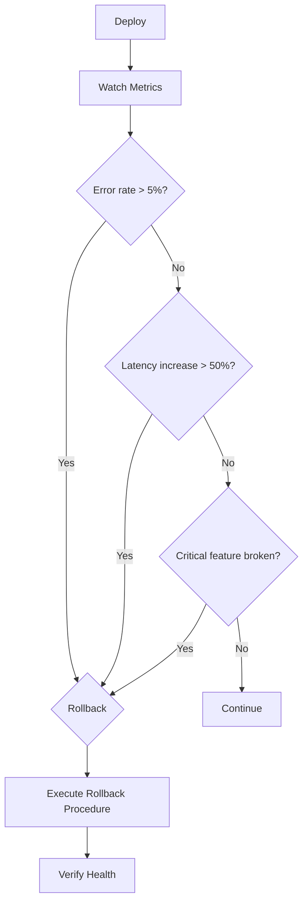

# Rollback Playbook

## Overview
Standard procedures for rolling back deployments across all services. Every deployment should have a rollback plan before going to production.

## Rollback Decision Flow



## Rollback Decision Criteria
Roll back immediately if:
- Error rate increases by > 5%
- P95 latency increases by > 50%
- Any critical feature is broken
- Security vulnerability introduced
- Database migration has errors
- User-reported critical bug

## Rollback Methods

### Method 1: Vercel Instant Rollback (Web + API)
**Time to execute:** 2-5 minutes
**Data loss risk:** None
**Procedure:**
1. Go to Vercel Dashboard → Deployments
2. Find the last known-good deployment
3. Click "⋮" → "Redeploy"
4. Verify health:
   ```bash
   curl https://portfolio.dev/api/health/liveness
   curl https://portfolio.dev/api/health/readiness
   ```
5. Monitor for 15 minutes

### Method 2: Git Revert (All Services)
**Time to execute:** 10-20 minutes
**Data loss risk:** None (code only)
**Procedure:**
```bash
# Find the bad commit
git log --oneline -10

# Revert
git revert HEAD --no-edit

# Push
git push origin main

# Wait for CI/CD pipeline
```

### Method 3: Docker Rollback (Local/self-hosted)
**Time to execute:** 5-10 minutes
**Data loss risk:** None
**Procedure:**
```bash
# List previous images
docker images

# Re-tag previous version
docker tag portfolio-api:previous portfolio-api:latest

# Restart
docker compose -f infrastructure/docker/docker-compose.yml up -d
```

### Method 4: Database Rollback
**Time to execute:** 15-60 minutes
**Data loss risk:** Data loss possible (since migration)
**Procedure:**
1. **If schema change only (no data loss):**
   ```bash
   cd apps/api
   npx prisma migrate resolve --rolled-back <migration-name>
   ```
2. **If data transformation occurred:**
   - Restore from backup (Supabase Dashboard → Database → Backups)
   - Or write a reverse migration script
   - Verify data integrity

## Service-Specific Rollback

### Frontend (Web) Rollback
- Vercel instant redeploy (Method 1)
- Verify: `curl -s https://portfolio.dev | grep -i "portfolio"`

### API Rollback
- Vercel instant redeploy (Method 1)
- Check: migration status, API response format, auth flow
- Verify: `curl https://portfolio.dev/api/health/liveness`

### AI Service Rollback (Railway)
1. Railway Dashboard → Deployments
2. Select previous deployment
3. Click "Promote to Production"
4. Verify: `curl https://ai.portfolio.dev/health`

### Database Rollback (Supabase)
- Supabase manages Point-in-Time Recovery
- Pro plan: Up to 7 days of PITR
- Free plan: Daily backups, 7-day retention

## Rollback Safety Checklist
- [ ] Determine rollback scope (full or partial)
- [ ] Check database migration status
- [ ] Verify no irreversible data changes
- [ ] Notify team (Slack/incident channel)
- [ ] Execute rollback
- [ ] Verify health endpoints
- [ ] Verify critical user flows
- [ ] Monitor for 30 minutes
- [ ] Document the incident
- [ ] Create follow-up issue for root cause

## Post-Rollback
1. All rollbacks require a post-incident review within 24 hours
2. Determine root cause before re-deploying
3. Add automated checks to prevent recurrence
4. Update runbooks with lessons learned

## Related Documents
- `docs/operations/DeploymentGuide.md` — Full deployment workflow
- `docs/operations/incident-response-playbook.md` — Incident response
- `docs/runbooks/service-restart.md` — Service restart procedures
- `docs/operations/post-incident-review-template.md` — Postmortem template

## Cross-References
- [MASTER-INDEX.md](../MASTER-INDEX.md) — Documentation master index
- [CROSS-REFERENCE-INDEX.md](../26-reference/CROSS-REFERENCE-INDEX.md) — Cross-reference system
