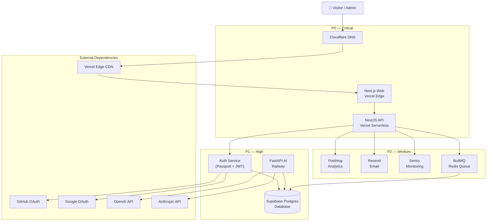

# Business Continuity Plan

> **Document:** `BUSINESS-CONTINUITY.md` | **Version:** 1.0 | **Last Updated:** July 2026
> **Status:** Active | **Standard:** ISO 22301 | **Owner:** Staff DevOps
> **RTO:** 4 hours | **RPO:** 1 hour | **Review Cadence:** Quarterly
> **Related:** `docs/runbooks/BackupRecovery.md`, `docs/runbooks/database-failover.md`

---

## 1. Critical Systems and Priority

| Priority | System | Service | Hosting | RTO | RPO | Max Acceptable Downtime |
|----------|--------|---------|---------|-----|-----|------------------------|
| **P0** | Public Website | Next.js Web App | Vercel (Global Edge) | < 30 min | N/A (static) | 30 minutes |
| **P0** | REST API | NestJS API | Vercel Serverless | < 1 hour | < 1 hour | 1 hour |
| **P1** | AI Chat | FastAPI AI Service | Railway (US) | < 4 hours | < 1 hour | 4 hours |
| **P1** | Admin Dashboard | Next.js (auth-guarded) | Vercel (same deploy) | < 1 hour | < 1 hour | 2 hours |
| **P2** | Analytics | PostHog (self-hosted) | PostHog Cloud | < 8 hours | < 24 hours | 24 hours |
| **P2** | Email Service | Resend API | Resend Cloud | < 4 hours | N/A (transactional) | 8 hours |
| **P2** | Error Tracking | Sentry | Sentry Cloud | < 8 hours | N/A (logs) | 24 hours |

---

## 2. Service Dependency Graph



### 2.1 Dependency Impact Analysis

| If This Fails | Impact On | Mitigation |
|---------------|-----------|------------|
| **Supabase DB** | API (all endpoints), AI chat, auth (login), admin | PITR restore within RPO; read-replica if configured |
| **Vercel** | Public website, API, admin dashboard | Static site fallback (Netlify/Vercel re-deploy from backup) |
| **Railway** | AI chat only | Graceful degradation: hide AI section on website |
| **OpenAI/Anthropic** | AI chat completions | Fallback to cached responses, disable AI section |
| **Cloudflare DNS** | Entire site unreachable | Update nameservers to backup DNS provider |
| **Redis (BullMQ)** | Background jobs (email queue, cache) | Queue can drain; operations proceed without non-critical jobs |

---

## 3. Failure Scenarios and Continuity Procedures

### 3.1 Single Service Failure: Web

| Phase | Action | Owner | Duration |
|-------|--------|-------|----------|
| **Detection** | Vercel deploy failure OR Better Uptime alerts on portfolioowner.com | DevOps | 2 min |
| **Triage** | Check Vercel dashboard: build log, deploy status, recent config changes | DevOps | 3 min |
| **Containment** | Rollback to last known-good deploy (`vercel rollback --prod`) | DevOps | 2 min |
| **Recovery** | Verify rollback: curl to homepage with expected status codes | DevOps | 3 min |
| **Recovery** | If rollback fails: re-deploy previous git tag manually | DevOps | 10 min |
| **Recovery** | Redeploy from CI: trigger `ci.yml` via workflow_dispatch on last known-good SHA | DevOps | 10 min |
| **Verification** | Run smoke test: home page, project pages, contact form render | QA | 5 min |

### 3.2 Single Service Failure: API

| Phase | Action | Owner | Duration |
|-------|--------|-------|----------|
| **Detection** | Sentry alert: 5xx rate > 5%, Better Uptime: health endpoint down | DevOps | 2 min |
| **Triage** | Check recent deploy, env var changes, DB connectivity | DevOps | 5 min |
| **Containment** | If code bug: rollback to last known-good Vercel deploy | DevOps | 2 min |
| **Containment** | If DB issue: check Supabase status page, verify connection pool | DevOps | 5 min |
| **Recovery** | Fix bug, deploy fix, verify `/api/health/liveness` returns 200 | Engineering | 30 min |
| **Verification** | Test critical endpoints: GET projects, POST contact, GET projects/[slug] | QA | 10 min |

### 3.3 Single Service Failure: AI Chat

| Phase | Action | Owner | Duration |
|-------|--------|-------|----------|
| **Detection** | Sentry alert from FastAPI, Railway deploy failure, Better Uptime on ai.portfolioowner.com | DevOps | 5 min |
| **Triage** | Check Railway dashboard: deploy logs, env vars, resource usage | DevOps | 5 min |
| **Containment** | Gracefully degrade: disable AI section on website (feature flag toggle) | DevOps | 5 min |
| **Recovery** | Redeploy AI service from CI, restore AI section | DevOps | 15 min |
| **Verification** | Test AI chat: send message, verify response received | QA | 5 min |

### 3.4 Single Service Failure: Database

| Phase | Action | Owner | Duration |
|-------|--------|-------|----------|
| **Detection** | API 5xx errors, Sentry Prisma connection errors, Supabase status page | DevOps | 2 min |
| **Triage** | Check Supabase dashboard: connection pool, resource usage, recent migrations | DevOps | 5 min |
| **Containment** | If P0: failover to read replica (if configured) OR restore from PITR | DevOps | 15 min |
| **Containment** | Enable maintenance mode on website if DB restore will exceed 15min | DevOps | 2 min |
| **Recovery** | Restore from PITR (latest backup within 1h RPO) via Supabase dashboard | DevOps | 30-60 min |
| **Recovery** | Run data integrity checks against restored DB | Engineering | 15 min |
| **Verification** | Verify API connects, queries return correct data, no data loss | QA | 10 min |

### 3.5 Cloud Provider Outage: Vercel

| Phase | Action | Owner | Duration |
|-------|--------|-------|----------|
| **Detection** | Better Uptime alerts on all Vercel-hosted endpoints, Vercel status page | DevOps | 2 min |
| **Triage** | Confirm from Vercel status page (status.vercel.com) that outage is platform-wide | DevOps | 2 min |
| **Containment** | Fallback DNS to static site on Netlify (see §4 manual fallback) | DevOps | 10 min |
| **Recovery** | Wait for Vercel recovery; redeploy from CI once platform restores | DevOps | varies |
| **Verification** | Switch DNS back to Vercel, verify all endpoints | QA | 5 min |

### 3.6 Cloud Provider Outage: Supabase

| Phase | Action | Owner | Duration |
|-------|--------|-------|----------|
| **Detection** | API connection errors, Supabase status page (status.supabase.com) | DevOps | 2 min |
| **Triage** | Check Supabase status: is it region-specific or full platform outage? | DevOps | 2 min |
| **Containment** | If extended outage (> 1h): restore from backup to alternative Postgres host (Railway Postgres or Neon) | DevOps | 60 min |
| **Recovery** | Update DATABASE_URL to alternative host, redeploy API | DevOps | 10 min |
| **Reversion** | When Supabase recovers, migrate data back and switch DATABASE_URL | DevOps | 60 min |

### 3.7 Complete Region Failure

| Phase | Action | Owner | Duration |
|-------|--------|-------|----------|
| **Detection** | Multiple service alerts simultaneously, cloud provider regional incident | IC | 2 min |
| **Triage** | Confirm via provider status pages, activate full DR plan | IC | 5 min |
| **Containment** | Deploy static site to alternate region/cloud (see §4) | DevOps | 30 min |
| **Containment** | If DB affected: restore from cross-region backup | DevOps | 60 min |
| **Recovery** | Gradually restore services in alternate region | Engineering | 4h (RTO) |
| **Verification** | Full smoke test suite against alternate region | QA | 30 min |

---

## 4. Manual Fallback Procedures

### 4.1 Static Site Hosting (when Vercel is down)

Prerequisites: Netlify account with CLI installed, pre-built static export of website.

```bash
# Build and deploy static version
cd apps/web
npm run build:static   # next build && next export (if supported)
npx netlify deploy --prod --dir=out

# Or if using pre-built artifact
npx netlify deploy --prod --dir=backup/static-site-2026-07-11

# Update DNS if using custom domain
# Cloudflare → DNS → Change CNAME from portfolioowner.vercel.app to portfolioowner.netlify.app
```

### 4.2 Database Backup Restore (when Supabase is down)

Supabase PITR backups are automatically taken. Manual restore:

```bash
# Step 1: Access Supabase Dashboard → Database → Backups
# Step 2: Select backup point (within 1h RPO)
# Step 3: Click "Restore" to create new database instance
# Step 4: Get new connection string from restored instance
# Step 5: Update DATABASE_URL in Vercel and Railway
# Step 6: Redeploy API service
```

For raw `pg_dump` backups (manual safety net):

```bash
# Scheduled via cron: pg_dump --no-owner --clean $DATABASE_URL > backup/$(date +%F-%H-%M).sql

# Restore
psql $NEW_DATABASE_URL < backup/2026-07-11-14-00.sql
```

### 4.3 Alternative AI Provider

If both OpenAI and Anthropic are unavailable:

1. Feature-flag AI section to disabled state (show "AI Chat Unavailable" message)
2. No automatic fallback — both providers are needed for existing integrations
3. Cache last-known-good responses in Redis for limited offline capability

---

## 5. Communication Plan

### 5.1 During Active Outage

| Time Elapsed | Action | Channel | Recipients | Template |
|-------------|--------|---------|------------|----------|
| T+0min | Automated alert triggers | Telegram #security-alerts | On-call DevOps | {Service} DOWN — {details} |
| T+5min | Acknowledge incident | Telegram #incident-war-room | Incident team | Investigating {service} outage |
| T+10min | Initial status update | Telegram #ops | All team | {Service} status: {impact}, ETA: {time} |
| T+15min | If extended: update status page | Better Uptime Status Page | Public | Investigating issues with {service} |
| T+30min | Update status page | Better Uptime Status Page | Public | {Service} experiencing {issue}, mitigation in progress |
| T+60min | If still down: email stakeholders | Email | admin@portfolio.dev | Outage update: {details}, expected resolution: {time} |
| T+recovery | Service restored | All channels | All | {Service} is operational again |

### 5.2 Post-Recovery

```text
📬 POST-RECOVERY NOTIFICATION

Service: [Service name]
Outage duration: [Start → End UTC]
Root cause: [Brief description]
Resolution: [Action taken]
Data loss: [None / X minutes of data]
Action items: [Link to post-mortem ticket]

Next steps:
1. Post-mortem scheduled for [Date]
2. [Hardening action in progress]
3. Runbook updated with lessons learned
```

---

## 6. Post-Recovery Verification Checklist

- [ ] Public website loads correctly (HTTP 200, all assets render)
- [ ] API health endpoints return 200 (`/api/health/liveness`, `/api/health/readiness`)
- [ ] Admin dashboard accessible, login works (OAuth + JWT)
- [ ] Database queries return expected data
- [ ] AI chat processes messages end-to-end
- [ ] Contact form submissions succeed (email delivery)
- [ ] Analytics events being recorded (PostHog)
- [ ] Error events being captured (Sentry)
- [ ] Background jobs processing (BullMQ queues)
- [ ] Cron/scheduled tasks executing on time
- [ ] SSL certificates valid (no expiry within 30 days)
- [ ] CDN cache warming complete (Vercel ISR)
- [ ] Rate limiting back to normal thresholds
- [ ] No residual error rate > 1% in Sentry
- [ ] Env vars verified across all environments

---

## 7. Testing Schedule

| Test Type | Frequency | Scope | Scenarios | Success Criteria |
|-----------|-----------|-------|-----------|------------------|
| **Tabletop exercise** | Quarterly | Review BCP with team, walk through 2-3 failure scenarios | Web outage, API outage, DB failover | All participants understand roles and procedures |
| **DB restore drill** | Quarterly | Restore PITR backup to test DB | Accidental data deletion, DB corruption | RPO ≤ 1h, RTO ≤ 1h |
| **DNS failover drill** | Semi-annual | Switch to backup DNS provider | Cloudflare outage | TTL propagation < 5min |
| **Secret rotation drill** | Quarterly | Rotate one secret end-to-end | Compromise response | Rotation completes in < 15min |
| **Full DR drill** | Annual | Complete failover to backup region | Region-wide cloud outage | All P0 services restored within RTO (4h), RPO (1h) |
| **Static site deploy** | Annual | Deploy static fallback | Vercel platform outage | Static site online in < 30min |
| **Dependency outage test** | Annual | Block OpenAI/Anthropic API access | Provider outage | Graceful degradation, no cascading failures |

### 7.1 Tabletop Agenda (Quarterly, 60 min)

| Duration | Activity | Lead |
|----------|----------|------|
| 10 min | Review BCP changes since last quarter | DevOps Lead |
| 10 min | Scenario 1: Walk through [chosen scenario] | Security Lead |
| 10 min | Scenario 2: Walk through [chosen scenario] | Security Lead |
| 10 min | Identify gaps in coverage | All |
| 10 min | Assign action items | DevOps Lead |
| 10 min | Update BCP with new findings | DevOps Lead |

### 7.2 Annual Full Drill Schedule

| Time | Activity | Location |
|------|----------|----------|
| 09:00 | Simulate total Vercel + Supabase outage | #incident-war-room |
| 09:15 | Trigger DR plan, deploy static fallback | Netlify + Railway Postgres |
| 10:00 | Restore primary services in alternate region | CI + infra scripts |
| 12:00 | Service verification smoke tests | Automated + manual |
| 13:00 | Fail-back to primary region | DNS update, DB re-sync |
| 14:00 | Post-drill retrospective | All team |
| 15:00 | Published post-drill report | DevOps Lead |

---

## 8. Improvement Log

| Date | Improvement | Source | Owner | Status |
|-----|-------------|--------|-------|--------|
| July 2026 | Initial BCP creation | Baseline | DevOps Lead | ✅ Active |
| — | [Next quarterly improvement] | — | — | ⏳ Pending |

## Cross-References
- [MASTER-INDEX.md](../MASTER-INDEX.md) — Documentation master index
- [CROSS-REFERENCE-INDEX.md](../26-reference/CROSS-REFERENCE-INDEX.md) — Cross-reference system
