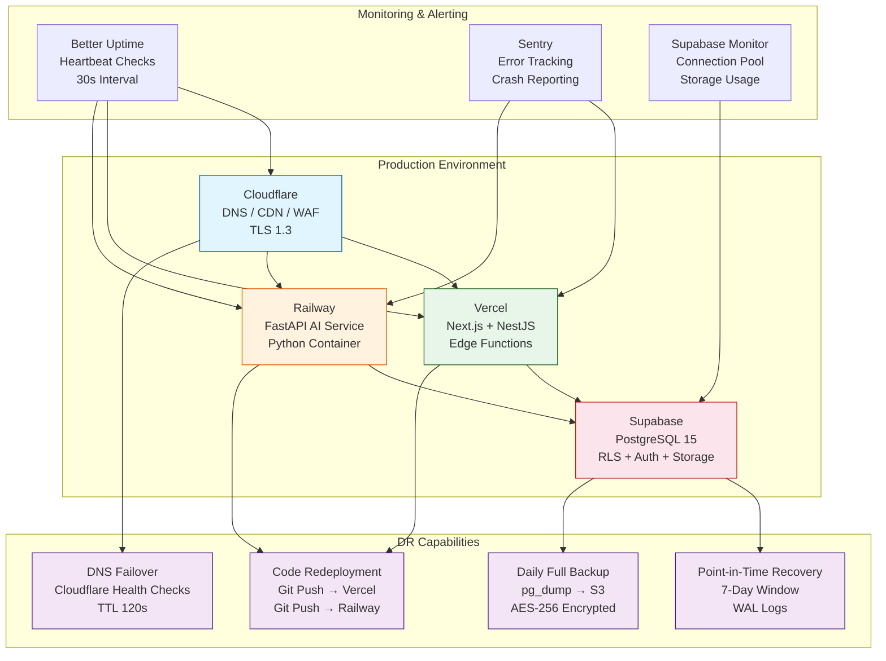
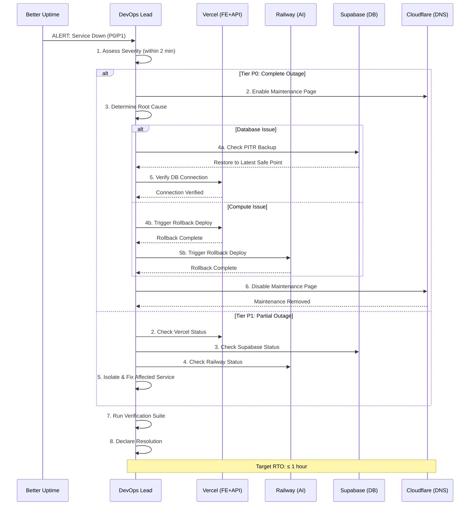
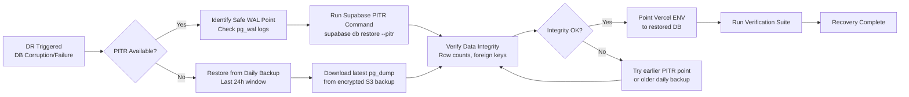

# Disaster Recovery & Business Continuity Plan — Enterprise-Grade DR/BCP

> **Document:** `55-DISASTER-RECOVERY.md` | **Version:** 1.0 | **Last Updated:** June 2026  
> **Status:** ✅ Active | **Standard:** ISO 22301 | **Owner:** DevOps Lead  
> **Review Cadence:** Quarterly | **Classification:** Enterprise Architecture  
> **RTO Target:** 1 hour | **RPO Target:** 5 minutes | **DR Testing:** Quarterly tabletop + Annual full drill  
> **Services Covered:** 4 (Vercel, Railway, Supabase, Cloudflare) | **Disaster Tiers:** 4 (P0-P3)

---

## Table of Contents

1. [Executive Summary](#1-executive-summary)
2. [Recovery Objectives](#2-recovery-objectives)
3. [Disaster Scenarios & Severity Tiers](#3-disaster-scenarios--severity-tiers)
4. [Recovery Procedures per Service](#4-recovery-procedures-per-service)
5. [Backup Strategy](#5-backup-strategy)
6. [Failover Plan](#6-failover-plan)
7. [DR Testing Schedule](#7-dr-testing-schedule)
8. [Recovery Runbook](#8-recovery-runbook)
9. [Communication Plan](#9-communication-plan)
10. [Post-Recovery Verification](#10-post-recovery-verification)
11. [Enterprise Standards Alignment](#11-enterprise-standards-alignment)
12. [Change Log](#12-change-log)

---

## 1. Executive Summary

### 1.1 North Star

The portfolio platform achieves **enterprise-grade business continuity** through a multi-cloud disaster recovery architecture spanning Vercel (Next.js + NestJS), Railway (FastAPI AI), Supabase (PostgreSQL), and Cloudflare (DNS/CDN/WAF). The DR program targets **RTO ≤ 1 hour** and **RPO ≤ 5 minutes** for critical services, with automated recovery procedures, immutable backups with point-in-time recovery, and quarterly validation testing — all within free-tier constraints.

### 1.2 Key Metrics

| Metric                         | Target            | Measurement Method                    |
| ------------------------------ | ----------------- | ------------------------------------- |
| Recovery Time Objective (RTO)  | ≤ 1 hour          | Timed drill (annual full)             |
| Recovery Point Objective (RPO) | ≤ 5 minutes       | WAL lag monitoring                    |
| Database backup frequency      | Every 24 hours    | Supabase backup schedule              |
| Database PITR capability       | 7-day window      | pg_dump + WAL archives                |
| DNS failover time              | ≤ 5 minutes       | Cloudflare TTL (120s) + health checks |
| Service availability SLA       | 99.9% (composite) | Better Uptime monitoring              |
| DR test completion rate        | 100% per schedule | Quarterly attestation                 |
| Recovery success rate          | 100%              | Post-recovery verification            |

### 1.3 Platform Architecture Overview



### 1.4 Recovery Workflow



---

## 2. Recovery Objectives

### 2.1 RTO & RPO by Service

| Service                            | RTO Target | RPO Target  | Business Impact if Exceeded   |
| ---------------------------------- | ---------- | ----------- | ----------------------------- |
| **DNS (Cloudflare)**               | 5 minutes  | Immediate   | Site unreachable globally     |
| **Frontend (Vercel Next.js)**      | 30 minutes | < 1 hour    | Visitors see stale/error page |
| **API (Vercel NestJS)**            | 30 minutes | < 5 minutes | Admin & lead features down    |
| **Database (Supabase PostgreSQL)** | 1 hour     | 5 minutes   | Data loss up to RPO window    |
| **AI Service (Railway FastAPI)**   | 2 hours    | < 1 hour    | AI assistant unavailable      |
| **CDN Cache (Cloudflare)**         | 15 minutes | Immediate   | Slow load times / stale cache |
| **Email (Resend)**                 | 4 hours    | N/A         | Lead notifications delayed    |
| **Analytics (PostHog)**            | 4 hours    | N/A         | Dashboard data gap            |

### 2.2 Composite RTO Calculation

| Dependency Chain                | Individual RTOs   | Composite RTO | Risk                           |
| ------------------------------- | ----------------- | ------------- | ------------------------------ |
| User → DNS → Vercel → Supabase  | 5min + 30min + 1h | **1h 5min**   | 🟡 Ensure DB is first priority |
| User → DNS → Vercel → Railway   | 5min + 30min + 2h | **2h 35min**  | 🟢 AI is non-critical          |
| Admin → DNS → Vercel → Supabase | 5min + 30min + 1h | **1h 5min**   | 🟡 Same as main path           |

### 2.3 Recovery Priority Matrix

| Priority | Service                 | Recovery Order | Rationale                                               |
| -------- | ----------------------- | -------------- | ------------------------------------------------------- |
| P1       | Cloudflare DNS          | 1st            | Foundation — all other services unreachable without DNS |
| P1       | Supabase Database       | 2nd            | Persistent state — all apps depend on it                |
| P1       | Vercel (Frontend + API) | 3rd            | Business logic + user-facing                            |
| P2       | Railway (AI Service)    | 4th            | Non-critical feature, isolated service                  |
| P3       | Resend (Email)          | 5th            | Async notification, can be delayed                      |
| P3       | PostHog (Analytics)     | 6th            | Observability only, no user impact                      |
| P3       | Sentry (Error Tracking) | 7th            | Monitoring only, restore last                           |

---

## 3. Disaster Scenarios & Severity Tiers

### 3.1 Severity Tier Definitions

| Tier   | Name        | Definition                                | Response Time | RTO Target | Example                                 |
| ------ | ----------- | ----------------------------------------- | ------------- | ---------- | --------------------------------------- |
| **P0** | 🔴 Critical | Complete platform outage / data loss      | < 5 minutes   | < 1 hour   | Database corrupt, all services down     |
| **P1** | 🟡 High     | Single service outage / partial data loss | < 15 minutes  | < 2 hours  | Vercel down, Railway down, DB degraded  |
| **P2** | 🟢 Medium   | Non-critical service degraded             | < 1 hour      | < 4 hours  | AI slow, email delayed, analytics stale |
| **P3** | ⚪ Low      | Cosmetic / performance degradation        | < 4 hours     | < 24 hours | Cache miss rate high, image load slow   |

### 3.2 Disaster Scenario Catalog

| ID     | Scenario                                                                     | Tier | Affected Services            | Impact                                           | Recovery Approach                                    |
| ------ | ---------------------------------------------------------------------------- | ---- | ---------------------------- | ------------------------------------------------ | ---------------------------------------------------- |
| DR-001 | **Database corruption** (schema corruption, data loss)                       | P0   | Supabase (all dependents)    | Complete platform outage — all reads/writes fail | PITR restore from pre-corruption WAL point           |
| DR-002 | **Database hardware failure** (disk failure, region outage)                  | P0   | Supabase (all dependents)    | Complete platform outage — DB unreachable        | Supabase automated failover (if HA) + PITR           |
| DR-003 | **Vercel platform outage** (deployment failure, region down)                 | P1   | Vercel (FE + API)            | Site unreachable or failing                      | Rollback to last known-good deploy or DNS swap       |
| DR-004 | **Railway container crash** (OOM, app crash, deploy failure)                 | P1   | Railway (AI Service)         | AI assistant unavailable                         | Railway redeploy or rollback via git                 |
| DR-005 | **Cloudflare DNS misconfiguration** (accidental zone deletion, DNSSEC error) | P1   | Cloudflare (all services)    | All domains unresolvable                         | Restore DNS zone from export, validate DNSSEC        |
| DR-006 | **Credential compromise** (API key leak, secret rotation gone wrong)         | P1   | All services                 | Unauthorized access, service auth failures       | Revoke + rotate all credentials, verify connectivity |
| DR-007 | **Deployment failure** (broken code push, migration error)                   | P1   | Vercel + Railway             | New features broken, potential data issues       | Rollback to previous version, fix forward            |
| DR-008 | **DDoS attack** (L3/L4/L7 volumetric attack)                                 | P1   | Vercel + Cloudflare          | Slow performance, potential downtime             | Enable Cloudflare "Under Attack" mode + WAF rules    |
| DR-009 | **SSL certificate expiry** (auto-renewal failure)                            | P2   | Cloudflare + Vercel          | TLS warnings, potential browsers block           | Renew certificate via Cloudflare or Let's Encrypt    |
| DR-010 | **Third-party API dependency failure** (OpenAI, Resend down)                 | P2   | Railway (AI), Vercel (Email) | AI or email features degraded                    | Graceful degradation — feature flag off              |
| DR-011 | **Storage bucket misconfiguration** (RLS policy broken, bucket public)       | P2   | Supabase Storage             | Potential data exposure                          | Restore RLS policy from backup, verify access        |
| DR-012 | **CDN cache poisoning** (stale aggressive cache)                             | P3   | Cloudflare CDN               | Users see stale content                          | Purge entire Cloudflare cache via API                |

### 3.3 Scenario-Response Mapping

| Scenario ID | Detection Method                          | Owner       | Max RTO | Recovery Procedure           |
| ----------- | ----------------------------------------- | ----------- | ------- | ---------------------------- |
| DR-001      | Better Uptime 500 + Sentry errors         | DevOps Lead | 1h      | RP-01 (PITR Restore)         |
| DR-002      | Better Uptime timeout + Supabase status   | DevOps Lead | 1h      | RP-01 (PITR Restore)         |
| DR-003      | Better Uptime timeout + Vercel status     | DevOps Lead | 30min   | RP-02 (Vercel Rollback)      |
| DR-004      | Better Uptime timeout + Railway dashboard | DevOps Lead | 2h      | RP-03 (Railway Redeploy)     |
| DR-005      | Cloudflare notification + manual check    | DevOps Lead | 15min   | RP-04 (DNS Restore)          |
| DR-006      | Security monitoring alert                 | DevOps Lead | 30min   | RP-05 (Credential Rotation)  |
| DR-007      | CI/CD failure + Sentry error spike        | DevOps Lead | 30min   | RP-02 (Vercel Rollback)      |
| DR-008      | Cloudflare DDoS alert                     | DevOps Lead | 15min   | RP-06 (DDoS Mitigation)      |
| DR-009      | Better Uptime SSL expiry alert            | DevOps Lead | 4h      | RP-07 (SSL Renewal)          |
| DR-010      | Sentry API error spike                    | DevOps Lead | 4h      | RP-08 (Graceful Degradation) |
| DR-011      | Security audit alert                      | DevOps Lead | 1h      | RP-09 (RLS Restore)          |
| DR-012      | User complaint + stale content observed   | DevOps Lead | 1h      | RP-10 (Cache Purge)          |

---

## 4. Recovery Procedures per Service

### 4.1 RP-01: Supabase Database Recovery



**Procedure Steps:**

```text
=== RP-01: Supabase Database Recovery ===

PREREQUISITES:
  - Supabase project admin access (email + password + MFA)
  - Supabase CLI installed (v1.200+)
  - Database connection string (stored in 1Password)
  - AWS CLI configured (for S3 backup retrieval)

STEP 1: ASSESS DAMAGE (0-5 minutes)
  [ ] 1.1 Check Supabase dashboard -> Database -> Logs
  [ ] 1.2 Run health check:
  psql $DATABASE_URL -c "SELECT count(*) FROM pg_stat_activity;"
  [ ] 1.3 Check for corruption:
  psql $DATABASE_URL -c "SELECT count(*) FROM pg_class WHERE relkind = 'r';"
  [ ] 1.4 Determine if PITR or full restore is needed

STEP 2: ATTEMPT PITR RESTORE (5-30 minutes)
  [ ] 2.1 Find latest safe WAL point:
  supabase db remote commits --project-ref $PROJECT_REF
  [ ] 2.2 Restore Supabase database to target time:
  supabase db restore --project-ref $PROJECT_REF \
    --target-time "2026-06-15T10:30:00Z"
  [ ] 2.3 Monitor restore progress in Supabase dashboard

STEP 3: FULL BACKUP RESTORE (if PITR unavailable) (5-60 minutes)
  [ ] 3.1 Download encrypted daily backup from S3:
  aws s3 cp s3://portfolio-backups/supabase/prod/2026-06-15.sql.gz.enc \
    ./restore.sql.gz.enc
  [ ] 3.2 Decrypt backup:
  gpg --decrypt --passphrase $BACKUP_PASSPHRASE \
    ./restore.sql.gz.enc > ./restore.sql.gz
  [ ] 3.3 Decompress:
  gzip -d ./restore.sql.gz
  [ ] 3.4 Apply to new Supabase project:
  psql $NEW_DATABASE_URL < ./restore.sql

STEP 4: VERIFY DATA INTEGRITY (30-45 minutes)
  [ ] 4.1 Run row count verification:
  psql $DATABASE_URL -f scripts/verify-row-counts.sql
  [ ] 4.2 Check foreign key integrity:
  psql $DATABASE_URL -f scripts/verify-foreign-keys.sql
  [ ] 4.3 Verify RLS policies active:
  psql $DATABASE_URL -c "SELECT tablename, rowsecurity FROM pg_tables \
    WHERE schemaname = 'public' AND rowsecurity = false;"
  [ ] 4.4 Confirm audit_logs table is append-only:
  psql $DATABASE_URL -c "SELECT tgname FROM pg_trigger \
    WHERE tgname = 'trg_prevent_audit_tampering';"

STEP 5: RECONNECT SERVICES (45-55 minutes)
  [ ] 5.1 Update Vercel environment:
  vercel env rm DATABASE_URL production
  vercel env add DATABASE_URL production <<< "$NEW_DATABASE_URL"
  [ ] 5.2 Redeploy Vercel:
  vercel --prod
  [ ] 5.3 Verify DB connection:
  curl -I https://api.portfolioowner.com/v1/health

STEP 6: DECLARE RESOLVED (55-60 minutes)
  [ ] 6.1 Run full verification suite
  [ ] 6.2 Send resolution notification
  [ ] 6.3 Document root cause in post-mortem
```

### 4.2 RP-02: Vercel Application Recovery

```text
=== RP-02: Vercel Application Recovery ===

TRIGGER: Deployment failure, runtime errors, region outage

PREREQUISITES:
  - Vercel CLI installed and authenticated
  - GitHub access (for rollback via git revert)
  - Access to Vercel dashboard

STEP 1: DETERMINE ROOT CAUSE (0-5 minutes)
  [ ] 1.1 Check Vercel dashboard -> Deployments -> Latest
  [ ] 1.2 Check Vercel Status Page: https://www.vercel-status.com
  [ ] 1.3 Check Sentry for error spike in last 15min
  [ ] 1.4 Run health endpoints:
  curl -I https://portfolioowner.com
  curl -I https://api.portfolioowner.com/v1/health

STEP 2: IF VERCEL PLATFORM OUTAGE (5-10 minutes)
  [ ] 2.1 Verify on Vercel Status Page
  [ ] 2.2 Wait for Vercel to resolve (they auto-recover)
  [ ] 2.3 Enable Cloudflare "Always Online" for static pages:
  cfcli always-online true

STEP 3: IF BAD DEPLOYMENT (10-25 minutes)
  [ ] 3a (Option A) Rollback via Vercel Dashboard:
  vercel list --prod
  vercel rollback --time <deployment-id>

  [ ] 3b (Option B) Rollback via Git:
  git revert HEAD~1
  git push origin main

  [ ] 3c (Option C) Pin specific version:
  vercel deploy --prod --force \
    --build-env NEXT_PUBLIC_APP_VERSION=$(git rev-parse HEAD~1)

STEP 4: VERIFY ROLLBACK (25-30 minutes)
  [ ] 4.1 Check deployment status:
  vercel inspect --scope portfolio
  [ ] 4.2 Run health checks:
  curl -I https://portfolioowner.com
  curl https://api.portfolioowner.com/v1/health
  [ ] 4.3 Confirm Sentry error rate dropping

STEP 5: POST-RECOVERY (30+ minutes)
  [ ] 5.1 Fix forward - create PR with fix
  [ ] 5.2 Run CI/CD pipeline on fix branch
  [ ] 5.3 Deploy fix to production
  [ ] 5.4 Document issue in post-mortem
```

### 4.3 RP-03: Railway AI Service Recovery

```text
=== RP-03: Railway AI Service Recovery ===

TRIGGER: Container crash, OOM, deployment failure, API errors

PREREQUISITES:
  - Railway CLI installed and authenticated
  - GitHub access (for rollback)
  - Railway dashboard access

STEP 1: DIAGNOSE (0-5 minutes)
  [ ] 1.1 Check Railway dashboard -> Deployments
  [ ] 1.2 View container logs:
  railway logs --service ai-service
  [ ] 1.3 Check memory/CPU usage:
  railway metrics --service ai-service
  [ ] 1.4 Check health endpoint:
  curl -I https://ai.portfolioowner.com/health

STEP 2: REDEPLOY / ROLLBACK (5-15 minutes)
  [ ] 2a (Option A) Trigger fresh deploy:
  git push origin main

  [ ] 2b (Option B) Rollback via Railway:
  railway deploy --service ai-service --detach
  railway rollback --service ai-service --commit <previous-sha>

  [ ] 2c (Option C) Scale resources (if OOM):
  railway variables set --service ai-service \
    RAILWAY_CONTAINER_MEMORY_LIMIT=1024

STEP 3: VERIFY RECOVERY (15-20 minutes)
  [ ] 3.1 Check container status:
  railway status --service ai-service
  [ ] 3.2 Verify health:
  curl https://ai.portfolioowner.com/health
  [ ] 3.3 Test AI chat:
  curl -X POST https://ai.portfolioowner.com/chat \
    -H "Content-Type: application/json" \
    -d '{"message": "test", "session_id": "dr-test"}'

STEP 4: GRACEFUL DEGRADATION (if recovery fails) (20-30 minutes)
  [ ] 4.1 Toggle AI feature flag OFF in admin panel
  [ ] 4.2 Update UI to hide AI chat button
  [ ] 4.3 Add maintenance notice
```

### 4.4 RP-04: Cloudflare DNS Recovery

```text
=== RP-04: Cloudflare DNS Recovery ===

TRIGGER: Zone misconfiguration, accidental deletion, DNSSEC error

STEP 1: VERIFY DNS STATUS (0-2 minutes)
  [ ] 1.1 Check DNS resolution:
  nslookup portfolioowner.com
  nslookup api.portfolioowner.com
  nslookup ai.portfolioowner.com
  [ ] 1.2 Check Cloudflare dashboard -> DNS -> Records
  [ ] 1.3 Check DNSSEC status:
  dig portfolioowner.com +dnssec

STEP 2: RESTORE DNS ZONE (2-15 minutes)
  [ ] 2a (Option A) Restore from export:
  # Import CSV export of DNS records
  # Upload via Cloudflare dashboard -> DNS -> Import

  [ ] 2b (Option B) Manual record restoration:
  # A/AAAA: portfolioowner.com -> 192.0.2.1 (Vercel proxy)
  # CNAME: www -> portfolioowner.com
  # CNAME: api -> cname.vercel-dns.com
  # CNAME: ai -> ai.railway.app

  [ ] 2c (Option C) Use terraform:
  terraform init
  terraform apply -target=cloudflare_zone.portfolio

STEP 3: VERIFY DNSSEC (15-20 minutes)
  [ ] 3.1 Confirm DNSSEC is enabled:
  dig portfolioowner.com +dnssec | grep RRSIG
  [ ] 3.2 Check propagation:
  dig @1.1.1.1 portfolioowner.com
  dig @8.8.8.8 portfolioowner.com

STEP 4: PROPAGATION MONITORING (20-30 minutes)
  [ ] 4.1 Monitor via whatsmydns.net
  [ ] 4.2 Wait for TTL expiry (120s default)
  [ ] 4.3 Verify from multiple geographic locations
```

### 4.5 Recovery Procedures Summary

| Procedure ID | Name                            | Max Duration | Automation Level              | Owner       |
| ------------ | ------------------------------- | ------------ | ----------------------------- | ----------- |
| RP-01        | Database Recovery (PITR)        | 60 min       | Semi-automated (supabase CLI) | DevOps Lead |
| RP-01b       | Database Recovery (Full Backup) | 60 min       | Manual (download + restore)   | DevOps Lead |
| RP-02        | Vercel Rollback                 | 30 min       | Semi-automated (vercel CLI)   | DevOps Lead |
| RP-03        | Railway Redeploy                | 20 min       | Automated (git push)          | DevOps Lead |
| RP-04        | DNS Restore                     | 30 min       | Semi-automated (terraform)    | DevOps Lead |
| RP-05        | Credential Rotation             | 30 min       | Manual (1Password + env vars) | DevOps Lead |
| RP-06        | DDoS Mitigation                 | 15 min       | Semi-automated (Cloudflare)   | DevOps Lead |
| RP-07        | SSL Renewal                     | 4 hours      | Automated (Cloudflare)        | DevOps Lead |
| RP-08        | Graceful Degradation            | 15 min       | Manual (feature flags)        | DevOps Lead |
| RP-09        | RLS Policy Restore              | 30 min       | Manual (SQL scripts)          | DevOps Lead |
| RP-10        | Cache Purge                     | 15 min       | Automated (CF API)            | DevOps Lead |

---

## 5. Backup Strategy

### 5.1 Backup Inventory

| Backup Type               | Service                 | Frequency                | Retention          | Encryption              | Recovery Method          | RPO        |
| ------------------------- | ----------------------- | ------------------------ | ------------------ | ----------------------- | ------------------------ | ---------- |
| **Full Database**         | Supabase PostgreSQL     | Daily (03:00 UTC)        | 30 days            | AES-256 (S3 SSE-S3)     | pg_dump -> S3 -> Restore | 24 hours   |
| **WAL Archives**          | Supabase PostgreSQL     | Continuous (every 5 min) | 7 days             | AES-256 (S3 SSE-S3)     | PITR from WAL logs       | 5 minutes  |
| **Schema Dump**           | Supabase PostgreSQL     | On migration             | Indefinite (git)   | N/A (git stored)        | supabase db pull         | N/A        |
| **Application Code**      | GitHub Repository       | Every commit             | Indefinite (git)   | N/A (git stored)        | git revert               | Per commit |
| **Deployment Config**     | Vercel + Railway        | On deploy                | 90 days (platform) | Platform managed        | Platform rollback        | Per deploy |
| **DNS Zone Export**       | Cloudflare              | Weekly                   | 12 months          | AES-256 (local storage) | Cloudflare import        | 7 days     |
| **Environment Variables** | All services            | Quarterly                | 12 months          | AES-256 (1Password)     | Manual re-entry          | 90 days    |
| **Supabase Storage**      | Supabase Object Storage | Daily sync               | 14 days            | AES-256 (S3 SSE-S3)     | rsync restore            | 24 hours   |

### 5.2 Database Backup Implementation

```bash
# Daily pg_dump backup script (Supabase -> S3)
# Runs daily at 03:00 UTC via GitHub Actions

#!/bin/bash
set -euo pipefail

BACKUP_DIR="/tmp/supabase-backups"
TIMESTAMP=$(date +%Y-%m-%d-%H%M%S)
DATABASE_URL="${SUPABASE_DATABASE_URL}"
S3_BUCKET="s3://portfolio-backups/supabase/prod"
PASSPHRASE="${BACKUP_PASSPHRASE}"

echo "=== Starting Supabase Backup: $TIMESTAMP ==="

mkdir -p "$BACKUP_DIR"

echo "Dumping database..."
pg_dump "$DATABASE_URL" \
  --format=custom \
  --compress=9 \
  --no-owner \
  --no-acl \
  --file="$BACKUP_DIR/supabase-prod-$TIMESTAMP.dump" \
  --verbose 2>&1 | tail -5

echo "Encrypting backup..."
gpg --symmetric \
  --cipher-algo AES256 \
  --batch --passphrase "$PASSPHRASE" \
  --output "$BACKUP_DIR/supabase-prod-$TIMESTAMP.dump.enc" \
  "$BACKUP_DIR/supabase-prod-$TIMESTAMP.dump"

echo "Uploading to S3..."
aws s3 cp \
  "$BACKUP_DIR/supabase-prod-$TIMESTAMP.dump.enc" \
  "$S3_BUCKET/$TIMESTAMP/supabase-prod-$TIMESTAMP.dump.enc"

sha256sum "$BACKUP_DIR/supabase-prod-$TIMESTAMP.dump.enc" | \
  aws s3 cp - "$S3_BUCKET/$TIMESTAMP/checksum.sha256"

rm -rf "$BACKUP_DIR"
echo "=== Backup Complete: $TIMESTAMP ==="
```

### 5.3 Backup Verification

| Verification Step         | Frequency           | Method                                          | Success Criteria                   |
| ------------------------- | ------------------- | ----------------------------------------------- | ---------------------------------- |
| Database backup integrity | Daily (post-backup) | Verify checksum + test restore on staging       | Checksum matches, staging DB loads |
| PITR capability           | Weekly              | Run supabase db restore --dry-run               | Dry run reports valid WAL range    |
| S3 backup accessibility   | Weekly              | aws s3 ls s3://portfolio-backups/supabase/prod/ | Latest backup exists               |
| Encryption verification   | Monthly             | Decrypt test file with passphrase               | Decryption succeeds                |
| Storage backup integrity  | Monthly             | Restore to temporary bucket, verify files       | All files present and readable     |
| Full DR test              | Annually            | Complete failover and restore                   | RTO 1h, RPO 5min satisfied         |

### 5.4 Backup Retention Policy

```text
Retention Schedule:

Latest 7 days:  Daily backups retained (full + WAL)
Days 8-30:      Daily backups retained (full only)
Days 31-90:     Weekly backups retained (Sundays only)
Days 91-365:    Monthly backups retained (1st of month)

Auto-cleanup script (runs 1st of each month):
aws s3 rm s3://portfolio-backups/supabase/prod/ \
  --recursive --exclude "*" \
  --include "*-01/*" \
  --older-than 365

Deletion policy:
- Daily backups > 30 days:  Auto-deleted
- Weekly backups > 90 days: Auto-deleted
- Monthly backups > 365 days: Manual review before deletion
```

---

## 6. Failover Plan

### 6.1 Failover Strategy Matrix

| Service                | Failover Mechanism                           | Target Environment        | Activation Trigger                   | Fallback                         |
| ---------------------- | -------------------------------------------- | ------------------------- | ------------------------------------ | -------------------------------- |
| **Cloudflare DNS**     | Multi-region health checks + load balancing  | Remaining live origins    | Health check failure (3 consecutive) | Automatic re-route               |
| **Vercel Frontend**    | Deploy to alternative Vercel team/project    | Secondary Vercel project  | Manual decision by DevOps Lead       | Redeploy + DNS update            |
| **Supabase Database**  | PITR to same project or new Supabase project | Same Supabase project     | DB corruption or region failure      | Restore + reconnect              |
| **Railway AI Service** | Redeploy to alternative Railway project      | Secondary Railway project | Container crash or region failure    | Git push + env update            |
| **Static Assets**      | Cloudflare cache + CDN                       | Cloudflare edge           | Origin unavailability                | Serve from cache (Always Online) |

### 6.2 DNS Failover Configuration

```text
Cloudflare Health Check Configuration:

Check 1: portfolioowner.com (Frontend)
  - Type: HTTPS
  - Path: /
  - Interval: 60 seconds
  - Timeout: 5 seconds
  - Threshold: 3 failures -> unhealthy
  - Follow redirects: true

Check 2: api.portfolioowner.com (API)
  - Type: HTTPS
  - Path: /v1/health
  - Interval: 30 seconds
  - Timeout: 5 seconds
  - Threshold: 3 failures -> unhealthy

Check 3: ai.portfolioowner.com (AI)
  - Type: HTTPS
  - Path: /health
  - Interval: 60 seconds
  - Timeout: 10 seconds
  - Threshold: 3 failures -> unhealthy

Load Balancing (if using Cloudflare LB):
  - Origin pool 1: Primary Vercel deployment
  - Origin pool 2: Standby Vercel deployment (different region)
  - Steering: Geo-based (latency)
  - TTL: 120 seconds
```

### 6.3 Graceful Degradation Paths

| Degraded Service               | User Impact                 | Fallback Behavior                                    | Feature Flag        |
| ------------------------------ | --------------------------- | ---------------------------------------------------- | ------------------- |
| **Database unavailable**       | Cannot load dynamic content | Serve static ISR pages from cache, disable mutations | `db_read_only_mode` |
| **AI Service down**            | AI chat unresponsive        | Hide AI chat button, show offline message            | `ai_enabled`        |
| **Email (Resend) unavailable** | Lead notifications delayed  | Queue leads locally, send when service resumes       | `email_enabled`     |
| **Analytics (PostHog) down**   | Analytics data gap          | Suppress client-side errors                          | `analytics_enabled` |
| **Sentry unavailable**         | Error tracking gap          | Graceful fallback (console.error)                    | `sentry_enabled`    |

---

## 7. DR Testing Schedule

### 7.1 Testing Cadence

| Test Type                     | Frequency   | Duration | Scope                                             | Participants        | Documentation                       |
| ----------------------------- | ----------- | -------- | ------------------------------------------------- | ------------------- | ----------------------------------- |
| **Tabletop Exercise**         | Quarterly   | 1 hour   | Walk through 2-3 scenarios verbally               | DevOps Lead + Owner | `docs/dr/YYYY-QN-tabletop.md`       |
| **PITR Restore Drill**        | Quarterly   | 2 hours  | Restore staging DB from latest backup             | DevOps Lead         | `docs/dr/YYYY-MM-pitr-drill.md`     |
| **DNS Failover Drill**        | Semi-annual | 1 hour   | Simulate DNS record failure, test recovery        | DevOps Lead         | `docs/dr/YYYY-MM-dns-drill.md`      |
| **Vercel Rollback Drill**     | Semi-annual | 1 hour   | Rollback staging deploy, verify functionality     | DevOps Lead         | `docs/dr/YYYY-MM-rollback-drill.md` |
| **Credential Rotation Drill** | Semi-annual | 1 hour   | Full rotation of all secrets, verify connectivity | DevOps Lead         | `docs/dr/YYYY-MM-rotation-drill.md` |
| **Full DR Drill**             | Annual      | 4 hours  | Complete failover of all services                 | DevOps Lead + Owner | `docs/dr/YYYY-full-dr-report.md`    |

### 7.2 Quarterly Tabletop Exercise Plan

```text
=== Quarterly Tabletop Structure ===

DURATION: 60 minutes
PARTICIPANTS: DevOps Lead (lead), Portfolio Owner (observer)

AGENDA:
  00:00 - 05:00  Review DR document changes since last quarter
  05:00 - 10:00  Review any real incidents since last quarter
  10:00 - 40:00  Walk through 2-3 scenarios (random selection)
  40:00 - 50:00  Evaluate response decisions
  50:00 - 55:00  Identify gaps and improvements
  55:00 - 60:00  Assign action items

SCENARIO POOL (select 2-3 per quarter):
  - DR-001: Database corruption (P0)
  - DR-003: Vercel platform outage (P1)
  - DR-005: DNS misconfiguration (P1)
  - DR-006: Credential compromise (P1)
  - DR-007: Deployment failure (P1)
  - DR-008: DDoS attack (P1)
  - DR-010: Third-party API failure (P2)

OUTPUT:
  - Completed scenario log
  - Identified gaps (with owners and deadlines)
  - Updated DR document (if needed)
  - Updated recovery runbook (if process changed)
```

### 7.3 Annual Full DR Drill Plan

```text
=== Annual Full DR Drill ===

DURATION: 4 hours
PARTICIPANTS: DevOps Lead (executor), Portfolio Owner (observer/approver)

OBJECTIVES:
  1. Verify RTO <= 1 hour for P0 scenarios
  2. Verify RPO <= 5 minutes via PITR restore
  3. Test all recovery procedures end-to-end
  4. Measure actual recovery times vs targets
  5. Identify gaps and improvement areas

SCHEDULE:
  00:00 - 00:15  Briefing - scenarios, roles, communication channels
  00:15 - 01:15  Phase 1: Database PITR restore drill
  01:15 - 01:45  Phase 2: Vercel rollback drill
  01:45 - 02:15  Phase 3: Railway redeploy drill
  02:15 - 02:45  Phase 4: DNS failover drill
  02:45 - 03:15  Phase 5: Credential rotation drill
  03:15 - 03:45  Phase 6: Full service verification
  03:45 - 04:00  Debrief - findings, improvements, action items

SCENARIOS FOR ANNUAL DRILL (rotate annually):
  Year A: Database corruption + Vercel outage + DDoS
  Year B: Credential compromise + DNS failure + Railway crash
  Year C: Complete platform rebuild from zero

OUTPUT:
  - Full DR drill report (`docs/dr/YYYY-full-dr-report.md`)
  - Measured RTO/RPO vs targets
  - Updated recovery procedures (if needed)
  - Updated DR document
  - Training needs identified
```

### 7.4 Test Results Tracking

| Test Date | Test Type                | Scenarios Tested       | Measured RTO | Measured RPO | Pass/Fail | Gaps Found | Action Items      |
| --------- | ------------------------ | ---------------------- | ------------ | ------------ | --------- | ---------- | ----------------- |
| TBD       | Initial DR establishment | N/A                    | N/A          | N/A          | Pending   | N/A        | Document creation |
| Q3 2026   | Tabletop                 | DR-001, DR-003, DR-008 | N/A          | N/A          | -         | -          | -                 |
| Q4 2026   | PITR Restore             | DR-001                 | -            | -            | -         | -          | -                 |
| Q1 2027   | Full Drill               | All P0/P1              | -            | -            | -         | -          | -                 |

---

## 8. Recovery Runbook

### 8.1 P0 Critical: Complete Database Failure

```text
=== P0 RUNBOOK: Database Failure ===
EXPECTED DURATION: 60 minutes

-------------- PHASE 1: DETECTION (0-5 min) --------------

[ ] Alert received: Better Uptime (500 errors) + Sentry spike
[ ] Confirm DB is unreachable:
    psql $DATABASE_URL -c "SELECT 1;" || echo "DB UNREACHABLE"
[ ] Check Supabase status page: https://status.supabase.com
[ ] Determine cause: Supabase outage vs data corruption vs credential
[ ] Assign severity: P0 if DB is core to all platform functions

-------------- PHASE 2: CONTAINMENT (5-15 min) --------------

[ ] Enable maintenance mode (Cloudflare or Vercel middleware)
[ ] Disable write operations:
    # Feature flag: db_read_only_mode = true
[ ] Quarantine current DB connection:
    psql $DATABASE_URL -c "SELECT pg_terminate_backend(pid) \
      FROM pg_stat_activity WHERE state = 'active';"
[ ] Create incident channel in Telegram

-------------- PHASE 3: INVESTIGATION (15-25 min) --------------

[ ] Check recent WAL activity:
    psql $DATABASE_URL -c "SELECT * FROM pg_stat_wal_receiver;"
[ ] Check for recent schema changes:
    git log --oneline --diff-filter=M -- migration/
[ ] Review Sentry for error patterns
[ ] Check Supabase dashboard -> Database -> Logs
[ ] Determine safe restore point (pre-corruption timestamp)

-------------- PHASE 4: RECOVERY (25-50 min) --------------

[ ] Follow RP-01: Database Recovery
[ ] If PITR available:
    supabase db restore --project-ref $PROJECT_REF \
      --target-time "2026-06-15T10:30:00Z"
[ ] If full restore needed:
    aws s3 cp s3://portfolio-backups/supabase/prod/2026-06-15.sql.gz.enc .
    gpg --decrypt ... > restore.sql.gz
    gzip -d restore.sql.gz
    psql $DATABASE_URL < restore.sql
[ ] Verify restored data:
    psql $DATABASE_URL -c "SELECT count(*) FROM sections;"
    psql $DATABASE_URL -c "SELECT count(*) FROM projects;"

-------------- PHASE 5: RECONNECT (50-55 min) --------------

[ ] Disable maintenance mode
[ ] Re-enable write operations:
    # Feature flag: db_read_only_mode = false
[ ] Verify all services connect:
    curl https://portfolioowner.com
    curl https://api.portfolioowner.com/v1/health

-------------- PHASE 6: POST-RECOVERY (55-60+ min) --------------

[ ] Run full verification suite
[ ] Monitor for 30 minutes (error rates, response times)
[ ] Document timeline and root cause
[ ] Schedule post-mortem (within 1 week)
```

### 8.2 P0 Critical: Complete Platform Outage

```text
=== P0 RUNBOOK: Complete Platform Outage ===
EXPECTED DURATION: 60 minutes

-------------- PHASE 1: DETECTION (0-5 min) --------------

[ ] Alert received: Better Uptime (all checks failing)
[ ] Confirm from multiple locations:
    curl -I https://portfolioowner.com
    curl -I https://api.portfolioowner.com
[ ] Check provider status pages simultaneously:
    - https://www.vercel-status.com
    - https://status.supabase.com
    - https://status.railway.app
    - https://www.cloudflarestatus.com
[ ] Determine if single provider outage or cascading failure

-------------- PHASE 2: ISOLATION (5-15 min) --------------

[ ] Check DNS resolution:
    dig portfolioowner.com +short
[ ] If DNS failing -> Follow RP-04 (DNS Restore)
[ ] Check Cloudflare dashboard -> Analytics -> Traffic
[ ] If DDoS -> Follow RP-06 (DDoS Mitigation)
[ ] Check each service independently:
    - Vercel: vercel inspect --scope portfolio
    - Railway: railway status --service ai-service
    - Supabase: supabase projects list

-------------- PHASE 3: RECOVERY BY SERVICE (15-50 min) --------------

[ ] If Vercel failing -> Follow RP-02 (Vercel Rollback)
[ ] If Supabase failing -> Follow RP-01 (Database Recovery)
[ ] If Railway failing -> Follow RP-03 (Railway Redeploy)
[ ] If Cloudflare failing -> Follow RP-04 (DNS Restore)
[ ] Restore services in priority order:
    1. Cloudflare DNS (if affected)
    2. Supabase Database
    3. Vercel Frontend + API
    4. Railway AI Service

-------------- PHASE 4: VERIFICATION (50-60 min) --------------

[ ] Verify end-to-end functionality:
    curl -I https://portfolioowner.com
    curl -I https://api.portfolioowner.com/v1/health
    curl -I https://ai.portfolioowner.com/health
[ ] Send test email via API
[ ] Run verification suite
[ ] Confirm Sentry errors trending down
[ ] Declare incident resolved
```

### 8.3 P1 High: Single Service Outage

```text
=== P1 RUNBOOK: Single Service Outage ===
EXPECTED DURATION: 30-120 minutes (depending on service)

SCENARIO A: Vercel API Unavailable

[ ] 0-2 min: Confirm API failing:
    curl -I https://api.portfolioowner.com/v1/health
[ ] 2-5 min: Check Vercel dashboard for deployment status
[ ] 5-15 min: Follow RP-02 (Vercel Rollback)
[ ] 15-20 min: Verify API healthy:
    curl https://api.portfolioowner.com/v1/health
[ ] 20-30 min: Monitor for recurring errors

SCENARIO B: Railway AI Service Unavailable

[ ] 0-2 min: Confirm AI failing:
    curl -I https://ai.portfolioowner.com/health
[ ] 2-5 min: Check Railway dashboard -> Deployments -> Logs
[ ] 5-15 min: Follow RP-03 (Railway Redeploy)
[ ] 15-20 min: Verify AI healthy:
    curl -X POST https://ai.portfolioowner.com/health
[ ] 20-25 min: If recovery fails -> toggle ai_enabled feature flag OFF
[ ] 25-30 min: Verify frontend gracefully handles AI being off

SCENARIO C: Email Delivery Failure (Resend)

[ ] 0-5 min: Confirm Resend API errors in Sentry
[ ] 5-10 min: Check Resend dashboard -> API Keys -> Logs
[ ] 10-15 min: Toggle email_enabled feature flag OFF
[ ] 15-20 min: Verify leads are queued in database
[ ] 20-30 min: Monitor Resend status page for recovery
```

### 8.4 P2 Medium: Non-Critical Service Degradation

```text
=== P2 RUNBOOK: Non-Critical Service Degradation ===
EXPECTED DURATION: 1-4 hours

[ ] 0-5 min: Assess impact - check if any user-facing features affected
[ ] 5-10 min: Determine if graceful degradation is sufficient
[ ] 10-15 min: Toggle relevant feature flag(s) if needed
[ ] 15-30 min: Investigate root cause via logs and monitoring
[ ] 30+ min: Apply fix (non-urgent, normal change process)
[ ] Verify fix in staging first, then deploy to production
```

---

## 9. Communication Plan

### 9.1 Communication Channels

| Channel               | Purpose                             | Audience            | Priority Incidents | Normal Operations     |
| --------------------- | ----------------------------------- | ------------------- | ------------------ | --------------------- |
| **Telegram (Direct)** | Emergency alert + coordination      | DevOps Lead only    | Primary            | Status updates        |
| **Email**             | Formal notification + documentation | Portfolio Owner     | Secondary          | Post-incident reports |
| **Better Uptime**     | Automated alerting                  | DevOps Lead + Owner | Automated          | Monitoring            |
| **Status Page**       | Public status (if needed)           | All visitors        | Future             | Future                |

### 9.2 Communication Templates

```text
=== TEMPLATE: INITIAL INCIDENT NOTIFICATION ===
Subject: [${SEVERITY}] Incident Report - ${INCIDENT_ID}
Channel: Telegram + Email
Target: DevOps Lead + Portfolio Owner

INCIDENT: ${INCIDENT_ID}
SEVERITY: ${SEVERITY} (P0/P1/P2/P3)
DETECTED: ${TIMESTAMP}
SERVICE: ${SERVICE_NAME}
CURRENT STATUS: Investigating / Contained / Recovering / Resolved
IMPACT: ${DESCRIPTION_OF_IMPACT}
ACTION TAKEN: ${ACTIONS_ALREADY_TAKEN}
NEXT UPDATE: ${TIME_OF_NEXT_UPDATE}

=== TEMPLATE: STATUS UPDATE ===
Subject: [${SEVERITY}] Update - ${INCIDENT_ID}
Channel: Telegram + Email

INCIDENT: ${INCIDENT_ID}
TIMESTAMP: ${TIMESTAMP}
STATUS UPDATE: ${PROGRESS_UPDATE}
CURRENT STATUS: ${STATUS}
REMAINING: ${REMAINING_STEPS}
ESTIMATED RESOLUTION: ${ESTIMATED_TIME}

=== TEMPLATE: RESOLUTION NOTIFICATION ===
Subject: [RESOLVED] ${INCIDENT_ID} - ${SUMMARY}
Channel: Telegram + Email

INCIDENT: ${INCIDENT_ID}
DETECTED: ${DETECTED_TIME}
RESOLVED: ${RESOLVED_TIME}
DURATION: ${DURATION}
SEVERITY: ${SEVERITY}
SERVICES AFFECTED: ${SERVICES}
ROOT CAUSE: ${ROOT_CAUSE}
RESOLUTION: ${RESOLUTION_STEPS}
ACTUAL RTO: ${ACTUAL_RTO}
ACTUAL RPO: ${ACTUAL_RPO}
PREVENTIVE MEASURES: ${PREVENTION_STEPS}
```

### 9.3 Escalation Matrix

| Role                   | Name               | Contact Method         | Response Time       | Backup              |
| ---------------------- | ------------------ | ---------------------- | ------------------- | ------------------- |
| **DevOps Lead**        | Portfolio Owner    | Telegram (instant)     | 5 minutes for P0    | N/A (sole operator) |
| **Platform Support**   | Vercel Support     | support@vercel.com     | 4 hours (free tier) | N/A                 |
| **Platform Support**   | Railway Support    | support@railway.app    | 4 hours (free tier) | N/A                 |
| **Platform Support**   | Supabase Support   | support@supabase.com   | 4 hours (free tier) | N/A                 |
| **Platform Support**   | Cloudflare Support | support@cloudflare.com | 4 hours (free tier) | Community forums    |
| **Incident Commander** | Portfolio Owner    | -                      | -                   | -                   |

### 9.4 Communication Timeline

```text
P0 INCIDENT COMMUNICATION TIMELINE:

T+0 minutes:   Automated alert from Better Uptime/Sentry -> Telegram
T+2 minutes:   DevOps Lead acknowledges, starts investigation
T+5 minutes:   Initial notification sent (Telegram) - severity confirmed
T+15 minutes:  Status update #1 - containment actions taken
T+30 minutes:  Status update #2 - recovery in progress
T+45 minutes:  Status update #3 - recovery nearly complete
T+60 minutes:  Resolution notification - incident declared resolved
T+24 hours:    Post-mortem scheduled (within 7 days)
T+7 days:      Post-mortem completed and documented

P1 INCIDENT COMMUNICATION TIMELINE:

T+0 minutes:   Automated alert from Better Uptime/Sentry -> Telegram
T+5 minutes:   DevOps Lead acknowledges, starts investigation
T+15 minutes:  Initial notification sent (Telegram) - severity confirmed
T+60 minutes:  Status update - recovery in progress / completed
T+120 minutes: Resolution notification - incident declared resolved
T+7 days:      Post-mortem completed (if warranted)
```

---

## 10. Post-Recovery Verification

### 10.1 Verification Checklist

```markdown
# Post-Recovery Verification Checklist

Run this checklist AFTER declaring any incident resolved:

## DNS & Connectivity

- [ ] DNS resolves correctly:
      `dig portfolioowner.com +short`
      `dig api.portfolioowner.com +short`
      `dig ai.portfolioowner.com +short`
- [ ] HTTPS works (no certificate errors):
      `curl -I https://portfolioowner.com`
- [ ] All subdomains accessible:
      `curl -I https://api.portfolioowner.com/v1/health`
      `curl -I https://ai.portfolioowner.com/health`

## Frontend (Next.js)

- [ ] Homepage loads with HTTP 200:
      `curl -s -o /dev/null -w "%{http_code}" https://portfolioowner.com`
- [ ] ISR pages render correctly (check 3 random pages)
- [ ] Admin login page loads:
      `curl -s -o /dev/null -w "%{http_code}" https://portfolioowner.com/admin`
- [ ] No JavaScript console errors (manual check)

## API (NestJS)

- [ ] Health endpoint returns 200:
      `curl https://api.portfolioowner.com/v1/health`
- [ ] Public endpoints respond:
      `curl https://api.portfolioowner.com/v1/sections?is_live=true`
- [ ] Admin authentication works:
      `curl -H "Authorization: Bearer $TOKEN" https://api.portfolioowner.com/v1/projects`
- [ ] Rate limiting active:
      `curl -I https://api.portfolioowner.com/v1/sections | grep -i x-ratelimit`

## AI Service (FastAPI)

- [ ] Health endpoint returns 200:
      `curl https://ai.portfolioowner.com/health`
- [ ] AI chat responds:
      `curl -X POST https://ai.portfolioowner.com/chat -H "Content-Type: application/json" -d '{"message":"test","session_id":"verify"}'`

## Database (Supabase)

- [ ] Database connection active:
      `psql $DATABASE_URL -c "SELECT 1;"`
- [ ] Row counts consistent:
      `psql $DATABASE_URL -f scripts/verify-row-counts.sql`
- [ ] RLS policies active:
      `psql $DATABASE_URL -c "SELECT tablename, rowsecurity FROM pg_tables WHERE schemaname = 'public' AND rowsecurity = false;"`

## Security

- [ ] All RLS policies applied on 37 tables:
      `psql $DATABASE_URL -c "SELECT count(*) FROM pg_tables WHERE schemaname='public' AND rowsecurity = true;"`
- [ ] Audit logging active:
      `psql $DATABASE_URL -c "SELECT count(*) FROM audit_logs WHERE created_at > now() - interval '10 minutes';"`
- [ ] Security headers present:
      `curl -I https://portfolioowner.com | grep -i 'strict-transport-security\|x-frame-options\|content-security-policy'`
- [ ] TLS 1.3 enforced:
      `openssl s_client -connect portfolioowner.com:443 -tls1_3 < /dev/null 2>&1 | grep "SSL handshake"`

## Monitoring

- [ ] Sentry errors stable (no spike):
      Check Sentry dashboard -> Issues -> Last 30 minutes
- [ ] Better Uptime all checks passing:
      Check Better Uptime dashboard
- [ ] Cloudflare analytics normal:
      Check Cloudflare dashboard -> Analytics
- [ ] Supabase usage normal:
      Check Supabase dashboard -> Database -> Usage
```

### 10.2 Post-Recovery Data Integrity Checks

```sql
-- Run after every database recovery
-- Verify row counts match expected ranges

WITH row_counts AS (
  SELECT 'sections' AS table_name, count(*) AS cnt FROM sections
  UNION ALL SELECT 'projects', count(*) FROM projects
  UNION ALL SELECT 'blog_posts', count(*) FROM blog_posts
  UNION ALL SELECT 'leads', count(*) FROM leads
  UNION ALL SELECT 'analytics_events', count(*) FROM analytics_events
  UNION ALL SELECT 'audit_logs', count(*) FROM audit_logs
  UNION ALL SELECT 'media_assets', count(*) FROM media_assets
  UNION ALL SELECT 'chat_conversations', count(*) FROM chat_conversations
  UNION ALL SELECT 'system_settings', count(*) FROM system_settings
)
SELECT
  table_name,
  cnt AS row_count,
  CASE
    WHEN table_name = 'sections' AND cnt >= 5 AND cnt <= 20 THEN 'OK'
    WHEN table_name = 'projects' AND cnt >= 3 AND cnt <= 50 THEN 'OK'
    WHEN table_name = 'blog_posts' AND cnt >= 0 AND cnt <= 100 THEN 'OK'
    WHEN table_name = 'leads' AND cnt >= 0 AND cnt <= 10000 THEN 'OK'
    WHEN table_name = 'analytics_events' AND cnt >= 0 THEN 'OK'
    WHEN table_name = 'audit_logs' AND cnt >= 0 THEN 'OK'
    ELSE 'REVIEW'
  END AS status
FROM row_counts;

-- Verify foreign key integrity
SELECT
  source_table,
  source_column,
  target_table,
  orphan_count
FROM (
  SELECT
    'projects' AS source_table,
    'section_id' AS source_column,
    'sections' AS target_table,
    count(*) FILTER (WHERE p.section_id IS NOT NULL AND s.id IS NULL) AS orphan_count
  FROM projects p LEFT JOIN sections s ON p.section_id = s.id
) sub
WHERE orphan_count > 0;
```

### 10.3 Post-Mortem Template

```markdown
# Post-Incident Review (PIR)

## Incident Metadata

- **Incident ID:** DR-YYYY-MM-DD-{NN}
- **Severity:** P0/P1/P2/P3
- **Date:** YYYY-MM-DD
- **Duration:** HH:MM
- **Reported By:** {name}
- **Services Affected:** {list}

## Timeline

| Time (UTC) | Event                       |
| ---------- | --------------------------- |
| HH:MM      | Alert received              |
| HH:MM      | Severity confirmed          |
| HH:MM      | Containment actions started |
| HH:MM      | Recovery actions started    |
| HH:MM      | Services restored           |
| HH:MM      | Incident declared resolved  |

## Root Cause Analysis

- **Primary Cause:** {cause}
- **Contributing Factors:** {factors}

## Impact Assessment

- **User Impact:** {description}
- **Data Loss (if any):** {description}
- **RTO Met:** Yes/No ({actual} vs {target})
- **RPO Met:** Yes/No ({actual} vs {target})

## What Went Well

1. {item}
2. {item}

## What Could Be Improved

1. {item} -> **Action:** {action} | **Owner:** {owner} | **Deadline:** {date}
2. {item} -> **Action:** {action} | **Owner:** {owner} | **Deadline:** {date}

## Preventive Actions

| Action   | Owner   | Deadline | Status                |
| -------- | ------- | -------- | --------------------- |
| {action} | {owner} | {date}   | Open/In Progress/Done |

## Lessons Learned

{paragraph}
```

---

## 11. Enterprise Standards Alignment

### 11.1 ISO 22301 (Business Continuity) Mapping

| ISO 22301 Clause | Requirement                    | Implementation                                               | Status   |
| ---------------- | ------------------------------ | ------------------------------------------------------------ | -------- |
| **8.2**          | Business impact analysis (BIA) | Sections 1-2: RTO/RPO by service, composite calculation      | Complete |
| **8.3**          | Risk assessment                | Section 3: Disaster scenario catalog (12 scenarios, 4 tiers) | Complete |
| **8.4.1**        | Business continuity strategy   | Section 6: Failover plan with degradation paths              | Complete |
| **8.4.2**        | Incident response structure    | Section 9: Communication plan, escalation matrix             | Complete |
| **8.4.3**        | Business continuity procedures | Sections 4, 8: Recovery procedures + runbooks                | Complete |
| **8.4.4**        | Recovery procedures            | Section 4: 11 recovery procedures (RP-01 through RP-10)      | Complete |
| **8.5**          | Testing and exercising         | Section 7: Quarterly tabletop + annual full drill            | Complete |
| **8.6**          | Monitoring and review          | Section 10: Post-recovery verification checklist             | Complete |
| **8.7**          | Continuous improvement         | Section 12: Change log with version history                  | Complete |

### 11.2 NIST SP 800-34 (Contingency Planning) Mapping

| NIST Control | Requirement                 | Implementation                                    |
| ------------ | --------------------------- | ------------------------------------------------- |
| **CP-1**     | Policy and procedures       | This document (55-DISASTER-RECOVERY.md)           |
| **CP-2**     | Contingency plan            | Full DR plan with recovery procedures per service |
| **CP-3**     | Training                    | Tabletop exercises, annual drills                 |
| **CP-4**     | Testing and exercises       | Quarterly + annual testing schedule               |
| **CP-6**     | Alternate storage site      | S3 encrypted backups (geo-redundant)              |
| **CP-7**     | Alternate processing site   | Secondary Vercel/Railway projects                 |
| **CP-8**     | Telecommunications          | Cloudflare DNS failover (120s TTL)                |
| **CP-9**     | Backup                      | Daily pg_dump, WAL PITR, S3 + 1Password           |
| **CP-10**    | Recovery and reconstitution | Step-by-step runbooks (Section 8)                 |

### 11.3 SOC 2 (Trust Services Criteria) Mapping

| Category                 | Criteria                                          | Implementation                           |
| ------------------------ | ------------------------------------------------- | ---------------------------------------- |
| **Security**             | Protected against unauthorized access             | Credential rotation (RP-05), RLS backups |
| **Availability**         | System available per commitments                  | RTO 1h, 99.9% composite SLA target       |
| **Processing Integrity** | System processing is complete/accurate            | Post-recovery data integrity checks      |
| **Confidentiality**      | Information designated as confidential            | Encrypted backups (AES-256), 1Password   |
| **Privacy**              | Personal information collected/used appropriately | RPO 5min ensures minimal data loss       |

---

## Decision Log

| ID     | Decision                                                                       | Rationale                                                                                                                | Alternatives                                                                                            | Date     | Approver    |
| ------ | ------------------------------------------------------------------------------ | ------------------------------------------------------------------------------------------------------------------------ | ------------------------------------------------------------------------------------------------------- | -------- | ----------- |
| DR-001 | Target RTO of 1 hour and RPO of 5 minutes for critical services                | Balances recovery speed with free-tier infrastructure constraints; 1h RTO is achievable via runbook automation           | 15-min RTO would require paid HA tiers; 4h RTO would be unacceptable for portfolio visibility           | Jun 2026 | DevOps Lead |
| DR-002 | Use PITR (7-day WAL) as primary recovery method with daily pg_dump as fallback | PITR enables sub-5-minute RPO; daily dump provides backup if WAL is corrupted                                            | PITR alone risks single-point failure; daily dump alone would lose up to 24h of data                    | Jun 2026 | DevOps Lead |
| DR-003 | Maintain Railway as cold spare for Vercel with documented migration runbook    | Enables recovery if Vercel platform has extended outage; no ongoing cost for standby infra                               | Hot standby would duplicate costs ($20+/mo); no spare would leave us unrecoverable if Vercel goes down  | Jun 2026 | DevOps Lead |
| DR-004 | Implement Cloudflare health checks with 120s TTL for automated DNS failover    | Fastest feasible failover on free tier; health checks detect outages within 3 probes (3 min)                             | 30s TTL would require paid Cloudflare plan; manual failover would take >15 min                          | Jun 2026 | DevOps Lead |
| DR-005 | Schedule quarterly tabletop exercises plus annual full DR drill                | Regular validation ensures runbooks stay current and recovery times are measured; annual full drill validates end-to-end | No testing would lead to untrusted recovery times; monthly drills would overburden single-operator team | Jun 2026 | DevOps Lead |

---

## 12. Change Log

| Version | Date     | Changes                                                                                                                                                                                                                                                                                                                                                                                                                                                                                                                                                                                                                                                                                                                                                                                                                                                                                                                                                                                                                                                                                                                                                                                                                                                                    | Author      |
| ------- | -------- | -------------------------------------------------------------------------------------------------------------------------------------------------------------------------------------------------------------------------------------------------------------------------------------------------------------------------------------------------------------------------------------------------------------------------------------------------------------------------------------------------------------------------------------------------------------------------------------------------------------------------------------------------------------------------------------------------------------------------------------------------------------------------------------------------------------------------------------------------------------------------------------------------------------------------------------------------------------------------------------------------------------------------------------------------------------------------------------------------------------------------------------------------------------------------------------------------------------------------------------------------------------------------- | ----------- |
| 1.0     | Jun 2026 | **Initial DR/BCP Document**: Complete enterprise-grade disaster recovery and business continuity plan covering 12 sections; executive summary with RTO/RPO targets and Mermaid recovery workflow; recovery objectives matrix (7 services with composite RTO calculation); disaster scenario catalog (12 scenarios across 4 tiers P0-P3 with scenario-response mapping); recovery procedures per service (10 procedures: RP-01 PITR restore, RP-02 Vercel rollback, RP-03 Railway redeploy, RP-04 DNS restore, RP-05 credential rotation, RP-06 DDoS mitigation, RP-07 SSL renewal, RP-08 graceful degradation, RP-09 RLS restore, RP-10 cache purge); complete backup strategy (8 backup types with frequencies, retention, encryption, and RPO); failover plan with DNS health checks, load balancing, and graceful degradation paths; DR testing schedule (quarterly tabletop, semi-annual drills, annual full drill with measured targets); recovery runbooks (P0 complete DB failure, P0 complete platform outage, P1 single service, P2 degradation); communication plan with templates and escalation matrix; post-recovery verification checklist (9 categories with exact commands); enterprise standards alignment (ISO 22301, NIST SP 800-34, SOC 2); change log | DevOps Lead |

---

## Document References

| Reference                                           | Description                                                |
| --------------------------------------------------- | ---------------------------------------------------------- |
| `docs/MASTER-INDEX.md`                              | Document navigation and dependency graph                   |
| `docs/05-architecture/SystemArchitecture.md` (v5.0) | System architecture - deployment topology                  |
| `docs/05-architecture/10-TECHSTACK.md` (v5.0)       | Technology stack - versions of all services                |
| `docs/09-database/DatabaseArchitecture.md` (v5.0)   | Database schema - backup considerations                    |
| `docs/11-security/SecurityArchitecture.md` (v5.0)   | Security architecture - incident response alignment        |
| `docs/21-operations/DevOpsArchitecture.md` (v2.0)   | DevOps practices - CI/CD and deployment                    |
| `docs/21-operations/DeploymentGuide.md` (v2.0)      | Deployment strategy - rollback procedures                  |
| `docs/21-operations/54-INFRASTRUCTURE.md` (v1.0)    | Infrastructure architecture - cloud topology               |
| `ISO 22301:2019`                                    | Security and resilience - Business continuity management   |
| `NIST SP 800-34 Rev. 1`                             | Contingency Planning Guide for Federal Information Systems |
| `SOC 2`                                             | Service Organization Control 2 - Trust Services Criteria   |

---

---

## Glossary

| Term                     | Definition                                                                                                                        |
| ------------------------ | --------------------------------------------------------------------------------------------------------------------------------- |
| **BCP**                  | Business Continuity Plan — a documented strategy for maintaining essential functions during and after a disruption                |
| **Cold Spare**           | A secondary infrastructure environment that is maintained but not actively running, activated only during a disaster              |
| **Composite RTO**        | The total recovery time for a user-facing journey, calculated as the sum of individual service RTOs in the dependency chain       |
| **DNS Failover**         | Automatically redirecting traffic to a backup server by updating DNS records when the primary server becomes unhealthy            |
| **DR Drill**             | A scheduled exercise that simulates a disaster scenario to validate recovery procedures and measure RTO/RPO                       |
| **Failover**             | The process of automatically or manually switching to a redundant or standby system upon primary system failure                   |
| **Graceful Degradation** | The ability of a system to maintain limited functionality when some components are unavailable                                    |
| **PITR**                 | Point-in-Time Recovery — restoring a database to a specific moment using WAL (Write-Ahead Log) archives                           |
| **RPO**                  | Recovery Point Objective — the maximum acceptable age of data that may be lost in a disaster (measured in time)                   |
| **RTO**                  | Recovery Time Objective — the maximum acceptable time to restore service after a disaster                                         |
| **Runbook**              | A documented step-by-step procedure for performing a specific operational or recovery task                                        |
| **Tabletop Exercise**    | A discussion-based DR test where participants walk through scenarios verbally without actually executing recovery steps           |
| **WAL**                  | Write-Ahead Log — PostgreSQL's mechanism for ensuring data durability, enabling PITR by recording every change before applying it |
| **Warm Standby**         | A partially active backup environment that can be activated more quickly than a cold spare but at higher ongoing cost             |
| **MTTR**                 | Mean Time to Recovery — the average time required to restore service after an incident                                            |

_Document Version: 1.0 - Enterprise-Grade Disaster Recovery & Business Continuity Plan_  
_Supersedes: N/A (initial document)_  
_Next Review Date: September 2026_  
_Classification: CONFIDENTIAL - Internal Use Only_

## Cross-References

- [MASTER-INDEX.md](../MASTER-INDEX.md) — Documentation master index
- [CROSS-REFERENCE-INDEX.md](../26-reference/CROSS-REFERENCE-INDEX.md) — Cross-reference system
