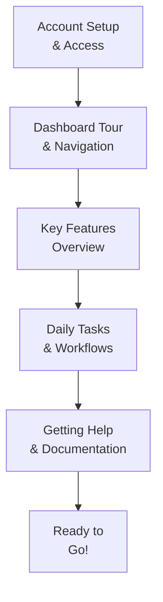

# Admin Onboarding Guide

> **Document:** `33-onboarding/ADMIN-ONBOARDING.md` | **Version:** 1.0 | **Last Updated:** July 2026
> **Audience:** Non-technical admin users (content editors, marketing team)
> **Related:** [Admin User Manual](../19-admin/ADMIN-USER-MANUAL.md)

---

## What Is the Portfolio Platform?

The Portfolio Platform is the content management system behind your personal or company portfolio website. It lets you manage sections, projects, blog posts, skills, testimonials, leads, media files, and more — all through a web-based dashboard. You don't need to write code or touch a command line. If you can use a word processor, you can use this dashboard.

---

## Admin Onboarding Flow

---

## Step 1: Account Setup

### Getting Invited

A super admin will send you an invitation email from the platform. Click the link in that email to set up your account. If you haven't received an invite, check your spam folder or ask your team lead to resend it.

### Logging In

Navigate to `/admin/login` in your browser. You have two options:

**Google OAuth:**

1. Click **Continue with Google**.
2. Select the Google account tied to your invitation email.
3. You're redirected to the admin dashboard.

**GitHub OAuth:**

1. Click **Continue with GitHub**.
2. Authorize the application when prompted.
3. You're redirected to the admin dashboard.

### If Login Fails

- **"Unauthorized" error** — Your account hasn't been granted access yet. Contact a super admin to assign your role.
- **"Account not found"** — You may be using the wrong email. Try the email address your invite was sent to.
- **OAuth screen doesn't load** — Check that your browser isn't blocking pop-ups for this site. Try a private/incognito window.
- Still stuck? Contact the development team (see [Getting Help](#step-5-getting-help)).

---

## Step 2: First Login

### Dashboard Tour

Once you log in, you land on the dashboard at `/admin`. Here's what you'll see:

- **Stat Cards** — At the top: quick counts of Sections (total + live), Projects (total + featured), Skills, and Leads (total + new). Color-coded for easy scanning.
- **Quick Actions** — Shortcut buttons: Add Project, Write Blog Post, View Leads, Manage Sections. Click any to jump straight to that task.
- **Recent Activity** — A feed of the latest changes made by you and other admins (who did what and when).

### Navigation Overview

The left sidebar (collapsed to a hamburger menu on mobile) lists every admin module:

- **Dashboard** — Back to the main dashboard
- **Sections** — Manage portfolio page sections and their order
- **Projects** — Add and edit portfolio projects
- **Blog** — Write and manage blog posts
- **Skills** — List your technical skills
- **Experience** — Manage work history entries
- **Testimonials** — Add client or colleague testimonials
- **Services** — List services you offer
- **Leads** — Incoming messages from your contact form
- **Media** — Upload and manage images, files, and assets
- **Chat** — AI assistant chat logs
- **Activities** — Full audit trail of all admin actions
- **Users** — Manage admin accounts (admins only)
- **Settings** — Global platform settings (admins only)
- **Feature Flags** — Toggle features on/off (admins only)

### Your Role and Permissions

Your role determines what you can do:

| Role       | Capabilities                                                                                                |
| ---------- | ----------------------------------------------------------------------------------------------------------- |
| **Admin**  | Full access: create, edit, delete all content, manage users, change settings, view API keys, see analytics. |
| **Editor** | Create, edit, publish, and unpublish content. Cannot manage users, change settings, or view API keys.       |
| **Viewer** | Read-only access. Can view everything and export data, but cannot create, edit, or delete anything.         |

Your role is shown in the user menu (top-right avatar). If you need different permissions, talk to a super admin.

---

## Step 3: Quick Start Tasks

### 1. Update Your Profile

Click your avatar (top-right) and select **Profile**. Update your display name, upload a profile photo, and set your preferences. Save when you're done.

### 2. Review Existing Content

Browse through **Sections**, **Projects**, and **Blog** to see what's already published. This gives you a feel for the platform's content and how things are organized.

### 3. Create Your First Blog Post

1. Click **Blog** in the left sidebar.
2. Click **Add Post** (or the + button).
3. Enter a **Title** (e.g., "Hello World — My First Post").
4. Write your content in the rich text editor. You can format text, add headings, insert images, and embed links — similar to Google Docs or WordPress.
5. Add a **Slug** (the URL-friendly version of your title — this is usually auto-filled).
6. Optionally add tags, a featured image, and a publish date.
7. Click **Save as Draft** to keep working later, or **Publish** to make it live.
8. Visit the public site to see your post.

---

## Step 4: Daily Tasks

### Check Leads

Go to **Leads** in the sidebar. This is where messages from your portfolio's contact form appear. Review new messages, mark them as read, and follow up as needed. You can also export leads to a CSV file.

### Review Analytics

If you have the **Admin** role, visit the analytics section to see visitor trends over time: page views, unique visitors, top pages, and traffic sources. Use this data to decide what content to refresh or promote.

### Update Content

As things change (new project finished, skill learned, testimonial received), update the corresponding module. Content changes are reflected on the public site immediately (for published items) or when you choose to publish (for drafts).

---

## Step 5: Getting Help

### Documentation

The full [Admin User Manual](../19-admin/ADMIN-USER-MANUAL.md) covers every module in detail — sections, projects, media, AI assistant, analytics, settings, and the audit log. Bookmark it for reference.

### Who to Contact

| Issue                         | Contact                                          |
| ----------------------------- | ------------------------------------------------ |
| Account access or permissions | Your super admin or team lead                    |
| Feature requests or questions | Create a GitHub Discussion or reach out on Slack |
| Technical bugs or errors      | Open a GitHub Issue with steps to reproduce      |

### How to Report a Bug

1. Note what you were doing when the error occurred.
2. Take a screenshot if possible (including the browser console if there's an error message).
3. Note the URL and your browser version.
4. Open a GitHub Issue with the label `bug` and include the above details.

---

_Welcome aboard! The dashboard is designed to be intuitive, so don't be afraid to explore. If something breaks, it's not your fault — just report it and we'll fix it._

## Cross-References

- [MASTER-INDEX.md](../MASTER-INDEX.md) — Documentation master index
- [CROSS-REFERENCE-INDEX.md](../26-reference/CROSS-REFERENCE-INDEX.md) — Cross-reference system
