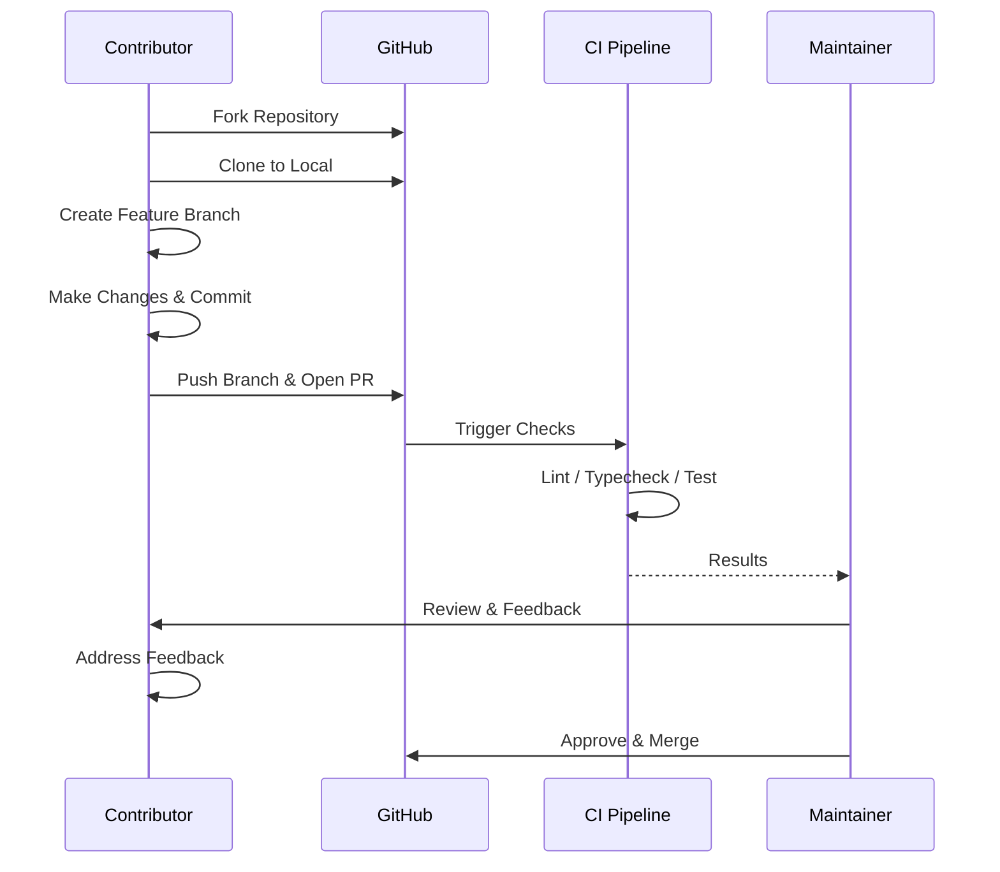

# Contributor Onboarding Guide

> **Document:** `33-onboarding/CONTRIBUTOR-ONBOARDING.md` | **Version:** 1.0 | **Last Updated:** July 2026
> **Audience:** External open-source contributors
> **Related:** [Contributing Guide](../34-contributing/CONTRIBUTING.md) | [Code of Conduct](../34-contributing/CODE_OF_CONDUCT.md)

---

## Welcome

Thanks for your interest in contributing to the Portfolio Platform! This is a full-stack monorepo that powers a modern portfolio website with a Next.js frontend, NestJS API, and FastAPI AI service. Whether you're here to fix a bug, add a feature, improve docs, or just explore — you're in the right place.

---

## Prerequisites

Before you begin, make sure you have these installed:

| Tool | Minimum Version | Check Command |
|------|----------------|---------------|
| Node.js | 18 | `node --version` |
| npm | 10 | `npm --version` |
| Docker | Latest | `docker --version` |
| Docker Compose | v2+ | `docker compose version` |
| Git | Latest | `git --version` |

---

## Contribution Flow



---

## Quick Setup

### 1. Clone the Repository

```bash
git clone https://github.com/yourusername/portfolio.git
cd portfolio
```

### 2. Install Dependencies

```bash
npm ci
```

This installs all packages across every workspace (web, api, ai, shared packages). The `ci` command uses the lockfile for deterministic installs — prefer it over `npm install`.

### 3. Configure Environment Variables

```bash
cp config/.env.example config/.env
```

Edit `config/.env` with your local settings. The defaults work for local development if you start the infrastructure services.

### 4. Start Infrastructure and Set Up the Database

```bash
# Start PostgreSQL and Redis
docker compose -f infrastructure/docker/docker-compose.yml up -d postgres redis

# From apps/api — generate Prisma client and run migrations
cd apps/api
npm run prisma:generate
npm run prisma:migrate:dev
npm run prisma:seed   # optional: fills the DB with sample data
cd ../..
```

### 5. Run the Development Servers

```bash
# All services in parallel (Turborepo)
npm run dev

# Or run individually:
npm run dev:web    # Next.js on port 3000
npm run dev:api    # NestJS on port 3001
npm run dev:ai     # FastAPI on port 8000
```

Visit `http://localhost:3000` to see the site. The API docs (Swagger) are at `http://localhost:3001/api/docs`.

---

## Codebase Navigation

This is an npm workspaces + Turborepo monorepo. The key directories:

```
portfolio/
├── apps/
│   ├── web/          # Next.js 14 (App Router) — public site + admin dashboard
│   ├── api/          # NestJS REST API — the main backend
│   └── ai/           # FastAPI service — AI/ML features (placeholder)
├── packages/
│   ├── shared/       # TypeScript types + Zod schemas (source of truth for contracts)
│   ├── ui/           # Shared React components (@portfolio/ui)
│   └── config/       # Shared ESLint, TypeScript, and other configs
├── docs/             # All documentation (architecture, governance, onboarding, etc.)
├── infrastructure/   # Docker Compose, CI/CD configs
└── config/           # Environment variable templates (.env.example)
```

**Important convention:** Business logic lives in `apps/api/src/modules/<entity>/` (services + DTOs). Public read-only endpoints are in `portfolio/controllers/`. Authenticated CRUD endpoints are in `admin/controllers/`. The same service is shared between both controller layers.

---

## Finding Something to Work On

- **Good First Issues** — Look for issues labeled `good first issue` or `beginner friendly`. These are small in scope and well-documented.
- **Help Wanted** — The `help wanted` label indicates tasks the maintainers would love help with but haven't had time for.
- **Documentation** — Fixing typos, improving unclear docs, or adding missing examples is always welcome.
- **Bug Reports** — Check open issues with the `bug` label. Comment on one to claim it before starting work.

All open issues are tracked on the [GitHub Issues](https://github.com/yourusername/portfolio/issues) page.

---

## Making Your First Contribution

1. **Fork** the repository on GitHub.
2. **Create a branch** from `main` with a descriptive name:
   ```bash
   git checkout -b fix/login-error-handling
   ```
3. **Make your changes.** Follow the project's coding standards (see below).
4. **Run the linter and type-check** before committing:
   ```bash
   npm run lint
   npm run typecheck
   ```
5. **Commit** using conventional commit messages (e.g., `fix: handle empty state on login page`).
6. **Push** your branch and open a Pull Request against `main`.
7. Fill out the PR template — describe what you changed, why, and how to test it.

---

## What to Expect After Submitting a PR

- **Review SLA** — Maintainers aim to review PRs within 3 business days.
- **CI Checks** — All commits go through automated linting, type-checking, and testing. Make sure all checks pass.
- **Feedback** — Reviewers may request changes. This is normal! Address feedback and push updates to the same branch.
- **Merge** — Once approved and all checks pass, a maintainer will merge your PR.

---

## Development Guidelines

- **Engineering Playbook** — See [ENGINEERING-PLAYBOOK.md](../24-development/ENGINEERING-PLAYBOOK.md) for detailed architecture, patterns, and workflows.
- **Coding Standards** — See [CODING-STANDARDS.md](../24-development/CODING-STANDARDS.md) for naming conventions, TypeScript rules, and testing requirements.
- **Constitution** — The [AI Engineering Constitution](../23-governance/CONSTITUTION.md) is the supreme governing document for all engineering work. Review it before starting substantial changes.

---

## Communication Channels

| Channel | Purpose |
|---------|---------|
| [GitHub Discussions](https://github.com/yourusername/portfolio/discussions) | Questions, ideas, feature proposals |
| [GitHub Issues](https://github.com/yourusername/portfolio/issues) | Bug reports, specific tasks |
| Pull Requests | Code review and feedback on your changes |

Use Discussions for open-ended conversations. Use Issues for trackable, actionable work.

---

## Code of Conduct

This project follows a [Code of Conduct](../34-contributing/CODE_OF_CONDUCT.md). By participating, you agree to uphold its standards — be respectful, inclusive, and constructive. Harassment or abusive behavior will not be tolerated.

---

*Happy contributing! Every contribution — whether it's fixing a typo or building a new feature — makes the project better for everyone.*

## Cross-References
- [MASTER-INDEX.md](../MASTER-INDEX.md) — Documentation master index
- [CROSS-REFERENCE-INDEX.md](../26-reference/CROSS-REFERENCE-INDEX.md) — Cross-reference system
