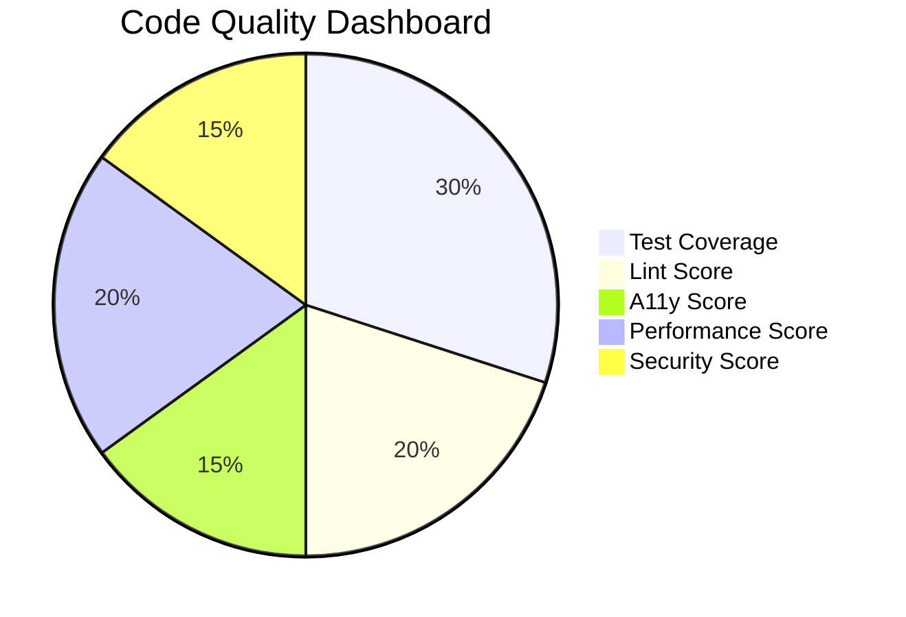
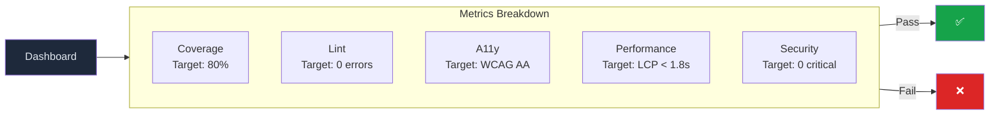

# Code Quality Metrics

> **Document:** `CODE-QUALITY-METRICS.md` | **Version:** 1.0 | **Last Updated:** July 2026
> **Status:** ✅ Active | **Owner:** Principal Staff Engineer | **Review Cadence:** Quarterly

## 1. Purpose

This document defines the quantitative code quality targets for the monorepo. Metrics are measured automatically in CI, reported on dashboards, and enforced at merge gates. Any regression below a minimum threshold blocks the responsible pull request.

---

## 2. Quality Dashboard

## 3. Test Coverage Targets

Coverage is measured per-package using Jest (API) and Vitest (Web). Targets are expressed as **line coverage** unless otherwise noted.

| Layer                                       | Tool                | Minimum           | Target                 |
| ------------------------------------------- | ------------------- | ----------------- | ---------------------- |
| Services (`apps/api/src/modules/*/`)        | Jest `--coverage`   | 70%               | 80%                    |
| Controllers (`apps/api/src/*/controllers/`) | Jest `--coverage`   | 50%               | 60%                    |
| Components (`apps/web/src/components/`)     | Vitest `--coverage` | 60%               | 70%                    |
| Hooks (`apps/web/src/lib/hooks/`)           | Vitest `--coverage` | 70%               | 80%                    |
| Shared package (`packages/shared/`)         | Jest `--coverage`   | 80%               | 90%                    |
| E2E (critical user flows)                   | Playwright          | All flows covered | All flows + edge cases |

**Coverage Enforcement:**

- PRs that reduce overall coverage by more than 2% are blocked at the PR gate (G2).
- New code must meet the target coverage for its layer. PR reviewers verify this.
- Coverage reports are generated per-pipeline run and archived for 90 days.

---

## 3. Code Complexity

| Metric                             | Threshold | Measurement Tool                | Enforcement    |
| ---------------------------------- | --------- | ------------------------------- | -------------- |
| Cyclomatic complexity per function | <= 10     | ESLint `complexity` rule        | PR gate (G2)   |
| Cognitive complexity per function  | <= 15     | SonarQube / CodeClimate         | Quarterly (G5) |
| Maintainability Index per module   | >= 70     | SonarQube / CodeClimate         | Quarterly (G5) |
| Max lines per file                 | <= 300    | ESLint `max-lines` rule         | PR gate (G2)   |
| Max lines per function             | <= 50     | ESLint `max-lines-per-function` | PR gate (G2)   |

Functions exceeding cyclomatic complexity of 10 must be refactored or carry an explicit exclusion with documented justification.

---

## 4. Code Duplication

| Metric                     | Threshold              | Measurement Tool  | Enforcement                  |
| -------------------------- | ---------------------- | ----------------- | ---------------------------- |
| Code duplication (overall) | <= 5%                  | jscpd / SonarQube | Quarterly (G5)               |
| Duplication per file       | <= 3% duplicated lines | jscpd             | PR gate (G2) — new code only |

Duplication is measured excluding test fixtures, generated code, and vendor files. New PRs introducing > 3% duplication in changed files are flagged for reviewer attention.

---

## 5. Documentation Coverage

| Requirement              | Criterion                                                                                 | Verification                 |
| ------------------------ | ----------------------------------------------------------------------------------------- | ---------------------------- |
| Public API documented    | Every exported function, class, or type has JSDoc/TSDoc                                   | ESLint `jsdoc/require-jsdoc` |
| Module README or section | Every `apps/*/src/modules/*` directory has a README or is referenced in architecture docs | Manual review (PR gate G2)   |
| Request/response schemas | Zod schemas include `.describe()` on all fields                                           | ESLint rule                  |
| Changelog entry          | Every PR to `main` references a changelog update                                          | PR template enforcement      |

---

## 6. Dependency Health

| Metric                   | Threshold                    | Tool                      | Enforcement    |
| ------------------------ | ---------------------------- | ------------------------- | -------------- |
| Critical vulnerabilities | 0 allowed                    | `npm audit`               | PR gate (G2)   |
| High vulnerabilities     | <= 5                         | `npm audit`               | PR gate (G2)   |
| Dependency age           | < 90 days since last publish | `npm outdated` / Renovate | Quarterly (G5) |
| Unused dependencies      | 0                            | `depcheck`                | PR gate (G2)   |
| Duplicate packages       | 0 hoisted duplicates         | `pnpm dedupe --check`     | CI weekly      |

Dependencies exceeding 90 days without an update are flagged for review during the quarterly gate. Renovate automates minor/patch updates; major updates require manual review.

---

## 7. Performance Budgets

Performance budgets are defined in the Performance Architecture document. Key metrics referenced here:

| Metric                   | Budget                                    | Tool                    |
| ------------------------ | ----------------------------------------- | ----------------------- |
| Lighthouse Performance   | >= 90                                     | Lighthouse CI           |
| Lighthouse Accessibility | >= 90                                     | Lighthouse CI           |
| Initial JS bundle        | <= 85 KB                                  | `@next/bundle-analyzer` |
| API p95 latency          | <= 100ms (staging), <= 150ms (production) | k6 / autocannon         |
| LCP                      | <= 1.8s                                   | Lighthouse CI           |

See [`docs/35-quality/PerformanceArchitecture.md`](../35-quality/PerformanceArchitecture.md) for the full performance budget specification.

---

## 8. Metrics Reporting & Enforcement

### 8.1 Collection

| Metric           | Collection Method         | Frequency          | Stored In                       |
| ---------------- | ------------------------- | ------------------ | ------------------------------- |
| Code coverage    | Jest / Vitest JSON output | Per CI run         | CI artifacts (90 day retention) |
| Complexity       | ESLint stats              | Per CI run         | CI summary                      |
| Duplication      | jscpd JSON output         | Per CI run         | CI artifacts                    |
| Dependency audit | `npm audit` JSON          | Per CI run         | CI summary                      |
| Bundle size      | `@next/bundle-analyzer`   | Per CI run         | CI artifacts                    |
| Performance      | Lighthouse CI             | Per staging deploy | Lighthouse dashboard            |

### 8.2 Dashboard

A live quality dashboard at `https://<env>/admin/quality-metrics` displays:

- Coverage by layer (sparklines showing 30-day trend)
- Complexity hotspots (modules with lowest maintainability index)
- Duplication density per package
- Open dependency vulnerabilities by severity
- Bundle size history

### 8.3 Enforcement Cadence

| Gate             | Metrics Enforced                                                                                 |
| ---------------- | ------------------------------------------------------------------------------------------------ |
| G2 (PR)          | Coverage, complexity, duplication (new code), dependency vulnerabilities, bundle size regression |
| G4 (Post-Deploy) | API latency, Lighthouse scores                                                                   |
| G5 (Quarterly)   | Maintainability index, duplication (overall), dependency age, documentation coverage             |

## Cross-References

- [MASTER-INDEX.md](../MASTER-INDEX.md) — Documentation master index
- [CROSS-REFERENCE-INDEX.md](../26-reference/CROSS-REFERENCE-INDEX.md) — Cross-reference system
