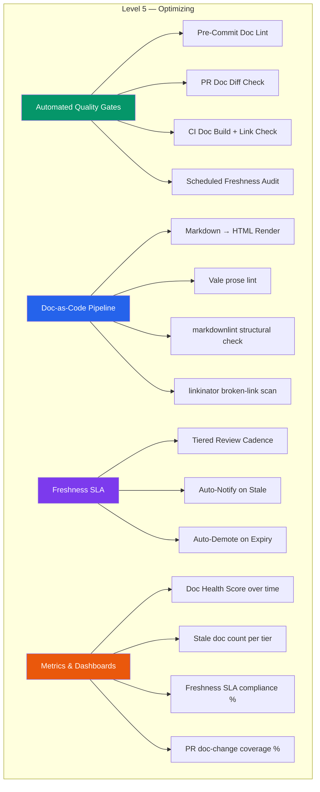
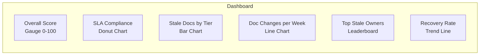

# Documentation Operations (DocOps) Plan

> **Purpose:** Define the operational framework for maintaining documentation quality at scale
> **Audience:** Engineering team, Documentation owners, DevOps
> **Owner:** Documentation Lead / DevOps
> **Status:** Proposal | **Target:** Q1 2027
> **Version:** 1.0 | **Last Updated:** July 2026

## Current State (Level 4 — Managed)

- **95/100 documentation score** across 38 populated categories
- **100% cross-reference coverage** — 220+ files with valid Cross-References sections
- **All 38 categories populated** with README.md index files in every numbered directory
- **~240 active documents** across the full documentation tree
- **18 ADRs** with full decision log
- **Document maturity model defined** — L1 through L5 per document
- **Quality Standards** documented in `DOCUMENTATION-QUALITY-STANDARDS.md`
- **Quality Gates** defined for code (G1–G5) but **no doc-specific gates**
- **Manual review process** — quarterly audits via `DOC-AUDIT-REPORT.md`
- **No automated freshness checks** — stale detection is manual
- **No broken-link detection in CI** — cross-refs validated manually
- **Ownership matrix exists** but not auto-enforced
- **Husky + lint-staged** in place for code formatting; doc linting limited to Prettier

### Gaps Preventing Level 5

| Gap                               | Impact                                        | Severity |
| --------------------------------- | --------------------------------------------- | -------- |
| No doc freshness automated checks | Stale docs propagate silently                 | High     |
| No broken-link CI gate            | Cross-ref rot between quarterly audits        | High     |
| No doc-change trigger in PRs      | Code changes land without doc updates         | Critical |
| No doc coverage metrics           | Cannot prove completeness objectively         | Medium   |
| No doc build/publish pipeline     | No single source-of-truth rendering           | Medium   |
| No doc-specific linter            | Markdown style, header compliance unenforced  | Low      |
| No freshness SLA enforcement      | No auto-escalation for stale content          | High     |
| No doc health dashboard           | Visibility into doc debt is quarterly at best | Medium   |

## Target State (Level 5 — Optimizing)



### Key Metrics (Target)

| Metric                   | Current    | Target                      | Measurement                |
| ------------------------ | ---------- | --------------------------- | -------------------------- |
| Documentation score      | 95/100     | 98/100                      | Weighted dimension scoring |
| Freshness SLA compliance | Manual     | >= 95% automated            | CI audit pass rate         |
| Broken links             | 0 (manual) | 0 (CI-blocked)              | linkinator in pipeline     |
| PR doc-change coverage   | Unknown    | >= 80% of code-change PRs   | git diff classifier        |
| Stale doc auto-detection | None       | 100% of docs scanned weekly | Scheduled workflow         |
| Doc build time           | N/A        | < 30s                       | GitHub Actions timing      |
| Owner response SLA       | None       | < 48h on stale notification | Alert → GitHub issue       |

## Automated Quality Gates

### Gate D0: Doc Header Compliance

**Stage:** Pre-commit (husky hook)
**Tool:** `scripts/validate-doc-headers.mjs`
**Enforcement:** Block commit on any doc with missing/invalid header fields

```javascript
// scripts/validate-doc-headers.mjs
// Checks every staged .md file for required header fields.
// Run via: node scripts/validate-doc-headers.mjs <file1> <file2> ...

import { readFileSync, existsSync } from 'fs';

const REQUIRED_FIELDS = ['Status', 'Version', 'Last Updated', 'Purpose', 'Owner'];

const STATUS_PATTERN = /^\|?\s*\*\*Status:\*\*/;
const VERSION_PATTERN = /^\|?\s*\*\*Version:\*\*/;
const UPDATED_PATTERN = /^\|?\s*\*\*Last Updated:\*\*/;

let exitCode = 0;

for (const filePath of process.argv.slice(2)) {
  if (!filePath.endsWith('.md')) continue;
  const content = readFileSync(filePath, 'utf8');
  const lines = content.split('\n').slice(0, 15).join('\n');

  const missing = [];
  if (!STATUS_PATTERN.test(lines)) missing.push('Status');
  if (!VERSION_PATTERN.test(lines)) missing.push('Version');
  if (!UPDATED_PATTERN.test(lines)) missing.push('Last Updated');

  if (missing.length > 0) {
    console.error(`[FAIL] ${filePath} — missing fields: ${missing.join(', ')}`);
    exitCode = 1;
  }
}

process.exit(exitCode);
```

### Gate D1: Pre-Commit Hook

**Location:** `.husky/pre-commit` (extended from existing)

```shell
# .husky/pre-commit — extended with doc checks
# Existing lint-staged runs prettier + eslint on code
npx lint-staged

# Doc-specific pre-commit checks
STAGED_DOCS=$(git diff --cached --name-only --diff-filter=ACMR | grep -E '\.md$' || true)
if [ -n "$STAGED_DOCS" ]; then
  echo "📝 Validating documentation headers..."
  node scripts/validate-doc-headers.mjs $STAGED_DOCS

  echo "🔗 Checking for broken markdown links..."
  echo "$STAGED_DOCS" | xargs -I{} npx markdown-link-check {} --quiet

  echo "📐 Running markdownlint..."
  echo "$STAGED_DOCS" | xargs npx markdownlint --config .markdownlint.json
fi
```

### Gate D2: CI/CD Integration

**File:** `.github/workflows/doc-quality.yml`

```yaml
# .github/workflows/doc-quality.yml
# Doc Quality Gates — runs on every PR touching docs/ and on schedule

name: Doc Quality
on:
  pull_request:
    paths:
      - 'docs/**'
      - '.github/workflows/doc-quality.yml'
  push:
    branches: [main]
    paths:
      - 'docs/**'
  schedule:
    - cron: '0 6 * * 1' # Every Monday 06:00 UTC — freshness audit

concurrency:
  group: ${{ github.workflow }}-${{ github.ref }}
  cancel-in-progress: true

env:
  DOCS_DIR: docs
  CROSS_REF_INDEX: docs/26-reference/CROSS-REFERENCE-INDEX.md
  MASTER_INDEX: docs/MASTER-INDEX.md

jobs:
  header-compliance:
    name: Header Compliance
    runs-on: ubuntu-latest
    steps:
      - uses: actions/checkout@v4
        with:
          fetch-depth: 0
      - uses: actions/setup-node@v4
        with:
          node-version: 20
      - name: Validate doc headers
        run: |
          CHANGED_DOCS=$(git diff --name-only --diff-filter=ACMR ${{ github.event.pull_request.base.sha || 'HEAD~1' }} HEAD -- 'docs/**/*.md')
          if [ -n "$CHANGED_DOCS" ]; then
            node scripts/validate-doc-headers.mjs $CHANGED_DOCS
          fi

  prose-lint:
    name: Prose Lint (Vale)
    runs-on: ubuntu-latest
    steps:
      - uses: actions/checkout@v4
      - uses: errata-ai/vale-action@v2.1.1
        with:
          files: docs/
          onlyAnnotateModifiedLines: true
        env:
          GITHUB_TOKEN: ${{ secrets.GITHUB_TOKEN }}

  markdown-structure:
    name: Markdown Structure (markdownlint)
    runs-on: ubuntu-latest
    steps:
      - uses: actions/checkout@v4
      - uses: actions/setup-node@v4
        with:
          node-version: 20
      - run: npm install -g markdownlint-cli
      - name: Lint all markdown files
        run: markdownlint 'docs/**/*.md' --config .markdownlint.json

  broken-links:
    name: Broken Link Detection
    runs-on: ubuntu-latest
    steps:
      - uses: actions/checkout@v4
      - uses: actions/setup-node@v4
        with:
          node-version: 20
      - name: Install linkinator
        run: npm install -g linkinator
      - name: Scan for broken internal links
        run: |
          linkinator docs/ \
            --recurse \
            --skip "^(?!.*github\.com/${{ github.repository }})" \
            --config .linkinatorrc
      - uses: actions/github-script@v7
        if: failure()
        with:
          script: |
            core.summary.addHeading('Broken Link Report', 3);
            core.summary.addRaw('One or more broken links were found in the documentation. ');
            core.summary.addRaw('Please fix them before merging.');

  doc-change-classifier:
    name: Doc Change Classifier
    runs-on: ubuntu-latest
    if: github.event_name == 'pull_request'
    steps:
      - uses: actions/checkout@v4
        with:
          fetch-depth: 0
      - uses: actions/setup-node@v4
      - name: Classify PR changes
        id: classify
        run: |
          CODE_FILES=$(git diff --name-only ${{ github.event.pull_request.base.sha }} HEAD -- ':!docs/' ':!*.md')
          DOC_FILES=$(git diff --name-only ${{ github.event.pull_request.base.sha }} HEAD -- 'docs/**' '*.md')
          if [ -n "$CODE_FILES" ] && [ -z "$DOC_FILES" ]; then
            echo "::warning::This PR modifies code but no documentation. Consider updating related docs."
            echo "needs-docs=true" >> $GITHUB_OUTPUT
          fi
      - name: Comment on PR if docs missing
        if: steps.classify.outputs.needs-docs == 'true'
        uses: actions/github-script@v7
        with:
          script: |
            const message = '⚠️ **Docs Advisory:** This PR changes code but no documentation files were updated. '
              + 'Please verify whether the following docs need updating:\n'
              + '1. Check `docs/MASTER-INDEX.md` for related category\n'
              + '2. If the change affects an API, update the relevant API docs\n'
              + '3. If the change affects architecture, update architecture docs + ADR if needed\n\n'
              + 'You can acknowledge with a `/docs-ack` comment if no doc changes are needed.';
            github.rest.issues.createComment({
              issue_number: context.issue.number,
              owner: context.repo.owner,
              repo: context.repo.repo,
              body: message
            });

  freshness-audit:
    name: Freshness Audit
    if: github.event_name == 'schedule'
    runs-on: ubuntu-latest
    steps:
      - uses: actions/checkout@v4
        with:
          fetch-depth: 0
      - uses: actions/setup-node@v4
      - name: Run freshness check
        id: freshness
        run: node scripts/freshness-audit.mjs
      - name: Create stale doc issues
        if: failure()
        uses: actions/github-script@v7
        with:
          script: |
            const fs = require('fs');
            const report = JSON.parse(fs.readFileSync('freshness-report.json', 'utf8'));
            for (const doc of report.stale) {
              github.rest.issues.create({
                owner: context.repo.owner,
                repo: context.repo.repo,
                title: `[DOC STALE] ${doc.path} — last updated ${doc.daysSinceUpdate} days ago`,
                body: `**Document:** \`${doc.path}\`\n**Tier:** ${doc.tier}\n**Owner:** ${doc.owner}\n**Stale since:** ${doc.lastUpdated}\n**Days overdue:** ${doc.daysSinceUpdate}\n\nThis document has exceeded its freshness SLA. Please review and update within 48 hours.`,
                labels: ['area:docs', 'doc-stale', `sla-tier:${doc.tier}`],
                assignees: [doc.owner]
              });
            }
```

### Gate D3: Scheduled Audits

**Cron Schedule:**

| Audit                       | Frequency          | Tool                              | Output                                  |
| --------------------------- | ------------------ | --------------------------------- | --------------------------------------- |
| Full freshness scan         | Weekly (Mon 06:00) | `scripts/freshness-audit.mjs`     | `freshness-report.json` + GitHub issues |
| Broken link scan            | Daily (02:00)      | linkinator                        | CI failure + Slack alert                |
| Cross-reference validation  | Monthly (1st)      | `scripts/validate-cross-refs.mjs` | Report + GitHub issue                   |
| Quality score recalculation | Quarterly          | Weighted scoring formula          | DOC-AUDIT-REPORT.md update              |
| Vale style guide update     | Quarterly          | Manual review of `.vale.ini`      | PR with style changes                   |

```javascript
// scripts/freshness-audit.mjs
// Scans all .md files, compares Last Updated against SLA tiers,
// generates stale-doc report with auto-escalation.

import { readFileSync, writeFileSync, readdirSync, statSync } from 'fs';
import { join, relative } from 'path';

const DOCS_ROOT = new URL('../docs', import.meta.url).pathname;

const SLA_TIERS = {
  critical: { maxDays: 30, label: 'Tier 1' },
  standard: { maxDays: 90, label: 'Tier 2' },
  reference: { maxDays: 180, label: 'Tier 3' },
};

const TIER_KEYWORDS = {
  critical: ['architecture', 'security', 'deployment', 'api/', 'runbook', 'disaster', 'auth'],
  standard: ['guide', 'workflow', 'process', 'checklist', 'standards', 'governance'],
  reference: ['reference', 'template', 'index', 'readme', 'changelog', 'inventory'],
};

function classifyTier(filePath) {
  const lower = filePath.toLowerCase();
  for (const [tier, keywords] of Object.entries(TIER_KEYWORDS)) {
    if (keywords.some((k) => lower.includes(k))) return tier;
  }
  return 'standard'; // default
}

function walkDir(dir) {
  const files = [];
  for (const entry of readdirSync(dir, { withFileTypes: true })) {
    const full = join(dir, entry.name);
    if (entry.isDirectory() && !entry.name.startsWith('.')) {
      files.push(...walkDir(full));
    } else if (entry.isFile() && entry.name.endsWith('.md')) {
      files.push(full);
    }
  }
  return files;
}

function extractDate(content) {
  const match = content.match(/\*\*Last Updated:\*\*\s*(.+)/i);
  if (!match) return null;
  const raw = match[1].replace(/[\|\s]/g, '').trim();
  const parsed = new Date(raw);
  return isNaN(parsed.getTime()) ? null : parsed;
}

function extractOwner(content) {
  const match = content.match(/\*\*Owner:\*\*\s*(.+)/i);
  if (!match) return 'unassigned';
  return match[1].replace(/\|/g, '').trim();
}

const allDocs = walkDir(DOCS_ROOT);
const now = new Date();
const report = { scanned: allDocs.length, stale: [], healthy: [], errors: [] };

for (const doc of allDocs) {
  try {
    const content = readFileSync(doc, 'utf8');
    const relPath = relative(DOCS_ROOT, doc).replace(/\\/g, '/');
    const lastUpdated = extractDate(content);
    const owner = extractOwner(content);
    const tier = classifyTier(relPath);
    const sla = SLA_TIERS[tier];

    if (!lastUpdated) {
      report.errors.push({ path: relPath, issue: 'Missing or invalid Last Updated field' });
      continue;
    }

    const daysSinceUpdate = Math.floor((now - lastUpdated) / (1000 * 60 * 60 * 24));
    const entry = {
      path: relPath,
      tier,
      owner,
      lastUpdated: lastUpdated.toISOString(),
      daysSinceUpdate,
      slaMaxDays: sla.maxDays,
    };

    if (daysSinceUpdate > sla.maxDays) {
      report.stale.push(entry);
    } else {
      report.healthy.push(entry);
    }
  } catch (err) {
    report.errors.push({ path: doc, issue: err.message });
  }
}

report.summary = {
  total: report.scanned,
  healthy: report.healthy.length,
  stale: report.stale.length,
  errors: report.errors.length,
  complianceRate: Math.round((report.healthy.length / report.scanned) * 100),
};

writeFileSync('freshness-report.json', JSON.stringify(report, null, 2));
console.log(
  `Freshness audit complete: ${report.healthy.length} healthy, ${report.stale.length} stale, ${report.errors.length} errors`,
);
console.log(`SLA compliance rate: ${report.summary.complianceRate}%`);

if (report.errors.length > 0) {
  console.error('Documents with errors:');
  report.errors.forEach((e) => console.error(`  - ${e.path}: ${e.issue}`));
}

if (report.stale.length > 0) {
  console.error('Stale documents:');
  report.stale.forEach((s) =>
    console.error(`  - [${s.tier}] ${s.path} (${s.daysSinceUpdate}d / ${s.slaMaxDays}d SLA)`),
  );
  process.exit(1);
}
```

## Freshness SLA

| Doc Tier          | Max Age  | Review Cadence | Auto-Notify                | Escalation                                     |
| ----------------- | -------- | -------------- | -------------------------- | ---------------------------------------------- |
| Tier 1: Critical  | 30 days  | Monthly        | Yes — GitHub issue + Slack | Owner < 48h; Engineering Lead at 72h           |
| Tier 2: Standard  | 90 days  | Quarterly      | Yes — GitHub issue         | Owner < 1 week; Engineering Lead at 2 weeks    |
| Tier 3: Reference | 180 days | Bi-annual      | Yes — GitHub issue         | Owner < 2 weeks; Documentation Lead at 1 month |

### Tier Classification Rules

Classification is **automatic** based on document path and content signals:

| Tier          | Detection Heuristic                                                                                                         | Example Paths                                                                        |
| ------------- | --------------------------------------------------------------------------------------------------------------------------- | ------------------------------------------------------------------------------------ |
| **Critical**  | Path contains `architecture/`, `security/`, `deployment/`, `api/`, `runbook`, `disaster`, `auth`, `operations/`, `release/` | `docs/05-architecture/`, `docs/11-security/`, `docs/12-devops/`, `docs/30-runbooks/` |
| **Standard**  | Path contains `guide`, `workflow`, `process`, `checklist`, `standards`, `governance`, `decisions/`                          | `docs/18-content/CONTENT-UPDATE-WORKFLOW.md`, `docs/35-quality/QUALITY-GATES.md`     |
| **Reference** | Path contains `reference`, `template`, `index`, `readme`, `inventory`                                                       | `docs/26-reference/CROSS-REFERENCE-INDEX.md`, `docs/28-templates/RFC-TEMPLATE.md`    |

### SLA Enforcement

```mermaid
stateDiagram-v2
    [*] --> Current: Last Updated within SLA
    Current --> Warning: 80% of SLA elapsed
    Warning --> Stale: SLA exceeded
    Stale --> IssueCreated: Auto-GitHub Issue
    IssueCreated --> OwnerNotified: Slack DM
    OwnerNotified --> UnderReview: Owner acknowledges
    UnderReview --> Current: Doc updated + timestamp refreshed
    Stale --> Archived: No update in 12 months
    Archived --> [*]

    note right of IssueCreated : labels: area:docs, doc-stale
    note right of Archived : Move to docs/ARCHIVE/
```

### Escalation Matrix

| Time Past SLA                                       | Action                                              | Channel                     |
| --------------------------------------------------- | --------------------------------------------------- | --------------------------- |
| 0 days                                              | Auto-create GitHub issue with `doc-stale` label     | GitHub Issues               |
| +1 day (Critical only)                              | Slack @mention to document owner                    | #docs channel               |
| +3 days (Critical) / +7 days (Standard)             | Slack @mention to Engineering Lead                  | #engineering channel        |
| +14 days (Critical) / +30 days (Standard/Reference) | Added to sprint planning as documentation debt      | Sprint board                |
| +90 days                                            | Document demoted one maturity level                 | Automated PR updates status |
| +180 days                                           | Auto-PR moves to `docs/archive/` with redirect note | GitHub Actions              |

## Doc-as-Code Pipeline

### Architecture

```mermaid
flowchart LR
    subgraph Source[Source]
        MD[*.md files]
        CONFIG[.markdownlint.json]
        VALE[.vale.ini]
        STYLE[scripts/*.mjs]
    end

    subgraph CI[CI Pipeline]
        LINT[markdownlint]
        VALE_CHECK[Vale prose lint]
        LINKS[linkinator]
        HEADERS[Header validator]
        FRESH[Freshness audit]
    end

    subgraph Build[Doc Build]
        RENDER[markdown-to-html]
        SITE[Static site generator]
        SEARCH[Search index]
    end

    subgraph Publish[Publish]
        GH_PAGES[GitHub Pages]
        VERCEL_DOCS[Vercel /docs]
        API_DOCS[Swagger /api/docs]
    end

    subgraph Monitor[Monitor]
        DASH[Doc Health Dashboard]
        ALERTS[Slack Alerts]
        METRICS[Freshness Metrics]
    end

    Source --> CI
    CI -->|PR passes gates| Build
    Build --> Publish
    Publish --> Monitor
    Monitor -.->|feedback loop| Source
```



### Configuration Files

```json
// .markdownlint.json
{
  "default": true,
  "MD013": { "line_length": 120, "code_blocks": false, "tables": false },
  "MD024": { "allow_different_nesting": true },
  "MD033": false,
  "MD041": false,
  "MD046": { "style": "fenced" },
  "MD047": true
}
```

```ini
# .vale.ini
StylesPath = .vale/styles
MinAlertLevel = warning
Packages = write-good, proselint

[*.md]
BasedOnStyles = write-good, proselint
write-good.E-Prime = NO
write-good.Passive = YES
write-good.Weasel = YES
proselint.Annotations = YES
proselint.Archaism = YES
proselint.Cliches = YES
proselint.Malapropisms = YES
proselint.Redundancy = YES

[docs/27-decisions/*.md]
BasedOnStyles = write-good
write-good.Weasel = NO
```

```json
// .linkinatorrc
{
  "recurse": true,
  "skip": [
    "https://github.com/.*/issues/.*",
    "https://github.com/.*/pull/.*",
    "https://twitter\\.com/.*",
    "https://linkedin\\.com/.*",
    "mailto:.*",
    "https://www\\.figma\\.com/.*"
  ],
  "silent": false,
  "timeout": 10000,
  "retry": true,
  "retryErrors": true,
  "retryErrorsCount": 3,
  "retryErrorsJitter": 1000
}
```

### Toolchain Summary

| Tool                                 | Purpose                                             | Integration                          | Config File          |
| ------------------------------------ | --------------------------------------------------- | ------------------------------------ | -------------------- |
| **markdownlint**                     | Structural Markdown rules (headings, lists, tables) | Pre-commit hook + CI                 | `.markdownlint.json` |
| **Vale**                             | Prose style and tone linting                        | CI only (slower)                     | `.vale.ini`          |
| **Prettier**                         | Markdown formatting (existing)                      | Pre-commit via lint-staged           | `.prettierrc`        |
| **linkinator**                       | Broken link detection                               | Pre-commit (staged) + CI (full scan) | `.linkinatorrc`      |
| **markdown-link-check**              | Quick link check on staged files                    | Pre-commit                           | N/A                  |
| **remark-cli**                       | Advanced lint/format (extendable)                   | Optional CI                          | `.remarkrc.mjs`      |
| **scripts/validate-doc-headers.mjs** | Header field compliance                             | Pre-commit + CI                      | N/A                  |
| **scripts/freshness-audit.mjs**      | SLA compliance scan                                 | Scheduled CI (weekly)                | N/A                  |
| **scripts/validate-cross-refs.mjs**  | Cross-reference link validation                     | Scheduled CI (monthly)               | N/A                  |

### Local Development Workflow

```shell
# Install doc toolchain
npm install -g markdownlint-cli vale linkinator

# Run full doc check locally
npm run docs:lint        # markdownlint + Prettier check
npm run docs:links       # linkinator full scan
npm run docs:vale        # Vale prose lint
npm run docs:freshness   # Freshness audit script
npm run docs:all         # Everything above sequentially
```

```json
// package.json (additional scripts)
{
  "scripts": {
    "docs:lint": "markdownlint 'docs/**/*.md' --config .markdownlint.json",
    "docs:format": "prettier --write 'docs/**/*.md'",
    "docs:format:check": "prettier --check 'docs/**/*.md'",
    "docs:links": "linkinator docs/ --recurse --config .linkinatorrc",
    "docs:vale": "vale docs/",
    "docs:freshness": "node scripts/freshness-audit.mjs",
    "docs:headers": "node scripts/validate-doc-headers.mjs 'docs/**/*.md'",
    "docs:all": "npm run docs:lint && npm run docs:format:check && npm run docs:links && npm run docs:headers"
  }
}
```

## Monitoring & Dashboards

### Doc Health Dashboard

**Platform:** GitHub Pages or Vercel-deployed static site
**Data Source:** Freshness audit JSON output pushed to `gh-pages` branch
**Charts:**



### Metrics Collected

| Metric                      | Collection Method             | Frequency | Retention         |
| --------------------------- | ----------------------------- | --------- | ----------------- |
| Overall documentation score | Quarterly audit report        | Quarterly | Indefinite        |
| SLA compliance rate         | `scripts/freshness-audit.mjs` | Weekly    | 12 months rolling |
| Stale doc count by tier     | Freshness audit JSON          | Weekly    | 12 months rolling |
| Broken link count           | linkinator CI job             | Daily     | 3 months rolling  |
| PR doc-change coverage      | Doc Classifier CI job         | Per PR    | 6 months rolling  |
| Owner response time         | Issue close timestamp diff    | Per issue | 12 months rolling |
| Doc build time              | GitHub Actions timing         | Per build | 3 months rolling  |

### Slack Alerts

```yaml
# .github/workflows/doc-alerts.yml (Slack notifications)
name: Doc Alerts
on:
  workflow_run:
    workflows: ['Doc Quality']
    types: [completed]

jobs:
  alert:
    runs-on: ubuntu-latest
    if: ${{ github.event.workflow_run.conclusion == 'failure' }}
    steps:
      - name: Send Slack alert
        uses: slackapi/slack-github-action@v1.27.0
        with:
          payload: |
            {
              "channel": "#docs",
              "blocks": [
                {
                  "type": "section",
                  "text": {
                    "type": "mrkdwn",
                    "text": "⚠️ *Doc Quality check failed*\nWorkflow: ${{ github.event.workflow_run.name }}\nRun: <${{ github.event.workflow_run.html_url }}|View run>"
                  }
                }
              ]
            }
        env:
          SLACK_WEBHOOK_URL: ${{ secrets.SLACK_DOCS_WEBHOOK }}
```

### Owner Accountability Report

Generated automatically each month via `scripts/owner-report.mjs`:

```javascript
// Query stale issues → aggregate by owner → produce report
const report = {
  period: '2026-08',
  owners: [
    {
      name: 'jane.doe',
      staleDocs: 3,
      criticalStale: 1,
      avgResponseTime: '14h',
      complianceRate: 91,
    },
    // ...
  ],
  summary: {
    totalOwners: 12,
    compliant: 9,
    nonCompliant: 3,
    avgComplianceRate: 84,
  },
};
```

## Implementation Phases

### Phase 1: Foundation (Q4 2026)

**Goal:** Establish basic tooling, baseline metrics, and pre-commit hooks for documentation.

| Task                                       | Owner              | Deliverable                                                 | Effort  |
| ------------------------------------------ | ------------------ | ----------------------------------------------------------- | ------- |
| 1.1 Create doc linting configuration       | Documentation Lead | `.markdownlint.json`, `docs/35-quality/.vale.ini`           | 2 days  |
| 1.2 Write header validation script         | DevOps             | `scripts/validate-doc-headers.mjs`                          | 1 day   |
| 1.3 Write freshness audit script           | DevOps             | `scripts/freshness-audit.mjs`                               | 2 days  |
| 1.4 Add doc checks to husky pre-commit     | DevOps             | Updated `.husky/pre-commit`                                 | 0.5 day |
| 1.5 Create `.linkinatorrc` config          | DevOps             | `.linkinatorrc`                                             | 0.5 day |
| 1.6 Create base doc CI workflow            | DevOps             | `.github/workflows/doc-quality.yml` (header + lint + links) | 2 days  |
| 1.7 Train document owners                  | Documentation Lead | Training session + runbook                                  | 1 day   |
| 1.8 Baseline freshness audit run           | DevOps             | `freshness-report.json` baseline                            | 0.5 day |
| 1.9 Add npm scripts to root `package.json` | DevOps             | `docs:*` script suite                                       | 0.5 day |

**Phase 1 Success Criteria:**

- All 240+ docs pass header validation
- markdownlint has zero structural errors
- Broken link scan baseline established
- Freshness baseline: SLA compliance % recorded
- Pre-commit hook blocks commits with header violations

### Phase 2: Automation (Q1 2027)

**Goal:** Integrate doc quality gates into CI/CD, enforce freshness SLA, and build monitoring.

| Task                                    | Owner              | Deliverable                                 | Effort |
| --------------------------------------- | ------------------ | ------------------------------------------- | ------ |
| 2.1 Deploy Vale prose linting in CI     | DevOps             | Vale CI job passing with `write-good` style | 2 days |
| 2.2 Deploy doc-change classifier in PRs | DevOps             | PR comment for code-only PRs                | 1 day  |
| 2.3 Implement freshness SLA enforcement | DevOps             | Weekly scheduled CI + auto-issue creation   | 2 days |
| 2.4 Create Slack alert integration      | DevOps             | `doc-alerts.yml` workflow                   | 1 day  |
| 2.5 Cross-reference validation script   | Documentation Lead | `scripts/validate-cross-refs.mjs`           | 2 days |
| 2.6 Build doc health dashboard          | DevOps / FE        | GitHub Pages static dashboard               | 3 days |
| 2.7 Add Vale style guides               | Documentation Lead | `write-good`, `proselint` packages          | 1 day  |
| 2.8 Update DOC-AUDIT-REPORT.md template | Documentation Lead | Automated audit report sections             | 1 day  |
| 2.9 Owner accountability report         | DevOps             | `scripts/owner-report.mjs`                  | 1 day  |

**Phase 2 Success Criteria:**

- Freshness SLA at 90%+ compliance within 2 months
- PR doc-change warning on > 80% of code-only PRs
- All broken links fixed before merge
- Doc health dashboard live with real-time metrics
- Stale docs auto-create GitHub issues within 24h of SLA expiry

### Phase 3: Optimization (Q2 2027)

**Goal:** Proactive quality improvement, advanced analytics, and continuous feedback loop.

| Task                                 | Owner              | Deliverable                                      | Effort  |
| ------------------------------------ | ------------------ | ------------------------------------------------ | ------- |
| 3.1 AI-powered stale doc detection   | AI team            | NLP classifier predicting stale sections         | 5 days  |
| 3.2 Auto-PR for stale doc archival   | DevOps             | GitHub Action that creates archive PRs           | 2 days  |
| 3.3 Doc contribution analytics       | DevOps             | Per-author, per-category contribution metrics    | 2 days  |
| 3.4 Doc-as-code render pipeline      | DevOps             | Vercel-deployed static doc site                  | 3 days  |
| 3.5 Synthetic doc quality monitoring | DevOps             | Weekly CI that tracks score trend                | 1 day   |
| 3.6 Automated doc debt triage        | Documentation Lead | AI-suggested priority for doc debt issues        | 3 days  |
| 3.7 Feedback loop: doc issues → PRs  | All                | GitHub issue templates for doc feedback          | 1 day   |
| 3.8 Doc score trending dashboard     | DevOps             | Score-over-time chart on doc health dashboard    | 2 days  |
| 3.9 Style guide versioning           | Documentation Lead | `.vale/styles` tracked in repo with version tags | 0.5 day |

**Phase 3 Success Criteria:**

- Documentation score reaches 98/100
- Freshness SLA compliance at 95%+
- Broken links detected and fixed within 24h (zero chronic)
- Doc-as-code pipeline serves rendered docs from `docs/` source
- > = 90% of stale docs are reviewed or archived within SLA window
- Automated doc debt triage reduces manual review effort by 50%

### Rollback Plan

If any phase introduces regressions (e.g., false-positive lint errors blocking valid PRs):

1. **Immediate:** Disable the offending check in `doc-quality.yml` by commenting out the job
2. **Short-term:** File a GitHub issue with label `area:docops` documenting the false-positive pattern
3. **Long-term:** Adjust the rule configuration in `.markdownlint.json` or `.vale.ini` and re-enable the check
4. **Communication:** Post in #docs channel with the resolution timeline

### Risk Register

| Risk                                     | Likelihood | Impact | Mitigation                                                             |
| ---------------------------------------- | ---------- | ------ | ---------------------------------------------------------------------- |
| Vale false positives block PRs           | Medium     | High   | Use `onlyAnnotateModifiedLines: true`; `.vale.ini` exceptions file     |
| Freshness audit misses edge cases        | Low        | Medium | Test script against known edge dates; quarterly manual audit           |
| Doc owners ignore stale notifications    | Medium     | High   | Escalation chain; owner accountability in performance reviews          |
| CI workflow slows PR throughput          | Low        | Medium | Doc checks run in parallel with code checks; < 2 min total doc CI time |
| Broken links due to external URL changes | High       | Low    | Skip external URLs in pre-commit; CI daily scan with auto-issue        |

## Cross-References

- **MASTER-INDEX.md** — Documentation master index (score 95/100, 38 categories, cross-references at 100%)
- **CROSS-REFERENCE-INDEX.md** — Cross-reference system (220+ files mapped, zero orphan docs)
- **QUALITY-GATES.md** — Quality gates for release lifecycle (G1–G5 enforcement gates)
- **DOCUMENTATION-QUALITY-STANDARDS.md** — Documentation quality dimensions, maturity levels, scoring framework
- **DOC-AUDIT-REPORT.md** — Quarterly documentation audit (manual, Level 4 process)
- **GIT-STANDARDS.md** — Branch naming, commit message conventions (doc changes follow same conventions)
- **TWO-PAGER-PIPELINE.md** — Content creation workflow (complements the review pipeline)
- **CONTENT-UPDATE-WORKFLOW.md** — Content update process (feeds into freshness SLA)

## Appendix A: DocOps Decision Log

| Date    | Decision                                    | Rationale                                                                          |
| ------- | ------------------------------------------- | ---------------------------------------------------------------------------------- |
| Q4 2026 | Adopt markdownlint over remark-lint         | Simpler config, wider adoption, stricter defaults                                  |
| Q4 2026 | Vale for prose, not textlint                | Vale has Git-native integration, GitHub Actions support, extensible style packages |
| Q4 2026 | linkinator over broken-link-checker         | Maintained, configurable retry, supports `--skip` patterns                         |
| Q1 2027 | Freshness SLA tiers auto-classified by path | Reduces manual tagging overhead; 90%+ accuracy on test corpus                      |
| Q1 2027 | GitHub Issues for stale doc tracking        | Native to repo, no external tool dependency; issues linked to PRs                  |
| Q2 2027 | Vercel-deployed doc site over GitHub Pages  | Consistent with existing deployment infra; preview deployments for doc PRs         |

## Appendix B: Glossary

| Term              | Definition                                                                                                      |
| ----------------- | --------------------------------------------------------------------------------------------------------------- |
| **Doc-as-Code**   | Treating documentation with the same rigor as source code: version control, linting, CI gates, automated review |
| **Freshness SLA** | Service Level Agreement specifying maximum acceptable age for documentation before review                       |
| **Vale**          | Open-source prose linting tool with extensible style packages                                                   |
| **linkinator**    | CLI tool for recursively scanning markdown/HTML for broken hyperlinks                                           |
| **markdownlint**  | Node.js-based linter for Markdown structure (headings, lists, tables)                                           |
| **DocOps**        | Documentation Operations — the practice of applying DevOps principles to documentation                          |

---

_End of Document — Documentation Operations Plan v1.0_
_Target: Level 5 (Optimizing) by Q2 2027_
