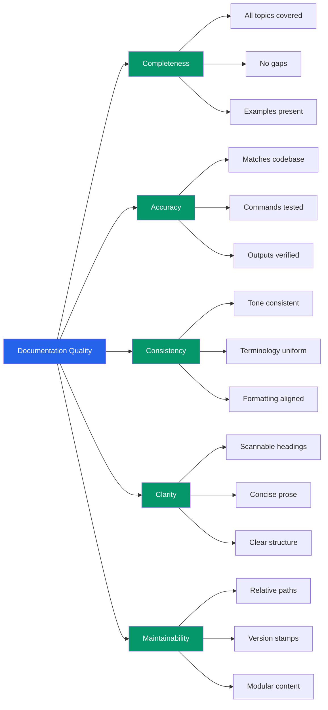

# Documentation Quality Standards

> **Document:** `DOCUMENTATION-QUALITY-STANDARDS.md` | **Version:** 1.0 | **Last Updated:** July 2026
> **Status:** ✅ Active | **Owner:** Engineering Lead | **Review Cadence:** Quarterly

## 1. Purpose

This document defines what "good documentation" means for this project. It establishes consistent structure, quality dimensions, maturity levels, and a measurement framework to ensure our documentation is accurate, usable, and maintainable alongside the codebase.

---

## 2. Doc Quality Dimensions



## 3. Required Document Header

Every document in `docs/` must begin with a header block:

| Field          | Requirement                               | Example                                           |
| -------------- | ----------------------------------------- | ------------------------------------------------- |
| Title          | H1 heading matching filename purpose      | `# Quality Gates — Release Lifecycle Enforcement` |
| Status         | Maturity level label                      | `Status: ✅ Active`                               |
| Version        | Semantic version of the document          | `Version: 1.0`                                    |
| Last Updated   | Date of most recent meaningful update     | `Last Updated: July 2026`                         |
| Owner          | Named individual responsible for accuracy | `Owner: QA Lead`                                  |
| Review Cadence | How often the document is reviewed        | `Review Cadence: Quarterly`                       |

Documents that omit any of these fields are considered **Level 1 (Stub)** until the header is complete.

---

## 3. Quality Dimensions

Each document is scored 1-10 across five dimensions:

| Dimension           | Definition                                                                                                                                            | Weight |
| ------------------- | ----------------------------------------------------------------------------------------------------------------------------------------------------- | ------ |
| **Completeness**    | All relevant topics are covered. No obvious gaps, missing scenarios, or unanswered questions.                                                         | 25%    |
| **Accuracy**        | Content matches current codebase behavior. Commands, examples, and outputs are tested against the actual system.                                      | 25%    |
| **Readability**     | Clear structure, scannable headings, concise prose. Appropriate use of tables, lists, and code blocks.                                                | 20%    |
| **Maintainability** | Cross-references use relative paths. Version stamps are updated. Content is modular (avoids duplicating information that lives in other docs).        | 15%    |
| **Consistency**     | Tone, terminology, and formatting match the project's documentation conventions. Headings, table styles, and code blocks follow established patterns. | 15%    |

### 3.1 Rating Scale

| Score | Meaning                                                               |
| ----- | --------------------------------------------------------------------- |
| 1-3   | Missing or incorrect. Requires significant rewrite.                   |
| 4-6   | Partially adequate. Contains gaps or inaccuracies but has some value. |
| 7-8   | Good. Meets expectations with minor improvements needed.              |
| 9-10  | Excellent. Complete, accurate, well-structured, easy to maintain.     |

---

## 4. Document Maturity Levels

| Level  | Name      | Criteria                                                                                                                                    | Quality Score Range | Update Frequency       |
| ------ | --------- | ------------------------------------------------------------------------------------------------------------------------------------------- | ------------------- | ---------------------- |
| **L1** | Stub      | Placeholder with title and header only. Outline or TOC present. No substantive content.                                                     | 0-2                 | N/A                    |
| **L2** | Draft     | Content exists but is incomplete. Gaps in coverage, examples untested, cross-references may be broken.                                      | 3-5                 | Ad-hoc                 |
| **L3** | Active    | Complete content, reviewed for accuracy within the last quarter. Examples tested. Cross-references valid. Meets all required header fields. | 6-7                 | Quarterly              |
| **L4** | Managed   | Active + usage metrics tracked. Regularly updated to reflect codebase changes. Version history maintained.                                  | 8-9                 | Monthly or per release |
| **L5** | Optimized | Managed + automated validation in CI. Broken link checks, example compilation tests, freshness alerts. Continuous improvement cycle.        | 9-10                | Continuous             |

---

## 5. Document Review Cycle

| Type                  | Frequency | Trigger                                                     | Responsible              |
| --------------------- | --------- | ----------------------------------------------------------- | ------------------------ |
| Full review           | Quarterly | Calendar (end of Q1, Q2, Q3, Q4)                            | Document owner           |
| Code-change-driven    | As needed | PRs that touch documented APIs, architecture, or workflows  | PR author + reviewer     |
| Freshness check       | Monthly   | Automated script checking `Last Updated` vs `git log` dates | CI + owner               |
| Cross-reference audit | Quarterly | Validate all relative links resolve correctly               | CI (broken-link-checker) |

### 5.1 Stale Document Policy

- Documents with `Last Updated` more than 6 months ago are flagged as **stale**.
- Stale documents have their status demoted one maturity level per quarter until reviewed.
- Documents stale for 12+ months are moved to `docs/ARCHIVE/` with a reference note in the original location.

---

## 6. Document Ownership

Every document has a single named owner listed in the header. Responsibilities include:

- Ensuring accuracy and completeness of content
- Performing quarterly reviews on schedule
- Updating content in response to codebase changes
- Reviewing PRs that modify their document
- Responding to issues or questions about the document

Document ownership is recorded in `docs/OWNERSHIP-MATRIX.md` (one row per document).

---

## 7. Quality Score Calculation

The overall quality score for a document is the weighted average of its five dimension scores:

```
Score = (Completeness × 0.25) + (Accuracy × 0.25) + (Readability × 0.20) + (Maintainability × 0.15) + (Consistency × 0.15)
```

**Example:** A document scored Completeness=8, Accuracy=7, Readability=9, Maintainability=6, Consistency=8:

```
Score = (8 × 0.25) + (7 × 0.25) + (9 × 0.20) + (6 × 0.15) + (8 × 0.15)
     = 2.00 + 1.75 + 1.80 + 0.90 + 1.20
     = 7.65 → Rounded to 8
```

Scores are recorded in the quarterly documentation audit (`docs/23-governance/DOC-AUDIT-REPORT.md`).

---

## 8. Documentation Debt

Documentation debt tracks the gap between current documentation quality and the target maturity level.

### 8.1 Debt Classification

| Debt Class     | Definition                                       | Action                                    |
| -------------- | ------------------------------------------------ | ----------------------------------------- |
| **Missing**    | Document does not exist for a required topic     | Create stub (L1) within 1 sprint          |
| **Stale**      | Content is outdated relative to current codebase | Full review + update within 1 sprint      |
| **Inaccurate** | Document contains factual errors                 | Correct within 48 hours of discovery      |
| **Incomplete** | Document exists but has significant gaps         | Identify missing sections, plan additions |
| **Unowned**    | Document has no named owner                      | Assign owner within 1 week                |

### 8.2 Debt Prioritization

| Priority | Criteria                                                       | Resolution SLA |
| -------- | -------------------------------------------------------------- | -------------- |
| P0       | Document contains dangerous instructions (security, data loss) | Immediate      |
| P1       | Document is stale for a live API or deployment process         | < 1 week       |
| P2       | Document quality score < 5                                     | Current sprint |
| P3       | Document quality score 5-7                                     | Next sprint    |
| P4       | Document is L1 stub without timeline for completion            | Next quarter   |

### 8.3 Debt Tracking

Documentation debt items are tracked as GitHub Issues with label `area:docs`. Each issue includes: document path, debt class, current score, target score, and owner. The quarterly documentation audit reviews all open debt items and updates priorities.

## Cross-References

- [MASTER-INDEX.md](../MASTER-INDEX.md) — Documentation master index
- [CROSS-REFERENCE-INDEX.md](../26-reference/CROSS-REFERENCE-INDEX.md) — Cross-reference system
