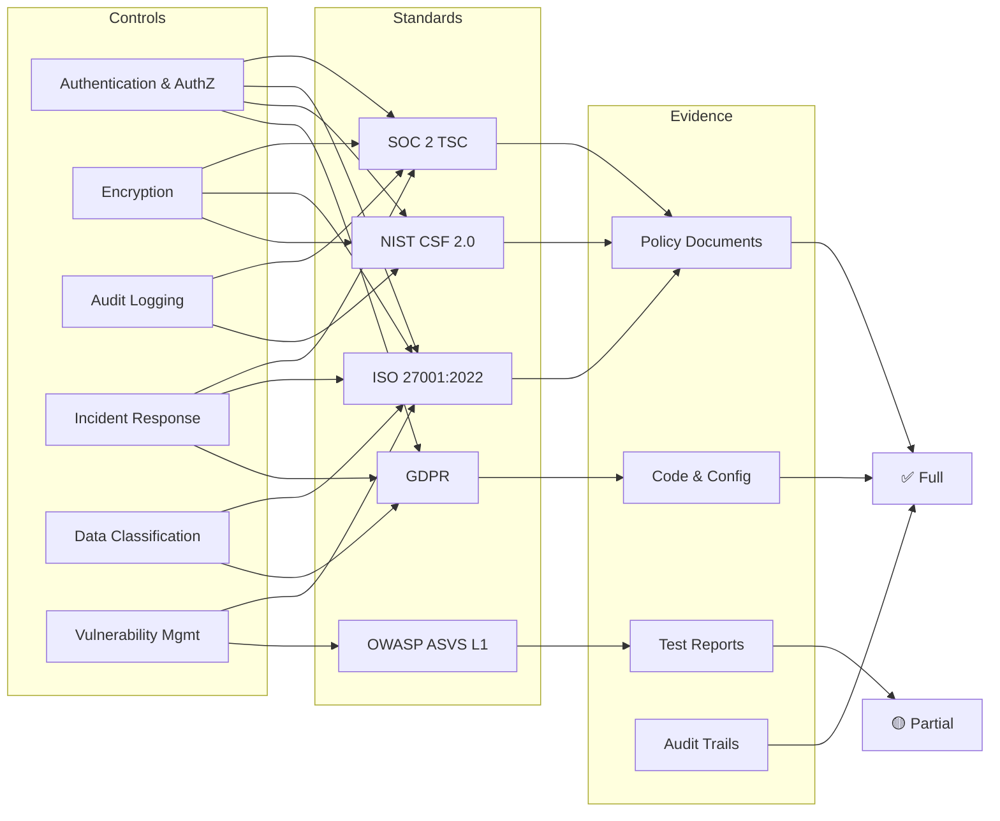

# Master Compliance Matrix

> **Document:** `COMPLIANCE-MATRIX.md` | **Version:** 1.0 | **Last Updated:** July 2026
> **Status:** ✅ Active | **Owner:** Security Lead | **Review Cadence:** Quarterly
> **Classification:** Internal — Engineering & Legal

---

## Legend

| Symbol     | Meaning                                            |
| ---------- | -------------------------------------------------- |
| ✅ Full    | Control fully implemented with documented evidence |
| 🟡 Partial | Control partially implemented, gaps remain         |
| ❌ Missing | Control not implemented                            |
| 📋 Planned | Implementation scheduled on roadmap                |
| N/A        | Not applicable                                     |

---

## Control-to-Framework Mapping

| Control                         | OWASP ASVS L1                               | NIST CSF 2.0                              | GDPR                              | SOC 2 TSC              | ISO 27001 (2022)                  | WCAG 2.2 AA             | Internal Standard                                                                                    |
| ------------------------------- | ------------------------------------------- | ----------------------------------------- | --------------------------------- | ---------------------- | --------------------------------- | ----------------------- | ---------------------------------------------------------------------------------------------------- |
| **Authentication (JWT, OAuth)** | ✅ V2.1.1, V2.1.2, V2.5.1–3                 | ✅ PR.AA-01, PR.AA-04                     | ✅ Art. 32                        | ✅ CC6.1–CC6.7         | ✅ A.8.2, A.8.3, A.8.5            | N/A                     | `docs/11-security/SECURITY-ARCHITECTURE.md` §5                                                       |
| **Authorization (RBAC, RLS)**   | ✅ V4.1.1, V4.1.2, V4.2.2                   | ✅ PR.AA-03, PR.AA-05, GV.RR-01           | ✅ Art. 25 (Pbd)                  | ✅ CC6.3, CC6.5        | ✅ A.8.2, A.9.2, A.9.3            | N/A                     | `docs/11-security/SECURITY-ARCHITECTURE.md` §6; `apps/api/src/modules/auth/roles.guard.ts`           |
| **Encryption (TLS, at-rest)**   | ✅ V2.1.1, V9.1.1                           | ✅ PR.DS-01, PR.DS-02                     | ✅ Art. 32(1)(a)                  | ✅ CC6.7, C1.2         | ✅ A.8.1, A.8.24, A.8.25          | N/A                     | `docs/11-security/SECURITY-ARCHITECTURE.md` §26                                                      |
| **Access Control**              | ✅ V4.1.3, V4.2.1, V4.3.1                   | ✅ PR.AA-01, PR.AA-03, GV.RR-02           | ✅ Art. 32(4)                     | ✅ CC6.1–CC6.6         | ✅ A.8.2, A.8.3, A.9.1            | N/A                     | `docs/11-security/SECURITY-ARCHITECTURE.md` §6, §9; `docs/11-security/DATA-CLASSIFICATION.md`        |
| **Audit Logging**               | 🟡 V7.1.1, V7.1.2                           | ✅ DE.AE-01, DE.AE-03, DE.CM-01           | ✅ Art. 30                        | ✅ CC2.2, CC4.1        | ✅ A.8.15, A.8.16                 | N/A                     | `docs/11-security/AUDIT-LOGGING.md`; `apps/api/src/common/interceptors/logging.interceptor.ts`       |
| **Session Management**          | ✅ V3.1.1, V3.2.1, V3.3.1, V3.4.1–3, V3.5.1 | ✅ PR.AA-01, PR.AA-04                     | ✅ Art. 32                        | ✅ CC6.1, CC6.5        | ✅ A.8.3, A.8.5                   | N/A                     | `docs/11-security/SECURITY-ARCHITECTURE.md` §7; `apps/api/src/modules/auth/session.service.ts`       |
| **Input Validation**            | ✅ V5.1.1–3, V5.2.1, V5.3.1                 | ✅ PR.IP-10                               | ✅ Art. 25 (Pbd)                  | ✅ PI1.1, PI1.2        | ✅ A.8.7, A.8.8                   | N/A                     | `packages/shared/src/schemas/`; `apps/api/src/common/pipes/validation.pipe.ts`                       |
| **Error Handling**              | ✅ V7.4.1, V7.4.2                           | ✅ PR.IP-12                               | ✅ Art. 32                        | ✅ CC7.2, PI1.2        | ✅ A.8.6                          | N/A                     | `apps/api/src/common/filters/`; Sentry error scrubbing config                                        |
| **Incident Response**           | ❌ Not in scope                             | ✅ RS.MA-01, RS.CO-01, RS.CO-02, RS.MI-01 | ✅ Art. 33, Art. 34               | ✅ CC7.3, CC7.4        | ✅ A.5.24, A.5.25, A.5.26         | N/A                     | `docs/11-security/SECURITY-INCIDENT-RUNBOOK.md`; `docs/11-security/COMPLIANCE.md` §11                |
| **Data Classification**         | ❌ Not in scope                             | ✅ ID.AM-03                               | ✅ Art. 5, Art. 30                | ✅ C1.1, C1.2, P1.1    | ✅ A.5.12, A.5.13, A.8.2          | N/A                     | `docs/11-security/DATA-CLASSIFICATION.md`; `docs/11-security/DATA-GOVERNANCE.md`                     |
| **Data Retention**              | ❌ Not in scope                             | ✅ PR.DS-09, PR.DS-11                     | ✅ Art. 5(1)(e), Art. 17, Art. 19 | ✅ P1.4, P1.5          | ✅ A.8.3, A.8.10, A.8.11          | N/A                     | `docs/11-security/DATA-GOVERNANCE.md` §4; `docs/11-security/GDPR.md` §2                              |
| **Vulnerability Management**    | ✅ V12.2.1, V12.3.1                         | ✅ ID.RA-01, ID.RA-02, PR.PS-01           | ✅ Art. 32                        | ✅ CC3.1, CC4.1        | ✅ A.5.22, A.8.8, A.8.22          | N/A                     | `docs/11-security/VULNERABILITY-MANAGEMENT.md`; Dependabot; weekly npm audit                         |
| **Secrets Management**          | ✅ V2.1.1, V9.2.1                           | ✅ PR.AC-01, PR.AC-03                     | ✅ Art. 32                        | ✅ CC6.1, CC6.7        | ✅ A.8.1, A.8.24, A.8.25          | N/A                     | `docs/11-security/SECRETS-MANAGEMENT.md`; `docs/11-security/SECRETS-ROTATION.md`; `.env` via config/ |
| **Backup & Recovery**           | ❌ Not in scope                             | ✅ PR.DS-10, RC.RP-01                     | ✅ Art. 32                        | ✅ A1.2, CC7.5         | ✅ A.5.29, A.8.13, A.8.14         | N/A                     | Supabase PITR; Prisma migrations; Infrastructure/docker volume snapshots                             |
| **Monitoring & Alerting**       | 🟡 V7.1.1                                   | ✅ DE.CM-01, DE.CM-04, DE.CM-07           | ✅ Art. 32                        | ✅ CC4.1, CC7.1, CC7.2 | ✅ A.5.25, A.8.15, A.8.16         | N/A                     | Better Uptime; Sentry; `docs/11-security/SECURITY-ARCHITECTURE.md` §29                               |
| **Change Management**           | ❌ Not in scope                             | ✅ ID.IM-01, PR.IP-03, PR.IP-06           | ❌ N/A                            | ✅ CC8.1, CC8.2        | ✅ A.5.31, A.5.32, A.5.33, A.5.34 | N/A                     | `docs/34-contributing/CONTRIBUTING.md`; `.github/workflows/ci.yml`                                   |
| **Code Review**                 | ✅ V14.2.1                                  | ✅ PR.IP-03, PR.IP-06                     | ❌ N/A                            | ✅ CC8.1               | ✅ A.5.31, A.8.28                 | N/A                     | `docs/34-contributing/CONTRIBUTING.md` (§7–8); branch protection rules                               |
| **Testing**                     | ✅ V14.1.1, V14.2.1                         | ✅ PR.IP-03, PR.IP-12                     | ❌ N/A                            | ✅ CC8.2, PI1.1        | ✅ A.5.31, A.5.36, A.8.29         | N/A                     | Jest (API), Vitest (Web), Playwright (E2E); `docs/11-security/SECURITY-TESTING.md`                   |
| **Documentation**               | ✅ V14.2.2                                  | ✅ GV.OC-01, GV.OC-02                     | ✅ Art. 5(2), Art. 24(1), Art. 30 | ✅ CC1.1, CC2.1        | ✅ A.5.1, A.5.2, A.5.3, A.7.5     | 📋 Planned 3.1.1, 3.2.6 | MASTER-INDEX.md; ADR process; docs/ directory                                                        |

---

## Framework References

| Framework             | Reference Versions                    | Mapping Source                            |
| --------------------- | ------------------------------------- | ----------------------------------------- |
| **OWASP ASVS L1**     | v4.0.3 — Level 1 (Automated)          | `docs/11-security/OWASP-ASVS.md`          |
| **NIST CSF 2.0**      | February 2024                         | `docs/11-security/NIST-CSF.md`            |
| **GDPR**              | Regulation (EU) 2016/679              | `docs/11-security/GDPR.md`                |
| **SOC 2 TSC**         | AICPA 2023 Trust Services Criteria    | `docs/36-enterprise/SOC2-READINESS.md`    |
| **ISO 27001:2022**    | Annex A controls (ISO/IEC 27001:2022) | `docs/36-enterprise/ISO-25010-MAPPING.md` |
| **WCAG 2.2 AA**       | W3C Recommendation (October 2023)     | `docs/11-security/COMPLIANCE.md` §3       |
| **Internal Standard** | Portfolio platform docs + code        | `docs/MASTER-INDEX.md`                    |

---

## Overall Compliance Summary

| Framework      | Controls        | ✅ Full | 🟡 Partial | ❌ Missing | % Complete |
| -------------- | --------------- | ------- | ---------- | ---------- | ---------- |
| OWASP ASVS L1  | 12              | 10      | 2          | 0          | 83%        |
| NIST CSF 2.0   | 99+             | 14      | 6          | 0          | ~75%       |
| GDPR           | 20+             | 18      | 2          | 0          | ~85%       |
| SOC 2 TSC      | 10 (aggregated) | 5       | 5          | 0          | 50%        |
| ISO 27001:2022 | 20              | 15      | 4          | 1          | ~75%       |
| WCAG 2.2 AA    | 18              | 13      | 5          | 0          | 72%        |

---

## Compliance Coverage Mapping

## Change Log

| Date       | Version | Author        | Change                           |
| ---------- | ------- | ------------- | -------------------------------- |
| 2026-07-11 | 1.0     | Security Lead | Initial master compliance matrix |

## Cross-References

- [MASTER-INDEX.md](../MASTER-INDEX.md) — Documentation master index
- [CROSS-REFERENCE-INDEX.md](../26-reference/CROSS-REFERENCE-INDEX.md) — Cross-reference system
