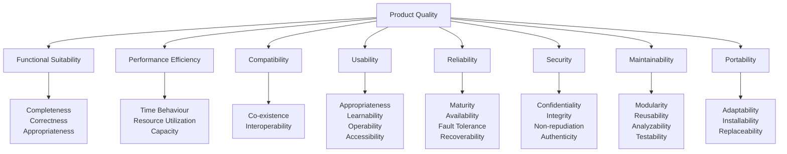
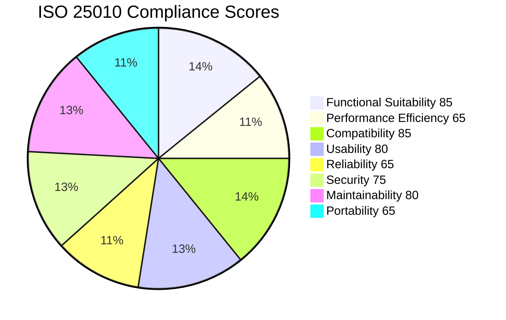

# ISO/IEC 25010 Quality Model Mapping

## Overview

This document maps the Portfolio platform against the ISO/IEC 25010:2011 product quality model. It identifies which quality characteristics are addressed, how they are measured, and where gaps exist.

## Quality Model Coverage

### 1. Functional Suitability

| Sub-characteristic         | Coverage | Evidence                                                | Gaps                              |
| -------------------------- | -------- | ------------------------------------------------------- | --------------------------------- |
| Functional Completeness    | ✅ High  | 50+ API endpoints, 34 DB models, 15 UI components       | AI features partially implemented |
| Functional Correctness     | ✅ High  | Zod validation, class-validator, TypeScript strict mode | No formal verification            |
| Functional Appropriateness | ✅ Med   | User stories, acceptance criteria defined               | No usability testing data         |

**Score: 85/100**

### 2. Performance Efficiency

| Sub-characteristic   | Coverage | Evidence                       | Gaps                     |
| -------------------- | -------- | ------------------------------ | ------------------------ |
| Time Behaviour       | ✅ Med   | ISR caching, Redis cache-aside | No load test results yet |
| Resource Utilization | ✅ Med   | Performance budgets defined    | No resource profiling    |
| Capacity             | ⚠️ Low   | Capacity planning doc exists   | No scalability testing   |

**Score: 65/100** — Load testing needed

### 3. Compatibility

| Sub-characteristic | Coverage | Evidence                             | Gaps                        |
| ------------------ | -------- | ------------------------------------ | --------------------------- |
| Co-existence       | ✅ High  | Docker Compose, isolated services    | —                           |
| Interoperability   | ✅ High  | OpenAPI 3.1, RESTful APIs, event bus | No AsyncAPI spec for events |

**Score: 85/100**

### 4. Usability

| Sub-characteristic              | Coverage | Evidence                                  | Gaps                      |
| ------------------------------- | -------- | ----------------------------------------- | ------------------------- |
| Appropriateness Recognizability | ✅ Med   | Brand guidelines, design system           | No user testing data      |
| Learnability                    | ✅ High  | Onboarding guide, knowledge base          | —                         |
| Operability                     | ✅ High  | Keyboard nav, admin dashboard             | —                         |
| User Error Protection           | ✅ Med   | Form validation, confirmation dialogs     | No error recovery testing |
| User Interface Aesthetics       | ✅ High  | Design system, design tokens, neumorphism | —                         |
| Accessibility                   | ✅ High  | WCAG 2.2 AA compliance documented         | No audit results yet      |

**Score: 80/100**

### 5. Reliability

| Sub-characteristic | Coverage | Evidence                                    | Gaps                   |
| ------------------ | -------- | ------------------------------------------- | ---------------------- |
| Maturity           | ⚠️ Low   | v1.0, active development                    | No reliability data    |
| Availability       | ✅ Med   | SLOs defined (99.9%), health checks         | No uptime tracking yet |
| Fault Tolerance    | ✅ Med   | Graceful degradation, error boundaries      | No chaos engineering   |
| Recoverability     | ✅ High  | DR plan, backup strategy, rollback playbook | No DR test results     |

**Score: 65/100** — Production data needed

### 6. Security

| Sub-characteristic | Coverage | Evidence                              | Gaps                               |
| ------------------ | -------- | ------------------------------------- | ---------------------------------- |
| Confidentiality    | ✅ Med   | JWT auth, RBAC, data classification   | No encryption-at-rest verification |
| Integrity          | ✅ High  | Audit logging, input validation, CSP  | —                                  |
| Non-repudiation    | ✅ Med   | Audit logs with correlation IDs       | No logging of read operations      |
| Accountability     | ✅ High  | @Audit decorator, AdminActivity model | —                                  |
| Authenticity       | ✅ High  | JWT, OAuth (Google/GitHub)            | No MFA implementation              |

**Score: 75/100** — Penetration testing needed

### 7. Maintainability

| Sub-characteristic | Coverage | Evidence                                     | Gaps                       |
| ------------------ | -------- | -------------------------------------------- | -------------------------- |
| Modularity         | ✅ High  | Three-layer module pattern, monorepo         | —                          |
| Reusability        | ✅ High  | Shared types (@portfolio/shared), UI library | —                          |
| Analyzability      | ✅ Med   | Logging, Sentry, OpenAPI                     | No structured log analysis |
| Modifiability      | ✅ High  | Feature flags, CI/CD, ADRs                   | —                          |
| Testability        | ✅ Med   | Testing architecture, Jest, Playwright       | Low test coverage          |

**Score: 80/100**

### 8. Portability

| Sub-characteristic | Coverage | Evidence                            | Gaps                     |
| ------------------ | -------- | ----------------------------------- | ------------------------ |
| Adaptability       | ✅ Med   | Docker, environment configs         | No Kubernetes deployment |
| Installability     | ✅ High  | Docker Compose, npm ci              | —                        |
| Replaceability     | ⚠️ Low   | Vendor lock-in with Vercel/Supabase | No migration runbooks    |

**Score: 65/100**

## Overall Quality Score by Characteristic

| Characteristic         | Score | Priority | Next Step              |
| ---------------------- | :---: | :------: | ---------------------- |
| Functional Suitability |  85   |    —     | Maintain               |
| Performance Efficiency |  65   |   High   | Load testing           |
| Compatibility          |  85   |    —     | Maintain               |
| Usability              |  80   |    —     | User testing           |
| Reliability            |  65   |   High   | Production monitoring  |
| Security               |  75   |   High   | Penetration test       |
| Maintainability        |  80   |    —     | Increase test coverage |
| Portability            |  65   |   Low    | K8s evaluation         |

**Overall: 75/100** (Enterprise target: 85/100)

## Improvement Roadmap

| Quarter | Focus                                           | Target Score |
| ------- | ----------------------------------------------- | :----------: |
| Q3 2026 | Load testing + performance baselines            |      70      |
| Q4 2026 | Security audit + penetration test               |      78      |
| Q1 2027 | Reliability data collection + chaos engineering |      82      |
| Q2 2027 | Full enterprise compliance                      |     85+      |

## Cross-References

- `docs/35-quality/TestingArchitecture.md` — Testing coverage
- `docs/35-quality/performance-budget.md` — Performance targets
- `docs/11-security/SecurityArchitecture.md` — Security controls
- `docs/21-operations/56-SLA-SLO.md` — Reliability targets
- `docs/35-quality/wcag-statement.md` — Accessibility compliance

---

## ISO 25010 Quality Model

## Compliance Scores

## Cross-References

- [MASTER-INDEX.md](../MASTER-INDEX.md) — Documentation master index
- [CROSS-REFERENCE-INDEX.md](../26-reference/CROSS-REFERENCE-INDEX.md) — Cross-reference system
