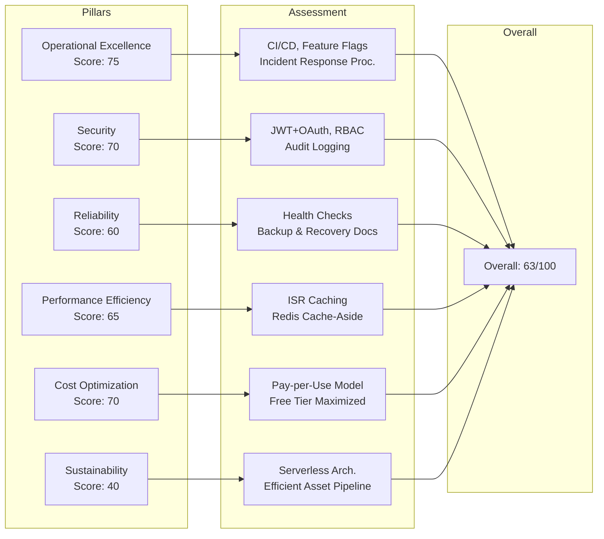

# AWS Well-Architected Framework Review

## Overview

This document reviews the Portfolio platform against the AWS Well-Architected Framework's six pillars. This review identifies areas of strength and improvement opportunities.

## Review Scope

- **Platform:** Portfolio (Next.js + NestJS + FastAPI)
- **Hosting:** Vercel (web + API), Railway (AI), Supabase (database)
- **Review Date:** July 2026
- **Reviewer:** Platform Engineering Team

## Pillar 1: Operational Excellence

### Design Principles

| Principle                               | Status | Implementation                           |
| --------------------------------------- | :----: | ---------------------------------------- |
| Perform operations as code              |   ✅   | GitHub Actions CI/CD, Docker Compose     |
| Make frequent small reversible changes  |   ✅   | Feature flags, CI/CD, PR reviews         |
| Refine operations procedures frequently |   ⚠️   | Runbooks exist but not frequently tested |
| Anticipate failure                      |   ✅   | DR plan, incident response playbook      |
| Learn from all operational failures     |   ✅   | Post-incident review template            |

### Key Strengths

- Comprehensive CI/CD with quality gates
- Feature flags for gradual rollouts
- Structured incident response process

### Improvement Areas

| Issue                            | Severity | Recommendation                                                     |
| -------------------------------- | :------: | ------------------------------------------------------------------ |
| No operations metrics tracking   |  Medium  | Implement dashboards for deployment frequency, change failure rate |
| Runbooks not tested regularly    |  Medium  | Schedule quarterly runbook drills                                  |
| No game days / chaos engineering |   Low    | Plan annual failure simulation                                     |

**Score: 75/100**

## Pillar 2: Security

### Design Principles

| Principle                              | Status | Implementation                                                |
| -------------------------------------- | :----: | ------------------------------------------------------------- |
| Implement a strong identity foundation |   ✅   | JWT + OAuth, RBAC                                             |
| Enable traceability                    |   ✅   | Audit logging, correlation IDs                                |
| Apply security at all layers           |   ✅   | Helmet, CORS, input validation, rate limiting                 |
| Automate security best practices       |   ⚠️   | No automated security scanning in CI                          |
| Protect data in transit and at rest    |   ⚠️   | HTTPS enforced, but application-level encryption not verified |
| Keep people away from data             |   ✅   | Role-based access, no direct DB access in prod                |
| Prepare for security events            |   ✅   | Incident response playbook, SECURITY.md                       |

### Key Strengths

- Defense in depth: auth → RBAC → validation → audit → rate limiting
- Structured vulnerability disclosure process (SECURITY.md)
- Data classification framework

### Improvement Areas

| Issue                         | Severity | Recommendation                                |
| ----------------------------- | :------: | --------------------------------------------- |
| No SAST/DAST in CI pipeline   |   High   | Integrate CodeQL or Snyk                      |
| No secret vault/rotation      |   High   | Implement environment-based secret management |
| No penetration test performed |  Medium  | Schedule annual penetration test              |
| No MFA for admin accounts     |  Medium  | Evaluate adding TOTP to admin login           |

**Score: 70/100**

## Pillar 3: Reliability

### Design Principles

| Principle                                             | Status | Implementation                                    |
| ----------------------------------------------------- | :----: | ------------------------------------------------- |
| Automatically recover from failure                    |   ⚠️   | Health checks exist, auto-recovery not configured |
| Test recovery procedures                              |   ❌   | DR plan documented but not tested                 |
| Scale horizontally to increase aggregate availability |   ✅   | Serverless + container architecture               |
| Stop guessing capacity                                |   ⚠️   | Capacity planning exists, no load testing data    |
| Manage change through automation                      |   ✅   | CI/CD, feature flags, infrastructure as code      |

### Key Strengths

- Health check endpoints (liveness + readiness)
- Database backup and recovery documented
- Rollback procedures for all services

### Improvement Areas

| Issue                    | Severity | Recommendation                          |
| ------------------------ | :------: | --------------------------------------- |
| No DR test results       |   High   | Schedule quarterly DR drills            |
| No load testing data     |   High   | Execute load tests per specification    |
| No chaos engineering     |  Medium  | Introduce Chaos Mesh or Gremlin         |
| Single-region deployment |  Medium  | Evaluate multi-region for critical path |

**Score: 60/100**

## Pillar 4: Performance Efficiency

### Design Principles

| Principle                         | Status | Implementation                               |
| --------------------------------- | :----: | -------------------------------------------- |
| Democratize advanced technologies |   ✅   | Managed services (Supabase, Vercel, Upstash) |
| Go global in minutes              |   ✅   | Vercel edge network, Cloudflare CDN          |
| Use serverless architectures      |   ✅   | Vercel serverless functions                  |
| Experiment more often             |   ✅   | Feature flags for A/B testing                |
| Consider mechanical sympathy      |   ⚠️   | Performance budgets defined, not measured    |

### Key Strengths

- ISR caching for public pages (60s revalidation)
- Redis cache-aside pattern
- Performance budgets documented

### Improvement Areas

| Issue                             | Severity | Recommendation                           |
| --------------------------------- | :------: | ---------------------------------------- |
| No Lighthouse CI in pipeline      |   High   | Add performance budget enforcement to CI |
| No load test results              |   High   | Execute load test specification          |
| No CDN cache hit ratio monitoring |  Medium  | Add Cloudflare analytics monitoring      |
| No bundle analysis in CI          |  Medium  | Add `ANALYZE=true` to CI build step      |

**Score: 65/100**

## Pillar 5: Cost Optimization

### Design Principles

| Principle                                             | Status | Implementation                                      |
| ----------------------------------------------------- | :----: | --------------------------------------------------- |
| Implement cloud financial management                  |   ✅   | Cost management documented                          |
| Adopt a consumption model                             |   ✅   | Pay-per-use (Vercel, Supabase, Railway)             |
| Measure overall efficiency                            |   ⚠️   | No cost tracking dashboard                          |
| Stop spending money on undifferentiated heavy lifting |   ✅   | Managed services for everything                     |
| Analyze and attribute expenditure                     |   ⚠️   | Services tracked individually, no consolidated view |

### Key Strengths

- Cost management strategy documented (~$10/yr target)
- Free tier usage maximized
- Vendor management with cost tracking

### Improvement Areas

| Issue                           | Severity | Recommendation                                            |
| ------------------------------- | :------: | --------------------------------------------------------- |
| No consolidated cost dashboard  |  Medium  | Set up cost tracking in a single view                     |
| No budget alerts configured     |  Medium  | Configure budget alerts per service                       |
| No reserved capacity evaluation |   Low    | Monitor for when reserved instances become cost-effective |

**Score: 70/100**

## Pillar 6: Sustainability

### Design Principles

| Principle                          | Status | Implementation                                       |
| ---------------------------------- | :----: | ---------------------------------------------------- |
| Understand your impact             |   ❌   | No sustainability assessment                         |
| Establish sustainability goals     |   ❌   | No sustainability targets                            |
| Maximize utilization               |   ⚠️   | Serverless reduces idle, but no utilization tracking |
| Anticipate and adopt new offerings |   ✅   | Regular tech radar updates                           |
| Use managed services               |   ✅   | Reduces infrastructure carbon footprint              |

### Key Strengths

- Serverless architecture reduces idle resource waste
- Managed services minimize infrastructure overhead
- Efficient asset pipeline (WebP, DRACO compression)

### Improvement Areas

| Issue                   | Severity | Recommendation                                         |
| ----------------------- | :------: | ------------------------------------------------------ |
| No carbon tracking      |   Low    | Evaluate AWS Customer Carbon Footprint tool equivalent |
| No sustainability goals |   Low    | Add to roadmap                                         |

**Score: 40/100**

## Overall Assessment

| Pillar                 | Score  |      Maturity      | Priority |
| ---------------------- | :----: | :----------------: | :------: |
| Operational Excellence |   75   | Level 3 (Measured) |    —     |
| Security               |   70   | Level 3 (Measured) | **High** |
| Reliability            |   60   | Level 2 (Defined)  | **High** |
| Performance Efficiency |   65   | Level 2 (Defined)  | **High** |
| Cost Optimization      |   70   | Level 3 (Measured) |  Medium  |
| Sustainability         |   40   | Level 1 (Initial)  |   Low    |
| **Overall**            | **63** |   **Level 2-3**    |          |

## Improvement Roadmap

| Quarter | Focus                                 | Pillar         | Target Score |
| ------- | ------------------------------------- | -------------- | :----------: |
| Q3 2026 | Security scanning + secret management | Security       |    75→85     |
| Q3 2026 | Load testing + performance baselines  | Performance    |    65→75     |
| Q3 2026 | DR testing + chaos engineering        | Reliability    |    60→75     |
| Q4 2026 | Cost dashboards + budgeting           | Cost           |    70→80     |
| Q1 2027 | Sustainability assessment             | Sustainability |    40→60     |

## Cross-References

- `docs/05-architecture/SystemArchitecture.md` — System architecture
- `docs/11-security/SecurityArchitecture.md` — Security controls
- `docs/21-operations/55-DISASTER-RECOVERY.md` — Disaster recovery
- `docs/35-quality/performance-budget.md` — Performance budgets
- `docs/21-operations/58-COST-MANAGEMENT.md` — Cost strategy

---

## Well-Architected Pillars Assessment

## Cross-References

- [MASTER-INDEX.md](../MASTER-INDEX.md) — Documentation master index
- [CROSS-REFERENCE-INDEX.md](../26-reference/CROSS-REFERENCE-INDEX.md) — Cross-reference system
