# 📚 Portfolio Documentation Master Index

> **Version:** 6.0 | **Last Updated:** July 2026  
> **Project:** My Portfolio — Enterprise-Grade Personal Portfolio Platform

---

## What's New in v6.0 (July 2026 — Enterprise Transformation)

### Foundation Cleanup

- **Archive removed:** All 47 superseded v4.0 archive files deleted
- **Duplicates eliminated:** 9 duplicate files removed (ADR-005/008/011/013/014 standalones, 44-API-STANDARDS.md, ERD.md, 52-TESTING-STRATEGY.md)
- **Combined ADRs split:** ADR-004/005, 007/008, 010/011, 012/013/014 all split into individual one-ADR-per-file
- **Broken docs fixed:** AnalyticsImplementation.md split from 1-line/15K-word blob into 875 lines; ADR README index table fixed (no longer says "No ADRs yet")
- **README corrected:** `npm test` claim replaced with per-workspace testing guidance
- **Privacy policy completed:** Physical address added (TODO resolved)
- **Security:** `apps/api/.env` removed from repo, added to `.gitignore`

### Engineering Foundation (NEW docs)

- **Engineering Playbook:** docs/engineering/engineering-playbook.md — 12-section guide covering culture, workflow, code review, testing, CI/CD, deployment, incident response, on-call, tech debt, docs, security, tools
- **Code Review Standards:** docs/engineering/code-review-standards.md — Review SLA tiers, NestJS/React-specific checklists, security + testing review checklists
- **Naming Conventions:** docs/engineering/naming-conventions.md — 12-section guide across TS, NestJS, Next.js, React, Prisma, API, env vars, Git, CSS
- **Branch Strategy Guide:** docs/engineering/branch-strategy.md — Trunk-based dev, 7 branch types, Conventional Commits, PR requirements, hotfix process
- **RFC-001 (Prisma ORM):** docs/engineering/RFC-001-prisma-orm.md — Architecture decision for database ORM
- **RFC-002 (TanStack Query):** docs/engineering/RFC-002-tanstack-query.md — Architecture decision for state management

### Testing & QA (NEW docs)

- **Test Strategy Master Plan:** docs/testing/test-strategy-master-plan.md — Full test pyramid, per-service specs, CI integration, quality gates, 6-week rollout roadmap
- **CI/CD Pipeline Strategy:** docs/devops/ci-cd-pipeline-strategy.md — 10 pipeline stages, environment strategy, quality gates, security integration, migration plan

### Security Hardening (NEW docs)

- **MFA Rollout Plan:** docs/security/mfa-rollout-plan.md — TOTP implementation, 3-phase rollout, recovery flow, API changes
- **Vulnerability Management Policy:** docs/security/vulnerability-management-policy.md — Severity classification, SLA matrix, triage workflow
- **Supply Chain Security Policy:** docs/security/supply-chain-security-policy.md — Dependency inventory, update cadence, SLSA Level, prohibited deps
- **Secrets Rotation Schedule:** docs/security/secrets-rotation-schedule.md — Rotation frequencies and step-by-step runbooks for all 9 secret types
- **NIST CSF Mapping:** docs/security/nist-csf-mapping.md — All 6 NIST functions mapped to Portfolio controls with gap analysis
- **SOC 2 Readiness:** docs/standards/soc2-readiness.md — Trust Service Criteria mapping, gap analysis, 6-month readiness roadmap

### Operations & SRE (NEW docs)

- **On-Call Schedule:** docs/operations/on-call-schedule.md — Rotation structure, responsibilities, handoff process, after-hours protocol
- **Incident Severity Criteria:** docs/operations/incident-severity-criteria.md — Rigorous SEV-1/2/3/4 definitions with Portfolio-specific examples
- **Deployment Strategy (Blue/Green):** docs/operations/deployment-strategy-blue-green.md — Zero-downtime architecture, rollback procedure, feature flag integration
- **Operational Runbook Index:** docs/operations/operational-runbook-index.md — Master index of all 20 runbooks with time estimates
- **Postmortem Tracker:** docs/operations/postmortem-tracker.md — Weekly review template, action item tracking, metrics
- **Incident Communication Templates:** docs/playbooks/incident-communication-templates.md — Slack/email templates for all severity levels

### Architecture (NEW ADRs)

- **ADR-015 (Docker Multi-stage Build):** docs/adr/ADR-015-docker-multistage-build.md
- **ADR-016 (Sentry Error Tracking):** docs/adr/ADR-016-sentry-error-tracking.md
- **ADR-017 (BullMQ Queue):** docs/adr/ADR-017-bullmq-queue.md
- **ADR-018 (Passport.js Auth):** docs/adr/ADR-018-nestjs-passport-auth.md

### Product (Expanded)

- **Product Vision (expanded):** docs/product/product-vision-expanded.md — From 20-line stub to 7-page vision document
- **Competitive Analysis (expanded):** docs/product/competitive-analysis-expanded.md — From 21-line stub to 8-page analysis with comparison matrix

### AI (Grounded Strategy)

- **AI Strategy:** docs/ai/strategy.md — Practical, non-aspirational strategy. Current capabilities, model rationale, cost analysis, honest limitations, 6-month roadmap
- **Model Decision Matrix:** docs/ai/model-decision-matrix.md — GPT-4o vs Claude Sonnet vs text-embedding-3 comparison with decision tree

### Developer Experience (NEW)

- **Local Dev Troubleshooting:** docs/knowledge-base/local-dev-troubleshooting.md — 7-category troubleshooting for env, DB, API, frontend, AI, Docker, Git
- **Docker Compose Quickstart:** docs/knowledge-base/docker-compose-quickstart.md — 2-command quickstart, service table, common commands

---

## Quick Navigation

| Category              | Directory         | Description                                                             |
| --------------------- | ----------------- | ----------------------------------------------------------------------- |
| 🎯 **Planning**       | `product/`        | PRD, FEATURES, USER-STORIES, USER-FLOWS                                 |
| 🎨 **Design**         | `design/`         | Screen Flows, UI/UX, Design System, Components, 3D, Motion, Interaction |
| 🏗️ **Architecture**   | `architecture/`   | System architecture, tech stack, DB, API                                |
| 🔒 **Security**       | `security/`       | Security, auth, compliance, hardening                                   |
| ⚖️ **Compliance**     | `compliance/`     | Privacy, cookie, GDPR policies                                          |
| 🤖 **AI & Agents**    | `ai/`             | AI ops, multi-agent ecosystem, agents, skills, prompts                  |
| 📊 **Observability**  | `operations/`     | Analytics, monitoring, observability                                    |
| ⚙️ **Operations**     | `operations/`     | DevOps, deploy, CI/CD, DR, SLA, change, cost                            |
| 🚀 **Quality**        | `quality/`        | Perf, SEO, a11y, testing, QA                                            |
| 📋 **Onboarding**     | `onboarding/`     | Developer onboarding guide                                              |
| 🛠️ **Engineering**    | `engineering/`    | Playbook, standards, RFCs, conventions                                  |
| 🧪 **Testing**        | `testing/`        | Test strategy, mobile testing                                           |
| 📝 **Content**        | `product/`        | Content Strategy                                                        |
| ⚖️ **Governance**     | `governance/`     | Constitution, ratification, audits                                      |
| 🗺️ **Roadmap**        | `product/`        | Roadmap, implementation plan                                            |
| 🚀 **Launch**         | `operations/`     | Production readiness, launch plan                                       |
| 🗄️ **Database**       | `database/`       | Schema, data dictionary, retention                                      |
| 🔌 **API**            | `api/`            | Endpoints, contracts, cache, events                                     |
| 📋 **Runbooks**       | `runbooks/`       | Incident response, backup, recovery                                     |
| 🧠 **ADR**            | `adr/`            | Architecture Decision Records                                           |
| 🎭 **Ceremony**       | `ceremony/`       | Ratification ceremony materials                                         |
| 📚 **Knowledge Base** | `knowledge-base/` | FAQ, troubleshooting, dev guides                                        |
| 🎬 **Playbooks**      | `playbooks/`      | Rollback, incident communication                                        |
| 🏗️ **DevOps**         | `devops/`         | CI/CD, containers, environment, infra                                   |

---

## Document Inventory

> **Location:** All documents listed below have been organized into category subdirectories under `docs/`. See the [Quick Navigation](#quick-navigation) table for directory mapping. Numbered files carry their index prefix (e.g., `ProductRequirements.md` is at `docs/product/ProductRequirements.md`).

| #       | Document                                            | Status                           | Version | Updated  | Dependencies                                                          |
| ------- | --------------------------------------------------- | -------------------------------- | ------- | -------- | --------------------------------------------------------------------- |
| **00**  | 📚 MASTER-INDEX.md                                  | ✅ Active                        | **5.0** | Jul 2026 | —                                                                     |
| **01**  | 📋 PRD.md                                           | 📦 Archived                      | **3.0** | Jun 2026 | —                                                                     |
| **01**  | 📋 ProductRequirements.md                           | ✅ Active                        | **5.0** | Jul 2026 | —                                                                     |
| **02**  | ✨ FEATURES.md                                      | ✅ Active                        | **3.0** | Jun 2026 | `01`                                                                  |
| **03**  | 👤 USER-STORIES.md                                  | ✅ Active                        | **3.0** | Jun 2026 | `01`, `02`                                                            |
| **04**  | 🔄 USER-FLOWS.md                                    | 📦 Archived                      | **4.0** | Jun 2026 | `03`                                                                  |
| **04**  | 🔄 UserFlows.md                                     | ✅ Active                        | **5.0** | Jul 2026 | `03`                                                                  |
| **05**  | 🖥️ SCREEN-FLOWS.md                                  | ✅ Active                        | **4.0** | Jun 2026 | `04`                                                                  |
| **06**  | 🎨 UIUX.md                                          | ✅ Active                        | **4.0** | Jun 2026 | `05`                                                                  |
| **07**  | 🎭 DESIGN.md                                        | 📦 Archived                      | **4.0** | Jun 2026 | `06`                                                                  |
| **07**  | 🎭 DesignTokens.md                                  | ✅ Active                        | **5.0** | Jul 2026 | `06`                                                                  |
| **08**  | 📐 DESIGN-SYSTEM.md                                 | 📦 Archived                      | **4.0** | Jun 2026 | `06`, `07`                                                            |
| **08**  | 📐 DesignSystem.md                                  | ✅ Active                        | **5.0** | Jul 2026 | `06`, `07`                                                            |
| **08a** | 📐 DESIGN-SYSTEM-EXTENDED.md                        | ✅ Active                        | **1.0** | Jun 2026 | `08`                                                                  |
| **08b** | 🧩 COMPONENT-LIBRARY.md                             | 📦 Archived                      | **1.0** | Jun 2026 | `08`, `08a`                                                           |
| **08b** | 🧩 ComponentLibrary.md                              | ✅ Active                        | **5.0** | Jul 2026 | `08`, `08a`                                                           |
| **08c** | 🏗️ FRONTEND-ARCHITECTURE.md                         | 📦 Archived                      | **1.0** | Jun 2026 | `09`, `08`                                                            |
| **08c** | 🏗️ FrontendArchitecture.md                          | ✅ Active                        | **5.0** | Jul 2026 | `09`, `08`                                                            |
| **08d** | 📋 FRONTEND-IMPLEMENTATION-PLAN.md                  | ✅ Active                        | **1.0** | Jun 2026 | `08c`                                                                 |
| **08e** | 🏗️ BACKEND-ARCHITECTURE.md                          | 📦 Archived                      | **1.0** | Jun 2026 | `09`, `12`                                                            |
| **08e** | 🏗️ BackendArchitecture.md                           | ✅ Active                        | **5.0** | Jul 2026 | `09`, `12`                                                            |
| **08f** | 🗄️ DATABASE-IMPLEMENTATION.md                       | ✅ Active                        | **1.0** | Jun 2026 | `11`, `08e`                                                           |
| **08g** | 🤖 AI-ASSISTANT-ARCHITECTURE.md                     | 🎯 DESIGN SPEC — Not implemented | **1.0** | Jun 2026 | `17`, `13`                                                            |
| **08h** | 🛠️ AI-ASSISTANT-IMPLEMENTATION.md                   | 🎯 DESIGN SPEC — Not implemented | **1.0** | Jun 2026 | `08g`                                                                 |
| **08i** | 📊 ADMIN-DASHBOARD-ARCHITECTURE.md                  | 📦 Archived                      | **1.0** | Jun 2026 | `09`, `08`                                                            |
| **08i** | 📊 AdminArchitecture.md 📌                          | ✅ Active                        | **5.0** | Jul 2026 | `09`, `08`                                                            |
| —       | 📊 AdminDashboardArchitecture.md 📌                 | ✅ Active                        | **1.0** | Jun 2026 | `09`, `08`, `08i`                                                     |
| **08j** | 🎮 3D-USAGE-GUIDELINES.md 📌                        | ✅ Active                        | **2.0** | Jun 2026 | `07`, `08b`, `08c`, `26`, `28`, `08k`                                 |
| **08k** | 🏗️ 3D-ARCHITECTURE.md 📌                            | ✅ Active                        | **2.0** | Jun 2026 | `08j`, `08c`, `08b`, `26`, `28`, `08l`                                |
| **08l** | 🎬 MOTION-SYSTEM.md 📌                              | ✅ Active                        | **1.0** | Jun 2026 | `07`, `06`, `08c`, `28`                                               |
| **08m** | 🖱️ INTERACTION-SYSTEM.md                            | 📦 Archived                      | **1.0** | Jun 2026 | `06`, `07`, `08b`, `08c`, `08l`, `08k`, `28`                          |
| **08m** | 🖱️ InteractionPatterns.md                           | ✅ Active                        | **5.0** | Jul 2026 | `06`, `07`, `08b`, `08c`, `08l`, `08k`, `28`                          |
| **08n** | 🎭 NEUMORPHISM.md 📌                                | ✅ Active                        | **1.0** | Jun 2026 | `07`, `08a`, `28`                                                     |
| **08o** | 🎬 IMMERSIVE-EXPERIENCE.md 📌                       | ✅ Active                        | **1.0** | Jun 2026 | `07`, `08a`, `08j`, `08k`, `08l`, `08m`, `08n`, `28`                  |
| —       | 🏗️ 3D_ARCHITECTURE.md 📌                            | ✅ Active                        | **1.0** | Jun 2026 | `08j`, `08k`, `08l`, `08o`                                            |
| **09**  | 🏗️ ARCHITECTURE.md                                  | 📦 Archived                      | **4.0** | Jun 2026 | —                                                                     |
| **09**  | 🏗️ SystemArchitecture.md                            | ✅ Active                        | **5.0** | Jul 2026 | —                                                                     |
| **10**  | 📦 TECHSTACK.md                                     | ✅ Active                        | **4.0** | Jun 2026 | `09`                                                                  |
| **11**  | 🗄️ DATABASE.md                                      | 📦 Archived                      | **4.0** | Jun 2026 | `09`, `10`                                                            |
| **11**  | 🗄️ DatabaseArchitecture.md                          | ✅ Active                        | **5.0** | Jul 2026 | `09`, `10`                                                            |
| **12**  | 🔌 API.md                                           | ✅ Active                        | **4.0** | Jun 2026 | `09`, `11`                                                            |
| —       | 🔌 OpenAPI Spec (`openapi.json`)                    | ✅ Active                        | **1.0** | Jul 2026 | `12`                                                                  |
| **13**  | 🔗 INTEGRATIONS.md                                  | ✅ Active                        | **4.0** | Jun 2026 | `10`, `12`                                                            |
| **14**  | 🛡️ SECURITY.md                                      | 📦 Archived                      | **4.0** | Jun 2026 | `09`                                                                  |
| **14**  | 🛡️ SecurityArchitecture.md                          | ✅ Active                        | **5.0** | Jul 2026 | `09`                                                                  |
| **15**  | 🔑 AUTHORIZATION.md                                 | ✅ Active                        | **3.0** | Jun 2026 | `14`                                                                  |
| **16**  | ⚖️ COMPLIANCE.md                                    | ✅ Active                        | **4.0** | Jun 2026 | `14`, `15`                                                            |
| —       | 🔒 SecurityHardeningPlan.md                         | ✅ Active                        | **1.0** | Jun 2026 | `14`, `15`, `16`                                                      |
| —       | 🔒 SECURITY.md (root)                               | ✅ Active                        | **1.0** | Jul 2026 | — (vulnerability disclosure)                                          |
| —       | ⚖️ privacy-policy.md                                | ✅ Active                        | **1.0** | Jul 2026 | `16`                                                                  |
| —       | 🍪 cookie-policy.md                                 | ✅ Active                        | **1.0** | Jul 2026 | `16`                                                                  |
| **17**  | 🤖 AI_INSTRUCTIONS.md                               | ⚡ PARTIALLY IMPLEMENTED         | **4.0** | Jun 2026 | `13`                                                                  |
| **18**  | 🧠 AGENTS.md                                        | 🎯 DESIGN SPEC — Not implemented | **4.0** | Jun 2026 | `17`                                                                  |
| **19**  | 🔍 RAG.md                                           | ⚡ PARTIALLY IMPLEMENTED         | **4.0** | Jun 2026 | `17`, `18`                                                            |
| —       | 🤖 AGENT.md                                         | 🎯 DESIGN SPEC — Not implemented | **1.0** | Jun 2026 | `17`, `18`, `19`                                                      |
| —       | 🧠 SKILLS.md                                        | 🎯 DESIGN SPEC — Not implemented | **1.0** | Jun 2026 | `17`, `18`                                                            |
| —       | 🏪 AGENT-MARKETPLACE.md                             | 🎯 DESIGN SPEC — Not implemented | **1.0** | Jun 2026 | `17`, `18`, `AGENT`                                                   |
| —       | 📋 AGENT-REGISTRY.md                                | 🎯 DESIGN SPEC — Not implemented | **1.0** | Jun 2026 | `17`, `18`, `AGENT`                                                   |
| —       | 🧩 AGENT-CAPABILITIES.md                            | 🎯 DESIGN SPEC — Not implemented | **1.0** | Jun 2026 | `17`, `18`, `AGENT`, `AGENT-REGISTRY`                                 |
| —       | 📝 PROMPT-LIBRARY.md                                | 🎯 DESIGN SPEC — Not implemented | **1.0** | Jun 2026 | `17`, `18`, `SKILL`                                                   |
| —       | 🧠 KNOWLEDGE-ARCHITECTURE.md                        | 🎯 DESIGN SPEC — Not implemented | **1.0** | Jun 2026 | `17`, `18`, `19`                                                      |
| —       | 💾 MEMORY-ARCHITECTURE.md                           | 🎯 DESIGN SPEC — Not implemented | **1.0** | Jun 2026 | `17`, `18`, `AGENT`                                                   |
| —       | 🖥️ WORKSPACE-ARCHITECTURE.md                        | 🎯 DESIGN SPEC — Not implemented | **1.0** | Jun 2026 | `09`, `17`, `18`                                                      |
| —       | 🌐 CONTEXT-ARCHITECTURE.md                          | 🎯 DESIGN SPEC — Not implemented | **1.0** | Jun 2026 | `17`, `18`, `AGENT`, `MEMORY-ARCHITECTURE`                            |
| —       | ⌨️ COMMAND-SYSTEM.md                                | 🎯 DESIGN SPEC — Not implemented | **1.0** | Jun 2026 | `17`, `18`, `AGENT`, `CONTEXT-ARCHITECTURE`                           |
| —       | 🤖 AUTOMATION-ARCHITECTURE.md                       | 🎯 DESIGN SPEC — Not implemented | **1.0** | Jun 2026 | `17`, `18`, `AGENT`, `COMMAND-SYSTEM`, `WORKSPACE-ARCHITECTURE`       |
| —       | 🤖 AIObservability.md                               | ⚡ PARTIALLY IMPLEMENTED         | **1.0** | Jul 2026 | `17`, `21`, `22`                                                      |
| —       | 📖 AI README.md                                     | ✅ Active                        | **1.0** | Jul 2026 | AI docs (directory index)                                             |
| **20**  | 📈 ANALYTICS.md                                     | 📦 Archived                      | **4.0** | Jun 2026 | `09`, `17`, `18`, `19`, `02`                                          |
| **20**  | 📈 AnalyticsArchitecture.md                         | ✅ Active                        | **5.0** | Jul 2026 | `09`, `17`, `18`, `19`, `02`                                          |
| —       | 📊 AnalyticsImplementation.md                       | ✅ Active                        | **1.0** | Jun 2026 | `20`                                                                  |
| **21**  | 📡 MONITORING.md                                    | ✅ Active                        | **4.0** | Jun 2026 | `20`, `22`, `17`, `14`, `09`                                          |
| **22**  | 🔭 OBSERVABILITY.md                                 | ✅ Active                        | **4.0** | Jun 2026 | `20`, `21`                                                            |
| **23**  | 🛠️ DEVOPS.md                                        | 📦 Archived                      | **5.0** | Jun 2026 | `09`, `21`                                                            |
| **23**  | 🛠️ DevOpsArchitecture.md                            | ✅ Active                        | **5.0** | Jul 2026 | `09`, `21`                                                            |
| **24**  | 🚀 DEPLOYMENT.md                                    | 📦 Archived                      | **5.0** | Jun 2026 | `23`                                                                  |
| **24**  | 🚀 DeploymentGuide.md                               | ✅ Active                        | **5.0** | Jul 2026 | `23`                                                                  |
| —       | 🚀 LaunchPlan.md                                    | ✅ Active                        | **1.0** | Jun 2026 | `24`, `25`, `ProdReadiness`                                           |
| **25**  | 🔄 CICD.md                                          | ✅ Active                        | **4.0** | Jun 2026 | `23`, `24`                                                            |
| **26**  | ⚡ PERFORMANCE.md                                   | 📦 Archived                      | **5.0** | Jun 2026 | `09`, `10`                                                            |
| **26**  | ⚡ PerformanceArchitecture.md                       | ✅ Active                        | **5.0** | Jul 2026 | `09`, `10`                                                            |
| —       | ⚡ PerformanceOptimization.md                       | ✅ Active                        | **1.0** | Jun 2026 | `26`                                                                  |
| **27**  | 🔍 SEO.md                                           | 📦 Archived                      | **5.0** | Jun 2026 | `09`, `26`, `31`                                                      |
| **27**  | 🔍 SEOArchitecture.md                               | ✅ Active                        | **5.0** | Jul 2026 | `09`, `26`, `31`                                                      |
| **28**  | ♿ ACCESSIBILITY.md                                 | 📦 Archived                      | **5.0** | Jun 2026 | `06`, `08`, `26`                                                      |
| **28**  | ♿ AccessibilityArchitecture.md                     | ✅ Active                        | **5.0** | Jul 2026 | `06`, `08`, `26`                                                      |
| **29**  | 🧪 TESTING.md                                       | 📦 Archived                      | **5.0** | Jun 2026 | `09`, `25`, `26`, `28`, `30`                                          |
| **29**  | 🧪 TestingArchitecture.md                           | ✅ Active                        | **5.0** | Jul 2026 | `09`, `25`, `26`, `28`, `30`                                          |
| —       | 🧪 TestingImplementation.md                         | ✅ Active                        | **1.0** | Jun 2026 | `29`, `30`, `52`                                                      |
| —       | 📕 Storybook.md                                     | ✅ Active                        | **1.0** | Jun 2026 | `08`, `29`                                                            |
| **30**  | ✅ QA.md                                            | ✅ Active                        | **5.1** | Jul 2026 | `29`, `25`, `26`, `28`, `23`, `24`, `14`, `09`, `52` (merged §29)     |
| **31**  | ✍️ CONTENT.md                                       | 📦 Archived                      | **4.0** | Jun 2026 | `02`                                                                  |
| **31**  | ✍️ ContentArchitecture.md                           | ✅ Active                        | **5.0** | Jul 2026 | `02`                                                                  |
| **32**  | ⚖️ SKILL.md — AI Engineering Constitution           | ✅ Active                        | **5.0** | Jun 2026 | All docs (cross-cutting)                                              |
| **33**  | 📜 RATIFICATION.md                                  | ✅ Active                        | **1.0** | Jun 2026 | `32`                                                                  |
| **34**  | ⚡ CHEATSHEET.md                                    | ✅ Active                        | **1.0** | Jun 2026 | `32`                                                                  |
| **35**  | 🔍 AUDIT-REPORT.md                                  | ✅ Active                        | **1.0** | Jun 2026 | `32`                                                                  |
| **36**  | 🗺️ ROADMAP.md                                       | 📦 Superseded                    | **3.1** | Jun 2026 | `01`, `37`                                                            |
| **37**  | 📋 IMPLEMENTATION_PLAN.md                           | ✅ Active                        | **5.0** | Jun 2026 | `01`–`36`                                                             |
| —       | ✅ ProductionReadinessReview.md                     | ✅ Active                        | **1.0** | Jun 2026 | `00`, `SecHardening`, `TestImpl`, `PerfOpt`, `24`, `25`, `LaunchPlan` |
| **38**  | 📁 FOLDER_STRUCTURE.md                              | 📦 Superseded                    | **3.1** | Jun 2026 | `09`                                                                  |
| —       | 🌐 RoutingArchitecture.md                           | ✅ Active                        | **5.0** | Jul 2026 | `09`                                                                  |
| —       | 📝 CodingStandards.md                               | ✅ Active                        | **5.0** | Jul 2026 | `32`                                                                  |
| —       | 📝 Logging.md                                       | ✅ Active                        | **5.0** | Jul 2026 | `21`, `22`                                                            |
| —       | 📜 CODE_OF_CONDUCT.md (root)                        | ✅ Active                        | **1.0** | Jul 2026 | —                                                                     |
| —       | 🤝 CONTRIBUTING.md (root)                           | ✅ Active                        | **1.0** | Jul 2026 | —                                                                     |
| —       | 📋 PULL_REQUEST_TEMPLATE.md (`.github/`)            | ✅ Active                        | **1.0** | Jul 2026 | —                                                                     |
| —       | 🚀 developer-onboarding.md                          | ✅ Active                        | **1.0** | Jul 2026 | `09`, `10`, `11`, `12`, `23`                                          |
| **40**  | 🔍 AUDIT-REPORT-V2.md                               | ✅ Active                        | **2.0** | Jun 2026 | `35`, `00`                                                            |
| **41**  | 🏗️ CODEBASE-STATE.md                                | ✅ Active                        | **1.0** | Jun 2026 | `00`, `35`, `40`                                                      |
| **42**  | 📋 DOC-AUDIT-REPORT.md                              | ✅ Active                        | **1.0** | Jun 2026 | `00`, `40`                                                            |
| **43**  | 🗃️ DATA-GOVERNANCE.md                               | ✅ Active                        | **1.0** | Jun 2026 | `14`, `16`                                                            |
| **44**  | 🔌 API-STANDARDS.md                                 | ✅ Active                        | **1.0** | Jun 2026 | `12`                                                                  |
| **45**  | ❌ ERROR-CATALOG.md                                 | 📦 Archived                      | **1.0** | Jun 2026 | `44`, `12`                                                            |
| **45**  | ❌ ErrorHandling.md                                 | ✅ Active                        | **5.0** | Jul 2026 | `44`, `12`                                                            |
| **46**  | ⚡ EVENT-ARCHITECTURE.md                            | ✅ Active                        | **1.0** | Jun 2026 | `09`                                                                  |
| **47**  | ⏳ BACKGROUND-JOBS.md                               | ✅ Active                        | **1.0** | Jun 2026 | `09`, `46`                                                            |
| **48**  | 🔍 SEARCH-ARCHITECTURE.md                           | ✅ Active                        | **1.0** | Jun 2026 | `11`, `19`                                                            |
| **49**  | 💾 CACHE-ARCHITECTURE.md                            | ✅ Active                        | **1.0** | Jun 2026 | `09`, `26`                                                            |
| **50**  | 🤝 DATA-CONTRACTS.md                                | ✅ Active                        | **1.0** | Jun 2026 | `09`, `44`                                                            |
| **51**  | _(removed — consolidated into 22-OBSERVABILITY.md)_ | ❌ Removed                       | —       | Jun 2026 | `22`                                                                  |
| **52**  | 🧪 TESTING-STRATEGY.md                              | 🔀 Merged (→30 §29)              | **1.0** | Jul 2026 | `09`, `53`                                                            |
| **53**  | 🔄 CI-CD-PIPELINE.md                                | ✅ Active                        | **1.0** | Jun 2026 | `24`, `52`                                                            |
| **54**  | 🏗️ INFRASTRUCTURE.md                                | ✅ Active                        | **1.0** | Jun 2026 | `09`, `24`, `53`                                                      |
| **55**  | 🔄 DISASTER-RECOVERY.md                             | ✅ Active                        | **1.0** | Jun 2026 | `09`, `24`, `54`                                                      |
| **56**  | 📊 SLA-SLO.md                                       | ✅ Active                        | **1.0** | Jun 2026 | `21`, `24`, `26`                                                      |
| **57**  | 🔧 CHANGE-MANAGEMENT.md                             | ✅ Active                        | **1.0** | Jun 2026 | `25`, `24`                                                            |
| **58**  | 💰 COST-MANAGEMENT.md                               | ✅ Active                        | **1.0** | Jun 2026 | `24`, `54`                                                            |
| **59**  | 🏢 VENDOR-MANAGEMENT.md                             | ✅ Active                        | **1.0** | Jun 2026 | `13`, `14`, `16`                                                      |
| **60**  | 🚩 FEATURE-FLAGS.md                                 | ✅ Active                        | **1.0** | Jun 2026 | `08`, `09`, `25`                                                      |
| **61**  | 🌐 LOCALIZATION.md                                  | ✅ Active                        | **1.0** | Jun 2026 | `09`, `27`, `31`                                                      |
| —       | 🏗️ c4-architecture.md                               | ✅ Active                        | **1.0** | Jul 2026 | `09`                                                                  |
| —       | ⚖️ gdpr.md                                          | ✅ Active                        | **1.0** | Jul 2026 | `16`                                                                  |
| —       | ♿ wcag-statement.md                                | ✅ Active                        | **1.0** | Jul 2026 | `28`                                                                  |
| —       | 🗂️ data-classification.md                           | ✅ Active                        | **1.0** | Jul 2026 | `14`, `16`                                                            |
| —       | 🤖 ai-testing-strategy.md                           | ✅ Active                        | **1.0** | Jul 2026 | `29`, `30`                                                            |
| —       | 🚨 incident-response-playbook.md                    | ✅ Active                        | **1.0** | Jul 2026 | `21`, `22`                                                            |
| —       | 🎯 okrs.md                                          | ✅ Active                        | **1.0** | Jul 2026 | `01`, `37`                                                            |
| —       | 📋 CHANGELOG.md (rewritten)                         | ✅ Active                        | **1.0** | Jul 2026 | —                                                                     |

---

## Phase 1 & 2 Document Quality Summary

| Doc                                           | Purpose                                  | Quality | Status        |
| --------------------------------------------- | ---------------------------------------- | ------- | ------------- |
| SECURITY.md                                   | Vulnerability disclosure policy          | 80      | Active        |
| CODE_OF_CONDUCT.md                            | Community standards                      | 85      | Active        |
| CONTRIBUTING.md                               | Contribution guide                       | 80      | Active        |
| docs/compliance/privacy-policy.md             | Privacy policy                           | 85      | Active        |
| docs/compliance/cookie-policy.md              | Cookie policy                            | 80      | Active        |
| docs/compliance/gdpr.md                       | GDPR compliance                          | 85      | Active        |
| docs/security/data-classification.md          | Data classification                      | 85      | Active        |
| docs/quality/wcag-statement.md                | Accessibility statement                  | 80      | Active        |
| docs/quality/ai-testing-strategy.md           | AI testing approach                      | 75      | Active        |
| docs/quality/30-QA.md (updated)               | QA framework + Testing Strategy merged   | 88      | Active (v5.1) |
| docs/quality/52-TESTING-STRATEGY.md           | Now redirect stub → 30-QA.md             | N/A     | Replaced      |
| docs/api/openapi.json                         | OpenAPI 3.1 spec                         | 90      | Active        |
| docs/architecture/c4-architecture.md          | C4 architecture diagrams                 | 90      | Active        |
| docs/onboarding/developer-onboarding.md       | Developer onboarding                     | 85      | Active        |
| docs/operations/incident-response-playbook.md | Incident response playbook               | 85      | Active        |
| docs/product/okrs.md                          | Quarterly OKRs                           | 85      | Active        |
| docs/ai/README.md                             | AI docs index with implementation status | 80      | Active        |
| .github/PULL_REQUEST_TEMPLATE.md              | PR template                              | 85      | Active        |
| CHANGELOG.md (rewritten)                      | Keep a Changelog format                  | 80      | Active (v5.1) |

---

## ADR Inventory

| #       | Document                                 | Title                                       |
| ------- | ---------------------------------------- | ------------------------------------------- |
| **001** | `adr/ADR-001-monorepo-turborepo.md`      | Use Turborepo for Monorepo Management       |
| **002** | `adr/ADR-002-nextjs-app-router.md`       | Use Next.js 14 App Router for Web Frontend  |
| **003** | `adr/ADR-003-nestjs-api.md`              | Use NestJS for Backend API                  |
| **004** | `adr/ADR-004-supabase.md`                | Use Supabase for Database and Auth          |
| **005** | `adr/ADR-005-isr-rendering.md`           | Use Incremental Static Regeneration (ISR)   |
| **006** | `adr/ADR-006-fastapi-ai.md`              | Use FastAPI for AI Microservice             |
| **007** | `adr/ADR-007-pgvector.md`                | Use pgvector for RAG Embeddings             |
| **008** | `adr/ADR-008-tiptap-editor.md`           | Use Tiptap for Admin Rich Text Editing      |
| **009** | `adr/ADR-009-posthog-analytics.md`       | Use PostHog for Analytics and Feature Flags |
| **010** | `adr/ADR-010-tailwind-css.md`            | Use Tailwind CSS for Styling                |
| **011** | `adr/ADR-011-jwt-auth.md`                | Use JWT for Cross-Service Authentication    |
| **012** | `adr/ADR-012-vercel-deployment.md`       | Use Vercel for Frontend Hosting             |
| **013** | `adr/ADR-013-framer-motion.md`           | Use Framer Motion for Animations            |
| **014** | `adr/ADR-014-zod-validation.md`          | Use Zod for Schema Validation               |
| **015** | `adr/ADR-015-docker-multistage-build.md` | Multi-stage Docker Build for Applications   |
| **016** | `adr/ADR-016-sentry-error-tracking.md`   | Sentry for Error Tracking & Performance     |
| **017** | `adr/ADR-017-bullmq-queue.md`            | BullMQ for Background Job Processing        |
| **018** | `adr/ADR-018-nestjs-passport-auth.md`    | Passport.js for Authentication              |
| —       | `adr/README.md`                          | ADR directory overview and conventions      |

---

## Document Dependency Graph

```mermaid
graph TD
    00["00: MASTER INDEX"]

    subgraph "Planning"
        01["01: ProductRequirements"]
        02["02: Features"] --> 01
        03["03: User Stories"] --> 01 & 02
        04["04: User Flows"] --> 03
    end

    subgraph "Design"
        05["05: Screen Flows"] --> 04
        06["06: UI/UX Spec"] --> 05
        07["07: DesignTokens"] --> 06
        08["08: DesignSystem"] --> 06 & 07
        08a["08a: Design System Extended"] --> 08
        08b["08b: ComponentLibrary"] --> 08 & 08a
        08c["08c: FrontendArchitecture"] --> 09 & 08
        08d["08d: Frontend Impl Plan"] --> 08c
        08e["08e: BackendArchitecture"] --> 09 & 12
        08f["08f: Database Impl"] --> 11 & 08e
        08g["08g: AI Assistant Architecture"] --> 17 & 13
        08h["08h: AI Assistant Impl"] --> 08g
        08i["08i: AdminArchitecture"] --> 09 & 08
        AD["AdminDashboardArchitecture"] --> 09 & 08 & 08i
        08j["08j: 3D Usage Guidelines"] --> 07 & 08b & 08c & 26 & 28
        08k["08k: 3D Architecture"] --> 08j & 08c & 08b & 26 & 28
        08l["08l: Motion System"] --> 07 & 06 & 08c & 28
        08m["08m: InteractionPatterns"] --> 06 & 07 & 08b & 08c & 08l & 28
        08n["08n: Neumorphism"] --> 07 & 08a & 28
        08o["08o: Immersive Experience"] --> 07 & 08a & 08j & 08k & 08l & 08m & 08n & 28
        _3DA["3D_ARCHITECTURE"] --> 08j & 08k & 08l & 08o
    end

    subgraph "Architecture"
        09["09: SystemArchitecture"]
        10["10: Tech Stack"] --> 09
        11["11: DatabaseArchitecture"] --> 09 & 10
        12["12: API"] --> 09 & 11
        OAS["OpenAPI Spec"] --> 12
        13["13: Integrations"] --> 10 & 12
        ROUTING["RoutingArchitecture"] --> 09
    end

    subgraph "Security"
        14["14: SecurityArchitecture"] --> 09
        15["15: Authorization"] --> 14
        16["16: Compliance"] --> 14 & 15
        SH["SecHardeningPlan"] --> 14 & 15 & 16
        SECROOT["SECURITY.md (root)"] --> 14
        PRIV["privacy-policy"] --> 16
        COOKIE["cookie-policy"] --> 16
    end

    subgraph "AI"
        17["17: AI Instructions"] --> 13
        18["18: Agents"] --> 17
        19["19: RAG"] --> 17 & 18
        AG["Agent"] --> 17 & 18 & 19
        SK["Skills"] --> 17 & 18
        AM["AgentMarketplace"] --> 17 & 18
        AR["AgentRegistry"] --> 17 & 18
        AC["AgentCapabilities"] --> 17 & 18
        PL["PromptLibrary"] --> 17 & 18
        AIOBS["AIObservability"] --> 17 & 21 & 22
        AIREAD["AI README"] --> 17 & 18 & 19
    end

    subgraph "Agent Architecture"
        KA["KnowledgeArchitecture"] --> 17 & 18 & 19
        MA["MemoryArchitecture"] --> 17 & 18
        WA["WorkspaceArchitecture"] --> 09 & 17 & 18
        CA["ContextArchitecture"] --> 17 & 18
        CS["CommandSystem"] --> 17 & 18
        AA["AutomationArchitecture"] --> 17 & 18
    end

    subgraph "Observability"
        20["20: AnalyticsArchitecture"] --> 09 & 17
        AI["AnalyticsImplementation"] --> 20
        21["21: Monitoring"] --> 20 & 22
        22["22: Observability"] --> 20 & 21
    end

    subgraph "Operations"
        23["23: DevOpsArchitecture"] --> 09
        24["24: DeploymentGuide"] --> 23
        LP["LaunchPlan"] --> 24 & 25
        25["25: CI/CD"] --> 23 & 24
        ONB["Onboarding Guide"] --> 09 & 10 & 11 & 12 & 23
        55["55: Disaster Recovery"] --> 09 & 24
        56["56: SLA/SLO"] --> 21 & 24
        57["57: Change Mgmt"] --> 25
        58["58: Cost Mgmt"] --> 24
    end

    subgraph "Quality"
        26["26: PerformanceArchitecture"] --> 09 & 10
        PO["PerfOptimization"] --> 26
        27["27: SEOArchitecture"] --> 09
        28["28: AccessibilityArchitecture"] --> 06 & 08
        29["29: TestingArchitecture"] --> 09
        TI["TestingImplementation"] --> 29 & 30
        SB["Storybook"] --> 08 & 29
        30["30: QA"] --> 29
        30 --> 52
    end

    subgraph "Content"
        31["31: ContentArchitecture"] --> 02
    end

    subgraph "Governance"
        32["32: Skill / Constitution"] --> 09
        33["33: Ratification"] --> 32
        34["34: Cheat Sheet"] --> 32
        35["35: Audit Report"] --> 32
        CODING["CodingStandards"] --> 32
        COC["CODE_OF_CONDUCT"] --> 32
        CONTRIB["CONTRIBUTING"] --> 32
        PRTEMPL["PR_TEMPLATE"] --> 25
    end

    subgraph "Planning"
        36["36: Roadmap"] --> 01 & 37
        37["37: Implementation Plan"] --> all
        PRR["ProductionReadinessReview"] --> 37 & 24 & 25
        38["38: Folder Structure"] --> 09
    end

    subgraph "Enterprise Architecture"
        43["43: Data Governance"] --> 14 & 16
        44["44: API Standards"] --> 12
        45["45: ErrorHandling"] --> 44 & 12
        46["46: Event Architecture"] --> 09
        47["47: Background Jobs"] --> 09
        48["48: Search Architecture"] --> 11 & 19
        49["49: Cache Architecture"] --> 09 & 26
        50["50: Data Contracts"] --> 09 & 44
        52["52: Testing Strategy (merged → 30 §29)"] --> 09
        53["53: CI/CD Pipeline"] --> 24
        54["54: Infrastructure"] --> 09 & 24
        59["59: Vendor Mgmt"] --> 13 & 14 & 16
        60["60: Feature Flags"] --> 08 & 09 & 25
        61["61: Localization"] --> 09 & 27 & 31
    end
```



---

## Recommended Reading Order

### For New Developers

```
docs/onboarding/developer-onboarding.md → 01 → 09 → 38 → 10 → 11 → 12 → 23 → 24 → 25 → 08 → 08a → 08b
```

### For Designers

```
01 → 02 → 04 → 05 → 06 → 07 → 08 → 08a → 08b → 08c
```

### For Product Managers

```
01 → 02 → 03 → 04 → 36 → 37 → 02 (features) → 31
```

### For DevOps/SRE

```
09 → 10 → 13 → 23 → 24 → 25 → 20 → 21 → 22 → 55 → 56 → 57 → 58
```

### For QA Engineers

```
01 → 02 → 03 → 04 → 05 → 12 → 29 → 30 → TestingImplementation → Storybook
```

### For Security Engineers

```
14 → 15 → 16 → SecurityHardeningPlan → 59 → 43
```

### For Architects

```
32 → 33 → 34 → 35 → 39 → 09 → 08 → 08c → 08e → 08g → 43 → 44 → 54
```

### For Launch Execution

```
ProductionReadinessReview → LaunchPlan → 24 → 25 → 55 → 56
```

### For AI/Agent Engineers

```
17 → 18 → 19 → AGENT → SKILLS → AGENT-CAPABILITIES → AGENT-REGISTRY → AGENT-MARKETPLACE
↓
KNOWLEDGE-ARCHITECTURE → MEMORY-ARCHITECTURE → CONTEXT-ARCHITECTURE → WORKSPACE-ARCHITECTURE → COMMAND-SYSTEM → AUTOMATION-ARCHITECTURE
```

---

## File Naming Convention

All documents follow a structured naming scheme:

| Format                   | Example                       | Purpose                                                           |
| ------------------------ | ----------------------------- | ----------------------------------------------------------------- |
| `NN-NAME.md`             | `ProductRequirements.md`      | Numbered documents — prefix matches Document Inventory number     |
| `NAME.md`                | `Agent.md`                    | Unnumbered documents — no prefix, organized by category directory |
| `docs/<category>/<file>` | `docs/design/DesignSystem.md` | Category subdirectory prefix                                      |

> **Note:** The legacy v4.0 numbered UPPERCASE naming scheme has been fully replaced by the v5.0 CamelCase naming convention. Archived files retain their original names for historical reference.

### Directory Structure

```
  docs/
    MASTER-INDEX.md       — This index (stay at root)
    glossary.md           — Terminology reference (200+ terms)
    DEDUP-PLAN.md         — Deduplication plan (executed)
    product/              — Planning, roadmap, content, PRD, features (20 docs)
    design/               — UI/UX, design system, 3D, motion, interaction (27 docs)
    architecture/         — System architecture, tech stack, integrations, C4 (14 docs)
    engineering/          — Playbook, standards, RFCs, conventions (8 docs — NEW)
    testing/              — Test strategy, mobile testing (2 docs — NEW)
    devops/               — CI/CD strategy, containers, env matrix, infra (5 docs — NEW)
    database/             — Database schema, data dictionary, retention (5 docs)
    api/                  — API specs, contracts, cache, events, OpenAPI (9 docs)
    security/             — Security, auth, compliance, hardening, MFA (16 docs)
    compliance/           — Privacy, cookie, GDPR policies (3 docs)
    ai/                   — AI strategy, model cards, design specs (24 docs)
    operations/           — DevOps, deploy, CI/CD, DR, SLA, monitor, SRE (36 docs)
    quality/              — Performance, SEO, accessibility, testing, QA (21 docs)
    governance/           — Constitution, ratification, audits, standards (11 docs)
    runbooks/             — Incident response, backup, recovery, runbooks (12 docs)
    adr/                  — Architecture Decision Records (18 ADRs + README)
    ceremony/             — Ratification ceremony materials (2 docs)
    features/             — Feature specifications (2 docs)
    knowledge-base/       — FAQ, troubleshooting, support, dev guides (5 docs)
    playbooks/            — Rollback, incident communication templates (2 docs)
    onboarding/           — Developer onboarding (1 doc)
    backend/              — API versioning, DB migrations, feature flags (3 docs)
    standards/            — ISO 25010, 12 Factor, Well-Architected, SOC2 (4 docs)
```

---

---

## Ceremony Documents

The following documents support the Constitution ratification process but live outside the numbered sequence:

| Document                     | Status    | Version | Updated  | Description                                                                              |
| ---------------------------- | --------- | ------- | -------- | ---------------------------------------------------------------------------------------- |
| `docs/ceremony/AGENDA.md`    | ✅ Active | **1.1** | Jun 2026 | 4-hour ratification ceremony plan with Gantt timeline, reading assignments, proxy voting |
| `docs/ceremony/MATERIALS.md` | ✅ Active | **1.0** | Jun 2026 | 8 printable sheets: signature sheets, oath card, voting scorecard, prep cards            |

---

## Document Quality Standards

All documentation in this repository adheres to:

| Standard               | Requirement                                |
| ---------------------- | ------------------------------------------ |
| ✅ **Completeness**    | Covers all required sections               |
| ✅ **Accuracy**        | Reflects actual implementation             |
| ✅ **Consistency**     | Cross-references use correct doc numbers   |
| ✅ **Clarity**         | Written for the target audience            |
| ✅ **Maintainability** | Easy to update when code changes           |
| ✅ **Searchability**   | Proper headings and structure              |
| ✅ **Accessibility**   | Readable formatting, alt text for diagrams |

> **Current Overall Documentation Quality Score: 82/100** (up from 54 → 68 → 82). Enterprise Transformation improvements: 47 archive files + 9 duplicates deleted, 6 broken docs fixed, 4 combined ADRs split, 30+ new enterprise-grade docs created, ADR inventory expanded to 18, testing/CI/CD/security/operations gaps filled, AI strategy grounded in reality.

---

## Maintenance

### When to Update Docs

- **Code changes** that affect behavior → Update related docs
- **New features** → Update `02-FEATURES.md` and related docs
- **Architecture changes** → Update `SystemArchitecture.md` and dependencies
- **Security updates** → Update `SecurityArchitecture.md`
- **Quarterly** → Full review pass of all docs

### Version History

| Version | Date     | Changes                                                                                                                                                                                                                                                                                                                                                                                                                                                                                                                                                                                                                                                                                                                                                                                                                                                                                                                                                                                                                                                                                                                                                                                                                                                                                                                                                                                                                                                                                                                                                                                                                                                                                                                                                                                                                                                                                                                                                                                                                                                                                                                                                                                                                                                                                                                                                                                                                                                                                                                                                                                                                | Author           |
| ------- | -------- | ---------------------------------------------------------------------------------------------------------------------------------------------------------------------------------------------------------------------------------------------------------------------------------------------------------------------------------------------------------------------------------------------------------------------------------------------------------------------------------------------------------------------------------------------------------------------------------------------------------------------------------------------------------------------------------------------------------------------------------------------------------------------------------------------------------------------------------------------------------------------------------------------------------------------------------------------------------------------------------------------------------------------------------------------------------------------------------------------------------------------------------------------------------------------------------------------------------------------------------------------------------------------------------------------------------------------------------------------------------------------------------------------------------------------------------------------------------------------------------------------------------------------------------------------------------------------------------------------------------------------------------------------------------------------------------------------------------------------------------------------------------------------------------------------------------------------------------------------------------------------------------------------------------------------------------------------------------------------------------------------------------------------------------------------------------------------------------------------------------------------------------------------------------------------------------------------------------------------------------------------------------------------------------------------------------------------------------------------------------------------------------------------------------------------------------------------------------------------------------------------------------------------------------------------------------------------------------------------------------------------- | ---------------- |
| **6.0** | Jul 2026 | **Enterprise Documentation Transformation.** Cleaned up 56 redundant files (47 archive + 9 duplicates). Split 4 combined ADRs into individual files. Fixed 4 broken docs (AnalyticsImplementation.md, ADR README, README.md, privacy policy). Created 30+ new enterprise-grade docs: Engineering Playbook, Code Review Standards, Naming Conventions, Branch Strategy, RFC-001 (Prisma), RFC-002 (TanStack Query), Test Strategy Master Plan, CI/CD Pipeline Strategy, MFA Rollout Plan, Vulnerability Management, Supply Chain Security, Secrets Rotation, NIST CSF Mapping, SOC 2 Readiness, On-Call Schedule, Incident Severity Criteria, Blue/Green Deployment Strategy, Operational Runbook Index, Postmortem Tracker, Incident Communication Templates, ADR-015 through ADR-018, Product Vision (expanded), Competitive Analysis (expanded), AI Strategy, AI Model Decision Matrix, Local Dev Troubleshooting, Docker Compose Quickstart. Removed `apps/api/.env` from git. Updated quality score to 82/100 (from 68). Added engineering/, testing/, devops/, knowledge-base/, playbooks/, backend/, standards/ directories.                                                                                                                                                                                                                                                                                                                                                                                                                                                                                                                                                                                                                                                                                                                                                                                                                                                                                                                                                                                                                                                                                                                                                                                                                                                                                                                                                                                                                                                                                     | Engineering Team |
| **5.0** | Jul 2026 | **Document deduplication & Enterprise Upgrade.** Archived 21 superseded/duplicate docs, added 24 v5.0 Enterprise Upgrade replacement files (ProductRequirements, UserFlows, DesignTokens, DesignSystem, ComponentLibrary, FrontendArchitecture, BackendArchitecture, InteractionPatterns, AdminArchitecture, SystemArchitecture, DatabaseArchitecture, SecurityArchitecture, PerformanceArchitecture, SEOArchitecture, AccessibilityArchitecture, TestingArchitecture, ContentArchitecture, DevOpsArchitecture, DeploymentGuide, AnalyticsArchitecture, RoutingArchitecture, ErrorHandling, CodingStandards, Logging). Moved 4 files (08f→database/, 08g/08h→ai/, DefinitionOfDone→quality/). Updated Document Inventory, mermaid dependency graph. Bumped MASTER INDEX to v5.0.                                                                                                                                                                                                                                                                                                                                                                                                                                                                                                                                                                                                                                                                                                                                                                                                                                                                                                                                                                                                                                                                                                                                                                                                                                                                                                                                                                                                                                                                                                                                                                                                                                                                                                                                                                                                                                       | Chief Architect  |
| **8.0** | Jun 2026 | **Agent architecture expansion.** Created 12 new enterprise-grade agent architecture files: AGENT.md (81KB), SKILLS.md (93KB), AGENT-MARKETPLACE.md (52KB), AGENT-REGISTRY.md (66KB), AGENT-CAPABILITIES.md (91KB), KNOWLEDGE-ARCHITECTURE.md (64KB), MEMORY-ARCHITECTURE.md (73KB), WORKSPACE-ARCHITECTURE.md (47KB), CONTEXT-ARCHITECTURE.md (87KB), COMMAND-SYSTEM.md (51KB), AUTOMATION-ARCHITECTURE.md (67KB), PROMPT-LIBRARY.md (48KB). Removed number prefixes from all 65+ docs filenames. Updated internal cross-references in 41 docs. Added new Agent Architecture category to Quick Navigation, Document Inventory, and dependency graph. Added AI/Agent Engineers reading path.                                                                                                                                                                                                                                                                                                                                                                                                                                                                                                                                                                                                                                                                                                                                                                                                                                                                                                                                                                                                                                                                                                                                                                                                                                                                                                                                                                                                                                                                                                                                                                                                                                                                                                                                                                                                                                                                                                                           | Chief Architect  |
| **7.0** | Jun 2026 | **Codebase state documented.** Created CODEBASE-STATE.md (v1.0) — authoritative snapshot of actual vs documented implementation. Documents 80% placeholder rate (35/44 source files), 42% compliance, dev environment fully configured. Updated MASTER INDEX with doc 40 and State category.                                                                                                                                                                                                                                                                                                                                                                                                                                                                                                                                                                                                                                                                                                                                                                                                                                                                                                                                                                                                                                                                                                                                                                                                                                                                                                                                                                                                                                                                                                                                                                                                                                                                                                                                                                                                                                                                                                                                                                                                                                                                                                                                                                                                                                                                                                                           | Chief Architect  |
| **6.9** | Jun 2026 | **Change log sweep complete.** Batch-added change log sections to 19 docs (08, 09, 13, 14, 16, 17, 24-31, RATIFICATION, CHEATSHEET, 00-MASTER-INDEX, 33-RATIFICATION, 34-CHEATSHEET). Created 6 numbered symlink copies (33-38). All docs now have change logs.                                                                                                                                                                                                                                                                                                                                                                                                                                                                                                                                                                                                                                                                                                                                                                                                                                                                                                                                                                                                                                                                                                                                                                                                                                                                                                                                                                                                                                                                                                                                                                                                                                                                                                                                                                                                                                                                                                                                                                                                                                                                                                                                                                                                                                                                                                                                                        | Chief Architect  |
| **6.8** | Jun 2026 | **Enterprise upgrade sweep.** Upgraded 16-COMPLIANCE.md (v3.0→v4.0) — compliance maturity model, WCAG gap analysis, OWASP matrix, GDPR/CCPA rights, SOC 2 roadmap, risk register, breach notification procedure, DSAR process, 7 compliance gates, 4 Mermaid diagrams. Upgraded ContentArchitecture.md (v3.0→v4.0) — content pillars framework, tone & voice matrix with banned words, content calendar, creation workflow, AI content rules, SEO strategy, 10 content KPIs. Deprecated 33-ROADMAP.md (→v3.1) and 35-FOLDER_STRUCTURE.md (→v3.1) with formal deprecation banners. Fixed ceremony docs headers (AGENDA.md v1.1, MATERIALS.md v1.1) to Constitution §17.2 template.                                                                                                                                                                                                                                                                                                                                                                                                                                                                                                                                                                                                                                                                                                                                                                                                                                                                                                                                                                                                                                                                                                                                                                                                                                                                                                                                                                                                                                                                                                                                                                                                                                                                                                                                                                                                                                                                                                                                      | Chief Architect  |
| **6.7** | Jun 2026 | **Added DOC-AUDIT-REPORT.md (v1.0) — Documentation Compliance Audit.** Checks 39 docs against Constitution §17 standards (DOC-001 through DOC-010). 47 findings: 3 Critical, 11 High, 18 Medium, 15 Low. Overall compliance: 64%. Includes per-doc compliance matrix, remediation roadmap, and header template specification. Added ceremony docs to inventory (AGENDA.md, MATERIALS.md). Fixed document count (38→39).                                                                                                                                                                                                                                                                                                                                                                                                                                                                                                                                                                                                                                                                                                                                                                                                                                                                                                                                                                                                                                                                                                                                                                                                                                                                                                                                                                                                                                                                                                                                                                                                                                                                                                                                                                                                                                                                                                                                                                                                                                                                                                                                                                                                | Chief Architect  |
| **6.6** | Jun 2026 | **Added 3 new governance documents:** RATIFICATION.md (v1.0) — formal ratification process with governance bodies, amendment procedure, dispute resolution, training curriculum; CHEATSHEET.md (v1.0) — condensed daily reference extracting 100+ rules from the Constitution into scannable format; AUDIT-REPORT.md (v1.0) — comprehensive baseline codebase compliance audit: 64 standards checked, 14 non-compliance findings (2 Critical, 5 High, 4 Medium, 3 Low), 42% compliance rate, 4-phase remediation roadmap. Renumbered docs 33-35 → 36-38.                                                                                                                                                                                                                                                                                                                                                                                                                                                                                                                                                                                                                                                                                                                                                                                                                                                                                                                                                                                                                                                                                                                                                                                                                                                                                                                                                                                                                                                                                                                                                                                                                                                                                                                                                                                                                                                                                                                                                                                                                                                               | Chief Architect  |
| **6.5** | Jun 2026 | **SKILL.md upgraded to v5.0 — AI Engineering Constitution** — Complete rewrite from basic skill feature doc to supreme governing document. 24 sections covering: Project Vision, Architecture Rules (8 immutable laws), Coding Standards (15 rules), Folder Standards (7 rules), Naming Standards (19-convention matrix), TypeScript Standards (10 strict patterns), React Standards (12 rules), Next.js Standards (9 rules), Database Standards (10 rules), API Standards (11 rules), Security Standards (OWASP Top 10), Accessibility Standards (18 WCAG 2.2 AA criteria), Performance Standards (12 budget targets), Animation Standards (10 rules), Design Standards (9 rules), Testing Standards (10 rules), Documentation Standards (10 rules), Code Review Standards (10 rules + checklist), Deployment Standards (10 rules), AI Development Standards (10 safety rules + cost controller), Forbidden Practices (15 absolute prohibitions), Quality Gates (24 gates across 4 stages), Definition of Done (26 criteria), Enforcement & Escalation (5-level violation matrix). 3 appendices. 40+ code examples/tables.                                                                                                                                                                                                                                                                                                                                                                                                                                                                                                                                                                                                                                                                                                                                                                                                                                                                                                                                                                                                                                                                                                                                                                                                                                                                                                                                                                                                                                                                                            | Chief Architect  |
| **6.4** | Jun 2026 | **QA.md upgraded to v5.0** — Enterprise-grade QA Framework with 24 sections: complete rewrite from v3.0 skeleton. Added 23 new sections — QA Vision & North Star (vision statement, 5 strategic objectives, QA promise, 10 principles), Enterprise QA Standards (6-standard alignment, 5-level maturity model), QA Strategy (5-pillar architecture with risk-based testing, release allocation, 4 strategic principles), QA Workflow (end-to-end sequence diagram with 8 phases, role matrix, timing SLAs, state diagram), Bug Severity Matrix (4-level severity with impact matrix and escalation rules), Bug Priority Matrix (4-level priority with severity×frequency×impact formula, decision matrix, override rules), Test Plans (complete template, per-release-type matrix, approval flow, coverage requirements), Acceptance Testing (Gherkin format with 5 scenarios, workflow, AC review checklist), Smoke Testing (Playwright suite with 6 tests, coverage matrix, failure runbook), Regression Testing (risk-based selection, 4-tier execution matrix, suite organization), Release Validation (5-stage pipeline, 35-item checklist, 6 artifacts), Release Gates (5-stage gate model with per-gate definitions, emergency override protocol), Sign-Off Process (5-signatory model, sequence diagram, 30-item checklist), Bug Triage Process (priority-based triage, decision matrix, daily agenda), QA Metrics & KPIs (14 core metrics dashboard, reporting cadence), QA Environment Strategy (4-environment parity requirements, SLA table), Test Case Management (repository tree, template, 250+ test case matrix), QA Automation Strategy (12-level scope, ROI calculation, best practices), Defect Management (lifecycle state diagram, bug report template, 11-status workflow), QA Governance (review cadence, improvement cycle, escalation matrix), QA Checklist (25-item pre-deploy, weekly/monthly/quarterly checklists), Enterprise Standards & Compliance (8-standard alignment, compliance verification matrix, maturity benchmark, SLA framework, override log). 11 Mermaid diagrams. 24 total sections.                                                                                                                                                                                                                                                                                                                                                                                                                                                                                    | QA Lead          |
| **6.3** | Jun 2026 | **TESTING.md upgraded to v5.0** — Enterprise-grade Testing Architecture with 23 sections: complete rewrite from skeleton v3.0. Added 22 new sections — Testing Vision & North Star (vision statement, 5 strategic objectives, testing promise, 10 principles), Enterprise Testing Standards (5 standards alignment, 5-level maturity model), Testing Architecture (pipeline diagram, execution flow sequence, 11-domain ownership model), Test Pyramid (distribution diagram, isolation strategy, 9 test type counts), Unit Testing (Jest config, 3 test examples for utilities/hooks/components, module coverage matrix), Integration Testing (strategy, 6 test examples for endpoints/auth/validation/rate-limit, module coverage matrix), E2E Testing (Playwright config with 5 browsers, 5 test examples, 11-flow coverage matrix), API Testing (3 test examples for pagination/CORS/validation, 12-endpoint coverage matrix), Database Testing (4 test examples for schema/RLS/migrations/performance), Security Testing (CI config, 4 test examples for XSS/SQLi/JWT/input, 9-domain coverage matrix), Accessibility Testing (4 test examples for axe-core/keyboard/contrast/headings, 20-criterion coverage matrix), Performance Testing (3 test examples for bundle/API latency/load testing, k6 config), AI Testing (8 test examples for chat/streaming/RAG/hallucination/fallback/latency/safety, 10-domain coverage matrix with targets), Regression Testing (risk-based selection matrix, runbook, CI config), Visual Testing (3 viewport config, 5 test examples, baseline management guide, coverage matrix), Test Coverage Requirements (module targets, CI enforcement config, improvement plan), Testing Pipeline (architecture diagram, 10-stage config, optimization history), Enterprise Standards & Compliance (6-standard matrix, compliance matrix, quality metrics, documentation standards), Test Data Management (seed data, cleanup procedures), Testing Governance (review cadence, test debt management, flaky test management, process improvement), Testing Checklist (20-item pre-deploy, 15-item weekly review). 4 Mermaid diagrams. 23 total sections.                                                                                                                                                                                                                                                                                                                                                                                                                               | QA Lead          |
| **5.0** | Jun 2026 | **ACCESSIBILITY.md upgraded to v5.0** — Enterprise-grade Accessibility Architecture with 24 sections: added 22 new sections (Accessibility Vision & North Star with vision statement/10 principles/promise/north star metrics, Compliance Standards & Scope with full WCAG 2.2 AA+ matrix covering 35 AA + 25 AAA criteria/legal alignment (Section 508/EN 301 549/EAA), Technology Stack with 11 custom a11y hooks/utilities/Radix UI guarantees, Semantic HTML Foundation with landmarks/heading rules/list patterns, Keyboard Navigation with interaction architecture diagram/18-component support matrix/skip link/focus trap implementation with full TypeScript code, Screen Reader Support with 6-reader compatibility/optimized patterns for images/dynamic content/loading/carousel/30-entry live region strategy, Color & Contrast System with token-level verification for 20+ light/dark pairs/focus indicator contrast/non-text contrast/forced colors support/prefers-contrast, Motion & Animation Accessibility with 16-type reduced motion strategy/CSS + JS implementations/GSAP configuration, Focus Management with architecture diagram/route change handler/modal focus trap/keyboard user detection, Forms & Input Accessibility with reusable FormField component/13 requirements/autocomplete/inputmode maps/complete accessible contact form, Error Handling & Validation with 12 error patterns/error boundary/live region strategy, Responsive & Zoom Accessibility with touch target matrix/reflow test matrix/text spacing test, ARIA Implementation Patterns with 7 code examples/decision tree/anti-patterns, Content Accessibility with alt text standards/link text/heading standards/pdf/code blocks, Component-Level A11y Specs with 35-component matrix/full Button + Modal specs, Screen Reader Optimization Catalog with 30+ announcement library/testing protocol, Testing Strategy with 5-layer architecture/axe/Playwright/Lighthouse examples/manual checklists, Compliance Checklist with 34-item pre-deploy/component matrix/sprint review, Enterprise Standards & Governance with accessibility policy/6-standard compliance matrix/maturity model/industry benchmarks/override log/dev lifecycle integration/bug severity SLA matrix, Monitoring & Auditing with 7 monitoring tools/dashboard/quarterly audit protocol, Training & Onboarding with 10-module curriculum/knowledge base/code review checklist, Override Log). Added 5 Mermaid diagrams. WCAG 2.2 AA+ target (35/35 AA criteria + 18/25 AAA criteria). Lighthouse Accessibility ≥ 95 target with CI gate. | Frontend Lead    |
| **5.1** | Jun 2026 | **SEO.md upgraded to v5.0** — Enterprise-grade SEO Architecture with 22 sections: added 20 new sections (SEO Vision & North Star, Technology Stack for SEO with 13 tools, Technical SEO with crawl budget management/15-item checklist/Next.js config, Metadata Standards with architecture/per-page templates/7 quality standards, Open Graph Protocol with 3 image generation templates/OG image code, Twitter Cards, Structured Data & Schema Markup with 7 schema generators in TypeScript (Person/WebSite/BreadcrumbList/BlogPosting/CreativeWork/FAQPage/ItemList/ContactPoint), Sitemap Strategy with architecture/priority matrix/Image sitemap/IndexNow, Robots Strategy with AI crawler blocking, Canonical Strategy with 10 rules/pagination prev/next, Content SEO with keyword strategy/topic clusters/content calendar, Programmatic SEO with 3 page types/thin content prevention, Blog SEO with 18-item checklist, Case Study SEO, Performance SEO with 11 optimizations, Analytics SEO with 11 KPIs/Search Console integration, International SEO with hreflang pattern, SEO Monitoring with SLA framework/governance cadence, Enterprise Standards with compliance matrix/benchmark comparison/override log/pre-launch checklist). Added 16 Mermaid diagrams. All code examples include real TypeScript implementations (generateMetadata, JSON-LD generators, OG images, sitemap config, robots.ts, programmatic pages).                                                                                                                                                                                                                                                                                                                                                                                                                                                                                                                                                                                                                                                                                                                                                                                                                                                                                                                                                                                                                                                                                                                                                                            | Product Owner    |
| 4.9     | Jun 2026 | PERFORMANCE.md upgraded to v5.0 — Enterprise-grade Performance with 25 sections: added 6 new sections (Performance Vision & North Star with vision statement/5 strategic objectives/10 performance principles, Enterprise Performance Standards with 5 standards/8-SLA framework/5-level maturity model, Frontend Performance with architecture/critical rendering path/10 optimization techniques, Backend Performance with NestJS architecture/8 metrics/8 optimization techniques, Code Splitting with 4-level strategy/15-item priority matrix/5 code examples, Lazy Loading with 4 implementation patterns/15-item priority matrix). Added Enterprise Standards & Compliance with performance contract/industry benchmark comparison/override log. Tightened all targets (LCP 1.8s, FCP 1.2s, TTFB 200ms, Initial JS 85KB). Added 35-item pre-deploy checklist + 20-item weekly review checklist. 14 Mermaid diagrams. 25 total sections. Lighthouse 95+ target all categories.                                                                                                                                                                                                                                                                                                                                                                                                                                                                                                                                                                                                                                                                                                                                                                                                                                                                                                                                                                                                                                                                                                                                                                                                                                                                                                                                                                                                                                                                                                                                                                                                                                   |
| 4.8     | Jun 2026 | DEPLOYMENT.md upgraded to v5.0 — Enterprise-grade Deployment with 20 sections: added 12 new sections (Enterprise Deployment Architecture, Infrastructure Topology with latency SLAs, Development Environment with Docker/IDE/checklist, Testing Environment with 9 quality gates, Production Environment with runbook/environment variables/Deployment Workflow with Gantt/lifecycle/commands/Domain Strategy with subdomain architecture/DNS Strategy with Cloudflare/record inventory/SSL/TLS Strategy with Full Strict/HSTS preload/CDN Strategy with dual-layer Cloudflare+Vercel/Scaling Strategy with dimensions/thresholds/Backup Strategy with architecture/schedule/restoration playbook) and upgraded 4 existing sections (Zero-Downtime Deployment with blue-green sequence, Rollback Strategy with decision matrix and commands, Deployment Metrics with DORA + platform KPIs, Executive Summary with 4-environment strategy). 15 Mermaid diagrams. 20 total sections.                                                                                                                                                                                                                                                                                                                                                                                                                                                                                                                                                                                                                                                                                                                                                                                                                                                                                                                                                                                                                                                                                                                                                                                                                                                                                                                                                                                                                                                                                                                                                                                                                                     |
| 4.7     | Jun 2026 | DEVOPS.md upgraded to v5.0 — Enterprise-grade DevOps with 4 new sections: Environment Strategy (3-tier matrix, promotion gates, ephemeral previews), CD & Release Strategy (semver, release cadence, release notes automation, feature flags, canary releases), Deployment Approval Process (approval gates, CAB, deploy windows, emergency change), Disaster Recovery & Business Continuity (RTO/RPO targets, 4-tier DR plan, backup strategy, 3 recovery runbooks). Upgraded: Code Review Process (review SLAs, reviewer assignment, escalation), CI Quality Gates (10-gate matrix, metrics dashboard, optimization history), Monitoring Strategy (SLOs/SLIs, error budgets, alert routing). Added DORA metrics. 9 Mermaid diagrams. 18 total sections.                                                                                                                                                                                                                                                                                                                                                                                                                                                                                                                                                                                                                                                                                                                                                                                                                                                                                                                                                                                                                                                                                                                                                                                                                                                                                                                                                                                                                                                                                                                                                                                                                                                                                                                                                                                                                                                              |
| 4.6     | Jun 2026 | CICD.md upgraded to v4.0 — Enterprise-grade CI/CD with pipeline architecture diagrams, timing Gantt charts, complete YAML workflows, environment matrices, zero-downtime deployment strategies, rollback procedures, security controls, and 8+ KPI/metric dashboards                                                                                                                                                                                                                                                                                                                                                                                                                                                                                                                                                                                                                                                                                                                                                                                                                                                                                                                                                                                                                                                                                                                                                                                                                                                                                                                                                                                                                                                                                                                                                                                                                                                                                                                                                                                                                                                                                                                                                                                                                                                                                                                                                                                                                                                                                                                                                   |
| 4.5     | Jun 2026 | OBSERVABILITY.md upgraded to v4.0 — Enterprise-grade Observability Architecture with 14 sections covering: structured logging with JSON schema and 6 log levels, 20-core metric catalog with naming convention, distributed tracing with 10 span types and sampling strategy, correlation ID propagation across 3 services, service instrumentation checklists for all services, OpenTelemetry alignment, 3-tier log storage pipeline with partition management, 3 debugging workflows with step-by-step procedures, cross-cutting PII redaction, error taxonomy, and cost management                                                                                                                                                                                                                                                                                                                                                                                                                                                                                                                                                                                                                                                                                                                                                                                                                                                                                                                                                                                                                                                                                                                                                                                                                                                                                                                                                                                                                                                                                                                                                                                                                                                                                                                                                                                                                                                                                                                                                                                                                                  |
| 4.4     | Jun 2026 | MONITORING.md upgraded to v4.0 — Enterprise-grade Monitoring Architecture with 19 sections covering: 8 monitoring domains (Application, Infrastructure, Performance, AI, Database, API, Security, UX), 12 SLOs, 15 SLIs, Error Budgets, 20 Alert Rules with escalation matrix, Incident Management lifecycle, 20 Runbooks (RB-001 through RB-020), Disaster Recovery procedures, Enterprise Governance framework with maturity model, 2 Mermaid architecture diagrams, and 8 specialized dashboard specs                                                                                                                                                                                                                                                                                                                                                                                                                                                                                                                                                                                                                                                                                                                                                                                                                                                                                                                                                                                                                                                                                                                                                                                                                                                                                                                                                                                                                                                                                                                                                                                                                                                                                                                                                                                                                                                                                                                                                                                                                                                                                                               |
| 4.3     | Jun 2026 | ANALYTICS.md upgraded to v4.0 — Enterprise-grade Analytics Strategy with 19 sections, 9 metric categories (Business, Product, Portfolio, Recruiter, Lead, AI, Blog, Performance, SEO), full event catalog (90+ events with Trigger/Properties/Source/Destination/Dashboard Usage/Business Value), tracking taxonomy with naming convention and property types, event pipeline/ownership architecture diagrams, conversion funnel, 4 dashboard specs (Overview, Analytics, AI, Performance), privacy & compliance, implementation checklist with 60-item list and 6-phase Gantt                                                                                                                                                                                                                                                                                                                                                                                                                                                                                                                                                                                                                                                                                                                                                                                                                                                                                                                                                                                                                                                                                                                                                                                                                                                                                                                                                                                                                                                                                                                                                                                                                                                                                                                                                                                                                                                                                                                                                                                                                                         |
| 4.2     | Jun 2026 | AGENTS.md upgraded to v4.0 — Enterprise-grade Multi-Agent Architecture with 10 specialist agents (Supervisor, Portfolio, Resume, Projects, Blog, Case Study, Career, Lead Qualification, Analytics, Admin, Knowledge), 8 Mermaid diagrams, full Python code examples for Supervisor/Knowledge/Circuit Breaker, Agent Communication Protocol with JSON schema, 3-tier permission model, failure recovery with circuit breakers, per-agent evaluation framework, 6-phase implementation Gantt, 18 cross-references to AI Instructions v4.0                                                                                                                                                                                                                                                                                                                                                                                                                                                                                                                                                                                                                                                                                                                                                                                                                                                                                                                                                                                                                                                                                                                                                                                                                                                                                                                                                                                                                                                                                                                                                                                                                                                                                                                                                                                                                                                                                                                                                                                                                                                                               |
| 4.1     | Jun 2026 | RAG.md upgraded to v4.0 — Enterprise-grade RAG Pipeline with 20 sections aligned to AI Instructions v4.0; added chunking/embedding/retrieval/hybrid search strategies, full Python implementation, pgvector configuration, 3-tier cache, performance SLAs, evaluation framework, failure recovery procedures                                                                                                                                                                                                                                                                                                                                                                                                                                                                                                                                                                                                                                                                                                                                                                                                                                                                                                                                                                                                                                                                                                                                                                                                                                                                                                                                                                                                                                                                                                                                                                                                                                                                                                                                                                                                                                                                                                                                                                                                                                                                                                                                                                                                                                                                                                           |
| 4.0     | Jun 2026 | AI_INSTRUCTIONS.md upgraded to v4.0 — Enterprise-grade AI Operating Model with 25 sections covering: AI Vision, Objectives, Scope, Constraints, Safety Rules, Response Rules, Memory Rules, Context Rules, Knowledge Sources, Escalation Rules, Privacy Rules, Security Rules, Hallucination Prevention, Prompt Standards, Evaluation Framework, Analytics, Monitoring, Failure Recovery, Model Routing, Cost Management, Compliance & Governance, Development Lifecycle; 6 Mermaid diagrams; complete Python code examples                                                                                                                                                                                                                                                                                                                                                                                                                                                                                                                                                                                                                                                                                                                                                                                                                                                                                                                                                                                                                                                                                                                                                                                                                                                                                                                                                                                                                                                                                                                                                                                                                                                                                                                                                                                                                                                                                                                                                                                                                                                                                            |
| 3.0     | Jun 2026 | All 36 docs upgraded to enterprise v3.0; added executive summaries, ADRs, decision logs, success metrics, change logs, risk assessments                                                                                                                                                                                                                                                                                                                                                                                                                                                                                                                                                                                                                                                                                                                                                                                                                                                                                                                                                                                                                                                                                                                                                                                                                                                                                                                                                                                                                                                                                                                                                                                                                                                                                                                                                                                                                                                                                                                                                                                                                                                                                                                                                                                                                                                                                                                                                                                                                                                                                |
| 3.5     | Jun 2026 | SECURITY.md upgraded to v4.0 — Enterprise-grade rewrite with 32 sections, 5-layer defense architecture, STRIDE threat model, attack surface analysis, OWASP Top 10:2025 compliance, complete security checklists (pre-deploy/weekly/monthly/quarterly), incident response runbook, and immutable audit logging                                                                                                                                                                                                                                                                                                                                                                                                                                                                                                                                                                                                                                                                                                                                                                                                                                                                                                                                                                                                                                                                                                                                                                                                                                                                                                                                                                                                                                                                                                                                                                                                                                                                                                                                                                                                                                                                                                                                                                                                                                                                                                                                                                                                                                                                                                         |
| 3.5     | Jun 2026 | IMPLEMENTATION_PLAN.md upgraded to v5.0 — Enterprise-grade 15-phase rewrite with 282 tasks, 11-milestone map, 18-risk register, ~300-file inventory, audit traceability, Constitution compliance matrix                                                                                                                                                                                                                                                                                                                                                                                                                                                                                                                                                                                                                                                                                                                                                                                                                                                                                                                                                                                                                                                                                                                                                                                                                                                                                                                                                                                                                                                                                                                                                                                                                                                                                                                                                                                                                                                                                                                                                                                                                                                                                                                                                                                                                                                                                                                                                                                                                |
| 3.4     | Jun 2026 | IMPLEMENTATION_PLAN.md upgraded to v4.0 — Enterprise-grade rewrite synthesizing ARCHITECTURE v4.0, DATABASE v4.0, API v4.0, and INTEGRATIONS v4.0 into 10-phase plan with 154 tasks, full Gantt chart, DAG dependency graph, file inventory (110+ files), risk register, and task-to-source-document traceability                                                                                                                                                                                                                                                                                                                                                                                                                                                                                                                                                                                                                                                                                                                                                                                                                                                                                                                                                                                                                                                                                                                                                                                                                                                                                                                                                                                                                                                                                                                                                                                                                                                                                                                                                                                                                                                                                                                                                                                                                                                                                                                                                                                                                                                                                                      |
| 3.3     | Jun 2026 | INTEGRATIONS.md upgraded to v4.0 — Enterprise-grade rewrite with 13 integration sections, 6 Mermaid diagrams, complete env var inventory (30+ vars), retry/circuit breaker configs, composite risk matrix, health dashboard, and cost tracking                                                                                                                                                                                                                                                                                                                                                                                                                                                                                                                                                                                                                                                                                                                                                                                                                                                                                                                                                                                                                                                                                                                                                                                                                                                                                                                                                                                                                                                                                                                                                                                                                                                                                                                                                                                                                                                                                                                                                                                                                                                                                                                                                                                                                                                                                                                                                                         |
| 3.2     | Jun 2026 | API.md upgraded to v4.0 — Enterprise-grade rewrite with 74 endpoint specs, 17 API groups, complete Mermaid architecture diagrams, OWASP compliance, 8 rate-limit tiers, and full OpenAPI-style documentation                                                                                                                                                                                                                                                                                                                                                                                                                                                                                                                                                                                                                                                                                                                                                                                                                                                                                                                                                                                                                                                                                                                                                                                                                                                                                                                                                                                                                                                                                                                                                                                                                                                                                                                                                                                                                                                                                                                                                                                                                                                                                                                                                                                                                                                                                                                                                                                                           |
| 3.1     | Jun 2026 | DATABASE.md upgraded to v4.0 — Enterprise-grade rewrite with 37 tables, full ER diagram, complete RLS policies, indexing strategy, FTS, DR plan, and deployment SQL                                                                                                                                                                                                                                                                                                                                                                                                                                                                                                                                                                                                                                                                                                                                                                                                                                                                                                                                                                                                                                                                                                                                                                                                                                                                                                                                                                                                                                                                                                                                                                                                                                                                                                                                                                                                                                                                                                                                                                                                                                                                                                                                                                                                                                                                                                                                                                                                                                                    |
| 2.0     | Jun 2026 | Restructured to enterprise monorepo format; 35-doc framework                                                                                                                                                                                                                                                                                                                                                                                                                                                                                                                                                                                                                                                                                                                                                                                                                                                                                                                                                                                                                                                                                                                                                                                                                                                                                                                                                                                                                                                                                                                                                                                                                                                                                                                                                                                                                                                                                                                                                                                                                                                                                                                                                                                                                                                                                                                                                                                                                                                                                                                                                           |
| 1.0     | Mar 2026 | Initial documentation set                                                                                                                                                                                                                                                                                                                                                                                                                                                                                                                                                                                                                                                                                                                                                                                                                                                                                                                                                                                                                                                                                                                                                                                                                                                                                                                                                                                                                                                                                                                                                                                                                                                                                                                                                                                                                                                                                                                                                                                                                                                                                                                                                                                                                                                                                                                                                                                                                                                                                                                                                                                              |

---

_End of Document 00 — Master Index_

---

## Change Log

| **13.0** | Jul 2026 | **Master Index v6.0 — Enterprise Documentation Transformation.** 56 files deleted/cleaned. 30+ new enterprise docs created. 4 new ADRs. 8 new directories. Quality score 82/100. | Engineering Team |
| **12.0** | Jul 2026 | **Master Index v5.0 — Document deduplication & Enterprise Upgrade.** Archived 21 superseded/duplicate docs (01, 04, 07, 08, 08b, 08c, 08e, 08i, 08m, 09, 11, 14, 20, 23, 24, 26, 27, 28, 29, 31, 45 + unnumbered duplicates). Added 24 v5.0 Enterprise Upgrade replacements. Moved 4 files to new directories. Updated Document Inventory, mermaid dependency graph, and Quick Navigation. | Chief Architect |
| **11.0** | Jul 2026 | **Master Index v4.0 — Document Directory Restructure.** Moved 211 docs from `docs/` root into 12 category subdirectories: `product/`, `design/`, `architecture/`, `database/`, `api/`, `security/`, `ai/`, `operations/`, `quality/`, `governance/`, `runbooks/`, `archive/`. Added number prefixes to indexed docs matching Document Inventory. Updated 633 cross-references across 85 files. Updated Quick Navigation with directory paths. Updated File Naming Convention to reflect new structure. | Chief Architect |
| **10.0** | Jun 2026 | **Master Index v4.0 — Agent architecture expansion.** Added 12 new files to Document Inventory. Updated Quick Navigation with Agent Architecture category. Added Agent Architecture subgraph to dependency graph with 6 new nodes. Added AI/Agent Engineers reading path. Updated File Naming Convention to document both legacy numbered and current plain-name formats. Version 8.0. | Chief Architect |
| **9.4** | Jun 2026 | **Master Index v3.4.** Added 3D_ARCHITECTURE.md (v1.0) — strategic 3D experience architecture above 08j/08k. Added to Design category, Document Inventory, and dependency graph. Created AdminAmbientParticles (30 micro particles, health-state-reactive colors), AIBreathingRing (CSS torus ring with breathing animation), wired into admin layout and ChatPanel respectively. Added 'admin' SceneType. | Chief Architect |
| **9.3** | Jun 2026 | **Master Index v3.3.** Added 08n-NEUMORPHISM.md (neumorphism design language) and 08o-IMMERSIVE-EXPERIENCE.md (depth layers, parallax, backgrounds, glow policy, hero/section visuals). Updated Design category range to 08a–08o. Updated dependency graph with 08n + 08o. Updated DesignTokens.md glow policy to enterprise split. Updated 08a shadow-glow → shadow-accent-focus + neumorphism tokens. | Chief Architect |
| **9.2** | Jun 2026 | **Master Index v3.2.** Added InteractionPatterns.md (12 interaction subsystems, ~950 lines). Updated Design category range to include 08m. Added 08m to dependency graph. | Chief Architect |
| **9.1** | Jun 2026 | **Master Index v3.1.** Added 08l-MOTION-SYSTEM.md. Updated 08j→v2.0, 08k→v2.0 (enterprise governance upgrade + implementation roadmap). Added 08l to Design category, dependency graph, and all cross-reference banners. Scene3D provider implemented (47 files across `components/3d/`, `hooks/`, `lib/3d/`). | Chief Architect |
| **9.0** | Jun 2026 | **Master Index v3.0.** Added 18 unindexed docs (08a–08i, SecurityHardeningPlan, AnalyticsImplementation, TestingImplementation, Storybook, PerformanceOptimization, ProductionReadinessReview, LaunchPlan, AdminDashboardArchitecture). Added 7 new enterprise docs (55–61: DR, SLA, Change Management, Cost, Vendor, Feature Flags, Localization). Updated file numbers (36–38). Updated Quick Navigation, mermaid dependency graph, and reading orders with new categories (Security Engineers, Launch Execution). | Chief Architect |
| **8.0** | Jun 2026 | Added Enterprise Architecture series (43 to 54), updated Quick Navigation, added ADR Inventory. | Chief Architect |
| 7.0 | Jun 2026 | Added CODEBASE-STATE.md (v1.0), updated doc count to 40 | Chief Architect |
| 6.8 | Jun 2026 | Added DOC-AUDIT-REPORT.md, ceremony docs, updated all doc versions | Chief Architect |
| 6.7 | Jun 2026 | Added ceremony documents AGENDA.md and MATERIALS.md | Chief Architect |
| 6.6 | Jun 2026 | Added RATIFICATION.md, CHEATSHEET.md, AUDIT-REPORT.md; renumbered | Chief Architect |
| 6.5 | Jun 2026 | SKILL.md upgraded to v5.0 | Chief Architect |
