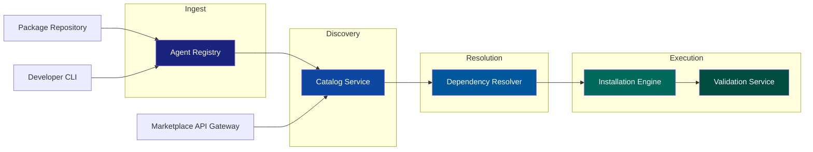
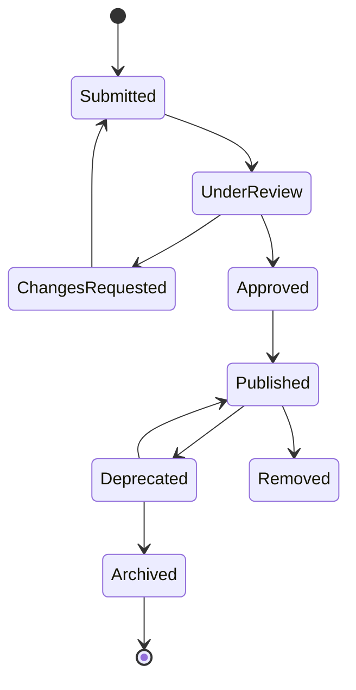
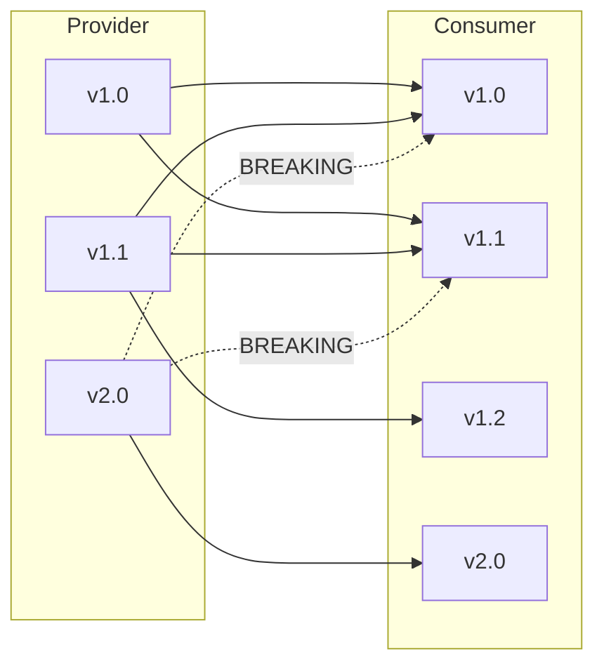
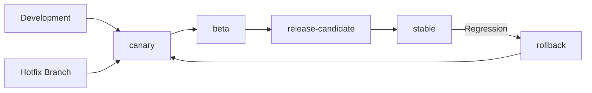
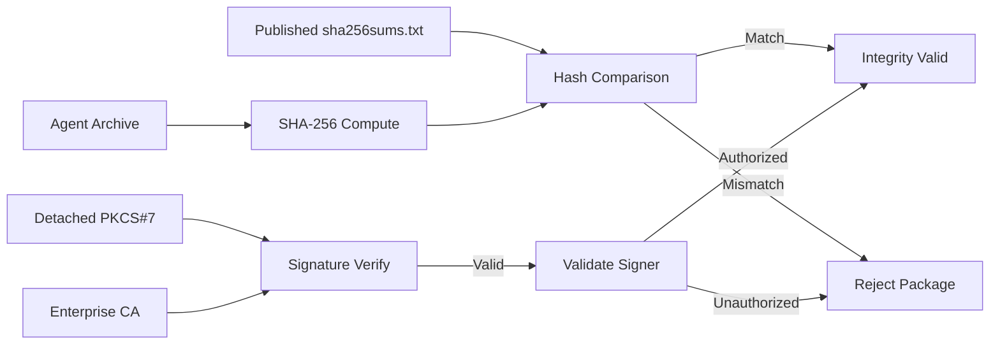
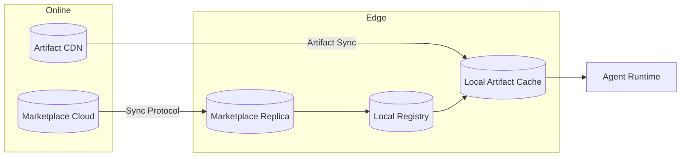
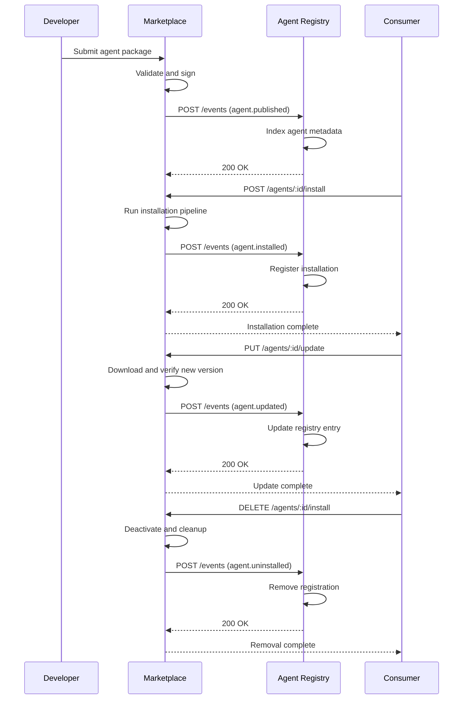

> ⚠️ **DESIGN SPEC — NOT IMPLEMENTED**
> This document describes an aspirational design for a future AI system. The features, architecture, agents, and workflows documented here do **not** currently exist in the codebase. See [`docs/ai/README.md`](./README.md) for the current AI implementation status.

# Agent Marketplace

**Version:** 1.0  
**Status:** Active  
**Author:** Chief AI Architect, Enterprise Architecture  
**Last Updated:** 2026-06-18

---

## Table of Contents

1. Executive Summary
2. Purpose and Scope
3. Design Principles
4. Marketplace Architecture
5. Pipeline Overview
6. Registry Layer
7. Catalog Layer
8. Resolver Layer
9. Installer Layer
10. Validator Layer
11. Agent Packaging Standard
12. Package Structure
13. Manifest Schema
14. Entrypoint Configuration
15. Capability Declaration
16. Version Format
17. Package Checksums
18. Catalog System
19. Agent Listing Schema
20. Categories Taxonomy
21. Search and Filter
22. Listing Approval Workflow
23. Review Process
24. Publication Gate
25. Deprecation Policy
26. Version Management
27. Semantic Versioning Rules
28. Compatibility Matrix
29. Update Channels
30. Channel Promotion Workflow
31. Version Constraint Operators
32. Dependency Resolution
33. Dependency Model
34. Conflict Resolution Strategy
35. Resolution Algorithm
36. Conflict Reporting
37. Installation Pipeline
38. Pre-install Stage
39. Deployment Stage
40. Post-install Validation
41. Rollback Procedure
42. Security Model
43. Code Signing
44. Integrity Verification
45. Permission Auditing
46. Sandboxing Levels
47. Supply Chain Security
48. Provenance Tracking
49. SLSA Compliance Levels
50. Marketplace API
51. Authentication
52. Agent Listing Endpoints
53. Search Endpoints
54. Installation Endpoints
55. Update Endpoints
56. Removal Endpoints
57. Submission Endpoints
58. Offline and Disconnected Operation
59. Offline Architecture
60. Sync-on-Reconnect Strategy
61. Delta Sync Protocol
62. Offline Capability Matrix
63. Air-Gapped Deployment
64. Integration with Agent Registry
65. Registry Feed Protocol
66. Lifecycle Events
67. Registry Sync Flow
68. Event Payload Schema
69. Registry API Contract
70. Related Documents
71. Appendix A: Glossary
72. Appendix B: Configuration Reference
73. Appendix C: Error Codes
74. Appendix D: Revision History

---

## 1. Executive Summary

The Agent Marketplace is the central distribution platform for the enterprise agent ecosystem. It serves as the authoritative source for discovering, evaluating, installing, and managing AI agents across the organization. The marketplace provides a secure, governed, and scalable mechanism for agent lifecycle management.

The marketplace is designed to operate in both connected and air-gapped environments, supporting everything from cloud-based deployments to edge sites with intermittent connectivity. Every agent package is cryptographically signed, integrity-verified, and sandbox-isolated before execution.

---

## 2. Purpose and Scope

The marketplace addresses the following enterprise requirements:

- **Discoverability**: Enable agent discovery through rich metadata, full-text search, and categorical browsing
- **Governance**: Enforce approval workflows with staged review gates before public publication
- **Security**: Mandate code signing, hash verification, and permission auditing for all packages
- **Reliability**: Provide deterministic dependency resolution with conflict detection
- **Resilience**: Support offline operation with delta-based synchronization on reconnect
- **Auditability**: Maintain a complete event log of all marketplace activities

---

## 3. Design Principles

| Principle | Description |
|---|---|
| Security-first | Every package is signed, verified, and sandboxed before execution |
| Immutable releases | Published versions cannot be modified or deleted; only deprecated |
| Decentralization-ready | Core functions operate offline with sync-on-reconnect |
| Layered governance | Approval workflows at submission, review, and publish stages |
| Backward compatibility | Version constraints and dependency pinning protect consumers |
| Defense in depth | Multiple verification layers from transport to runtime |
| Least privilege | Agents operate with minimum required permissions by default |

---

## 4. Marketplace Architecture

The marketplace operates as a five-stage pipeline: Registry, Catalog, Resolver, Installer, and Validator. Each stage is independently scalable and can be deployed in a distributed fashion across on-premise and cloud environments.



---

## 5. Pipeline Overview

The five-stage pipeline provides end-to-end lifecycle management for agent packages.

| Stage | Component | Responsibility |
|---|---|---|
| Registry | Agent Registry Service | Ingests packages, validates manifests, stores artifacts |
| Catalog | Catalog Service | Indexes listings, manages categories, handles search |
| Resolver | Dependency Resolver | Computes dependency graphs, resolves conflicts |
| Installer | Installation Engine | Downloads artifacts, verifies integrity, configures runtime |
| Validator | Validation Service | Checks signatures, runs pre-flight tests, audits permissions |

---

## 6. Registry Layer

The Registry Layer is the entry point for all agent packages entering the marketplace.

**Responsibilities:**

- Accept package submissions via API and CLI
- Validate manifest structure against JSON Schema
- Store artifact blobs in the artifact store
- Compute and record SHA-256 hashes
- Initiate the signature verification workflow
- Feed approved packages into the Catalog Layer

---

## 7. Catalog Layer

The Catalog Layer indexes all published agent packages and provides discovery capabilities.

**Responsibilities:**

- Maintain a searchable index of all published agents
- Manage category and tag taxonomies
- Provide faceted search with filtering and sorting
- Track download counts and ratings
- Manage listing lifecycle states (submitted through archived)
- Handle approval workflow state transitions

---

## 8. Resolver Layer

The Resolver Layer computes dependency graphs for requested agent installations.

**Responsibilities:**

- Parse agent dependency declarations from manifests
- Build directed dependency graphs
- Select compatible versions using constraint solving
- Detect and report dependency conflicts
- Provide detailed conflict diagnostics
- Cache resolution results for performance

---

## 9. Installer Layer

The Installer Layer handles the physical deployment of agent packages to target runtimes.

**Responsibilities:**

- Download agent packages from the artifact store
- Verify package integrity using published hashes
- Validate system requirements (OS, architecture, memory, disk)
- Configure agent runtime environments
- Create sandboxed execution contexts
- Coordinate with the Validator Layer for pre-flight checks

---

## 10. Validator Layer

The Validator Layer performs security and integrity checks before agent activation.

**Responsibilities:**

- Verify digital signatures against the enterprise PKI
- Audit declared permissions against actual code behavior
- Run pre-install integration tests
- Confirm sandbox isolation boundaries
- Generate validation reports for audit trails

---

## 11. Agent Packaging Standard

Every agent distributed through the marketplace MUST conform to the Agent Packaging Standard (APS). Packages are distributed as signed, compressed archives using the `.agent` file format, which is a signed tar.gz archive.

### Key Requirements

- Packages must be signed before submission
- All files must have corresponding SHA-256 entries in `sha256sums.txt`
- The manifest must validate against the published JSON Schema
- Source code must be included (not pre-compiled binaries)
- Tests must pass as part of the submission validation

---

## 12. Package Structure

```
agent-package/
  manifest.json              # Required: Agent metadata and dependencies
  agent/
    main.py                  # Entry point (or main.js, main.ts, etc.)
    modules/                 # Agent source code modules
    utils/                   # Utility libraries
  dependencies/
    vendor/                  # Bundled third-party dependencies
  tests/
    test_main.py             # Unit tests
    integration/             # Integration tests
    fixtures/                # Test fixtures and mocks
  assets/
    icon.png                 # Agent icon (256x256, required)
    screenshot-1.png         # Screenshots (optional, up to 5)
  docs/
    README.md                # Agent documentation
    CHANGELOG.md             # Version changelog
    API.md                   # API documentation (if applicable)
  signatures/
    sha256sums.txt           # SHA-256 hashes of all files
    signature.p7s            # PKCS#7 detached signature
    provenance.json          # SLSA provenance statement
```

---

## 13. Manifest Schema

The `manifest.json` is the authoritative metadata document for every agent package.

```json
{
  "$schema": "https://marketplace.enterprise/schemas/manifest-v1.json",
  "package": {
    "name": "com.enterprise.security-threat-analyzer",
    "version": "2.1.0",
    "displayName": "Threat Analyzer",
    "description": "Real-time security threat analysis and response agent",
    "homepage": "https://security.enterprise/agents/threat-analyzer",
    "license": "Enterprise Internal Use Only",
    "icon": "assets/icon.png"
  },
  "author": {
    "name": "Security Engineering Team",
    "email": "security-eng@enterprise.com",
    "organization": "Enterprise Security Division"
  },
  "entrypoint": {
    "type": "python",
    "module": "agent.main",
    "function": "run",
    "runtime": "python-3.11",
    "args": {}
  },
  "capabilities": {
    "required": ["network-monitor", "file-system:read", "process-list"],
    "optional": ["kernel-event-stream"],
    "provides": ["threat-detection", "incident-response"]
  },
  "dependencies": {
    "agents": {
      "com.enterprise.log-collector": "^3.0.0",
      "com.enterprise.event-bus": "~2.5.0"
    },
    "runtimes": {
      "python": ">=3.11, <3.13",
      "node": ">=18.0.0"
    },
    "system": {
      "os": ["linux", "windows"],
      "arch": ["x86_64", "arm64"],
      "minMemoryMB": 512,
      "minDiskMB": 100
    }
  },
  "permissions": {
    "network": ["outbound:logs.internal.enterprise.com"],
    "filesystem": ["read:/var/log", "write:/var/agent-data"],
    "process": ["spawn:security-scan"],
    "security": ["signing:false"]
  },
  "signing": {
    "algorithm": "SHA-256-RSA-PSS",
    "certificateFingerprint": "A1:B2:C3:D4:E5:F6:...",
    "timestamp": "2026-06-18T10:00:00Z"
  }
}
```

---

## 14. Entrypoint Configuration

The `entrypoint` section defines how the agent is started at runtime.

| Field | Type | Description |
|---|---|---|
| `type` | string | Runtime language: `python`, `node`, `go`, `java`, `rust` |
| `module` | string | Module or package path containing the entry function |
| `function` | string | Function or method name to invoke |
| `runtime` | string | Specific runtime version identifier |
| `args` | object | Default arguments passed to the entry function |
| `healthCheck` | string | Endpoint or command for runtime health verification |

---

## 15. Capability Declaration

Every agent declares what capabilities it requires and what capabilities it provides.

| Field | Description | Example |
|---|---|---|
| `required` | Capabilities the agent must have access to | `["network-monitor", "file-system:read"]` |
| `optional` | Capabilities used if available, not blocking | `["kernel-event-stream"]` |
| `provides` | Capabilities the agent exposes to other agents | `["threat-detection", "incident-response"]` |

Capabilities are strings in the format `{domain}:{action}`. Agents with matching `provides` and `required` capabilities can be automatically wired together.

---

## 16. Version Format

Versions follow strict Semantic Versioning 2.0.0.

```
MAJOR.MINOR.PATCH[-PRERELEASE][+BUILD]
```

| Component | Rule | Example |
|---|---|---|
| MAJOR | Incompatible API changes | `3.0.0` |
| MINOR | Backward-compatible functionality | `2.1.0` |
| PATCH | Backward-compatible bug fixes | `2.1.4` |
| PRERELEASE | Pre-release marker | `2.0.0-beta.1` |
| BUILD | Build metadata (ignored in comparisons) | `2.0.0+build.20260618` |

Pre-release versions have lower precedence than the normal version. Build metadata is ignored when comparing versions.

---

## 17. Package Checksums

The `signatures/sha256sums.txt` file contains one entry per file in the package.

```
sha256  a1b2c3d4e5f6a7b8c9d0e1f2a3b4c5d6e7f8a9b0c1d2e3f4a5b6c7d8e9f0a1  agent/main.py
sha256  b2c3d4e5f6a7b8c9d0e1f2a3b4c5d6e7f8a9b0c1d2e3f4a5b6c7d8e9f0a1b2  agent/utils.py
sha256  c3d4e5f6a7b8c9d0e1f2a3b4c5d6e7f8a9b0c1d2e3f4a5b6c7d8e9f0a1b2c3  manifest.json
sha256  d4e5f6a7b8c9d0e1f2a3b4c5d6e7f8a9b0c1d2e3f4a5b6c7d8e9f0a1b2c3d4  assets/icon.png
```

The checksum file itself is NOT hashed but IS covered by the detached PKCS#7 signature.

---

## 18. Catalog System

The Catalog Service indexes all published agent packages and provides search, filter, and discovery capabilities through a RESTful API. It maintains the authoritative listing of every agent version available for installation.

---

## 19. Agent Listing Schema

```json
{
  "listing": {
    "id": "agent-9f8e7d6c-5b4a-3210-fedc-ba9876543210",
    "name": "com.enterprise.security-threat-analyzer",
    "displayName": "Threat Analyzer",
    "version": "2.1.0",
    "summary": "Real-time security threat analysis and response",
    "description": "Full markdown description...",
    "categories": ["security", "monitoring", "incident-response"],
    "tags": ["threat-detection", "siem", "real-time"],
    "status": "published",
    "rating": 4.5,
    "downloadCount": 12842,
    "latestVersion": "2.1.0",
    "availableVersions": ["1.0.0", "1.1.0", "2.0.0", "2.1.0"],
    "compatibleRuntimes": ["python-3.11", "python-3.12"],
    "iconUrl": "https://marketplace.enterprise/assets/icons/threat-analyzer.png",
    "publisher": {
      "id": "org-security-division",
      "name": "Security Engineering Team",
      "verified": true
    },
    "publishedAt": "2026-06-18T10:00:00Z",
    "updatedAt": "2026-06-18T10:00:00Z"
  }
}
```

---

## 20. Categories Taxonomy

| Category ID | Display Name | Description |
|---|---|---|
| `security` | Security and Compliance | Threat detection, policy enforcement, audit |
| `monitoring` | Monitoring and Observability | Metrics, logging, tracing |
| `automation` | Automation and Orchestration | Workflow automation, scheduling |
| `data-pipeline` | Data and Pipelines | ETL, data transformation, streaming |
| `networking` | Network and Infrastructure | DNS, load balancing, connectivity |
| `devops` | DevOps and CI/CD | Build, deploy, infrastructure management |
| `analytics` | Analytics and Intelligence | Reporting, anomaly detection, forecasting |
| `communication` | Communication and Collaboration | Messaging, notifications, alerts |
| `storage` | Storage and Data Management | Backup, archive, data lifecycle |
| `identity` | Identity and Access Management | Authentication, authorization, SSO |
| `compliance` | Regulatory Compliance | Audit trails, policy enforcement, reporting |
| `ai-ml` | AI and Machine Learning | Model inference, training, data preparation |

---

## 21. Search and Filter

The Catalog API supports comprehensive search and faceted filtering.

| Parameter | Type | Description |
|---|---|---|
| `q` | string | Full-text search across name, displayName, summary, tags |
| `category` | string | Filter by category ID |
| `tags` | string (CSV) | Filter by one or more tags (AND logic) |
| `runtime` | string | Filter by compatible runtime |
| `publisher` | string | Filter by publisher organization ID |
| `minRating` | float | Minimum rating threshold |
| `status` | string | Listing status filter |
| `sort` | enum | Sort field: relevance, downloads, rating, updated, name |
| `order` | enum | Sort direction: asc, desc |
| `page` | integer | Page number (1-based) |
| `perPage` | integer | Results per page (max 100) |

---

## 22. Listing Approval Workflow



---

## 23. Review Process

The review process is triggered when a listing enters the `UnderReview` state.

| Review Gate | Owner | Description |
|---|---|---|
| Automated Security Scan | Security Tooling | Static analysis, vulnerability scanning, secret detection |
| Manifest Validation | Marketplace Service | Schema validation, required fields, format checks |
| Capability Audit | Security Team | Verify declared permissions match actual code usage |
| Code Review | Engineering Lead | Manual review of agent source code |
| Test Suite Execution | CI/CD Pipeline | Run unit and integration tests |
| Dependency Scan | Security Tooling | Audit third-party dependencies for vulnerabilities |
| License Compliance | Legal Team | Verify all bundled dependencies have approved licenses |

---

## 24. Publication Gate

The publication gate is the final review stage before an agent becomes publicly available.

**Pre-publication checks:**

1. All review gates have passed
2. The agent has been assigned an approved sandbox level
3. The agent has a verified SLSA provenance statement
4. The package signature has been validated against the enterprise PKI
5. The publisher has signing authority for the claimed organization

**Publication actions:**

1. Assign a unique catalog ID
2. Index the listing in the search catalog
3. Replicate the artifact to the CDN or edge caches
4. Emit the `agent.published` event to the Agent Registry
5. Notify subscribers of new agent availability

---

## 25. Deprecation Policy

Agents are deprecated rather than deleted from the catalog to preserve dependency resolution integrity.

| Action | Allowed | Description |
|---|---|---|
| Deprecate | Yes | Mark as end-of-life, existing installs continue |
| Reactivate | Yes | Reverse deprecation if issues are resolved |
| Remove | Yes (restricted) | Only for policy violations, with compliance record |
| Delete | No | Versions are immutable once published |

---

## 26. Version Management

Version management governs how agent versions are released, tracked, and consumed by the marketplace.

---

## 27. Semantic Versioning Rules

| Version Change | Backward Compatible | Consumer Action | Example |
|---|---|---|---|
| MAJOR bump | No | Manual upgrade required | `1.x.x` to `2.0.0` |
| MINOR bump | Yes | Automatic upgrade safe | `1.1.x` to `1.2.0` |
| PATCH bump | Yes | Automatic upgrade safe | `1.1.0` to `1.1.1` |
| Pre-release | No (opt-in) | Explicit channel selection | `1.1.0` to `2.0.0-beta.1` |

---

## 28. Compatibility Matrix



---

## 29. Update Channels

| Channel | Purpose | Cadence | Stability |
|---|---|---|---|
| `stable` | Production releases | Monthly | Maximum stability, fully tested |
| `beta` | Release candidates | Weekly | Feature-complete, integration tests passing |
| `canary` | Development builds | Daily or per-commit | May contain incomplete features |
| `security-patches` | Critical fixes | As needed | Emergency fixes, minimal change scope |

---

## 30. Channel Promotion Workflow



---

## 31. Version Constraint Operators

| Operator | Meaning | Example | Matches |
|---|---|---|---|
| Exact | Must match exactly | `1.2.3` | `1.2.3` only |
| `^` | Compatible with MAJOR | `^1.2.0` | `>=1.2.0, <2.0.0` |
| `~` | Approximately equivalent | `~1.2.0` | `>=1.2.0, <1.3.0` |
| `>=` | Greater or equal | `>=1.2.0` | `1.2.0` and above |
| `<=` | Less or equal | `<=1.2.0` | `1.2.0` and below |
| `>` | Greater than | `>1.2.0` | `1.2.1` and above |
| `<` | Less than | `<1.2.0` | `1.1.x` and below |
| `\|\|` | OR | `^1.0.0 \|\| ^2.0.0` | `1.x.x` or `2.x.x` |
| Space | AND | `>=1.0.0 <2.0.0` | `1.x.x` only |

---

## 32. Dependency Resolution

Dependency resolution ensures that installing an agent also installs all required dependencies with compatible versions.

---

## 33. Dependency Model

Each agent declares dependencies in three categories:

| Category | Source | Resolution |
|---|---|---|
| `agents` | Other marketplace agents | Recursively resolved through graph |
| `runtimes` | Runtime environments | Matched against available platform runtimes |
| `system` | OS-level requirements | Checked at install time against target system |

Dependencies are declared with version constraints, not pinned versions, to allow maximum compatibility.

---

## 34. Conflict Resolution Strategy

The resolver uses a **maximum-version-first, depth-first** strategy with backtracking:

1. Build a directed graph of all required agents with their version constraints
2. For each node, select the highest matching version from the catalog
3. Propagate constraints upward when a child selection changes the parent's dependency constraints
4. If a conflict is detected, backtrack and try the next-highest version
5. If no valid combination exists, report the conflict with a detailed diagnostic

**Conflict resolution priorities:**

1. Resolve within the same MAJOR version series first
2. Only cross MAJOR boundaries if explicitly allowed by the consumer
3. Prefer versions from the same publisher for internal consistency
4. Minimize the number of distinct versions of the same agent

---

## 35. Resolution Algorithm

The following pseudocode describes the graph-based resolution algorithm:

```python
"""
Agent Dependency Resolver
"""

from dataclasses import dataclass, field
from typing import Dict, List, Optional, Set
from enum import Enum


class ConflictStrategy(Enum):
    MAX_VERSION = "max-version"
    MIN_VERSION = "min-version"
    EXPLICIT = "explicit"


@dataclass
class DependencyNode:
    name: str
    version: str
    constraint: str
    dependencies: Dict[str, str] = field(default_factory=dict)
    dependents: List[str] = field(default_factory=list)
    visited: bool = False


@dataclass
class ResolutionResult:
    success: bool = False
    resolution: Dict[str, str] = field(default_factory=dict)
    graph: Dict[str, DependencyNode] = field(default_factory=dict)
    conflicts: List[str] = field(default_factory=list)
    errors: List[str] = field(default_factory=list)


class AgentResolver:

    def __init__(self, catalog):
        self._catalog = catalog
        self._graph: Dict[str, DependencyNode] = {}
        self._resolved: Dict[str, str] = {}
        self._visiting: Set[str] = set()

    def resolve(
        self,
        root_name: str,
        root_constraint: str,
        strategy: ConflictStrategy = ConflictStrategy.MAX_VERSION,
    ) -> ResolutionResult:
        self._graph = {}
        self._resolved = {}
        self._visiting = set()

        try:
            self._resolve_node(root_name, root_constraint, strategy)
            return ResolutionResult(
                success=True,
                resolution=dict(self._resolved),
                graph=dict(self._graph),
            )
        except ResolutionConflict as exc:
            return ResolutionResult(
                success=False,
                resolution=dict(self._resolved),
                graph=dict(self._graph),
                conflicts=[str(exc)],
            )
        except ResolutionError as exc:
            return ResolutionResult(
                success=False,
                errors=[str(exc)],
            )

    def _resolve_node(
        self,
        name: str,
        constraint: str,
        strategy: ConflictStrategy,
        depth: int = 0,
    ):
        if depth > 100:
            raise ResolutionError(
                f"Maximum dependency depth exceeded for {name}"
            )

        if name in self._visiting:
            cycle = " -> ".join(list(self._visiting) + [name])
            raise ResolutionConflict(f"Circular dependency detected: {cycle}")

        if name in self._resolved:
            existing = self._resolved[name]
            if self._satisfies(existing, constraint):
                return
            raise ResolutionConflict(
                f"{name}: already resolved to {existing}, "
                f"conflicts with constraint {constraint}"
            )

        candidates = self._catalog.get_versions(name, constraint)
        if not candidates:
            raise ResolutionError(
                f"No versions found for {name} "
                f"satisfying constraint {constraint}"
            )

        self._visiting.add(name)
        node = DependencyNode(
            name=name,
            version="",
            constraint=constraint,
        )

        if strategy == ConflictStrategy.MAX_VERSION:
            candidates = sorted(
                candidates, key=lambda v: self._parse_version(v), reverse=True
            )
        elif strategy == ConflictStrategy.MIN_VERSION:
            candidates = sorted(
                candidates, key=lambda v: self._parse_version(v)
            )

        for version in candidates:
            manifest = self._catalog.get_manifest(name, version)
            deps = manifest.get("dependencies", {}).get("agents", {})

            if not deps:
                node.version = version
                self._resolved[name] = version
                self._graph[name] = node
                self._visiting.discard(name)
                return

            conflict_found = False
            for dep_name, dep_constraint in deps.items():
                try:
                    self._resolve_node(
                        dep_name, dep_constraint, strategy, depth + 1
                    )
                    self._resolved[dep_name] = self._resolved[dep_name]
                except (ResolutionConflict, ResolutionError):
                    conflict_found = True
                    break

            if not conflict_found:
                node.version = version
                node.dependencies = deps
                self._resolved[name] = version
                self._graph[name] = node
                self._visiting.discard(name)
                return

        self._visiting.discard(name)
        raise ResolutionConflict(
            f"{name}: no version satisfying {constraint} "
            f"is compatible with all transitive dependencies"
        )

    def _parse_version(self, version: str) -> tuple:
        parts = version.split(".")
        major = int(parts[0]) if len(parts) > 0 else 0
        minor = int(parts[1]) if len(parts) > 1 else 0
        patch_str = parts[2] if len(parts) > 2 else "0"
        patch = int(patch_str.split("-")[0]) if patch_str else 0
        return (major, minor, patch)

    def _satisfies(self, version: str, constraint: str) -> bool:
        from packaging.specifiers import SpecifierSet
        from packaging.version import Version

        try:
            return Version(version) in SpecifierSet(constraint)
        except Exception:
            return False


class ResolutionError(Exception):
    pass


class ResolutionConflict(Exception):
    pass
```

---

## 36. Conflict Reporting

When a conflict is detected, the resolver generates a structured diagnostic report:

```
Resolved 18 of 22 dependencies.
Conflict detected: com.enterprise.log-collector

  Required by:
    com.enterprise.app@^3.0.0 -> com.enterprise.event-bus@^2.0.0 -> log-collector@^1.5.0
    com.enterprise.analytics@^1.0.0 -> log-collector@^2.0.0

  Incompatible constraints:
    ^1.5.0 (via event-bus) vs ^2.0.0 (via analytics)

  Possible resolutions:
    - Upgrade event-bus to ^3.0.0 (requires app@^4.0.0)
    - Downgrade analytics to ^0.9.0 (requires log-collector@^1.5.0)
    - Override constraint: marketplace override --agent log-collector --version 2.0.0
```

---

## 37. Installation Pipeline

The installation pipeline is a multi-stage process that transforms a published agent package into a running, verified agent instance.


---

## 38. Pre-install Stage

The pre-install stage covers download, verification, manifest validation, and dependency resolution.

| Step | Action | Verification |
|---|---|---|
| 1 | Download | Fetch `.agent` archive from artifact store over TLS 1.3 |
| 2 | Verify Integrity | Compute SHA-256 hash, compare against published checksum |
| 3 | Verify Signature | Validate PKCS#7 detached signature against Enterprise CA |
| 4 | Validate Manifest | Parse manifest.json, validate against JSON Schema |
| 5 | Resolve Dependencies | Run dependency resolver from Section 35 |
| 6 | Check Requirements | Verify OS, architecture, memory, disk meet requirements |

---

## 39. Deployment Stage

The deployment stage configures the runtime environment and activates the agent.

| Step | Action | Verification |
|---|---|---|
| 7 | Extract Package | Extract .agent archive into staging directory |
| 8 | Create Sandbox | Initialize container or microVM with security profile |
| 9 | Copy Artifacts | Move agent files into sandbox filesystem |
| 10 | Apply Configuration | Write agent configuration from manifest defaults |
| 11 | Register Capabilities | Register agent capabilities with the capability broker |
| 12 | Activate | Invoke agent entrypoint function |

---

## 40. Post-install Validation

After activation, the validator confirms the agent is operating correctly.

```json
{
  "verificationSteps": [
    {
      "step": "integrity-check",
      "status": "passed",
      "hash": "sha256:a1b2c3d4e5f6a7b8c9d0e1f2a3b4c5d6e7f8a9b0c1d2e3f4a5b6c7d8e9f0a1",
      "signedBy": "/CN=Enterprise Marketplace Signing Authority"
    },
    {
      "step": "manifest-validation",
      "status": "passed",
      "schemaVersion": "https://marketplace.enterprise/schemas/manifest-v1.json",
      "errors": []
    },
    {
      "step": "dependency-resolution",
      "status": "passed",
      "totalDependencies": 5,
      "transitiveDependencies": 3,
      "conflicts": []
    },
    {
      "step": "system-check",
      "status": "passed",
      "os": "linux",
      "arch": "x86_64",
      "memoryMB": 2048,
      "diskMB": 500
    },
    {
      "step": "sandbox-creation",
      "status": "passed",
      "sandboxId": "sb-9f8e7d6c-5b4a-3210-fedc-ba9876543210",
      "securityProfile": "restricted"
    },
    {
      "step": "health-check",
      "status": "passed",
      "endpoint": "agent://localhost:9400/health",
      "responseTimeMs": 42
    }
  ]
}
```

---

## 41. Rollback Procedure

If any verification step in the pipeline fails:

1. **Halt** the pipeline immediately
2. **Log** the failure with full diagnostic context
3. **Clean up** any partially downloaded or extracted artifacts
4. **Delete** the sandbox if it was created
5. **Notify** the operator with the specific failure reason and step
6. **Do not activate** the agent under any circumstances
7. **Record** the failure in the agent state as `install-failed`

---

## 42. Security Model

The marketplace implements a defense-in-depth security model spanning code signing, integrity verification, permission auditing, sandboxing, and supply chain security.

---

## 43. Code Signing

All agent packages MUST be signed before submission to the marketplace.

| Requirement | Specification |
|---|---|
| Signing Algorithm | SHA-256 with RSA-PSS (4096-bit key) |
| Certificate Authority | Enterprise Internal CA or approved public CA |
| Certificate Validation | Full chain verification with CRL checking |
| Timestamping | RFC 3161 trusted timestamp from internal TSA |
| Re-signing Policy | Each package version has exactly one immutable signature |

---

## 44. Integrity Verification



---

## 45. Permission Auditing

Every agent declares its required permissions in the manifest. The marketplace audits these against the agent's capabilities and the publisher's authority.

| Permission Scope | Examples | Default Policy |
|---|---|---|
| `network` | `outbound:host:port`, `inbound:port` | Deny all, allow on explicit request |
| `filesystem` | `read:/path`, `write:/path`, `execute:/path` | Read-only within sandbox directory |
| `process` | `spawn:executable`, `signal:PID` | Deny all |
| `security` | `signing:boolean`, `key-access` | Deny all |
| `system` | `clock:read`, `env:read`, `env:write` | Read-only env, read-only clock |
| `capabilities` | `use:other-agent-capability` | Require explicit grant from capability broker |

---

## 46. Sandboxing Levels

| Level | Name | Description | Isolation Mechanism |
|---|---|---|---|
| 0 | None | Full system access (deprecated, legacy only) | None |
| 1 | Restricted | File system sandbox directory only | OS user namespace |
| 2 | Containerized | Full container boundary, no host access | Docker or Podman container |
| 3 | MicroVM | Hardware-level isolation | Firecracker or Kata microVM |
| 4 | Network-Isolated | Containerized with no network access | Container plus network namespace |

---

## 47. Supply Chain Security

The marketplace enforces supply chain security through provenance tracking, dependency verification, and SLSA compliance.

---

## 48. Provenance Tracking

Every agent package includes a signed provenance statement following the SLSA specification:

```json
{
  "provenance": {
    "slsaVersion": "slsa/v1",
    "slsaLevel": 3,
    "builder": {
      "id": "https://ci.enterprise.com/builders/marketplace-builder",
      "version": "1.2.0"
    },
    "buildConfig": {
      "steps": [
        {
          "command": "marketplace-cli build --sign --push",
          "env": {
            "CI_COMMIT_SHA": "abc123def456",
            "CI_JOB_ID": "12345678"
          }
        }
      ]
    },
    "materials": [
      {
        "uri": "git+https://git.enterprise.com/security/threat-analyzer",
        "digest": {"sha1": "abc123def4567890abcdef1234567890abcdef12"}
      }
    ],
    "verificationSummary": {
      "codeReview": true,
      "automatedTests": true,
      "securityScan": true,
      "vulnerabilityScan": "critical:0, high:0, medium:2, low:5",
      "licenseScan": "approved"
    }
  }
}
```

---

## 49. SLSA Compliance Levels

| SLSA Level | Requirements | Marketplace Enforcement |
|---|---|---|
| SLSA 1 | Provenance exists | All agents must have a provenance statement |
| SLSA 2 | Signed provenance, hosted build | CI/CD builds only, no manual uploads permitted |
| SLSA 3 | Hardened build, no user-controlled steps | Hermetic builds with dependency isolation |
| SLSA 4 | Two-person review, reproducible builds | Mandatory code review, reproducibility verification |

---

## 50. Marketplace API

The Marketplace API is a RESTful interface for all marketplace operations. Base URL: `https://marketplace.enterprise/api/v1`

---

## 51. Authentication

All API requests require a valid JWT token in the `Authorization: Bearer <token>` header.

| Field | Specification |
|---|---|
| Token Type | JWT (RFC 7519) |
| Issuer | Enterprise Identity Service |
| Flow | OAuth 2.0 Client Credentials (machine-to-machine) |
| Expiry | 1 hour (tokens must be refreshed) |
| Scope | `marketplace:read`, `marketplace:install`, `marketplace:admin` |

---

## 52. Agent Listing Endpoints

```
GET /agents                      List all agents
GET /agents/search               Search agents
GET /agents/:id                  Get agent details
GET /agents/:id/versions         List all versions of an agent
```

| Parameter | Type | Default | Description |
|---|---|---|---|
| `q` | string | - | Search query |
| `category` | string | - | Filter by category |
| `tags` | string (CSV) | - | Comma-separated tag filter |
| `status` | string | `published` | Listing status |
| `runtime` | string | - | Compatible runtime |
| `publisher` | string | - | Publisher ID |
| `minRating` | float | - | Minimum rating |
| `sort` | enum | `relevance` | Sort field |
| `order` | enum | `desc` | Sort direction |
| `page` | integer | `1` | Page number |
| `perPage` | integer | `20` | Results per page |

---

## 53. Search Endpoints

```
GET /agents/search               Full-text search
```

| Parameter | Type | Default | Description |
|---|---|---|---|
| `q` | string | required | Full-text search query |
| `limit` | integer | `10` | Maximum number of results |
| `fuzzy` | boolean | `true` | Enable fuzzy matching |
| `fields` | string (CSV) | `name,displayName,summary,tags,description` | Fields to search |

**Response:**
```json
{
  "data": [
    {
      "id": "agent-...",
      "name": "com.enterprise.security-threat-analyzer",
      "displayName": "Threat Analyzer",
      "version": "2.1.0",
      "summary": "Real-time security threat analysis",
      "score": 0.95,
      "highlights": {
        "displayName": ["Threat Analyzer"],
        "summary": ["Real-time security <em>threat</em> analysis"],
        "tags": ["<em>threat</em>-detection"]
      }
    }
  ]
}
```

---

## 54. Installation Endpoints

```
POST   /agents/:id/install       Install an agent
GET    /installs/:id             Get installation status
GET    /installs                 List all installed agents
```

**Install request:**
| Parameter | Type | Default | Description |
|---|---|---|---|
| `version` | string | `latest` | Version or constraint |
| `channel` | string | `stable` | Update channel |
| `targetRuntime` | string | auto | Target runtime |
| `sandboxLevel` | integer | `2` | Sandbox level |
| `configuration` | object | `{}` | Agent configuration |

**Install response:**
```json
{
  "data": {
    "installationId": "install-abc123",
    "agentId": "agent-9f8e7d6c...",
    "name": "com.enterprise.security-threat-analyzer",
    "version": "2.1.0",
    "status": "installing",
    "pipelineSteps": [
      {"step": "download", "status": "pending"},
      {"step": "verify", "status": "pending"},
      {"step": "validate", "status": "pending"},
      {"step": "resolve-dependencies", "status": "pending"},
      {"step": "configure", "status": "pending"},
      {"step": "activate", "status": "pending"}
    ],
    "createdAt": "2026-06-18T10:00:00Z"
  }
}
```

---

## 55. Update Endpoints

```
PUT    /agents/:id/update        Update an agent to a new version
```

| Parameter | Type | Default | Description |
|---|---|---|---|
| `targetVersion` | string | `latest` | Target version |
| `channel` | string | `stable` | Update channel |
| `allowMajorUpgrade` | boolean | `false` | Allow breaking changes |

**Response:**
```json
{
  "data": {
    "installationId": "install-def456",
    "agentId": "agent-9f8e7d6c...",
    "previousVersion": "2.0.0",
    "targetVersion": "2.1.0",
    "status": "updating",
    "changelog": "## 2.1.0\n- Added real-time streaming\n- Fixed memory leak in log parser",
    "breakingChanges": []
  }
}
```

---

## 56. Removal Endpoints

```
DELETE /agents/:id/install        Remove an installed agent
```

| Parameter | Type | Default | Description |
|---|---|---|---|
| `force` | boolean | `false` | Force removal even if agent is active |
| `preserveData` | boolean | `true` | Keep agent data directory |

**Response:**
```json
{
  "data": {
    "installationId": "install-abc123",
    "agentId": "agent-9f8e7d6c...",
    "status": "removing",
    "removalSteps": [
      {"step": "deactivate", "status": "completed"},
      {"step": "backup-data", "status": "completed"},
      {"step": "remove-artifacts", "status": "in-progress"},
      {"step": "unregister", "status": "pending"}
    ]
  }
}
```

---

## 57. Submission Endpoints

```
POST   /agents                    Submit a new agent package
```

| Parameter | Type | Description |
|---|---|---|
| `package` | binary | `.agent` package file (multipart/form-data) |
| `signature` | binary | PKCS#7 detached signature |
| `provenance` | binary | SLSA provenance document |

**Response:**
```json
{
  "data": {
    "submissionId": "subm-789xyz",
    "agentId": "agent-9f8e7d6c...",
    "name": "com.enterprise.security-threat-analyzer",
    "version": "2.1.0",
    "status": "submitted",
    "reviewUrl": "https://marketplace.enterprise/reviews/subm-789xyz",
    "createdAt": "2026-06-18T10:00:00Z"
  }
}
```

---

## 58. Offline and Disconnected Operation

The marketplace is designed to operate in environments with limited or no network connectivity, including air-gapped networks, classified environments, and remote industrial sites.

---

## 59. Offline Architecture



---

## 60. Sync-on-Reconnect Strategy

| Phase | Action | Description |
|---|---|---|
| 1 | Snapshot | Record current local catalog state and version markers |
| 2 | Connect | Establish secure connection to cloud marketplace |
| 3 | Diff | Request catalog diff since last sync point |
| 4 | Download | Download new and updated agent packages |
| 5 | Verify | Verify all downloaded artifacts (signatures and hashes) |
| 6 | Merge | Merge catalog updates into local replica |
| 7 | Re-index | Rebuild local search indexes |
| 8 | Notify | Notify installed agents of available updates |

---

## 61. Delta Sync Protocol

```json
{
  "syncRequest": {
    "clientId": "edge-site-42",
    "lastSyncTimestamp": "2026-06-17T10:00:00Z",
    "lastSyncVersion": "catalog-snapshot-v983",
    "localVersions": {
      "com.enterprise.security-threat-analyzer": "2.0.0",
      "com.enterprise.log-collector": "3.1.0",
      "com.enterprise.event-bus": "2.4.0"
    },
    "requestedChannels": ["stable", "security-patches"]
  },
  "syncResponse": {
    "syncVersion": "catalog-snapshot-v1022",
    "newAgents": [
      {"id": "...", "name": "com.enterprise.new-agent", "version": "1.0.0"}
    ],
    "updatedAgents": [
      {
        "name": "com.enterprise.security-threat-analyzer",
        "fromVersion": "2.0.0",
        "toVersion": "2.1.0",
        "diffSizeBytes": 245760,
        "securityPatch": false
      }
    ],
    "deprecatedAgents": [
      {"name": "com.enterprise.legacy-agent", "reason": "Replaced by log-collector v4"}
    ],
    "removedAgents": [],
    "estimatedDownloadMB": 12.5,
    "completionToken": "sync-token-abc123"
  }
}
```

---

## 62. Offline Capability Matrix

| Feature | Online | Offline |
|---|---|---|
| Browse catalog | Full search | Local cache only |
| Install agent | Download from CDN | Pre-cached artifacts only |
| Update agent | Check latest version | Available versions only |
| Remove agent | Full removal | Full removal |
| Run agent | Normal operation | Normal operation |
| Submit agent | Immediate submission | Queued for later |
| Resolve dependencies | Full graph resolution | Cache-only resolution |
| Security scans | Live scanning | Local signature verification only |

---

## 63. Air-Gapped Deployment

For air-gapped environments with no network connectivity:

1. **Export manifest** from the online marketplace (bundles all catalog metadata)
2. **Download packages** to portable media (signed and hashed archive)
3. **Transport media** to the air-gapped environment (physical transfer)
4. **Import packages** into the air-gapped marketplace replica
5. **Verify integrity** using offline signature verification
6. **Activate agents** normally within the isolated environment
7. **Export logs** for later review when connectivity is available

---

## 64. Integration with Agent Registry

The marketplace publishes agent metadata and lifecycle events to the Agent Registry service, which maintains the authoritative inventory of all agent installations across the enterprise.

---

## 65. Registry Feed Protocol

The marketplace acts as an event source for the Agent Registry. All significant lifecycle actions generate events that are consumed by the registry for inventory management, compliance auditing, and operational monitoring.

**Transport:** HTTPS with mutual TLS authentication  
**Format:** CloudEvents 1.0 with JSON encoding  
**Delivery:** At-least-once delivery with idempotency keys  
**Retry:** Exponential backoff with max 5 retries  

---

## 66. Lifecycle Events

| Event | Trigger | Payload |
|---|---|---|
| `agent.published` | New version published | Agent ID, version, manifest URL |
| `agent.deprecated` | Version deprecated | Agent ID, version, deprecation reason |
| `agent.removed` | Version removed | Agent ID, version, removal reason |
| `agent.installed` | Consumer installs agent | Agent ID, version, consumer ID, installation ID |
| `agent.updated` | Consumer updates agent | Agent ID, from version, to version, consumer ID |
| `agent.uninstalled` | Consumer removes agent | Agent ID, version, consumer ID |
| `agent.audit.event` | Permission or access audit | Agent ID, event type, timestamp, context |

---

## 67. Registry Sync Flow



---

## 68. Event Payload Schema

```json
{
  "eventType": "agent.installed",
  "eventId": "evt-9f8e7d6c-5b4a-3210-fedc-ba9876543210",
  "timestamp": "2026-06-18T10:01:23Z",
  "source": "marketplace.enterprise",
  "data": {
    "agentId": "agent-9f8e7d6c-5b4a-3210-fedc-ba9876543210",
    "agentName": "com.enterprise.security-threat-analyzer",
    "version": "2.1.0",
    "consumerId": "edge-site-42",
    "consumerType": "edge-gateway",
    "installationId": "install-abc123",
    "sandboxId": "sb-9f8e7d6c-5b4a-3210-fedc-ba9876543210",
    "runtime": "python-3.11",
    "sandboxLevel": 2,
    "signatureFingerprint": "A1:B2:C3:D4:E5:F6:...",
    "manifestDigest": "sha256:a1b2c3d4e5f6a7b8c9d0e1f2a3b4c5d6e7f8a9b0c1d2e3f4a5b6c7d8e9f0a1",
    "metadata": {
      "installDurationMs": 3726,
      "dependenciesResolved": 5,
      "verificationSteps": 9,
      "verificationPassed": 9
    }
  }
}
```

---

## 69. Registry API Contract

The marketplace connects to the registry via the following REST endpoints:

| Endpoint | Method | Description |
|---|---|---|
| `/api/v1/events` | POST | Publish a lifecycle event |
| `/api/v1/agents` | POST | Register or update agent metadata |
| `/api/v1/agents/:id/installations` | GET | Query installations of a specific agent |
| `/api/v1/agents/:id/installations` | POST | Record a new installation |
| `/api/v1/agents/:id/installations/:installId` | DELETE | Remove an installation record |
| `/api/v1/sync/status` | GET | Get sync status between marketplace and registry |

---

## 70. Related Documents

| Document | Description | Location |
|---|---|---|
| AGENTS.md | Agent lifecycle management, states, transitions | `docs/ai/18-AGENTS.md` |
| AGENT-REGISTRY.md | Agent Registry service architecture and API | `docs/ai/AgentRegistry.md` |
| AGENT-CAPABILITIES.md | Agent capability model, discovery, and negotiation | `docs/ai/AgentCapabilities.md` |
| AGENT-SECURITY.md | Agent security model, sandboxing, auditing | `docs/AGENT-SECURITY.md` |
| AGENT-NETWORKING.md | Agent-to-agent and agent-to-service communication | `docs/AGENT-NETWORKING.md` |
| MARKETPLACE-API-SPEC.md | Full OpenAPI specification | `docs/MARKETPLACE-API-SPEC.md` |
| DEPLOYMENT-GUIDE.md | Marketplace deployment and operations guide | `docs/DEPLOYMENT-GUIDE.md` |
| PACKAGE-DEVELOPMENT.md | Guide for developing and publishing agent packages | `docs/PACKAGE-DEVELOPMENT.md` |

---

## 71. Appendix A: Glossary

| Term | Definition |
|---|---|
| Agent | A self-contained, deployable unit of AI-powered functionality |
| Package | A signed, compressed archive containing an agent and its metadata |
| Manifest | The manifest.json file describing an agent's metadata and requirements |
| Catalog | The indexed collection of all published agent listings |
| Resolver | The component that computes dependency graphs and resolves version constraints |
| Sandbox | An isolated execution environment for running agents |
| SLSA | Supply-chain Levels for Software Artifacts security framework |
| Provenance | Verifiable metadata about how and when an artifact was built |
| TSA | Time Stamp Authority as defined in RFC 3161 |
| PKCS#7 | Cryptographic Message Syntax Standard for digital signatures |
| Air-gapped | A network physically isolated from unsecured networks |
| Hermetic build | A build process with no network access and all dependencies declared |

---

## 71.1 Decision Log

| ID | Decision | Context | Rationale | Alternatives Considered | Decision Date | Revisit Date |
|----|----------|---------|-----------|------------------------|---------------|--------------|
| MKT-DEC-001 | TUF (The Update Framework) for package signing and verification | Supply chain security | TUF provides comprehensive protection against key compromise, rollback attacks, and mix-and-match attacks; battle-tested in PyPI, Docker, Homebrew | Sigstore (newer, less tooling support for offline environments), GPG-only (no protection against rollback attacks) | Jun 2026 | Dec 2026 |
| MKT-DEC-002 | SLSA Level 3 as minimum build requirement | Build integrity standard | Ensures provenance attestation and hermetic builds without requiring full Level 4 two-person review (impractical for small team) | SLSA Level 1 (insufficient security guarantees), SLSA Level 4 (two-person review overhead too high for current team size) | Jun 2026 | Jun 2027 |
| MKT-DEC-003 | PKCS#7/CMS for package signatures over raw GPG signatures | Signature format | CMS provides standardized signed-data content type; wider tooling support; embedded certificate chains for validation without key server dependency | Raw GPG detached signatures (key server dependency for public key distribution), JWS (JSON-centric, less tooling for archive signing) | Jun 2026 | Dec 2026 |
| MKT-DEC-004 | Canary deployment channel separate from stable and staging | Release management | Allows limited testing of new packages on a subset of agents before broad rollout; reduces blast radius of defective packages | Single deployment channel (no staged rollout capability), Full blue-green (infrastructure overhead for infrequent package updates) | Jun 2026 | Sep 2026 |
| MKT-DEC-005 | Read-through cache with background refresh for catalog synchronization | Cache architecture | Ensures agents always have valid data during sync window; stale-while-revalidate pattern prevents cache misses during catalog updates | Cache-aside (cache miss penalty on first request after refresh), Write-through (higher latency on catalog writes) | Jun 2026 | Dec 2026 |

## 71.2 Risk Register

| ID | Risk | Likelihood | Impact | Mitigation | Owner | Status |
|----|------|------------|--------|------------|-------|--------|
| MKT-RSK-001 | Compromised signing key allows malicious package distribution | Low | Critical (supply chain attack, arbitrary agent execution) | TUF threshold signing (M-of-N keys); offline root key stored in HSM; key rotation policy; automatic key revocation on compromise | Security Engineer | Active |
| MKT-RSK-002 | Package dependency resolution fails due to version conflicts | Medium | Medium (agent deployment blocked) | Resolver implements backtracking with conflict resolution; `marketplace resolve --dry-run` for pre-deployment validation; dependency graph visualization | Platform Engineer | Active |
| MKT-RSK-003 | Catalog replica becomes stale during network partition | Low | Medium (agents see outdated package listings) | Read-through cache with stale-while-revalidate; TTL-based freshness check; manual sync trigger for recovery | Platform Engineer | Active |
| MKT-RSK-004 | Malicious package submitted with valid signature via social engineering | Low | Medium (untrusted code execution in sandbox) | Multi-party review for all submissions; sandbox isolation (Level 2 default); runtime security monitoring; audit log for all installations | Security Engineer | Active |
| MKT-RSK-005 | Package download bandwidth exceeds infrastructure capacity during peak | Medium | Low (degraded download speed, timeouts) | CDN-backed artifact storage; concurrent download limits; chunked download with resume support; bandwidth monitoring and alerting | Platform Engineer | Active |

## 71.3 Glossary (Extended)

| Term | Definition |
|------|------------|
| **Canary Channel** | A deployment channel that receives new package versions before stable, used for limited testing |
| **Catalog Replica** | A local copy of the marketplace catalog stored on each agent node for offline availability |
| **Dependency Graph** | The directed acyclic graph of package dependencies computed by the resolver |
| **Hermetic Build** | A build process with no network access where all dependencies are explicitly declared and verified |
| **HSM** | Hardware Security Module; a dedicated hardware device for secure key storage and cryptographic operations |
| **Provenance** | Verifiable metadata about how and when an artifact was built, including builder identity and build parameters |
| **Read-Through Cache** | A cache that fetches missing entries from the backing store on demand, transparently to the caller |
| **Resolver** | The component that computes dependency graphs and resolves version constraints to produce a deterministic installation plan |
| **Sandbox Level** | An isolation tier (0-3) specifying the degree of sandboxing for agent execution |
| **SLSA** | Supply-chain Levels for Software Artifacts; a security framework defining build integrity levels |

---

## 72. Appendix B: Configuration Reference

| Environment Variable | Default | Description |
|---|---|---|
| `MARKETPLACE_API_URL` | `https://marketplace.enterprise/api/v1` | Marketplace API base URL |
| `MARKETPLACE_CACHE_DIR` | `/var/cache/marketplace` | Local artifact cache directory |
| `MARKETPLACE_REPLICA_DIR` | `/var/marketplace/replica` | Local catalog replica directory |
| `MARKETPLACE_SYNC_INTERVAL` | `3600` | Sync interval in seconds |
| `MARKETPLACE_MAX_CACHE_SIZE_MB` | `10240` | Maximum cache size in MB (10 GB) |
| `MARKETPLACE_VERIFY_SIGNATURES` | `true` | Enable signature verification |
| `MARKETPLACE_DEFAULT_SANDBOX_LEVEL` | `2` | Default sandbox isolation level |
| `MARKETPLACE_ALLOW_CANARY` | `false` | Allow canary channel installations |
| `MARKETPLACE_OFFLINE_MODE` | `false` | Force offline mode |
| `MARKETPLACE_REGISTRY_ENDPOINT` | `https://registry.enterprise/api/v1` | Agent Registry endpoint |
| `MARKETPLACE_LOG_LEVEL` | `info` | Logging verbosity level |

---

## 73. Appendix C: Error Codes

| HTTP Code | Error Code | Description |
|---|---|---|
| `400` | `INVALID_MANIFEST` | Manifest failed schema validation |
| `400` | `INVALID_VERSION` | Version string is not valid semver |
| `400` | `MALFORMED_PACKAGE` | Package archive is corrupt or malformed |
| `401` | `UNAUTHORIZED` | Missing or invalid authentication token |
| `403` | `FORBIDDEN` | Insufficient permissions for the operation |
| `404` | `AGENT_NOT_FOUND` | Agent not found in the catalog |
| `404` | `VERSION_NOT_FOUND` | Specified version does not exist |
| `409` | `VERSION_EXISTS` | Version already published (immutable) |
| `409` | `INSTALLATION_CONFLICT` | Conflict with existing installation |
| `422` | `DEPENDENCY_CONFLICT` | Dependency resolution failed |
| `422` | `SYSTEM_REQUIREMENTS_UNMET` | Target system does not meet requirements |
| `422` | `SIGNATURE_INVALID` | Digital signature verification failed |
| `422` | `INTEGRITY_MISMATCH` | SHA-256 hash does not match published value |
| `429` | `RATE_LIMITED` | Too many requests, retry after backoff period |
| `500` | `INTERNAL_ERROR` | Internal server error |
| `503` | `SERVICE_UNAVAILABLE` | Service temporarily unavailable |

---

## 74. Appendix D: Revision History

| Version | Date | Author | Changes |
|---|---|---|---|
| 1.0 | 2026-06-18 | Chief AI Architect | Initial enterprise architecture specification |

---

*End of Document*

## Glossary

| Term | Definition |
|------|------------|
| Agent | Autonomous software entity that performs tasks on behalf of a user |
| Supervisor Agent | Orchestrator agent that routes requests to specialist agents |
| Specialist Agent | Domain-specific agent with focused knowledge and tools |
| RAG | Retrieval-Augmented Generation — enhances LLM responses with retrieved documents |
| Tool | A function an agent can call (read DB, send email, etc.) |
| Guardrail | Constraint that prevents agents from performing unauthorized actions |
| Handoff | Transfer of a query from one agent to another with full context |
| Capability Manifest | Declarative document listing what an agent can do |
| LLM | Large Language Model — the AI model powering agent reasoning |
| Embedding | Vector representation of text used for semantic search |
| Chunk | A segment of a document stored in the vector database |
| Confidence Threshold | Minimum confidence score for an agent to respond directly |
| Circuit Breaker | Pattern that stops calls to a failing service to prevent cascading failures |
| Agent Memory | Storage mechanism for agent conversation history and state |
| Permission Model | Security framework controlling which resources each agent can access |

---

## Change Log

| Version | Date | Changes | Author |
|---------|------|---------|--------|
| 1.0 | Jun 2026 | Initial agent marketplace architecture | Chief AI Architect |

---

> ⚠️ **Implementation Status:** Design Spec Only. Not implemented in current codebase.
