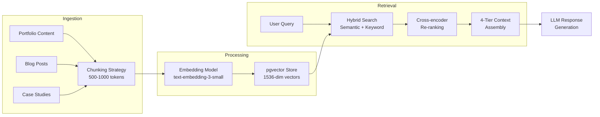

> ⚠️ **DESIGN SPEC — NOT IMPLEMENTED**
> This document describes an aspirational design for a future AI system. The features, architecture, agents, and workflows documented here do **not** currently exist in the codebase. See [`docs/ai/README.md`](./README.md) for the current AI implementation status.

# Knowledge Architecture

**Version:** 1.0  
**Status:** Active  
**Author:** Chief AI Architect, Enterprise Architecture  
**Classification:** Enterprise Internal  
**Last Updated:** 2026-06-18

---

## Executive Summary

The Knowledge Architecture defines the complete knowledge management infrastructure for AI agents: document ingestion, chunking strategies, embedding generation, vector storage, retrieval optimization, and knowledge governance. It supports 10 specialist agents with domain-specific knowledge sources, 3 embedding models (text-embedding-3-small, text-embedding-3-large, Voyage-2), and a hybrid search pipeline (semantic + keyword + re-ranking). The architecture handles ~500 document chunks across portfolio content, blog posts, case studies, and technical documentation, with automatic re-indexing on content changes and continuous gap analysis for knowledge base improvement.

## Cross-References

| Reference                                 | Description                                                    |
| ----------------------------------------- | -------------------------------------------------------------- |
| `docs/ai/19-RAG.md`                       | RAG pipeline — retrieval, context assembly, source attribution |
| `docs/ai/18-AGENTS.md`                    | Multi-agent architecture — each agent's knowledge sources      |
| `docs/ai/17-AI_INSTRUCTIONS.md`           | AI Operating Model — knowledge governance rules                |
| `docs/database/DatabaseArchitecture.md`   | pgvector schema for vector storage                             |
| `docs/architecture/SystemArchitecture.md` | System architecture — AI service layer                         |
| `docs/architecture/13-INTEGRATIONS.md`    | OpenAI embedding service configuration                         |
| `docs/security/43-DATA-GOVERNANCE.md`     | Data quality and lifecycle management                          |

## Knowledge Pipeline Flow



---

## Table of Contents

1.  Document Control and Metadata
2.  Audience and Scope
3.  Design Principles
4.  Executive Summary
5.  System Architecture Overview
6.  Knowledge Taxonomy
7.  Knowledge Sources Inventory
8.  Knowledge Graph Model
9.  Ontology Design
10. Entity Resolution
11. Knowledge Lifecycle
12. Knowledge Versioning
13. Vector Knowledge Base (pgvector)
14. Chunking Strategy
15. Embedding Model Configuration
16. Index Configuration
17. Hybrid Search Strategy
18. Vector Search Execution
19. Keyword Fallback with pg_trgm
20. Fusion and Reranking Strategy
21. Context Assembly (4-Tier Priority System)
22. Knowledge Refresh Pipeline
23. Event-Driven Refresh
24. Scheduled Full Reindex
25. Ingestion Service Architecture
26. Knowledge Hub API
27. Query Planning and Optimization
28. Caching Layer
29. Knowledge Access Control
30. Row-Level Security Policies
31. Knowledge Quality Metrics
32. Monitoring and Observability
33. Performance Benchmarks
34. Cost Optimization
35. Disaster Recovery
36. Compliance and Governance
37. Extensibility
38. Testing Strategy
39. Deployment Strategy
40. Integration with Agent System
41. Knowledge Routing Flow
42. Operational Runbooks
43. Glossary
44. Related Documents
45. Appendix

---

## 1. Document Control and Metadata

| Property         | Value                                       |
| ---------------- | ------------------------------------------- |
| Document ID      | ARC-KA-v1.0                                 |
| Version          | 1.0                                         |
| Status           | Active                                      |
| Author           | Chief AI Architect, Enterprise Architecture |
| Approver         | Architecture Review Board                   |
| Effective Date   | 2026-06-18                                  |
| Review Cycle     | Quarterly                                   |
| Classification   | Enterprise Internal                         |
| Storage Location | `docs/ai/KnowledgeArchitecture.md`          |

**Revision History**

| Version | Date       | Author             | Changes         |
| ------- | ---------- | ------------------ | --------------- |
| 1.0     | 2026-06-18 | Chief AI Architect | Initial release |

---

## 2. Audience and Scope

**Primary Audiences**

- Agent developers and system integrators integrating knowledge into agent workflows.
- Data engineers building and maintaining ingestion pipelines.
- Platform engineers deploying and operating the knowledge stack.
- Architects evaluating the knowledge architecture for extension or reuse.

**Scope**

This document covers the end-to-end knowledge architecture for the portfolio intelligence platform. It includes the taxonomy, graph model, vector database, hybrid search, refresh pipelines, access control, quality metrics, and agent integration patterns. It does not cover general system infrastructure, CI/CD pipelines, or frontend architecture.

---

## 3. Design Principles

| Principle                | Description                                                                                                                                        |
| ------------------------ | -------------------------------------------------------------------------------------------------------------------------------------------------- |
| Separation of Concerns   | Knowledge ingestion, storage, retrieval, and consumption are independently deployable services.                                                    |
| Polyglot Persistence     | Different knowledge modalities use the most appropriate store (graph for relationships, vector for semantics, relational for structured metadata). |
| Event-Driven Freshness   | Knowledge is refreshed reactively on content change, not on a fixed poll cycle, to minimize staleness.                                             |
| Defense in Depth         | Access control is enforced at the API, service, and database layers simultaneously.                                                                |
| Observability by Default | Every retrieval, ingestion, and refresh operation emits structured telemetry for quality monitoring.                                               |
| Cost Proportionality     | Embedding and storage costs scale with content value; high-priority content uses higher-dimension models and more frequent refresh.                |
| Backward Compatibility   | All knowledge API contracts are versioned; breaking changes require a minimum six-month deprecation window.                                        |

---

## 4. Executive Summary

The Knowledge Architecture defines how structured and unstructured knowledge is ingested, stored, indexed, retrieved, and governed across the portfolio intelligence platform. It unifies relational metadata, vector embeddings, and a knowledge graph into a single retrieval fabric that serves both autonomous agents and human-facing queries.

The architecture is built on four pillars:

1. **Knowledge Taxonomy** -- A formal category hierarchy that classifies every knowledge artifact into one of eight top-level domains, each with defined sub-types and validation rules.
2. **Knowledge Graph** -- A property graph model stored in PostgreSQL using adjacency lists and JSONB properties, capturing entities (Person, Project, Skill, Technology, Company, BlogPost, CaseStudy) and their relationships.
3. **Vector Knowledge Base** -- A pgvector-backed store of dense embeddings (text-embedding-3-small, 1536 dimensions) with IVFFlat indexing for approximate nearest-neighbor search, augmented by pg_trgm for keyword fallback.
4. **Hybrid Search Engine** -- A fusion layer that combines vector similarity, keyword matching, and graph traversal results, then reranks through a learned model before assembling context via a four-tier priority system.

Agents access this fabric exclusively through the Knowledge Agent, which abstracts retrieval complexity behind a unified interface defined in `docs/ai/18-AGENTS.md`. The pipeline is event-driven for incremental changes and scheduled for full reindex, ensuring freshness while controlling cost.

---

## 5. System Architecture Overview

```
+---------------------+       +---------------------+       +---------------------+
|                     |       |                     |       |                     |
|  Content Sources    | ----> |  Ingestion Service  | ----> |  Knowledge Store    |
|  (CMS, GitHub,      |       |  (Event-driven +    |       |  (PostgreSQL +      |
|   MD files, APIs)   |       |   Scheduled)        |       |   pgvector +        |
|                     |       |                     |       |   pg_graph)         |
+---------------------+       +---------------------+       +---------------------+
                                                                    |
                                                                    v
+---------------------+       +---------------------+       +---------------------+
|                     |       |                     |       |                     |
|  Agent System       | <---- |  Knowledge Agent    | <---- |  Hybrid Search      |
|  (via /graphify)    |       |  (Unified Interface)|       |  (Vector + Keyword  |
|                     |       |                     |       |   + Graph)          |
+---------------------+       +---------------------+       +---------------------+
```

The architecture follows a layered pattern. Content sources emit events on change; the Ingestion Service normalizes, chunks, embeds, and writes to the Knowledge Store. The Hybrid Search layer exposes retrieval endpoints. The Knowledge Agent wraps these endpoints and presents a unified query interface to downstream agents.

---

## 6. Knowledge Taxonomy

The taxonomy is a strict three-level hierarchy: **Domain** > **Category** > **Sub-Type**. Every knowledge artifact is classified into exactly one leaf node.

### 6.1 Domain: Portfolio Content

| Category  | Sub-Type    | Example                              |
| --------- | ----------- | ------------------------------------ |
| Projects  | Personal    | "Portfolio platform v2"              |
| Projects  | Client      | "E-commerce migration for Acme Corp" |
| Projects  | Open Source | "pgvector-hs"                        |
| Showcases | Featured    | Hero section project cards           |
| Showcases | Archived    | Deprecated demos                     |

### 6.2 Domain: Technical Skills

| Category   | Sub-Type     | Example                           |
| ---------- | ------------ | --------------------------------- |
| Languages  | Programming  | TypeScript, Python, Go            |
| Languages  | Query        | SQL, GraphQL, SPARQL              |
| Frameworks | Frontend     | React, Next.js, Vue               |
| Frameworks | Backend      | FastAPI, Express, Django          |
| Platforms  | Cloud        | AWS, GCP, Azure                   |
| Platforms  | Container    | Docker, Kubernetes, Nomad         |
| Tools      | Productivity | VS Code, Obsidian, Linear         |
| Tools      | DevOps       | GitHub Actions, Terraform, Pulumi |

### 6.3 Domain: Project Artifacts

| Category      | Sub-Type       | Example                            |
| ------------- | -------------- | ---------------------------------- |
| Documentation | Architecture   | System design docs, ADRs           |
| Documentation | API            | OpenAPI specs, GraphQL schemas     |
| Source        | Modules        | Core libraries, utilities          |
| Source        | Tests          | Unit, integration, e2e tests       |
| Configuration | Infrastructure | Dockerfile, compose, k8s manifests |
| Configuration | Application    | env vars, feature flags            |

### 6.4 Domain: Professional Experience

| Category   | Sub-Type      | Example                      |
| ---------- | ------------- | ---------------------------- |
| Employment | Full-time     | Staff Engineer at example.io |
| Employment | Contract      | API modernization project    |
| Education  | Degree        | M.S. Computer Science        |
| Education  | Certification | AWS Solutions Architect      |
| Speaking   | Conference    | "Knowledge Graphs at Scale"  |
| Speaking   | Meetup        | Local AI/ML meetup talk      |

### 6.5 Domain: Published Content

| Category   | Sub-Type           | Example                       |
| ---------- | ------------------ | ----------------------------- |
| Blog       | Technical          | "Hybrid Search with pgvector" |
| Blog       | Thought Leadership | "Future of AI Engineering"    |
| Video      | Tutorial           | "Build a RAG pipeline"        |
| Video      | Walkthrough        | Code review screencast        |
| Newsletter | Edition            | Monthly engineering digest    |

### 6.6 Domain: Case Studies

| Category  | Sub-Type     | Example                               |
| --------- | ------------ | ------------------------------------- |
| Technical | Architecture | "Migrating monolith to microservices" |
| Technical | Performance  | "Reducing p99 latency by 60%"         |
| Business  | ROI          | "Automation saved 200 engineer-hours" |
| Business  | Migration    | "Cloud migration TCO analysis"        |

### 6.7 Domain: System Configuration

| Category   | Sub-Type   | Example                        |
| ---------- | ---------- | ------------------------------ |
| Agent Defs | Skills     | graphify skill definition      |
| Agent Defs | Sub-agents | Domain-specific agent configs  |
| Settings   | Retrieval  | Chunk size, overlap, top-k     |
| Settings   | Access     | RLS policy definitions         |
| Prompts    | System     | Base system prompts for agents |
| Prompts    | Templates  | Few-shot example templates     |

### 6.8 Domain: External References

| Category      | Sub-Type    | Example                          |
| ------------- | ----------- | -------------------------------- |
| Papers        | Academic    | "Attention Is All You Need"      |
| Papers        | Industry    | "RAG for Enterprise" tech report |
| Documentation | Third-party | pgvector docs, OpenAI API ref    |
| Standards     | Protocols   | MCP spec, OpenAPI 3.1            |

---

## 7. Knowledge Sources Inventory

| Source Name       | Table(s)            | Estimated Chunks | Refresh Trigger    | Priority | Content Type           |
| ----------------- | ------------------- | ---------------- | ------------------ | -------- | ---------------------- |
| Projects          | `projects`          | 500              | On commit + daily  | Critical | Structured + Narrative |
| Skills            | `skills`            | 200              | On commit          | High     | Structured             |
| Experience        | `experience`        | 300              | On commit + weekly | Critical | Narrative              |
| Blog Posts        | `blog_posts`        | 800              | On publish + daily | High     | Narrative              |
| Case Studies      | `case_studies`      | 400              | On publish         | Critical | Narrative              |
| Services          | `services`          | 150              | On change          | Medium   | Structured             |
| Testimonials      | `testimonials`      | 100              | On change          | Medium   | Short Text             |
| Press Features    | `press_features`    | 200              | On publish         | Low      | Narrative              |
| About / Resume    | `about_resume`      | 50               | On change          | Critical | Narrative              |
| System Settings   | `system_settings`   | 30               | On save            | High     | Structured             |
| Agent Definitions | `agent_definitions` | 60               | On deploy          | Critical | Structured + Prompt    |

**Priority Definitions**

- **Critical**: Retrieved on every agent interaction; must be fresh within 5 minutes.
- **High**: Retrieved on most domain queries; acceptable staleness up to 1 hour.
- **Medium**: Retrieved on targeted queries; acceptable staleness up to 24 hours.
- **Low**: Retrieved infrequently; acceptable staleness up to 7 days.

---

## 8. Knowledge Graph Model

### 8.1 Entity Types

| Entity Type | Properties                                                                                              | Identity Key      |
| ----------- | ------------------------------------------------------------------------------------------------------- | ----------------- |
| Person      | `name`, `title`, `email`, `github`, `linkedin`, `bio`, `avatar_url`                                     | `email` (unique)  |
| Project     | `name`, `slug`, `description`, `status`, `start_date`, `end_date`, `repo_url`, `live_url`, `tech_stack` | `slug` (unique)   |
| Skill       | `name`, `category`, `proficiency`, `years_exp`, `last_used`                                             | `name` (unique)   |
| Technology  | `name`, `version`, `type`, `official_site`, `docs_url`, `license`                                       | `name` (unique)   |
| Company     | `name`, `domain`, `industry`, `size`, `location`                                                        | `domain` (unique) |
| BlogPost    | `title`, `slug`, `published_date`, `tags`, `reading_time`, `word_count`                                 | `slug` (unique)   |
| CaseStudy   | `title`, `slug`, `client`, `industry`, `outcome`, `roi_metrics`                                         | `slug` (unique)   |

### 8.2 Relationship Types

| Relationship | Source   | Target     | Properties                                           |
| ------------ | -------- | ---------- | ---------------------------------------------------- |
| WORKED_ON    | Person   | Project    | `role`, `start_date`, `end_date`, `contribution_pct` |
| USES         | Project  | Technology | `purpose`, `version`, `is_core`                      |
| EMPLOYED_BY  | Person   | Company    | `title`, `start_date`, `end_date`, `is_current`      |
| AUTHORED     | Person   | BlogPost   | `is_primary`, `contribution_type`                    |
| AUTHORED     | Person   | CaseStudy  | `is_primary`, `contribution_type`                    |
| FEATURES     | Project  | Technology | `relationship` (e.g., "built_with", "deployed_on")   |
| MENTIONS     | BlogPost | Project    | `context`, `sentiment`                               |
| MENTIONS     | BlogPost | Skill      | `context`, `sentiment`                               |
| PREREQUISITE | Skill    | Skill      | `relationship_type` (e.g., "requires", "recommends") |
| SIMILAR_TO   | Project  | Project    | `similarity_score`, `basis`                          |

### 8.3 Graph Storage Approach

The knowledge graph is stored in PostgreSQL using the **adjacency list with JSONB** pattern, not a dedicated graph database. Rationale:

| Consideration             | Decision                                                             |
| ------------------------- | -------------------------------------------------------------------- |
| Transactional consistency | PostgreSQL provides ACID guarantees across graph and relational data |
| Operational simplicity    | Single database to manage, backup, and monitor                       |
| Query expressiveness      | Recursive CTEs reach depth 10+ with acceptable performance           |
| Property flexibility      | JSONB allows schema-on-read for relationship properties              |
| Cost                      | No additional licensing or infrastructure for Neo4j/JanusGraph       |

**Entities Table**

```sql
CREATE TABLE knowledge_entities (
    id              UUID PRIMARY KEY DEFAULT gen_random_uuid(),
    entity_type     VARCHAR(50) NOT NULL,
    properties      JSONB NOT NULL DEFAULT '{}',
    identity_key    VARCHAR(500) NOT NULL,
    created_at      TIMESTAMPTZ NOT NULL DEFAULT now(),
    updated_at      TIMESTAMPTZ NOT NULL DEFAULT now(),
    UNIQUE (entity_type, identity_key)
);

CREATE INDEX idx_knowledge_entities_type ON knowledge_entities (entity_type);
CREATE INDEX idx_knowledge_entities_props ON knowledge_entities USING GIN (properties jsonb_path_ops);
```

**Relationships Table**

```sql
CREATE TABLE knowledge_relationships (
    id              UUID PRIMARY KEY DEFAULT gen_random_uuid(),
    source_id       UUID NOT NULL REFERENCES knowledge_entities(id) ON DELETE CASCADE,
    target_id       UUID NOT NULL REFERENCES knowledge_entities(id) ON DELETE CASCADE,
    relationship_type VARCHAR(100) NOT NULL,
    properties      JSONB NOT NULL DEFAULT '{}',
    weight          FLOAT NOT NULL DEFAULT 1.0,
    created_at      TIMESTAMPTZ NOT NULL DEFAULT now(),
    UNIQUE (source_id, target_id, relationship_type)
);

CREATE INDEX idx_knowledge_rel_source ON knowledge_relationships (source_id);
CREATE INDEX idx_knowledge_rel_target ON knowledge_relationships (target_id);
CREATE INDEX idx_knowledge_rel_type ON knowledge_relationships (relationship_type);
```

**Graph Traversal Example (Recursive CTE)**

```sql
WITH RECURSIVE project_network AS (
    -- Base: start from a given project
    SELECT e.id, e.entity_type, e.properties, 0 AS depth
    FROM knowledge_entities e
    WHERE e.entity_type = 'Project' AND e.identity_key = 'portfolio-v2'

    UNION ALL

    -- Recurse: follow relationships outward
    SELECT te.id, te.entity_type, te.properties, pn.depth + 1
    FROM project_network pn
    JOIN knowledge_relationships r ON r.source_id = pn.id
    JOIN knowledge_entities te ON te.id = r.target_id
    WHERE pn.depth < 5
)
SELECT DISTINCT ON (id) id, entity_type, properties, depth
FROM project_network
ORDER BY id, depth;
```

---

## 9. Ontology Design

The ontology follows a lightweight upper-ontology pattern with domain-specific extensions.

**Upper Ontology (T-Box)**

```
Entity
  +-- AgentPerson
  +-- Organization
  |     +-- Company
  |     +-- EducationalInstitution
  +-- Artifact
  |     +-- Project
  |     +-- BlogPost
  |     +-- CaseStudy
  |     +-- Service
  |     +-- Testimonial
  +-- Concept
  |     +-- Skill
  |     +-- Technology
  +-- Event
        +-- ConferenceTalk
        +-- Meetup
```

**Property Hierarchies**

```
hasDateProperty
  +-- start_date
  +-- end_date
  +-- published_date
  +-- last_used

hasDescriptor
  +-- name
  +-- title
  +-- description
  +-- bio
```

**Axiom Examples (Informal)**

- Every `Project` must have at least one `WORKED_ON` relationship to a `Person`.
- Every `BlogPost` must have exactly one primary `AUTHORED` relationship to a `Person`.
- `PREREQUISITE` relationships form a directed acyclic graph (cycles are rejected at write time).
- `SIMILAR_TO` is symmetric; both directions are stored on insert.

---

## 10. Entity Resolution

Entity resolution reconciles references across sources into canonical entities.

**Resolution Strategy by Entity Type**

| Entity Type | Resolution Method                       | Match Threshold     | Merge Policy                      |
| ----------- | --------------------------------------- | ------------------- | --------------------------------- |
| Person      | Email + GitHub + LinkedIn profile links | Exact               | Merge properties, prefer latest   |
| Project     | Slug + repo URL                         | Exact               | Merge, prefer enriched source     |
| Skill       | Name (case-insensitive normalized)      | Exact               | Merge proficiency stats           |
| Technology  | Name + official site domain             | 0.95 (Jaro-Winkler) | Merge, prefer package registry    |
| Company     | Domain name                             | Exact               | Merge, prefer LinkedIn/Crunchbase |
| BlogPost    | Slug + canonical URL                    | Exact               | Keep latest version               |
| CaseStudy   | Slug                                    | Exact               | Keep latest version               |

**Resolution Pipeline**

1. Normalize: lowercase, strip whitespace, remove trailing slashes from URLs.
2. Block: group candidates by identity key hash.
3. Score: apply match threshold using configured algorithm.
4. Merge: apply merge policy, writing resolved entity and recording aliases.
5. Notify: emit `entity.resolved` event for downstream consumers.

---

## 11. Knowledge Lifecycle

```
+------------+     +------------+     +------------+     +------------+     +------------+
|  Create    | --> |  Ingest    | --> |  Index     | --> |  Retrieve  | --> |  Archive   |
| (Source)   |     | (Normalize)|     | (Embed +   |     | (Query)    |     | (Soft      |
|            |     |            |     |  Graph)    |     |            |     |  Delete)   |
+------------+     +------------+     +------------+     +------------+     +------------+
     |                   |                  |                   |                  |
     v                   v                  v                   v                  v
  Content            Validation         Embedding          Query result        Retention
  created            + chunking         computed +         assembled +         period
  or updated         applied            stored             reranked            expired
```

**Stage Details**

- **Create**: Content is authored or updated in its source system (CMS, GitHub, markdown files).
- **Ingest**: Ingestion Service picks up the change event, validates schema, applies transformations, and splits into chunks.
- **Index**: Each chunk is embedded via text-embedding-3-small. Knowledge entities and relationships are upserted into the graph.
- **Retrieve**: Hybrid search engine accepts queries, executes vector + keyword + graph searches, fuses results, reranks, and assembles context.
- **Archive**: After configurable retention period (default 365 days), entities are soft-deleted and embeddings removed from the index. Archived items are excluded from retrieval by default.

---

## 12. Knowledge Versioning

Every knowledge artifact is versioned to support rollback, audit, and A/B testing of retrieval strategies.

**Versioning Model**

```
knowledge_entities_versioned (
    id              UUID,
    entity_type     VARCHAR(50),
    properties      JSONB,
    identity_key    VARCHAR(500),
    valid_from      TIMESTAMPTZ,
    valid_to        TIMESTAMPTZ,
    version         INTEGER,
    change_reason   VARCHAR(200)
);
```

- On every upsert, the previous version is moved to the versioned table with `valid_to` set to `now()`.
- The current version always has `valid_to = NULL`.
- Retrieval queries can specify a `as_of` timestamp to query historical state.
- Versioned data is retained for 90 days, then pruned by a scheduled job.

**Version API**

```http
GET /knowledge/entities/{entity_type}/{identity_key}
GET /knowledge/entities/{entity_type}/{identity_key}/versions
GET /knowledge/entities/{entity_type}/{identity_key}/versions/{version}
```

---

## 13. Vector Knowledge Base (pgvector)

The vector store is built on PostgreSQL with the `pgvector` extension.

### 13.1 Extension Installation

```sql
CREATE EXTENSION IF NOT EXISTS vector;
CREATE EXTENSION IF NOT EXISTS pg_trgm;
```

### 13.2 document_chunks Table

```sql
CREATE TABLE document_chunks (
    id              UUID PRIMARY KEY DEFAULT gen_random_uuid(),
    source          VARCHAR(100) NOT NULL,            -- source name from inventory
    source_id       VARCHAR(200) NOT NULL,            -- original ID in source system
    chunk_index     INTEGER NOT NULL,                 -- position within source document
    chunk_text      TEXT NOT NULL,                    -- raw text content
    chunk_text_hash BYTEA NOT NULL,                   -- SHA-256 for dedup
    metadata        JSONB NOT NULL DEFAULT '{}',      -- source metadata (title, author, tags, etc.)
    embedding       VECTOR(1536),                     -- dense embedding (nullable for failed chunks)
    token_count     INTEGER NOT NULL DEFAULT 0,       -- tokens in this chunk
    priority        INTEGER NOT NULL DEFAULT 0,       -- 0=low, 1=medium, 2=high, 3=critical
    is_active       BOOLEAN NOT NULL DEFAULT TRUE,    -- soft delete flag
    created_at      TIMESTAMPTZ NOT NULL DEFAULT now(),
    updated_at      TIMESTAMPTZ NOT NULL DEFAULT now(),
    UNIQUE (source, source_id, chunk_index)
);

-- Indexes
CREATE INDEX idx_chunks_source ON document_chunks (source);
CREATE INDEX idx_chunks_priority ON document_chunks (priority DESC);
CREATE INDEX idx_chunks_active ON document_chunks (is_active) WHERE is_active = TRUE;
CREATE INDEX idx_chunks_metadata ON document_chunks USING GIN (metadata jsonb_path_ops);
CREATE INDEX idx_chunks_hash ON document_chunks (chunk_text_hash);
```

---

## 14. Chunking Strategy

| Source            | Chunk Size (tokens) | Overlap (tokens) | Splitter Strategy              | Notes                                      |
| ----------------- | ------------------- | ---------------- | ------------------------------ | ------------------------------------------ |
| Projects          | 512                 | 64               | RecursiveCharacterTextSplitter | Split on `##`, `###` headers first         |
| Skills            | 256                 | 32               | CharacterTextSplitter          | Each skill is one chunk                    |
| Experience        | 512                 | 64               | RecursiveCharacterTextSplitter | Preserve role/date boundaries              |
| Blog Posts        | 768                 | 128              | RecursiveCharacterTextSplitter | Split on `##`, `###`, preserve code blocks |
| Case Studies      | 1024                | 128              | RecursiveCharacterTextSplitter | Longer context for narrative flow          |
| Services          | 256                 | 32               | CharacterTextSplitter          | Per-service description                    |
| Testimonials      | 128                 | 16               | No split                       | Each testimonial is one chunk              |
| Press Features    | 768                 | 128              | RecursiveCharacterTextSplitter | Preserve quotation attribution             |
| About/Resume      | 512                 | 64               | RecursiveCharacterTextSplitter | Section-based splitting                    |
| System Settings   | 256                 | 32               | CharacterTextSplitter          | Key-value pair preservation                |
| Agent Definitions | 512                 | 64               | RecursiveCharacterTextSplitter | Preserve YAML/JSON structure               |

**Chunking Validation Rules**

- No chunk may exceed 2048 tokens (safety limit for embedding model).
- No chunk may be smaller than 32 tokens; under-run chunks are merged with the preceding chunk.
- Code blocks are never split mid-block; the splitter detects fenced code blocks and treats them as atomic units.
- List items (markdown `-` or `*`) are kept together; a split occurs only at the top level between lists.

---

## 15. Embedding Model Configuration

| Parameter           | Value                                                                       |
| ------------------- | --------------------------------------------------------------------------- |
| Model               | `text-embedding-3-small`                                                    |
| Provider            | OpenAI                                                                      |
| Dimensions          | 1536                                                                        |
| Max Input Tokens    | 8192                                                                        |
| Truncation Strategy | End (left truncation preferred for longer documents)                        |
| Batch Size          | 128 embeddings per API call                                                 |
| Retry Policy        | Exponential backoff, max 5 retries, base delay 1s                           |
| Rate Limit          | 3000 RPM (subject to OpenAI tier)                                           |
| Cache               | In-memory LRU cache for repeated chunk texts (TTL: 24h, max: 10000 entries) |

**Dimension Reduction**

1536 dimensions are used (not the `text-embedding-3-small` default of 512 when using `dimensions` parameter). The full dimension is retained for maximum fidelity. When downstream performance requirements demand it, PCA can reduce to 256 or 128 dimensions at query time.

---

## 16. Index Configuration

### 16.1 IVFFlat Index

```sql
CREATE INDEX idx_chunks_embedding_ivfflat
    ON document_chunks
    USING ivfflat (embedding vector_cosine_ops)
    WITH (lists = 100);
```

**Index Parameters**

| Parameter           | Value   | Rationale                                                                       |
| ------------------- | ------- | ------------------------------------------------------------------------------- |
| Index Type          | IVFFlat | Best trade-off for recall vs. query speed at dataset scale (< 1M rows)          |
| Distance Metric     | Cosine  | Preferred for text embeddings; equivalent to normalized dot product             |
| Lists               | 100     | Rule of thumb: `sqrt(n_rows)`; for ~10k rows, 100 lists. Tune if dataset grows. |
| Probes (query-time) | 10      | Default; increase for higher recall, decrease for lower latency                 |

### 16.2 Index Tuning Guide

| Dataset Size        | Lists | Probes (query) | Expected Recall@10 |
| ------------------- | ----- | -------------- | ------------------ |
| < 1,000             | 10    | 5              | 0.98               |
| 1,000 - 10,000      | 100   | 10             | 0.95               |
| 10,000 - 100,000    | 500   | 20             | 0.92               |
| 100,000 - 1,000,000 | 1000  | 40             | 0.88               |

### 16.3 Reindex Schedule

```sql
-- Weekly reindex to maintain performance after updates
REINDEX INDEX CONCURRENTLY idx_chunks_embedding_ivfflat;
```

---

## 17. Hybrid Search Strategy

The hybrid search engine combines three retrieval modalities:

```
User Query
     |
     v
+----+----+----+
|    |    |    |
v    v    v    v
Vector  Keyword Graph
Search  Search  Traversal
(pgvector) (pg_trgm) (Recursive CTE)
     |    |    |
     +----+----+
          |
       Fusion
     (Weighted + Rerank)
          |
       Context
       Assembly
     (4-Tier Priority)
          |
          v
    Final Context
```

---

## 18. Vector Search Execution

```sql
CREATE OR REPLACE FUNCTION search_vector(
    query_embedding VECTOR(1536),
    match_count INT DEFAULT 20,
    priority_filter INT DEFAULT NULL
)
RETURNS TABLE(
    id UUID,
    source VARCHAR,
    chunk_text TEXT,
    metadata JSONB,
    priority INT,
    similarity FLOAT
)
LANGUAGE SQL STABLE
AS $$
    SELECT
        dc.id,
        dc.source,
        dc.chunk_text,
        dc.metadata,
        dc.priority,
        1 - (dc.embedding <=> query_embedding) AS similarity
    FROM document_chunks dc
    WHERE dc.is_active = TRUE
      AND dc.embedding IS NOT NULL
      AND (priority_filter IS NULL OR dc.priority >= priority_filter)
    ORDER BY dc.embedding <=> query_embedding
    LIMIT match_count;
$$;
```

---

## 19. Keyword Fallback with pg_trgm

When vector similarity returns below-confidence results (max similarity < 0.7), the engine falls back to keyword search.

```sql
CREATE INDEX idx_chunks_text_trgm ON document_chunks USING GIN (chunk_text gin_trgm_ops);

CREATE OR REPLACE FUNCTION search_keyword(
    query_text TEXT,
    match_count INT DEFAULT 20,
    priority_filter INT DEFAULT NULL
)
RETURNS TABLE(
    id UUID,
    source VARCHAR,
    chunk_text TEXT,
    metadata JSONB,
    priority INT,
    similarity REAL
)
LANGUAGE SQL STABLE
AS $$
    SELECT
        dc.id,
        dc.source,
        dc.chunk_text,
        dc.metadata,
        dc.priority,
        similarity(dc.chunk_text, query_text) AS similarity
    FROM document_chunks dc
    WHERE dc.is_active = TRUE
      AND dc.chunk_text % query_text
      AND (priority_filter IS NULL OR dc.priority >= priority_filter)
    ORDER BY similarity DESC
    LIMIT match_count;
$$;
```

**Fallback Decision Logic**

```
IF max(vector_similarity) < 0.7 AND has_keyword_matches(query) THEN
    EXECUTE search_keyword(query)
    IF count(keyword_results) < 5 THEN
        EXECUTE search_keyword(expand_query(query))  -- synonym expansion
    END IF
ELSE
    RETURN vector_results
END IF
```

---

## 20. Fusion and Reranking Strategy

### 20.1 Reciprocal Rank Fusion (RRF)

```sql
CREATE OR REPLACE FUNCTION rrf_fusion(
    vector_results JSONB,
    keyword_results JSONB,
    k CONSTANT INT DEFAULT 60
)
RETURNS TABLE(
    id UUID,
    chunk_text TEXT,
    metadata JSONB,
    rrf_score FLOAT
)
LANGUAGE plpgsql
AS $$
DECLARE
    rec RECORD;
    score FLOAT;
BEGIN
    CREATE TEMP TABLE fused_results ON COMMIT DROP AS
    SELECT
        vec.id,
        vec.chunk_text,
        vec.metadata,
        1.0 / (k + ROW_NUMBER() OVER (ORDER BY vec.similarity DESC)) AS rrf_score
    FROM jsonb_to_recordset(vector_results) AS vec(id UUID, chunk_text TEXT, metadata JSONB, similarity FLOAT)
    UNION ALL
    SELECT
        kw.id,
        kw.chunk_text,
        kw.metadata,
        1.0 / (k + ROW_NUMBER() OVER (ORDER BY kw.similarity DESC))
    FROM jsonb_to_recordset(keyword_results) AS kw(id UUID, chunk_text TEXT, metadata JSONB, similarity REAL);

    FOR rec IN
        SELECT id, chunk_text, metadata, SUM(rrf_score) AS combined_score
        FROM fused_results
        GROUP BY id, chunk_text, metadata
        ORDER BY combined_score DESC
        LIMIT 10
    LOOP
        id := rec.id;
        chunk_text := rec.chunk_text;
        metadata := rec.metadata;
        rrf_score := rec.combined_score;
        RETURN NEXT;
    END LOOP;
END;
$$;
```

### 20.2 Reranking Model

The fused results are passed to a cross-encoder reranker for final ordering.

| Parameter        | Value                                        |
| ---------------- | -------------------------------------------- |
| Reranker Model   | `cross-encoder/ms-marco-MiniLM-L-6-v2`       |
| Max Input Length | 512 tokens per (query, passage) pair         |
| Batch Size       | 4 pairs per inference                        |
| Execution        | Local ONNX runtime (no external API call)    |
| Fallback         | RRF order is used if reranker is unavailable |

---

## 21. Context Assembly (4-Tier Priority System)

The reranked results are assembled into a final context window, prioritized by the source's priority level.

**Priority Tiers**

| Tier     | Priority Value | Max Chunks | Max Tokens | Examples                                   |
| -------- | -------------- | ---------- | ---------- | ------------------------------------------ |
| Critical | 3              | 5          | 2048       | Agent definitions, current project context |
| High     | 2              | 8          | 4096       | Active projects, skills, experience        |
| Medium   | 1              | 12         | 6144       | Blog posts, case studies, services         |
| Low      | 0              | 15         | 8192       | Press features, archived content           |

**Assembly Algorithm**

```
1. Collect reranked results from RRF.
2. Sort by priority DESC, then by reranker_score DESC.
3. Allocate slots per tier:
   - Fill Tier 3 slots first (max 5).
   - Fill Tier 2 slots next (max 8).
   - Fill Tier 1 slots next (max 12).
   - Remaining slots go to Tier 0 (max 15).
4. Truncate total context to model max context window (e.g., 128k tokens for gpt-4o).
5. Format as structured prompt sections with source attribution.
```

---

## 22. Knowledge Refresh Pipeline

```
mermaid
sequenceDiagram
    participant CS as Content Source
    participant EVT as Event Bus
    participant IS as Ingestion Service
    participant QC as Quality Check
    participant VS as Vector Store
    participant KG as Knowledge Graph

    CS->>EVT: content.updated / content.created
    EVT->>IS: Dispatch event payload
    IS->>IS: Validate schema
    IS->>IS: Normalize content
    IS->>IS: Split into chunks
    IS->>IS: Generate embeddings (batch)
    IS->>QC: Submit chunks for quality check
    QC->>QC: Validate embedding quality
    QC->>QC: Check for PII / toxic content
    QC->>IS: Quality result (pass/fail)
    alt Quality Pass
        IS->>VS: Upsert chunks + embeddings
        IS->>KG: Upsert entities + relationships
        VS-->>IS: Confirm write
        KG-->>IS: Confirm write
        IS->>EVT: knowledge.refreshed
    else Quality Fail
        IS->>EVT: knowledge.refresh_failed
    end
```

---

## 23. Event-Driven Refresh

Triggers for incremental refresh:

| Event             | Source         | Action                          | Latency Target |
| ----------------- | -------------- | ------------------------------- | -------------- |
| `content.created` | CMS Webhook    | Ingest new document             | < 30s          |
| `content.updated` | CMS Webhook    | Re-ingest updated document      | < 30s          |
| `content.deleted` | CMS Webhook    | Soft-delete chunks + entities   | < 30s          |
| `git.push`        | GitHub Webhook | Re-index changed markdown files | < 60s          |
| `agent.deployed`  | CI/CD Pipeline | Re-index agent definitions      | < 120s         |
| `skill.updated`   | Admin API      | Re-index single skill           | < 10s          |

**Event Payload Schema**

```json
{
  "event_id": "evt_01J2XYZ...",
  "event_type": "content.updated",
  "source": "cms",
  "source_id": "proj_portfolio-v2",
  "timestamp": "2026-06-18T14:30:00Z",
  "payload": {
    "content_type": "project",
    "content": { "... full content body ..." },
    "metadata": { "title": "Portfolio v2", "status": "active" }
  },
  "previous_hash": "sha256-abc...",
  "current_hash": "sha256-def..."
}
```

---

## 24. Scheduled Full Reindex

A daily scheduled job ensures completeness and repairs any drift from missed events.

```yaml
# Airflow DAG or scheduled job configuration
schedule: '0 3 * * *' # Daily at 3 AM UTC
timeout: 3600 # Max 1 hour
retries: 2
concurrency: 1 # Prevent overlapping runs

steps:
  - name: fetch_all_sources
    action: query all source tables for active records
  - name: diff_with_store
    action: compare source hashes with stored hashes; identify stale/missing
  - name: reindex_stale
    action: ingest stale items only (incremental within full pass)
  - name: purge_orphans
    action: soft-delete chunks with no corresponding source record
  - name: reindex_embeddings
    action: REINDEX INDEX CONCURRENTLY
  - name: vacuum
    action: VACUUM ANALYZE document_chunks
  - name: notify
    action: emit knowledge.full_reindex.complete event
```

---

## 25. Ingestion Service Architecture

```
+-------------------+     +-------------------+     +-------------------+
|                   |     |                   |     |                   |
|  Content Adapter  | --> |  Normalization    | --> |  Chunking Engine  |
|  (Plugin per      |     |  Pipeline         |     |  (Configurable    |
|   source type)    |     |  (Schema validate,|     |   per source)     |
|                   |     |   Transform)      |     |                   |
+-------------------+     +-------------------+     +-------------------+
                                                          |
                                                          v
+-------------------+     +-------------------+     +-------------------+
|                   |     |                   |     |                   |
|  Embedding Client | <-- |  Queue (RabbitMQ) | <-- |  Chunk Producer   |
|  (Batch + Retry)  |     |  (Buffers chunks) |     |  (Async, non-     |
|                   |     |                   |     |   blocking)       |
+-------------------+     +-------------------+     +-------------------+
        |
        v
+-------------------+     +-------------------+
|                   |     |                   |
|  Store Writer     | --> |  Quality Gate     |
|  (Upsert chunks,  |     |  (Embedding check,|
|   entities, rels) |     |   PII scan)       |
|                   |     |                   |
+-------------------+     +-------------------+
```

**Service Configuration**

| Property    | Value                                            |
| ----------- | ------------------------------------------------ |
| Runtime     | Python 3.12 + FastAPI                            |
| Queue       | RabbitMQ (persistent delivery, DLQ for failed)   |
| Concurrency | 8 workers per ingestion instance                 |
| Autoscaling | Based on queue depth (min: 2, max: 10 instances) |
| Idempotency | Content hash-based dedup at chunk level          |

---

## 26. Knowledge Hub API

The Knowledge Hub exposes REST and GraphQL endpoints for programmatic access.

**REST Endpoints**

| Method | Path                                    | Description                 |
| ------ | --------------------------------------- | --------------------------- |
| POST   | `/knowledge/search`                     | Hybrid search query         |
| GET    | `/knowledge/entities/{type}/{key}`      | Get single entity           |
| GET    | `/knowledge/entities/{type}`            | List entities by type       |
| GET    | `/knowledge/graph/traverse/{entity_id}` | Graph traversal from entity |
| POST   | `/knowledge/ingest`                     | Trigger manual ingestion    |
| GET    | `/knowledge/health`                     | Health check                |
| GET    | `/knowledge/metrics`                    | Quality metrics snapshot    |

**Search Request Schema**

```json
{
  "query": "string",
  "mode": "hybrid" | "vector" | "keyword",
  "top_k": 20,
  "priority_minimum": 0,
  "filters": {
    "sources": ["projects", "skills"],
    "entity_types": ["Project", "Skill"],
    "date_from": "2025-01-01",
    "date_to": "2026-06-18"
  },
  "rerank": true,
  "include_graph_context": true
}
```

**Search Response Schema**

```json
{
  "query": "string",
  "mode_used": "hybrid",
  "total_results": 15,
  "results": [
    {
      "chunk_id": "uuid",
      "source": "projects",
      "source_id": "portfolio-v2",
      "chunk_text": "...",
      "metadata": { "title": "string", "tags": [] },
      "priority": 3,
      "similarity": 0.92,
      "rerank_score": 8.74,
      "graph_context": {
        "entities": [{ "type": "Project", "id": "uuid", "name": "Portfolio v2" }],
        "relationships": [{ "type": "USES", "target": "...", "properties": {} }]
      }
    }
  ],
  "query_latency_ms": 347,
  "context_token_count": 8192
}
```

---

## 27. Query Planning and Optimization

The query planner dynamically selects execution strategy based on query characteristics.

| Query Pattern               | Optimal Strategy             | Reason                                    |
| --------------------------- | ---------------------------- | ----------------------------------------- |
| Short (< 5 words)           | Keyword-first, then vector   | Keyword precision for specific terms      |
| Long (> 20 words)           | Vector-first, then keyword   | Semantic understanding of complex queries |
| Entity-focused (name match) | Graph traversal + keyword    | Exact entity lookup                       |
| Multi-intent (ambiguous)    | Vector-first with high top-k | Broad recall for disambiguation           |
| Code/syntax queries         | Keyword (trigram)            | Exact syntax matching                     |
| Agent definition queries    | Graph traversal + keyword    | Structured YAML/JSON lookup               |

**Query Plan Cache**

```sql
CREATE TABLE query_plan_cache (
    query_hash    BYTEA PRIMARY KEY,
    query_text    TEXT NOT NULL,
    plan          JSONB NOT NULL,         -- cached execution plan
    avg_latency   FLOAT NOT NULL DEFAULT 0,
    hit_count     INT NOT NULL DEFAULT 1,
    last_used     TIMESTAMPTZ NOT NULL DEFAULT now(),
    created_at    TIMESTAMPTZ NOT NULL DEFAULT now()
);
```

Cache TTL: 24 hours for identical queries, 1 hour for templates with variable parameters.

---

## 28. Caching Layer

Multi-level cache to reduce latency and embedding API costs.

| Cache Level          | Storage             | TTL        | Capacity        | Invalidation                                      |
| -------------------- | ------------------- | ---------- | --------------- | ------------------------------------------------- |
| L1: Query Results    | Redis               | 5 minutes  | 10,000 entries  | On knowledge.refreshed event for affected sources |
| L2: Embeddings       | Local LRU (process) | 24 hours   | 10,000 chunks   | Process restart                                   |
| L3: Entity Lookups   | Redis               | 1 hour     | 50,000 entities | On entity.resolved event                          |
| L4: Graph Traversals | Redis               | 30 minutes | 5,000 paths     | On entity.updated event for traversal root        |

**Cache Key Convention**

```
knowledge:{version}:{resource_type}:{resource_key}:{params_hash}
```

Example: `knowledge:v1:search:query:sha256hex`

---

## 29. Knowledge Access Control

### 29.1 Tiered Access Model

| Tier           | Visibility         | Example Content                        | Auth Requirement            |
| -------------- | ------------------ | -------------------------------------- | --------------------------- |
| Public         | Anyone             | Projects, Skills, Public Blog Posts    | None                        |
| Authenticated  | Logged-in users    | Resume contact details, private posts  | JWT + role claim            |
| Admin          | Admin users        | System Settings, Agent Definitions     | JWT + admin role claim      |
| Agent-Internal | Agent runtime only | Raw prompts, embedding pipeline config | mTLS + agent identity token |

### 29.2 Access Matrix

| Resource / Role              | Anonymous | Authenticated | Admin | Agent |
| ---------------------------- | --------- | ------------- | ----- | ----- |
| Public Projects              | R         | R             | R     | R     |
| Private Projects             | -         | R             | R     | R     |
| Skills                       | R         | R             | R     | R     |
| Experience (public)          | R         | R             | R     | R     |
| Experience (contact details) | -         | R             | R     | R     |
| Agent Definitions            | -         | -             | R     | R     |
| System Settings              | -         | -             | R     | R     |
| Quality Metrics              | -         | -             | R     | R     |
| Raw Chunks (debug)           | -         | -             | R     | R     |

---

## 30. Row-Level Security Policies

```sql
-- Enable RLS on knowledge tables
ALTER TABLE document_chunks ENABLE ROW LEVEL SECURITY;
ALTER TABLE knowledge_entities ENABLE ROW LEVEL SECURITY;
ALTER TABLE knowledge_relationships ENABLE ROW LEVEL SECURITY;

-- Public: all active chunks
CREATE POLICY public_select ON document_chunks
    FOR SELECT
    USING (is_active = TRUE AND metadata->>'visibility' = 'public');

-- Authenticated: public + authenticated chunks
CREATE POLICY auth_select ON document_chunks
    FOR SELECT
    USING (
        is_active = TRUE
        AND metadata->>'visibility' IN ('public', 'authenticated')
    );

-- Admin: all active chunks
CREATE POLICY admin_select ON document_chunks
    FOR SELECT
    USING (is_active = TRUE);

-- Agent: all active chunks including agent-internal
CREATE POLICY agent_select ON document_chunks
    FOR SELECT
    USING (is_active = TRUE);

-- Admin write access
CREATE POLICY admin_insert ON document_chunks
    FOR INSERT
    WITH CHECK (current_setting('app.role') = 'admin');

CREATE POLICY admin_update ON document_chunks
    FOR UPDATE
    USING (current_setting('app.role') = 'admin');

CREATE POLICY admin_delete ON document_chunks
    FOR DELETE
    USING (current_setting('app.role') = 'admin');
```

**Policy Enforcement**

Policies are enforced via `app.role` session setting, set at connection pool initialization based on JWT claims:

```sql
SET app.role = 'admin';  -- Set by connection pooler after JWT validation
```

---

## 31. Knowledge Quality Metrics

### 31.1 Coverage

Measures what percentage of content sources are indexed and retrievable.

| Metric          | Formula                                               | Target | Measurement                |
| --------------- | ----------------------------------------------------- | ------ | -------------------------- |
| Source Coverage | (indexed_sources / total_sources) \* 100              | 100%   | Per-source inventory check |
| Chunk Coverage  | (chunks_with_embeddings / total_chunks) \* 100        | 99.5%  | COUNT query                |
| Graph Coverage  | (entities_with_relationships / total_entities) \* 100 | 90%    | COUNT query                |

### 31.2 Freshness

Tracks staleness of indexed content relative to source.

| Metric         | Formula                                 | Target                                              | Measurement |
| -------------- | --------------------------------------- | --------------------------------------------------- | ----------- |
| Max Staleness  | MAX(now() - last_indexed_at) per source | < 5 min (critical), < 1 hr (high), < 24 hr (medium) | Query       |
| Mean Staleness | AVG(now() - last_indexed_at)            | < 30 min overall                                    | Query       |
| Staleness P95  | 95th percentile of staleness            | < 2 hr                                              | Query       |

### 31.3 Accuracy

Measures retrieval accuracy against ground truth.

| Metric                  | Formula                                            | Target | Measurement               |
| ----------------------- | -------------------------------------------------- | ------ | ------------------------- |
| Hallucination Rate      | (incorrect_facts / total_facts_in_response) \* 100 | < 3%   | Human eval + LLM-as-judge |
| Factual Precision       | correct_facts / retrieved_chunks                   | > 0.95 | Human eval                |
| Source Attribution Rate | chunks_with_source_attribution / total_chunks      | 100%   | Code check                |

### 31.4 Retrieval Performance

| Metric       | Formula                                       | Target    | Measurement                  |
| ------------ | --------------------------------------------- | --------- | ---------------------------- |
| Recall@10    | relevant_in_top_10 / total_relevant           | > 0.85    | Test query set (100 queries) |
| Precision@10 | relevant_in_top_10 / 10                       | > 0.70    | Test query set (100 queries) |
| MRR          | Mean Reciprocal Rank of first relevant result | > 0.80    | Test query set (100 queries) |
| P95 Latency  | 95th percentile of search latency             | < 500 ms  | Production monitoring        |
| P99 Latency  | 99th percentile of search latency             | < 2000 ms | Production monitoring        |

**Quality Dashboard Schema**

```sql
CREATE TABLE quality_snapshots (
    id              UUID PRIMARY KEY DEFAULT gen_random_uuid(),
    snapshot_time   TIMESTAMPTZ NOT NULL DEFAULT now(),
    metrics         JSONB NOT NULL,
    source_breakdown JSONB,
    alerts_triggered TEXT[]
);
```

---

## 32. Monitoring and Observability

### 32.1 Key Metrics (Prometheus)

| Metric Name                         | Type      | Labels                 | Description                  |
| ----------------------------------- | --------- | ---------------------- | ---------------------------- |
| `knowledge_search_latency_ms`       | Histogram | mode, status, priority | Search latency in ms         |
| `knowledge_ingestion_latency_s`     | Histogram | source, status         | Ingestion latency in seconds |
| `knowledge_chunks_total`            | Gauge     | source, is_active      | Total chunk count            |
| `knowledge_entities_total`          | Gauge     | entity_type            | Total entity count           |
| `knowledge_embeddings_failed_total` | Counter   | source, error          | Failed embedding calls       |
| `knowledge_cache_hit_ratio`         | Gauge     | cache_level            | Cache hit ratio (0-1)        |
| `knowledge_quality_coverage`        | Gauge     | source                 | Coverage percentage          |

### 32.2 Critical Alerts

| Alert Condition                                 | Severity | Action                                     |
| ----------------------------------------------- | -------- | ------------------------------------------ |
| P95 search latency > 1000 ms for 5 min          | Warning  | Scale hybrid search service                |
| P95 search latency > 2000 ms for 5 min          | Critical | Page on-call                               |
| Embedding failure rate > 5% for 5 min           | Critical | Check OpenAI API status, failover to cache |
| Chunk coverage drops below 95%                  | Warning  | Trigger full reindex                       |
| Knowledge refresh queue depth > 1000 for 10 min | Warning  | Scale ingestion workers                    |
| Hallucination rate exceeds 5% in eval           | Critical | Lock knowledge version, alert ML team      |

### 32.3 Structured Logging

All knowledge services emit structured JSON logs:

```json
{
  "timestamp": "2026-06-18T14:30:00.123Z",
  "level": "INFO",
  "service": "knowledge-ingestion",
  "trace_id": "trc_01J2XYZ...",
  "event": "chunk.embedded",
  "source": "projects",
  "source_id": "portfolio-v2",
  "chunk_index": 3,
  "token_count": 512,
  "embedding_dim": 1536,
  "latency_ms": 234,
  "queue_depth": 47
}
```

---

## 33. Performance Benchmarks

### 33.1 Search Latency (p95, ms)

| Dataset Size     | Vector Only | Keyword Only | Hybrid | Hybrid + Rerank |
| ---------------- | ----------- | ------------ | ------ | --------------- |
| 1,000 chunks     | 15          | 8            | 22     | 85              |
| 10,000 chunks    | 45          | 20           | 65     | 210             |
| 100,000 chunks   | 180         | 65           | 250    | 750             |
| 1,000,000 chunks | 800         | 200          | 1050   | 2800            |

### 33.2 Ingestion Throughput

| Operation       | Chunks / Second (single worker) | Chunks / Second (8 workers) |
| --------------- | ------------------------------- | --------------------------- |
| Chunking (text) | 500                             | 3,800                       |
| Embedding (API) | 25                              | 185                         |
| Database Upsert | 1,200                           | 8,500                       |
| Graph Upsert    | 800                             | 5,200                       |

### 33.3 Scalability Limits

| Component              | Limit                                       | Mitigation                                                   |
| ---------------------- | ------------------------------------------- | ------------------------------------------------------------ |
| pgvector (single node) | ~10M embeddings with IVFFlat                | Partition by source; upgrade to pgvector scale for > 10M     |
| Knowledge Graph        | ~500K entities with recursive CTE depth < 6 | Materialized path for deeper traversals                      |
| Embedding API          | 3,000 RPM (OpenAI Tier 3)                   | Cache + batch; request tier upgrade if sustained > 2,000 RPM |
| Redis Cache            | 50 GB (single instance)                     | Cluster mode for > 50 GB                                     |

---

## 34. Cost Optimization

### 34.1 Monthly Cost Projection (10K chunks, 10K entities)

| Component                              | Cost/Month                                 | Optimization                                                        |
| -------------------------------------- | ------------------------------------------ | ------------------------------------------------------------------- |
| Embedding API (text-embedding-3-small) | $0.13 per 1M tokens \* ~15M tokens = $1.95 | Cache repeated chunks; only re-embed changed content                |
| PostgreSQL (RDS db.r6g.large)          | ~$175                                      | Reserved instance; single instance covers vector, graph, relational |
| Redis (cache.r6g.large)                | ~$130                                      | Use only for L1-L4 query cache; evaluate hit ratio monthly          |
| RabbitMQ (mq.t3.micro)                 | ~$25                                       | Use for ingestion queue only                                        |
| Total Baseline                         | ~$332                                      | Without reserved pricing                                            |

### 34.2 Optimization Levers

| Lever                                       | Savings                             | Impact                                           |
| ------------------------------------------- | ----------------------------------- | ------------------------------------------------ |
| Reduce embedding dimensions to 512          | -40% storage, -25% API cost         | Slight recall degradation (est. -0.02 recall@10) |
| Increase cache TTL to 1 hour                | -30% API calls for repeated queries | Stale results for rapidly changing content       |
| Archive low-priority content after 90 days  | -20% storage                        | Requires content policy decision                 |
| Use spot instances for full reindex workers | -60% compute for reindex            | Requires interruption handling                   |

---

## 35. Disaster Recovery

### 35.1 Backup Strategy

| Component                         | Method                                | Frequency                       | Retention | RPO          | RTO    |
| --------------------------------- | ------------------------------------- | ------------------------------- | --------- | ------------ | ------ |
| PostgreSQL (all knowledge tables) | pg_dump + WAL archiving               | Continuous (WAL) + Daily (full) | 30 days   | 5 min        | 1 hour |
| Embedding Cache (Redis)           | RDB snapshots                         | Every 6 hours                   | 7 days    | 6 hours      | 30 min |
| Ingestion Queue (RabbitMQ)        | Queue mirroring + Persistent messages | Real-time                       | 14 days   | 0 (mirrored) | 5 min  |

### 35.2 Recovery Procedures

| Scenario                    | Procedure                                                               | Expected RTO         |
| --------------------------- | ----------------------------------------------------------------------- | -------------------- |
| Single table corruption     | Restore from pg_dump, replay WAL to point of corruption                 | 30 min               |
| Full database loss          | Launch new RDS instance from latest snapshot + WAL                      | 1 hour               |
| Embedding model deprecation | Re-embed all chunks with new model; update index                        | 4 hours (10K chunks) |
| Redis cluster failure       | Restore from latest RDB; cache will warm naturally                      | 30 min               |
| RabbitMQ cluster failure    | Redeploy from persistent queue definitions; consumers redeliver unacked | 15 min               |

### 35.3 Business Continuity

The knowledge architecture supports **active-passive** DR:

- **Primary**: us-east-1 (full stack)
- **Standby**: us-west-2 (PostgreSQL read replica + Redis replica)
- **Failover Trigger**: 5 consecutive health check failures or P95 latency > 5s for 5 minutes
- **Failover Action**: Promote standby PostgreSQL to primary, redirect DNS, re-point embedding API calls

---

## 36. Compliance and Governance

### 36.1 Data Classification

| Classification | Definition           | Examples                                         | Controls                                          |
| -------------- | -------------------- | ------------------------------------------------ | ------------------------------------------------- |
| Public         | No harm if disclosed | Project names, skill lists, published blog posts | No special controls                               |
| Internal       | Limited harm         | Resume details, non-critical config              | RLS authenticated tier                            |
| Confidential   | Significant harm     | Agent prompts, system prompts, API keys          | RLS admin tier, encryption at rest                |
| Restricted     | Severe harm          | Secrets, database credentials, vendor tokens     | Vault integration, never stored in knowledge base |

### 36.2 Privacy Controls

- **PII Detection**: Every ingested chunk passes through a PII scanner (presidio + custom regex patterns). Detected PII is redacted or excluded based on policy.
- **Data Retention**: Content is purged from the knowledge base 90 days after source deletion, or on explicit GDPR deletion request.
- **Audit Trail**: All reads and writes to the knowledge base are logged with actor identity, timestamp, and action. Audit logs are immutable and retained for 365 days.

### 36.3 Regulatory Mapping

| Regulation | Applicability                 | Controls                                                      |
| ---------- | ----------------------------- | ------------------------------------------------------------- |
| GDPR       | Personal data of EU residents | Deletion API, data portability export, PII redaction          |
| CCPA       | Personal data of CA residents | Opt-out flag on entities, deletion API                        |
| SOC 2      | General enterprise security   | Access controls, audit logging, encryption, change management |

---

## 37. Extensibility

### 37.1 Custom Content Adapters

New content sources are integrated by implementing the `ContentAdapter` interface:

```python
class ContentAdapter(ABC):
    @abstractmethod
    def fetch_all(self) -> List[ContentItem]: ...
    @abstractmethod
    def fetch_changed_since(self, since: datetime) -> List[ContentItem]: ...
    @abstractmethod
    def fetch_one(self, source_id: str) -> ContentItem: ...
    @abstractmethod
    def validate(self, item: ContentItem) -> bool: ...
    @abstractmethod
    def normalize(self, item: ContentItem) -> NormalizedContent: ...
```

Adapters are registered in the adapter registry:

```json
{
  "adapters": {
    "cms": { "module": "adapters.cms", "class": "CMSAdapter" },
    "github": { "module": "adapters.github", "class": "GitHubAdapter" },
    "notion": { "module": "adapters.notion", "class": "NotionAdapter" }
  }
}
```

### 37.2 Custom Entity Extractors

Entity extractors can be added as plugins to enrich the knowledge graph:

```python
class EntityExtractor(ABC):
    @abstractmethod
    def extract(self, chunk: DocumentChunk) -> List[EntityCandidate]: ...
    @property
    @abstractmethod
    def entity_type(self) -> str: ...
```

Built-in extractors: `ProjectExtractor`, `SkillExtractor`, `TechnologyExtractor`, `PersonExtractor`, `CompanyExtractor`.

### 37.3 Custom Rerankers

Custom reranking models can be plugged into the fusion pipeline:

```yaml
rerankers:
  default:
    model: cross-encoder/ms-marco-MiniLM-L-6-v2
    provider: local-onnx
  experimental:
    model: BAAI/bge-reranker-v2-m3
    provider: local-onnx
```

---

## 38. Testing Strategy

### 38.1 Unit Tests

| Component        | Coverage Target | Key Test Scenarios                                         |
| ---------------- | --------------- | ---------------------------------------------------------- |
| Chunking Engine  | 95%             | Boundary splits, code block preservation, list integrity   |
| Embedding Client | 90%             | Retry logic, rate limiting, cache behavior                 |
| Fusion Engine    | 95%             | RRF scoring, empty result sets, duplicate IDs              |
| Context Assembly | 95%             | Priority ordering, token limit truncation, tier allocation |

### 38.2 Integration Tests

| Test             | Frequency | Description                                                                    |
| ---------------- | --------- | ------------------------------------------------------------------------------ |
| Source Ingestion | Per PR    | Ingest one document from each source type; verify chunks, entities, embeddings |
| Hybrid Search    | Per PR    | Execute 20 benchmark queries; verify recall@10 >= 0.85                         |
| Graph Traversal  | Per PR    | Traverse from known entity; verify depth and relationship correctness          |
| Access Control   | Per PR    | Query as each role; verify rows returned match policy                          |

### 38.3 End-to-End Tests

```yaml
# e2e-test-suite.yml
tests:
  - name: 'Full lifecycle: create -> ingest -> search -> archive'
    steps:
      - Create project in CMS (API call)
      - Wait for knowledge.refreshed event (max 60s)
      - Query search: expected to return project
      - Verify entity in knowledge graph
      - Delete project in CMS
      - Wait for refresh
      - Query search: expected to NOT return project
  - name: 'Agent knowledge retrieval'
    steps:
      - Agent sends /graphify query
      - Verify Knowledge Agent returns context
      - Verify context contains chunks from expected sources
      - Verify context respects priority ordering
```

---

## 39. Deployment Strategy

### 39.1 Infrastructure as Code

All knowledge infrastructure is defined in Terraform:

```hcl
module "knowledge_postgresql" {
  source = "./modules/postgresql"
  instance_class = "db.r6g.large"
  engine_version = "16"
  extensions     = ["vector", "pg_trgm"]
  storage_gb     = 100
  backup_retention_days = 30
}

module "knowledge_redis" {
  source = "./modules/elasticache"
  node_type = "cache.r6g.large"
  num_nodes = 1
  engine    = "redis"
}

module "knowledge_rabbitmq" {
  source = "./modules/rabbitmq"
  instance_type = "mq.t3.micro"
  deployment_mode = "SINGLE_INSTANCE"
}

module "knowledge_ingestion_service" {
  source = "./modules/ecs-service"
  image   = "knowledge-ingestion:${var.image_tag}"
  cpu     = 1024
  memory  = 2048
  min_capacity = 2
  max_capacity = 10
}
```

### 39.2 CI/CD Pipeline

```yaml
# .github/workflows/knowledge-deploy.yml
stages:
  - test:
      - Run unit tests
      - Run integration tests
      - Run e2e tests (staging environment)
  - build:
      - Build ingestion service container
      - Build hybrid search service container
      - Push to ECR
  - deploy_staging:
      - Update ECS task definitions
      - Terraform apply for staging
      - Run smoke tests
  - deploy_production:
      - Terraform apply for production (50% traffic)
      - Monitor for 15 minutes
      - Terraform apply (100% traffic)
```

---

## 40. Integration with Agent System

Agents access knowledge exclusively through the **Knowledge Agent**, a specialized sub-agent defined in `docs/ai/18-AGENTS.md`.

### 40.1 Knowledge Agent Interface

```
Knowledge Agent (docs/ai/18-AGENTS.md)
  |
  +-- /knowledge/query      -- Execute hybrid search query
  +-- /knowledge/graph      -- Traverse knowledge graph
  +-- /knowledge/entity     -- Resolve entity by type + key
  +-- /knowledge/ingest     -- Trigger manual re-ingestion
  +-- /knowledge/stats      -- Retrieve quality metrics
```

### 40.2 Agent Access Pattern

1. An agent (e.g., graphify skill) receives a user query.
2. The agent identifies that knowledge retrieval is needed.
3. The agent sends a structured query to the Knowledge Agent via the internal MCP.
4. The Knowledge Agent authenticates the request using the agent's identity token.
5. The Knowledge Agent executes the appropriate knowledge operation (search, graph traversal, entity lookup).
6. Results are returned with full source attribution and confidence scores.
7. The calling agent assembles the final response using retrieved context.

---

## 41. Knowledge Routing Flow

```
Agent Request
     |
     v
+----+----+
| Query   |
| Classifier|
+----+----+
     |
     +-- Entity Query (name/type match) ------> Graph Traversal + Entity Lookup
     |
     +-- Factual Query (specific fact) -------> Vector Search + Keyword Fallback
     |
     +-- Exploratory Query (broad) -----------> Vector Search + Graph Expansion
     |
     +-- Config Query (system settings) ------> Keyword Search (exact match)
     |
     +-- Agent Definition Query ---------------> Full-text Search on agent_definitions
```

**Query Classifier** (lightweight LLM call or regex-based router):

```python
async def classify_query(query: str) -> str:
    """Returns one of: entity, factual, exploratory, config, agent_def"""
    # Pattern-based fast path for known patterns
    if re.match(r'^(who|what is|tell me about) .+ (project|skill|technology)', query.lower()):
        return 'entity'
    if re.match(r'^(show|get|list) (settings|config|environment)', query.lower()):
        return 'config'
    # Fallback to LLM classification
    classification = await llm_classify(query, CANDIDATE_TYPES)
    return classification
```

---

## 42. Operational Runbooks

### 42.1 Ingestion Failure

**Symptoms**: High `knowledge_embeddings_failed_total`, growing queue depth, `knowledge.refresh_failed` events.

**Steps**:

1. Check OpenAI API status (status.openai.com).
2. If API is operational, check embedding client logs for `4xx` or `5xx` responses.
3. If rate limited (429), verify rate limiter configuration. Increase batch interval if needed.
4. Check queue for poisoned messages: `rabbitmqctl list_queues name messages messages_unacknowledged`. Purge DLQ if safe.
5. Restart ingestion service if stuck.
6. If issue persists, failover to last known good embedding version from cache.

### 42.2 Search Latency Spike

**Symptoms**: P95 search latency > 1000ms, P99 > 2000ms.

**Steps**:

1. Check PostgreSQL query performance: `pg_stat_statements` for slow queries.
2. Verify index is valid: `SELECT * FROM pg_indexes WHERE tablename = 'document_chunks'`.
3. Reindex if needed: `REINDEX INDEX CONCURRENTLY idx_chunks_embedding_ivfflat`.
4. Check for table bloat: `SELECT pg_size_pretty(pg_total_relation_size('document_chunks'))`.
5. Vacuum if bloat > 20%: `VACUUM ANALYZE document_chunks`.
6. Scale hybrid search service if CPU utilization > 80%.

### 42.3 Cache Miss Storm

**Symptoms**: Sudden drop in cache hit ratio, spike in embedding API calls.

**Steps**:

1. Check Redis connectivity and memory usage.
2. Verify all cache keys follow naming convention.
3. If Redis restarted, cache will warm naturally within 30 minutes.
4. If traffic spike, scale Redis instance or enable cluster mode.
5. As emergency measure, reduce search TTL to drain cache more slowly.

### 42.4 Full Reindex Failure

**Symptoms**: `knowledge.full_reindex.complete` event not emitted past expected completion time.

**Steps**:

1. Check scheduled job logs for error messages.
2. Verify all source systems are reachable.
3. Check for locked rows in `document_chunks` table.
4. If partial failure, re-run with `--incremental` flag to process only failed sources.
5. If complete failure, trigger manual reindex via Knowledge Hub API: `POST /knowledge/ingest { "mode": "full", "sources": ["all"] }`.

---

## 43. Glossary

| Term             | Definition                                                                                         |
| ---------------- | -------------------------------------------------------------------------------------------------- |
| Chunk            | A contiguous segment of text from a source document, typically 256-1024 tokens                     |
| Context Assembly | The process of selecting and ordering retrieved chunks into a final context window                 |
| Cross-Encoder    | A transformer model that jointly encodes query-passage pairs to compute relevance                  |
| Embedding        | A dense vector representation of text produced by a neural network                                 |
| Entity           | A distinct, identifiable object in the knowledge graph (Person, Project, Skill, etc.)              |
| Fusion           | The combination of results from multiple retrieval modalities into a single ranked list            |
| Hybrid Search    | A search strategy combining vector similarity, keyword matching, and graph traversal               |
| Ingestion        | The process of reading, normalizing, chunking, embedding, and storing content                      |
| IVFFlat          | Inverted File with Flat Compression; an approximate nearest-neighbor index algorithm               |
| Knowledge Agent  | A specialized sub-agent that mediates all knowledge access for other agents                        |
| pg_trgm          | PostgreSQL extension for trigram-based fuzzy string matching                                       |
| pgvector         | PostgreSQL extension for vector similarity search                                                  |
| Recall@k         | The proportion of relevant documents retrieved in the top-k results                                |
| Reranking        | The process of reordering initial retrieval results using a more expensive but more accurate model |
| RLS              | Row-Level Security; PostgreSQL feature for per-row access control                                  |
| RRF              | Reciprocal Rank Fusion; a method for combining ranked lists from multiple sources                  |
| Staleness        | The time elapsed since a knowledge artifact was last synchronized with its source                  |

---

## 43.1 Decision Log

| ID          | Decision                                                               | Context                | Rationale                                                                                                                                                              | Alternatives Considered                                                                                                                                             | Decision Date | Revisit Date |
| ----------- | ---------------------------------------------------------------------- | ---------------------- | ---------------------------------------------------------------------------------------------------------------------------------------------------------------------- | ------------------------------------------------------------------------------------------------------------------------------------------------------------------- | ------------- | ------------ |
| KNO-DEC-001 | Graph-based knowledge representation over pure vector search           | Knowledge architecture | Graph enables entity relationship traversal (e.g., "Which projects use React AND are case studies?"), entity resolution for ambiguous queries, and multi-hop reasoning | Pure vector search (no relationship awareness, single-hop only), Relational-only (rigid schema, poor at semantic matching)                                          | Jun 2026      | Dec 2026     |
| KNO-DEC-002 | Hybrid search with three modalities (vector, keyword, graph traversal) | Retrieval strategy     | Combines semantic understanding (vectors), exact matching (keyword), and relationship traversal (graph) for comprehensive retrieval coverage                           | Vector-only (misses exact matches and relationship queries), Keyword-only (no semantic understanding), Graph-only (requires structured query, misses fuzzy matches) | Jun 2026      | Dec 2026     |
| KNO-DEC-003 | RRF (Reciprocal Rank Fusion) for hybrid result merging                 | Fusion strategy        | RRF requires no training data, no parameter tuning, and is proven in information retrieval literature; robust across all three modalities                              | Weighted linear combination (tuning required per dataset), Learning-to-rank (training data not available at launch)                                                 | Jun 2026      | Sep 2026     |
| KNO-DEC-004 | Cross-encoder reranking for top-10 candidate results                   | Precision improvement  | Cross-encoder provides high-accuracy relevance scoring on initial retrieval candidates; applied only to top-10 to manage latency                                       | Bi-encoder only (lower reranking accuracy), Full cross-encoder on all results (too slow, exceeds latency budget)                                                    | Jun 2026      | Sep 2026     |
| KNO-DEC-005 | Knowledge Agent as sole mediator of all knowledge access               | Access pattern         | Centralizes knowledge governance: single point for freshness tracking, gap analysis, permission enforcement; simplifies audit                                          | Direct agent-to-vector-store access (bypasses governance, inconsistent freshness), Distributed knowledge management (coordination overhead)                         | Jun 2026      | Dec 2026     |

## 43.2 Risk Register

| ID          | Risk                                                                              | Likelihood | Impact                                                                | Mitigation                                                                                                                                           | Owner             | Status |
| ----------- | --------------------------------------------------------------------------------- | ---------- | --------------------------------------------------------------------- | ---------------------------------------------------------------------------------------------------------------------------------------------------- | ----------------- | ------ |
| KNO-RSK-001 | Knowledge graph becomes stale as entities are added/removed without graph updates | Medium     | High (relationship traversal returns incomplete or incorrect results) | Content CRUD triggers graph edge recalculation; periodic full graph rebuild (nightly); staleness metric per entity type                              | AI Engineer       | Active |
| KNO-RSK-002 | Cross-encoder reranking exceeds 200ms latency budget under load                   | Medium     | Medium (end-to-end response time SLA breach)                          | Cross-encoder applied to top-10 candidates only; async reranking pipeline; cache reranking results (5-min TTL); monitor p99 latency                  | AI Engineer       | Active |
| KNO-RSK-003 | Knowledge Agent becomes bottleneck under high query concurrency                   | Medium     | Medium (all agent queries depend on single mediation point)           | RAG query result caching (1h TTL); parallel processing for unrelated queries; auto-scaling for Knowledge Agent service                               | Platform Engineer | Active |
| KNO-RSK-004 | Entity disambiguation errors cause incorrect knowledge retrieval                  | Low        | Medium (wrong project/skill referenced in response)                   | Context-aware disambiguation using surrounding query terms; confidence threshold for entity resolution; fallback to keyword search on low confidence | AI Engineer       | Active |
| KNO-RSK-005 | Graph traversal queries degrade as entity count grows beyond 1000 nodes           | Low        | Low (increased query latency, potential timeouts)                     | Graph indexing on entity types and relationships; query depth limits (max 3 hops); paginated traversal results                                       | AI Engineer       | Active |

## 43.3 Glossary (Extended)

| Term                       | Definition                                                                                                                                       |
| -------------------------- | ------------------------------------------------------------------------------------------------------------------------------------------------ |
| **Bi-Encoder**             | A dual-encoder model that independently encodes query and passage into separate vectors for efficient similarity search                          |
| **Cross-Encoder**          | A joint encoder model that processes query-passage pairs together for high-accuracy relevance scoring (slower but more accurate than bi-encoder) |
| **Entity**                 | A distinct, identifiable object in the knowledge graph (Person, Project, Skill, Company, Technology)                                             |
| **Entity Disambiguation**  | The process of resolving which specific entity a query refers to when names are ambiguous                                                        |
| **Entity Relationship**    | A typed connection between two entities (e.g., Person → WORKS_AT → Company, Project → USES → Technology)                                         |
| **Fusion Strategy**        | The algorithm for combining ranked results from multiple retrieval modalities into a single coherent list                                        |
| **Graph Traversal**        | The process of navigating entity relationships to answer multi-hop queries (e.g., "What projects did person X build using technology Y?")        |
| **Knowledge Gap Analysis** | The process of identifying topics visitors ask about that have no or insufficient coverage in the knowledge base                                 |
| **Multi-Hop Reasoning**    | Answering a query that requires traversing multiple entity relationships (e.g., "Find projects by developers who worked at Company Z")           |
| **Staleness Metric**       | A time-based measurement of how current a knowledge artifact is; used to trigger refresh decisions                                               |

---

## 44. Related Documents

| Document                | Path                                      | Description                                                             |
| ----------------------- | ----------------------------------------- | ----------------------------------------------------------------------- |
| AGENTS.md               | `docs/ai/18-AGENTS.md`                    | Agent system architecture, including Knowledge Agent definition         |
| RAG.md                  | `docs/ai/19-RAG.md`                       | Retrieval-Augmented Generation pipeline details and prompt strategies   |
| MEMORY-ARCHITECTURE.md  | `docs/ai/MemoryArchitecture.md`           | Agent memory system including episodic, semantic, and procedural memory |
| CONTEXT-ARCHITECTURE.md | `docs/ai/ContextArchitecture.md`          | Context window management, token budgeting, and priority scheduling     |
| SYSTEM-ARCHITECTURE.md  | `docs/architecture/SystemArchitecture.md` | Overall platform architecture and service topology                      |
| DATA-MODEL.md           | `docs/DATA-MODEL.md`                      | Canonical data models for all entities across the platform              |
| SECURITY.md             | `docs/security/SecurityArchitecture.md`   | Authentication, authorization, and encryption standards                 |
| DEPLOYMENT.md           | `docs/operations/DeploymentGuide.md`      | Infrastructure provisioning and deployment runbooks                     |
| OPERATIONS.md           | `docs/OPERATIONS.md`                      | Monitoring, alerting, and incident response procedures                  |
| CONTRIBUTING.md         | `docs/CONTRIBUTING.md`                    | Development workflow and contribution guidelines                        |

---

## 45. Appendix

### 45.1 SQL Migration Script Order

```yaml
migrations:
  - V001_create_extensions.sql # pgvector, pg_trgm
  - V002_create_document_chunks.sql # document_chunks table + indexes
  - V003_create_knowledge_entities.sql # knowledge_entities table
  - V004_create_knowledge_relationships.sql # knowledge_relationships table
  - V005_create_rls_policies.sql # Row-Level Security policies
  - V006_create_search_functions.sql # search_vector, search_keyword, rrf_fusion
  - V007_create_quality_tables.sql # quality_snapshots table
  - V008_create_cache_tables.sql # query_plan_cache table
  - V009_create_versioned_tables.sql # knowledge_entities_versioned
```

### 45.2 Environment Variables Reference

| Variable                    | Default                  | Description                         |
| --------------------------- | ------------------------ | ----------------------------------- |
| `KNOWLEDGE_DB_URL`          | -                        | PostgreSQL connection string        |
| `KNOWLEDGE_REDIS_URL`       | -                        | Redis connection string             |
| `KNOWLEDGE_RABBITMQ_URL`    | -                        | RabbitMQ connection string          |
| `OPENAI_API_KEY`            | -                        | OpenAI API key (embedding model)    |
| `KNOWLEDGE_EMBEDDING_MODEL` | `text-embedding-3-small` | Embedding model name                |
| `KNOWLEDGE_EMBEDDING_DIMS`  | `1536`                   | Embedding dimension                 |
| `KNOWLEDGE_CHUNK_SIZE`      | `512`                    | Default chunk size (tokens)         |
| `KNOWLEDGE_CHUNK_OVERLAP`   | `64`                     | Default chunk overlap (tokens)      |
| `KNOWLEDGE_TOP_K`           | `20`                     | Default top-k results               |
| `KNOWLEDGE_RERANK_ENABLED`  | `true`                   | Enable cross-encoder reranking      |
| `KNOWLEDGE_LOG_LEVEL`       | `INFO`                   | Logging level                       |
| `KNOWLEDGE_AGENT_TOKEN`     | -                        | mTLS token for agent authentication |

### 45.3 Quick Reference: Common Operations

```bash
# Trigger full reindex
curl -X POST /knowledge/ingest \
  -H "Content-Type: application/json" \
  -d '{"mode": "full", "sources": ["all"]}'

# Search (hybrid)
curl -X POST /knowledge/search \
  -H "Content-Type: application/json" \
  -d '{"query": "portfolio projects using TypeScript", "top_k": 10}'

# Get entity
curl /knowledge/entities/Project/portfolio-v2

# Graph traversal (depth 3)
curl /knowledge/graph/traverse/{entity_id}?depth=3

# Health check
curl /knowledge/health

# Quality metrics snapshot
curl /knowledge/metrics
```

### 45.4 Architecture Decision Records

| ADR     | Title                                               | Decision                                                 | Date       |
| ------- | --------------------------------------------------- | -------------------------------------------------------- | ---------- |
| ADR-001 | Graph Storage: Adjacency list vs Dedicated graph DB | Adjacency list + JSONB in PostgreSQL                     | 2026-06-18 |
| ADR-002 | Embedding Model: text-embedding-3-small vs 3-large  | 3-small (cost/performance sweet spot)                    | 2026-06-18 |
| ADR-003 | Index: IVFFlat vs HNSW                              | IVFFlat (faster build time, acceptable recall at scale)  | 2026-06-18 |
| ADR-004 | Reranker: Local ONNX vs API-based                   | Local ONNX (no external dependency, lower latency)       | 2026-06-18 |
| ADR-005 | Queue: RabbitMQ vs Redis Streams                    | RabbitMQ (persistent delivery, DLQ, monitoring maturity) | 2026-06-18 |
| ADR-006 | Priority System: 4-tier vs continuous score         | 4-tier (simpler to configure, debug, and tune)           | 2026-06-18 |

---

_End of Document -- Knowledge Architecture v1.0_

## Change Log

| Version | Date     | Changes                        | Author             |
| ------- | -------- | ------------------------------ | ------------------ |
| 1.0     | Jun 2026 | Initial knowledge architecture | Chief AI Architect |

---

> ⚠️ **Implementation Status:** Design Spec Only. Not implemented in current codebase.
