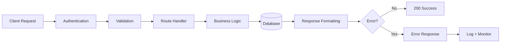

# API Contracts — FAANG Enterprise API Design & Conventions

> **Document:** `APIContracts.md` | **Version:** 5.0 (Enterprise Upgrade) | **Last Updated:** July 2026  
> **Status:** ✅ Active | **Owner:** Principal Backend Architect | **Review Cadence:** Quarterly  
> **Related:** [SystemArchitecture.md](./SystemArchitecture.md) | [BackendArchitecture.md](./BackendArchitecture.md)

---

## Executive Summary



The API Standards establish a consistent enterprise-grade design framework across all portfolio API endpoints. This document defines five core standards: URL-prefix versioning (`/v1/`) with 6-month deprecation policy, cursor-based pagination for all public endpoints (with offset pagination for admin), a standardized error response format with application error codes, `snake_case` naming conventions with an envelope-based response structure, and five-tier rate limiting (per-IP, per-session, per-JWT). These standards ensure every API consumer — from the frontend application to third-party integrations — receives a predictable, well-documented interface.

**Key Design Decisions:** URL-prefix versioning over header-based for discoverability | Cursor-based pagination over offset for consistency | Structured error objects with trace IDs for debuggability | Snake_case for broad framework compatibility | Per-tier rate limiting for fine-grained traffic control.

---

## Table of Contents

1. [Versioning Strategy](#1-versioning-strategy)
2. [Pagination Standard](#2-pagination-standard)
3. [Error Response Format](#3-error-response-format)
4. [Request/Response Conventions](#4-requestresponse-conventions)
5. [Rate Limiting](#5-rate-limiting)

---

## 1. Versioning Strategy

### 1.1 URL-Prefix Versioning

All API endpoints use URL-prefix versioning with the format `/v{N}/`:

```
https://api.portfolio.dev/v1/sections
https://api.portfolio.dev/v1/projects
https://api.portfolio.dev/v1/leads
```

### 1.2 Versioning Rules

| Rule | Detail |
|------|--------|
| **Current version** | `v1` |
| **Version location** | URL path prefix (`/v1/`) — not header-based |
| **Breaking changes** | Increment major version (`/v2/`) |
| **Non-breaking changes** | Same version, additive fields only |
| **Deprecation notice** | `Sunset` header + `Deprecation` header on old version |
| **Sunset policy** | 6 months after new version release |
| **Minimum supported versions** | Current (`vN`) + previous (`vN-1`) |

### 1.3 Deprecation Headers

```http
HTTP/1.1 200 OK
Deprecation: true
Sunset: Sat, 01 Jan 2027 00:00:00 GMT
Link: <https://api.portfolio.dev/v2/sections>; rel="successor-version"
```

### 1.4 What Constitutes a Breaking Change

| Type | Breaking? | Action |
|------|:---------:|--------|
| Adding a new optional field to response | ❌ | Same version |
| Adding a new optional query parameter | ❌ | Same version |
| Adding a new endpoint | ❌ | Same version |
| Removing a field from response | ✅ | New version |
| Changing field type (string → number) | ✅ | New version |
| Renaming a field | ✅ | New version |
| Changing error code format | ✅ | New version |
| Changing pagination format | ✅ | New version |
| Adding a required request field | ✅ | New version |

---

## 2. Pagination Standard

### 2.1 Cursor-Based Pagination (Default)

Used for all list endpoints (public and admin).

**Request:**
```http
GET /v1/projects?cursor=eyJpZCI6IjEyMzQ1Njc4In0&limit=20
```

**Response:**
```json
{
  "data": [
    { "id": "proj_001", "title": "Portfolio Platform", "..." : "..." },
    { "id": "proj_002", "title": "AI Dashboard", "..." : "..." }
  ],
  "meta": {
    "cursor": "eyJpZCI6InByb2pfMDIwIn0",
    "has_more": true,
    "limit": 20,
    "total": 45
  }
}
```

### 2.2 Pagination Parameters

| Parameter | Type | Default | Max | Description |
|-----------|------|:-------:|:---:|-------------|
| `cursor` | string | `null` (first page) | — | Opaque cursor from previous response |
| `limit` | integer | `20` | `100` | Items per page |
| `sort` | string | `created_at` | — | Sort field |
| `order` | string | `desc` | — | Sort direction: `asc` or `desc` |

### 2.3 Offset Pagination (Admin Only)

Used for admin dashboards where "jump to page N" is needed.

```http
GET /v1/admin/leads?offset=40&limit=20
```

```json
{
  "data": [...],
  "meta": {
    "offset": 40,
    "limit": 20,
    "total": 156,
    "total_pages": 8,
    "current_page": 3
  }
}
```

### 2.4 Filtering & Search

```http
GET /v1/projects?category=web&tech=react&search=dashboard&is_featured=true
GET /v1/admin/leads?status=new&priority=high&search=john&date_from=2026-01-01
```

| Filter Type | Syntax | Example |
|-------------|--------|---------|
| Exact match | `?field=value` | `?status=new` |
| Multiple values | `?field=val1,val2` | `?category=web,mobile` |
| Search (FTS) | `?search=term` | `?search=dashboard` |
| Date range | `?date_from=&date_to=` | `?date_from=2026-01-01` |
| Boolean | `?field=true` | `?is_featured=true` |

---

## 3. Error Response Format

### 3.1 Standard Error Object

All API errors follow this format:

```json
{
  "status": 422,
  "code": "LEAD_003",
  "message": "The email address format is invalid.",
  "details": [
    {
      "field": "email",
      "message": "Must be a valid email address (RFC 5321)",
      "value": "not-an-email"
    }
  ],
  "trace_id": "req_abc123def456",
  "timestamp": "2026-06-17T06:00:00.000Z",
  "docs_url": "https://api.portfolio.dev/docs/errors#LEAD_003"
}
```

### 3.2 Error Response Fields

| Field | Type | Required | Description |
|-------|------|:--------:|-------------|
| `status` | integer | ✅ | HTTP status code |
| `code` | string | ✅ | Application error code (see Error Catalog) |
| `message` | string | ✅ | User-friendly error message |
| `details` | array | ❌ | Field-level validation errors |
| `details[].field` | string | ❌ | Field that failed validation |
| `details[].message` | string | ❌ | Field-specific error message |
| `details[].value` | any | ❌ | The invalid value (redacted for sensitive fields) |
| `trace_id` | string | ✅ | Request correlation ID for debugging |
| `timestamp` | string | ✅ | ISO 8601 timestamp |
| `docs_url` | string | ❌ | Link to error documentation |

### 3.3 Error Response Examples

**400 Bad Request — Malformed JSON:**
```json
{
  "status": 400,
  "code": "SYS_001",
  "message": "The request body contains invalid JSON.",
  "trace_id": "req_789ghi",
  "timestamp": "2026-06-17T06:00:00.000Z"
}
```

**401 Unauthorized — Missing/Invalid Token:**
```json
{
  "status": 401,
  "code": "AUTH_001",
  "message": "Authentication required. Please provide a valid access token.",
  "trace_id": "req_abc123",
  "timestamp": "2026-06-17T06:00:00.000Z"
}
```

**403 Forbidden — Insufficient Permissions:**
```json
{
  "status": 403,
  "code": "AUTH_005",
  "message": "You do not have permission to access this resource.",
  "trace_id": "req_def456",
  "timestamp": "2026-06-17T06:00:00.000Z"
}
```

**404 Not Found:**
```json
{
  "status": 404,
  "code": "PROJ_001",
  "message": "Project not found.",
  "trace_id": "req_ghi789",
  "timestamp": "2026-06-17T06:00:00.000Z"
}
```

**422 Validation Error:**
```json
{
  "status": 422,
  "code": "LEAD_003",
  "message": "Validation failed for 2 fields.",
  "details": [
    { "field": "email", "message": "Must be a valid email address", "value": "not-valid" },
    { "field": "message", "message": "Must be between 10 and 5000 characters", "value": "" }
  ],
  "trace_id": "req_jkl012",
  "timestamp": "2026-06-17T06:00:00.000Z"
}
```

**429 Rate Limited:**
```json
{
  "status": 429,
  "code": "SYS_005",
  "message": "Rate limit exceeded. Please try again in 45 seconds.",
  "trace_id": "req_mno345",
  "timestamp": "2026-06-17T06:00:00.000Z"
}
```

---

## 4. Request/Response Conventions

### 4.1 Field Naming

| Convention | Rule | Example |
|-----------|------|---------|
| Field names | `snake_case` | `created_at`, `is_featured`, `tech_stack` |
| Booleans | `is_` or `has_` prefix | `is_live`, `is_private`, `has_more` |
| Timestamps | ISO 8601 with timezone | `"2026-06-17T06:00:00.000Z"` |
| IDs | UUID v4 | `"a1b2c3d4-e5f6-7890-abcd-ef1234567890"` |
| Nulls | Explicit `null` (not omitted) | `"phone": null` |
| Arrays | Plural field name | `"tags": ["react", "typescript"]` |
| Enums | Lowercase string | `"status": "new"`, `"priority": "high"` |

### 4.2 Response Envelope

All successful responses use a consistent envelope:

**Single resource:**
```json
{
  "data": { "id": "...", "title": "...", "..." : "..." }
}
```

**Collection:**
```json
{
  "data": [{ "..." : "..." }, { "..." : "..." }],
  "meta": { "cursor": "...", "has_more": true, "total": 45 }
}
```

**Empty collection:**
```json
{
  "data": [],
  "meta": { "cursor": null, "has_more": false, "total": 0 }
}
```

### 4.3 HTTP Methods

| Method | Purpose | Idempotent | Request Body | Success Code |
|--------|---------|:----------:|:------------:|:------------:|
| `GET` | Read resource(s) | ✅ | ❌ | `200 OK` |
| `POST` | Create resource | ❌ | ✅ | `201 Created` |
| `PUT` | Full replace | ✅ | ✅ | `200 OK` |
| `PATCH` | Partial update | ❌ | ✅ | `200 OK` |
| `DELETE` | Remove resource | ✅ | ❌ | `204 No Content` |

### 4.4 Common Headers

**Request Headers:**
| Header | Required | Description |
|--------|:--------:|-------------|
| `Content-Type` | ✅ (POST/PUT/PATCH) | `application/json` |
| `Authorization` | For admin routes | `Bearer {access_token}` |
| `X-Request-ID` | ❌ | Client-provided correlation ID |
| `Accept-Language` | ❌ | Preferred language (future i18n) |

**Response Headers:**
| Header | Description |
|--------|-------------|
| `X-Request-ID` | Server correlation ID (or echo of client's) |
| `X-RateLimit-Limit` | Rate limit ceiling |
| `X-RateLimit-Remaining` | Remaining requests in window |
| `X-RateLimit-Reset` | Unix timestamp when limit resets |
| `Cache-Control` | Caching directives |

---

## 5. Rate Limiting

### 5.1 Rate Limit Tiers

| Tier | Routes | Limit | Window | Identifier |
|:----:|--------|:-----:|:------:|:----------:|
| **T1** | `POST /leads` | 3 | 1 hour | IP address |
| **T2** | `POST /ai/chat` | 20 | Per session | Session ID |
| **T3** | `GET /api/*` (public) | 100 | 1 minute | IP address |
| **T4** | `ALL /api/admin/*` | 30 | 1 minute | JWT `sub` claim |
| **T5** | `GET /health` | 10 | 1 minute | IP address |

### 5.2 Rate Limit Response Headers

```http
HTTP/1.1 200 OK
X-RateLimit-Limit: 100
X-RateLimit-Remaining: 87
X-RateLimit-Reset: 1718899260
```

### 5.3 429 Rate Limit Exceeded Response

```http
HTTP/1.1 429 Too Many Requests
Retry-After: 45
X-RateLimit-Limit: 3
X-RateLimit-Remaining: 0
X-RateLimit-Reset: 1718899305
Content-Type: application/json

{
  "status": 429,
  "code": "SYS_005",
  "message": "Rate limit exceeded. Please try again in 45 seconds.",
  "trace_id": "req_xyz789"
}
```

### 5.4 Rate Limiting Implementation

```typescript
// NestJS throttler configuration
import { ThrottlerModule } from '@nestjs/throttler';

ThrottlerModule.forRoot([
  { name: 'public', ttl: 60000, limit: 100 },    // T3: 100/min
  { name: 'admin', ttl: 60000, limit: 30 },       // T4: 30/min
  { name: 'contact', ttl: 3600000, limit: 3 },    // T1: 3/hour
  { name: 'health', ttl: 60000, limit: 10 },      // T5: 10/min
]);
```

---

## Decision Log

| ID | Decision | Rationale | Alternatives Considered | Date | Approver |
|----|----------|-----------|------------------------|------|----------|
| D-API-001 | Use URL-prefix versioning (`/v1/`) instead of header-based versioning | Maximum discoverability — visible in URLs, curl output, browser dev tools; no custom header required | Header-based (`Accept-version: v1`) (rejected — invisible, requires tooling); query-param versioning (rejected — pollutes URLs) | Jun 2026 | Staff Backend Architect |
| D-API-002 | Adopt cursor-based pagination as default for public endpoints | Consistent behavior regardless of data mutations; no page drift; better performance on large datasets | Offset-based only (rejected — page drift with concurrent writes); keyset pagination (rejected — requires sort-field coupling) | Jun 2026 | Staff Backend Architect |
| D-API-003 | Use structured error objects with application error codes and trace IDs | Enables programmatic error handling, correlation across logs, and self-documenting error catalog | HTTP status-only (rejected — insufficient detail); plain text messages (rejected — not machine-readable); no trace IDs (rejected — debugging impossible) | Jun 2026 | Staff Backend Architect |
| D-API-004 | Enforce snake_case for all API fields | Matches PostgreSQL column naming, NestJS conventions, and common API tooling | camelCase (rejected — mismatch with DB/schema); PascalCase (rejected — uncommon for APIs); kebab-case (rejected — cannot use in JS objects without quotes) | Jun 2026 | Staff Backend Architect |
| D-API-005 | Implement 5-tier rate limiting differentiated by route and identifier | Fine-grained control protects critical endpoints (leads, auth) while allowing generous limits for public reads | Single global rate limit (rejected — doesn't account for different endpoint sensitivity); no rate limiting (rejected — abuse risk) | Jun 2026 | Staff Backend Architect |
| D-API-006 | Maintain 6-month sunset policy with explicit Deprecation and Sunset headers | Gives API consumers sufficient migration time; headers provide programmatic deprecation detection | No deprecation policy (rejected — breaks consumers); 3-month sunset (rejected — insufficient for integration updates); 12-month sunset (rejected — too long for fast iteration) | Jun 2026 | Staff Backend Architect |

## Risk Register

| ID | Risk | Likelihood | Impact | Mitigation |
|----|------|------------|--------|------------|
| R-API-001 | API consumers hardcode `/v1/` prefix and break when v2 is released | High | Medium | Implement version negotiation via `Accept` header as secondary mechanism; provide `Link` header with `rel="successor-version"` in deprecation responses; maintain v1 for 6-month sunset period |
| R-API-002 | Cursor-based pagination confuses frontend developers accustomed to page-based pagination | Medium | Low | Provide clear documentation with example code; implement helper utilities in shared packages; support offset pagination for admin dashboards where page-jumping is required |
| R-API-003 | Rate limiting blocks legitimate traffic during traffic spikes or flash sales | Low | High | Implement graduated rate limiting (burst → sustained → block); return `Retry-After` header for precise retry timing; monitor rate limit hit rates; provide admin override for verified traffic sources |
| R-API-004 | Error response format inconsistencies across endpoints due to developer oversight | Medium | Medium | Implement NestJS interceptors to enforce consistent error formatting; add automated contract tests that validate error shape; include `docs_url` field for self-documenting errors |
| R-API-005 | Breaking changes released without proper version increment due to developer error | Medium | High | Enforce version increment via CI lint rule; maintain a public changelog for each version; require architecture review for any schema changes |
| R-API-006 | Application error codes drift from documented error catalog | Medium | Low | Generate error catalog automatically from code annotations; add CI check that validates all thrown errors exist in catalog; schedule quarterly error catalog review |

## Change Log

| Version | Date | Changes | Author |
|---------|------|---------|--------|
| 1.0 | Jun 2026 | Initial API standards — versioning, pagination, error format, conventions, rate limiting | Staff Backend Architect |

---

## Glossary

| Term | Definition |
|------|------------|
| **URL-Prefix Versioning** | A versioning strategy where the API version is included in the URL path (e.g., `/v1/projects`) |
| **Cursor-Based Pagination** | A pagination method that uses an opaque cursor to mark position in a dataset, avoiding page drift from concurrent data changes |
| **Offset Pagination** | A pagination method that uses row offset and limit (e.g., `OFFSET 40 LIMIT 20`), subject to page drift |
| **Opaque Cursor** | An encoded string that represents a position in a dataset, without exposing internal row identifiers |
| **Response Envelope** | A consistent JSON wrapper structure (`data`, `meta`, etc.) applied to all API responses |
| **Trace ID** | A unique identifier assigned to each request for correlation across logs, errors, and monitoring |
| **Application Error Code** | A domain-specific error identifier (e.g., `LEAD_003`) used alongside HTTP status codes for precise error handling |
| **Rate Limiting** | A technique that controls the number of requests a client can make within a specified time window |
| **Deprecation Policy** | A formal process for announcing and phasing out older API versions, including sunset timelines and migration guidance |
| **Idempotent** | A property of an operation where multiple identical requests produce the same result as a single request |
| **Snake Case** | A naming convention where words are separated by underscores (e.g., `created_at`, `is_featured`) |
| **JWT (JSON Web Token)** | A compact, URL-safe token format used for API authentication and authorization claims |

---

*Document Version: 1.0 — Enterprise Edition*
