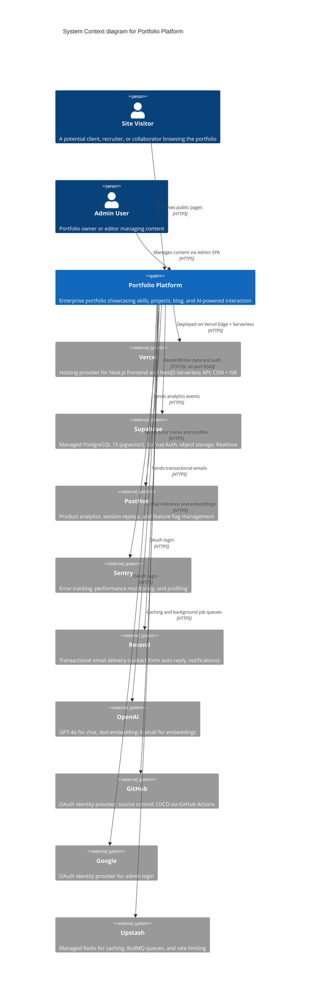
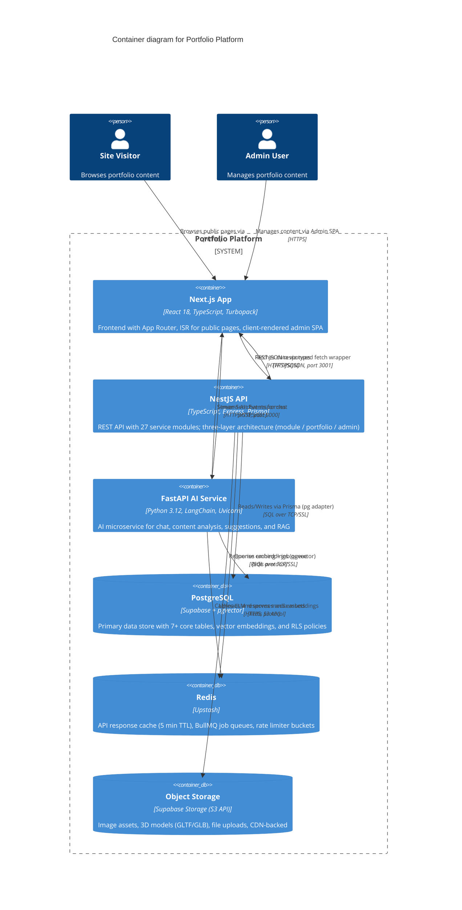
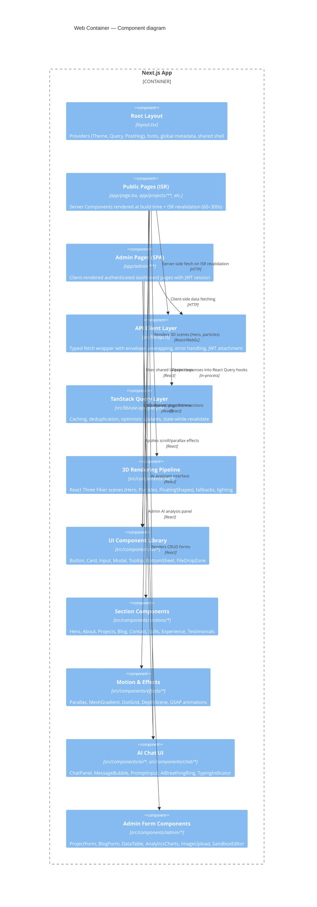
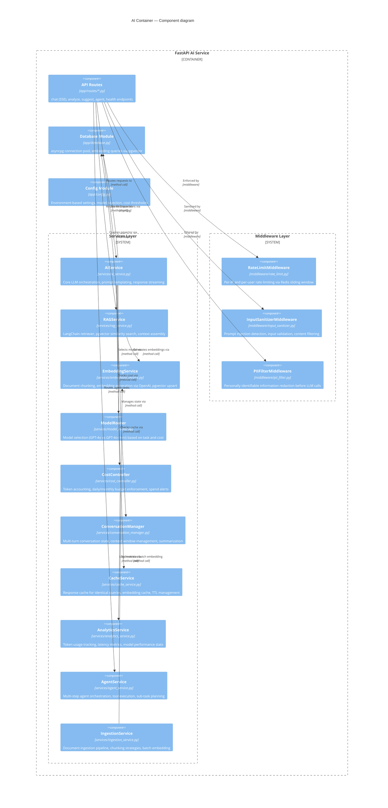
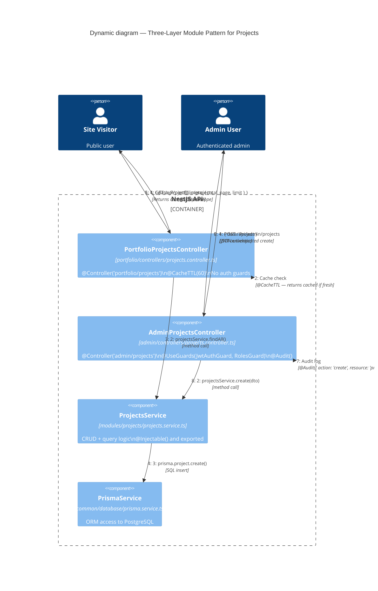
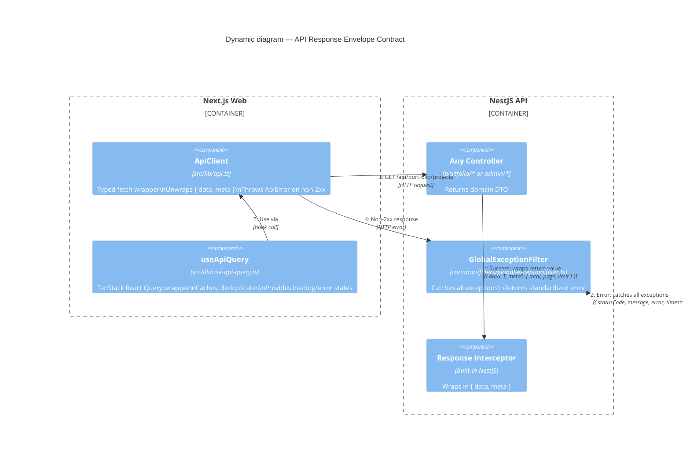
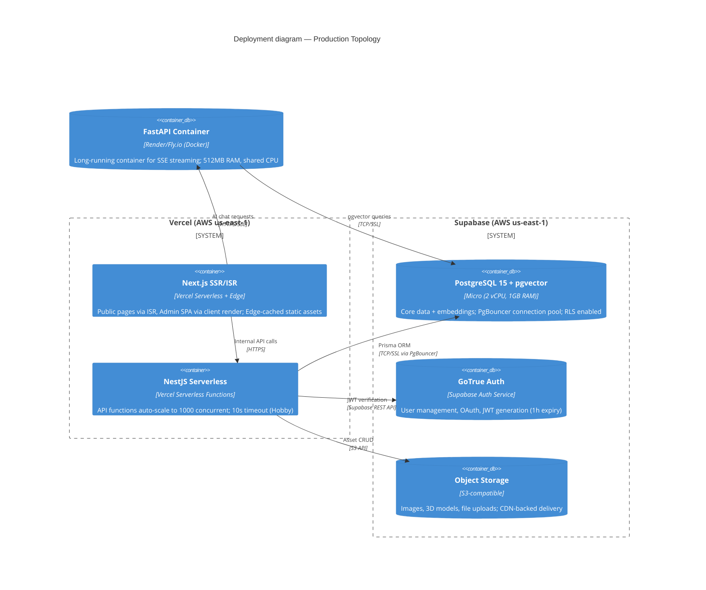
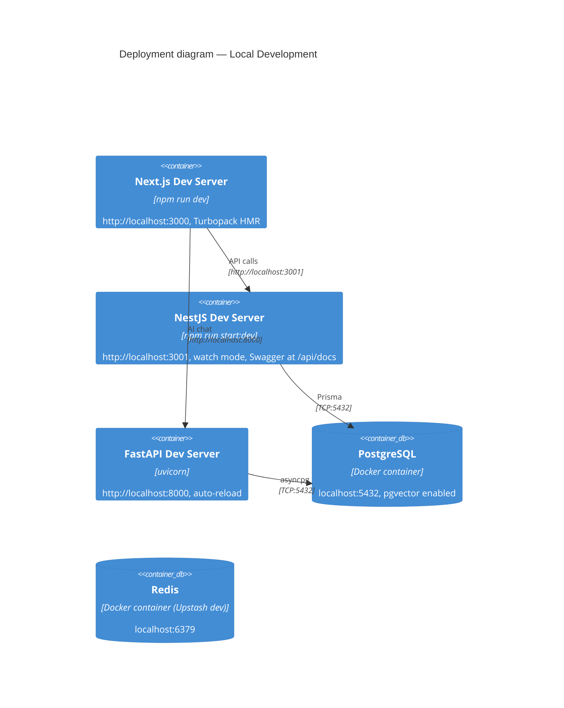

# C4 Architecture Documentation

> **Document:** `c4-architecture.md` | **Version:** 1.0 | **Last Updated:** July 2026
> **Modeling Standard:** C4 (Context, Container, Component, Code) via Mermaid.js
> **Related:** [SystemArchitecture.md](./SystemArchitecture.md) | [ServiceArchitecture.md](./ServiceArchitecture.md) | [DomainArchitecture.md](./DomainArchitecture.md) | [IntegrationArchitecture.md](./IntegrationArchitecture.md) | [54-INFRASTRUCTURE.md](../operations/54-INFRASTRUCTURE.md)

---

## Level 1: System Context

The System Context diagram shows the Portfolio Platform as a black box and its interactions with external users and systems. This is the highest-level view, establishing boundaries and dependencies.



### External System Details

| System | Purpose | Integration Point | Free Tier Limit |
|--------|---------|------------------|-----------------|
| **Vercel** | Edge CDN, ISR caching, serverless compute for web + API | DNS, Deployment via `vercel deploy` | 100 GB bandwidth, 10s timeout |
| **Supabase** | PostgreSQL 15 + pgvector, Auth (GoTrue), Storage (S3-compatible), Realtime | `DATABASE_URL` connection via PgBouncer, REST API | 500 MB DB, 1 GB storage |
| **Upstash** | Redis caching (`CacheService`), BullMQ queues (email, background jobs) | Redis REST + SDK | 10K requests/day |
| **OpenAI** | GPT-4o for AI chat, `text-embedding-3-small` for pgvector embeddings | `apps/ai` FastAPI service via SDK | Pay-as-you-go (~$2–5/mo) |
| **PostHog** | Web analytics, feature flags, session replays | PostHog JS SDK on frontend | 1M events/month |
| **Sentry** | Error tracking, performance traces, profiling | `@sentry/node` in NestJS, `@sentry/nextjs` on web | 5K events/month |
| **Resend** | Contact form emails, admin notifications | NestJS `MailModule` via REST API | 3K emails/month |

---

## Level 2: Container Diagram

The Container diagram zooms into the Portfolio Platform, revealing the three main applications (Web, API, AI) and their data stores. Each container is a separately deployable unit.



### Container Communication Summary

| From | To | Protocol | Port | Purpose |
|------|----|----------|------|---------|
| Browser | Next.js | HTTPS | 443/3000 | Page requests, static assets |
| Next.js | NestJS | HTTPS/JSON | 3001 | Data fetching (typed `ApiClient`) |
| Next.js | FastAPI | HTTPS/SSE | 8000 | AI chat streaming |
| NestJS | PostgreSQL | SQL/SSL | 5432/6543 | Prisma ORM operations |
| NestJS | Redis | RESP/HTTPS | — | Cache + queues (Upstash) |
| NestJS | Supabase Storage | HTTPS | — | Image uploads, asset management |
| FastAPI | PostgreSQL | SQL/SSL | 5432/6543 | pgvector embedding queries |
| FastAPI | OpenAI | HTTPS | — | LLM inference, embeddings |

---

## Level 3: Component Diagrams

### Web Container Components

The Next.js application follows the App Router convention with React Server Components for public pages (ISR-cached) and client components for interactive/admin areas. Data fetching is centralized through a typed API client backed by TanStack React Query.



### API Container Components

The NestJS API follows a strict three-layer pattern. Business logic lives in `src/modules/` (27 services), public read-only delivery in `src/portfolio/controllers/` (18 controllers), and authenticated CRUD in `src/admin/controllers/` (29 controllers). Cross-cutting concerns are centralized in `src/common/`.

```mermaid
C4Component
  title API Container — Component diagram

  Container_Boundary(api, "NestJS API") {
    Component(bootstrap, "Bootstrap / AppModule", "src/main.ts", "Global pipes (ValidationPipe with whitelist+transform), filters (GlobalExceptionFilter), middleware (Helmet, CORS, compression, API versioning), Swagger docs")

    System_Boundary(modules, "Business Logic Layer — src/modules/") {
      Component(module_projects, "ProjectsModule", "projects.service.ts", "CRUD for portfolio projects, 3D asset references, Markdown content")
      Component(module_blog, "BlogModule", "blog.service.ts", "Blog post management, tags, pagination")
      Component(module_experiences, "ExperiencesModule", "experiences.service.ts", "Work history and timeline entries")
      Component(module_skills, "SkillsModule", "skills.service.ts", "Technical/soft skill taxonomy, link to projects")
      Component(module_auth, "AuthModule", "auth.service.ts", "JWT issue/verify, Passport OAuth strategies (Google, GitHub), role management")
      Component(module_leads, "LeadsModule", "leads.service.ts", "Contact form submissions, auto-reply, CSV export")
      Component(module_chat, "ChatModule", "chat.service.ts", "AI chat session management, message history, cost tracking")
      Component(module_analytics, "AnalyticsModule", "analytics.service.ts", "Page views, event tracking, dashboard aggregation")
      Component(other_modules, "Other Modules (15 more)", "services, sections, faqs, testimonials, case-studies, ...", "Remaining domain services following the same pattern")
    }

    System_Boundary(portfolio_ctrl, "Portfolio Layer — src/portfolio/controllers/") {
      Component(port_projects, "ProjectsController", "portfolio/controllers/projects.controller.ts", "Public GET /api/portfolio/projects, cached with @CacheTTL")
      Component(port_blog, "BlogController", "portfolio/controllers/blog.controller.ts", "Public GET /api/portfolio/blog, cached")
      Component(port_skills, "SkillsController", "portfolio/controllers/skills.controller.ts", "Public GET /api/portfolio/skills, cached")
      Component(port_other, "Other Controllers (15 more)", "portfolio/controllers/*.controller.ts", "Public read-only endpoints, no auth, response-cached")
    }

    System_Boundary(admin_ctrl, "Admin Layer — src/admin/controllers/") {
      Component(admin_projects, "ProjectsController", "admin/controllers/projects.controller.ts", "CRUD @Controller('admin/projects'), @UseGuards(JwtAuthGuard, RolesGuard), @Audit()")
      Component(admin_users, "UsersController", "admin/controllers/users.controller.ts", "User management, role assignment")
      Component(admin_auth, "AuthController", "admin/controllers/auth.controller.ts", "Login, OAuth callback, token refresh")
      Component(admin_export, "ExportController", "admin/controllers/export.controller.ts", "CSV export for leads, analytics data")
      Component(admin_sandbox, "SandboxController", "admin/controllers/sandbox.controller.ts", "WebContainer sandbox management, GitHub commit/deploy")
      Component(admin_other, "Other Controllers (24 more)", "admin/controllers/*.controller.ts", "Admin CRUD for all entities, guarded + audited")
    }

    System_Boundary(common, "Cross-Cutting — src/common/") {
      Component(prisma, "PrismaService", "src/common/database/prisma.service.ts", "Global DatabaseModule, PrismaClient over pg.Pool with pg adapter")
      Component(cache_service, "CacheService", "src/common/cache/cache.service.ts", "Redis-backed response cache, decorator-based TTL")
      Component(queue, "QueueModule", "src/common/queue/*", "BullMQ job processing (email dispatch, background tasks)")
      Component(audit, "AuditDecorator", "src/common/decorators/audit.decorator.ts", "@Audit({action, resource}) for admin mutation tracking")
      Component(filters, "GlobalExceptionFilter", "src/common/filters/global-exception.filter.ts", "Standardized error envelope, Sentry integration")
      Component(export_csv, "CsvService", "src/common/export/csv.service.ts", "Streaming CSV generation for data export")
      Component(notifications, "NotificationModule", "src/common/notifications/*", "Email adapter (Resend), in-app notification templates")
      Component(cleanup, "CleanupService", "src/common/cleanup/cleanup.service.ts", "Scheduled data cleanup, old session purging, storage optimization")
    }
  }

  Rel(port_projects, module_projects, "Delegates to", "method call")
  Rel(port_blog, module_blog, "Delegates to", "method call")
  Rel(port_skills, module_skills, "Delegates to", "method call")
  Rel(admin_projects, module_projects, "Delegates to", "method call")
  Rel(admin_users, module_auth, "Delegates to", "method call")
  Rel(admin_auth, module_auth, "Delegates to", "method call")
  Rel(module_projects, prisma, "Reads/Writes via", "Prisma Client")
  Rel(module_blog, prisma, "Reads/Writes via", "Prisma Client")
  Rel(module_projects, cache_service, "Caches via", "decorator")
  Rel(module_leads, queue, "Enqueues email jobs", "BullMQ")
  Rel(admin_users, audit, "Annotated with", "decorator")
  Rel(admin_projects, audit, "Annotated with", "decorator")

  UpdateLayoutConfig($c4ShapeInRow="3", $c4BoundaryInRow="2")
```



### API Module Inventory

All 27 modules in `apps/api/src/modules/`:

| Module | Service File | Domain |
|--------|-------------|--------|
| `auth` | `auth.service.ts` | JWT, Passport OAuth, role management |
| `users` | `users.service.ts` | Admin user CRUD |
| `projects` | `projects.service.ts` | Portfolio projects |
| `blog` | `blog.service.ts` | Blog posts |
| `experiences` | `experiences.service.ts` | Work history |
| `skills` | `skills.service.ts` | Skill taxonomy |
| `services` | `services.service.ts` | Offerings |
| `sections` | `sections.service.ts` | Page sections |
| `leads` | `leads.service.ts` | Contact form leads |
| `testimonials` | `testimonials.service.ts` | Client testimonials |
| `faqs` | `faqs.service.ts` | FAQ entries |
| `case-studies` | `case-studies.service.ts` | Case studies |
| `achievements` | `achievements.service.ts` | Awards and achievements |
| `press-features` | `press-features.service.ts` | Press mentions |
| `guest-appearances` | `guest-appearances.service.ts` | Podcasts, talks |
| `reading-list-items` | `reading-list-items.service.ts` | Book/article recommendations |
| `chat` | `chat.service.ts` | AI chat sessions |
| `analytics` | `analytics.service.ts` | Event tracking, dashboards |
| `availability-status` | `availability-status.service.ts` | Work availability |
| `feature-flags` | `feature-flags.service.ts` | Feature toggles |
| `media` | `media.service.ts` | Asset management |
| `notifications` | `notifications.service.ts` | Notification dispatch |
| `system-settings` | `system-settings.service.ts` | Global config |
| `api-keys` | `api-keys.service.ts` | API key management |
| `activities` | `activities.service.ts` | Audit log |
| `sandbox` | `github.service.ts` | WebContainer sandbox GitHub integration |
| `cleanup` | `cleanup.service.ts` | Data retention, storage cleanup |

### AI Container Components

The FastAPI AI service handles LLM operations — chat streaming, content analysis, suggestions, and RAG. It routes requests to OpenAI models, manages conversation state, and controls costs.



### AI Routes

| Route | Method | Endpoint | Purpose |
|-------|--------|----------|---------|
| `chat.py` | `POST` | `/api/ai/chat` | SSE-streamed chat with RAG context |
| `analyze.py` | `POST` | `/api/ai/analyze` | Content analysis and scoring |
| `suggest.py` | `POST` | `/api/ai/suggest` | Content generation suggestions |
| `agent.py` | `POST` | `/api/ai/agent` | Multi-step agent execution |
| `health.py` | `GET` | `/health` | Liveness check |

---

## Level 4: Code Diagrams

### Three-Layer Module Pattern

This is the most important architectural pattern in the API. A single domain entity (e.g., Projects) flows through three layers: the module (business logic), portfolio controller (public read-only), and admin controller (authenticated CRUD). The service is written once; two controller layers expose different surfaces of it.



#### File Structure per Entity

```
src/
├── modules/
│   └── projects/
│       ├── projects.module.ts        # NestJS module, exports ProjectsService
│       ├── projects.service.ts       # Business logic (CRUD, queries)
│       └── dto/
│           ├── create-project.dto.ts # Validation schema (class-validator)
│           └── update-project.dto.ts
├── portfolio/
│   └── controllers/
│       └── projects.controller.ts    # Public GET endpoints, @CacheTTL, no auth
├── admin/
│   └── controllers/
│       └── projects.controller.ts    # Auth-guarded CRUD, @Audit decorators
```

This pattern is repeated for all 27 domain modules. The `PortfolioModule` and `AdminModule` both import the same `ProjectsModule`, so the service is shared while the controllers are separated.

### API Response Envelope

Every API response follows a standardized `{ data, meta }` envelope, enforced by interceptors and the typed frontend client.



#### Success Response Shape

```typescript
// Single resource
{
  "data": { "id": "abc", "title": "My Project", ... }
}

// Collection with pagination
{
  "data": [{ "id": "abc", ... }, { "id": "def", ... }],
  "meta": {
    "total": 42,
    "page": 1,
    "limit": 10,
    "totalPages": 5
  }
}

// Void/success mutation
{
  "data": { "success": true, "message": "Project deleted" }
}
```

#### Error Response Shape

```typescript
{
  "statusCode": 400,
  "message": "Validation failed",
  "error": "Bad Request",
  "timestamp": "2026-07-10T12:00:00.000Z",
  "path": "/api/admin/projects"
}
```

---

## Deployment View

The following diagram shows how the containers map to infrastructure at each environment tier.



### Local Development Topology



Start all services from repo root with:

```bash
# All three apps + dependencies via Turborepo
npm run dev

# Or individually
npm run dev:web    # Next.js on :3000
npm run dev:api    # NestJS on :3001
npm run dev:ai     # FastAPI on :8000
```

---

## Technology Stack Reference

### Web (`apps/web`)

| Layer | Technology | Purpose |
|-------|-----------|---------|
| Framework | Next.js 14 (App Router) | SSR, ISR, file-based routing |
| Language | TypeScript 5 | Type safety across the stack |
| Styling | Tailwind CSS + shadcn/ui | Utility-first CSS, Radix primitives |
| 3D/Motion | Three.js, R3F, GSAP, Theatre.js, Lenis | 3D scenes, animations, parallax |
| Data Fetching | TanStack React Query v5 | Caching, deduplication, stale management |
| API Client | Custom `src/lib/api.ts` | Typed fetch with envelope unwrapping |
| Bundling | Turbopack (dev), webpack (build) | Fast refresh, optimized production builds |

### API (`apps/api`)

| Layer | Technology | Purpose |
|-------|-----------|---------|
| Framework | NestJS 10 (Express) | Modular backend, decorator-driven |
| Language | TypeScript 5 | Shared types with frontend |
| ORM | Prisma 6 + `@prisma/adapter-pg` | Type-safe database access |
| Database | PostgreSQL 15 + pgvector | Primary store + vector search |
| Cache | Upstash Redis | Response cache, BullMQ queues |
| Auth | Passport.js (JWT, OAuth) | Google/GitHub OAuth, role-based guards |
| API Docs | Swagger (`@nestjs/swagger`) | Auto-generated OpenAPI at `/api/docs` |
| Validation | `class-validator` + `class-transformer` | DTO validation with whitelist/transform |
| Logging | Pino | Structured JSON logging |
| Error Tracking | Sentry (`@sentry/node`) | Error capture, performance tracing |

### AI (`apps/ai`)

| Layer | Technology | Purpose |
|-------|-----------|---------|
| Framework | FastAPI (Python 3.12) | Async Python, auto-generated OpenAPI |
| LLM SDK | OpenAI Python SDK | GPT-4o chat, text-embedding-3-small |
| Orchestration | LangChain | RAG pipeline, prompt templates |
| Database | asyncpg | Direct pgvector queries |
| Streaming | Server-Sent Events (SSE) | Real-time chat responses |

### Infrastructure

| Component | Provider | Tier | Cost |
|-----------|----------|------|------|
| Frontend + API Compute | Vercel | Hobby | $0 |
| Database + Auth + Storage | Supabase | Free | $0 |
| AI Container | Render / Fly.io | Free | $0 |
| Redis | Upstash | Free | $0 |
| Email | Resend | Free | $0 |
| Analytics | PostHog | Free | $0 |
| Error Tracking | Sentry | Free | $0 |
| AI Inference | OpenAI | Pay-as-you-go | ~$2–5/mo |

---

## Key Architectural Principles

1. **Three-layer separation** — Business logic (`src/modules/`) is independent of HTTP delivery. Portfolio controllers (public, cached) and Admin controllers (authenticated, audited) are separate surfaces over the same services.

2. **Shared types as contract** — `packages/shared` is the single source of truth for Zod schemas and TypeScript interfaces. Both web and api import from `@portfolio/shared`, ensuring compile-time contract enforcement.

3. **Edge-first delivery** — Public pages use ISR (60s–300s revalidation) for sub-100ms global load times. Admin pages are client-rendered SPA for interactive CRUD.

4. **Multi-LLM AI tier** — A dedicated FastAPI service (not serverless functions) handles long-lived LLM connections, RAG via pgvector, cost control, and PII filtering, keeping the NestJS API focused on business logic.

5. **Cost-optimized by design** — Every service runs on a free tier with documented upgrade paths. Monthly operating cost target is $0–$5 (primarily OpenAI token usage).

---

## File References

| Diagram | Relevant Source Files |
|---------|----------------------|
| System Context | `docs/architecture/IntegrationArchitecture.md`, `docs/operations/54-INFRASTRUCTURE.md`, `apps/api/src/main.ts` |
| Container | `infrastructure/docker/docker-compose.yml`, `turbo.json`, `apps/web/next.config.js` |
| Web Components | `apps/web/src/app/**/page.tsx`, `apps/web/src/components/**/*.tsx`, `apps/web/src/lib/api.ts` |
| API Components | `apps/api/src/modules/*/*.service.ts`, `apps/api/src/portfolio/controllers/*.ts`, `apps/api/src/admin/controllers/*.ts`, `apps/api/src/common/**/*.ts` |
| AI Components | `apps/ai/app/routes/*.py`, `apps/ai/app/services/*.py`, `apps/ai/app/middleware/*.py` |
| Three-Layer Pattern | `docs/architecture/ServiceArchitecture.md`, `docs/architecture/DomainArchitecture.md` |
| Deployment | `docs/operations/54-INFRASTRUCTURE.md`, `infrastructure/docker/docker-compose.yml` |
