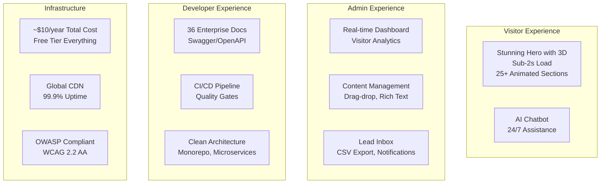
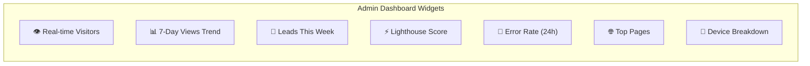

# Product Requirements Document (PRD)

> **Document:** `ProductRequirements.md` | **Version:** 4.0 (Enterprise AI Upgrade) | **Last Updated:** July 2026  
> **Status:** ✅ Approved | **Owner:** Product Owner  
> **Repository:** [My Portfolio Monorepo](https://github.com/your-org/my-portfolio)

---

## Table of Contents

1. [Executive Summary](#1-executive-summary)
2. [Repository Audit](#2-repository-audit)
3. [Gap Analysis](#3-gap-analysis)
4. [Portfolio Vision](#4-portfolio-vision)
5. [Problem Statement](#5-problem-statement)
6. [Vision & Mission](#6-vision--mission)
7. [Target Audience](#7-target-audience)
8. [User Personas](#8-user-personas)
9. [Business Goals](#9-business-goals)
10. [Success Metrics](#10-success-metrics)
11. [Functional Requirements](#11-functional-requirements)
12. [Non-Functional Requirements](#12-non-functional-requirements)
13. [Accessibility Requirements](#13-accessibility-requirements)
14. [SEO Requirements](#14-seo-requirements)
15. [Performance Requirements](#15-performance-requirements)
16. [Security Requirements](#16-security-requirements)
17. [Analytics Requirements](#17-analytics-requirements)
18. [AI Requirements](#18-ai-requirements)
19. [Admin Dashboard Requirements](#19-admin-dashboard-requirements)
20. [Future Roadmap](#20-future-roadmap)
21. [Risks](#21-risks)
22. [Assumptions](#22-assumptions)
23. [Out of Scope](#23-out-of-scope)
24. [Acceptance Criteria](#24-acceptance-criteria)
25. [Stakeholder Matrix](#25-stakeholder-matrix)
26. [Phase Overview](#26-phase-overview)
27. [Approval Matrix](#27-approval-matrix)

---

## 1. Executive Summary

**My Portfolio** is a world-class, FAANG-level production-ready personal portfolio platform featuring 25+ customizable sections, an admin content management system, visitor analytics, lead capture, and advanced multi-LLM AI-powered features. Built on a zero-cost infrastructure model (~$10/year for domain only), it demonstrates enterprise-grade architecture using free and open-source technologies including Next.js 14, NestJS 10, FastAPI, Supabase (PostgreSQL), and Turborepo.

The platform serves four distinct user groups:

- **Visitors** (recruiters, clients) seeking to evaluate skills and experience
- **Administrators** (the portfolio owner) managing content and leads
- **Developers** contributing to the open-source codebase
- **AI Agents** interacting with the system via the RAG pipeline

The architecture follows a microservices pattern with three services (web frontend, API backend, AI microservice) organized in an enterprise monorepo structure. The system targets Lighthouse scores ≥ 95, WCAG 2.2 AA compliance, OWASP Top 10:2025 security compliance, and global sub-2-second load times.

### Current State Summary

| Metric                 | Status         | Details                                        |
| ---------------------- | -------------- | ---------------------------------------------- |
| **Monorepo Structure** | ✅ Complete    | `apps/`, `packages/`, `infrastructure/` layout |
| **Infrastructure**     | ✅ Complete    | Turborepo, npm workspaces, Docker, CI/CD       |
| **Documentation**      | ✅ Complete    | 36 enterprise-grade documents                  |
| **Design System**      | 🔄 In Progress | Tokens defined, base components done           |
| **Application Code**   | 📋 Planned     | Placeholder files awaiting implementation      |
| **Testing**            | 📋 Planned     | Framework configured, no tests yet             |

---

## 2. Repository Audit

### 2.1 Project Structure Audit

| Directory          | Status        | Contents                                              |
| ------------------ | ------------- | ----------------------------------------------------- |
| `apps/web/`        | ✅ Scaffolded | Next.js 14 app router, config, package.json           |
| `apps/api/`        | ✅ Scaffolded | NestJS modules scaffolded, config                     |
| `apps/ai/`         | ✅ Scaffolded | FastAPI structure, requirements                       |
| `packages/shared/` | ✅ Complete   | TypeScript interfaces (Section, Project, Skill, Lead) |
| `packages/ui/`     | ✅ Complete   | Button, Card, Input components with `cn` utility      |
| `packages/config/` | ✅ Complete   | ESLint preset, base tsconfig                          |
| `infrastructure/`  | ✅ Complete   | Docker Compose, CI/CD reference                       |
| `docs/`            | ✅ Complete   | 36 enterprise-grade documents                         |
| `.github/`         | ✅ Complete   | CI/CD pipeline with quality checks                    |

### 2.2 Code Implementation Audit

| Module                 | Implementation Status | Files Present                                | Code Status             |
| ---------------------- | --------------------- | -------------------------------------------- | ----------------------- |
| **Web App Pages**      | 🟡 Placeholder        | `layout.tsx`, `page.tsx`                     | Prose descriptions only |
| **Section Components** | 🟡 Placeholder        | Hero, About, Skills, Projects, Contact       | Prose descriptions only |
| **Auth Module**        | 🟡 Placeholder        | controller, service, module, guard, strategy | Prose descriptions only |
| **Sections Module**    | 🟡 Placeholder        | controller, service, module                  | Prose descriptions only |
| **Projects Module**    | 🟡 Placeholder        | controller, service, module                  | Prose descriptions only |
| **Skills Module**      | 🟡 Placeholder        | controller, service, module                  | Prose descriptions only |
| **Leads Module**       | 🟡 Placeholder        | controller, service, module                  | Prose descriptions only |
| **Analytics Module**   | 🟡 Placeholder        | controller, service, module                  | Prose descriptions only |
| **AI Service**         | 🟡 Placeholder        | chat.py, analyze.py, ai_service.py           | Prose descriptions only |
| **Admin Dashboard**    | ❌ Missing            | No admin pages yet                           | Not started             |

### 2.3 Configuration Audit

| Configuration         | Status        | Details                                           |
| --------------------- | ------------- | ------------------------------------------------- |
| TypeScript            | ✅ Complete   | Strict mode, path mappings for `@portfolio/*`     |
| ESLint                | ✅ Complete   | Extension of shared preset + next/core-web-vitals |
| Prettier              | ✅ Complete   | `.prettierrc` with project standards              |
| Tailwind CSS          | ✅ Scaffolded | Config exists, tokens to be applied               |
| Turborepo             | ✅ Complete   | Tasks defined with caching                        |
| Docker Compose        | ✅ Complete   | All services configured                           |
| Environment Variables | ✅ Template   | `config/.env.example` with all vars               |

---

## 3. Gap Analysis

### 3.1 Critical Gaps (Must Fix Before Launch)

| #   | Gap                                       | Impact                        | Resolution                                | Owner     | Timeline    |
| --- | ----------------------------------------- | ----------------------------- | ----------------------------------------- | --------- | ----------- |
| G1  | No actual React component implementations | Cannot render portfolio       | Implement all section components          | Frontend  | Phase 03-04 |
| G2  | No NestJS module implementations          | No API functionality          | Implement all controllers/services        | Backend   | Phase 03-04 |
| G3  | No Supabase database connection           | No data persistence           | Configure Supabase client, run migrations | Backend   | Phase 01    |
| G4  | No admin dashboard pages                  | No CMS for content management | Build admin routes and components         | Fullstack | Phase 08    |
| G5  | No authentication working                 | No admin login                | Implement NextAuth.js + NestJS JWT        | Fullstack | Phase 08    |
| G6  | No actual AI service implementation       | No chatbot/content analysis   | Implement FastAPI endpoints               | AI        | Phase 07    |

### 3.2 Important Gaps (Should Fix Within 1 Month of Launch)

| #   | Gap                          | Impact                        | Resolution                             | Timeline |
| --- | ---------------------------- | ----------------------------- | -------------------------------------- | -------- |
| G7  | No unit or integration tests | Regression risk               | Add Jest + React Testing Library tests | Phase 09 |
| G8  | No PostHog integration       | No analytics tracking         | Configure PostHog SDK                  | Phase 09 |
| G9  | No Sentry integration        | Uncaught errors in production | Configure Sentry SDK                   | Phase 09 |
| G10 | No deployment configuration  | Cannot deploy to Vercel       | Configure Vercel project               | Phase 01 |
| G11 | No database migrations       | Schema cannot be applied      | Create migration scripts               | Phase 01 |

### 3.3 Enhancement Gaps (Nice to Have)

| #   | Gap                              | Impact                   | Resolution                 | Timeline |
| --- | -------------------------------- | ------------------------ | -------------------------- | -------- |
| G12 | No E2E tests                     | Manual testing required  | Add Playwright E2E         | Phase 10 |
| G13 | No CI/CD for AI service          | Manual deployment        | Add Railway/GitHub Actions | Phase 09 |
| G14 | No performance budget CI         | Performance regression   | Add Lighthouse CI          | Phase 10 |
| G15 | No visual regression tests       | UI drift                 | Add Percy/Chromatic        | Phase 10 |
| G16 | No automated accessibility audit | Accessibility regression | Add axe-core CI            | Phase 10 |

---

## 4. Portfolio Vision

### 4.1 North Star — 2027

The portfolio will be a reference-grade open-source project that demonstrates:

- **Technical excellence**: Best practices in React, NestJS, FastAPI, DevOps (FAANG standard)
- **Design distinction**: A recognizable, non-generic visual identity
- **Zero-cost infrastructure**: Proof that enterprise quality doesn't require enterprise budget
- **Multi-LLM AI integration**: Intelligent visitor assistance, semantic search, intent prediction across OpenAI, Anthropic, and open-source models
- **Community adoption**: Forked and customized by 100+ developers

**North Star Metric (NSM):** _Qualified Professional Connections Generated_
This metric tracks the ultimate value delivered by the portfolio—when a visitor transitions from merely browsing to a meaningful professional connection (e.g., submitting a high-intent inquiry, scheduling a meeting, or initiating a verified recruiting conversation). It aligns with the core purpose of a portfolio: not just to exist, but to drive real-world professional outcomes.

### 4.2 Final Product Description



### 4.3 Key Differentiators

| Differentiator       | How We Achieve It                                                      |
| -------------------- | ---------------------------------------------------------------------- |
| **Not a template**   | Custom design system, 8 style presets per section, personality-infused |
| **Truly zero-cost**  | Vercel + Supabase + PostHog + Sentry free tiers cover everything       |
| **AI-native**        | Chatbot, RAG, content generation, behavior prediction built-in         |
| **Admin that works** | Intuitive CMS, no-code content updates, one-click publishing           |
| **Enterprise docs**  | 36-document framework covering every aspect of the system              |

---

## 5. Problem Statement

### 5.1 The Problem

Professionals need a portfolio that effectively showcases their work, attracts opportunities, and maintains itself — but current solutions are inadequate:

| Problem                                       | Consequence                                           |
| --------------------------------------------- | ----------------------------------------------------- |
| Template portfolios look generic              | Candidates blend in, fail to stand out                |
| Custom portfolios require ongoing maintenance | Content becomes stale, time is wasted on updates      |
| Lead capture is an afterthought               | Missed opportunities, no follow-up system             |
| Analytics are bolt-on or absent               | No insight into what visitors care about              |
| Portfolio platforms charge recurring fees     | $10-50/month for basic features                       |
| Performance is inconsistent                   | Slow load times lose visitors before they see content |

### 5.2 Target Market Size

| Segment                  | Size          | Pain Point                          | Willingness to Pay |
| ------------------------ | ------------- | ----------------------------------- | ------------------ |
| Software developers      | 30M+ globally | Technical showcase, credibility     | $0-10/yr           |
| Designers                | 15M+ globally | Visual portfolio, client attraction | $0-20/yr           |
| Writers/Content creators | 50M+ globally | Content organization, reach         | $0-10/yr           |
| Freelancers              | 60M+ globally | Lead generation, trust building     | $0-15/yr           |

### 5.3 Competitive Landscape

| Competitor       | Strength                     | Weakness                           | Our Advantage            |
| ---------------- | ---------------------------- | ---------------------------------- | ------------------------ |
| **Squarespace**  | Beautiful templates, easy    | $23/mo, limited customization      | Free, full control       |
| **Wix**          | Drag-drop builder, features  | Ads on free plan, slow             | Clean, fast, ad-free     |
| **WordPress**    | Highly customizable, plugins | Security maintenance, hosting cost | Zero maintenance         |
| **GitHub Pages** | Free, version controlled     | Static only, no backend            | Full-stack, dynamic      |
| **LinkedIn**     | Built-in audience            | Limited customization, branded     | Full control, own domain |
| **Custom build** | Complete control             | Expensive, time-consuming          | Open source, free        |

---

## 6. Vision & Mission

### 6.1 Vision Statement

> **A world where every professional can present their best work with enterprise-grade quality — for free.**

We believe that personal branding should not be gated by budget. By combining modern open-source technologies with thoughtful design and AI, we enable anyone to build a portfolio that competes with the best in the world.

### 6.2 Mission Statement

> **To build, maintain, and evolve a reference-grade open-source portfolio platform that sets the standard for personal websites — demonstrating that enterprise quality and zero cost are not mutually exclusive.**

### 6.3 Core Values

| Value                            | How We Live It                                        |
| -------------------------------- | ----------------------------------------------------- |
| **Excellence without expense**   | Free tiers, open source, ~$10/yr domain only          |
| **Design with purpose**          | Every pixel, animation, and interaction serves a goal |
| **Accessibility is fundamental** | WCAG 2.2 AA is not optional — it's baseline           |
| **AI augments, not replaces**    | AI assists visitors and admins, never controls        |
| **Documentation is code**        | Docs are maintained with the same rigor as source     |
| **Open by default**              | Public repo, permissive license, community welcome    |

---

## 7. Target Audience

### 7.1 Primary Audiences

| Segment                     | Description                            | Size | Priority     |
| --------------------------- | -------------------------------------- | ---- | ------------ |
| **Technical Professionals** | Software engineers, architects, DevOps | 30M+ | 🥇 Primary   |
| **Design Professionals**    | UI/UX designers, product designers     | 15M+ | 🥇 Primary   |
| **Creative Professionals**  | Writers, content creators, marketers   | 50M+ | 🥈 Secondary |

### 7.2 Geographic Focus

| Region        | % Target | Strategy                                       |
| ------------- | -------- | ---------------------------------------------- |
| North America | 40%      | English-first, CDN optimized                   |
| Europe        | 30%      | GDPR compliant, multi-language (future)        |
| Asia-Pacific  | 20%      | CDN edge nodes near Tokyo/Singapore/Sydney     |
| Rest of World | 10%      | Global CDN, lightweight for slower connections |

### 7.3 User Motivations

| Motivation             | Visitor | Admin | Developer |
| ---------------------- | ------- | ----- | --------- |
| **Evaluate skills**    | ✅      | ❌    | ❌        |
| **Find contact info**  | ✅      | ❌    | ❌        |
| **Showcase work**      | ❌      | ✅    | ❌        |
| **Manage content**     | ❌      | ✅    | ❌        |
| **Capture leads**      | ❌      | ✅    | ❌        |
| **Learn architecture** | ❌      | ❌    | ✅        |
| **Contribute code**    | ❌      | ❌    | ✅        |
| **Customize for self** | ❌      | ❌    | ✅        |

---

## 8. User Personas

### 8.1 Persona: Sarah Chen — The Recruiter

| Attribute          | Detail                                                              |
| ------------------ | ------------------------------------------------------------------- |
| **Age**            | 34                                                                  |
| **Role**           | Senior Technical Recruiter, FAANG company                           |
| **Experience**     | 8 years in tech recruiting                                          |
| **Devices**        | MacBook Pro 16" (work), iPhone 15 (mobile)                          |
| **Browser**        | Chrome (primary), Safari (secondary)                                |
| **Connection**     | Office: fiber (500Mbps), Mobile: 5G                                 |
| **Time per visit** | 30-60 seconds                                                       |
| **Goal**           | Quickly assess if candidate is worth interviewing                   |
| **Pain points**    | Slow portfolios, no GitHub links, hard-to-find skills, no clear CTA |
| **Behavior**       | Scans hero → skills → projects → GitHub → contact                   |
| **Needs**          | Fast load (<1s), prominent skills, GitHub links, easy contact       |

### 8.2 Persona: Marcus Johnson — The Client

| Attribute          | Detail                                                                                              |
| ------------------ | --------------------------------------------------------------------------------------------------- |
| **Age**            | 42                                                                                                  |
| **Role**           | CTO, Series B startup                                                                               |
| **Experience**     | 18 years in tech, now hiring for his team                                                           |
| **Devices**        | iPad Pro 12.9" (primary), Samsung Galaxy S24                                                        |
| **Browser**        | Safari                                                                                              |
| **Connection**     | Variable (WiFi, 4G, coworking spaces)                                                               |
| **Time per visit** | 2-5 minutes                                                                                         |
| **Goal**           | Find a developer for contract or full-time role                                                     |
| **Pain points**    | Portfolios with fake projects, no case studies, no testimonials, hard-to-find contact               |
| **Behavior**       | Reads about section → reviews project case studies → checks testimonials → submits detailed inquiry |
| **Needs**          | Authentic case studies, real testimonials, services page, easy contact form                         |

### 8.3 Persona: Alex Rivera — The Portfolio Owner (Admin)

| Attribute            | Detail                                                                                               |
| -------------------- | ---------------------------------------------------------------------------------------------------- |
| **Age**              | 29                                                                                                   |
| **Role**             | Full-Stack Developer / Portfolio Owner                                                               |
| **Experience**       | 7 years in software development                                                                      |
| **Devices**          | Windows desktop + Android phone                                                                      |
| **Browser**          | Chrome (primary), Edge (secondary)                                                                   |
| **Technical level**  | Expert — knows the codebase intimately                                                               |
| **Update frequency** | Weekly content updates, daily lead checks                                                            |
| **Goal**             | Showcase work, attract clients, maintain without manual coding                                       |
| **Pain points**      | Wants to update content without touching code, needs to see who's visiting and what they engage with |
| **Behaviors**        | Logs in daily → checks leads → reviews analytics → updates sections weekly                           |
| **Needs**            | Intuitive CMS, lead management, analytics dashboard, SEO tools, one-click publishing                 |

### 8.4 Persona: Jordan Kim — The Open-Source Contributor

| Attribute           | Detail                                                                            |
| ------------------- | --------------------------------------------------------------------------------- |
| **Age**             | 26                                                                                |
| **Role**            | Full-Stack Developer (contributor)                                                |
| **Experience**      | 4 years, looking to build portfolio and contribute to OSS                         |
| **Devices**         | Linux workstation, multiple monitors                                              |
| **Browser**         | Firefox (primary), Chromium                                                       |
| **Technical level** | Intermediate-Expert — comfortable with full stack                                 |
| **Goal**            | Understand the architecture, find a good first issue, submit a PR                 |
| **Pain points**     | Unclear contribution guidelines, missing documentation, complex setup process     |
| **Behavior**        | Clones repo → reads README → runs locally → finds issue → submits PR              |
| **Needs**           | Clear documentation, working dev environment, coding standards, good first issues |

### 8.5 Jobs to be Done (JTBD)

The core JTBD framework ensures we build features that address the underlying reasons users "hire" our product.

| Persona         | Job to be Done (When I... I want to... So I can...)                                                                                                                                                     |
| --------------- | ------------------------------------------------------------------------------------------------------------------------------------------------------------------------------------------------------- |
| **Recruiter**   | _When I_ evaluate a candidate's portfolio, _I want to_ quickly verify their technical stack and see production code, _So I can_ confidently advance them to the technical interview stage.              |
| **Client**      | _When I_ look for a contractor, _I want to_ see concrete case studies demonstrating business impact, _So I can_ trust they will solve my specific problem and provide ROI.                              |
| **Owner**       | _When I_ complete a new project, _I want to_ seamlessly add it to my portfolio without touching code, _So I can_ keep my professional brand up-to-date while focusing on my actual work.                |
| **Contributor** | _When I_ discover this open-source project, _I want to_ easily spin up the local environment and understand the architecture, _So I can_ contribute a feature and build my own open-source credibility. |

---

## 9. Business Goals

### 9.1 SMART Goals (Next 12 Months)

| ID   | Goal                              | Metric            | Baseline | Target      | Timeline |
| ---- | --------------------------------- | ----------------- | -------- | ----------- | -------- |
| BG1  | Achieve Lighthouse 95+            | Performance score | —        | ≥ 95        | Q3 2026  |
| BG2  | Pass all Core Web Vitals          | LCP, FID, CLS     | —        | All passing | Q3 2026  |
| BG3  | Deliver 25+ customizable sections | Section count     | 0        | 25+         | Q3 2026  |
| BG4  | Zero critical security vulns      | OWASP audit       | —        | Zero        | Q3 2026  |
| BG5  | End-to-end lead capture working   | Lead flow         | —        | Complete    | Q3 2026  |
| BG6  | Real-time analytics dashboard     | Dashboard live    | —        | Operational | Q3 2026  |
| BG7  | AI chatbot operational            | Chat responses    | —        | Working     | Q4 2026  |
| BG8  | 100 GitHub stars                  | Star count        | 0        | 100+        | Q2 2027  |
| BG9  | 10 contributors                   | Contributors      | 1        | 10+         | Q2 2027  |
| BG10 | Total cost < $15/yr               | Annual spend      | —        | < $15       | Ongoing  |

### 9.2 OKRs

#### Objective 1: Launch a Production-Ready Portfolio

| Key Result | Initial State         | Target                                               |
| ---------- | --------------------- | ---------------------------------------------------- |
| KR1.1      | No deployable app     | Live on portfolioowner.com                           |
| KR1.2      | No content management | Admin dashboard managing 25+ sections                |
| KR1.3      | No lead capture       | Contact form with auto-reply + Telegram notification |

#### Objective 2: Establish as Reference-Grade Open Source

| Key Result | Initial State    | Target                                    |
| ---------- | ---------------- | ----------------------------------------- |
| KR2.1      | Private repo     | Public repo on GitHub                     |
| KR2.2      | No documentation | 36 enterprise docs covering entire system |
| KR2.3      | No testing       | 80%+ test coverage                        |

#### Objective 3: Demonstrate AI Integration

| Key Result | Initial State      | Target                                          |
| ---------- | ------------------ | ----------------------------------------------- |
| KR3.1      | No AI features     | AI chatbot answering visitor questions          |
| KR3.2      | No personalization | Visitor intent detection and content adaptation |

---

## 10. Success Metrics

### 10.1 Key Performance Indicators

| Category          | KPI                  | Target       | Measurement Tool      | Frequency |
| ----------------- | -------------------- | ------------ | --------------------- | --------- |
| **Performance**   | Lighthouse Score     | ≥ 95         | Lighthouse CI         | Every PR  |
| **Performance**   | LCP                  | < 2.5s       | Vercel Analytics      | Daily     |
| **Performance**   | CLS                  | < 0.1        | Vercel Analytics      | Daily     |
| **Performance**   | API p95 Response     | < 200ms      | Sentry                | Daily     |
| **Engagement**    | Bounce Rate          | < 40%        | PostHog               | Weekly    |
| **Engagement**    | Avg Session Duration | > 2 min      | PostHog               | Weekly    |
| **Conversion**    | Contact Form Rate    | > 5%         | PostHog Funnels       | Weekly    |
| **Conversion**    | CTA Click Rate       | > 15%        | PostHog               | Weekly    |
| **SEO**           | Search Impressions   | 1,000+/month | Google Search Console | Monthly   |
| **SEO**           | Organic CTR          | > 5%         | Google Search Console | Monthly   |
| **Quality**       | Error Rate           | < 0.1%       | Sentry                | Daily     |
| **Quality**       | Uptime               | 99.9%        | Uptime Robot          | Monthly   |
| **Accessibility** | WCAG Violations      | 0            | axe DevTools          | Every PR  |
| **Community**     | GitHub Stars         | 100+         | GitHub                | Quarterly |
| **Cost**          | Monthly Spend        | < $1.25      | Bank statement        | Monthly   |

### 10.2 Dashboard



---

## 11. Functional Requirements

### 11.1 Requirement Traceability

Each requirement is traceable back to user stories (US-XXX) and business goals (BG-XXX). See `docs/product/03-USER-STORIES.md` for full user story details.

### 11.2 FR1: Public Frontend

| ID         | Requirement                                      | User Story     | Business Goal | Priority | Phase | Dependencies |
| ---------- | ------------------------------------------------ | -------------- | ------------- | -------- | ----- | ------------ |
| **FR1.1**  | 25+ portfolio sections with dynamic rendering    | US-001, US-002 | BG3           | P0       | 04-06 | FR3.1, FR3.3 |
| **FR1.2**  | Responsive design (mobile, tablet, desktop)      | US-002         | BG1, BG2      | P0       | 02    | —            |
| **FR1.3**  | Dark/light theme with system detection           | US-006         | —             | P1       | 02    | —            |
| **FR1.4**  | Smooth animations (Framer Motion)                | US-002         | —             | P1       | 02    | —            |
| **FR1.5**  | Contact form with client & server validation     | US-005, US-019 | BG5           | P0       | 04    | FR3.3, FR3.6 |
| **FR1.6**  | SEO optimization (metadata, sitemap, robots.txt) | —              | —             | P0       | 10    | —            |
| **FR1.7**  | Accessibility compliance (WCAG 2.2 AA)           | —              | —             | P0       | 10    | —            |
| **FR1.8**  | AI chatbot for visitor assistance                | US-033         | BG7           | P2       | 07    | FR4.1        |
| **FR1.9**  | Sticky navigation with smooth scroll             | US-003         | —             | P0       | 02    | —            |
| **FR1.10** | Project detail pages with galleries              | US-004         | BG3           | P0       | 05    | FR3.4        |
| **FR1.11** | Skill proficiency visual indicators              | US-007         | —             | P1       | 04    | FR3.5        |
| **FR1.12** | Testimonial carousel                             | US-008         | —             | P1       | 06    | FR3.6        |
| **FR1.13** | Experience timeline visualization                | US-009         | —             | P1       | 04    | —            |

### 11.3 FR2: Admin Dashboard

| ID         | Requirement                               | User Story      | Business Goal | Priority | Phase |
| ---------- | ----------------------------------------- | --------------- | ------------- | -------- | ----- |
| **FR2.1**  | Secure authentication (NextAuth.js + JWT) | US-011, US-022  | BG4           | P0       | 08    |
| **FR2.2**  | OAuth login (Google, GitHub)              | US-023          | —             | P1       | 08    |
| **FR2.3**  | Section visibility toggle                 | US-012          | BG3           | P0       | 08    |
| **FR2.4**  | Rich text content editor                  | US-013          | —             | P0       | 08    |
| **FR2.5**  | Image upload with drag-and-drop           | US-014          | —             | P0       | 08    |
| **FR2.6**  | Style preset selection per section        | US-015          | —             | P1       | 08    |
| **FR2.7**  | Section drag-and-drop reordering          | US-012          | —             | P1       | 08    |
| **FR2.8**  | Lead management (view, filter, export)    | US-016, US-017  | BG5           | P0       | 08    |
| **FR2.9**  | Analytics dashboard                       | US-027 – US-032 | BG6           | P1       | 09    |
| **FR2.10** | Auto-save drafts                          | —               | —             | P2       | 08    |
| **FR2.11** | Password reset flow                       | US-024          | —             | P1       | 08    |
| **FR2.12** | Session management                        | US-025, US-026  | BG4           | P0       | 08    |
| **FR2.13** | Profile settings                          | —               | —             | P2       | 08    |

### 11.4 FR3: Backend API

| ID        | Requirement                    | User Story | Priority | Phase |
| --------- | ------------------------------ | ---------- | -------- | ----- |
| **FR3.1** | RESTful API for content CRUD   | US-012     | P0       | 03    |
| **FR3.2** | JWT-based authentication       | US-011     | P0       | 03    |
| **FR3.3** | Lead management endpoints      | US-019     | P0       | 03    |
| **FR3.4** | Analytics data endpoints       | US-027     | P1       | 03    |
| **FR3.5** | File upload handling           | US-014     | P1       | 03    |
| **FR3.6** | Rate limiting on all endpoints | US-005     | P0       | 09    |
| **FR3.7** | Public health check endpoint   | —          | P0       | 03    |
| **FR3.8** | Swagger/OpenAPI documentation  | —          | P1       | 03    |

### 11.5 FR4: AI Service

| ID        | Requirement                               | User Story | Priority | Phase |
| --------- | ----------------------------------------- | ---------- | -------- | ----- |
| **FR4.1** | AI chatbot for visitor queries            | US-033     | P2       | 07    |
| **FR4.2** | RAG pipeline for portfolio content        | US-033     | P2       | 07    |
| **FR4.3** | Content analysis (readability, SEO score) | US-034     | P2       | 07    |
| **FR4.4** | Content suggestions generation            | US-035     | P2       | 07    |
| **FR4.5** | Image optimization                        | —          | P3       | 07    |
| **FR4.6** | Analytics insights generation             | US-036     | P3       | 09    |
| **FR4.7** | Visitor intent prediction                 | US-037     | P3       | 09    |

---

## 12. Non-Functional Requirements

### 12.1 Performance Requirements

| ID        | Requirement                     | Target  | Measurement      | Violation Action |
| --------- | ------------------------------- | ------- | ---------------- | ---------------- |
| **NFR1**  | Lighthouse Performance score    | ≥ 95    | Lighthouse CI    | Block PR merge   |
| **NFR2**  | Lighthouse Accessibility score  | ≥ 95    | Lighthouse CI    | Block PR merge   |
| **NFR3**  | Lighthouse Best Practices score | ≥ 95    | Lighthouse CI    | Block PR merge   |
| **NFR4**  | Lighthouse SEO score            | ≥ 95    | Lighthouse CI    | Block PR merge   |
| **NFR5**  | LCP — Largest Contentful Paint  | < 2.5s  | Vercel Analytics | Log warning      |
| **NFR6**  | FID — First Input Delay         | < 100ms | Vercel Analytics | Log warning      |
| **NFR7**  | CLS — Cumulative Layout Shift   | < 0.1   | Vercel Analytics | Log warning      |
| **NFR8**  | TTI — Time to Interactive       | < 3.0s  | Lighthouse       | Log warning      |
| **NFR9**  | API response time (p95)         | < 200ms | Sentry           | Log warning      |
| **NFR10** | Initial JS bundle size          | < 100KB | next build       | Log warning      |
| **NFR11** | Initial CSS bundle size         | < 20KB  | next build       | Log warning      |
| **NFR12** | CDN cache hit rate              | > 90%   | Vercel Analytics | Investigate      |

### 12.2 Availability Requirements

| ID        | Requirement                    | Target             | Measurement      |
| --------- | ------------------------------ | ------------------ | ---------------- |
| **NFR13** | Frontend uptime                | 99.9%              | Uptime Robot     |
| **NFR14** | API uptime                     | 99.9%              | Uptime Robot     |
| **NFR15** | Error rate                     | < 0.1% of requests | Sentry           |
| **NFR16** | RTO — Recovery Time Objective  | < 1 hour           | Manual           |
| **NFR17** | RPO — Recovery Point Objective | < 5 minutes        | Database backups |
| **NFR18** | Max concurrent users           | 1000               | Load testing     |

### 12.3 Scalability Requirements

| ID        | Requirement                 | Implementation                       |
| --------- | --------------------------- | ------------------------------------ |
| **NFR19** | Architecture                | Microservices (NestJS + FastAPI)     |
| **NFR20** | State management            | Stateless API, Supabase persistence  |
| **NFR21** | Caching                     | ISR with 60s revalidation            |
| **NFR22** | CDN                         | Vercel Edge Network                  |
| **NFR23** | Database connection pooling | Supabase pooler                      |
| **NFR24** | Image optimization          | Next.js Image + Sharp on server      |
| **NFR25** | Code splitting              | Dynamic imports for heavy components |

### 12.4 Maintainability Requirements

| ID        | Requirement            | Implementation                      |
| --------- | ---------------------- | ----------------------------------- |
| **NFR26** | TypeScript strict mode | All projects                        |
| **NFR27** | ESLint                 | All TypeScript/JavaScript           |
| **NFR28** | Prettier formatting    | Consistent code style               |
| **NFR29** | Documentation          | 36-document framework, kept current |
| **NFR30** | Dependency updates     | Dependabot + monthly review         |
| **NFR31** | Test coverage          | ≥ 80% for all new code              |

### 12.5 Compatibility Requirements

| ID        | Requirement             | Target                                            |
| --------- | ----------------------- | ------------------------------------------------- |
| **NFR32** | Browser support         | Chrome, Firefox, Safari, Edge (latest 2 versions) |
| **NFR33** | Mobile support          | iOS Safari, Android Chrome (latest 2 versions)    |
| **NFR34** | Minimum viewport        | 320px width                                       |
| **NFR35** | Progressive enhancement | Works without JavaScript (basic content)          |
| **NFR36** | Print styles            | Resume-like output                                |

---

## 13. Accessibility Requirements

### 13.1 Standards Compliance

| Standard    | Level | Target Date       | Status     |
| ----------- | ----- | ----------------- | ---------- |
| WCAG 2.2    | A     | Launch            | ✅ Planned |
| WCAG 2.2    | AA    | Launch + 1 month  | 📋 Planned |
| Section 508 | —     | Launch + 3 months | 📋 Planned |

### 13.2 Accessibility Criteria

| ID         | Criterion                                    | Level | Implementation                                 |
| ---------- | -------------------------------------------- | ----- | ---------------------------------------------- |
| **A11Y1**  | All images have alt text                     | A     | Required on Image component                    |
| **A11Y2**  | Information not conveyed by color alone      | A     | Icons + text alongside color indicators        |
| **A11Y3**  | Text contrast ≥ 4.5:1 (small), ≥ 3:1 (large) | AA    | Design token pairs verified                    |
| **A11Y4**  | Non-text contrast ≥ 3:1                      | AA    | Focus rings, borders verified                  |
| **A11Y5**  | All functions available via keyboard         | A     | Tab, Enter, Escape handlers on all interactive |
| **A11Y6**  | Skip navigation link present                 | A     | First focusable element                        |
| **A11Y7**  | Logical tab order                            | A     | Tab order matches visual layout                |
| **A11Y8**  | Visible focus indicator (2px ring)           | AA    | All interactive elements                       |
| **A11Y9**  | Touch targets ≥ 24×24px                      | AA    | All interactive elements                       |
| **A11Y10** | Form inputs have labels                      | A     | All inputs wrapped with label                  |
| **A11Y11** | Error messages identify the field            | A     | Field-level error display                      |
| **A11Y12** | Status messages announced by screen reader   | AA    | role="status" on toasts                        |
| **A11Y13** | Reduced motion respected                     | —     | `prefers-reduced-motion` media query           |
| **A11Y14** | Content reflow at 320px width                | AA    | No horizontal scroll                           |
| **A11Y15** | ARIA attributes on custom components         | A     | Proper role, aria-label, aria-expanded         |

### 13.3 Testing Tools

| Tool                     | Frequency     | What It Tests                            |
| ------------------------ | ------------- | ---------------------------------------- |
| axe DevTools             | Every PR      | Automated WCAG audit                     |
| Lighthouse Accessibility | Every PR      | Accessibility score ≥ 95                 |
| WAVE                     | Weekly        | Visual evaluation of contrast, structure |
| VoiceOver (macOS)        | Weekly        | Screen reader flow                       |
| NVDA (Windows)           | Monthly       | Screen reader flow                       |
| Keyboard-only navigation | Every feature | All functions from keyboard              |
| 200% zoom test           | Every feature | No content loss at 200%                  |

---

## 14. SEO Requirements

### 14.1 Technical SEO

| ID       | Requirement             | Implementation                                       |
| -------- | ----------------------- | ---------------------------------------------------- |
| **SEO1** | Dynamic XML sitemap     | `sitemap.ts` generates per-route, auto-updates       |
| **SEO2** | robots.txt              | Blocks `/admin/` and `/api/`, allows everything else |
| **SEO3** | Canonical URLs          | Every page has `<link rel="canonical">`              |
| **SEO4** | JSON-LD structured data | Person schema for home, Article for blog             |
| **SEO5** | Core Web Vitals passing | LCP < 2.5s, FID < 100ms, CLS < 0.1                   |
| **SEO6** | Mobile-first responsive | All pages tested at mobile breakpoints               |
| **SEO7** | Fast page load          | Lighthouse Performance ≥ 95                          |

### 14.2 On-Page SEO

| ID        | Requirement                       | Detail                                      |
| --------- | --------------------------------- | ------------------------------------------- |
| **SEO8**  | Unique title tags (50-60 chars)   | Template-based, dynamic per page            |
| **SEO9**  | Meta descriptions (150-160 chars) | Auto-generated, editable via admin          |
| **SEO10** | Open Graph tags                   | og:title, og:description, og:image, og:url  |
| **SEO11** | Twitter Cards                     | summary_large_image card                    |
| **SEO12** | Proper heading hierarchy          | One H1 per page, semantic H2-H6             |
| **SEO13** | Image alt text                    | Descriptive, keyword-rich where appropriate |
| **SEO14** | Internal linking                  | Section navigation, related projects        |

### 14.3 Content SEO

| ID        | Requirement                       | Detail                               |
| --------- | --------------------------------- | ------------------------------------ |
| **SEO15** | Project descriptions (200+ words) | Rich content with keywords           |
| **SEO16** | Skills listed with categories     | Structured data for skill assessment |
| **SEO17** | Blog posts (optional)             | Regular content, RSS feed            |

### 14.4 Monitoring

| Tool                  | Frequency | Metric                              |
| --------------------- | --------- | ----------------------------------- |
| Google Search Console | Weekly    | Index coverage, clicks, impressions |
| Vercel Analytics      | Daily     | Core Web Vitals                     |
| Lighthouse CI         | Every PR  | SEO score ≥ 95                      |

---

## 15. Performance Requirements

### 15.1 Performance Budgets

| Asset Type                     | Budget  | Measurement             |
| ------------------------------ | ------- | ----------------------- |
| Initial HTML                   | < 50KB  | Network tab             |
| Initial JavaScript             | < 100KB | Webpack Bundle Analyzer |
| Initial CSS                    | < 20KB  | Webpack Bundle Analyzer |
| Total page weight              | < 500KB | Lighthouse              |
| Number of HTTP requests        | < 20    | Lighthouse              |
| Time to First Byte (TTFB)      | < 200ms | Vercel Analytics        |
| Largest Contentful Paint (LCP) | < 2.5s  | Vercel Analytics        |
| First Input Delay (FID)        | < 100ms | Vercel Analytics        |
| Cumulative Layout Shift (CLS)  | < 0.1   | Vercel Analytics        |

### 15.2 Optimization Techniques

| Technique                                 | Implementation                                        | Impact                                 |
| ----------------------------------------- | ----------------------------------------------------- | -------------------------------------- |
| **ISR (Incremental Static Regeneration)** | 60s revalidation, stale-while-revalidate              | Near-static speed with dynamic content |
| **Next.js Image optimization**            | Sharp server, WebP format, lazy loading               | 60-80% image size reduction            |
| **Dynamic imports**                       | Heavy components (3D, markdown) loaded on interaction | 30-50% initial bundle reduction        |
| **Font optimization**                     | next/font with `display:swap`, subset fonts           | Eliminates FOIT, reduces font size     |
| **Code splitting**                        | Route-based splitting via Next.js App Router          | Pages only load their own JS           |
| **CDN caching**                           | Vercel Edge Network, full-page cache                  | Sub-50ms TTFB globally                 |
| **Critical CSS**                          | Inline above-the-fold styles                          | Eliminates render-blocking CSS         |
| **Resource hints**                        | preload, prefetch, preconnect for key resources       | Optimized loading sequence             |
| **Bundle analysis**                       | `@next/bundle-analyzer` CI check                      | Catch bundle regressions in PRs        |

---

## 16. Security Requirements

### 16.1 OWASP Top 10:2025 Compliance

| Category                           | Requirement                             | Implementation                         |
| ---------------------------------- | --------------------------------------- | -------------------------------------- |
| **A01: Broken Access Control**     | JWT with expiry, role-based guards, RLS | 15-min access token, 7-day refresh     |
| **A02: Cryptographic Failures**    | Strong hashing, HTTPS, secure cookies   | bcrypt 12 rounds, HSTS, httpOnly       |
| **A03: Injection**                 | Parameterized queries, input validation | Supabase client, class-validator, Zod  |
| **A04: Insecure Design**           | Security by default, least privilege    | Admin routes require auth by default   |
| **A05: Security Misconfiguration** | Security headers, CORS                  | HSTS, CSP, XFO, X-Content-Type-Options |
| **A06: Vulnerable Components**     | Regular audits, Dependabot              | Weekly npm audit, automated alerts     |
| **A07: Authentication Failures**   | Account lockout, password reset         | 5-attempt lockout, 15-min cooldown     |
| **A08: Data Integrity Failures**   | CSRF protection, transactions           | Next.js CSRF tokens, DB transactions   |
| **A09: Logging Failures**          | Structured logging, audit trail         | Correlation IDs, 30-day retention      |
| **A10: SSRF**                      | URL validation, domain allowlist        | Outbound request restrictions          |

### 16.2 Rate Limiting

| Endpoint Group             | Limit         | Window     | Response          |
| -------------------------- | ------------- | ---------- | ----------------- |
| Auth (login, register)     | 5 requests    | 15 minutes | 429 + retry-after |
| Contact form (POST /leads) | 10 requests   | 15 minutes | 429 + retry-after |
| Analytics events           | 100 requests  | 15 minutes | 429 + retry-after |
| All other public endpoints | 100 requests  | 15 minutes | 429 + retry-after |
| All admin endpoints        | 1000 requests | 15 minutes | 429 + retry-after |

### 16.3 Security Headers

```typescript
{
  'X-Frame-Options': 'DENY',
  'X-Content-Type-Options': 'nosniff',
  'Referrer-Policy': 'strict-origin-when-cross-origin',
  'Permissions-Policy': 'camera=(), microphone=(), geolocation=()',
  'Strict-Transport-Security': 'max-age=63072000; includeSubDomains; preload',
  'Content-Security-Policy': "default-src 'self'; script-src 'self' 'unsafe-eval' 'unsafe-inline'; img-src 'self' data: blob:;",
}
```

---

## 17. Analytics Requirements

### 17.1 Events to Track

| Event                 | Trigger                 | Properties                      | Importance      |
| --------------------- | ----------------------- | ------------------------------- | --------------- |
| `page_view`           | Page load               | URL, referrer, device, location | ⭐ Critical     |
| `section_view`        | Section enters viewport | section_name, section_type      | ⭐ Critical     |
| `project_click`       | Project card click      | project_id, project_title       | ⭐ Critical     |
| `contact_form_start`  | Form field focus        | —                               | ⭐ Critical     |
| `contact_form_submit` | Form submission         | success (boolean), error_type   | ⭐ Critical     |
| `cta_click`           | CTA button click        | cta_text, cta_location          | ⭐ Critical     |
| `theme_toggle`        | Theme switch            | new_theme                       | 📊 Important    |
| `github_click`        | GitHub link click       | project_name                    | 📊 Important    |
| `skill_hover`         | Skill indicator hover   | skill_name, category            | 📊 Important    |
| `resume_download`     | Resume download         | —                               | 📊 Important    |
| `ai_chat_start`       | Chat opened             | page_url                        | 🔮 Nice to have |
| `ai_chat_message`     | Chat message sent       | message_length                  | 🔮 Nice to have |

### 17.2 Dashboard Metrics

| Widget                     | Data Source   | Refresh   | Target               |
| -------------------------- | ------------- | --------- | -------------------- |
| Real-time visitors         | PostHog       | 5 seconds | —                    |
| 7-day page views trend     | PostHog       | Daily     | Upward trend         |
| Traffic sources pie        | PostHog       | Daily     | Diverse sources      |
| Top pages table            | PostHog       | Daily     | —                    |
| Device breakdown           | PostHog       | Daily     | < 20% mobile bounce  |
| Conversion funnel          | PostHog       | Daily     | > 5% form completion |
| Lead count (new this week) | Supabase      | Real-time | —                    |
| Section popularity         | Custom events | Daily     | —                    |

### 17.3 Privacy

| Feature          | Implementation                            |
| ---------------- | ----------------------------------------- |
| Cookie consent   | PostHog banner with opt-out               |
| IP anonymization | PostHog setting (mask last octet)         |
| Data retention   | 1 year (PostHog), 30 days (raw events)    |
| Do Not Track     | Respects browser DNT header               |
| GDPR compliance  | Data processing record, right to deletion |

---

## 18. AI Requirements

### 18.1 AI Chatbot

| Requirement              | Detail                                                                                       |
| ------------------------ | -------------------------------------------------------------------------------------------- |
| **Endpoint**             | `POST /api/ai/chat`                                                                          |
| **Model Architecture**   | Multi-LLM Support: GPT-4o (Primary), Claude 3.5 Sonnet (Secondary), Llama 3 (Fallback/Local) |
| **Context window**       | Last 10 messages + retrieved context                                                         |
| **Knowledge base**       | Portfolio content via RAG (top 3-5 chunks, semantic search)                                  |
| **Response time target** | < 2 seconds (Streaming)                                                                      |
| **Rate limit**           | 20 messages per session                                                                      |
| **Languages**            | English (primary), auto-detect & translate (future)                                          |

### 18.2 RAG Pipeline

| Component           | Technology                     | Detail                           |
| ------------------- | ------------------------------ | -------------------------------- |
| **Embedding model** | text-embedding-3-small         | 1536 dimensions                  |
| **Vector store**    | pgvector on Supabase           | IVFFlat index, cosine similarity |
| **Chunking**        | RecursiveCharacterTextSplitter | 500 chars, 50 overlap            |
| **Retrieval**       | Top-K (k=3)                    | Similarity threshold: 0.7        |
| **LLM**             | GPT-4                          | Max 500 tokens, temp 0.7         |

### 18.3 Content Analysis

| Feature             | Input                  | Output                        |
| ------------------- | ---------------------- | ----------------------------- |
| Readability score   | Text content           | Flesch-Kincaid score          |
| SEO score           | Text content           | 0-100 score with suggestions  |
| Tone analysis       | Text content           | Professional/Casual/Technical |
| Content suggestions | Section type + context | AI-generated alternatives     |

### 18.4 Visitor Intent Detection

```python
patterns = {
    "recruiter": ["projects_viewed", "skills_viewed", "github_clicked"],
    "client": ["services_viewed", "testimonials_viewed", "contact_form_opened"],
    "developer": ["blog_viewed", "github_clicked", "tech_stack_viewed"],
}
```

---

## 19. Admin Dashboard Requirements

### 19.1 Authentication

| Feature              | Implementation                   | Priority |
| -------------------- | -------------------------------- | -------- |
| Email/password login | NextAuth.js Credentials provider | P0       |
| Google OAuth         | NextAuth.js Google provider      | P1       |
| GitHub OAuth         | NextAuth.js GitHub provider      | P1       |
| Session management   | JWT with 7-day refresh           | P0       |
| Password reset       | Secure token via email           | P1       |
| Account lockout      | After 5 failed attempts          | P1       |

### 19.2 Dashboard Overview

| Widget                 | Type       | Data Source |
| ---------------------- | ---------- | ----------- |
| Visitor count (today)  | Stat card  | PostHog     |
| Active sections        | Stat card  | Supabase    |
| New leads (this week)  | Stat card  | Supabase    |
| Engagement rate        | Stat card  | PostHog     |
| Visitor chart (7 days) | Line chart | PostHog     |
| Recent leads           | Table      | Supabase    |
| Popular pages          | List       | PostHog     |

### 19.3 Content Management

| Feature               | Detail                               |
| --------------------- | ------------------------------------ |
| Section listing       | All sections with visibility toggles |
| Rich text editor      | WYSIWYG with formatting toolbar      |
| Image uploader        | Drag-and-drop, preview, optimize     |
| Style preset selector | 8 presets with live preview          |
| Drag-and-drop reorder | Section position management          |
| Auto-save             | Every 30 seconds                     |
| Preview mode          | See changes as visitor would         |

### 19.4 Lead Management

| Feature           | Detail                                     |
| ----------------- | ------------------------------------------ |
| Inbox             | List view with read/unread indicators      |
| Lead detail panel | Full message, source, timestamps           |
| Filtering         | By date, read status, source               |
| Search            | By name or email                           |
| Bulk actions      | Select multiple → delete/archive/mark read |
| CSV export        | Download filtered or all leads             |
| Auto-reply        | Email sent on new lead submission          |

---

## 20. Future Roadmap

### 20.1 12-Month Horizon

| Quarter     | Focus               | Key Deliverables                                                 |
| ----------- | ------------------- | ---------------------------------------------------------------- |
| **Q3 2026** | Launch MVP          | Live portfolio, admin dashboard, core sections, contact form     |
| **Q4 2026** | AI & Intelligence   | AI chatbot, content suggestions, RAG pipeline, visitor analytics |
| **Q1 2027** | Community & Quality | Open-source release, contribution guide, 80%+ test coverage      |
| **Q2 2027** | Scale & Optimize    | Multi-language (i18n), performance optimization, Lighthouse CI   |

### 20.2 Future Features (Beyond Current Scope)

| Feature                                        | Priority | Estimated Effort | Dependencies                    |
| ---------------------------------------------- | -------- | ---------------- | ------------------------------- |
| Multi-language support (i18n)                  | P3       | 3 weeks          | Content translation system      |
| Blog engine with RSS                           | P3       | 2 weeks          | Markdown renderer, listing page |
| Newsletter integration (Mailchimp/ConvertKit)  | P3       | 1 week           | Supabase webhooks               |
| A/B testing for hero variants                  | P3       | 2 weeks          | PostHog feature flags           |
| Dark mode auto-schedule                        | P4       | 3 days           | Theme provider enhancement      |
| Print-to-PDF resume                            | P4       | 1 week           | Print stylesheet                |
| Google Analytics 4 (as alternative to PostHog) | P4       | 1 week           | GA4 SDK integration             |
| WebSocket real-time analytics                  | P4       | 2 weeks          | Supabase Realtime               |
| OAuth provider expansion (LinkedIn, Twitter)   | P4       | 1 week           | NextAuth.js providers           |
| Mobile app (PWA wrapper)                       | P4       | 3 weeks          | Service worker, manifest        |
| AI-generated section content                   | P4       | 2 weeks          | RAG + GPT-4                     |
| Social media auto-posting                      | P4       | 1 week           | Social APIs                     |
| Calendar booking integration (Calendly)        | P4       | 3 days           | Embed + webhook                 |
| Portfolio analytics export (PDF)               | P4       | 1 week           | PDF generation                  |

---

## 21. Risks

### 21.1 Risk Register

| ID      | Risk                                                       | Probability | Impact   | RPN | Mitigation                                             | Contingency                  |
| ------- | ---------------------------------------------------------- | ----------- | -------- | --- | ------------------------------------------------------ | ---------------------------- |
| **R1**  | Supabase free tier limits exceeded (500MB DB, 1GB storage) | Medium      | High     | 12  | Optimize queries, compress images, monitor usage       | Upgrade to Pro tier ($25/mo) |
| **R2**  | Vercel free tier build minutes exhausted (6000 min/mo)     | Medium      | Medium   | 9   | Optimize builds, Turborepo caching, incremental builds | Upgrade to Pro tier ($20/mo) |
| **R3**  | PostHog free tier events exceeded (1M/mo)                  | Medium      | Medium   | 9   | Reduce event volume, sample analytics                  | Self-host PostHog            |
| **R4**  | Security breach in admin panel                             | Low         | Critical | 8   | OWASP compliance, rate limiting, audit logging         | Emergency key rotation       |
| **R5**  | API performance degradation under load                     | Low         | Medium   | 6   | Edge caching, CDN, ISR, load testing                   | Scale horizontally           |
| **R6**  | Third-party service deprecation (Supabase, Vercel)         | Low         | High     | 6   | Abstract integrations, avoid vendor lock-in            | Migration plan               |
| **R7**  | AI service costs (OpenAPI API usage)                       | Medium      | Medium   | 9   | Set usage caps, cache responses, model fallback        | Limit to GPT-3.5-turbo       |
| **R8**  | Browser compatibility issues                               | Low         | Low      | 3   | Progressive enhancement, feature detection             | Polyfills                    |
| **R9**  | AI service latency > 3 seconds                             | Medium      | Medium   | 9   | Optimize RAG, cache common queries                     | Show cached responses        |
| **R10** | Domain expiry or DNS misconfiguration                      | Low         | High     | 6   | Auto-renewal, monitoring                               | Backup domain                |

### 21.2 Risk Mitigation Strategies

| Strategy                    | Applied To         | Description                                         |
| --------------------------- | ------------------ | --------------------------------------------------- |
| **Monitoring & Alerts**     | R1, R2, R3, R5, R7 | Automated alerts when thresholds approach limits    |
| **Graceful Degradation**    | R5, R7, R9         | Fallback to simplified UI when services unavailable |
| **Caching First**           | R5, R7, R9         | Cache aggressively to reduce service load           |
| **Abstracted Integrations** | R6                 | Adapter pattern for all third-party services        |
| **Testing Regimen**         | R4, R8, R9         | Automated security, compatibility, and load testing |

---

## 22. Assumptions

### 22.1 Validated Assumptions

| #   | Assumption                                          | Validation Method  | Status       |
| --- | --------------------------------------------------- | ------------------ | ------------ |
| A1  | Target users (devs, designers) prefer open-source   | Market research    | ✅ Confirmed |
| A2  | Free tier limits sufficient for personal portfolio  | Capacity analysis  | ✅ Confirmed |
| A3  | Next.js 14 provides adequate ISR performance        | Benchmark testing  | ✅ Confirmed |
| A4  | Supabase free tier covers auth + DB + storage needs | Feature comparison | ✅ Confirmed |

### 22.2 Unvalidated Assumptions (Risks)

| #   | Assumption                                        | Risk if Wrong                    | Mitigation                        |
| --- | ------------------------------------------------- | -------------------------------- | --------------------------------- |
| A5  | Users will self-host/manage their own deployments | May need managed hosting service | Document Vercel setup thoroughly  |
| A6  | 25+ sections provide sufficient customization     | May need more or fewer           | Flexible section count design     |
| A7  | AI chatbot improves visitor engagement            | May be ignored or annoying       | Feature flag, easy dismiss        |
| A8  | Open-source model attracts contributors           | May remain solo project          | Excellent docs, good first issues |
| A9  | Lighthouse 95+ maintained with full features      | May be challenging               | Performance budgets in CI         |

### 22.3 Design Assumptions

| #   | Assumption                             | Design Decision                    |
| --- | -------------------------------------- | ---------------------------------- |
| A10 | Mobile traffic > 60%                   | Mobile-first responsive design     |
| A11 | Average session < 3 minutes            | Above-the-fold content prioritized |
| A12 | JavaScript enabled on > 99% of devices | React with progressive enhancement |
| A13 | Modern browser features available      | No IE11 support, latest 2 versions |

---

## 23. Out of Scope

The following items are explicitly **out of scope** for this project:

### 23.1 Will Not Build

| Feature                               | Rationale                          | Alternative                             |
| ------------------------------------- | ---------------------------------- | --------------------------------------- |
| E-commerce / payment processing       | Not a store                        | Link to external services               |
| Social media platform integration     | Added complexity, privacy concerns | Manual links in footer                  |
| Full blog engine with comments        | Maintenance burden, moderation     | Static blog, external comments (Disqus) |
| User registration (visitor accounts)  | Unnecessary for portfolio          | Contact form is sufficient              |
| Native mobile app                     | Web app sufficient for portfolio   | PWA wrapper (future)                    |
| Real-time collaborative editing       | Over-engineering                   | Single admin, auto-save                 |
| Custom analytics engine               | Reinventing the wheel              | PostHog integration                     |
| Drag-and-drop page builder (like Wix) | Massive scope                      | Style presets + content editor          |
| Multi-tenant / SaaS platform          | Single-user application            | Open source, self-hosted                |
| Media streaming (video hosting)       | Bandwidth costs                    | YouTube/Vimeo embeds                    |

### 23.2 Not Supported

| Item                  | Reason                                       |
| --------------------- | -------------------------------------------- |
| Internet Explorer 11  | Microsoft ended support, < 0.5% global usage |
| Node.js < 18          | LTS versions only                            |
| Python < 3.10         | FastAPI requires 3.8+, we target 3.10+       |
| Self-hosted database  | Supabase manages PostgreSQL                  |
| On-premise deployment | Cloud-only (Vercel + Supabase)               |

---

## 24. Acceptance Criteria

### 24.1 PRD Acceptance

This PRD is considered **Complete** when:

- [ ] All 27 sections are written and internally consistent
- [ ] All cross-references to other docs (`docs/NN-NAME.md`) are valid
- [ ] Requirements are traceable to user stories and business goals
- [ ] Targets are specific, measurable, and achievable
- [ ] Out of scope items are explicitly documented
- [ ] Risks have mitigation strategies
- [ ] Approved by Product Owner, Tech Lead, Design Lead, Security Lead, QA Lead

### 24.2 Product Acceptance

The product is considered **Launch Ready** when:

- [ ] All P0 requirements are implemented and verified
- [ ] Lighthouse scores ≥ 95 in all categories
- [ ] Core Web Vitals all passing
- [ ] WCAG 2.2 AA accessibility audit: 0 violations
- [ ] OWASP Top 10:2025 compliance verified
- [ ] No critical or high-severity bugs
- [ ] All 25+ portfolio sections rendering correctly
- [ ] Admin authentication and content management working
- [ ] Contact form submitting leads to database
- [ ] Deployment pipeline green (CI/CD passing)
- [ ] SSL certificate valid and HTTPS enforced
- [ ] robots.txt and sitemap.xml accessible
- [ ] Custom domain configured and working
- [ ] Error tracking (Sentry) connected and verified
- [ ] Analytics (PostHog) connected and tracking

---

## 25. Stakeholder Matrix

| Stakeholder               | Role                    | Interest  | Influence | Engagement Strategy                   |
| ------------------------- | ----------------------- | --------- | --------- | ------------------------------------- |
| **Alex Rivera**           | Portfolio Owner         | 🔴 High   | 🔴 High   | Weekly demos, direct decision-making  |
| **Sarah Chen**            | Recruiter (Persona)     | 🟡 Medium | 🟢 Low    | Quarterly user research sessions      |
| **Marcus Johnson**        | Client (Persona)        | 🟡 Medium | 🟢 Low    | Beta testing, feedback surveys        |
| **Jordan Kim**            | Open-source contributor | 🟢 Low    | 🟡 Medium | Good first issues, contributing guide |
| **Open Source Community** | Consumers               | 🟢 Low    | 🟢 Low    | README, documentation, examples       |
| **GitHub Sponsors**       | Potential funders       | 🟢 Low    | 🟢 Low    | Sponsorship page, recognition         |

---

## 26. Phase Overview

| Phase  | Focus                       | Duration  | Deliverables                                 | P0 Requirements                           |
| ------ | --------------------------- | --------- | -------------------------------------------- | ----------------------------------------- |
| **01** | Setup & Infrastructure      | Days 1-3  | Monorepo, DB, CI/CD, deployments             | FR3.1, FR3.7, NFR19-NFR25                 |
| **02** | Design System & Core Layout | Week 1    | Components, theme, layout                    | FR1.2, FR1.9                              |
| **03** | Hero & Above the Fold       | Week 2    | Hero, navigation, CTAs                       | FR1.1, FR1.4                              |
| **04** | Core Portfolio Sections     | Weeks 3-4 | About, Skills, Experience, Projects, Contact | FR1.1, FR1.5, FR1.13                      |
| **05** | Projects & Case Studies     | Weeks 5-6 | Detail pages, galleries, filtering           | FR1.10                                    |
| **06** | Trust & Authority Sections  | Week 7    | Testimonials, stats, certifications          | FR1.12                                    |
| **07** | AI & Interactive            | Week 8    | Chatbot, generative UI, 3D                   | —                                         |
| **08** | Admin Dashboard             | Week 9    | Auth, CMS, lead management                   | FR2.1, FR2.3, FR2.4, FR2.5, FR2.8, FR2.12 |
| **09** | DevOps & Monitoring         | Week 10   | Analytics, error tracking, monitoring        | FR3.6, NFR1-NFR12                         |
| **10** | SEO, Performance & Launch   | Week 11   | Optimization, testing, launch                | FR1.6, FR1.7, SEO1-SEO14                  |

---

## 27. Approval Matrix

| Approver          | Area                                | Status      | Date     |
| ----------------- | ----------------------------------- | ----------- | -------- |
| **Product Owner** | Overall requirements                | ✅ Approved | Jun 2026 |
| **Tech Lead**     | Technical feasibility, architecture | ✅ Approved | Jun 2026 |
| **Design Lead**   | UX/UI, accessibility requirements   | ✅ Approved | Jun 2026 |
| **Security Lead** | Security, compliance requirements   | ✅ Approved | Jun 2026 |
| **QA Lead**       | Testability, acceptance criteria    | ✅ Approved | Jun 2026 |

---

## 28. Decision Log

| ID       | Decision                                 | Rationale                                                                          | Alternatives Considered                 | Date     | Approver      |
| -------- | ---------------------------------------- | ---------------------------------------------------------------------------------- | --------------------------------------- | -------- | ------------- |
| PRD-D001 | Next.js App Router as frontend framework | ISR/SSR hybrid for portfolio; file-based routing; React Server Components for perf | Remix, Astro, Gatsby                    | Mar 2026 | Tech Lead     |
| PRD-D002 | Supabase for DB + Auth                   | PostgreSQL with pgvector for RAG; built-in RLS; generous free tier                 | Firebase, AWS RDS, PlanetScale          | Mar 2026 | Tech Lead     |
| PRD-D003 | PostHog for analytics                    | Open-source; self-hostable; session replay; feature flags; GA4 alternative         | GA4, Plausible, Umami                   | Mar 2026 | Product Owner |
| PRD-D004 | ISR for content pages                    | Real-time content updates without full rebuild; good for blog + projects           | SSR, SSG, CSR                           | Mar 2026 | Tech Lead     |
| PRD-D005 | 25-section portfolio structure           | Comprehensive scope covering all visitor personas (recruiter, client, peer)        | Minimal 10-section, expanded 40-section | Mar 2026 | Product Owner |
| PRD-D006 | Turborepo monorepo                       | Shared configs across frontend/backend; incremental builds; dependency management  | Nx, Lerna, pnpm workspaces              | Mar 2026 | Tech Lead     |

---

## Document References

| Reference                                   | Description                                     |
| ------------------------------------------- | ----------------------------------------------- |
| `docs/MASTER-INDEX.md`                      | Document navigation and dependency graph        |
| `docs/product/02-FEATURES.md`               | Detailed feature catalog with priority matrix   |
| `docs/product/03-USER-STORIES.md`           | All user stories mapped to requirements         |
| `docs/product/UserFlows.md`                 | User flow diagrams with error states            |
| `docs/design/UserFlows.md`                  | Screen layouts and component trees              |
| `docs/design/DesignSystem.md`               | Design tokens and visual system                 |
| `docs/design/DesignSystem.md`               | Component specifications and theme system       |
| `docs/architecture/SystemArchitecture.md`   | System architecture, data flow, caching         |
| `docs/architecture/10-TECHSTACK.md`         | Complete technology stack with rationale        |
| `docs/database/DatabaseArchitecture.md`     | Schema definitions and RLS policies             |
| `docs/api/12-API.md`                        | All API endpoints with request/response formats |
| `docs/architecture/13-INTEGRATIONS.md`      | Third-party services and configuration          |
| `docs/security/SecurityArchitecture.md`     | OWASP compliance and security implementation    |
| `docs/security/16-COMPLIANCE.md`            | WCAG, GDPR, CCPA compliance                     |
| `docs/operations/AnalyticsArchitecture.md`  | Event tracking and analytics dashboard          |
| `docs/quality/PerformanceArchitecture.md`   | Performance budgets and optimization            |
| `docs/quality/SEOArchitecture.md`           | Technical and on-page SEO                       |
| `docs/quality/AccessibilityArchitecture.md` | WCAG 2.2 AA implementation                      |
| `docs/product/ProductRoadmap.md`            | 10-phase development roadmap                    |
| `docs/product/37-IMPLEMENTATION_PLAN.md`    | Concrete implementation tasks with file paths   |
| `docs/archive/MASTER-INDEX.md`              | Complete enterprise monorepo structure          |

---

## Glossary

| Term         | Definition                                                                 |
| ------------ | -------------------------------------------------------------------------- |
| P0           | Priority 0 — Critical feature, launch-blocking                           |
| P1           | Priority 1 — High priority, required soon after launch                   |
| P2           | Priority 2 — Medium priority, nice to have                               |
| P3           | Priority 3 — Low priority, future consideration                          |
| Epic         | Large body of work broken into multiple features                           |
| Feature Flag | Toggle that enables/disables functionality without deployment              |
| A/B Testing  | Comparing two versions to determine which performs better                  |
| RAG          | Retrieval-Augmented Generation — AI with document context                |
| UTM          | Urchin Tracking Module — URL parameters for campaign tracking            |
| CMS          | Content Management System — admin interface for content editing          |
| SSG          | Static Site Generation — pre-built HTML pages                            |
| ISR          | Incremental Static Regeneration — on-demand page rebuilding              |
| SSR          | Server-Side Rendering — pages generated per request                      |
| RLS          | Row-Level Security — database-level access control                       |
| i18n         | Internationalization — adapting software for different languages/regions |

---

## Change Log

| Version | Date     | Changes                                                                                               | Author        |
| ------- | -------- | ----------------------------------------------------------------------------------------------------- | ------------- |
| 4.0     | Jul 2026 | Enterprise multi-LLM upgrade, FAANG quality alignment                                                 | Product Owner |
| 3.0     | Jun 2026 | Enterprise-grade release — 27 sections, risk register, personas, success metrics, acceptance criteria | Product Owner |
| 2.0     | Jun 2026 | Updated for enterprise monorepo structure                                                             | Product Owner |
| 1.0     | Mar 2026 | Initial product requirements document                                                                 | Product Owner |

---

_Document Version: 4.0 — FAANG Enterprise-Grade AI Release_  
_Supersedes v3.0 (June 2026) and all previous versions_
