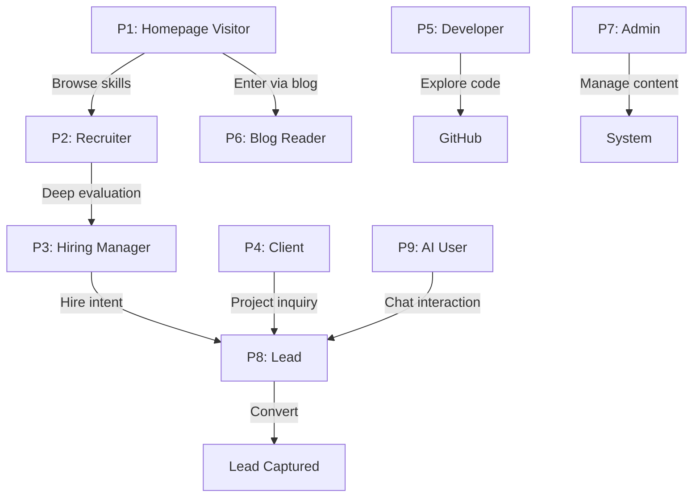

# User Flows — FAANG Enterprise Persona-Based Journey Maps

> **Document:** `UserFlows.md` | **Version:** 5.0 (Enterprise Upgrade) | **Last Updated:** July 2026  
> **Status:** ✅ Active | **Owner:** Principal Product Owner | **Review Cadence:** Quarterly

---

## Executive Summary

This document defines 10 persona-based user journeys covering the complete spectrum of portfolio interactions for a FAANG-grade platform. Unlike simple action-based flows, these persona flows model the **full emotional and behavioral journey** of each user type — from entry point through decision-making to exit. Each flow incorporates multi-LLM AI touchpoints and enterprise-level analytics events. It includes:

- **Entry Point:** How the persona arrives
- **Journey:** Step-by-step swimlane with system interactions
- **Decision Points:** Key moments where the user makes a choice
- **Success Paths:** Optimal outcome scenarios
- **Failure Paths:** Drop-off or negative outcomes
- **Exit Points:** Where and why users leave

**Personas Covered:**
| # | Persona | Primary Goal | Success Metric |
|---|---------|-------------|----------------|
| 1 | Homepage Visitor | Quick assessment of skills & relevance | Bounce rate < 40% |
| 2 | Recruiter | Match skills to job requirements | Time-to-assessment < 60s |
| 3 | Hiring Manager | Deep evaluation of fit & experience | Detail page time > 2 min |
| 4 | Client | Trust assessment & conversion | Contact form completion > 60% |
| 5 | Open Source Contributor | Understand & contribute to codebase | Time-to-first-PR < 1 week |
| 6 | Blog Reader | Consume technical content | Read time > 3 min per article |
| 7 | Admin | Manage portfolio content | Task completion < 30s per action |
| 8 | Lead | Submit inquiry & get response | Auto-reply delivery < 60s |
| 9 | AI Assistant User | Get instant answers via chatbot | Chat resolution > 80% |

---

## 1. Flow Conventions

### Swimlane Key

```
┌─ [PERSONA] ──────────────────────┐   ┌─ SYSTEM ────────────────────────────┐
│                                    │   │                                      │
│  ● START                           │   │                                      │
│    │                               │   │                                      │
│    ▼                               │   │                                      │
│  → Action/Step                     │   │  ──→ Async system response           │
│    │                               │   │                                      │
│    ◆ Decision point                │   │                                      │
│    ├── Path A ──→                  │   │                                      │
│    └── Path B ──→                  │   │                                      │
│                                    │   │                                      │
│  ⚠️ Failure point                  │   │                                      │
│  📊 Success metric checkpoint      │   │                                      │
└────────────────────────────────────┘   └──────────────────────────────────────┘
```

### Symbols

| Symbol | Meaning                       |
| ------ | ----------------------------- |
| `●`    | Start node                    |
| `◆`    | Decision point                |
| `→`    | User action                   |
| `──→`  | Async system action           |
| `⚠️`   | Failure point / error state   |
| `📊`   | Success metric checkpoint     |
| `🔒`   | Security boundary             |
| `⚡`   | Performance budget checkpoint |
| `🎯`   | Conversion / key goal         |

---

## 2. P1: Homepage Visitor Journey

**Persona:** First-time visitor who landed on the portfolio  
**Primary Motivation:** Curiosity, referral, or search result click  
**Success Metric:** Bounce rate < 40%, Average session > 2 min  
**Entry Source:** Google search, social media link, referral link, direct URL

### Flow Diagram

```
┌─ HOMEPAGE VISITOR ─────────────────────────────────┐   ┌─ SYSTEM ─────────────────────┐
│                                                      │   │                             │
│  ● START: Clicks search result or link               │   │                             │
│    │                                                  │   │                             │
│    ⚡ Page must load < 2.5s (LCP)                    │   │                             │
│    │                                                  │   │                             │
│    ▼                                                  │   │                             │
│  → Sees Hero section (name, title, CTAs)             │   │                             │
│    │                                                  │   │                             │
│    ◆ Is the person/title relevant?                    │   │                             │
│    │                                                  │   │                             │
│    ├── YES ──→ Scrolls down to explore              │   │                             │
│    │            │                                     │   │                             │
│    │            ▼                                     │   │                             │
│    │          → Views Skills section                 │   │                             │
│    │            │                                     │   │                             │
│    │            ◆ Are skills impressive?              │   │                             │
│    │            ├── YES ──→ Continues scrolling       │   │                             │
│    │            │            │                         │   │                             │
│    │            │            ▼                         │   │                             │
│    │            │          → Views Projects           │   │                             │
│    │            │            │                         │   │                             │
│    │            │            ◆ Interested in work?    │   │                             │
│    │            │            ├── YES ──→ Clicks project│   │                             │
│    │            │            │            │            │   │                             │
│    │            │            │            ▼            │   │                             │
│    │            │            │          → [P4: Client] │   │                             │
│    │            │            │            OR            │   │                             │
│    │            │            │          → [P2: Recruiter]                              │
│    │            │            │                         │   │                             │
│    │            │            └── NO ──→ [P2: Recruiter]│   │                             │
│    │            │                         path        │   │                             │
│    │            │                         │            │   │                             │
│    │            │                         ▼            │   │                             │
│    │            │                       → Views About │   │                             │
│    │            │                         │            │   │                             │
│    │            │                         ▼            │   │                             │
│    │            │                       → Views       │   │                             │
│    │            │                         Testimonials │   │                             │
│    │            │                         │            │   │                             │
│    │            │                         ▼            │   │                             │
│    │            │                       → [P8: Lead]  │   │                             │
│    │            │                         OR Exit     │   │                             │
│    │            │                                      │   │                             │
│    │            └── NO ──→ ⚠️ Bounce (bored/unimpressed)│                             │
│    │                                                  │   │                             │
│    └── NO ──→ ⚠️ Bounce (irrelevant)                 │   │                             │
│                                                      │   │                             │
│  ● END                                               │   │                             │
└──────────────────────────────────────────────────────┘   └─────────────────────────────┘
```

### Decision Points

| Decision                          | Criteria for YES                                | Criteria for NO                           |
| --------------------------------- | ----------------------------------------------- | ----------------------------------------- |
| **Is the person/title relevant?** | Name matches search, title aligns with need     | Wrong person, wrong role, wrong industry  |
| **Are skills impressive?**        | Skills match requirements, proficiency visible  | Skills don't match, too generic, no depth |
| **Interested in work?**           | Projects look professional, relevant tech stack | Projects don't align, low quality         |

### Success Paths

| Path                      | Description                                                 | Probability | Outcome                   |
| ------------------------- | ----------------------------------------------------------- | ----------- | ------------------------- |
| **S1: Quick Scan → Lead** | Sees hero → skills → contact → submits form                 | 15%         | New lead captured         |
| **S2: Project Deep Dive** | Sees hero → skills → projects → detail page → contact       | 25%         | Qualified lead            |
| **S3: Full Exploration**  | Views all sections → reads testimonials → contact           | 10%         | High-intent lead          |
| **S4: Reference Check**   | Reads about → testimonials → checks external links → leaves | 20%         | Passive lead (may return) |

### Failure Paths

| Path                     | Drop-off Point         | Cause                                       | Mitigation                                |
| ------------------------ | ---------------------- | ------------------------------------------- | ----------------------------------------- |
| **F1: Instant Bounce**   | Hero section (< 5s)    | Not relevant, slow load, unappealing design | Improve hero, optimize LCP, clear CTA     |
| **F2: Skills Rejection** | Skills section (< 15s) | Skills don't match                          | Ensure skills relevant to target audience |
| **F3: Content Overload** | Any section (> 30s)    | Too much text, poor readability             | Progressive disclosure, scannable content |
| **F4: No CTA**           | End of page            | No clear next step                          | Prominent "Contact Me" at section bottoms |

### Exit Points

| Exit Point       | % of Users | Reason                    | Recovery                      |
| ---------------- | ---------- | ------------------------- | ----------------------------- |
| Hero section     | 30%        | Not interested, slow load | Improve first impression, LCP |
| Skills section   | 15%        | Skills mismatch           | Better targeting              |
| Projects section | 10%        | Not impressed             | Improve project presentation  |
| Contact section  | 5%         | Form too long, friction   | Simplify form                 |
| External link    | 10%        | Clicks GitHub/LinkedIn    | Return via browser back       |
| **Conversion**   | **30%**    | Submits form or bookmarks | Success!                      |

---

## 3. P2: Recruiter Journey

**Persona:** Technical recruiter screening candidates  
**Primary Motivation:** Quickly assess if candidate matches open roles  
**Success Metric:** Time-to-assessment < 60s, "Yes/Maybe" rate > 50%  
**Entry Source:** LinkedIn profile link, job board, referral

### Flow Diagram

```
┌─ RECRUITER ──────────────────────────────────────────┐   ┌─ SYSTEM ─────────────────┐
│                                                         │   │                           │
│  ● START: Opens portfolio from LinkedIn / job board      │   │                           │
│    │                                                     │   │                           │
│    ▼                                                     │   │                           │
│  → Scans Hero (name, title, tagline)                     │   │                           │
│    │                                                     │   │                           │
│    ◆ This person relevant for my roles?                  │   │                           │
│    ├── YES ──→ Immediately scrolls or jumps to Skills   │   │                           │
│    │            │                                         │   │                           │
│    │            ▼                                         │   │                           │
│    │          → Scans Skills section (3-5 seconds)       │   │  ──→ Fire skill_view      │
│    │            │                                         │   │       event              │
│    │            ▼                                         │   │                           │
│    │          ◆ Skills match my requirements?            │   │                           │
│    │            ├── YES ──→ Scrolls to Projects          │   │                           │
│    │            │            │                             │   │                           │
│    │            │            ▼                             │   │                           │
│    │            │          → Scans Project cards          │   │  ──→ Fire project_view   │
│    │            │            │                             │   │                           │
│    │            │            ◆ Quality evident?           │   │                           │
│    │            │            ├── YES ──→ Clicks a project │   │                           │
│    │            │            │            │               │   │                           │
│    │            │            │            ▼               │   │                           │
│    │            │            │          → Checks GitHub   │   │  ──→ Open in new tab     │
│    │            │            │            │               │   │                           │
│    │            │            │            ▼               │   │                           │
│    │            │            │          → Returns to      │   │                           │
│    │            │            │            review more     │   │                           │
│    │            │            │            │               │   │                           │
│    │            │            │            ▼               │   │                           │
│    │            │            │          → Scans Experience │   │                           │
│    │            │            │            │               │   │                           │
│    │            │            │            ▼               │   │                           │
│    │            │            │          ◆ Hire potential? │   │                           │
│    │            │            │            ├── YES ──→     │   │                           │
│    │            │            │            │   Grabs email │   │                           │
│    │            │            │            │   or submits  │   │                           │
│    │            │            │            │   contact form│   │  📊 Conversion!           │
│    │            │            │            │               │   │                           │
│    │            │            │            └── NO ──→      │   │                           │
│    │            │            │              Adds to watch │   │  📊 Maybe: passive lead   │
│    │            │            │              list          │   │                           │
│    │            │            │                             │   │                           │
│    │            │            └── NO ──→ ⚠️ Exits (poor    │   │                           │
│    │            │                         quality)        │   │                           │
│    │            │                                          │   │                           │
│    │            └── NO ──→ ⚠️ Exits (not a match)        │   │                           │
│    │                                                     │   │                           │
│    └── NO ──→ ⚠️ Exits (wrong person)                   │   │                           │
│                                                         │   │                           │
│  ● END                                                  │   │                           │
└─────────────────────────────────────────────────────────┘   └───────────────────────────┘
```

### Decision Points

| Decision                   | Criteria for YES                         | Criteria for NO                  |
| -------------------------- | ---------------------------------------- | -------------------------------- |
| **Relevant for my roles?** | Title/description matches open reqs      | Wrong seniority, wrong stack     |
| **Skills match?**          | Core tech meets requirements             | Missing critical skills          |
| **Quality evident?**       | Real projects, clear impact, good README | Sparse, no depth, no GitHub      |
| **Hire potential?**        | Excellent fit, impressive work           | Good but not great, close but no |

### Success Paths

| Path                           | Description                                              | Probability |
| ------------------------------ | -------------------------------------------------------- | ----------- |
| **S1: Strong Match → Contact** | Hero → skills match → projects impressive → contact form | 20%         |
| **S2: Promising → Bookmark**   | Good match → saves link → may contact later              | 25%         |
| **S3: Quick Screener**         | Fast scan → "Maybe" → moves on to next candidate         | 30%         |

### Failure Paths

| Path                            | Cause                    | Mitigation                                  |
| ------------------------------- | ------------------------ | ------------------------------------------- |
| **F1: Skills don't match**      | Wrong tech stack         | Target job descriptions when listing skills |
| **F2: Projects not impressive** | No real-world impact     | Lead with outcomes, metrics, testimonials   |
| **F3: Hard to find contact**    | No CTA, no email visible | Make contact form prominent, show email     |
| **F4: GitHub empty/inactive**   | No public code           | Link to active repos, contribute to OSS     |

### Exit Points

| Exit Point             | %   | Reason                   |
| ---------------------- | --- | ------------------------ |
| Skills section         | 30% | Skills mismatch          |
| Projects section       | 20% | Not impressed            |
| GitHub link (external) | 20% | Reviews code, may return |
| Contact form           | 15% | Submits interest         |
| Bookmark for later     | 15% | Will return              |

---

## 4. P3: Hiring Manager Journey

**Persona:** Engineering manager evaluating a candidate  
**Primary Motivation:** Deeply assess technical fit, experience depth, and culture add  
**Success Metric:** Detail page time > 2 min, GitHub review > 3 repos  
**Entry Source:** Recruiter referral, internal referral, direct search

### Flow Diagram

```
┌─ HIRING MANAGER ─────────────────────────────────────┐   ┌─ SYSTEM ───────────────┐
│                                                         │   │                         │
│  ● START: Opens portfolio from referral                 │   │                         │
│    │                                                     │   │                         │
│    ▼                                                     │   │                         │
│  → Quickly scans Hero → About section                   │   │                         │
│    │                                                     │   │                         │
│    ▼                                                     │   │                         │
│  → Reads bio carefully (reads every word)               │   │                         │
│    │                                                     │   │                         │
│    ◆ Cultural fit and experience depth?                  │   │                         │
│    ├── YES ──→ Examines Experience timeline             │   │                         │
│    │            │                                         │   │                         │
│    │            ▼                                         │   │                         │
│    │          → Reads each role, checks gaps             │   │  ──→ Fire experience_view|
│    │            │                                         │   │                         │
│    │            ◆ Progression and stability?             │   │                         │
│    │            ├── YES ──→ Reviews Projects in depth   │   │                         │
│    │            │            │                             │   │                         │
│    │            │            ▼                             │   │                         │
│    │            │          → Clicks project detail       │   │  ──→ Load project detail|
│    │            │            │                             │   │                         │
│    │            │            ▼                             │   │                         │
│    │            │          → Reads full case study       │   │                         │
│    │            │            │  (problem, approach, impact)│                         │
│    │            │            │                             │   │                         │
│    │            │            ▼                             │   │                         │
│    │            │          → Clicks GitHub link           │   │  ──→ Open GitHub tab   │
│    │            │            │                             │   │                         │
│    │            │            ▼                             │   │                         │
│    │            │          → Reviews code quality         │   │                         │
│    │            │            │  (README, commits, PRs)     │   │                         │
│    │            │            │                             │   │                         │
│    │            │            ▼                             │   │                         │
│    │            │          → Returns to portfolio         │   │                         │
│    │            │            │                             │   │                         │
│    │            │            ▼                             │   │                         │
│    │            │          → Reads Testimonials           │   │                         │
│    │            │            │                             │   │                         │
│    │            │            ▼                             │   │                         │
│    │            │          ◆ Should I interview?          │   │                         │
│    │            │            ├── YES ──→ Submits form     │   │  📊 High-value lead!   │
│    │            │            │            OR               │   │                         │
│    │            │            │          → Emails directly  │   │                         │
│    │            │            │                             │   │                         │
│    │            │            └── NO ──→ Passes, but       │   │                         │
│    │            │                      follows for future │   │                         │
│    │            │                                         │   │                         │
│    │            └── NO ──→ ⚠️ Exits (red flags: short    │   │                         │
│    │                         stints, gaps, no growth)     │   │                         │
│    │                                                     │   │                         │
│    └── NO ──→ ⚠️ Exits (not a culture or experience      │   │                         │
│                     fit)                                  │   │                         │
│                                                         │   │                         │
│  ● END                                                  │   │                         │
└─────────────────────────────────────────────────────────┘   └─────────────────────────┘
```

### Decision Points

| Decision                | Criteria for YES                                         | Criteria for NO                           |
| ----------------------- | -------------------------------------------------------- | ----------------------------------------- |
| **Cultural fit?**       | Bio resonates, values align, communication style matches | Mismatch in values, tone, or approach     |
| **Progression?**        | Increasing responsibility, promotions, skill growth      | Stagnation, short stints (multiple < 1yr) |
| **Technical depth?**    | Complex projects, good code, architecture thinking       | Trivial projects, poor code quality       |
| **Should I interview?** | Excellent across all dimensions                          | Good but not exceptional                  |

### Success Paths

| Path                                | Description                                | Probability |
| ----------------------------------- | ------------------------------------------ | ----------- |
| **S1: Excellent Fit → Interview**   | All checks pass → submits detailed inquiry | 15%         |
| **S2: Strong Candidate → Pipeline** | Strong match → saves for future opening    | 25%         |
| **S3: Good Reference**              | Impressed → refers to colleague            | 10%         |

### Failure Paths

| Path                             | Cause                             | Mitigation                                |
| -------------------------------- | --------------------------------- | ----------------------------------------- |
| **F1: Red flags in experience**  | Short stints, unclear progression | Show context (contract roles, startups)   |
| **F2: Code quality not evident** | No GitHub, sparse commits         | Contribute regularly, pin good repos      |
| **F3: No testimonials**          | Can't verify soft skills          | Collect LinkedIn recommendations          |
| **F4: Overwhelming info**        | Too much text, poor structure     | Progressive disclosure, case study format |

---

## 5. P4: Client Journey

**Persona:** Potential client looking to hire for a project  
**Primary Motivation:** Find a trustworthy, skilled professional for paid work  
**Success Metric:** Contact form completion > 60% of interested clients  
**Entry Source:** Google search, referral, LinkedIn, freelance platform

### Flow Diagram

```
┌─ CLIENT ─────────────────────────────────────────────────────┐   ┌─ SYSTEM ──────────┐
│                                                                │   │                    │
│  ● START: Searching for developer to build [project]            │   │                    │
│    │                                                            │   │                    │
│    ▼                                                            │   │                    │
│  → Lands on portfolio, scans Hero                              │   │                    │
│    │                                                            │   │                    │
│    ◆ Does this person do what I need?                          │   │                    │
│    ├── YES ──→ Navigates to Services section                   │   │                    │
│    │            │                                                │   │                    │
│    │            ▼                                                │   │                    │
│    │          → Reads services and pricing                      │   │  ──→ Fire services_view|
│    │            │                                                │   │                    │
│    │            ◆ Services match my needs?                      │   │                    │
│    │            ├── YES ──→ Scrolls to Projects                 │   │                    │
│    │            │            │                                    │   │                    │
│    │            │            ▼                                    │   │                    │
│    │            │          → Reviews relevant projects           │   │                    │
│    │            │            │  (same category as need)          │   │                    │
│    │            │            │                                    │   │                    │
│    │            │            ◆ Quality and relevance?            │   │                    │
│    │            │            ├── YES ──→ Checks Testimonials    │   │                    │
│    │            │            │            │                      │   │                    │
│    │            │            │            ▼                      │   │                    │
│    │            │            │          → Reads client reviews   │   │  ──→ Fire testimonial_view|
│    │            │            │            │                      │   │                    │
│    │            │            │            ◆ Trust established?  │   │                    │
│    │            │            │            ├── YES ──→ Goes to   │   │                    │
│    │            │            │            │   Contact section    │   │                    │
│    │            │            │            │   │                  │   │                    │
│    │            │            │            │   ▼                  │   │                    │
│    │            │            │            │ → Fills out contact  │   │                    │
│    │            │            │            │   form with DETAILS  │   │                    │
│    │            │            │            │   │                  │   │                    │
│    │            │            │            │   ▼                  │   │                    │
│    │            │            │            │ ◆ Submits form      │   │  ──→ POST /api/leads|
│    │            │            │            │   ├── Success ──→   │   │                    │
│    │            │            │            │   │  Sees thank you  │   │  📊 Lead captured! │
│    │            │            │            │   │  Gets auto-reply │   │                    │
│    │            │            │            │   │  email           │   │                    │
│    │            │            │            │   │                  │   │                    │
│    │            │            │            │   └── Error ──→     │   │                    │
│    │            │            │            │      Retries or      │   │  ⚠️ Form error     │
│    │            │            │            │      emails directly │   │                    │
│    │            │            │            │                      │   │                    │
│    │            │            │            └── NO ──→ ⚠️ Leaves   │   │                    │
│    │            │            │                         (not      │   │                    │
│    │            │            │                         convinced) │   │                    │
│    │            │            │                                    │   │                    │
│    │            │            └── NO ──→ May look at other        │   │                    │
│    │            │                         sections OR exit       │   │                    │
│    │            │                                                │   │                    │
│    │            └── NO ──→ ⚠️ Exits (services don't match)     │   │                    │
│    │                                                            │   │                    │
│    └── NO ──→ ⚠️ Bounce (not relevant)                         │   │                    │
│                                                                │   │                    │
│  ● END                                                         │   │                    │
└────────────────────────────────────────────────────────────────┘   └────────────────────┘
```

### Decision Points

| Decision                             | Criteria for YES                             | Criteria for NO                    |
| ------------------------------------ | -------------------------------------------- | ---------------------------------- |
| **Does this person do what I need?** | Services listed match project type           | Wrong services, no service listing |
| **Services match?**                  | Pricing clear, scope aligns                  | Too expensive, unclear offering    |
| **Quality and relevance?**           | Portfolio projects similar to my need        | Different category, low quality    |
| **Trust established?**               | Positive testimonials, case studies, metrics | No social proof, generic claims    |

### Success Paths

| Path                                    | Description                                             | Probability |
| --------------------------------------- | ------------------------------------------------------- | ----------- |
| **S1: Perfect Fit → Detailed Proposal** | All criteria match → submits detailed requirements form | 20%         |
| **S2: Good Fit → Discovery Call**       | Strong match → books call via Calendly                  | 15%         |
| **S3: Referral**                        | Impressed but not right fit → refers to colleague       | 10%         |

### Failure Paths

| Path                       | Cause                     | Mitigation                               |
| -------------------------- | ------------------------- | ---------------------------------------- |
| **F1: No services listed** | Can't tell what's offered | Add Services section                     |
| **F2: No pricing**         | Hesitant to reach out     | Add pricing tiers or "Starting at $X"    |
| **F3: No testimonials**    | Can't verify quality      | Collect and display testimonials         |
| **F4: Form too long**      | Abandons form             | Minimize fields, save drafts             |
| **F5: No response**        | Sends email but no reply  | Auto-reply with timeline, Telegram alert |

---

## 6. P5: Open Source Contributor Journey

**Persona:** Developer looking to contribute to the portfolio  
**Primary Motivation:** Learn from the codebase, build portfolio, give back  
**Success Metric:** Time-to-first-PR < 1 week, Fork-to-running < 5 min  
**Entry Source:** GitHub, Hacker News, developer blog, friend referral

### Flow Diagram

```
┌─ OSS CONTRIBUTOR ──────────────────────────────────────────┐   ┌─ SYSTEM ────────────┐
│                                                               │   │                      │
│  ● START: Finds repo on GitHub or Hacker News                  │   │                      │
│    │                                                           │   │                      │
│    ▼                                                           │   │                      │
│  → Reads README.md on GitHub                                  │   │                      │
│    │                                                           │   │                      │
│    ◆ Is this interesting/well-maintained?                      │   │                      │
│    ├── YES ──→ Stars the repo                                 │   │  📊 GitHub star!     │
│    │            │                                               │   │                      │
│    │            ▼                                               │   │                      │
│    │          → Forks the repo                                 │   │                      │
│    │            │                                               │   │                      │
│    │            ▼                                               │   │                      │
│    │          → Clones locally                                 │   │                      │
│    │            │                                               │   │                      │
│    │            ▼                                               │   │                      │
│    │          → Runs npm install                               │   │                      │
│    │            │                                               │   │                      │
│    │            ◆ Setup works smoothly?                        │   │                      │
│    │            ├── YES ──→ Runs npm run dev                   │   │                      │
│    │            │            │                                   │   │                      │
│    │            │            ▼                                   │   │                      │
│    │            │          → Explores the codebase             │   │                      │
│    │            │            │  (reads 18-AGENTS.md,            │   │                      │
│    │            │            │   35-FOLDER_STRUCTURE.md)        │   │                      │
│    │            │            │                                   │   │                      │
│    │            │            ▼                                   │   │                      │
│    │            │          → Looks at GitHub Issues             │   │                      │
│    │            │            │  (filters "good first issue")    │   │                      │
│    │            │            │                                   │   │                      │
│    │            │            ◆ Found a good first issue?       │   │                      │
│    │            │            ├── YES ──→ Comments on issue     │   │                      │
│    │            │            │            │                     │   │                      │
│    │            │            │            ▼                     │   │                      │
│    │            │            │          → Assigns to self      │   │                      │
│    │            │            │            │                     │   │                      │
│    │            │            │            ▼                     │   │                      │
│    │            │            │          → Implements fix       │   │                      │
│    │            │            │            │                     │   │                      │
│    │            │            │            ▼                     │   │                      │
│    │            │            │          → Runs tests, lint     │   │                      │
│    │            │            │            │                     │   │                      │
│    │            │            │            ▼                     │   │                      │
│    │            │            │          → Opens PR             │   │  📊 PR submitted!    │
│    │            │            │            │                     │   │                      │
│    │            │            │            ▼                     │   │                      │
│    │            │            │          → CI runs checks       │   │                      │
│    │            │            │            │                     │   │                      │
│    │            │            │            ▼                     │   │                      │
│    │            │            │          → PR reviewed & merged │   │  🎯 Contribution!    │
│    │            │            │                                 │   │                      │
│    │            │            └── NO ──→ Opens an issue         │   │                      │
│    │            │                         describing intent    │   │                      │
│    │            │                         │                     │   │                      │
│    │            │                         ▼                     │   │                      │
│    │            │                       → Maintainer responds  │   │                      │
│    │            │                         │                     │   │                      │
│    │            │                         ▼                     │   │                      │
│    │            │                       → Waits for guidance   │   │  ⏳ Async            │
│    │            │                                               │   │                      │
│    │            └── NO ──→ ⚠️ Struggles with setup            │   │                      │
│    │                         → Opens issue for help            │   │                      │
│    │                                                           │   │                      │
│    └── NO ──→ ⚠️ Leaves (not interested)                      │   │                      │
│                                                               │   │                      │
│  ● END                                                        │   │                      │
└───────────────────────────────────────────────────────────────┘   └──────────────────────┘
```

### Decision Points

| Decision                         | Criteria for YES                                                   |
| -------------------------------- | ------------------------------------------------------------------ |
| **Interesting/well-maintained?** | Good README, recent commits, CI passing, active issues             |
| **Setup works?**                 | Docker Compose or manual setup documented, no dependency conflicts |
| **Good first issue found?**      | Labeled "good first issue", clear description, low complexity      |

### Success Paths

| Path                          | Description                                                 |
| ----------------------------- | ----------------------------------------------------------- |
| **S1: Quick Contribution**    | Clone → setup → fix → PR → merge (within hours)             |
| **S2: Long-term Contributor** | Starts with one fix, becomes regular contributor            |
| **S3: Issue Reporter**        | Doesn't code but files high-quality bugs / feature requests |

### Failure Paths

| Path                          | Cause                                | Mitigation                            |
| ----------------------------- | ------------------------------------ | ------------------------------------- |
| **F1: Complex setup**         | Docker not installed, env var maze   | Document manual setup, Docker default |
| **F2: No good first issues**  | Can't find where to start            | Tag and document good first issues    |
| **F3: CI failing**            | PR blocked by unrelated failures     | Maintain CI, fix flaky tests          |
| **F4: PR not reviewed**       | Stale PR, contributor loses interest | Review within 2 business days         |
| **F5: No contributing guide** | Unclear expectations                 | CONTRIBUTING.md, PR template          |

---

## 7. P6: Blog Reader Journey

**Persona:** Developer or designer consuming technical content  
**Primary Motivation:** Learn, get inspired, follow thought leadership  
**Success Metric:** Read time > 3 min per article, Return visitor rate > 20%  
**Entry Source:** Google search, Hacker News, Dev.to, Twitter/X

### Flow Diagram

```
┌─ BLOG READER ─────────────────────────────────────────────┐   ┌─ SYSTEM ───────────┐
│                                                              │   │                     │
│  ● START: Clicks blog link from search / social              │   │                     │
│    │                                                          │   │                     │
│    ▼                                                          │   │                     │
│  → Lands on blog listing page                                │   │  ──→ Fire page_view  │
│    │                                                          │   │                     │
│    ◆ Sees interesting article titles?                        │   │                     │
│    ├── YES ──→ Clicks an article                             │   │                     │
│    │            │                                              │   │                     │
│    │            ▼                                              │   │                     │
│    │          → Article loads with reading progress bar       │   │  ──→ Fire article_view|
│    │            │                                              │   │                     │
│    │            ▼                                              │   │                     │
│    │          → Starts reading                                │   │                     │
│    │            │                                              │   │                     │
│    │            ◆ Is the content valuable?                   │   │                     │
│    │            ├── YES ──→ Reads full article                │   │                     │
│    │            │            │  (code blocks, examples)        │   │                     │
│    │            │            │                                 │   │                     │
│    │            │            ▼                                 │   │                     │
│    │            │          → Reaches 100% scroll depth        │   │  📊 Full read!      │
│    │            │            │                                 │   │                     │
│    │            │            ▼                                 │   │                     │
│    │            │          ◆ Engaged enough to act?           │   │                     │
│    │            │            ├── Shares on Twitter/LinkedIn   │   │                     │
│    │            │            ├── Leaves a comment (future)    │   │                     │
│    │            │            ├── Clicks related article       │   │                     │
│    │            │            ├── Subscribes to RSS            │   │                     │
│    │            │            └── Explores portfolio           │   │  → [P1: Homepage]   │
│    │            │                                 │           │   │                     │
│    │            │                                 ▼           │   │                     │
│    │            │                               ● END        │   │                     │
│    │            │                                              │   │                     │
│    │            └── NO ──→ ⚠️ Leaves after < 30s             │   │                     │
│    │                         (poor content, not relevant)     │   │                     │
│    │                                                          │   │                     │
│    └── NO ──→ ⚠️ Leaves listing page                          │   │                     │
│                  (nothing interesting)                        │   │                     │
│                                                              │   │                     │
│  ● END                                                       │   │                     │
└──────────────────────────────────────────────────────────────┘   └─────────────────────┘
```

### Decision Points

| Decision                   | Criteria for YES                     | Criteria for NO                |
| -------------------------- | ------------------------------------ | ------------------------------ |
| **Interesting titles?**    | Topics relevant to reader's work     | Too generic, wrong niche       |
| **Content valuable?**      | Well-written, actionable, insightful | Shallow, fluff, rehashed       |
| **Engaged enough to act?** | Learned something, impressed         | Informative but not actionable |

### Success Paths

| Path                         | Description                                                   |
| ---------------------------- | ------------------------------------------------------------- |
| **S1: Deep Reader**          | Reads full article → shares → reads more → explores portfolio |
| **S2: Skimmer → Subscriber** | Skims → impressed → subscribes to RSS → returns regularly     |
| **S3: One-off Learner**      | Reads one article → leaves → may return via search            |

### Failure Paths

| Path                                     | Cause                                |
| ---------------------------------------- | ------------------------------------ |
| **F1: Title clickbait, content shallow** | Misleading title, poor depth         |
| **F2: Code blocks broken**               | Syntax highlighting not working      |
| **F3: Slow loading**                     | > 3s load time, reader leaves        |
| **F4: Poor mobile formatting**           | Code blocks overflow, font too small |

---

## 8. P7: Admin Journey

**Persona:** Portfolio owner managing content  
**Primary Motivation:** Keep portfolio fresh, respond to leads, monitor performance  
**Success Metric:** Task completion < 30s per action, Daily active use  
**Entry Source:** Direct URL (`/admin`), bookmark

### Flow Diagram

```
┌─ ADMIN ───────────────────────────────────────────────────────┐   ┌─ SYSTEM ──────────┐
│                                                                  │   │                    │
│  ● START: Opens /admin or clicks bookmark                        │   │                    │
│    │                                                              │   │                    │
│    ▼                                                              │   │                    │
│  ◆ Already authenticated?                                         │   │                    │
│    ├── YES ──→ Dashboard loads                                   │   │  ──→ Fetch stats   │
│    │            │                                                  │   │                    │
│    │            ▼                                                  │   │                    │
│    │          → Sees overview: visitors, leads, sections          │   │                    │
│    │            │                                                  │   │                    │
│    │            ◆ What needs attention?                           │   │                    │
│    │            │                                                  │   │                    │
│    │            ├── Check leads ──→ Clicks "Leads" in sidebar    │   │                    │
│    │            │                    │                              │   │                    │
│    │            │                    ▼                              │   │                    │
│    │            │                  → Reviews new leads            │   │  ──→ Mark as read  │
│    │            │                    │                              │   │                    │
│    │            │                    ▼                              │   │                    │
│    │            │                  → Replies or archives           │   │                    │
│    │            │                                                  │   │                    │
│    │            ├── Update content ──→ Clicks "Sections"          │   │                    │
│    │            │                      │                            │   │                    │
│    │            │                      ▼                            │   │                    │
│    │            │                    → Edits section content       │   │                    │
│    │            │                      │                            │   │                    │
│    │            │                      ▼                            │   │                    │
│    │            │                    → Saves / publishes           │   │  ──→ Invalidate    │
│    │            │                      │                            │   │       cache        │
│    │            │                      ▼                            │   │                    │
│    │            │                    → Checks preview              │   │                    │
│    │            │                                                  │   │                    │
│    │            ├── View analytics ──→ Clicks "Analytics"         │   │                    │
│    │            │                      │                            │   │                    │
│    │            │                      ▼                            │   │                    │
│    │            │                    → Reviews traffic trends      │   │                    │
│    │            │                                                  │   │                    │
│    │            └── Settings ──→ Clicks "Settings"                │   │                    │
│    │                               │                                │   │                    │
│    │                               ▼                                │   │                    │
│    │                             → Updates profile or config       │   │                    │
│    │                                                                  │                    │
│    └── NO ──→ Redirect to login page                              │   │                    │
│                  │                                                  │   │                    │
│                  ▼                                                  │   │                    │
│                → Enters credentials                                │   │  ──→ Verify auth   │
│                  │                                                  │   │                    │
│                  ◆ Valid?                                          │   │                    │
│                  ├── YES ──→ Redirect to dashboard                 │   │                    │
│                  └── NO ──→ ⚠️ Error: Invalid credentials          │   │                    │
│                              → Retry up to 5 times                 │   │                    │
│                              → Locked after 5 failures             │   │                    │
│                                                                     │   │                    │
│  ● END                                                             │   │                    │
└───────────────────────────────────────────────────────────────────┘   └────────────────────┘
```

### Decision Points

| Decision                  | Criteria                                             |
| ------------------------- | ---------------------------------------------------- |
| **Authenticated?**        | Valid session cookie / JWT token                     |
| **What needs attention?** | Unread leads count, stale content, traffic trends    |
| **Valid credentials?**    | Email + password match stored hash, not rate-limited |

### Admin Task Flow

| Task                  | Steps                                    | Avg Time | Frequency |
| --------------------- | ---------------------------------------- | -------- | --------- |
| **Check leads**       | Login → Leads → Review → Reply/Archive   | 2 min    | Daily     |
| **Update section**    | Login → Sections → Edit → Save → Preview | 5 min    | Weekly    |
| **View analytics**    | Login → Analytics → Review trends        | 3 min    | Weekly    |
| **Toggle visibility** | Login → Sections → Toggle                | 10s      | As needed |
| **Upload images**     | Login → Sections → Edit → Upload         | 1 min    | As needed |

### Failure Paths

| Path                    | Cause                      | Recovery                                      |
| ----------------------- | -------------------------- | --------------------------------------------- |
| **F1: Forgot password** | Can't remember credentials | Use "Forgot password?" reset flow             |
| **F2: Save fails**      | Network, server error      | Auto-save, retry, show error toast            |
| **F3: Session expired** | Idle > 24 hours            | Auto-redirect to login, preserve intended URL |

---

## 9. P8: Lead Journey

**Persona:** Visitor who submits a contact form  
**Primary Motivation:** Get in touch about an opportunity  
**Success Metric:** Submission success > 95%, Auto-reply < 60s  
**Entry Source:** Portfolio contact section, direct link to contact

### Flow Diagram

```
┌─ LEAD ──────────────────────────────────────────────┐   ┌─ SYSTEM ────────────────────────┐
│                                                        │   │                                  |
│  ● START: Decides to reach out                         │   │                                  |
│    │                                                    │   │                                  |
│    ▼                                                    │   │                                  |
│  → Scrolls to Contact section                          │   │  ──→ Fire contact_form_view     |
│    │                                                    │   │                                  |
│    ▼                                                    │   │                                  |
│  → Sees contact form                                   │   │                                  |
│    │                                                    │   │                                  |
│    ◆ Is the form simple enough?                        │   │                                  |
│    ├── YES ──→ Starts filling form                     │   │  ──→ Fire contact_form_start    |
│    │            │                                        │   │                                  |
│    │            ▼                                        │   │                                  |
│    │          → Enters name, email, message             │   │                                  |
│    │            │                                        │   │                                  |
│    │            ◆ Client-side validation passes?        │   │                                  |
│    │            ├── YES ──→ Clicks Submit               │   │                                  |
│    │            │            │                            │   │                                  |
│    │            │            ▼                            │   │  ──→ POST /api/leads            |
│    │            │          → Button shows spinner       │   │                                  |
│    │            │            │                            │   │                                  |
│    │            │            ▼                            │   │  ◆ Rate limit check             |
│    │            │          → Waits for response          │   │  ├── OK ──→                      |
│    │            │            │                            │   │  │         │                    |
│    │            │            ▼                            │   │  │         ▼                    |
│    │            │          ◆ Response type?              │   │  │  → Validate data              |
│    │            │            │                            │   │  │    │                        |
│    │            │            ├── 201 Created ──→          │   │  │    ▼                        |
│    │            │            │              │             │   │  │  → Insert to DB              |
│    │            │            │              ▼             │   │  │    │                        |
│    │            │            │  🎉 Shows success toast   │   │  │    ▼                        |
│    │            │            │  with confetti!           │   │  │  → Queue: Send auto-reply    |
│    │            │            │    │                       │   │  │    │                        |
│    │            │            │    ▼                       │   │  │    ▼                        |
│    │            │            │  → Gets auto-reply email   │   │  │  → Queue: Telegram notify    |
│    │            │            │    within 60 seconds       │   │  │                             |
│    │            │            │    │                       │   │  │                             |
│    │            │            │    ● END (Happy!)          │   │  └── Exceeded ──→              |
│    │            │            │                            │   │                  │             |
│    │            │            └── 4xx/5xx ──→              │   │                  ▼             |
│    │            │                          │              │   │  ⚠️ "Please wait 15            |
│    │            │                          ▼              │   │     minutes"                   |
│    │            │              ⚠️ Shows error message     │   │                                  |
│    │            │                → Retry or email directly│   │                                  |
│    │            │                                          │   │                                  |
│    │            └── FAIL ──→ Shows validation error       │   │                                  |
│    │                         → Fixes and resubmits        │   │                                  |
│    │                                                        │   │                                  |
│    └── NO ──→ ⚠️ Leaves (form too complex)               │   │                                  |
│                                                        │   │                                  |
│  ● END                                                 │   │                                  |
└────────────────────────────────────────────────────────┘   └──────────────────────────────────┘
```

### Decision Points

| Decision                | Criteria for YES                | Criteria for NO             |
| ----------------------- | ------------------------------- | --------------------------- |
| **Form simple enough?** | 3-5 fields, no required account | 10+ fields, requires login  |
| **Validation passes?**  | Valid email, message > 10 chars | Invalid email, empty fields |
| **Rate limit OK?**      | < 10 submissions in 15 min      | > 10 submissions in 15 min  |

### Lead Quality Indicators

| Indicator          | High Quality          | Low Quality         |
| ------------------ | --------------------- | ------------------- |
| **Message length** | > 100 chars, detailed | < 20 chars, generic |
| **Company filled** | Real company name     | Empty or "N/A"      |
| **Source**         | Referral, LinkedIn    | Direct (unknown)    |
| **UTM tracking**   | Specific campaign     | No UTM params       |

### Failure Paths

| Path                           | Cause                                   | Recovery                                    |
| ------------------------------ | --------------------------------------- | ------------------------------------------- |
| **F1: Form too complex**       | Too many fields, asks for too much info | Keep to 5 fields max                        |
| **F2: Validation frustration** | Overly strict validation                | Real-time validation, helpful messages      |
| **F3: Rate limited**           | Submitted too many times                | Clear countdown, alternative contact method |
| **F4: Network error**          | Lost connection during submit           | Save form data, retry on reconnect          |
| **F5: No confirmation**        | Submitted but no visual feedback        | Success toast + email within 60s            |

---

## 10. P9: AI Assistant User Journey

**Persona:** Visitor using the AI chatbot  
**Primary Motivation:** Get quick answers without reading the entire portfolio  
**Success Metric:** Chat resolution > 80%, Messages per session > 3  
**Entry Source:** Floating action button on any page

### Flow Diagram

```
┌─ AI ASSISTANT USER ─────────────────────────────────────┐   ┌─ SYSTEM ───────────────────┐
│                                                            │   │                             │
│  ● START: Browsing portfolio, has a question               │   │                             │
│    │                                                        │   │                             │
│    ▼                                                        │   │                             │
│  → Notices floating chat button (FAB)                      │   │                             │
│    │                                                        │   │                             │
│    ◆ Should I try the chatbot?                             │   │                             │
│    ├── YES ──→ Clicks FAB                                  │   │                             │
│    │            │                                            │   │  ──→ Fire chat_opened       |
│    │            ▼                                            │   │                             │
│    │          → Chat window opens with greeting             │   │  ──→ Create chat session    |
│    │            │  and 3 suggested questions                │   │                             │
│    │            │                                            │   │                             │
│    │            ▼                                            │   │                             │
│    │          ◆ Ask own question or click suggested?        │   │                             │
│    │            │                                            │   │                             │
│    │            ├── Types own question                      │   │                             │
│    │            │     │                                      │   │                             │
│    │            │     ▼                                      │   │  ──→ Send to RAG pipeline   |
│    │            │   → Sends message                         │   │       │                     │
│    │            │     │                                      │   │       ▼                     │
│    │            │     ▼                                      │   │  → Search pgvector          |
│    │            │   → Sees typing indicator                 │   │       │                     │
│    │            │     │                                      │   │       ▼                     │
│    │            │     ▼                                      │   │  → LLM generates response   |
│    │            │   → Receives AI response                  │   │       │                     │
│    │            │     │  (with sources if applicable)        │   │       ▼                     │
│    │            │     │                                      │   │  📊 Response delivered!      |
│    │            │     ◆ Was the answer helpful?             │   │                             │
│    │            │       │                                    │   │                             │
│    │            │       ├── YES ──→ Asks follow-up          │   │                             │
│    │            │       │            │                       │   │                             │
│    │            │       │            ▼                       │   │                             │
│    │            │       │          → Continuous exchange    │   │                             │
│    │            │       │            │                       │   │                             │
│    │            │       │            ▼                       │   │                             │
│    │            │       │          ◆ Question answered?     │   │                             │
│    │            │       │            ├── YES ──→ Happy exit │   │                             │
│    │            │       │            └── NO ──→ More follow-│   │                             │
│    │            │       │                     ups           │   │                             │
│    │            │       │                                    │   │                             │
│    │            │       └── NO ──→ Asks differently OR      │   │                             │
│    │            │                    closes chat            │   │                             │
│    │            │                    │                       │   │                             │
│    │            │                    ▼                       │   │                             │
│    │            │                  ● END                     │   │                             │
│    │            │                                            │   │                             │
│    │            └── Clicks suggested question               │   │                             │
│    │                  │                                      │   │                             │
│    │                  ▼                                      │   │                             │
│    │                → Same flow as typing                   │   │                             │
│    │                                                        │   │                             │
│    └── NO ──→ Continues browsing without chatbot            │   │                             │
│                                                            │   │                             │
│  ● END                                                     │   │                             │
└────────────────────────────────────────────────────────────┘   └─────────────────────────────┘
```

### Decision Points

| Decision                    | Criteria                                             |
| --------------------------- | ---------------------------------------------------- |
| **Try the chatbot?**        | Has a question, seen chatbot on other sites, curious |
| **Was the answer helpful?** | Relevant, accurate, sourced from portfolio           |
| **Question answered?**      | Got the info needed, or needs more detail            |

### Success Paths

| Path                          | Description                                              | Probability |
| ----------------------------- | -------------------------------------------------------- | ----------- |
| **S1: Complete Resolution**   | Asks question → gets answer → satisfied → closes         | 50%         |
| **S2: Interactive Discovery** | Starts with one question → explores via follow-ups       | 25%         |
| **S3: Quick Fact Check**      | Quick question → quick answer → closes                   | 15%         |
| **S4: Lead Generation**       | Chat interaction → convinces user → submits contact form | 10%         |

### Failure Paths

| Path                          | Cause                                      | Mitigation                                 |
| ----------------------------- | ------------------------------------------ | ------------------------------------------ |
| **F1: AI doesn't understand** | Poor question phrasing, ambiguous          | Show suggested questions, ask clarifying   |
| **F2: AI hallucinates**       | Makes up information about portfolio owner | RAG grounding, "I don't have info about X" |
| **F3: Too slow**              | Response > 5 seconds                       | Typing indicator, cache common Qs          |
| **F4: Rate limited**          | Too many messages                          | Show friendly limit message                |
| **F5: AI unavailable**        | Service down                               | "Chat unavailable. Email instead." link    |

---

## 11. Cross-Persona Interaction Matrix

### Flow Dependencies

| From \\ To        | P1: Visitor  | P2: Recruiter | P3: H.Manager | P4: Client  | P5: OSS      | P6: Blog | P7: Admin | P8: Lead   | P9: AI User  |
| ----------------- | ------------ | ------------- | ------------- | ----------- | ------------ | -------- | --------- | ---------- | ------------ |
| **P1: Visitor**   | —            | ✅ Skills     | ✅ About      | ✅ Services | ❌           | ❌       | ❌        | ✅ Contact | ✅ Chat      |
| **P2: Recruiter** | ✅ Hero      | —             | ✅ Experience | ❌          | ✅ GitHub    | ❌       | ❌        | ✅ Contact | ✅ Fast scan |
| **P3: H.Manager** | ✅ About     | ✅ Exp        | —             | ❌          | ✅ Code      | ❌       | ❌        | ✅ Contact | ✅ Deep dive |
| **P4: Client**    | ✅ Services  | ❌            | ❌            | —           | ❌           | ❌       | ❌        | ✅ Form    | ✅ Chat      |
| **P5: OSS**       | ❌           | ❌            | ❌            | ❌          | —            | ❌       | ✅ PR     | ❌         | ❌           |
| **P6: Blog**      | ✅ Portfolio | ❌            | ❌            | ❌          | ❌           | —        | ❌        | ❌         | ❌           |
| **P7: Admin**     | ❌           | ❌            | ❌            | ❌          | ✅ Review PR | ❌       | —         | ✅ Reply   | ✅ Monitor   |
| **P8: Lead**      | ✅ Explore   | ❌            | ❌            | ❌          | ❌           | ❌       | ✅ Inbox  | —          | ❌           |
| **P9: AI User**   | ✅ Browse    | ❌            | ❌            | ❌          | ❌           | ❌       | ❌        | ✅ Convert | —            |

### Data Flow Per Persona

| Persona       | Reads                               | Creates         | Updates         | Converts To        |
| ------------- | ----------------------------------- | --------------- | --------------- | ------------------ |
| P1: Visitor   | Sections, Skills, Projects          | —               | —               | P8: Lead           |
| P2: Recruiter | Skills, Projects, GitHub            | —               | —               | P8: Lead           |
| P3: H.Manager | About, Experience, Projects, GitHub | —               | —               | P8: Lead           |
| P4: Client    | Services, Projects, Testimonials    | Lead record     | —               | P8: Lead           |
| P5: OSS       | README, Code, Docs                  | Pull request    | —               | P7: Admin (review) |
| P6: Blog      | Blog posts                          | —               | —               | P1: Visitor        |
| P7: Admin     | Dashboard, Analytics                | Content updates | Sections, Leads | —                  |
| P8: Lead      | Confirmation, Auto-reply            | Lead record     | —               | P7: Admin (reply)  |
| P9: AI User   | AI responses                        | Chat message    | —               | P8: Lead           |

---

## 12. Performance Budgets per Persona

| Persona              | Critical Metric       | Target  | Failure Threshold |
| -------------------- | --------------------- | ------- | ----------------- |
| P1: Homepage Visitor | LCP                   | < 2.0s  | > 2.5s            |
| P1: Homepage Visitor | TTI                   | < 3.0s  | > 4.0s            |
| P2: Recruiter        | Skills section render | < 500ms | > 1s              |
| P3: Hiring Manager   | Project detail load   | < 1s    | > 2s              |
| P4: Client           | Contact form submit   | < 2s    | > 5s              |
| P5: OSS Contributor  | `npm install`         | < 2 min | > 5 min           |
| P5: OSS Contributor  | First build           | < 3 min | > 10 min          |
| P6: Blog Reader      | Article load          | < 1.5s  | > 3s              |
| P7: Admin            | Dashboard load        | < 2s    | > 4s              |
| P7: Admin            | Section save          | < 1s    | > 3s              |
| P8: Lead             | Form submission       | < 2s    | > 5s              |
| P8: Lead             | Auto-reply delivery   | < 60s   | > 5 min           |
| P9: AI User          | First response        | < 2s    | > 5s              |
| P9: AI User          | Follow-up response    | < 1.5s  | > 3s              |

---

## 13. Test Matrix per Persona Journey

| Test                                | Personas Covered | Tool           | Frequency     |
| ----------------------------------- | ---------------- | -------------- | ------------- |
| Homepage load → first scroll        | P1, P2           | Playwright     | Every PR      |
| Skills section rendering            | P1, P2           | Playwright     | Every PR      |
| Project detail navigation           | P3               | Playwright     | Every PR      |
| Contact form submission (all paths) | P4, P8           | Playwright     | Every PR      |
| Admin login + CRUD                  | P7               | Playwright     | Every PR      |
| GitHub → Clone → Setup              | P5               | Manual         | Every release |
| Blog article rendering              | P6               | Playwright     | Every PR      |
| AI chatbot conversation             | P9               | Playwright     | Every release |
| All flows keyboard-only             | P1-P9            | Manual + axe   | Every release |
| All flows screen reader             | P1-P9            | VoiceOver/NVDA | Every release |
| All flows 200% zoom                 | P1-P9            | Manual         | Every release |
| Lead → Auto-reply → Telegram        | P8               | Integration    | Every release |

---

## 15. Decision Log

| ID      | Decision                               | Rationale                                                                                  | Alternatives Considered                                             | Date     | Approver      |
| ------- | -------------------------------------- | ------------------------------------------------------------------------------------------ | ------------------------------------------------------------------- | -------- | ------------- |
| UF-D001 | 9 persona-based flows (P1-P9)          | Covers all visitor types with realistic journey archetypes; better than action-based flows | Action-based flows (F1-F7), screen-based flows, feature-based flows | Mar 2026 | Product Owner |
| UF-D002 | Swimlane diagrams with decision points | Shows branching logic and recovery paths; clear success/failure separation                 | Standard flowcharts, sequence diagrams, wireframes                  | Mar 2026 | UX Lead       |
| UF-D003 | Cross-persona interaction matrix       | Documents relationships between personas for edge-case handling                            | Isolated persona docs, no interaction tracking                      | Mar 2026 | Product Owner |
| UF-D004 | Per-persona performance budgets        | Ensures consistent UX across visitor types and device profiles                             | Single performance budget for all personas                          | Mar 2026 | Frontend Lead |
| UF-D005 | Test matrix per persona                | Every flow maps to explicit test coverage requirements                                     | Single test plan for all flows                                      | Mar 2026 | QA Lead       |

---

## Cross-References

| Reference                                   | Description                                                  |
| ------------------------------------------- | ------------------------------------------------------------ |
| `docs/product/03-USER-STORIES.md`           | User stories — each flow maps to stories and epics           |
| `docs/product/02-FEATURES.md`               | Feature catalog — flows validate feature acceptance criteria |
| `docs/product/ProductRequirements.md`       | Product requirements — flows trace to PRD requirements       |
| `docs/quality/TestingArchitecture.md`       | Testing strategy — flows inform test scenarios               |
| `docs/design/DesignSystem.md`               | UI/UX design — flows validate design decisions               |
| `docs/quality/AccessibilityArchitecture.md` | Accessibility — flows include WCAG checkpoints               |
| `docs/product/37-IMPLEMENTATION_PLAN.md`    | Implementation — flows sequenced in phases                   |

## Persona Interaction Flow



## Glossary

| Term                      | Definition                                                                                        |
| ------------------------- | ------------------------------------------------------------------------------------------------- |
| Persona                   | A fictional user archetype representing a distinct visitor type with specific goals and behaviors |
| Entry Point               | The page or source where a persona begins their journey on the portfolio                          |
| Journey Swimlane          | A step-by-step sequence of user actions and system responses for a persona                        |
| Decision Point            | A moment in the journey where the user makes a choice that determines the flow path               |
| Success Path              | The optimal journey outcome where the persona achieves their primary goal                         |
| Failure Path              | A negative outcome where the persona drops off or fails to complete their goal                    |
| Exit Point                | The location and conditions under which a persona leaves the portfolio                            |
| Cross-Persona Interaction | A scenario where two or more personas interact or share system resources                          |
| Performance Budget        | The maximum acceptable latency or load time for a persona's journey                               |
| UTM Parameter             | Tracking parameters appended to URLs for source/medium/campaign attribution                       |

---

## 14. Change Log

| Version | Date     | Changes                                                                                                                                                                                                                                                                                                               | Author        |
| ------- | -------- | --------------------------------------------------------------------------------------------------------------------------------------------------------------------------------------------------------------------------------------------------------------------------------------------------------------------- | ------------- |
| 4.0     | Jun 2026 | Complete rewrite from action-based flows (F1-F7) to 9 persona-based journeys (P1-P9). Each flow includes Entry Point, Journey swimlane, Decision Points, Success/Failure Paths, Exit Points. Added cross-persona interaction matrix, data flow per persona, performance budgets per persona, test matrix per persona. | Product Owner |
| 3.0     | Jun 2026 | Added executive summary, success metrics, KPI targets per flow, performance budgets, accessibility checkpoints, UTM tracking, session management table, data dependency tables, test matrix, change log                                                                                                               | Product Owner |
| 2.0     | Jun 2026 | Updated for enterprise monorepo structure; added cross-flow matrix, decision trees, enhanced error states                                                                                                                                                                                                             | Product Owner |
| 1.0     | Mar 2026 | Initial user flow documentation with 7 action-based flows (F1-F7)                                                                                                                                                                                                                                                     | Product Owner |

_Document Version: 4.0 — Persona-Based Journey Maps_
