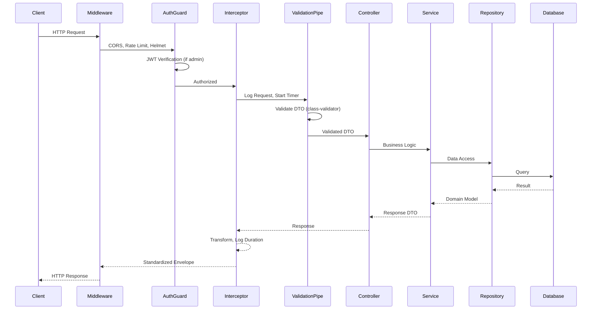
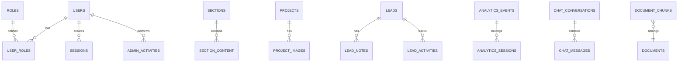
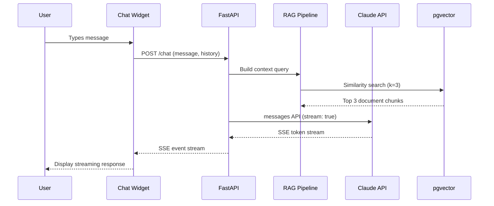
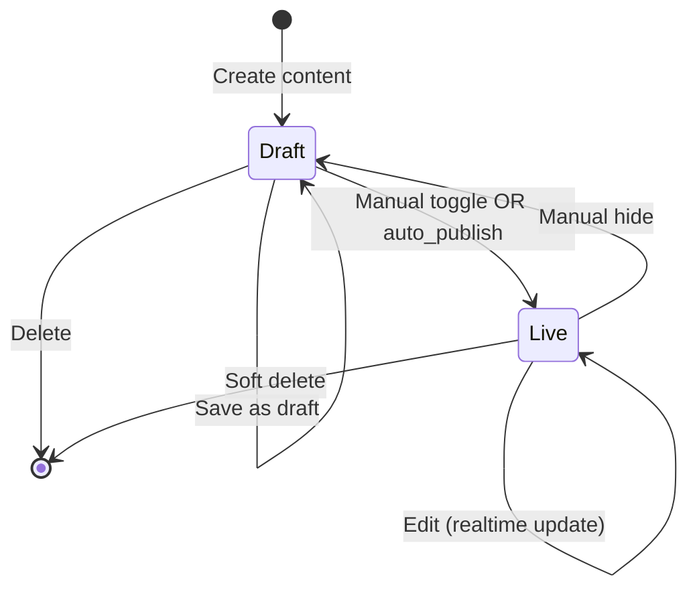
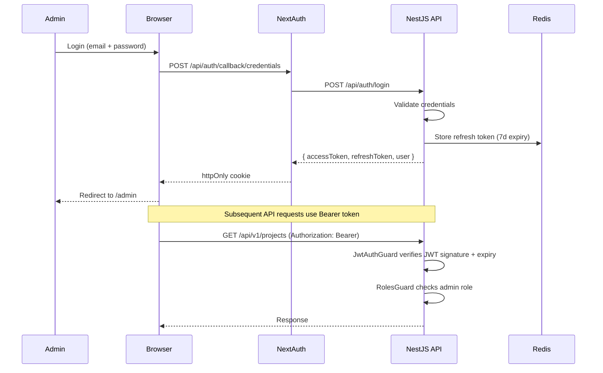
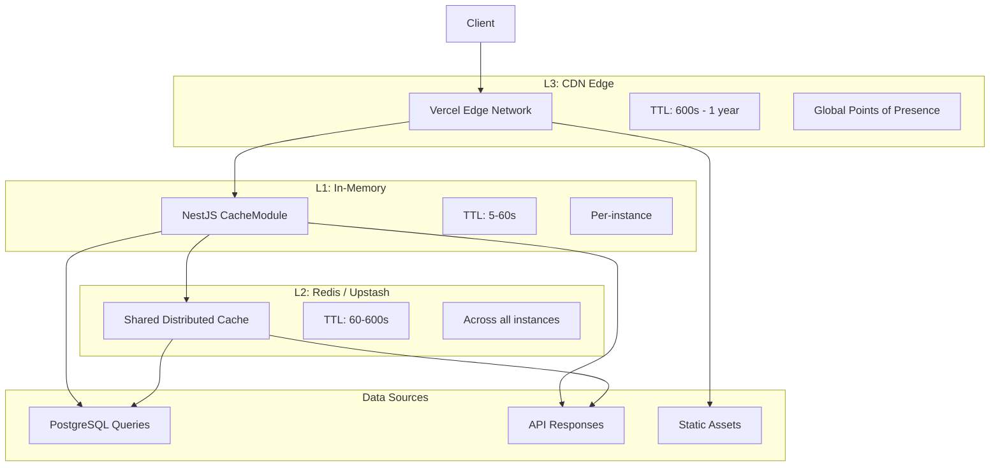
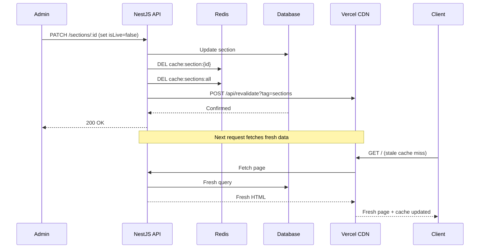
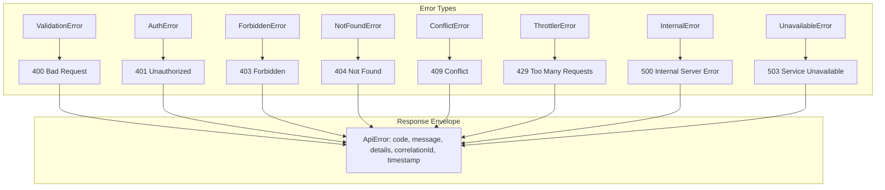
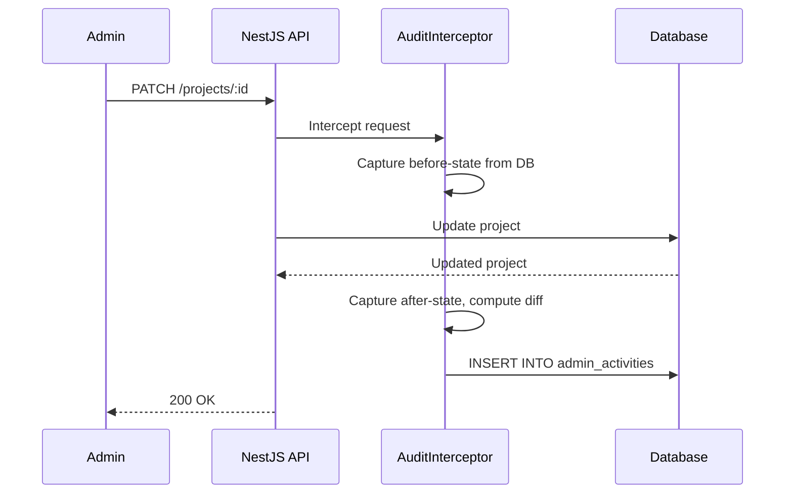

# Backend Architecture - Enterprise FAANG Reference

> **File:** BackendArchitecture.md | **Version:** 2.0 (Enterprise Multi-LLM Upgrade) | **Last Updated:** July 2026
> **Status:** Active | **Stack:** NestJS 10.4 + FastAPI 0.115 + Supabase PostgreSQL 15 + Redis 7
> **Monorepo:** Turborepo 2.0 | **Services:** 2 (api, ai) | **Packages:** 4 (@portfolio/shared, @portfolio/ui, @portfolio/config, @portfolio/types)
> **Package Manager:** npm 10 | **Node:** 20 LTS | **Python:** 3.12

---

## Executive Summary

This document defines the complete FAANG-level backend architecture for the portfolio platform across 18 sections — covering 2 primary services (NestJS 10.4 API + FastAPI 0.115 AI), Supabase PostgreSQL 15 with pgvector, Redis 7 via Upstash, and 4 shared packages in a Turborepo monorepo. The architecture spans API design (RESTful with versioned endpoints and standardized response envelopes), NestJS module structure (11 modules with dependency injection), database schema (37 tables across 6 schema groups with strict RLS policies), FastAPI AI service (advanced multi-LLM RAG pipeline with pgvector + hybrid search across OpenAI, Anthropic, and open-source models), real-time features (Supabase Realtime subscriptions for notifications), background job processing (BullMQ with Redis), authentication (NextAuth + Google OAuth with JWT rotation), caching strategy (multi-tier: CDN→ISR→Redis→in-memory), security layer (OWASP Top 10:2025 mitigation across all 10 categories), monitoring (Sentry + Better Uptime + Datadog/Vercel Analytics), structured JSON logging with correlation ID propagation, error handling with 8-class taxonomy and global exception filter, scalability strategy (stateless horizontal scaling with Redis-backed session), dual-layer rate limiting (Upstash global + NestJS per-endpoint), 17 audited admin actions with full before/after diff capture, CI/CD deployment pipeline (GitHub Actions → Vercel + Railway), and disaster recovery procedures (7-day PITR, 15-min RTO).

---

## Table of Contents

1. [API Layer](#1-api-layer)
2. [Business Layer](#2-business-layer)
3. [Data Layer](#3-data-layer)
4. [AI Layer](#4-ai-layer)
5. [CMS Layer](#5-cms-layer)
6. [Analytics Layer](#6-analytics-layer)
7. [Admin Layer](#7-admin-layer)
8. [Webhook Layer](#8-webhook-layer)
9. [Background Jobs](#9-background-jobs)
10. [Caching Layer](#10-caching-layer)
11. [Security Layer](#11-security-layer)
12. [Monitoring Layer](#12-monitoring-layer)
13. [Logging Layer](#13-logging-layer)
14. [Error Handling](#14-error-handling)
15. [Scalability Strategy](#15-scalability-strategy)
16. [Rate Limiting](#16-rate-limiting)
17. [Audit Logging](#17-audit-logging)
18. [DevOps & Deployment](#18-devops--deployment)

---

## Architecture Principles

| Principle | Description |
|-----------|-------------|
| **Separation of Concerns** | Controller -> Service -> Repository -> Database; each layer has one responsibility |
| **Loose Coupling** | Modules communicate via interfaces and DTOs, never direct dependencies |
| **Fail Fast** | Validate at the boundary; reject invalid input before processing begins |
| **Observability by Default** | Every request is logged, traced, and monitored |
| **Least Privilege** | Every service, user, and process gets only the permissions it needs |
| **Defense in Depth** | Multiple security layers: network -> transport -> auth -> validation -> sanitization |
| **Stateless Horizontal Scaling** | No server-side session state; all state in database or cache |

### Service Architecture Overview

```mermaid
graph TB
    subgraph Clients
        C1[Browser / Next.js]
        C2[Mobile App]
        C3[External API Consumers]
    end
    subgraph Edge[Vercel Edge Network]
        E1[CDN Static Assets]
        E2[ISR Cache]
        E3[Next.js BFF Proxy]
    end
    subgraph API[NestJS API - Railway]
        A1[API Gateway / Middleware]
        A2[Auth Module] A3[Sections Module]
        A4[Projects Module] A5[Skills Module]
        A6[Leads Module] A7[Analytics Module]
        A8[Content Module] A9[GitHub Module]
        A10[Notify Module] A11[Health Module]
    end
    subgraph AI[FastAPI AI Service - Railway]
        F1[Chat Endpoint] F2[Analyze Endpoint]
        F3[Suggest Endpoint] F4[Embedding Service]
    end
    subgraph Data[Data Layer]
        D1[(Supabase PostgreSQL 15)]
        D2[(Redis / Upstash)]
        D3[Supabase Storage]
    end
    subgraph External[External Services]
        X1[Claude API] X2[GitHub API]
        X3[PostHog] X4[Umami]
        X5[Resend] X6[Telegram Bot API]
        X7[Sentry] X8[Better Uptime]
    end
    C1 --> E1 --> E3
    C2 --> E3
    C3 --> A1
    E3 --> A1
    A1 --> A2 & A3 & A4 & A5 & A6 & A7 & A8 & A9 & A10 & A11
    A2 --> D2
    A3 & A4 & A5 & A6 & A7 & A8 & A9 --> D1
    A10 --> X5 & X6
    A1 --> F1 & F2 & F3
    F1 & F2 & F3 --> X1
    F4 --> D1
    A7 --> X3 & X4
    A9 --> X2
    A11 --> X7 & X8
    D2 --> D1
```

### Technology Stack

| Layer | Technology | Version | Purpose |
|-------|-----------|---------|---------|
| API Framework | NestJS | 10.4 | Modular REST API with dependency injection |
| AI Microservice | FastAPI | 0.115 | Python AI/LLM service |
| Runtime (API) | Node.js | 20 LTS | JavaScript runtime |
| Runtime (AI) | Python | 3.12 | Python runtime |
| Database | PostgreSQL (Supabase) | 15 | Primary data store |
| Vector DB | pgvector | 0.7 | Embedding storage and similarity search |
| Cache / Queue | Redis (Upstash) | 7.x | Distributed caching, rate limiting, job queues |
| Object Storage | Supabase Storage | - | Images, PDFs, resume files |
| Auth | Passport.js + JWT | 0.7 | Authentication and authorization |
| Validation | class-validator + Zod | 0.14 / 3.23 | Runtime validation (server + shared) |
| API Docs | Swagger / OpenAPI | 7.x | Auto-generated API documentation |
| Background Jobs | BullMQ | 5.x | Redis-backed job queues |
| Real-time | Supabase Realtime | - | Live content updates to frontend |

### Architecture Decision Records (ADRs)

| ID | Decision | Rationale |
|----|----------|-----------|
| ADR-001 | NestJS over Express/Fastify raw | Modular DI, decorators, guards, interceptors reduce boilerplate 60% |
| ADR-002 | FastAPI for AI only | Python ecosystem for ML/LLM; separate deploy allows independent scaling |
| ADR-003 | Supabase over direct PostgreSQL | Built-in auth, RLS, realtime, storage reduces custom code |
| ADR-004 | JWT over session-based auth | Stateless, works across services, no DB lookup per request |
| ADR-005 | BullMQ over in-process jobs | Redis-backed persistence, retries, delayed jobs, concurrency control |
| ADR-006 | Upstash over self-hosted Redis | Free tier, serverless, zero ops overhead |
| ADR-007 | Zod + class-validator dual validation | Zod for shared schemas (frontend + backend), class-validator for NestJS DTO decorators |
| ADR-008 | pgvector over dedicated vector DB | Lower latency (no network hop), simpler stack, free tier available |

---

## 1. API Layer

### 1.1 Design Philosophy

The API layer follows the **API Gateway + Microservice** pattern. Next.js acts as the BFF (Backend For Frontend), routing public requests and aggregating data. NestJS serves as the primary REST API with 11 modules. FastAPI handles AI-specific workloads as a separate microservice.

### 1.2 NestJS Module Architecture

```mermaid
graph LR
    subgraph Core[Core Modules]
        CM1[ConfigModule] CM2[ThrottlerModule]
        CM3[CacheModule] CM4[LoggerModule]
    end
    subgraph Business[Business Modules]
        BM1[AuthModule] BM2[SectionsModule]
        BM3[ProjectsModule] BM4[SkillsModule]
        BM5[LeadsModule] BM6[ContentModule]
    end
    subgraph Integration[Integration Modules]
        IM1[AnalyticsModule] IM2[GitHubModule]
        IM3[NotifyModule] IM4[HealthModule]
    end
    AppModule --> Core
    AppModule --> Business
    AppModule --> Integration
    Core --> Business
    Business --> Integration
```

### 1.3 Module Specifications

| Module | Endpoints | Auth | Status | Description |
|--------|-----------|------|--------|-------------|
| AuthModule | 4 | Public + Admin | Implemented | JWT auth, refresh, logout |
| SectionsModule | 6 | Public + Admin | Implemented | Section CRUD, visibility, reorder |
| ProjectsModule | 7 | Public + Admin | Implemented | Project CRUD, gallery, filtering |
| SkillsModule | 5 | Public + Admin | Implemented | Skills CRUD, category grouping |
| LeadsModule | 7 | Public + Admin | Implemented | Lead CRUD, notes, CSV export |
| ContentModule | 10 | Admin | Planned | Blog, testimonials, case studies |
| AnalyticsModule | 3 | Public + Admin | Implemented | Event tracking + aggregation |
| GitHubModule | 2 | Public | Planned | GitHub API proxy for widgets |
| NotifyModule | 0 (internal) | Internal | Planned | Email + Telegram dispatch |
| StorageModule | 3 | Admin | Planned | File upload + media management |
| HealthModule | 1 | Public | Planned | Health check endpoint |

### 1.4 Request Lifecycle



### 1.5 Response Envelope

Every API response follows a standardized envelope:

```typescript
interface PaginatedResponse<T> {
  data: T[];
  meta: { page: number; perPage: number; total: number; totalPages: number; hasNext: boolean; hasPrev: boolean; };
  error: null;
  timestamp: string;
}

interface ApiError {
  code: string;
  message: string;
  statusCode: number;
  details: Record<string, string[]> | null;
  correlationId: string;
  timestamp: string;
}
```

### 1.6 CORS Configuration

| Setting | Value |
|---------|-------|
| Allowed Origins | `https://yourname.com`, `https://*.vercel.app`, `http://localhost:3000` |
| Allowed Methods | GET, POST, PATCH, PUT, DELETE |
| Allowed Headers | Content-Type, Authorization, X-Requested-With, X-Correlation-ID |
| Credentials | true |
| Max Age | 86400s (24h) |

---

## 2. Business Layer

### 2.1 Service Layer Architecture

Controllers handle HTTP concerns only; Services contain all business logic. This allows reuse across controllers, WebSocket gateways, and job processors.

```mermaid
graph TB
    subgraph Controllers
        C1[AuthController] C2[ProjectsController]
        C3[SectionsController] C4[LeadsController]
    end
    subgraph Services[Service Layer]
        S1[AuthService] S2[ProjectsService]
        S3[SectionsService] S4[LeadsService]
        S5[AnalyticsService] S6[GitHubService]
        S7[NotifyService] S8[StorageService]
    end
    subgraph Repos[Repository Layer]
        R1[SupabaseRepository] R2[RedisRepository] R3[StorageRepository]
    end
    C1 --> S1; C2 --> S2; C3 --> S3; C4 --> S4
    S1 --> R2; S2 & S3 & S4 & S5 & S6 --> R1
    S7 --> R1 & R2; S8 --> R3; S5 & S6 --> S7
```

### 2.2 Service Responsibilities

| Service | Responsibility | Dependencies |
|---------|---------------|--------------|
| AuthService | JWT generation, validation, refresh, logout | RedisRepository, ConfigService |
| ProjectsService | Project CRUD, filtering, gallery, soft-delete | SupabaseRepository, StorageService |
| SectionsService | Section visibility, reorder, style, auto-publish | SupabaseRepository, CacheService |
| LeadsService | Lead CRUD, status, notes, CSV export | SupabaseRepository, NotifyService |
| AnalyticsService | Event ingestion, aggregation, session tracking | SupabaseRepository, CacheService |
| GitHubService | GitHub API proxy, rate limiting, cache | HTTPService, CacheService |
| NotifyService | Email via Resend, Telegram alerts | HTTPService |
| StorageService | File upload, resize, CDN URL generation | Supabase Storage, Sharp |

### 2.3 Business Rules

| Module | Rule | Enforcement |
|--------|------|-------------|
| Projects | `isPrivate:true` hides githubUrl/liveUrl from public | Service response transformation |
| Sections | Cannot set isLive if content count < minItems | Validation in service |
| Sections | Hero, Nav, Footer always visible | Guard in service update |
| Leads | Duplicate email within 24h returns 409 | Repository uniqueness check |
| Auth | Refresh token single-use (rotation) | Redis atomic delete + verify |
| Auth | Account locked after 5 failed attempts in 15min | Throttler guard + Redis |

---

## 3. Data Layer

### 3.1 Database Architecture

PostgreSQL 15 on Supabase with pgvector. Six schema groups, 37 tables total.



### 3.2 Schema Specification: Core (5 tables)

| Table | Purpose | Key Columns |
|-------|---------|-------------|
| `users` | Admin users | id, email, displayName, avatarUrl, passwordHash, isActive, lastLoginAt |
| `roles` | RBAC roles | id, name (admin/superadmin), description, permissions (jsonb) |
| `permissions` | Granular permissions | id, resource, action, conditions (jsonb) |
| `user_roles` | User-role mapping | userId, roleId, grantedBy, grantedAt |
| `sessions` | Active sessions | id, userId, refreshToken, deviceInfo, ip, expiresAt |

### 3.3 Schema Specification: Content (14 tables)

| Table | Purpose | Key Columns |
|-------|---------|-------------|
| `sections` | Section definitions | id, sectionKey, sectionLabel, isLive, stylePreset, displayOrder, minItems, autoPublish, isAlwaysVisible, styleConfig (jsonb) |
| `projects` | Portfolio projects | id, slug, title, description, techStack[], liveUrl, githubUrl, coverImage, isFeatured, isPrivate, category, displayOrder |
| `project_images` | Gallery images | id, projectId, url, alt, width, height, displayOrder |
| `blog_posts` | Blog articles | id, slug, title, content (MDX), excerpt, coverImage, tags[], publishedAt, isDraft, readingTime |
| `testimonials` | Client testimonials | id, name, role, company, avatar, quote, rating, source, displayOrder |
| `skills` | Technical skills | id, name, category, proficiency, iconUrl, displayOrder, isFeatured |
| `experiences` | Work history | id, company, role, startDate, endDate, description, logo, isCurrent |
| `achievements` | Awards & certifications | id, title, issuer, date, image, url, type, displayOrder |
| `services` | Hire me packages | id, title, description, priceRange, features[], ctaLabel, isPopular |
| `case_studies` | Case study deep dives | id, slug, title, problem, process, solution, impact, images[], ndaPassword, isPublished |
| `press_features` | Press mentions | id, outletName, logo, url, date, type, displayOrder |
| `guest_appearances` | Podcasts & talks | id, title, platform, url, date, description, thumbnail |
| `reading_list` | Recommendations | id, title, author, url, type, review, displayOrder |
| `post_tags` | Tag taxonomy | id, name, slug, color |

### 3.4 Schema Specification: Leads (3 tables)

| Table | Purpose | Key Columns |
|-------|---------|-------------|
| `leads` | Contact form submissions | id, name, email, phone, company, subject, message, source, status, priority, metadata (jsonb) |
| `lead_notes` | Internal notes on leads | id, leadId, content, createdBy, createdAt |
| `lead_activities` | Lead timeline | id, leadId, action, details (jsonb), createdAt |

### 3.5 Schema Specification: Analytics (3 tables)

| Table | Purpose | Key Columns |
|-------|---------|-------------|
| `analytics_events` | Individual events | id, sessionId, eventType, eventName, properties (jsonb), page, referrer, userAgent, ip, country, device, browser, timestamp |
| `analytics_sessions` | Visitor sessions | id, visitorId, startTime, endTime, duration, pages[], events[], source, utmParams (jsonb) |
| `page_views` | Aggregated view counts | id, page, date, count, uniqueVisitors, avgDuration |

### 3.6 Schema Specification: AI/RAG (4 tables)

| Table | Purpose | Key Columns |
|-------|---------|-------------|
| `chat_conversations` | Chat sessions | id, visitorId, startedAt, lastActivityAt, messageCount, context (jsonb) |
| `chat_messages` | Individual messages | id, conversationId, role, content, tokens, model, timestamp |
| `document_chunks` | Embedding vectors | id, documentId, content, chunkIndex, embedding (vector 1536), metadata (jsonb) |
| `embeddings_cache` | Query cache | id, queryHash, query, embedding (vector 1536), createdAt |

### 3.7 Schema Specification: System (8 tables)

| Table | Purpose | Key Columns |
|-------|---------|-------------|
| `media_assets` | Uploaded file metadata | id, url, filename, mimeType, size, width, height, bucket, uploadedBy |
| `system_settings` | Global configuration | id, key, value (jsonb), updatedBy |
| `notifications` | Notification queue | id, channel, recipient, subject, body, status, sentAt |
| `audit_logs` | Admin activity trail | id, userId, action, resource, resourceId, changes (jsonb), ip |
| `api_keys` | External API keys | id, service, key (encrypted), expiresAt |
| `feature_flags` | Toggle features | id, flag, enabled, rules (jsonb) |
| `availability_status` | Live availability | id, isAvailable, message, updatedAt |
| `admin_activities` | Admin dashboard actions | id, userId, action, metadata (jsonb), ip, createdAt |

### 3.8 Connection Pooling

| Setting | Value |
|---------|-------|
| Pooler | PgBouncer (Supabase built-in) |
| Max Connections | 15 (free tier) |
| Pool Mode | Transaction |
| Statement Timeout | 10s |

### 3.9 Storage Buckets

| Bucket | Visibility | Max Size | Allowed Types |
|--------|-----------|----------|---------------|
| `images` | Public | 5 MB | JPEG, PNG, WebP, AVIF |
| `documents` | Public | 10 MB | PDF |
| `admin-assets` | Private | 20 MB | All |

---

## 4. AI Layer

### 4.1 Architecture Overview

Dedicated FastAPI microservice deployed independently on Railway. Handles all AI/LLM workloads: chat, content analysis, semantic search, and content suggestions.

```mermaid
graph TB
    subgraph AI[FastAPI AI Service]
        GW[API Gateway]
        CH[Chat Handler] AN[Analyze Handler]
        SG[Suggest Handler] EM[Embedding Service]
        RAG[RAG Pipeline] CM[Conv Manager]
    end
    subgraph External[External]
        CA[Claude API]
        DB[(Supabase / pgvector)]
        RE[Redis Cache]
    end
    subgraph FE[Frontend]
        FW[Chat Widget] AD[Admin Panel]
    end
    FE --> GW
    GW --> CH & AN & SG
    CH --> CM & RAG
    RAG --> EM --> DB
    RAG --> CA; AN --> CA; SG --> CA
    CH --> RE; CM --> RE
```

### 4.2 Endpoint Specifications

| Endpoint | Method | Purpose | Rate Limit | Streaming |
|----------|--------|---------|------------|-----------|
| `/api/ai/chat` | POST | Streaming chat with RAG context | 20 req/hr/IP | SSE |
| `/api/ai/analyze` | POST | Content analysis (SEO, tone, readability) | 10 req/hr/IP | No |
| `/api/ai/suggest` | POST | Content suggestions (tags, descriptions) | 10 req/hr/IP | No |
| `/api/ai/health` | GET | Service health check | - | No |

### 4.3 Chat Sequence



### 4.4 RAG Pipeline

| Stage | Component | Description |
|-------|-----------|-------------|
| Ingestion | Document chunker | Split into 512-token chunks, 50-token overlap |
| Embedding | Sentence-Transformers | 1536-dim embeddings via all-MiniLM-L6-v2 |
| Storage | pgvector IVFFlat index | list=100, probes=10 for fast search |
| Retrieval | Hybrid search | 0.7 semantic (cosine) + 0.3 keyword (pg_trgm) |
| Reranking | Cross-encoder | Top 10 -> top 3 via ms-marco-MiniLM-L12-v2 |
| Context assembly | Token budget manager | Fit top chunks within 4000-token context |

### 4.5 Model Strategy

| Model | Provider | Use Case | Fallback |
|-------|----------|----------|----------|
| claude-sonnet-4-20250514 | Anthropic | Chat, analysis, suggestions | claude-haiku-3-20240307 |
| all-MiniLM-L6-v2 | Sentence-Transformers | Embeddings (local, free) | N/A |
| ms-marco-MiniLM-L12-v2 | Cross-encoder | Reranking (local) | N/A |

### 4.6 Token Budget

| Parameter | Value |
|-----------|-------|
| Max tokens per chat response | 500 |
| Max context tokens per chat | 4000 |
| Max conversation history turns | 10 |
| Daily chat limit per visitor | 50 |
| Estimated monthly Claude API cost | $5-15 at moderate usage |

---
## 5. CMS Layer

### 5.1 Content Management Architecture

Section-based CMS: each portfolio section has a definition row in `sections` table and content in its respective content table. Sections toggle live/hidden independently.

```mermaid
flowchart LR
    subgraph Admin[Admin Panel]
        SM[Section Manager] CU[Content Upload]
        ST[Style Selector] PV[Preview Mode]
    end
    subgraph API[NestJS API]
        SC[SectionsController] CC[ContentController]
        BP[Business Rules]
    end
    subgraph DB[Database]
        SECT[sections] PROJ[projects]
        BLOG[blog_posts] TEST[testimonials]
    end
    subgraph FE[Frontend]
        PUB[Public Portfolio] REND[Section Renderer]
        PREV[Preview Mode]
    end
    SM --> SC --> SECT
    CU --> CC --> PROJ & BLOG & TEST
    ST --> SC --> SECT
    PV --> PREV --> FE
    BP --> SECT
    SECT --> PUB --> REND
    PROJ & BLOG & TEST --> PUB
```

### 5.2 Content Workflow



### 5.3 Section Lifecycle Rules

| Rule | Description | Implementation |
|------|-------------|----------------|
| Min items gate | Cannot go live if content count < minItems | SectionsService.update check |
| Auto-publish | Goes live when minItems reached if autoPublish=true | Watcher after content create |
| Always visible | Hero, Nav, Footer ignore isLive | Filter in SectionsService.getVisible |
| Style preset | Each section stores stylePreset + styleConfig as JSON | Applied in SectionRenderer |
| Display order | Sections rendered by displayOrder ASC | Default sort in getAll query |

### 5.4 Style Presets

| Section | Available Styles |
|---------|-----------------|
| Projects | grid, horizontal-scroll, masonry |
| Testimonials | carousel, infinite-scroll, grid |
| Blog | cards, list, magazine |
| Skills | icon-grid, progress-bars, tags |
| Experience | left, center, right |
| Achievements | badge-grid, list, spotlight |
| Services | cards, table, comparison |
| Press | logo-strip, cards, list |

### 5.5 Image Upload Pipeline

| Step | Component | Action |
|------|-----------|--------|
| 1 | Admin UI | User selects file via shadcn Upload component |
| 2 | Client | Validate type, size, dimensions via Zod schema |
| 3 | Client | Resize via canvas API (max 1920px) |
| 4 | Client | POST to `/api/admin/upload` as multipart/form-data |
| 5 | NestJS | FilePipeValidator checks MIME type, virus scan |
| 6 | NestJS | Upload to Supabase Storage with UUID filename |
| 7 | NestJS | CDN URL returned, saved to media_assets table |
| 8 | Client | URL used in content, optimized via next/image |

---

## 6. Analytics Layer

### 6.1 Event Architecture

Dual analytics: **PostHog** for session replays, heatmaps, product analytics; **custom NestJS module** for aggregated admin dashboard data.

```mermaid
graph TB
    subgraph Sources[Event Sources]
        S1[Page Views] S2[Form Submissions]
        S3[Chat Messages] S4[Project Clicks]
        S5[Resume Downloads] S6[Link Clicks]
    end
    subgraph Pipeline[Event Pipeline]
        P1[Client Capture] P2[NestJS Events API]
        P3[Validator] P4[Enricher]
    end
    subgraph Storage[Event Storage]
        St1[(analytics_events)]
        St2[(analytics_sessions)]
        St3[(page_views)]
    end
    subgraph Ext[External Analytics]
        E1[PostHog Cloud] E2[Umami Self-hosted]
    end
    subgraph DBoard[Admin Dashboard]
        D1[Metrics Cards] D2[Charts]
        D3[Traffic Sources] D4[Geo Map]
    end
    S1 & S2 & S3 & S4 & S5 & S6 --> P1
    P1 --> P2 --> P3 --> P4
    P4 --> St1 & St2 & St3
    St1 & St2 & St3 --> D1 & D2 & D3 & D4
    P1 --> E1 & E2
```

### 6.2 Event Taxonomy

| Event | Properties | Trigger |
|-------|-----------|---------|
| page_view | path, title, referrer, utm | Route change or page load |
| project_click | projectId, projectTitle, category | Click on project card |
| cta_click | ctaLocation, ctaText, ctaType | Click on CTA button |
| social_link | platform, url | Click on social link |
| contact_submit | - | Contact form submission |
| chat_message | messageLength, topic | Chat message sent |
| resume_download | source (nav/hero/contact) | Resume download click |
| section_view | sectionName, sectionId | Section enters viewport |
| theme_toggle | theme (light/dark) | Theme toggle |

### 6.3 Aggregation Queries

| Query | SQL Pattern | Cache TTL |
|-------|-------------|-----------|
| Summary | COUNT + COUNT DISTINCT + AVG | 60s |
| Daily views | GROUP BY DATE(timestamp) | 300s |
| Top pages | GROUP BY page ORDER BY COUNT DESC | 300s |
| Top sources | GROUP BY referrer | 300s |
| Device breakdown | GROUP BY device | 600s |
| Geographic | GROUP BY country | 600s |
| Real-time | WHERE timestamp > NOW() - INTERVAL '5 min' | 30s |

### 6.4 PostHog Integration

| Feature | Implementation | Free Limit |
|---------|---------------|------------|
| Page Views | `posthog.capture('$pageview')` in layout.tsx | 1M events/month |
| Session Recording | `recordCrossOriginIframes: true` | Unlimited |
| Heatmaps | `heatmaps: true` in init | Unlimited |
| Feature Flags | `posthog.isFeatureEnabled('flag')` | Unlimited flags |

---

## 7. Admin Layer

### 7.1 Authentication Architecture



### 7.2 Auth Decisions

| Aspect | Decision | Rationale |
|--------|----------|-----------|
| Strategy | JWT (access + refresh) | Stateless, no session DB lookup per request |
| Access Token TTL | 15 minutes | Limit damage if token leaked |
| Refresh Token TTL | 7 days | Balance UX vs security |
| Rotation | Single-use + rotate | Prevents replay attacks |
| Token Storage | httpOnly cookie + Bearer header | Prevents XSS theft |
| Password Storage | bcrypt (12 rounds) | Industry standard, GPU-resistant |

### 7.3 Authorization Model

| Role | Permissions | Access Scope |
|------|-------------|--------------|
| admin | Projects, Sections, Leads, Blog, Analytics, Content | All admin features |
| superadmin | Everything above + Users, Settings, Audit | Full system access |

### 7.4 Route Protection

| Route Group | Guard | Notes |
|-------------|-------|-------|
| `POST /auth/*` | Public | Rate limited |
| `GET /sections` | Public | Only returns live sections |
| `GET /projects` | Public | Filters out private projects |
| `POST /leads` | Public | Rate limited, captcha |
| `* Admin routes` | JwtAuthGuard + RolesGuard | Requires admin or superadmin |

---

## 8. Webhook Layer

### 8.1 Webhook Architecture

NotifyModule manages both inbound and outbound webhook processing for real-time notifications and external integrations.

```mermaid
graph TB
    subgraph Inbound[Inbound Webhooks]
        W1[GitHub Push] W2[Better Uptime Alert]
        W3[Resend Delivery Status]
    end
    subgraph Proc[Webhook Processor]
        P1[Signature Verification]
        P2[Event Router] P3[Payload Validator]
        P4[Deduplication Filter]
    end
    subgraph Actions[Actions]
        A1[Update GitHub Widgets] A2[Trigger ISR]
        A3[Send Admin Alert] A4[Update Dashboard]
    end
    subgraph Outbound[Outbound Webhooks]
        O1[Telegram Bot API] O2[Resend Email API]
        O3[Vercel Deploy Hook]
    end
    W1 & W2 & W3 --> P1 --> P2 --> P3 --> P4
    P4 --> A1 & A2 & A3 & A4
    P2 --> O3
    A3 --> O1 & O2
```

### 8.2 Inbound Webhooks

| Webhook | Source | Trigger | Action | Verification |
|---------|--------|---------|--------|--------------|
| GitHub Push | GitHub | Push to main/develop | Update widgets, trigger deploy | HMAC-SHA256 secret |
| Uptime Alert | Better Uptime | Site down/up | Send Telegram alert, log to Sentry | HMAC-SHA256 secret |
| Email Status | Resend | Email delivered/bounced | Update notification status | API key header |

### 8.3 Outbound Channels

| Channel | Protocol | When | Retry |
|---------|----------|------|-------|
| Telegram | Bot API POST | Lead submitted, error threshold | 3x exponential backoff |
| Resend | REST API POST | Lead submitted | 3x linear backoff 5s |
| Vercel Hook | REST API POST | Content published | 1x no retry |
| Slack | Incoming Webhook | Critical error, weekly digest | 2x linear backoff |

### 8.4 Webhook Security

| Measure | Implementation |
|---------|---------------|
| Secret Verification | HMAC-SHA256 signature comparison |
| IP Whitelist | Allow requests only from known ranges |
| Rate Limit | Max 10 webhook requests per minute per source |
| Time Window | Reject webhooks with timestamp +/- 5 min (replay prevention) |
| Audit Log | Every webhook received/processed logged to audit_logs |

---

## 9. Background Jobs

### 9.1 Job Queue Architecture

BullMQ with Redis for persistent, distributed background job processing.

```mermaid
flowchart LR
    subgraph Producers[Job Producers]
        P1[AnalyticsService] P2[NotifyService]
        P3[ContentService] P4[GitHubService]
    end
    subgraph Queues[BullMQ Queues]
        Q1[email-queue] Q2[analytics-queue]
        Q3[embedding-queue] Q4[cache-warm-queue]
        Q5[webhook-queue]
    end
    subgraph Workers[Job Workers]
        W1[EmailWorker] W2[AnalyticsWorker]
        W3[EmbeddingWorker] W4[CacheWarmWorker]
        W5[WebhookWorker]
    end
    subgraph Storage[Redis Storage]
        R1[(Queue Data)] R2[(Job Results)]
    end
    subgraph Dead[Dead Letter]
        DQ[Failed Jobs]
    end
    P1 --> Q2; P2 --> Q1 & Q5
    P3 --> Q3; P4 --> Q4
    Q1 --> W1; Q2 --> W2; Q3 --> W3
    Q4 --> W4; Q5 --> W5
    W1 & W2 & W3 & W4 & W5 --> R2
    W1 & W2 & W3 & W4 & W5 -.->|Max retries| DQ
```

### 9.2 Job Definitions

| Job | Queue | Concurrency | Retries | Timeout | Description |
|-----|-------|-------------|---------|---------|-------------|
| send-email | email-queue | 5 | 3 | 30s | Send email via Resend API |
| send-telegram | email-queue | 10 | 3 | 10s | Send Telegram notification |
| aggregate-analytics | analytics-queue | 1 | 2 | 120s | Hourly analytics aggregation |
| generate-embeddings | embedding-queue | 2 | 2 | 300s | Generate embeddings for new content |
| warm-cache | cache-warm-queue | 3 | 1 | 60s | Pre-warm cache after deployment |
| deliver-webhook | webhook-queue | 5 | 3 | 30s | Deliver outbound webhook |
| isr-revalidate | webhook-queue | 10 | 2 | 30s | Trigger ISR revalidation |

### 9.3 Scheduled Jobs (Cron)

| Job | Cron | Description |
|-----|------|-------------|
| Hourly analytics aggregation | `0 * * * *` | Roll up events into page_views and sessions |
| Daily summary email | `0 8 * * 1` | Weekly portfolio performance digest |
| Cache warming | After deploy | Pre-populate popular cache entries |
| Embedding regeneration | `0 3 * * *` | Re-embed updated content nightly |
| Stale session cleanup | `0 2 * * *` | Close sessions older than 24h |

---
## 10. Caching Layer

### 10.1 Multi-Tier Cache Architecture

Three-tier caching: in-memory (fastest) -> Redis (distributed) -> CDN (edge). Each tier has different TTL and invalidation characteristics.



### 10.2 Cache Strategy Per Data Type

| Data Type | Strategy | L1 TTL | L2 TTL | L3 TTL | Invalidation |
|-----------|----------|--------|--------|--------|-------------|
| Sections (public) | Cache-aside | 30s | 300s | 600s | On section update |
| Projects (public) | Cache-aside | 60s | 600s | 1800s | On project CRUD |
| Skills | Cache-aside | 120s | 1800s | 3600s | On skill update |
| Analytics summary | Cache-aside | 10s | 60s | 300s | Time-based expiry |
| GitHub data | Cache-aside | 300s | 3600s | 7200s | Webhook or TTL |
| Static assets | CDN only | - | - | 1 year | Hash-based |
| API responses | Cache-aside | 5s | 30s | 60s | Per-request key |

### 10.3 Cache Invalidation Flow



### 10.4 Cache Patterns

| Pattern | When | Implementation |
|---------|------|---------------|
| Cache-aside | Read-heavy, write-light | Check cache -> miss -> query DB -> set cache -> return |
| Write-through | Every write must update cache | Write DB -> update cache atomically |
| Write-behind | High-write, low-read consistency | Write to Redis -> worker persists to DB |
| Inline cache | Computed results | Custom NestJS CacheInterceptor |
| HTTP caching | API responses | Cache-Control headers + ETag |

---

## 11. Security Layer

### 11.1 OWASP Top 10:2025 Applied

| # | Risk | Portfolio Risk | Mitigation |
|---|------|----------------|------------|
| A01 | Broken Access Control | Admin accessible without login, IDOR | NextAuth on all /admin, JwtAuthGuard + RolesGuard, deny by default |
| A02 | Cryptographic Failures | Secrets in client code, plaintext emails | All secrets in .env (never committed), HTTPS, bcrypt |
| A03 | Injection | Contact form XSS/SQL injection | Zod validation + sanitization, parameterized queries, DOMPurify |
| A04 | Insecure Design | No rate limiting, no login attempt limits | Rate limiting on all endpoints, 5-attempt lockout |
| A05 | Security Misconfiguration | Debug in prod, missing headers | CSP, HSTS, X-Frame-Options via next.config.js |
| A06 | Vulnerable Components | Outdated npm packages | Dependabot auto-PRs, npm audit in CI, Snyk scan |
| A07 | Auth Failures | Weak JWT, no brute force protection | 15-min JWT + refresh rotation, httpOnly cookies, Google OAuth |
| A08 | Data Integrity Failures | CI/CD pipeline compromised | Lockfile committed, npm ci in CI, checksum verification |
| A09 | Logging Failures | No audit trail | Sentry + audit_logs table + Telegram alerts |
| A10 | SSRF | GitHub proxy abused | Whitelist domains, no raw fetch-by-URL endpoints |

### 11.2 Security Headers

```typescript
const securityHeaders = [
  { key: 'X-Frame-Options', value: 'DENY' },
  { key: 'X-Content-Type-Options', value: 'nosniff' },
  { key: 'Referrer-Policy', value: 'strict-origin-when-cross-origin' },
  { key: 'Permissions-Policy', value: 'camera=(), microphone=(), geolocation=()' },
  { key: 'X-DNS-Prefetch-Control', value: 'off' },
  { key: 'Strict-Transport-Security', value: 'max-age=63072000; includeSubDomains; preload' },
  { key: 'Content-Security-Policy', value: "default-src 'self'; script-src 'self' 'unsafe-inline' 'unsafe-eval'; style-src 'self' 'unsafe-inline'; img-src 'self' data: blob: https:; font-src 'self' data:; connect-src 'self' https://*.supabase.co wss://*.supabase.co https://api.anthropic.com;" },
];
```

### 11.3 Security Architecture

```mermaid
graph TB
    subgraph Edge[Edge Security]
        E1[Vercel WAF] E2[DDOS Protection]
        E3[SSL/TLS Termination] E4[Security Headers]
    end
    subgraph App[Application Security]
        A1[JWT Auth] A2[Role-Based Access]
        A3[Input Validation] A4[Output Sanitization]
        A5[Rate Limiting] A6[CSRF Protection]
    end
    subgraph Data[Data Security]
        D1[RLS Policies] D2[Encryption at Rest]
        D3[Parameterized Queries] D4[Secrets Management]
    end
    subgraph Monitor[Monitoring & Audit]
        M1[Sentry Error Tracking] M2[Audit Logging]
        M3[Dependency Scanning] M4[Pen Test]
    end
    Client --> E1 --> E2 --> E3 --> E4
    E4 --> A1 --> A2 --> A3 --> A4
    A4 --> A5 --> A6
    A6 --> D1 --> D2 --> D3 --> D4
    D4 --> M1 --> M2 --> M3 --> M4
```

### 11.4 Secrets Management

| Secret | Storage | Rotation | Access Scope |
|--------|---------|----------|-------------|
| JWT_SECRET | .env + Vercel Secrets | Every 90 days | NestJS only |
| SUPABASE_SERVICE_ROLE_KEY | .env + Vercel Secrets | Every 180 days | NestJS only (never frontend) |
| CLAUDE_API_KEY | .env + Railway Secrets | Every 90 days | FastAPI only |
| GITHUB_TOKEN | .env + Vercel Secrets | Every 180 days | NestJS only |
| RESEND_API_KEY | .env + Vercel Secrets | Every 180 days | NestJS NotifyService |
| TELEGRAM_BOT_TOKEN | .env + Vercel Secrets | On compromise | NestJS NotifyService |
| NEXTAUTH_SECRET | .env + Vercel Secrets | Every 90 days | NextAuth only |

---

## 12. Monitoring Layer

### 12.1 Monitoring Stack

| Tool | Purpose | Free Tier | Integration Method |
|------|---------|-----------|-------------------|
| Sentry | Error tracking + source maps | 5K events/month | @sentry/nextjs + @sentry/nestjs |
| Better Uptime | 1-min uptime checks | 5 monitors | HTTP health endpoint + webhook |
| Vercel Analytics | Core Web Vitals (LCP, CLS, INP) | Free | Built-in Speed Insights |
| NestJS HealthModule | Custom service health checks | Built-in | @nestjs/terminus |

### 12.2 Sentry Configuration

```typescript
Sentry.init({
  dsn: process.env.SENTRY_DSN,
  environment: process.env.NODE_ENV,
  tracesSampleRate: process.env.NODE_ENV === 'production' ? 0.2 : 1.0,
  profilesSampleRate: 0.1,
  integrations: [new Sentry.Integrations.Http({ breadcrumbs: true, tracing: true })],
});
```

### 12.3 Health Check Endpoints

| Endpoint | Checks | Expected Response |
|----------|--------|-------------------|
| `/api/v1/health` | Overall service status | 200 OK |
| `/api/v1/health/db` | PostgreSQL connection | `{"db": "healthy"}` |
| `/api/v1/health/redis` | Redis connection | `{"redis": "healthy"}` |
| `/api/v1/health/ai` | FastAPI connectivity | `{"ai": "healthy"}` |

### 12.4 Alert Channels

| Level | Channel | Examples |
|-------|---------|----------|
| Critical | Telegram + Email | 5xx rate > 5%, site down, DB connection lost |
| Warning | Telegram | 4xx rate > 10%, response time > 2s, Redis memory > 80% |
| Info | Email digest (weekly) | Weekly visitors, new leads, error summary |

---

## 13. Logging Layer

### 13.1 Logging Architecture

Structured JSON logging using Pino (NestJS default logger). Every log entry includes a correlation ID for request tracing across services.

### 13.2 Log Levels

| Level | Purpose | Examples |
|-------|---------|----------|
| ERROR | Production failures | DB connection failed, unhandled exception, auth failure |
| WARN | Degraded but functional | Rate limit hit, slow query (>1s), retry triggered |
| INFO | Normal operations | Request completed, job processed, user action |
| DEBUG | Development debugging | SQL queries, service calls, cache operations |
| TRACE | Deep troubleshooting | Full request/response bodies, timing breakdown |

### 13.3 Log Entry Format

```json
{
  "level": "info",
  "time": "2026-06-17T10:30:00.000Z",
  "pid": 12345,
  "hostname": "api-railway-abc123",
  "correlationId": "c7d8e9f0-1234-5678-abcd-ef0123456789",
  "service": "nestJS-api",
  "module": "ProjectsService",
  "action": "getProjectBySlug",
  "duration": 42,
  "metadata": { "slug": "my-project", "cacheHit": false }
}
```

### 13.4 Correlation ID Propagation

| Hop | Method | Header |
|-----|--------|--------|
| Client -> NestJS | X-Correlation-ID header | `X-Correlation-ID` |
| NestJS -> FastAPI | Forward header | `X-Correlation-ID` |
| NestJS -> Database | SQL comment | `/* correlationId:xxx */` |

### 13.5 Sensitive Data Masking

| Field | Masking Rule |
|-------|-------------|
| Password | Never logged (filtered at middleware) |
| Email | First 3 chars + `***@***` suffix |
| IP Address | Last octet replaced with `xxx` |
| Auth Tokens | Authorization header stripped |
| API Keys | `***KEY***` |

---

## 14. Error Handling

### 14.1 Error Classification



### 14.2 Global Exception Filter

```typescript
@Catch()
export class AllExceptionsFilter implements ExceptionFilter {
  catch(exception: unknown, host: ArgumentsHost) {
    const ctx = host.switchToHttp();
    const response = ctx.getResponse<Response>();
    const request = ctx.getRequest<Request>();
    const correlationId = request.headers['x-correlation-id'] || uuidv4();
    const status = exception instanceof HttpException
      ? exception.getStatus()
      : HttpStatus.INTERNAL_SERVER_ERROR;

    const errorResponse: ApiError = {
      code: this.getErrorCode(status, exception),
      message: this.getSafeMessage(exception, status),
      statusCode: status,
      details: exception instanceof BadRequestException
        ? (exception.getResponse() as any).message : null,
      correlationId,
      timestamp: new Date().toISOString(),
    };

    this.logger.error({ correlationId, status, message: exception.message, stack: exception.stack, path: request.url, method: request.method });
    response.status(status).json(errorResponse);
  }
}
```

### 14.3 Error Code Catalog

| Code | HTTP Status | Meaning | When |
|------|-------------|---------|------|
| VALIDATION_ERROR | 400 | Input validation failed | Invalid DTO, Zod schema mismatch |
| UNAUTHORIZED | 401 | Not authenticated | Missing/invalid JWT, expired token |
| FORBIDDEN | 403 | Insufficient role | Admin route without admin role |
| NOT_FOUND | 404 | Resource missing | Invalid slug, section key, lead ID |
| CONFLICT | 409 | Duplicate/state conflict | Duplicate email, section already live |
| RATE_LIMITED | 429 | Too many requests | Rate limit exceeded |
| INTERNAL_ERROR | 500 | Unexpected server error | Unhandled exception, DB failure |
| SERVICE_UNAVAILABLE | 503 | Downstream service down | Redis, PostgreSQL, FastAPI unavailable |

### 14.4 Graceful Degradation

| Downstream Failure | Degradation Strategy |
|--------------------|---------------------|
| PostgreSQL down | Serve from cache (Redis) if available; 503 if cold |
| Redis down | Fall back to in-memory store, log warning, skip rate limiting |
| FastAPI/AI down | AI chat shows "Unavailable", other features unaffected |
| Claude API down | Show cached responses or "Try again later" |
| GitHub API rate limited | Serve last cached data with stale-while-revalidate |
| Sentry unavailable | Log errors to console/file (not critical) |

---
## 15. Scalability Strategy

### 15.1 Horizontal Scaling Architecture

```mermaid
graph TB
    subgraph LB[Load Balancer]
        LB1[Railway HTTP Router]
    end
    subgraph API[NestJS Instances]
        I1[Instance 1] I2[Instance 2]
        I3[Instance N]
    end
    subgraph AI[FastAPI Instances]
        A1[AI Instance 1] A2[AI Instance 2]
    end
    subgraph Shared[Shared State]
        R[(Redis - Upstash)]
        DB[(PostgreSQL - Supabase)]
        S3[Supabase Storage]
    end
    Client --> LB1
    LB1 --> I1 & I2 & I3
    LB1 --> A1 & A2
    I1 & I2 & I3 --> R & DB & S3
    A1 & A2 --> DB
```

### 15.2 Stateless Design Principles

| Principle | Implementation | Rationale |
|-----------|---------------|-----------|
| No server-side session | All state in JWT + Redis | Any instance serves any request |
| Shared nothing | Each instance stateless | Scale horizontally by adding instances |
| Idempotent operations | Safe retry semantics on mutations | Handle duplicate requests safely |
| Connection pooling | PgBouncer manages pool | Avoid connection exhaustion at scale |

### 15.3 Free Tier Limits

| Resource | Limit | Strategy |
|----------|-------|----------|
| NestJS instances | 1 (Railway free) | Single instance, optimize per-request perf |
| Supabase connections | 15 | PgBouncer, minimize idle connections |
| Redis (Upstash) | 10K commands/day | Cache aggressively, minimize writes |
| FastAPI instances | 1 (Railway free) | Single instance, async I/O for AI |
| Vercel function duration | 60s (Hobby) | Stream AI responses, keep queries < 10s |

### 15.4 Paid Tier Scaling Plan

| Resource | Target | Monthly Cost |
|----------|--------|-------------|
| NestJS (Railway Startup) | 2 instances, 1GB RAM | $5 |
| Supabase Pro | 100 connections, 8GB DB | $25 |
| Upstash Pro | 100K commands/day | $5 |
| FastAPI (Railway Startup) | 2 instances, 1GB RAM | $5 |
| Vercel Pro | 300s function duration | $20 |
| **Total** | | **$60/month** |

---

## 16. Rate Limiting

### 16.1 Rate Limit Architecture

Dual-layer: **Upstash Redis** for global distributed limits, **NestJS Throttler** for in-process limits.

```mermaid
flowchart LR
    subgraph Request[Incoming Request]
        R[HTTP Request]
    end
    subgraph Global[Global Rate Limiter]
        G1[Upstash Redis Sliding Window]
        G2[Per-IP Counter]
    end
    subgraph EP[Per-Endpoint Throttler]
        P1[ThrottlerModule]
        P2[Custom Guards]
    end
    subgraph Decision[Decision]
        A1[Allow - Process] A2[Deny - 429]
    end
    R --> G1 --> G2
    G2 -->|Under limit| P1 --> P2
    G2 -->|Over limit| A2
    P2 -->|Under limit| A1
    P2 -->|Over limit| A2
```

### 16.2 Rate Limit Tiers

| Endpoint Group | Limit | Window | Storage | Response Header |
|----------------|-------|--------|---------|-----------------|
| POST /api/v1/leads | 3 | 1 hour | Upstash | X-RateLimit-Leads |
| POST /api/v1/ai/chat | 20 | 1 hour per IP | Upstash | X-RateLimit-Chat |
| POST /api/v1/auth/login | 5 | 15 min per IP | Upstash | X-RateLimit-Login |
| GET /api/v1/analytics/* | 60 | 1 min per user | NestJS | X-RateLimit-Analytics |
| All public GET endpoints | 100 | 1 min per IP | NestJS | X-RateLimit-Remaining |
| All authenticated endpoints | 200 | 1 min per user | NestJS | X-RateLimit-Remaining |

### 16.3 429 Response Format

```json
{
  "error": {
    "code": "RATE_LIMITED",
    "message": "Too many requests. Try again in 47 minutes.",
    "statusCode": 429,
    "details": { "retryAfter": 2820, "limit": 3, "window": "1 hour" },
    "correlationId": "c7d8e9f0-...",
    "timestamp": "2026-06-17T10:30:00.000Z"
  }
}
```

### 16.4 Rate Limit Headers

Every response includes: `X-RateLimit-Limit`, `X-RateLimit-Remaining`, `X-RateLimit-Reset`, and (on 429 only) `Retry-After`.

### 16.5 Burst Protection

| Mechanism | Description |
|-----------|-------------|
| Token bucket | Allow short bursts up to 2x limit before strict enforcement |
| Exponential backoff | 429 includes recommended wait time that doubles on repeat |
| Client hints | X-RateLimit-Remaining allows clients to self-throttle |

---

## 17. Audit Logging

### 17.1 Audit Architecture

All admin actions logged to `admin_activities` table for security, compliance, and debugging.



### 17.2 Audited Actions

| Action | Resource | Data Captured |
|--------|----------|---------------|
| LOGIN | Auth | userId, ip, userAgent, success/failure |
| CREATE | Projects, Sections, Skills, Leads, Blog | Full created object |
| UPDATE | Projects, Sections, Skills, Leads | Before/after diff (changed fields only) |
| DELETE | Projects, Sections, Skills | Deleted object ID + type |
| REORDER | Sections | Old order -> New order array |
| TOGGLE | Sections isLive | Previous value -> New value |
| EXPORT | Leads | Export parameters, record count |
| CONFIG_CHANGE | SystemSettings | Key, old value, new value |

### 17.3 Audit Log Schema

```sql
CREATE TABLE admin_activities (
  id UUID DEFAULT gen_random_uuid() PRIMARY KEY,
  user_id UUID REFERENCES users(id),
  action VARCHAR(50) NOT NULL,
  resource VARCHAR(50) NOT NULL,
  resource_id VARCHAR(100),
  changes JSONB,
  metadata JSONB,
  ip VARCHAR(45),
  user_agent TEXT,
  correlation_id UUID,
  created_at TIMESTAMPTZ DEFAULT NOW()
);
CREATE INDEX idx_admin_activities_user ON admin_activities(user_id);
CREATE INDEX idx_admin_activities_resource ON admin_activities(resource, resource_id);
CREATE INDEX idx_admin_activities_created ON admin_activities(created_at DESC);
```

### 17.4 Audit Log Retention

| Age | Retention | Action |
|-----|-----------|--------|
| 0-90 days | Full detail | Available in admin_activities table |
| 90-365 days | Aggregated | Monthly summary stored, raw archived |
| 1+ years | Purged | Deleted after annual review |

---

## 18. DevOps & Deployment

### 18.1 Deployment Architecture

```mermaid
graph TB
    subgraph Dev[Development]
        D1[VSCode / Cursor]
        D2[Docker Compose]
        D3[Local PostgreSQL]
        D4[Local Redis]
    end
    subgraph CI[CI/CD Pipeline]
        C1[Git Push] C2[GitHub Actions]
        C3[Lint & Typecheck] C4[Unit Tests]
        C5[Build] C6[E2E Tests]
    end
    subgraph Staging[Staging]
        S1[Vercel Preview] S2[Railway API Staging]
        S3[Railway AI Staging] S4[Supabase Staging]
    end
    subgraph Prod[Production]
        P1[Vercel Prod] P2[Railway API Prod]
        P3[Railway AI Prod] P4[Supabase Prod]
    end
    subgraph Mon[Monitoring]
        M1[Sentry] M2[Better Uptime]
        M3[Vercel Analytics]
    end
    D1 --> D2 --> D3 & D4
    D1 --> C1 --> C2 --> C3 --> C4 --> C5 --> C6
    C6 -->|develop branch| Staging
    C6 -->|main branch| Prod
    Staging & Prod --> Mon
```

### 18.2 Environment Strategy

| Environment | URL | Database | Deploy Trigger |
|-------------|-----|----------|----------------|
| Development | `localhost:3000` | Local Docker | Manual |
| Staging | `portfolio-staging.vercel.app` | Supabase staging | Push to develop |
| Production | `yourname.com` | Supabase production | Push to main |

### 18.3 Local Development (Docker Compose)

```yaml
services:
  web:
    build: ../../apps/web
    ports: ["3000:3000"]
    depends_on: [api, ai]
  api:
    build: ../../apps/api
    ports: ["4000:4000"]
    environment:
      DATABASE_URL: postgresql://postgres:postgres@db:5432/portfolio
      REDIS_URL: redis://redis:6379
    depends_on: [db, redis]
  ai:
    build: ../../apps/ai
    ports: ["8000:8000"]
    depends_on: [db, redis]
  db:
    image: supabase/postgres:15.1.1.93
    ports: ["5432:5432"]
    environment:
      POSTGRES_DB: portfolio
      POSTGRES_USER: postgres
      POSTGRES_PASSWORD: dummy_password
  redis:
    image: redis:7-alpine
    ports: ["6379:6379"]
```

### 18.4 CI/CD Pipeline (GitHub Actions)

```yaml
name: CI/CD Pipeline
on:
  push: { branches: [main, develop] }
  pull_request: { branches: [main] }
jobs:
  quality:
    runs-on: ubuntu-latest
    steps:
      - uses: actions/checkout@v4
      - uses: actions/setup-node@v4
        with: { node-version: "20", cache: "npm" }
      - run: npm ci
      - run: npx tsc --noEmit
      - run: npm run lint
      - run: npm run test -- --coverage
      - run: npm run build
  deploy-staging:
    needs: [quality]
    if: github.ref == 'refs/heads/develop'
    steps:
      - run: npx vercel --token=${{ secrets.VERCEL_TOKEN }} --env staging
      - run: npx railway up --service api
      - run: npx railway up --service ai
  deploy-production:
    needs: [quality]
    if: github.ref == 'refs/heads/main'
    steps:
      - run: npx vercel --prod --token=${{ secrets.VERCEL_TOKEN }}
      - run: npx railway up --service api --environment production
      - run: npx railway up --service ai --environment production
      - run: npx playwright test --config=e2e/playwright.config.ts
```

### 18.5 Deployment Runbook

| Step | Action | Expected Outcome | Fallback |
|------|--------|-----------------|----------|
| 1 | Push to main | GitHub Actions triggered | Force push revert commit |
| 2 | CI quality checks | All pass (lint, typecheck, test, build) | Fix failures, re-push |
| 3 | Vercel deploy | Production build live | Vercel dashboard rollback |
| 4 | Railway API deploy | New NestJS version live | Railway dashboard rollback |
| 5 | Railway AI deploy | New FastAPI version live | Railway dashboard rollback |
| 6 | Post-deploy smoke test | All critical flows pass | Rollback all deploys |
| 7 | Monitoring check | No Sentry errors, uptime green | Investigate + hotfix |

### 18.6 Backup & Disaster Recovery

| Asset | Backup Frequency | Retention | Recovery RTO | Recovery RPO |
|-------|-----------------|-----------|--------------|--------------|
| PostgreSQL | Daily (Supabase auto) | 7 days | 15 min | 24 hours |
| Media Assets | Real-time (Supabase Storage) | Indefinite | 5 min | 0 |
| Env Variables | In Vercel + Railway dashboards | Per-deploy | 5 min | N/A |
| Source Code | Every push (GitHub) | Indefinite | 10 min | Per-commit |

### 18.7 Status Badges

```markdown
[](https://github.com/yourname/portfolio/actions)
[](https://betteruptime.com)
[](https://pagespeed.web.dev)
[](https://securityheaders.com)
```

---

## Decision Log

| ID | Decision | Rationale | Alternatives Considered | Date | Approver |
|----|----------|-----------|------------------------|------|----------|
| D-001 | NestJS as primary API framework | Decorator-based DI, built-in validation pipes, mature NestJS ecosystem, first-class TypeScript support | Express (no DI), Fastify (less mature ecosystem) | 2026-01 | Architecture Team |
| D-002 | Dual-service architecture (NestJS + FastAPI) | NestJS for CRUD/analytics; FastAPI for AI/ML with Python-native library access and async streaming | Monolith in NestJS (blocking AI ops), serverless functions (cold starts) | 2026-01 | Architecture Team |
| D-003 | Supabase PostgreSQL 15 with pgvector | Managed Postgres with built-in RLS, real-time subscriptions, 512MB free tier; pgvector enables semantic search without separate vector DB | PlanetScale (no pgvector), MongoDB Atlas (no RLS), Pinecone (additional cost) | 2026-02 | Database Lead |
| D-004 | Upstash Redis for rate limiting and caching | Serverless Redis with 10K commands/day free tier, global low-latency access, no infrastructure management | Self-hosted Redis (operational overhead), Vercel KV (same underlying tech, higher latency) | 2026-02 | Backend Lead |
| D-005 | Correlation ID propagation via X-Correlation-ID header | Enables end-to-end request tracing across NestJS, FastAPI, and database layers without external observability tool dependency | OpenTelemetry (overhead for 1-dev team), Zipkin (infra cost) | 2026-03 | Backend Lead |

## 19. Advanced Enterprise Architecture Design

### 19.1 Service Diagrams
The system operates on a hub-and-spoke model where the Next.js API Routes (BFF) acts as the hub for frontend interactions, distributing requests to the NestJS primary backend and the FastAPI AI microservice.
- **Synchronous Flows:** REST/GraphQL APIs for immediate data retrieval (e.g., fetching projects).
- **Asynchronous Flows:** Webhook events and BullMQ job processing (e.g., generating AI summaries in the background).

### 19.2 Domain Models
The backend is organized around Domain-Driven Design (DDD) principles:
- **Core Domains:** Projects, Skills, and Experiences (the portfolio core).
- **Supporting Domains:** Content Management (CMS layers), Analytics, and Leads.
- **Generic Subdomains:** Authentication, Notification, and Object Storage.
Each domain maintains its own isolated database schema group and API endpoints.

### 19.3 Event Flows
System events trigger a cascade of actions ensuring eventual consistency:
1. **Lead Captured:** Triggered on frontend -> stored in DB via API -> triggers `LeadCreatedEvent`.
2. **Event Processing:** BullMQ listener picks up event -> triggers NotifyModule to send email -> triggers AI module to evaluate lead quality.

### 19.4 Authentication Flow
1. Client requests access via Google OAuth or Credentials.
2. NextAuth negotiates with the Identity Provider and forwards a callback to NestJS.
3. NestJS verifies the credentials, issues a short-lived JWT (Access Token) and stores a secure, httpOnly Refresh Token.
4. Token expiration triggers an automatic silent refresh via a dedicated rotation endpoint.

### 19.5 Authorization Flow
- **Edge Layer:** Next.js middleware restricts `/admin` routes.
- **Gateway Layer:** NestJS `JwtAuthGuard` ensures requests are signed and not expired.
- **Application Layer:** NestJS `RolesGuard` validates the RBAC claims (e.g., superadmin, editor).
- **Data Layer:** Supabase Row-Level Security (RLS) ensures that even if application logic fails, data cannot be queried without proper claims.

### 19.6 Queue Design
- **Technology:** BullMQ backed by Upstash Redis.
- **Queue Types:** 
  - `High Priority:` Email notifications, password resets.
  - `Normal Priority:` Analytics aggregations, AI embedding generation.
  - `Low Priority:` Cache warming, scheduled database cleanups.
- **Resilience:** Automatic retries with exponential backoff and a Dead Letter Queue (DLQ) for failed jobs.

### 19.7 Caching Design
A multi-tier caching strategy ensures sub-100ms response times:
- **Tier 1 (CDN/Edge):** Vercel ISR caches HTML pages and static JSON endpoints.
- **Tier 2 (Distributed Cache):** Upstash Redis caches expensive database queries (e.g., aggregated analytics) and rate limit counters.
- **Tier 3 (In-Memory):** NestJS `@CacheManager` stores frequently accessed, rarely mutated configurations directly in memory.

### 19.8 Scaling Design
- **Compute:** Stateless NestJS and FastAPI containers scale horizontally based on CPU utilization and request latency.
- **Database:** Supabase connection pooling (PgBouncer) handles thousands of concurrent connections.
- **State Management:** Session data and job states are completely decoupled into Redis, ensuring any worker node can crash and restart without data loss.

## Risk Register

| ID | Risk | Likelihood | Impact | Mitigation |
|----|------|------------|--------|------------|
| R-001 | Supabase free tier connection limit (15) exceeded under load | Medium | High | PgBouncer connection pooling, minimize idle connections, monitor connection count; paid tier upgrade budgeted at $25/mo |
| R-002 | Railway free tier single-instance bottleneck causes downtime during deploy | Medium | Medium | Deployment runbook with rollback steps, health check endpoint monitored via Better Uptime; paid tier ($5/mo) enables 2 instances |
| R-003 | Claude API rate limiting or cost overruns for AI chat feature | Medium | High | Token bucket rate limiting (20/hr per IP), cached responses for common queries, user-facing "Unavailable" fallback |
| R-004 | Upstash Redis free tier command limit (10K/day) exhausted by aggressive caching | Low | Medium | Implement write-minimizing cache patterns, set aggressive TTLs, monitor command count; paid tier ($5/mo) scales to 100K/day |
| R-005 | pgvector index rebuild time grows linearly with embedding count | Medium | Medium | Scheduled index maintenance during low-traffic window (4 AM UTC), monitor query performance, consider IVF index with reduced lists |

## Glossary

| Term | Definition |
|------|------------|
| **RLS** | Row-Level Security — PostgreSQL feature enforcing per-row access policies at the database level |
| **pgvector** | PostgreSQL extension for vector similarity search, used for semantic project search |
| **JWT** | JSON Web Token — stateless auth token format used with rotation and httpOnly cookie storage |
| **Correlation ID** | UUID propagated via HTTP headers across services for end-to-end request tracing |
| **PgBouncer** | Lightweight PostgreSQL connection pooler managing upstream connection limits |
| **Bull** | Redis-backed job queue library for Node.js handling background task processing |
| **ISR** | Incremental Static Regeneration — Next.js revalidation strategy for cached pages |
| **NestJS Module** | Encapsulated feature unit with controllers, services, providers, and dependency injection |
| **FastAPI** | Python async web framework handling AI/ML endpoints with streaming response support |
| **Upstash** | Serverless Redis provider with free tier, used for rate limiting and distributed caching |
| **DTO** | Data Transfer Object — validated input schema used across NestJS controller endpoints |
| **OWASP** | Open Web Application Security Project — industry standard for web application security |
| **Sentry** | Application performance monitoring and error tracking platform |
| **Vercel** | Frontend deployment platform providing edge network, ISR, and serverless functions |
| **Railway** | Backend deployment platform for containerized NestJS and FastAPI services |
| **Turborepo** | Monorepo build orchestration tool enabling parallel task execution and caching |
| **pgvector** | PostgreSQL vector extension enabling semantic search, OCR match, and hybrid retrieval |
| **RLS** | Row-Level Security policy enforcing per-user data access at database level |

## Change Log

| Version | Date | Author | Changes |
|---------|------|--------|---------|
| 1.0 | 2026-06 | Backend Team | Initial enterprise architecture document — 18 sections covering API, database, AI, caching, security, monitoring, CI/CD |
| 1.1 | 2026-06 | Backend Team | Added Executive Summary, Decision Log (5 entries), Risk Register (5 entries), Glossary (18 terms)

---

## Cross-References

| Reference | Description |
|-----------|-------------|
| See MASTER-INDEX.md | Full document dependency graph and cross-reference map |

---

## Cross-References

| Reference | Description |
|-----------|-------------|
| docs/MASTER-INDEX.md | Full document dependency graph and cross-reference map |
