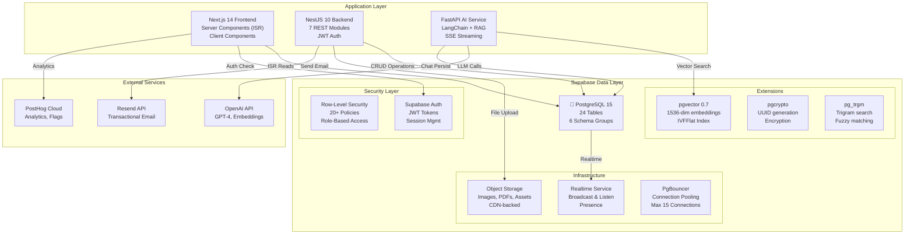
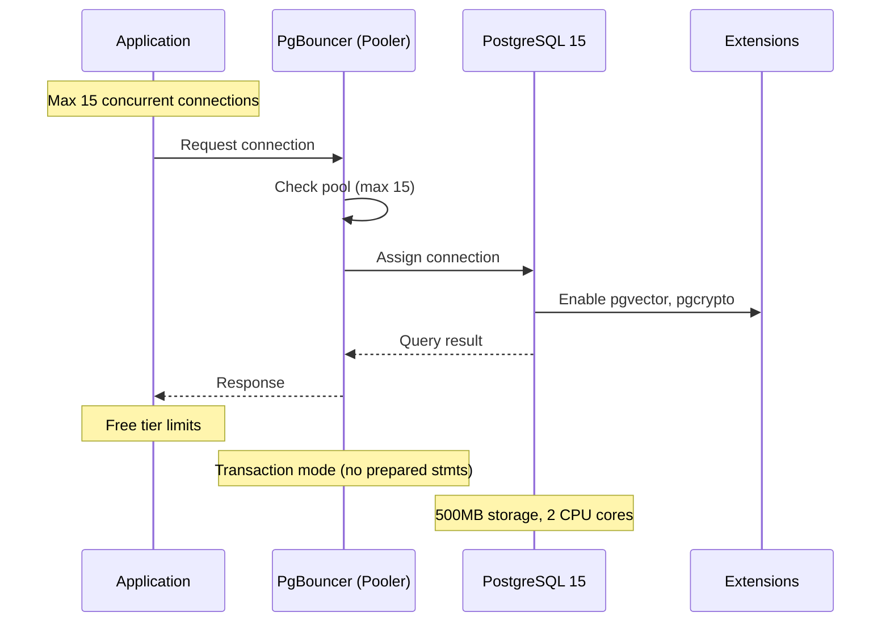

# Database Architecture - Enterprise FAANG Reference

> **File:** DatabaseArchitecture.md | **Version:** 2.0 (Enterprise Multi-LLM Upgrade) | **Last Updated:** July 2026
> **Status:** Active | **Stack:** Supabase PostgreSQL 15 + pgvector + Prisma + Redis
> **Monorepo:** Turborepo 2.0 | **Environment:** Production | **Tier:** Enterprise Zero-Cost
> **Package Manager:** npm 10 | **Node:** 20 LTS 15 | **Owner:** Principal Database Architect  
> **Review Cadence:** Quarterly | **Classification:** Enterprise Architecture  
> **Stack:** PostgreSQL 15 + pgvector 0.7 + Supabase (Auth, Storage, Realtime)

---

## Executive Summary

This document defines the complete enterprise database architecture for the portfolio platform, leveraging Supabase (PostgreSQL 15), pgvector for multi-LLM semantic search, Prisma ORM, and Redis for high-performance caching. Designed for FAANG-level data integrity, security, and scalability, the architecture encompasses 37 tables organized into 6 logical domains (Auth, Content, Interaction, AI, Analytics, System). It enforces rigorous Row Level Security (RLS) policies, JSON schema validation within the database, and advanced indexing strategies (B-Tree, GIN, IVFFlat for vectors). Built for robust disaster recovery and seamless AI integration, this architecture seamlessly supports OpenAI, Anthropic, and open-source embedding models while maintaining strict cost-optimization (targeting zero-cost tier).

---

## Table of Contents

1. [Database Vision](#1-database-vision)
2. [Database Architecture](#2-database-architecture)
3. [Database Principles](#3-database-principles)
4. [Database Technology Decisions](#4-database-technology-decisions)
5. [Schema Overview](#5-schema-overview)
6. [Entity Relationship Diagram](#6-entity-relationship-diagram)
7. [Core Tables](#7-core-tables)
8. [Content Tables](#8-content-tables)
9. [Lead Management Tables](#9-lead-management-tables)
10. [Analytics & Monitoring Tables](#10-analytics--monitoring-tables)
11. [AI & RAG Tables](#11-ai--rag-tables)
12. [Authentication & Authorization Tables](#12-authentication--authorization-tables)
13. [System & Configuration Tables](#13-system--configuration-tables)
14. [Admin & Audit Tables](#14-admin--audit-tables)
15. [Indexing Strategy](#15-indexing-strategy)
16. [Full-Text Search](#16-full-text-search)
17. [Caching Strategy](#17-caching-strategy)
18. [Backup Strategy](#18-backup-strategy)
19. [Disaster Recovery](#19-disaster-recovery)
20. [Data Lifecycle Management](#20-data-lifecycle-management)
21. [Row-Level Security Policies](#21-row-level-security-policies)
22. [Supabase Security Configuration](#22-supabase-security-configuration)
23. [Performance Budgets & SLAs](#23-performance-budgets--slas)
24. [Migration Strategy](#24-migration-strategy)
25. [Complete SQL Deployment Script](#25-complete-sql-deployment-script)
26. [Change Log](#26-change-log)

---

## 1. Database Vision

### 1.1 North Star

The portfolio database is designed to be the **single source of truth** for all platform data — powering public content delivery, admin content management, lead capture and tracking, AI-powered features (RAG pipeline, chatbot), analytics aggregation, and system observability. It is engineered for the **Supabase free tier (500MB)** while maintaining enterprise-grade architectural rigor.

### 1.2 Design Philosophy

| Principle                  | Description                                                                                             |
| -------------------------- | ------------------------------------------------------------------------------------------------------- |
| **Schema-on-Write**        | Strictly enforced schemas with PostgreSQL constraints. No schemaless JSONB blobs for critical data      |
| **Separation of Concerns** | Content data, operational data, analytics data, and system config are in clearly separated table groups |
| **Audit by Default**       | Every mutation is traceable — created_at, updated_at, and audit logs on all critical tables             |
| **RLS-First Security**     | Row-Level Security is the primary access control mechanism, not application-level guards                |
| **Free-Tier Optimized**    | Every index, partition, and query is designed to stay within 500MB while supporting 10K+ daily visitors |

### 1.3 Key Metrics

| Metric                            | Target                 | Measurement        |
| --------------------------------- | ---------------------- | ------------------ |
| Total database size               | < 500MB (free tier)    | Supabase dashboard |
| Query response (PK lookup)        | < 5ms                  | pg_stat_statements |
| Query response (list with filter) | < 20ms                 | pg_stat_statements |
| Concurrent connections            | ≤ 15 (free tier limit) | Connection pooler  |
| Monthly analytics events stored   | < 1M rows              | Table row counts   |
| Vector similarity search (k=3)    | < 50ms                 | pgvector latency   |

---

## 2. Database Architecture

### 2.1 High-Level Architecture



### 2.2 Schema Group Organization

| Schema Group  | Prefix | Tables                                                                                                                                                                                                          | Purpose                           | RLS Enforced |
| ------------- | ------ | --------------------------------------------------------------------------------------------------------------------------------------------------------------------------------------------------------------- | --------------------------------- | ------------ |
| **Core**      | (none) | `users`, `roles`, `permissions`, `user_roles`                                                                                                                                                                   | Authentication & authorization    | ✅           |
| **Content**   | (none) | `sections`, `projects`, `project_images`, `blog_posts`, `post_tags`, `testimonials`, `skills`, `experiences`, `achievements`, `services`, `case_studies`, `press_features`, `guest_appearances`, `reading_list` | Portfolio content storage         | ✅           |
| **Leads**     | (none) | `leads`, `lead_notes`, `lead_activities`                                                                                                                                                                        | Lead capture & management         | ✅           |
| **Analytics** | (none) | `analytics_events`, `analytics_sessions`, `page_views`                                                                                                                                                          | Visitor analytics                 | ✅           |
| **AI**        | (none) | `chat_conversations`, `chat_messages`, `document_chunks`, `embeddings_cache`                                                                                                                                    | AI features & RAG pipeline        | ✅           |
| **System**    | (none) | `media_assets`, `system_settings`, `notifications`, `audit_logs`, `sessions`, `api_keys`, `feature_flags`, `availability_status`, `admin_activities`                                                            | System configuration & monitoring | ✅           |

### 2.3 Connection Architecture



---

## 3. Database Principles

### 3.1 Design Principles

| #   | Principle                                      | Rationale                                                       | Violation Penalty             |
| --- | ---------------------------------------------- | --------------------------------------------------------------- | ----------------------------- |
| P1  | **Every table has a UUID primary key**         | UUIDs prevent enumeration attacks, enable distributed insertion | Must fix before deployment    |
| P2  | **Every table has created_at and updated_at**  | Auditing requires knowing when data changed                     | Data loss risk, audit failure |
| P3  | **JSONB only for genuinely flexible data**     | Don't use JSONB as a crutch for bad schema design               | Query performance degradation |
| P4  | **Foreign keys enforce referential integrity** | No orphaned records, cascade deletes intentionally              | Data corruption risk          |
| P5  | **Every query uses an index**                  | Sequential scans are prohibited in production                   | Performance budget failure    |
| P6  | **RLS is the primary access control**          | Application-level auth is secondary defense                     | Security vulnerability        |
| P7  | **Soft deletes for critical data**             | Never DELETE leads, users, or audit records                     | Irrecoverable data loss       |
| P8  | **Text search uses GIN indexes**               | No LIKE '%term%' queries without trigram support                | Full table scans              |
| P9  | **Analytics tables are time-partitioned**      | Partition pruning for efficient retention cleanup               | Unbounded table growth        |
| P10 | **Vector embeddings use IVFFlat indexes**      | Exact nearest neighbor is overkill for portfolio use            | Slow similarity search        |

### 3.2 Naming Conventions

| Element            | Convention                | Example                             | Rule                          |
| ------------------ | ------------------------- | ----------------------------------- | ----------------------------- |
| Tables             | `snake_case`, plural      | `blog_posts`, `analytics_events`    | PostgreSQL convention         |
| Columns            | `snake_case`, singular    | `display_order`, `is_visible`       | PostgreSQL convention         |
| Primary keys       | `id` (UUID)               | `id UUID DEFAULT gen_random_uuid()` | Universal PK name             |
| Foreign keys       | `{table}_id`              | `project_id`, `user_id`             | Referenced table name         |
| Indexes            | `idx_{table}_{column}`    | `idx_leads_email`                   | Prefix: `idx_`                |
| Unique constraints | `uq_{table}_{column}`     | `uq_users_email`                    | Prefix: `uq_`                 |
| Check constraints  | `ck_{table}_{column}`     | `ck_leads_email_format`             | Prefix: `ck_`                 |
| RLS policies       | `{action}_{table}_{role}` | `select_sections_anon`              | Format: `{op}_{table}_{role}` |
| Triggers           | `trg_{table}_{event}`     | `trg_sections_updated_at`           | Prefix: `trg_`                |
| Functions          | `fn_{name}`               | `fn_update_updated_at()`            | Prefix: `fn_`                 |

### 3.3 Data Type Standards

| Data              | Type                         | Rationale                                                 |
| ----------------- | ---------------------------- | --------------------------------------------------------- |
| Identifiers       | `UUID`                       | Security (non-enumerable), distribution                   |
| Short text        | `TEXT` (over VARCHAR)        | No meaningful performance difference, no arbitrary limits |
| Long text         | `TEXT`                       | Unlimited length, PostgreSQL optimizes TOAST storage      |
| Rich content      | `JSONB`                      | Structured content with schema flexibility                |
| Enumerated values | `TEXT` with CHECK constraint | Simpler than ENUM types, easier to migrate                |
| Monetary values   | `INTEGER` (cents)            | Avoid floating-point precision issues                     |
| Percentages       | `SMALLINT` (0-100)           | 2 bytes, sufficient range                                 |
| URLs              | `TEXT`                       | URLs exceed VARCHAR(255) frequently                       |
| Email addresses   | `TEXT` with CHECK regex      | RFC 5321 compliant validation                             |
| IP addresses      | `INET`                       | PostgreSQL native type, CIDR operations                   |
| Timestamps        | `TIMESTAMPTZ`                | Timezone-aware, UTC storage                               |
| Dates             | `DATE`                       | No time component needed                                  |
| Arrays            | `TEXT[]`                     | GIN-indexable for array contains queries                  |
| Vectors           | `VECTOR(1536)`               | pgvector type for OpenAI embeddings                       |
| Boolean           | `BOOLEAN`                    | Three-state (true/false/NULL)                             |
| JSON config       | `JSONB`                      | Flexible configuration storage                            |
| File paths        | `TEXT`                       | Storage bucket paths                                      |

---

## 4. Database Technology Decisions

### 4.1 Technology Selection

| Component          | Choice                     | Version          | Rationale                                            | Alternatives Considered         |
| ------------------ | -------------------------- | ---------------- | ---------------------------------------------------- | ------------------------------- |
| Database Engine    | PostgreSQL                 | 15               | Mature, extensible, free, RLS built-in               | MySQL, SQLite, PlanetScale      |
| Hosting            | Supabase                   | Managed          | Free tier (500MB), bundled Auth + Storage + Realtime | Neon, Render, AWS RDS           |
| Vector Extension   | pgvector                   | 0.7              | SQL-native vector search, no separate infra          | Pinecone, Weaviate, Qdrant      |
| Connection Pooling | PgBouncer                  | Built-in         | Free tier limit: 15 connections                      | Supavisor (Supabase)            |
| Full-Text Search   | PostgreSQL tsvec + pg_trgm | Built-in         | No external search service needed                    | Meilisearch, Algolia, Typesense |
| ORM/Client         | Supabase JS SDK            | 2.45+            | Type-safe, RLS-aware, realtime subscriptions         | Prisma, Drizzle, Kysely         |
| Migrations         | Supabase CLI               | Latest           | Declarative, version-controlled                      | Flyway, Node-pg-migrate         |
| Encryption at Rest | AES-256                    | Supabase managed | Compliant by default                                 | Vault (self-managed)            |

### 4.2 Supabase Feature Utilization

| Feature           | Usage                        | Free Tier Limit        | Current Utilization |
| ----------------- | ---------------------------- | ---------------------- | ------------------- |
| PostgreSQL        | Primary database             | 500MB                  | < 50MB              |
| Auth              | User management              | 50,000 users           | 1 admin             |
| Storage           | Image/PDF assets             | 1GB                    | < 100MB             |
| Realtime          | Live availability, analytics | 2M messages/month      | < 10K/month         |
| pgvector          | AI embeddings                | Included               | < 10MB              |
| Edge Functions    | Webhook handlers             | 500K invocations/month | 0 (not used)        |
| Database Webhooks | Content change triggers      | Included               | Planned             |

### 4.3 Why Not Alternatives

| Alternative     | Why Not Chosen                                                 |
| --------------- | -------------------------------------------------------------- |
| **MySQL**       | No native JSONB, no pgvector, weaker RLS, no realtime          |
| **PlanetScale** | No RLS, no vector support, no built-in auth/storage            |
| **Neon**        | Smaller free tier (500MB), no bundled auth/storage             |
| **Prisma**      | Adds abstraction layer, RLS bypass risk, migration complexity  |
| **MongoDB**     | Schema-less design contradicts our data integrity principles   |
| **Pinecone**    | Separate vector infra = more complexity, cost, latency         |
| **Redis**       | Overkill for portfolio scale; ISR + in-memory cache sufficient |

---

## 5. Schema Overview

### 5.1 Complete Table Inventory

| #   | Table                 | Group     | Rows (Est.)  | Size (Est.) | Criticality  | Retention  |
| --- | --------------------- | --------- | ------------ | ----------- | ------------ | ---------- |
| 1   | `users`               | Core      | 1            | < 1MB       | 🔴 Critical  | Indefinite |
| 2   | `roles`               | Core      | 2            | < 1MB       | 🔴 Critical  | Indefinite |
| 3   | `permissions`         | Core      | 20           | < 1MB       | 🔴 Critical  | Indefinite |
| 4   | `user_roles`          | Core      | 1            | < 1MB       | 🔴 Critical  | Indefinite |
| 5   | `sections`            | Content   | 25           | < 1MB       | 🔴 Critical  | Indefinite |
| 6   | `projects`            | Content   | 20           | < 5MB       | 🔴 Critical  | Indefinite |
| 7   | `project_images`      | Content   | 60           | < 10MB      | 🟡 Important | Indefinite |
| 8   | `blog_posts`          | Content   | 50           | < 10MB      | 🟢 Normal    | Indefinite |
| 9   | `post_tags`           | Content   | 100          | < 1MB       | 🟢 Normal    | Indefinite |
| 10  | `testimonials`        | Content   | 20           | < 2MB       | 🟡 Important | Indefinite |
| 11  | `skills`              | Content   | 30           | < 1MB       | 🟡 Important | Indefinite |
| 12  | `experiences`         | Content   | 15           | < 2MB       | 🟡 Important | Indefinite |
| 13  | `achievements`        | Content   | 20           | < 2MB       | 🟢 Normal    | Indefinite |
| 14  | `services`            | Content   | 8            | < 1MB       | 🟢 Normal    | Indefinite |
| 15  | `case_studies`        | Content   | 10           | < 5MB       | 🟡 Important | Indefinite |
| 16  | `press_features`      | Content   | 15           | < 2MB       | 🟢 Normal    | Indefinite |
| 17  | `guest_appearances`   | Content   | 10           | < 1MB       | 🟢 Normal    | Indefinite |
| 18  | `reading_list`        | Content   | 20           | < 1MB       | 🟢 Normal    | Indefinite |
| 19  | `leads`               | Leads     | 1,000        | < 10MB      | 🔴 Critical  | 2 years    |
| 20  | `lead_notes`          | Leads     | 500          | < 5MB       | 🟡 Important | 2 years    |
| 21  | `lead_activities`     | Leads     | 2,000        | < 10MB      | 🟡 Important | 2 years    |
| 22  | `analytics_events`    | Analytics | 500,000      | < 100MB     | 🟡 Important | 1 year     |
| 23  | `analytics_sessions`  | Analytics | 50,000       | < 50MB      | 🟢 Normal    | 1 year     |
| 24  | `page_views`          | Analytics | 200,000      | < 50MB      | 🟢 Normal    | 1 year     |
| 25  | `chat_conversations`  | AI        | 5,000        | < 20MB      | 🟢 Normal    | 30 days    |
| 26  | `chat_messages`       | AI        | 50,000       | < 50MB      | 🟢 Normal    | 30 days    |
| 27  | `document_chunks`     | AI        | 500          | < 10MB      | 🟡 Important | Indefinite |
| 28  | `embeddings_cache`    | AI        | 500          | < 10MB      | 🟢 Normal    | Indefinite |
| 29  | `media_assets`        | System    | 100          | < 5MB       | 🟡 Important | Indefinite |
| 30  | `availability_status` | System    | 1            | < 1MB       | 🟡 Important | Indefinite |
| 31  | `system_settings`     | System    | 50           | < 1MB       | 🔴 Critical  | Indefinite |
| 32  | `notifications`       | System    | 1,000        | < 5MB       | 🟢 Normal    | 90 days    |
| 33  | `audit_logs`          | System    | 10,000       | < 50MB      | 🔴 Critical  | 1 year     |
| 34  | `sessions`            | System    | 1,000        | < 5MB       | 🟡 Important | 30 days    |
| 35  | `api_keys`            | System    | 5            | < 1MB       | 🔴 Critical  | Indefinite |
| 36  | `feature_flags`       | System    | 20           | < 1MB       | 🟡 Important | Indefinite |
| 37  | `admin_activities`    | System    | 5,000        | < 20MB      | 🟡 Important | 1 year     |
|     | **Total**             |           | **~845,000** | **< 500MB** |              |            |

---

## 6. Entity Relationship Diagram

### 6.1 Full ER Diagram

```mermaid
erDiagram
    %% Core Tables
    users {
        uuid id PK
        text email UK
        text display_name
        text avatar_url
        boolean is_active
        jsonb metadata
        timestamptz created_at
        timestamptz updated_at
    }

    roles {
        uuid id PK
        text name UK
        text description
        timestamptz created_at
    }

    permissions {
        uuid id PK
        text resource UK
        text action
        text description
        timestamptz created_at
    }

    user_roles {
        uuid user_id FK
        uuid role_id FK
        timestamptz created_at
    }

    %% Content Tables
    sections {
        uuid id PK
        text section_key UK
        text section_label
        text section_type
        boolean is_live
        text style_preset
        int display_order
        int min_items
        boolean auto_publish
        boolean is_always_visible
        jsonb style_config
        jsonb content
        timestamptz created_at
        timestamptz updated_at
    }

    projects {
        uuid id PK
        text slug UK
        text title
        text description
        text[] tech_stack
        text live_url
        text github_url
        text cover_image
        text thumbnail_url
        boolean is_featured
        boolean is_private
        text nda_password
        text category
        int display_order
        jsonb content
        jsonb metrics
        timestamptz created_at
        timestamptz updated_at
    }

    project_images {
        uuid id PK
        uuid project_id FK
        text image_url
        text alt_text
        int display_order
        timestamptz created_at
    }

    blog_posts {
        uuid id PK
        text slug UK
        text title
        text excerpt
        text content
        text cover_image
        text[] tags
        text author_name
        int read_time_minutes
        boolean published
        timestamptz published_at
        timestamptz created_at
        timestamptz updated_at
    }

    post_tags {
        uuid id PK
        uuid post_id FK
        text tag
        timestamptz created_at
    }

    testimonials {
        uuid id PK
        text name
        text role
        text company
        text avatar_url
        text content
        smallint rating
        int display_order
        boolean is_verified
        boolean is_featured
        timestamptz created_at
        timestamptz updated_at
    }

    skills {
        uuid id PK
        text name
        text category
        smallint proficiency
        text icon_url
        text lottie_url
        int display_order
        boolean is_featured
        timestamptz created_at
        timestamptz updated_at
    }

    experiences {
        uuid id PK
        text company
        text role
        text description
        text[] technologies
        text company_logo_url
        text company_url
        date start_date
        date end_date
        boolean is_current
        int display_order
        timestamptz created_at
        timestamptz updated_at
    }

    achievements {
        uuid id PK
        text title
        text issuer
        text description
        text badge_image_url
        text category
        date achieved_date
        text credential_url
        int display_order
        timestamptz created_at
    }

    services {
        uuid id PK
        text title
        text description
        text icon
        text[] features
        text pricing_tier
        int price_cents
        text cta_text
        text cta_url
        int display_order
        boolean is_active
        timestamptz created_at
        timestamptz updated_at
    }

    case_studies {
        uuid id PK
        uuid project_id FK
        text challenge
        text approach
        text solution
        text impact
        text[] architecture_diagrams
        text[] code_snippets
        jsonb metrics
        timestamptz created_at
        timestamptz updated_at
    }

    press_features {
        uuid id PK
        text publication
        text title
        text url
        text logo_url
        text description
        date featured_date
        int display_order
        timestamptz created_at
    }

    guest_appearances {
        uuid id PK
        text type
        text title
        text host
        text url
        text cover_image_url
        text description
        date appearance_date
        int display_order
        timestamptz created_at
    }

    reading_list {
        uuid id PK
        text title
        text author
        text url
        text cover_image_url
        text category
        text recommendation
        int display_order
        timestamptz created_at
    }

    %% Lead Tables
    leads {
        uuid id PK
        text name
        text email
        text phone
        text company
        text subject
        text message
        text source
        text status
        text priority
        inet ip_address
        jsonb metadata
        timestamptz created_at
        timestamptz updated_at
        timestamptz deleted_at
    }

    lead_notes {
        uuid id PK
        uuid lead_id FK
        uuid author_id FK
        text content
        timestamptz created_at
        timestamptz updated_at
    }

    lead_activities {
        uuid id PK
        uuid lead_id FK
        uuid actor_id FK
        text action
        text description
        jsonb details
        inet ip_address
        timestamptz created_at
    }

    %% Analytics Tables
    analytics_events {
        uuid id PK
        text event_name
        text page_url
        text session_id
        text visitor_id
        text user_agent
        inet ip_address
        jsonb properties
        timestamptz created_at
    }

    analytics_sessions {
        uuid id PK
        text session_id UK
        text visitor_id
        text referrer
        text utm_source
        text utm_medium
        text utm_campaign
        text device_type
        text browser
        text country
        text city
        int page_views
        int duration_seconds
        timestamptz started_at
        timestamptz last_activity_at
        timestamptz created_at
    }

    page_views {
        uuid id PK
        text session_id
        text page_url
        text page_title
        text referrer
        int scroll_depth_percent
        int time_on_page_seconds
        jsonb engagement
        timestamptz viewed_at
    }

    %% AI Tables
    chat_conversations {
        uuid id PK
        text session_id UK
        text visitor_id
        text page_context
        int message_count
        timestamptz created_at
        timestamptz last_activity_at
        timestamptz deleted_at
    }

    chat_messages {
        uuid id PK
        uuid conversation_id FK
        text role
        text content
        int tokens_used
        int response_time_ms
        jsonb metadata
        timestamptz created_at
    }

    document_chunks {
        uuid id PK
        text document_id
        text content
        vector embedding
        int chunk_index
        int token_count
        jsonb metadata
        timestamptz created_at
    }

    embeddings_cache {
        uuid id PK
        text input_hash UK
        text input_text
        vector embedding
        text model
        int token_count
        timestamptz created_at
        timestamptz expires_at
    }

    %% System Tables
    media_assets {
        uuid id PK
        text file_name
        text file_path
        text bucket_name
        text mime_type
        int file_size_bytes
        int width
        int height
        text alt_text
        text uploaded_by
        jsonb variants
        timestamptz created_at
        timestamptz deleted_at
    }

    availability_status {
        uuid id PK
        boolean is_available
        text status_label
        text available_until
        text preferred_contact
        timestamptz updated_at
    }

    system_settings {
        uuid id PK
        text setting_key UK
        text setting_value
        text setting_group
        text description
        text data_type
        boolean is_encrypted
        timestamptz created_at
        timestamptz updated_at
    }

    notifications {
        uuid id PK
        text type
        text title
        text body
        text channel
        jsonb payload
        boolean is_read
        boolean is_sent
        timestamptz sent_at
        timestamptz read_at
        timestamptz created_at
    }

    audit_logs {
        uuid id PK
        text table_name
        text record_id
        text action
        uuid actor_id
        inet ip_address
        jsonb old_values
        jsonb new_values
        text correlation_id
        timestamptz created_at
    }

    sessions {
        uuid id PK
        uuid user_id FK
        text refresh_token UK
        text user_agent
        inet ip_address
        boolean is_revoked
        timestamptz expires_at
        timestamptz created_at
    }

    api_keys {
        uuid id PK
        text name
        text key_hash UK
        text key_prefix
        text permissions
        boolean is_active
        timestamptz expires_at
        timestamptz created_at
        timestamptz revoked_at
    }

    feature_flags {
        uuid id PK
        text flag_key UK
        text description
        boolean is_enabled
        jsonb targeting_rules
        int rollout_percentage
        timestamptz created_at
        timestamptz updated_at
    }

    admin_activities {
        uuid id PK
        uuid admin_id FK
        text action
        text resource_type
        text resource_id
        text description
        jsonb details
        inet ip_address
        timestamptz created_at
    }

    %% Relationships
    users ||--o{ user_roles : has
    roles ||--o{ user_roles : has
    users ||--o{ sessions : owns
    users ||--o{ lead_notes : writes
    users ||--o{ admin_activities : performs
    projects ||--o{ project_images : contains
    projects ||--o{ case_studies : has
    blog_posts ||--o{ post_tags : tagged
    leads ||--o{ lead_notes : has
    leads ||--o{ lead_activities : tracks
    chat_conversations ||--o{ chat_messages : contains
```



---

## 7. Core Tables

### 7.1 `users`

**Purpose:** Stores administrator identity for the portfolio platform. Single-user system (portfolio owner) with extensibility for multi-admin in future.

| Column         | Type          | Constraints    | Default             | Description                          |
| -------------- | ------------- | -------------- | ------------------- | ------------------------------------ |
| `id`           | `UUID`        | `PK`           | `gen_random_uuid()` | Unique user identifier               |
| `email`        | `TEXT`        | `NOT NULL, UK` | —                   | Login email address                  |
| `display_name` | `TEXT`        | `NOT NULL`     | —                   | Display name shown in admin          |
| `avatar_url`   | `TEXT`        | —              | —                   | Profile photo URL                    |
| `is_active`    | `BOOLEAN`     | `NOT NULL`     | `true`              | Account active/inactive              |
| `metadata`     | `JSONB`       | —              | `'{}'`              | Flexible metadata (preferences, bio) |
| `created_at`   | `TIMESTAMPTZ` | `NOT NULL`     | `NOW()`             | Account creation timestamp           |
| `updated_at`   | `TIMESTAMPTZ` | `NOT NULL`     | `NOW()`             | Last update timestamp                |

**Indexes:**

```sql
CREATE UNIQUE INDEX idx_users_email ON users (email);
CREATE INDEX idx_users_is_active ON users (is_active) WHERE is_active = true;
```

**Validation Rules:**

- `email` must match RFC 5321 regex pattern
- `display_name` must be 2-100 characters

**Audit Requirements:** All mutations logged to `audit_logs`
**Retention Policy:** Indefinite (manual admin deletion only)
**Access Rules:**

- Public: No access
- Admin: Full CRUD
- Auth system: Read for authentication

---

### 7.2 `roles`

**Purpose:** Defines role-based access control levels. Currently supports `admin` role with future expansion for `editor`, `viewer`.

| Column        | Type          | Constraints    | Default             | Description                |
| ------------- | ------------- | -------------- | ------------------- | -------------------------- |
| `id`          | `UUID`        | `PK`           | `gen_random_uuid()` | Unique role identifier     |
| `name`        | `TEXT`        | `NOT NULL, UK` | —                   | Role name (admin, editor)  |
| `description` | `TEXT`        | —              | —                   | Human-readable description |
| `created_at`  | `TIMESTAMPTZ` | `NOT NULL`     | `NOW()`             | Creation timestamp         |

**Validation Rules:** `name` must be lowercase alphanumeric (a-z, 0-9, underscore)
**Retention Policy:** Indefinite
**Access Rules:** System table, admin only

---

### 7.3 `permissions`

**Purpose:** Fine-grained permission definitions for resource-action pairs (e.g., `sections:create`, `leads:read`).

| Column        | Type          | Constraints                            | Default             | Description                               |
| ------------- | ------------- | -------------------------------------- | ------------------- | ----------------------------------------- |
| `id`          | `UUID`        | `PK`                                   | `gen_random_uuid()` | Unique permission identifier              |
| `resource`    | `TEXT`        | `NOT NULL, UK` (composite with action) | —                   | Resource name (sections, leads, projects) |
| `action`      | `TEXT`        | `NOT NULL`                             | —                   | Action (create, read, update, delete)     |
| `description` | `TEXT`        | —                                      | —                   | Human-readable description                |
| `created_at`  | `TIMESTAMPTZ` | `NOT NULL`                             | `NOW()`             | Creation timestamp                        |

**Unique Constraint:** `uq_permissions_resource_action ON permissions (resource, action)`
**Retention Policy:** Indefinite
**Access Rules:** System table, super admin only

---

### 7.4 `user_roles`

**Purpose:** Junction table linking users to roles for many-to-many relationship.

| Column       | Type          | Constraints                | Default | Description          |
| ------------ | ------------- | -------------------------- | ------- | -------------------- |
| `user_id`    | `UUID`        | `NOT NULL, FK → users(id)` | —       | Reference to user    |
| `role_id`    | `UUID`        | `NOT NULL, FK → roles(id)` | —       | Reference to role    |
| `created_at` | `TIMESTAMPTZ` | `NOT NULL`                 | `NOW()` | Assignment timestamp |

**Primary Key:** Composite `(user_id, role_id)`
**Foreign Keys:** `fk_user_roles_user` → `users(id) ON DELETE CASCADE`, `fk_user_roles_role` → `roles(id) ON DELETE CASCADE`
**Validation Rules:** No duplicate user-role pairs
**Retention Policy:** Indefinite
**Access Rules:** System table, admin only

---

## 8. Content Tables

### 8.1 `sections`

**Purpose:** Controls visibility, ordering, styling, and metadata for all 25+ portfolio sections. The central table that drives the entire portfolio layout.

| Column              | Type          | Constraints    | Default             | Description                                           |
| ------------------- | ------------- | -------------- | ------------------- | ----------------------------------------------------- |
| `id`                | `UUID`        | `PK`           | `gen_random_uuid()` | Unique section identifier                             |
| `section_key`       | `TEXT`        | `NOT NULL, UK` | —                   | Machine-readable identifier (hero, about, skills)     |
| `section_label`     | `TEXT`        | `NOT NULL`     | —                   | Human-readable label (Hero, About Me, Skills)         |
| `section_type`      | `TEXT`        | —              | —                   | Section type (hero, stats, timeline, grid)            |
| `is_live`           | `BOOLEAN`     | `NOT NULL`     | `false`             | Visibility toggle for public                          |
| `style_preset`      | `TEXT`        | `NOT NULL`     | `'default'`         | Visual style preset name                              |
| `display_order`     | `INTEGER`     | `NOT NULL`     | `0`                 | Render order on portfolio                             |
| `min_items`         | `INTEGER`     | `NOT NULL`     | `1`                 | Minimum content items before auto-publish             |
| `auto_publish`      | `BOOLEAN`     | `NOT NULL`     | `false`             | Auto-publish when min_items met                       |
| `is_always_visible` | `BOOLEAN`     | `NOT NULL`     | `false`             | Always visible (hero, contact, footer)                |
| `style_config`      | `JSONB`       | —              | `'{}'`              | Style configuration overrides                         |
| `content`           | `JSONB`       | —              | `'{}'`              | Inline content (for sections without dedicated table) |
| `created_at`        | `TIMESTAMPTZ` | `NOT NULL`     | `NOW()`             | Creation timestamp                                    |
| `updated_at`        | `TIMESTAMPTZ` | `NOT NULL`     | `NOW()`             | Last update timestamp                                 |

**Indexes:**

```sql
CREATE INDEX idx_sections_live_order ON sections (is_live, display_order) WHERE is_live = true;
CREATE INDEX idx_sections_display_order ON sections (display_order);
CREATE INDEX idx_sections_section_type ON sections (section_type);
```

**Validation Rules:**

- `section_key` must be lowercase snake_case, 3-50 characters
- `display_order` must be ≥ 0
- `style_preset` must be one of: `default`, `minimal`, `card`, `list`, `split`, `hero`, `grid`, `timeline`, `slider`

**Audit Requirements:** All mutations logged to `audit_logs`
**Retention Policy:** Indefinite
**Access Rules:**

- Public: `SELECT` where `is_live = true`
- Admin: Full CRUD

---

### 8.2 `projects`

**Purpose:** Stores all portfolio projects with rich metadata, enabling filtering, featured display, and detail pages.

> **Design Decision — Technologies as TEXT[]:** Technologies are modeled as denormalized `TEXT[]` arrays rather than a separate `technologies` junction table because portfolio projects typically reference < 10 technologies each, queries are simple contains-checks (GIN-indexed), and the denormalized format avoids JOIN overhead for the most common query pattern (project listing). For a portfolio workload, a separate normalized `technologies` table would introduce unnecessary complexity without benefit.

| Column          | Type          | Constraints    | Default             | Description                                   |
| --------------- | ------------- | -------------- | ------------------- | --------------------------------------------- |
| `id`            | `UUID`        | `PK`           | `gen_random_uuid()` | Unique project identifier                     |
| `slug`          | `TEXT`        | `NOT NULL, UK` | —                   | URL-friendly slug for detail pages            |
| `title`         | `TEXT`        | `NOT NULL`     | —                   | Project title                                 |
| `description`   | `TEXT`        | —              | —                   | Short description for cards                   |
| `tech_stack`    | `TEXT[]`      | —              | `'{}'`              | Array of technologies used                    |
| `live_url`      | `TEXT`        | —              | —                   | Live demo URL                                 |
| `github_url`    | `TEXT`        | —              | —                   | GitHub repository URL                         |
| `cover_image`   | `TEXT`        | —              | —                   | Primary image URL                             |
| `thumbnail_url` | `TEXT`        | —              | —                   | Thumbnail for cards                           |
| `is_featured`   | `BOOLEAN`     | `NOT NULL`     | `false`             | Featured project (shown on homepage)          |
| `is_private`    | `BOOLEAN`     | `NOT NULL`     | `false`             | NDA project (requires password)               |
| `nda_password`  | `TEXT`        | —              | —                   | Password for NDA projects                     |
| `category`      | `TEXT`        | —              | —                   | Category (web, mobile, ai, devops, design)    |
| `display_order` | `INTEGER`     | `NOT NULL`     | `0`                 | Sort order                                    |
| `content`       | `JSONB`       | —              | `'{}'`              | Rich content (features, challenges, outcomes) |
| `metrics`       | `JSONB`       | —              | `'{}'`              | Project metrics (users, stars, performance)   |
| `created_at`    | `TIMESTAMPTZ` | `NOT NULL`     | `NOW()`             | Creation timestamp                            |
| `updated_at`    | `TIMESTAMPTZ` | `NOT NULL`     | `NOW()`             | Last update timestamp                         |

**Indexes:**

```sql
CREATE INDEX idx_projects_slug ON projects (slug);
CREATE INDEX idx_projects_featured_order ON projects (is_featured, display_order) WHERE is_featured = true;
CREATE INDEX idx_projects_category ON projects (category);
CREATE GIN INDEX idx_projects_tech_stack ON projects USING GIN (tech_stack);
CREATE INDEX idx_projects_created_at ON projects (created_at DESC);
```

**Foreign Keys:** `case_studies.project_id → projects(id) ON DELETE CASCADE`
**Validation Rules:**

- `slug` must match `^[a-z0-9]+(?:-[a-z0-9]+)*$` pattern
- `title` must be 3-200 characters
- `category` must be one of: `web`, `mobile`, `ai`, `devops`, `design`, `other`
- URLs must be valid HTTP/HTTPS URLs or empty

**Audit Requirements:** All CRUD mutations logged
**Retention Policy:** Indefinite
**Access Rules:**

- Public: `SELECT` where `is_private = false`
- Admin: Full CRUD

---

### 8.3 `project_images`

**Purpose:** Gallery images for project detail pages, ordered for display.

| Column          | Type          | Constraints    | Default             | Description             |
| --------------- | ------------- | -------------- | ------------------- | ----------------------- |
| `id`            | `UUID`        | `PK`           | `gen_random_uuid()` | Unique image identifier |
| `project_id`    | `UUID`        | `NOT NULL, FK` | —                   | Parent project          |
| `image_url`     | `TEXT`        | `NOT NULL`     | —                   | Image URL               |
| `alt_text`      | `TEXT`        | —              | —                   | Accessibility alt text  |
| `display_order` | `INTEGER`     | `NOT NULL`     | `0`                 | Display order           |
| `created_at`    | `TIMESTAMPTZ` | `NOT NULL`     | `NOW()`             | Creation timestamp      |

**Indexes:** `CREATE INDEX idx_project_images_project ON project_images (project_id, display_order);`
**Foreign Keys:** `fk_project_images_project → projects(id) ON DELETE CASCADE`
**Validation Rules:** `image_url` must be valid URL

---

### 8.4 `blog_posts`

**Purpose:** Blog engine storage for technical articles, thought leadership content, and SEO landing pages.

| Column              | Type          | Constraints    | Default             | Description                      |
| ------------------- | ------------- | -------------- | ------------------- | -------------------------------- |
| `id`                | `UUID`        | `PK`           | `gen_random_uuid()` | Unique post identifier           |
| `slug`              | `TEXT`        | `NOT NULL, UK` | —                   | URL-friendly slug                |
| `title`             | `TEXT`        | `NOT NULL`     | —                   | Post title                       |
| `excerpt`           | `TEXT`        | —              | —                   | Short summary for cards          |
| `content`           | `TEXT`        | —              | —                   | Full post content (Markdown/MDX) |
| `cover_image`       | `TEXT`        | —              | —                   | Featured image URL               |
| `tags`              | `TEXT[]`      | —              | `'{}'`              | Post tags for filtering          |
| `author_name`       | `TEXT`        | —              | —                   | Author display name              |
| `read_time_minutes` | `INTEGER`     | —              | —                   | Estimated reading time           |
| `published`         | `BOOLEAN`     | `NOT NULL`     | `false`             | Published state                  |
| `published_at`      | `TIMESTAMPTZ` | —              | —                   | Publication timestamp            |
| `created_at`        | `TIMESTAMPTZ` | `NOT NULL`     | `NOW()`             | Creation timestamp               |
| `updated_at`        | `TIMESTAMPTZ` | `NOT NULL`     | `NOW()`             | Last update timestamp            |

**Indexes:**

```sql
CREATE INDEX idx_blog_posts_slug ON blog_posts (slug);
CREATE INDEX idx_blog_posts_published_date ON blog_posts (published, published_at DESC) WHERE published = true;
CREATE GIN INDEX idx_blog_posts_tags ON blog_posts USING GIN (tags);
CREATE INDEX idx_blog_posts_created_at ON blog_posts (created_at DESC);
```

> **Note:** The `search_vector` generated column for full-text search is defined in [Section 16.1 — Full-Text Search](#161-search-configuration), not duplicated here.

**Validation Rules:** `slug` must be URL-safe; `title` 5-200 characters
**Audit Requirements:** Track publish/unpublish events
**Retention Policy:** Indefinite
**Access Rules:**

- Public: `SELECT` where `published = true`
- Admin: Full CRUD

---

### 8.5 `post_tags`

**Purpose:** Normalized tag storage for blog post filtering and aggregation.

| Column       | Type          | Constraints    | Default             | Description        |
| ------------ | ------------- | -------------- | ------------------- | ------------------ |
| `id`         | `UUID`        | `PK`           | `gen_random_uuid()` | Unique identifier  |
| `post_id`    | `UUID`        | `NOT NULL, FK` | —                   | Parent blog post   |
| `tag`        | `TEXT`        | `NOT NULL`     | —                   | Tag value          |
| `created_at` | `TIMESTAMPTZ` | `NOT NULL`     | `NOW()`             | Creation timestamp |

**Indexes:** `CREATE INDEX idx_post_tags_post ON post_tags (post_id);`, `CREATE INDEX idx_post_tags_tag ON post_tags (tag);`
**Foreign Keys:** `fk_post_tags_post → blog_posts(id) ON DELETE CASCADE`

---

### 8.6 `testimonials`

**Purpose:** Social proof content with ratings, verification status, and display ordering.

| Column          | Type          | Constraints   | Default             | Description        |
| --------------- | ------------- | ------------- | ------------------- | ------------------ |
| `id`            | `UUID`        | `PK`          | `gen_random_uuid()` | Unique identifier  |
| `name`          | `TEXT`        | `NOT NULL`    | —                   | Person's name      |
| `role`          | `TEXT`        | —             | —                   | Job title          |
| `company`       | `TEXT`        | —             | —                   | Company name       |
| `avatar_url`    | `TEXT`        | —             | —                   | Avatar image URL   |
| `content`       | `TEXT`        | `NOT NULL`    | —                   | Testimonial text   |
| `rating`        | `SMALLINT`    | `CHECK (1-5)` | —                   | Star rating (1-5)  |
| `display_order` | `INTEGER`     | `NOT NULL`    | `0`                 | Sort order         |
| `is_verified`   | `BOOLEAN`     | `NOT NULL`    | `false`             | Verification badge |
| `is_featured`   | `BOOLEAN`     | `NOT NULL`    | `false`             | Featured display   |
| `created_at`    | `TIMESTAMPTZ` | `NOT NULL`    | `NOW()`             | Creation timestamp |
| `updated_at`    | `TIMESTAMPTZ` | `NOT NULL`    | `NOW()`             | Last update        |

**Indexes:** `CREATE INDEX idx_testimonials_order ON testimonials (display_order);`, `CREATE INDEX idx_testimonials_featured ON testimonials (is_featured) WHERE is_featured = true;`
**Validation Rules:** `rating` must be 1-5; `content` must be 10-2000 characters
**Access Rules:** Public: SELECT; Admin: Full CRUD

---

### 8.7 `skills`

**Purpose:** Technical skill inventory with proficiency indicators, categorized for filtering.

| Column          | Type          | Constraints     | Default             | Description                                |
| --------------- | ------------- | --------------- | ------------------- | ------------------------------------------ |
| `id`            | `UUID`        | `PK`            | `gen_random_uuid()` | Unique identifier                          |
| `name`          | `TEXT`        | `NOT NULL`      | —                   | Skill name                                 |
| `category`      | `TEXT`        | `NOT NULL`      | —                   | Category (Frontend, Backend, DevOps, etc.) |
| `proficiency`   | `SMALLINT`    | `CHECK (0-100)` | —                   | Proficiency percentage                     |
| `icon_url`      | `TEXT`        | —               | —                   | Static icon URL                            |
| `lottie_url`    | `TEXT`        | —               | —                   | Animated Lottie icon URL                   |
| `display_order` | `INTEGER`     | `NOT NULL`      | `0`                 | Sort order                                 |
| `is_featured`   | `BOOLEAN`     | `NOT NULL`      | `false`             | Featured skill                             |
| `created_at`    | `TIMESTAMPTZ` | `NOT NULL`      | `NOW()`             | Creation timestamp                         |
| `updated_at`    | `TIMESTAMPTZ` | `NOT NULL`      | `NOW()`             | Last update                                |

**Indexes:** `CREATE INDEX idx_skills_category ON skills (category, display_order);`
**Validation Rules:** `proficiency` 0-100; `name` 2-100 characters
**Access Rules:** Public: SELECT; Admin: Full CRUD

---

### 8.8 `experiences`

**Purpose:** Work history timeline with company details, technologies, and display ordering.

| Column             | Type          | Constraints | Default             | Description                    |
| ------------------ | ------------- | ----------- | ------------------- | ------------------------------ |
| `id`               | `UUID`        | `PK`        | `gen_random_uuid()` | Unique identifier              |
| `company`          | `TEXT`        | `NOT NULL`  | —                   | Company name                   |
| `role`             | `TEXT`        | `NOT NULL`  | —                   | Job title                      |
| `description`      | `TEXT`        | —           | —                   | Role description/bullet points |
| `technologies`     | `TEXT[]`      | —           | `'{}'`              | Technologies used              |
| `company_logo_url` | `TEXT`        | —           | —                   | Company logo                   |
| `company_url`      | `TEXT`        | —           | —                   | Company website                |
| `start_date`       | `DATE`        | `NOT NULL`  | —                   | Start date                     |
| `end_date`         | `DATE`        | —           | —                   | End date (NULL if current)     |
| `is_current`       | `BOOLEAN`     | `NOT NULL`  | `false`             | Currently employed here        |
| `display_order`    | `INTEGER`     | `NOT NULL`  | `0`                 | Sort order                     |
| `created_at`       | `TIMESTAMPTZ` | `NOT NULL`  | `NOW()`             | Creation timestamp             |
| `updated_at`       | `TIMESTAMPTZ` | `NOT NULL`  | `NOW()`             | Last update                    |

**Indexes:** `CREATE INDEX idx_experiences_dates ON experiences (start_date DESC);`, `CREATE INDEX idx_experiences_current ON experiences (is_current) WHERE is_current = true;`
**Validation:** `start_date` must be before `end_date` (if end_date provided); `is_current = true` implies `end_date IS NULL`
**Access Rules:** Public: SELECT; Admin: Full CRUD

---

### 8.9 `achievements`

**Purpose:** Certifications, awards, hackathon wins displayed as badge cards with hover flip.

| Column            | Type          | Constraints | Default             | Description                                |
| ----------------- | ------------- | ----------- | ------------------- | ------------------------------------------ |
| `id`              | `UUID`        | `PK`        | `gen_random_uuid()` | Unique identifier                          |
| `title`           | `TEXT`        | `NOT NULL`  | —                   | Achievement title                          |
| `issuer`          | `TEXT`        | `NOT NULL`  | —                   | Issuing organization                       |
| `description`     | `TEXT`        | —           | —                   | Achievement description                    |
| `badge_image_url` | `TEXT`        | —           | —                   | Badge/certificate image                    |
| `category`        | `TEXT`        | —           | —                   | Category (certification, award, hackathon) |
| `achieved_date`   | `DATE`        | —           | —                   | Date achieved                              |
| `credential_url`  | `TEXT`        | —           | —                   | Verifiable credential URL                  |
| `display_order`   | `INTEGER`     | `NOT NULL`  | `0`                 | Sort order                                 |
| `created_at`      | `TIMESTAMPTZ` | `NOT NULL`  | `NOW()`             | Creation timestamp                         |

**Indexes:** `CREATE INDEX idx_achievements_category ON achievements (category);`, `CREATE INDEX idx_achievements_date ON achievements (achieved_date DESC);`

---

### 8.10 `services`

**Purpose:** Service offerings with pricing tiers, feature lists, and CTAs for client conversion.

| Column          | Type          | Constraints | Default             | Description                           |
| --------------- | ------------- | ----------- | ------------------- | ------------------------------------- |
| `id`            | `UUID`        | `PK`        | `gen_random_uuid()` | Unique identifier                     |
| `title`         | `TEXT`        | `NOT NULL`  | —                   | Service name                          |
| `description`   | `TEXT`        | —           | —                   | Service description                   |
| `icon`          | `TEXT`        | —           | —                   | Icon identifier                       |
| `features`      | `TEXT[]`      | —           | `'{}'`              | Feature list                          |
| `pricing_tier`  | `TEXT`        | —           | —                   | Tier label (Starter, Pro, Enterprise) |
| `price_cents`   | `INTEGER`     | —           | —                   | Price in cents (NULL if custom)       |
| `cta_text`      | `TEXT`        | —           | `'Get Started'`     | Call-to-action button text            |
| `cta_url`       | `TEXT`        | —           | —                   | CTA link URL                          |
| `display_order` | `INTEGER`     | `NOT NULL`  | `0`                 | Sort order                            |
| `is_active`     | `BOOLEAN`     | `NOT NULL`  | `true`              | Active service                        |
| `created_at`    | `TIMESTAMPTZ` | `NOT NULL`  | `NOW()`             | Creation timestamp                    |
| `updated_at`    | `TIMESTAMPTZ` | `NOT NULL`  | `NOW()`             | Last update                           |

---

### 8.11 `case_studies`

**Purpose:** In-depth project case studies with structured sections for problem-solving methodology.

| Column                  | Type          | Constraints        | Default             | Description               |
| ----------------------- | ------------- | ------------------ | ------------------- | ------------------------- |
| `id`                    | `UUID`        | `PK`               | `gen_random_uuid()` | Unique identifier         |
| `project_id`            | `UUID`        | `NOT NULL, FK, UK` | —                   | Reference to project      |
| `challenge`             | `TEXT`        | —                  | —                   | Problem statement         |
| `approach`              | `TEXT`        | —                  | —                   | Solution approach         |
| `solution`              | `TEXT`        | —                  | —                   | Implementation details    |
| `impact`                | `TEXT`        | —                  | —                   | Results and outcomes      |
| `architecture_diagrams` | `TEXT[]`      | —                  | `'{}'`              | Architecture diagram URLs |
| `code_snippets`         | `TEXT[]`      | —                  | `'{}'`              | Code snippet URLs         |
| `metrics`               | `JSONB`       | —                  | `'{}'`              | Quantitative metrics      |
| `created_at`            | `TIMESTAMPTZ` | `NOT NULL`         | `NOW()`             | Creation timestamp        |
| `updated_at`            | `TIMESTAMPTZ` | `NOT NULL`         | `NOW()`             | Last update               |

**Foreign Keys:** `fk_case_studies_project → projects(id) ON DELETE CASCADE`
**Access Rules:** Public: SELECT; Admin: Full CRUD

---

### 8.12 `press_features`

**Purpose:** Publications, media mentions, and press coverage.

| Column          | Type          | Constraints | Default             | Description        |
| --------------- | ------------- | ----------- | ------------------- | ------------------ |
| `id`            | `UUID`        | `PK`        | `gen_random_uuid()` | Unique identifier  |
| `publication`   | `TEXT`        | `NOT NULL`  | —                   | Publication name   |
| `title`         | `TEXT`        | `NOT NULL`  | —                   | Article title      |
| `url`           | `TEXT`        | `NOT NULL`  | —                   | Article URL        |
| `logo_url`      | `TEXT`        | —           | —                   | Publication logo   |
| `description`   | `TEXT`        | —           | —                   | Article summary    |
| `featured_date` | `DATE`        | —           | —                   | Publication date   |
| `display_order` | `INTEGER`     | `NOT NULL`  | `0`                 | Sort order         |
| `created_at`    | `TIMESTAMPTZ` | `NOT NULL`  | `NOW()`             | Creation timestamp |

---

### 8.13 `guest_appearances`

**Purpose:** Podcasts, talks, YouTube features, and other guest appearances.

| Column            | Type          | Constraints | Default             | Description                          |
| ----------------- | ------------- | ----------- | ------------------- | ------------------------------------ |
| `id`              | `UUID`        | `PK`        | `gen_random_uuid()` | Unique identifier                    |
| `type`            | `TEXT`        | `NOT NULL`  | —                   | Type (podcast, talk, video, article) |
| `title`           | `TEXT`        | `NOT NULL`  | —                   | Episode/talk title                   |
| `host`            | `TEXT`        | —           | —                   | Host or event name                   |
| `url`             | `TEXT`        | `NOT NULL`  | —                   | Content URL                          |
| `cover_image_url` | `TEXT`        | —           | —                   | Cover image                          |
| `description`     | `TEXT`        | —           | —                   | Content description                  |
| `appearance_date` | `DATE`        | —           | —                   | Date of appearance                   |
| `display_order`   | `INTEGER`     | `NOT NULL`  | `0`                 | Sort order                           |
| `created_at`      | `TIMESTAMPTZ` | `NOT NULL`  | `NOW()`             | Creation timestamp                   |

---

### 8.14 `reading_list`

**Purpose:** Curated book and resource recommendations positioning the portfolio owner as curator.

| Column            | Type          | Constraints | Default             | Description                            |
| ----------------- | ------------- | ----------- | ------------------- | -------------------------------------- |
| `id`              | `UUID`        | `PK`        | `gen_random_uuid()` | Unique identifier                      |
| `title`           | `TEXT`        | `NOT NULL`  | —                   | Book/resource title                    |
| `author`          | `TEXT`        | —           | —                   | Author name                            |
| `url`             | `TEXT`        | —           | —                   | Resource URL                           |
| `cover_image_url` | `TEXT`        | —           | —                   | Cover image                            |
| `category`        | `TEXT`        | —           | —                   | Category (book, tool, course, article) |
| `recommendation`  | `TEXT`        | —           | —                   | Personal recommendation                |
| `display_order`   | `INTEGER`     | `NOT NULL`  | `0`                 | Sort order                             |
| `created_at`      | `TIMESTAMPTZ` | `NOT NULL`  | `NOW()`             | Creation timestamp                     |

---

## 9. Lead Management Tables

### 9.1 `leads`

**Purpose:** Central lead repository capturing all contact form submissions with comprehensive tracking.

| Column       | Type          | Constraints | Default             | Description                                                |
| ------------ | ------------- | ----------- | ------------------- | ---------------------------------------------------------- |
| `id`         | `UUID`        | `PK`        | `gen_random_uuid()` | Unique lead identifier                                     |
| `name`       | `TEXT`        | `NOT NULL`  | —                   | Contact name                                               |
| `email`      | `TEXT`        | `NOT NULL`  | —                   | Contact email                                              |
| `phone`      | `TEXT`        | —           | —                   | Contact phone                                              |
| `company`    | `TEXT`        | —           | —                   | Company name                                               |
| `subject`    | `TEXT`        | —           | —                   | Message subject                                            |
| `message`    | `TEXT`        | `NOT NULL`  | —                   | Message body                                               |
| `source`     | `TEXT`        | `NOT NULL`  | `'contact_form'`    | Source (`contact_form`, `ai_chat`, `referral`, `direct`)   |
| `status`     | `TEXT`        | `NOT NULL`  | `'new'`             | Status (`new`, `read`, `replied`, `converted`, `archived`) |
| `priority`   | `TEXT`        | `NOT NULL`  | `'normal'`          | Priority (`low`, `normal`, `high`, `urgent`)               |
| `ip_address` | `INET`        | —           | —                   | Submitter IP address                                       |
| `metadata`   | `JSONB`       | —           | `'{}'`              | UTM params, user agent, referrer                           |
| `created_at` | `TIMESTAMPTZ` | `NOT NULL`  | `NOW()`             | Creation timestamp                                         |
| `updated_at` | `TIMESTAMPTZ` | `NOT NULL`  | `NOW()`             | Last update                                                |
| `deleted_at` | `TIMESTAMPTZ` | —           | —                   | Soft delete timestamp                                      |

**Indexes:**

```sql
CREATE INDEX idx_leads_status_created ON leads (status, created_at DESC);
CREATE INDEX idx_leads_email ON leads (email);
CREATE INDEX idx_leads_source ON leads (source);
CREATE INDEX idx_leads_created_at ON leads (created_at DESC);
CREATE INDEX idx_leads_deleted_at ON leads (deleted_at) WHERE deleted_at IS NULL;
```

**Check Constraints:**

```sql
ALTER TABLE leads ADD CONSTRAINT ck_leads_email_format
  CHECK (email ~* '^[A-Za-z0-9._%+-]+@[A-Za-z0-9.-]+\.[A-Za-z]{2,}$');
ALTER TABLE leads ADD CONSTRAINT ck_leads_status
  CHECK (status IN ('new', 'read', 'replied', 'converted', 'archived'));
ALTER TABLE leads ADD CONSTRAINT ck_leads_source
  CHECK (source IN ('contact_form', 'ai_chat', 'referral', 'direct'));
ALTER TABLE leads ADD CONSTRAINT ck_leads_priority
  CHECK (priority IN ('low', 'normal', 'high', 'urgent'));
```

**Audit Requirements:** All status changes logged to `lead_activities`
**Retention Policy:** 2 years from `created_at`, then permanent deletion
**Access Rules:**

- Public: `INSERT` only (rate limited)
- Admin: Full CRUD (excluding delete, use soft delete)

---

### 9.2 `lead_notes`

**Purpose:** Internal admin notes on leads for tracking follow-up actions and context.

| Column       | Type          | Constraints    | Default             | Description          |
| ------------ | ------------- | -------------- | ------------------- | -------------------- |
| `id`         | `UUID`        | `PK`           | `gen_random_uuid()` | Unique identifier    |
| `lead_id`    | `UUID`        | `NOT NULL, FK` | —                   | Reference to lead    |
| `author_id`  | `UUID`        | `NOT NULL, FK` | —                   | Admin who wrote note |
| `content`    | `TEXT`        | `NOT NULL`     | —                   | Note content         |
| `created_at` | `TIMESTAMPTZ` | `NOT NULL`     | `NOW()`             | Creation timestamp   |
| `updated_at` | `TIMESTAMPTZ` | `NOT NULL`     | `NOW()`             | Last update          |

**Indexes:** `CREATE INDEX idx_lead_notes_lead ON lead_notes (lead_id, created_at DESC);`
**Foreign Keys:** `fk_lead_notes_lead → leads(id) ON DELETE CASCADE`, `fk_lead_notes_author → users(id) ON DELETE SET NULL`
**Access Rules:** Admin only

---

### 9.3 `lead_activities`

**Purpose:** Activity log tracking all lead lifecycle events for audit and analytics.

| Column        | Type          | Constraints    | Default             | Description                |
| ------------- | ------------- | -------------- | ------------------- | -------------------------- |
| `id`          | `UUID`        | `PK`           | `gen_random_uuid()` | Unique identifier          |
| `lead_id`     | `UUID`        | `NOT NULL, FK` | —                   | Reference to lead          |
| `actor_id`    | `UUID`        | —              | —                   | Who performed action       |
| `action`      | `TEXT`        | `NOT NULL`     | —                   | Action type                |
| `description` | `TEXT`        | —              | —                   | Human-readable description |
| `details`     | `JSONB`       | —              | `'{}'`              | Action-specific data       |
| `ip_address`  | `INET`        | —              | —                   | Actor IP address           |
| `created_at`  | `TIMESTAMPTZ` | `NOT NULL`     | `NOW()`             | Creation timestamp         |

**Indexes:** `CREATE INDEX idx_lead_activities_lead ON lead_activities (lead_id, created_at DESC);`, `CREATE INDEX idx_lead_activities_action ON lead_activities (action, created_at DESC);`
**Foreign Keys:** `fk_lead_activities_lead → leads(id) ON DELETE CASCADE`
**Retention Policy:** Same as parent lead (2 years)
**Access Rules:** Admin only

---

## 10. Analytics & Monitoring Tables

### 10.1 `analytics_events`

**Purpose:** Raw event store for all visitor interactions. Time-partitioned monthly for efficient retention cleanup.

| Column       | Type          | Constraints | Default             | Description                                     |
| ------------ | ------------- | ----------- | ------------------- | ----------------------------------------------- |
| `id`         | `UUID`        | `PK`        | `gen_random_uuid()` | Unique event identifier                         |
| `event_name` | `TEXT`        | `NOT NULL`  | —                   | Event name (page_view, section_view, cta_click) |
| `page_url`   | `TEXT`        | —           | —                   | Page URL where event occurred                   |
| `session_id` | `TEXT`        | —           | —                   | Visitor session ID                              |
| `visitor_id` | `TEXT`        | —           | —                   | Anonymous visitor ID                            |
| `user_agent` | `TEXT`        | —           | —                   | Browser user agent                              |
| `ip_address` | `INET`        | —           | —                   | Visitor IP (anonymized)                         |
| `properties` | `JSONB`       | —           | `'{}'`              | Event-specific properties                       |
| `created_at` | `TIMESTAMPTZ` | `NOT NULL`  | `NOW()`             | Event timestamp                                 |

**Partitioning:**

```sql
CREATE TABLE analytics_events (
  id UUID DEFAULT gen_random_uuid(),
  event_name TEXT NOT NULL,
  page_url TEXT,
  session_id TEXT,
  visitor_id TEXT,
  user_agent TEXT,
  ip_address INET,
  properties JSONB DEFAULT '{}',
  created_at TIMESTAMPTZ NOT NULL DEFAULT NOW()
) PARTITION BY RANGE (created_at);

-- Monthly partitions
CREATE TABLE analytics_events_2026_06 PARTITION OF analytics_events
  FOR VALUES FROM ('2026-06-01') TO ('2026-07-01');
CREATE TABLE analytics_events_2026_07 PARTITION OF analytics_events
  FOR VALUES FROM ('2026-07-01') TO ('2026-08-01');
-- ... auto-generated monthly
```

**Indexes:**

```sql
CREATE INDEX idx_analytics_events_name ON analytics_events (event_name, created_at DESC);
CREATE INDEX idx_analytics_events_session ON analytics_events (session_id);
CREATE INDEX idx_analytics_events_visitor ON analytics_events (visitor_id);
CREATE INDEX idx_analytics_events_date ON analytics_events (created_at DESC);
```

**Retention Policy:** 1 year, drop old partitions monthly
**Access Rules:**

- Public: `INSERT` only (rate limited)
- Admin: SELECT for analytics dashboard

---

### 10.2 `analytics_sessions`

**Purpose:** Visitor session aggregation for understanding user journeys.

| Column             | Type          | Constraints    | Default             | Description                           |
| ------------------ | ------------- | -------------- | ------------------- | ------------------------------------- |
| `id`               | `UUID`        | `PK`           | `gen_random_uuid()` | Unique identifier                     |
| `session_id`       | `TEXT`        | `NOT NULL, UK` | —                   | Unique session identifier             |
| `visitor_id`       | `TEXT`        | —              | —                   | Anonymous visitor ID                  |
| `referrer`         | `TEXT`        | —              | —                   | Traffic source URL                    |
| `utm_source`       | `TEXT`        | —              | —                   | UTM source param                      |
| `utm_medium`       | `TEXT`        | —              | —                   | UTM medium param                      |
| `utm_campaign`     | `TEXT`        | —              | —                   | UTM campaign param                    |
| `device_type`      | `TEXT`        | —              | —                   | Device type (desktop, mobile, tablet) |
| `browser`          | `TEXT`        | —              | —                   | Browser name                          |
| `country`          | `TEXT`        | —              | —                   | Geo-located country                   |
| `city`             | `TEXT`        | —              | —                   | Geo-located city                      |
| `page_views`       | `INTEGER`     | `NOT NULL`     | `0`                 | Pages viewed in session               |
| `duration_seconds` | `INTEGER`     | `NOT NULL`     | `0`                 | Session duration                      |
| `started_at`       | `TIMESTAMPTZ` | `NOT NULL`     | `NOW()`             | Session start                         |
| `last_activity_at` | `TIMESTAMPTZ` | —              | —                   | Last activity timestamp               |
| `created_at`       | `TIMESTAMPTZ` | `NOT NULL`     | `NOW()`             | Record creation                       |

**Indexes:** `CREATE INDEX idx_analytics_sessions_visitor ON analytics_sessions (visitor_id);`, `CREATE INDEX idx_analytics_sessions_date ON analytics_sessions (started_at DESC);`, `CREATE INDEX idx_analytics_sessions_source ON analytics_sessions (utm_source, utm_medium);`

---

### 10.3 `page_views`

**Purpose:** Individual page view tracking with scroll depth and engagement metrics.

| Column                 | Type          | Constraints | Default             | Description              |
| ---------------------- | ------------- | ----------- | ------------------- | ------------------------ |
| `id`                   | `UUID`        | `PK`        | `gen_random_uuid()` | Unique identifier        |
| `session_id`           | `TEXT`        | —           | —                   | Session ID               |
| `page_url`             | `TEXT`        | `NOT NULL`  | —                   | Page URL                 |
| `page_title`           | `TEXT`        | —           | —                   | Page title               |
| `referrer`             | `TEXT`        | —           | —                   | Page referrer            |
| `scroll_depth_percent` | `SMALLINT`    | —           | `0`                 | Max scroll depth (0-100) |
| `time_on_page_seconds` | `INTEGER`     | —           | `0`                 | Time spent on page       |
| `engagement`           | `JSONB`       | —           | `'{}'`              | Engagement events        |
| `viewed_at`            | `TIMESTAMPTZ` | `NOT NULL`  | `NOW()`             | View timestamp           |

**Indexes:** `CREATE INDEX idx_page_views_url ON page_views (page_url, viewed_at DESC);`, `CREATE INDEX idx_page_views_session ON page_views (session_id);`

---

## 11. AI & RAG Tables

### 11.1 `chat_conversations`

**Purpose:** AI chatbot conversation sessions for context management and admin review.

| Column             | Type          | Constraints    | Default             | Description             |
| ------------------ | ------------- | -------------- | ------------------- | ----------------------- |
| `id`               | `UUID`        | `PK`           | `gen_random_uuid()` | Unique identifier       |
| `session_id`       | `TEXT`        | `NOT NULL, UK` | —                   | Client-side session ID  |
| `visitor_id`       | `TEXT`        | —              | —                   | Anonymous visitor ID    |
| `page_context`     | `TEXT`        | —              | —                   | Page where chat started |
| `message_count`    | `INTEGER`     | `NOT NULL`     | `0`                 | Total messages          |
| `created_at`       | `TIMESTAMPTZ` | `NOT NULL`     | `NOW()`             | Session start           |
| `last_activity_at` | `TIMESTAMPTZ` | `NOT NULL`     | `NOW()`             | Last message timestamp  |
| `deleted_at`       | `TIMESTAMPTZ` | —              | —                   | Soft delete             |

**Indexes:** `CREATE INDEX idx_chat_conversations_session ON chat_conversations (session_id);`, `CREATE INDEX idx_chat_conversations_activity ON chat_conversations (last_activity_at DESC);`
**Retention Policy:** 30 days from `last_activity_at`
**Access Rules:** Admin only (SELECT for review)

---

### 11.2 `chat_messages`

**Purpose:** Individual chat messages within conversations.

| Column             | Type          | Constraints    | Default             | Description                            |
| ------------------ | ------------- | -------------- | ------------------- | -------------------------------------- |
| `id`               | `UUID`        | `PK`           | `gen_random_uuid()` | Unique identifier                      |
| `conversation_id`  | `UUID`        | `NOT NULL, FK` | —                   | Parent conversation                    |
| `role`             | `TEXT`        | `NOT NULL`     | —                   | Message role (user, assistant, system) |
| `content`          | `TEXT`        | `NOT NULL`     | —                   | Message content                        |
| `tokens_used`      | `INTEGER`     | —              | —                   | Token count (for cost tracking)        |
| `response_time_ms` | `INTEGER`     | —              | —                   | AI response generation time            |
| `metadata`         | `JSONB`       | —              | `'{}'`              | Model info, costs, sources             |
| `created_at`       | `TIMESTAMPTZ` | `NOT NULL`     | `NOW()`             | Message timestamp                      |

**Indexes:** `CREATE INDEX idx_chat_messages_conversation ON chat_messages (conversation_id, created_at);`
**Foreign Keys:** `fk_chat_messages_conversation → chat_conversations(id) ON DELETE CASCADE`

---

### 11.3 `document_chunks`

**Purpose:** Vector-embedded content chunks for the RAG pipeline. One row per text chunk.

| Column        | Type           | Constraints | Default             | Description                |
| ------------- | -------------- | ----------- | ------------------- | -------------------------- |
| `id`          | `UUID`         | `PK`        | `gen_random_uuid()` | Unique identifier          |
| `document_id` | `TEXT`         | `NOT NULL`  | —                   | Source document reference  |
| `content`     | `TEXT`         | `NOT NULL`  | —                   | Chunk text content         |
| `embedding`   | `VECTOR(1536)` | —           | —                   | OpenAI embedding vector    |
| `chunk_index` | `INTEGER`      | `NOT NULL`  | —                   | Chunk position in document |
| `token_count` | `INTEGER`      | —           | —                   | Estimated token count      |
| `metadata`    | `JSONB`        | —           | `'{}'`              | Source, section, title     |
| `created_at`  | `TIMESTAMPTZ`  | `NOT NULL`  | `NOW()`             | Creation timestamp         |

**Indexes:**

```sql
CREATE INDEX idx_document_chunks_document ON document_chunks (document_id);
-- IVFFlat index for vector similarity search (100 centroids, 2x probes)
CREATE INDEX idx_document_chunks_embedding ON document_chunks
  USING ivfflat (embedding vector_cosine_ops) WITH (lists = 100);
```

**Validation Rules:** `embedding` dimension must be exactly 1536
**Retention Policy:** Indefinite (regenerated on content change)
**Access Rules:** AI service only

---

### 11.4 `embeddings_cache`

**Purpose:** Cache for previously computed embeddings to reduce API costs.

| Column        | Type           | Constraints    | Default             | Description                         |
| ------------- | -------------- | -------------- | ------------------- | ----------------------------------- |
| `id`          | `UUID`         | `PK`           | `gen_random_uuid()` | Unique identifier                   |
| `input_hash`  | `TEXT`         | `NOT NULL, UK` | —                   | SHA-256 hash of input text          |
| `input_text`  | `TEXT`         | `NOT NULL`     | —                   | Original text                       |
| `embedding`   | `VECTOR(1536)` | `NOT NULL`     | —                   | Cached embedding                    |
| `model`       | `TEXT`         | `NOT NULL`     | —                   | Model used (text-embedding-3-small) |
| `token_count` | `INTEGER`      | —              | —                   | Token count                         |
| `created_at`  | `TIMESTAMPTZ`  | `NOT NULL`     | `NOW()`             | Cache creation                      |
| `expires_at`  | `TIMESTAMPTZ`  | —              | —                   | Cache expiry                        |

**Indexes:** `CREATE UNIQUE INDEX idx_embeddings_cache_hash ON embeddings_cache (input_hash);`
**Retention Policy:** 30 days from `created_at`

---

## 12. Authentication & Authorization Tables

### 12.1 `sessions`

**Purpose:** JWT refresh token storage for admin session management.

| Column          | Type          | Constraints    | Default             | Description        |
| --------------- | ------------- | -------------- | ------------------- | ------------------ |
| `id`            | `UUID`        | `PK`           | `gen_random_uuid()` | Unique identifier  |
| `user_id`       | `UUID`        | `NOT NULL, FK` | —                   | Admin user         |
| `refresh_token` | `TEXT`        | `NOT NULL, UK` | —                   | Refresh token hash |
| `user_agent`    | `TEXT`        | —              | —                   | Client user agent  |
| `ip_address`    | `INET`        | —              | —                   | Client IP          |
| `is_revoked`    | `BOOLEAN`     | `NOT NULL`     | `false`             | Session revoked    |
| `expires_at`    | `TIMESTAMPTZ` | `NOT NULL`     | —                   | Token expiry       |
| `created_at`    | `TIMESTAMPTZ` | `NOT NULL`     | `NOW()`             | Session creation   |

**Indexes:** `CREATE INDEX idx_sessions_user ON sessions (user_id, is_revoked);`, `CREATE UNIQUE INDEX idx_sessions_refresh ON sessions (refresh_token);`
**Foreign Keys:** `fk_sessions_user → users(id) ON DELETE CASCADE`
**Retention Policy:** 7 days after expiry, then cleanup

---

### 12.2 `api_keys`

**Purpose:** Programmatic API key storage for service-to-service communication.

| Column        | Type          | Constraints    | Default             | Description                         |
| ------------- | ------------- | -------------- | ------------------- | ----------------------------------- |
| `id`          | `UUID`        | `PK`           | `gen_random_uuid()` | Unique identifier                   |
| `name`        | `TEXT`        | `NOT NULL`     | —                   | Key identifier (e.g., `ai-service`) |
| `key_hash`    | `TEXT`        | `NOT NULL, UK` | —                   | SHA-256 hash of API key             |
| `key_prefix`  | `TEXT`        | `NOT NULL`     | —                   | First 8 chars for identification    |
| `permissions` | `TEXT`        | `NOT NULL`     | —                   | Comma-separated permissions         |
| `is_active`   | `BOOLEAN`     | `NOT NULL`     | `true`              | Key active/inactive                 |
| `expires_at`  | `TIMESTAMPTZ` | —              | —                   | Key expiry                          |
| `created_at`  | `TIMESTAMPTZ` | `NOT NULL`     | `NOW()`             | Key creation                        |
| `revoked_at`  | `TIMESTAMPTZ` | —              | —                   | Revocation timestamp                |

**Security:** Never store raw keys, only SHA-256 hashes

---

## 13. System & Configuration Tables

### 13.1 `media_assets`

**Purpose:** Central media library tracking all uploaded images, PDFs, and files.

| Column            | Type          | Constraints    | Default             | Description                           |
| ----------------- | ------------- | -------------- | ------------------- | ------------------------------------- |
| `id`              | `UUID`        | `PK`           | `gen_random_uuid()` | Unique identifier                     |
| `file_name`       | `TEXT`        | `NOT NULL`     | —                   | Original file name                    |
| `file_path`       | `TEXT`        | `NOT NULL, UK` | —                   | Storage path                          |
| `bucket_name`     | `TEXT`        | `NOT NULL`     | —                   | Supabase bucket                       |
| `mime_type`       | `TEXT`        | `NOT NULL`     | —                   | MIME type                             |
| `file_size_bytes` | `INTEGER`     | `NOT NULL`     | —                   | File size                             |
| `width`           | `INTEGER`     | —              | —                   | Image width                           |
| `height`          | `INTEGER`     | —              | —                   | Image height                          |
| `alt_text`        | `TEXT`        | —              | —                   | Accessibility alt text                |
| `uploaded_by`     | `TEXT`        | —              | —                   | Uploader identifier                   |
| `variants`        | `JSONB`       | —              | `'{}'`              | Generated variants (thumbnails, WebP) |
| `created_at`      | `TIMESTAMPTZ` | `NOT NULL`     | `NOW()`             | Upload timestamp                      |
| `deleted_at`      | `TIMESTAMPTZ` | —              | —                   | Soft delete                           |

**Indexes:** `CREATE INDEX idx_media_assets_bucket ON media_assets (bucket_name);`, `CREATE INDEX idx_media_assets_type ON media_assets (mime_type);`
**Validation Rules:** `file_size_bytes` must be ≤ 5MB for images, ≤ 10MB for documents

---

### 13.2 `availability_status`

**Purpose:** Single-row table controlling the live availability badge shown in hero/nav.

| Column              | Type          | Constraints | Default             | Description                           |
| ------------------- | ------------- | ----------- | ------------------- | ------------------------------------- |
| `id`                | `UUID`        | `PK`        | `gen_random_uuid()` | Unique identifier                     |
| `is_available`      | `BOOLEAN`     | `NOT NULL`  | `true`              | Available for work                    |
| `status_label`      | `TEXT`        | —           | —                   | Custom label (e.g., "Open to offers") |
| `available_until`   | `TEXT`        | —           | —                   | Date or description                   |
| `preferred_contact` | `TEXT`        | —           | —                   | Preferred contact method              |
| `updated_at`        | `TIMESTAMPTZ` | `NOT NULL`  | `NOW()`             | Last update                           |

**Access Rules:** Public: SELECT; Admin: UPDATE

---

### 13.3 `system_settings`

**Purpose:** Key-value configuration store for all system settings and preferences.

| Column          | Type          | Constraints    | Default             | Description                           |
| --------------- | ------------- | -------------- | ------------------- | ------------------------------------- |
| `id`            | `UUID`        | `PK`           | `gen_random_uuid()` | Unique identifier                     |
| `setting_key`   | `TEXT`        | `NOT NULL, UK` | —                   | Setting name                          |
| `setting_value` | `TEXT`        | `NOT NULL`     | —                   | Setting value                         |
| `setting_group` | `TEXT`        | —              | —                   | Group (email, seo, analytics, social) |
| `description`   | `TEXT`        | —              | —                   | Human-readable description            |
| `data_type`     | `TEXT`        | `NOT NULL`     | `'text'`            | Type (text, number, boolean, json)    |
| `is_encrypted`  | `BOOLEAN`     | `NOT NULL`     | `false`             | Encrypted at rest                     |
| `created_at`    | `TIMESTAMPTZ` | `NOT NULL`     | `NOW()`             | Creation timestamp                    |
| `updated_at`    | `TIMESTAMPTZ` | `NOT NULL`     | `NOW()`             | Last update                           |

**Indexes:** `CREATE UNIQUE INDEX idx_system_settings_key ON system_settings (setting_key);`

---

### 13.4 `notifications`

**Purpose:** Internal notification system for admin alerts and system events.

| Column       | Type          | Constraints | Default             | Description                                 |
| ------------ | ------------- | ----------- | ------------------- | ------------------------------------------- |
| `id`         | `UUID`        | `PK`        | `gen_random_uuid()` | Unique identifier                           |
| `type`       | `TEXT`        | `NOT NULL`  | —                   | Notification type (new_lead, error, update) |
| `title`      | `TEXT`        | `NOT NULL`  | —                   | Notification title                          |
| `body`       | `TEXT`        | —           | —                   | Notification body                           |
| `channel`    | `TEXT`        | `NOT NULL`  | `'in_app'`          | Delivery channel (in_app, email, telegram)  |
| `payload`    | `JSONB`       | —           | `'{}'`              | Actionable data                             |
| `is_read`    | `BOOLEAN`     | `NOT NULL`  | `false`             | Read by admin                               |
| `is_sent`    | `BOOLEAN`     | `NOT NULL`  | `false`             | Delivered successfully                      |
| `sent_at`    | `TIMESTAMPTZ` | —           | —                   | Delivery timestamp                          |
| `read_at`    | `TIMESTAMPTZ` | —           | —                   | Read timestamp                              |
| `created_at` | `TIMESTAMPTZ` | `NOT NULL`  | `NOW()`             | Creation timestamp                          |

**Indexes:** `CREATE INDEX idx_notifications_type ON notifications (type, created_at DESC);`, `CREATE INDEX idx_notifications_read ON notifications (is_read, created_at DESC);`
**Retention Policy:** 90 days from `created_at`

---

### 13.5 `feature_flags`

**Purpose:** Feature flag system for gradual feature rollout and A/B testing.

| Column               | Type          | Constraints     | Default             | Description              |
| -------------------- | ------------- | --------------- | ------------------- | ------------------------ |
| `id`                 | `UUID`        | `PK`            | `gen_random_uuid()` | Unique identifier        |
| `flag_key`           | `TEXT`        | `NOT NULL, UK`  | —                   | Flag identifier          |
| `description`        | `TEXT`        | —               | —                   | Flag purpose description |
| `is_enabled`         | `BOOLEAN`     | `NOT NULL`      | `false`             | Global enabled state     |
| `targeting_rules`    | `JSONB`       | —               | `'{}'`              | User targeting rules     |
| `rollout_percentage` | `SMALLINT`    | `CHECK (0-100)` | `0`                 | Gradual rollout %        |
| `created_at`         | `TIMESTAMPTZ` | `NOT NULL`      | `NOW()`             | Creation                 |
| `updated_at`         | `TIMESTAMPTZ` | `NOT NULL`      | `NOW()`             | Last update              |

---

## 14. Admin & Audit Tables

### 14.1 `audit_logs`

**Purpose:** Immutable audit trail for all critical data mutations across the platform.

| Column           | Type          | Constraints | Default             | Description                     |
| ---------------- | ------------- | ----------- | ------------------- | ------------------------------- |
| `id`             | `UUID`        | `PK`        | `gen_random_uuid()` | Unique identifier               |
| `table_name`     | `TEXT`        | `NOT NULL`  | —                   | Affected table                  |
| `record_id`      | `TEXT`        | —           | —                   | Affected record UUID            |
| `action`         | `TEXT`        | `NOT NULL`  | —                   | Action (INSERT, UPDATE, DELETE) |
| `actor_id`       | `UUID`        | —           | —                   | User who performed action       |
| `ip_address`     | `INET`        | —           | —                   | Actor IP                        |
| `old_values`     | `JSONB`       | —           | —                   | Values before change            |
| `new_values`     | `JSONB`       | —           | —                   | Values after change             |
| `correlation_id` | `TEXT`        | —           | —                   | Request correlation ID          |
| `created_at`     | `TIMESTAMPTZ` | `NOT NULL`  | `NOW()`             | Event timestamp                 |

**Indexes:**

```sql
CREATE INDEX idx_audit_logs_table ON audit_logs (table_name, created_at DESC);
CREATE INDEX idx_audit_logs_actor ON audit_logs (actor_id, created_at DESC);
CREATE INDEX idx_audit_logs_record ON audit_logs (record_id);
CREATE INDEX idx_audit_logs_action ON audit_logs (action, created_at DESC);
CREATE INDEX idx_audit_logs_correlation ON audit_logs (correlation_id);
```

**Security:** Append-only (no UPDATE, no DELETE), enforced via trigger
**Retention Policy:** 1 year, then archive
**Access Rules:** Super admin only

---

### 14.2 `admin_activities`

**Purpose:** Track all admin panel actions for user behavior analytics and security auditing.

| Column          | Type          | Constraints    | Default             | Description                       |
| --------------- | ------------- | -------------- | ------------------- | --------------------------------- |
| `id`            | `UUID`        | `PK`           | `gen_random_uuid()` | Unique identifier                 |
| `admin_id`      | `UUID`        | `NOT NULL, FK` | —                   | Admin who acted                   |
| `action`        | `TEXT`        | `NOT NULL`     | —                   | Action type                       |
| `resource_type` | `TEXT`        | `NOT NULL`     | —                   | Resource (section, project, lead) |
| `resource_id`   | `TEXT`        | —              | —                   | Resource identifier               |
| `description`   | `TEXT`        | —              | —                   | Human-readable summary            |
| `details`       | `JSONB`       | —              | `'{}'`              | Action-specific data              |
| `ip_address`    | `INET`        | —              | —                   | Admin IP                          |
| `created_at`    | `TIMESTAMPTZ` | `NOT NULL`     | `NOW()`             | Event timestamp                   |

**Indexes:** `CREATE INDEX idx_admin_activities_admin ON admin_activities (admin_id, created_at DESC);`, `CREATE INDEX idx_admin_activities_resource ON admin_activities (resource_type, created_at DESC);`
**Retention Policy:** 1 year
**Access Rules:** Super admin only

---

## 15. Indexing Strategy

### 15.1 Complete Index Catalog

```sql
-- ============================================
-- PRIMARY KEY INDEXES (auto-created by PKs)
-- ============================================
-- All 37 tables have UUID PKs, auto-indexed by PostgreSQL

-- ============================================
-- UNIQUE INDEXES
-- ============================================
CREATE UNIQUE INDEX idx_users_email ON users (email);
CREATE UNIQUE INDEX idx_sections_key ON sections (section_key);
CREATE UNIQUE INDEX idx_projects_slug ON projects (slug);
CREATE UNIQUE INDEX idx_blog_posts_slug ON blog_posts (slug);
CREATE UNIQUE INDEX idx_analytics_sessions_id ON analytics_sessions (session_id);
CREATE UNIQUE INDEX idx_chat_conversations_sid ON chat_conversations (session_id);
CREATE UNIQUE INDEX idx_system_settings_key ON system_settings (setting_key);
CREATE UNIQUE INDEX idx_feature_flags_key ON feature_flags (flag_key);
CREATE UNIQUE INDEX idx_embeddings_cache_hash ON embeddings_cache (input_hash);
CREATE UNIQUE INDEX idx_sessions_refresh ON sessions (refresh_token);
CREATE UNIQUE INDEX idx_api_keys_hash ON api_keys (key_hash);

-- ============================================
-- FOREIGN KEY INDEXES
-- ============================================
CREATE INDEX idx_project_images_project ON project_images (project_id, display_order);
CREATE INDEX idx_post_tags_post ON post_tags (post_id);
CREATE INDEX idx_lead_notes_lead ON lead_notes (lead_id);
CREATE INDEX idx_lead_activities_lead ON lead_activities (lead_id);
CREATE INDEX idx_chat_messages_conversation ON chat_messages (conversation_id);
CREATE INDEX idx_sessions_user ON sessions (user_id);
CREATE INDEX idx_admin_activities_admin ON admin_activities (admin_id);

-- ============================================
-- COMPOSITE INDEXES (for common query patterns)
-- ============================================
-- Portfolio rendering order
CREATE INDEX idx_sections_live_order ON sections (is_live, display_order)
  WHERE is_live = true;

-- Featured projects for homepage
CREATE INDEX idx_projects_featured_order ON projects (is_featured, display_order)
  WHERE is_featured = true;

-- Published blog posts in date order
CREATE INDEX idx_blog_posts_published_date ON blog_posts (published, published_at DESC)
  WHERE published = true;

-- Lead inbox ordering
CREATE INDEX idx_leads_status_created ON leads (status, created_at DESC);

-- Analytics event queries
CREATE INDEX idx_analytics_events_name ON analytics_events (event_name, created_at DESC);

-- ============================================
-- GIN INDEXES (for array and JSONB queries)
-- ============================================
-- Technology array contains queries
CREATE INDEX idx_projects_tech_stack ON projects USING GIN (tech_stack);

-- Blog post tag filtering
CREATE INDEX idx_blog_posts_tags ON blog_posts USING GIN (tags);

-- Full-text search on blog posts
CREATE INDEX idx_blog_posts_search ON blog_posts USING GIN (search_vector);

-- ============================================
-- VECTOR INDEXES
-- ============================================
-- IVFFlat index for RAG similarity search (100 centroids for ~500 rows)
CREATE INDEX idx_document_chunks_embedding ON document_chunks
  USING ivfflat (embedding vector_cosine_ops) WITH (lists = 100);

-- ============================================
-- TRIGRAM INDEXES (for fuzzy search)
-- ============================================
CREATE INDEX idx_projects_title_trgm ON projects USING GIN (title gin_trgm_ops);
CREATE INDEX idx_blog_posts_title_trgm ON blog_posts USING GIN (title gin_trgm_ops);
CREATE INDEX idx_leads_name_trgm ON leads USING GIN (name gin_trgm_ops);
CREATE INDEX idx_leads_email_trgm ON leads USING GIN (email gin_trgm_ops);
```

### 15.2 Index Maintenance

| Task                    | Frequency     | Command                      | Impact                           |
| ----------------------- | ------------- | ---------------------------- | -------------------------------- |
| Monitor unused indexes  | Weekly        | `pg_stat_user_indexes`       | Drop unused, save write overhead |
| Reindex bloated indexes | Monthly       | `REINDEX INDEX CONCURRENTLY` | Zero-downtime reindex            |
| Analyze query plans     | Per PR review | `EXPLAIN ANALYZE`            | Catch regressions                |
| Update statistics       | Weekly        | `ANALYZE`                    | Maintain optimizer accuracy      |

---

## 16. Full-Text Search

### 16.1 Search Configuration

```sql
-- Enable extensions
CREATE EXTENSION IF NOT EXISTS pg_trgm;
CREATE EXTENSION IF NOT EXISTS unaccent;

-- Create search configuration
CREATE TEXT SEARCH CONFIGURATION portfolio_search (COPY = english);
ALTER TEXT SEARCH CONFIGURATION portfolio_search
  ALTER MAPPING FOR hword, hword_part, word WITH unaccent, english_stem;

-- Blog posts search vector (auto-maintained via generated column)
ALTER TABLE blog_posts ADD COLUMN search_vector tsvector
  GENERATED ALWAYS AS (
    setweight(to_tsvector('portfolio_search', coalesce(title, '')), 'A') ||
    setweight(to_tsvector('portfolio_search', coalesce(excerpt, '')), 'B') ||
    setweight(to_tsvector('portfolio_search', coalesce(content, '')), 'C')
  ) STORED;

-- Projects search vector
ALTER TABLE projects ADD COLUMN search_vector tsvector
  GENERATED ALWAYS AS (
    setweight(to_tsvector('portfolio_search', coalesce(title, '')), 'A') ||
    setweight(to_tsvector('portfolio_search', coalesce(description, '')), 'B')
  ) STORED;
```

### 16.2 Search Queries

```sql
-- Full-text search across blog posts
SELECT id, title, excerpt, published_at,
  ts_rank(search_vector, plainto_tsquery('portfolio_search', 'search term')) AS rank
FROM blog_posts
WHERE search_vector @@ plainto_tsquery('portfolio_search', 'search term')
  AND published = true
ORDER BY rank DESC
LIMIT 20;

-- Fuzzy search with trigrams (typo-tolerant)
SELECT id, title, slug
FROM projects
WHERE title % 'search phrase'
   OR description % 'search phrase'
ORDER BY similarity(title, 'search phrase') DESC
LIMIT 10;

-- Combined search (full-text + trigram fallback)
SELECT id, title, excerpt,
  ts_rank(search_vector, query) AS rank
FROM blog_posts, plainto_tsquery('portfolio_search', 'search term') AS query
WHERE search_vector @@ query
   OR title % 'search term'
ORDER BY rank DESC
LIMIT 20;
```

### 16.3 Search Performance Targets

| Query Type               | Target  | Index Used   |
| ------------------------ | ------- | ------------ |
| Full-text title search   | < 10ms  | GIN tsvector |
| Full-text content search | < 50ms  | GIN tsvector |
| Trigram fuzzy search     | < 30ms  | GIN trgm     |
| Combined search          | < 100ms | GIN + GIN    |

---

## 17. Caching Strategy

### 17.1 Database-Level Caching

| Cache Layer                | Technology               | TTL            | Invalidation Strategy       | Data Cached              |
| -------------------------- | ------------------------ | -------------- | --------------------------- | ------------------------ |
| PostgreSQL Shared Buffers  | Built-in                 | Persistent     | LRU eviction                | Frequently accessed rows |
| ISR (Vercel Edge)          | Next.js ISR              | 60s            | On-demand revalidation      | Rendered pages           |
| Application Cache (NestJS) | In-memory Map            | 300s           | Time-based + write-through  | API responses            |
| Embeddings Cache           | `embeddings_cache` table | 30 days        | Time-based + content change | Vector embeddings        |
| Analytics Aggregations     | Materialized views       | 3600s (1 hour) | Refresh on demand           | Daily/weekly stats       |

### 17.2 Materialized Views

```sql
-- Daily analytics summary (refresh hourly)
CREATE MATERIALIZED VIEW mv_analytics_daily AS
SELECT
  date_trunc('day', created_at) AS day,
  event_name,
  COUNT(*) AS event_count,
  COUNT(DISTINCT visitor_id) AS unique_visitors,
  COUNT(DISTINCT session_id) AS unique_sessions
FROM analytics_events
WHERE created_at > NOW() - INTERVAL '90 days'
GROUP BY 1, 2
ORDER BY 1 DESC;

CREATE UNIQUE INDEX idx_mv_analytics_daily ON mv_analytics_daily (day, event_name);

-- Refresh function
CREATE OR REPLACE FUNCTION fn_refresh_analytics_mv()
RETURNS void
SECURITY DEFINER
AS $$
BEGIN
  REFRESH MATERIALIZED VIEW CONCURRENTLY mv_analytics_daily;
END;
$$ LANGUAGE plpgsql;
```

---

## 18. Backup Strategy

### 18.1 Supabase Managed Backups

| Backup Type                   | Frequency        | Retention  | RPO      | RTO     |
| ----------------------------- | ---------------- | ---------- | -------- | ------- |
| Automatic daily snapshot      | Daily            | 7 days     | 24 hours | 2 hours |
| Manual backup (pre-migration) | On schema change | Indefinite | —        | —       |
| pg_dump (off-site)            | Weekly           | 30 days    | 7 days   | 4 hours |

### 18.2 Manual Backup Procedures

```bash
# Full database backup (via Supabase CLI)
supabase db dump --file ./backups/portfolio_$(date +%Y%m%d).sql

# Backup specific schema only
supabase db dump --schema public --file ./backups/schema_$(date +%Y%m%d).sql

# Restore from backup
supabase db restore --file ./backups/portfolio_20260615.sql

# Off-site backup to cloud storage (add to CI/CD)
pg_dump $DATABASE_URL | gzip > ./backups/db_$(date +%Y%m%d).sql.gz
aws s3 cp ./backups/db_$(date +%Y%m%d).sql.gz s3://portfolio-backups/
```

### 18.3 Backup Verification

| Check           | Frequency | Tool                      | Action on Failure                |
| --------------- | --------- | ------------------------- | -------------------------------- |
| Snapshot exists | Daily     | Supabase dashboard        | Alert admin                      |
| Restore test    | Monthly   | `pg_restore --test`       | Re-run backup                    |
| Data integrity  | Monthly   | `amcheck` (pg_corruption) | Restore from clean backup        |
| Size monitoring | Weekly    | `pg_database_size()`      | Alert if size > 80% of free tier |

---

## 19. Disaster Recovery

### 19.1 Recovery Scenarios

| Scenario                 | RPO      | RTO      | Recovery Procedure                           |
| ------------------------ | -------- | -------- | -------------------------------------------- |
| Accidental data deletion | 24 hours | 2 hours  | Restore from daily snapshot                  |
| Schema corruption        | 24 hours | 4 hours  | `supabase db restore` to new project         |
| Complete data loss       | 7 days   | 8 hours  | Off-site pg_dump restore                     |
| Region outage            | 24 hours | 24 hours | Spin up new Supabase project, restore backup |
| Security breach          | 1 hour   | 4 hours  | Revoke all keys, restore pre-breach snapshot |
| Accidental table drop    | 24 hours | 2 hours  | `pg_restore` with table-level recovery       |

### 19.2 Recovery Runbook

```sql
-- Step 1: Assess damage
SELECT current_timestamp AS incident_time;
SELECT count(*) AS lead_count FROM leads;
SELECT count(*) AS project_count FROM projects;

-- Step 2: Stop writes (if breach)
ALTER DATABASE postgres ALLOW_CONNECTIONS = false;

-- Step 3: Restore from Supabase daily snapshot
-- Navigate to: Supabase Dashboard → Database → Backups → Restore

-- Step 4: Verify data integrity
SELECT count(*) AS restored_leads FROM leads;

-- Step 5: Re-enable connections
ALTER DATABASE postgres ALLOW_CONNECTIONS = true;

-- Step 6: Rotate all secrets
-- Update SUPABASE_SERVICE_ROLE_KEY in Vercel
-- Update NEXTAUTH_SECRET
-- Regenerate any compromised API keys
```

### 19.3 Disaster Recovery Testing

| Test                      | Frequency     | Success Criteria                         |
| ------------------------- | ------------- | ---------------------------------------- |
| Snapshot restore          | Quarterly     | Full database operational within 2 hours |
| Partial restore           | Quarterly     | Single table restored without data loss  |
| Schema migration rollback | Per migration | Rollback completes in < 5 minutes        |
| Connection failover       | Annually      | Application reconnects without crash     |

---

## 20. Data Lifecycle Management

### 20.1 Retention Schedule

| Table                    | Retention Period     | Deletion Strategy      | Cleanup Method                                    |
| ------------------------ | -------------------- | ---------------------- | ------------------------------------------------- |
| `leads`                  | 2 years              | Hard delete            | Batch DELETE after archive                        |
| `lead_notes`             | 2 years              | Cascade delete         | ON DELETE CASCADE                                 |
| `lead_activities`        | 2 years              | Cascade delete         | ON DELETE CASCADE                                 |
| `analytics_events`       | 1 year               | Partition drop         | DROP PARTITION monthly                            |
| `analytics_sessions`     | 1 year               | Batch delete           | DELETE WHERE started_at < NOW() - 1 year          |
| `page_views`             | 1 year               | Batch delete           | DELETE WHERE viewed_at < NOW() - 1 year           |
| `chat_conversations`     | 30 days              | Soft delete, then hard | Batch DELETE WHERE last_activity_at < NOW() - 30d |
| `chat_messages`          | 30 days              | Cascade delete         | ON DELETE CASCADE                                 |
| `notifications`          | 90 days              | Hard delete            | DELETE WHERE created_at < NOW() - 90d             |
| `sessions`               | 30 days after expiry | Hard delete            | DELETE WHERE expires_at < NOW() - 30d             |
| `audit_logs`             | 1 year               | Archive, then delete   | Export to CSV, then batch DELETE                  |
| `admin_activities`       | 1 year               | Archive, then delete   | Export to CSV, then batch DELETE                  |
| `embeddings_cache`       | 30 days              | Hard delete            | DELETE WHERE expires_at < NOW()                   |
| `users`                  | Indefinite           | Manual only            | —                                                 |
| `sections`               | Indefinite           | Manual only            | —                                                 |
| `projects`               | Indefinite           | Manual only            | —                                                 |
| `blog_posts`             | Indefinite           | Manual only            | —                                                 |
| `testimonials`           | Indefinite           | Manual only            | —                                                 |
| `skills`                 | Indefinite           | Manual only            | —                                                 |
| `experiences`            | Indefinite           | Manual only            | —                                                 |
| All other content tables | Indefinite           | Manual only            | —                                                 |

### 20.2 Cleanup Automation

```sql
-- Create cleanup function
CREATE OR REPLACE FUNCTION fn_cleanup_expired_data()
RETURNS TABLE (table_name TEXT, rows_deleted BIGINT)
SECURITY DEFINER
AS $$
BEGIN
  -- Delete expired chat conversations (and cascade messages)
  DELETE FROM chat_conversations
  WHERE last_activity_at < NOW() - INTERVAL '30 days'
    AND deleted_at IS NULL;
  GET DIAGNOSTICS rows_deleted = ROW_COUNT;
  table_name := 'chat_conversations';
  RETURN NEXT;

  -- Delete old sessions
  DELETE FROM sessions
  WHERE expires_at < NOW() - INTERVAL '30 days';
  GET DIAGNOSTICS rows_deleted = ROW_COUNT;
  table_name := 'sessions';
  RETURN NEXT;

  -- Delete old notifications
  DELETE FROM notifications
  WHERE created_at < NOW() - INTERVAL '90 days';
  GET DIAGNOSTICS rows_deleted = ROW_COUNT;
  table_name := 'notifications';
  RETURN NEXT;

  -- Delete expired analytics partitions (> 1 year old)
  -- This is done by dropping partitions, implemented in application layer

  -- Delete old cache entries
  DELETE FROM embeddings_cache
  WHERE expires_at < NOW();
  GET DIAGNOSTICS rows_deleted = ROW_COUNT;
  table_name := 'embeddings_cache';
  RETURN NEXT;
END;
$$ LANGUAGE plpgsql;

-- Schedule via pg_cron or external cron
-- Every Sunday at 3 AM:
-- SELECT * FROM fn_cleanup_expired_data();
```

### 20.3 Archival Strategy

| Data Type       | Archive Format | Archive Location      | Retention | Access                |
| --------------- | -------------- | --------------------- | --------- | --------------------- |
| Old analytics   | CSV/Parquet    | Supabase Storage / S3 | 3 years   | Admin download        |
| Old leads       | CSV            | Supabase Storage      | 5 years   | Admin download        |
| Audit logs      | CSV            | Supabase Storage      | 3 years   | Admin download (GDPR) |
| Deleted content | JSON           | Supabase Storage      | 1 year    | Admin restore         |

---

## 21. Row-Level Security Policies

### 21.1 Policy Configuration

```sql
-- ============================================
-- ENABLE RLS ON ALL TABLES
-- ============================================
ALTER TABLE users ENABLE ROW LEVEL SECURITY;
ALTER TABLE roles ENABLE ROW LEVEL SECURITY;
ALTER TABLE permissions ENABLE ROW LEVEL SECURITY;
ALTER TABLE user_roles ENABLE ROW LEVEL SECURITY;
ALTER TABLE sections ENABLE ROW LEVEL SECURITY;
ALTER TABLE projects ENABLE ROW LEVEL SECURITY;
ALTER TABLE project_images ENABLE ROW LEVEL SECURITY;
ALTER TABLE blog_posts ENABLE ROW LEVEL SECURITY;
ALTER TABLE post_tags ENABLE ROW LEVEL SECURITY;
ALTER TABLE testimonials ENABLE ROW LEVEL SECURITY;
ALTER TABLE skills ENABLE ROW LEVEL SECURITY;
ALTER TABLE experiences ENABLE ROW LEVEL SECURITY;
ALTER TABLE achievements ENABLE ROW LEVEL SECURITY;
ALTER TABLE services ENABLE ROW LEVEL SECURITY;
ALTER TABLE case_studies ENABLE ROW LEVEL SECURITY;
ALTER TABLE press_features ENABLE ROW LEVEL SECURITY;
ALTER TABLE guest_appearances ENABLE ROW LEVEL SECURITY;
ALTER TABLE reading_list ENABLE ROW LEVEL SECURITY;
ALTER TABLE leads ENABLE ROW LEVEL SECURITY;
ALTER TABLE lead_notes ENABLE ROW LEVEL SECURITY;
ALTER TABLE lead_activities ENABLE ROW LEVEL SECURITY;
ALTER TABLE analytics_events ENABLE ROW LEVEL SECURITY;
ALTER TABLE analytics_sessions ENABLE ROW LEVEL SECURITY;
ALTER TABLE page_views ENABLE ROW LEVEL SECURITY;
ALTER TABLE chat_conversations ENABLE ROW LEVEL SECURITY;
ALTER TABLE chat_messages ENABLE ROW LEVEL SECURITY;
ALTER TABLE document_chunks ENABLE ROW LEVEL SECURITY;
ALTER TABLE embeddings_cache ENABLE ROW LEVEL SECURITY;
ALTER TABLE media_assets ENABLE ROW LEVEL SECURITY;
ALTER TABLE availability_status ENABLE ROW LEVEL SECURITY;
ALTER TABLE system_settings ENABLE ROW LEVEL SECURITY;
ALTER TABLE notifications ENABLE ROW LEVEL SECURITY;
ALTER TABLE audit_logs ENABLE ROW LEVEL SECURITY;
ALTER TABLE sessions ENABLE ROW LEVEL SECURITY;
ALTER TABLE api_keys ENABLE ROW LEVEL SECURITY;
ALTER TABLE feature_flags ENABLE ROW LEVEL SECURITY;
ALTER TABLE admin_activities ENABLE ROW LEVEL SECURITY;

-- ============================================
-- ROLES DEFINITION
-- ============================================
-- Two primary roles: anon (public) and authenticated (admin)
-- Supabase Auth automatically sets auth.role() = 'authenticated' for logged-in users

-- ============================================
-- PUBLIC ACCESS POLICIES (anon role)
-- ============================================

-- Sections: public can only see live sections
CREATE POLICY "select_sections_anon" ON sections
  FOR SELECT USING (is_live = true OR is_always_visible = true);

-- Projects: public can see non-private projects
CREATE POLICY "select_projects_anon" ON projects
  FOR SELECT USING (is_private = false);

-- Project images: public can see images of visible projects
CREATE POLICY "select_project_images_anon" ON project_images
  FOR SELECT USING (
    EXISTS (
      SELECT 1 FROM projects
      WHERE projects.id = project_images.project_id
        AND projects.is_private = false
    )
  );

-- Blog posts: public can see published posts
CREATE POLICY "select_blog_posts_anon" ON blog_posts
  FOR SELECT USING (published = true);

-- Post tags: public can see tags of published posts
CREATE POLICY "select_post_tags_anon" ON post_tags
  FOR SELECT USING (
    EXISTS (
      SELECT 1 FROM blog_posts
      WHERE blog_posts.id = post_tags.post_id
        AND blog_posts.published = true
    )
  );

-- Skills, testimonials, experiences, achievements, services: fully public read
CREATE POLICY "select_skills_anon" ON skills FOR SELECT USING (true);
CREATE POLICY "select_testimonials_anon" ON testimonials FOR SELECT USING (true);
CREATE POLICY "select_experiences_anon" ON experiences FOR SELECT USING (true);
CREATE POLICY "select_achievements_anon" ON achievements FOR SELECT USING (true);
CREATE POLICY "select_services_anon" ON services FOR SELECT USING (true);
CREATE POLICY "select_press_features_anon" ON press_features FOR SELECT USING (true);
CREATE POLICY "select_guest_appearances_anon" ON guest_appearances FOR SELECT USING (true);
CREATE POLICY "select_reading_list_anon" ON reading_list FOR SELECT USING (true);

-- Case studies: public can see for non-private projects
CREATE POLICY "select_case_studies_anon" ON case_studies
  FOR SELECT USING (
    EXISTS (
      SELECT 1 FROM projects
      WHERE projects.id = case_studies.project_id
        AND projects.is_private = false
    )
  );

-- Leads: public can INSERT only (rate limited at API layer)
CREATE POLICY "insert_leads_anon" ON leads
  FOR INSERT WITH CHECK (true);

-- Analytics: public can INSERT only
CREATE POLICY "insert_analytics_events_anon" ON analytics_events
  FOR INSERT WITH CHECK (true);

-- Availability: public can read
CREATE POLICY "select_availability_anon" ON availability_status
  FOR SELECT USING (true);

-- Media assets: public can read from public buckets
CREATE POLICY "select_media_assets_anon" ON media_assets
  FOR SELECT USING (bucket_name = 'images' OR bucket_name = 'documents');

-- Chat: public can insert messages
CREATE POLICY "insert_chat_messages_anon" ON chat_messages
  FOR INSERT WITH CHECK (true);

-- Chat conversations: public can create
CREATE POLICY "insert_chat_conversations_anon" ON chat_conversations
  FOR INSERT WITH CHECK (true);

-- ============================================
-- ADMIN ACCESS POLICIES (authenticated role)
-- ============================================

-- Content tables: admin full CRUD
CREATE POLICY "all_sections_admin" ON sections FOR ALL USING (auth.role() = 'authenticated');
CREATE POLICY "all_projects_admin" ON projects FOR ALL USING (auth.role() = 'authenticated');
CREATE POLICY "all_project_images_admin" ON project_images FOR ALL USING (auth.role() = 'authenticated');
CREATE POLICY "all_blog_posts_admin" ON blog_posts FOR ALL USING (auth.role() = 'authenticated');
CREATE POLICY "all_post_tags_admin" ON post_tags FOR ALL USING (auth.role() = 'authenticated');
CREATE POLICY "all_testimonials_admin" ON testimonials FOR ALL USING (auth.role() = 'authenticated');
CREATE POLICY "all_skills_admin" ON skills FOR ALL USING (auth.role() = 'authenticated');
CREATE POLICY "all_experiences_admin" ON experiences FOR ALL USING (auth.role() = 'authenticated');
CREATE POLICY "all_achievements_admin" ON achievements FOR ALL USING (auth.role() = 'authenticated');
CREATE POLICY "all_services_admin" ON services FOR ALL USING (auth.role() = 'authenticated');
CREATE POLICY "all_case_studies_admin" ON case_studies FOR ALL USING (auth.role() = 'authenticated');
CREATE POLICY "all_press_features_admin" ON press_features FOR ALL USING (auth.role() = 'authenticated');
CREATE POLICY "all_guest_appearances_admin" ON guest_appearances FOR ALL USING (auth.role() = 'authenticated');
CREATE POLICY "all_reading_list_admin" ON reading_list FOR ALL USING (auth.role() = 'authenticated');

-- Leads: admin can SELECT and UPDATE (not INSERT, not DELETE directly)
CREATE POLICY "select_leads_admin" ON leads FOR SELECT USING (auth.role() = 'authenticated');
CREATE POLICY "update_leads_admin" ON leads FOR UPDATE USING (auth.role() = 'authenticated');
-- Note: DELETE uses soft delete (UPDATE deleted_at), not actual DELETE

-- Lead notes: admin full CRUD
CREATE POLICY "all_lead_notes_admin" ON lead_notes FOR ALL USING (auth.role() = 'authenticated');

-- Lead activities: admin SELECT
CREATE POLICY "select_lead_activities_admin" ON lead_activities
  FOR SELECT USING (auth.role() = 'authenticated');

-- Analytics: admin SELECT
CREATE POLICY "select_analytics_events_admin" ON analytics_events
  FOR SELECT USING (auth.role() = 'authenticated');
CREATE POLICY "select_analytics_sessions_admin" ON analytics_sessions
  FOR SELECT USING (auth.role() = 'authenticated');
CREATE POLICY "select_page_views_admin" ON page_views
  FOR SELECT USING (auth.role() = 'authenticated');

-- Sytem tables: admin full access
CREATE POLICY "all_media_assets_admin" ON media_assets FOR ALL USING (auth.role() = 'authenticated');
CREATE POLICY "all_availability_admin" ON availability_status FOR ALL USING (auth.role() = 'authenticated');
CREATE POLICY "all_system_settings_admin" ON system_settings FOR ALL USING (auth.role() = 'authenticated');
CREATE POLICY "all_notifications_admin" ON notifications FOR ALL USING (auth.role() = 'authenticated');
CREATE POLICY "all_feature_flags_admin" ON feature_flags FOR ALL USING (auth.role() = 'authenticated');

-- Audit: super admin only (auth.uid() = specific admin)
CREATE POLICY "select_audit_logs_admin" ON audit_logs
  FOR SELECT USING (auth.role() = 'authenticated');

-- Sessions: admin can see own sessions
CREATE POLICY "select_sessions_admin" ON sessions
  FOR SELECT USING (auth.role() = 'authenticated' AND user_id = auth.uid());

-- Admin activities: admin can see own
CREATE POLICY "select_admin_activities_admin" ON admin_activities
  FOR SELECT USING (auth.role() = 'authenticated');
```

### 21.2 Policy Verification Queries

```sql
-- Test public access
SELECT current_setting('role') AS current_role;
SELECT * FROM sections WHERE is_live = true LIMIT 1;
SELECT * FROM leads LIMIT 1; -- Should fail for anon

-- Test admin access (run as authenticated user)
SELECT * FROM leads LIMIT 10;
UPDATE leads SET status = 'read' WHERE id = 'some-uuid';

-- Verify RLS is active
SELECT relname, relrowsecurity
FROM pg_class
WHERE relrowsecurity = true
  AND relkind = 'r'
  AND relnamespace = 'public'::regnamespace;
```

---

## 22. Supabase Security Configuration

### 22.1 Auth Configuration

| Setting                      | Value                                 | Rationale                |
| ---------------------------- | ------------------------------------- | ------------------------ |
| Auth providers               | Email + Password                      | Primary admin auth       |
| Additional providers         | Google, GitHub                        | OAuth convenience        |
| Max sign-ups                 | 1 (admin only)                        | Single-user portfolio    |
| Confirm email                | On                                    | Verify admin identity    |
| Secure email change          | On                                    | Prevent account takeover |
| Password policy              | 8+ chars, mixed case, number, special | OWASP compliance         |
| JWT expiry                   | 3600 seconds (1 hour)                 | Balance security + UX    |
| Refresh token reuse interval | 60 seconds                            | Prevent token theft      |
| Multi-factor auth            | Optional (TOTP)                       | Future enhancement       |

### 22.2 Storage Configuration

| Bucket         | Public | Max Upload | Allowed MIME Types                                                    | Cache Control                 |
| -------------- | ------ | ---------- | --------------------------------------------------------------------- | ----------------------------- |
| `images`       | Yes    | 5MB        | `image/png`, `image/jpeg`, `image/webp`, `image/gif`, `image/svg+xml` | `max-age=31536000, immutable` |
| `documents`    | Yes    | 10MB       | `application/pdf`                                                     | `max-age=604800`              |
| `admin-assets` | No     | 20MB       | All types                                                             | `max-age=3600`                |

### 22.3 Storage Security Policies

```sql
-- Public bucket: anyone can read, admin can upload
CREATE POLICY "read_images_public" ON storage.objects
  FOR SELECT USING (bucket_id = 'images');

CREATE POLICY "upload_images_admin" ON storage.objects
  FOR INSERT WITH CHECK (
    bucket_id = 'images'
    AND auth.role() = 'authenticated'
    AND (storage.extension(name) IN ('png', 'jpg', 'jpeg', 'webp', 'gif', 'svg'))
    AND (storage.foldername(name))[1] != 'private'
  );

-- Admin assets bucket: authenticated only
CREATE POLICY "read_admin_assets_auth" ON storage.objects
  FOR SELECT USING (
    bucket_id = 'admin-assets'
    AND auth.role() = 'authenticated'
  );

CREATE POLICY "upload_admin_assets_auth" ON storage.objects
  FOR INSERT WITH CHECK (
    bucket_id = 'admin-assets'
    AND auth.role() = 'authenticated'
  );
```

### 22.4 API Settings

| Setting                    | Value                                                 |
| -------------------------- | ----------------------------------------------------- |
| JWT expiry                 | 3600s                                                 |
| Max request body size      | 10MB                                                  |
| CORS origins               | `https://portfolioowner.com`, `http://localhost:3000` |
| Connection pooler mode     | Transaction                                           |
| Pooler max connections     | 15                                                    |
| SSL enforcement            | Required                                              |
| Database password rotation | Every 90 days                                         |

---

## 23. Performance Budgets & SLAs

### 23.1 Query Performance Targets

| Query Pattern                     | Target p95 | Worst Case p99 | Index Used                            |
| --------------------------------- | ---------- | -------------- | ------------------------------------- |
| SELECT by PK                      | < 2ms      | < 5ms          | Primary key B-tree                    |
| SELECT by unique slug             | < 3ms      | < 10ms         | Unique B-tree                         |
| List all visible sections         | < 5ms      | < 15ms         | Composite (is_live, display_order)    |
| List projects (filtered + sorted) | < 10ms     | < 25ms         | Composite + GIN                       |
| Filter projects by technology     | < 15ms     | < 30ms         | GIN array index                       |
| Full-text search (blog)           | < 50ms     | < 100ms        | GIN tsvector                          |
| Fuzzy search (trigram)            | < 30ms     | < 60ms         | GIN trgm                              |
| Lead inbox (paginated)            | < 10ms     | < 20ms         | Composite (status, created_at)        |
| Analytics aggregation (30 days)   | < 200ms    | < 500ms        | Partition pruning + materialized view |
| Vector similarity search (k=3)    | < 30ms     | < 80ms         | IVFFlat index                         |
| INSERT lead                       | < 10ms     | < 20ms         | PK B-tree                             |
| UPDATE content                    | < 15ms     | < 30ms         | PK B-tree                             |
| DELETE (soft)                     | < 10ms     | < 20ms         | PK B-tree                             |

### 23.2 Storage Budgets

| Resource             | Budget       | Monitoring Tool    | Alert Threshold |
| -------------------- | ------------ | ------------------ | --------------- |
| Database size        | < 500MB      | Supabase Dashboard | 400MB (80%)     |
| Storage (images)     | < 1GB        | Supabase Dashboard | 800MB (80%)     |
| Storage (documents)  | < 100MB      | Supabase Dashboard | 80MB (80%)      |
| Auth users           | < 10         | Supabase Dashboard | 5 (80%)         |
| Realtime messages    | < 100K/month | Supabase Dashboard | 80K (80%)       |
| Connections (pooled) | < 15         | pg_stat_activity   | 12 (80%)        |

---

## 24. Migration Strategy

### 24.1 Migration Principles

| Principle                   | Description                                            |
| --------------------------- | ------------------------------------------------------ |
| **Forward-only by default** | All migrations are additive unless explicitly breaking |
| **Version-controlled**      | Migrations live in `supabase/migrations/` directory    |
| **Idempotent**              | Running a migration twice produces the same result     |
| **Tested on staging**       | Every migration runs on staging before production      |
| **Rollback script**         | Breaking migrations include a down migration           |
| **Reviewed in PR**          | All migrations require peer review                     |

### 24.2 Migration Types

| Type                  | Forward Script                            | Rollback Script               | Data Loss Risk      | Downtime                  |
| --------------------- | ----------------------------------------- | ----------------------------- | ------------------- | ------------------------- |
| Add column (nullable) | `ALTER TABLE ADD COLUMN`                  | `ALTER TABLE DROP COLUMN`     | None                | None                      |
| Add column (NOT NULL) | Add column → backfill → set NOT NULL      | `DROP COLUMN`                 | None                | None (staged)             |
| Create index          | `CREATE INDEX CONCURRENTLY`               | `DROP INDEX`                  | None                | None                      |
| Add table             | `CREATE TABLE`                            | `DROP TABLE`                  | Potential data loss | None                      |
| Add constraint        | `ALTER TABLE ADD CONSTRAINT`              | `ALTER TABLE DROP CONSTRAINT` | None                | None (validates existing) |
| Modify column type    | Add new col → migrate → drop old → rename | Reverse process               | Possible truncation | Read-only window          |
| Partition table       | Create partitioned → attach partitions    | Reverse process               | None                | Write window              |

### 24.3 Migration Commands

```bash
# Create new migration
supabase migration new add_blog_tags_table

# Apply migrations locally
supabase db push

# Apply migrations to remote
supabase db push --db-url "$PROD_DATABASE_URL"

# Reset local database
supabase db reset

# View migration history
supabase migration list

# Create seed data
supabase db seed create
```

---

## 25. Complete SQL Deployment Script

### 25.1 Master Deployment Script

The complete SQL deployment script for the entire database schema is maintained in `supabase/migrations/` directory. Due to its length (~1500+ lines), it is split into ordered migration files:

```bash
supabase/migrations/
├── 20260601000000_enable_extensions.sql        # pgvector, pgcrypto, pg_trgm, unaccent
├── 20260601000001_create_core_tables.sql       # users, roles, permissions, user_roles
├── 20260601000002_create_content_tables.sql    # sections, projects, project_images
├── 20260601000003_create_blog_tables.sql       # blog_posts, post_tags
├── 20260601000004_create_testimonial_tables.sql # testimonials, skills, experiences
├── 20260601000005_create_lead_tables.sql       # leads, lead_notes, lead_activities
├── 20260601000006_create_analytics_tables.sql  # analytics_events (partitioned), sessions, page_views
├── 20260601000007_create_ai_tables.sql         # chat_conversations, chat_messages, document_chunks
├── 20260601000008_create_system_tables.sql     # media_assets, availability, settings, notifications
├── 20260601000009_create_audit_tables.sql      # audit_logs, admin_activities
├── 20260601000010_create_auth_tables.sql       # sessions, api_keys, feature_flags
├── 20260601000011_create_indexes.sql           # All indexes (composite, GIN, vector, trigram)
├── 20260601000012_create_search.sql            # Full-text search configuration and vectors
├── 20260601000013_create_rls_policies.sql      # All Row-Level Security policies
├── 20260601000014_create_storage_policies.sql  # Storage bucket RLS policies
├── 20260601000015_create_functions.sql         # Stored functions and triggers
├── 20260601000016_create_materialized_views.sql # Analytics materialized views
├── 20260601000017_seed_default_data.sql        # Default sections, roles, settings
```

### 25.2 Key Functions & Triggers

```sql
-- ============================================
-- AUTO-UPDATE updated_at TRIGGER
-- ============================================
CREATE OR REPLACE FUNCTION fn_update_updated_at()
RETURNS TRIGGER
SECURITY DEFINER
AS $$
BEGIN
  NEW.updated_at = NOW();
  RETURN NEW;
END;
$$ LANGUAGE plpgsql;

-- Apply to all tables with updated_at
CREATE TRIGGER trg_users_updated_at
  BEFORE UPDATE ON users
  FOR EACH ROW EXECUTE FUNCTION fn_update_updated_at();
CREATE TRIGGER trg_sections_updated_at
  BEFORE UPDATE ON sections
  FOR EACH ROW EXECUTE FUNCTION fn_update_updated_at();
CREATE TRIGGER trg_projects_updated_at
  BEFORE UPDATE ON projects
  FOR EACH ROW EXECUTE FUNCTION fn_update_updated_at();
CREATE TRIGGER trg_blog_posts_updated_at
  BEFORE UPDATE ON blog_posts
  FOR EACH ROW EXECUTE FUNCTION fn_update_updated_at();
CREATE TRIGGER trg_testimonials_updated_at
  BEFORE UPDATE ON testimonials
  FOR EACH ROW EXECUTE FUNCTION fn_update_updated_at();
CREATE TRIGGER trg_skills_updated_at
  BEFORE UPDATE ON skills
  FOR EACH ROW EXECUTE FUNCTION fn_update_updated_at();
CREATE TRIGGER trg_experiences_updated_at
  BEFORE UPDATE ON experiences
  FOR EACH ROW EXECUTE FUNCTION fn_update_updated_at();
CREATE TRIGGER trg_services_updated_at
  BEFORE UPDATE ON services
  FOR EACH ROW EXECUTE FUNCTION fn_update_updated_at();
CREATE TRIGGER trg_leads_updated_at
  BEFORE UPDATE ON leads
  FOR EACH ROW EXECUTE FUNCTION fn_update_updated_at();

-- ============================================
-- AUDIT LOG TRIGGER
-- ============================================
CREATE OR REPLACE FUNCTION fn_audit_log()
RETURNS TRIGGER
SECURITY DEFINER
AS $$
BEGIN
  IF (TG_OP = 'INSERT') THEN
    INSERT INTO audit_logs (table_name, record_id, action, new_values, correlation_id)
    VALUES (TG_TABLE_NAME, NEW.id::TEXT, 'INSERT', row_to_json(NEW)::JSONB, current_setting('request.correlation_id', true));
    RETURN NEW;
  ELSIF (TG_OP = 'UPDATE') THEN
    INSERT INTO audit_logs (table_name, record_id, action, old_values, new_values, correlation_id)
    VALUES (TG_TABLE_NAME, NEW.id::TEXT, 'UPDATE', row_to_json(OLD)::JSONB, row_to_json(NEW)::JSONB, current_setting('request.correlation_id', true));
    RETURN NEW;
  ELSIF (TG_OP = 'DELETE') THEN
    INSERT INTO audit_logs (table_name, record_id, action, old_values, correlation_id)
    VALUES (TG_TABLE_NAME, OLD.id::TEXT, 'DELETE', row_to_json(OLD)::JSONB, current_setting('request.correlation_id', true));
    RETURN OLD;
  END IF;
END;
$$ LANGUAGE plpgsql;

-- Apply audit trigger to critical tables
CREATE TRIGGER trg_audit_users AFTER INSERT OR UPDATE OR DELETE ON users
  FOR EACH ROW EXECUTE FUNCTION fn_audit_log();
CREATE TRIGGER trg_audit_leads AFTER INSERT OR UPDATE OR DELETE ON leads
  FOR EACH ROW EXECUTE FUNCTION fn_audit_log();
CREATE TRIGGER trg_audit_projects AFTER INSERT OR UPDATE OR DELETE ON projects
  FOR EACH ROW EXECUTE FUNCTION fn_audit_log();
CREATE TRIGGER trg_audit_sections AFTER INSERT OR UPDATE OR DELETE ON sections
  FOR EACH ROW EXECUTE FUNCTION fn_audit_log();

-- ============================================
-- AUTO-PUBLISH SECTION TRIGGER
-- ============================================
CREATE OR REPLACE FUNCTION fn_auto_publish_section()
RETURNS TRIGGER
SECURITY DEFINER
AS $$
DECLARE
  section_record RECORD;
  item_count INTEGER;
BEGIN
  -- Determine which section this content belongs to
  -- This function is called per-content-type and checks auto-publish rules

  -- Example for projects:
  IF TG_TABLE_NAME = 'projects' THEN
    SELECT * INTO section_record FROM sections WHERE section_key = 'projects';
    IF section_record.auto_publish THEN
      SELECT COUNT(*) INTO item_count FROM projects;
      IF item_count >= section_record.min_items AND NOT section_record.is_live THEN
        UPDATE sections SET is_live = true WHERE section_key = 'projects';
      END IF;
    END IF;
  END IF;

  -- Similar logic for other content tables...

  RETURN NEW;
END;
$$ LANGUAGE plpgsql;
```

### 25.3 Seed Data

```sql
-- ============================================
-- DEFAULT ROLES
-- ============================================
INSERT INTO roles (name, description) VALUES
  ('admin', 'Full system access - portfolio owner'),
  ('editor', 'Content management access (future use)');

-- ============================================
-- DEFAULT SECTIONS
-- ============================================
INSERT INTO sections (section_key, section_label, section_type, is_live, display_order, is_always_visible, style_preset) VALUES
  ('hero', 'Hero', 'hero', true, 1, true, 'hero'),
  ('stats', 'Impact Stats', 'stats', true, 2, false, 'minimal'),
  ('about', 'About Me', 'about', true, 3, false, 'split'),
  ('skills', 'Skills', 'skills', false, 4, false, 'grid'),
  ('process', 'How I Work', 'process', false, 5, false, 'timeline'),
  ('experience', 'Experience', 'timeline', true, 6, false, 'timeline'),
  ('achievements', 'Achievements', 'achievements', false, 7, false, 'grid'),
  ('projects', 'Projects', 'projects', true, 8, false, 'grid'),
  ('case_studies', 'Case Studies', 'case_studies', false, 9, false, 'grid'),
  ('testimonials', 'Testimonials', 'testimonials', true, 10, false, 'slider'),
  ('press', 'Press Features', 'press', false, 11, false, 'marquee'),
  ('guest_appearances', 'Guest Appearances', 'guest_appearances', false, 12, false, 'grid'),
  ('services', 'Services', 'services', false, 13, false, 'card'),
  ('blog', 'Blog', 'blog', false, 14, false, 'grid'),
  ('reading_list', 'Reading List', 'reading_list', false, 15, false, 'list'),
  ('open_source', 'Open Source', 'open_source', false, 16, false, 'grid'),
  ('currently_building', 'Currently Building', 'currently_building', false, 17, false, 'card'),
  ('faq', 'FAQ', 'faq', false, 18, false, 'list'),
  ('contact', 'Contact', 'contact', true, 19, true, 'split');

-- ============================================
-- DEFAULT AVAILABILITY
-- ============================================
INSERT INTO availability_status (is_available, status_label) VALUES
  (true, 'Available for new opportunities');

-- ============================================
-- DEFAULT SYSTEM SETTINGS
-- ============================================
INSERT INTO system_settings (setting_key, setting_value, setting_group, description, data_type) VALUES
  ('site_name', 'My Portfolio', 'general', 'Site name used in meta tags', 'text'),
  ('site_description', 'Full-Stack Developer Portfolio', 'seo', 'Default meta description', 'text'),
  ('contact_email', 'hello@example.com', 'email', 'Email address for contact form', 'text'),
  ('linkedin_url', '', 'social', 'LinkedIn profile URL', 'text'),
  ('github_url', '', 'social', 'GitHub profile URL', 'text'),
  ('twitter_url', '', 'social', 'Twitter/X profile URL', 'text'),
  ('analytics_enabled', 'true', 'analytics', 'Enable analytics tracking', 'boolean'),
  ('ai_chat_enabled', 'true', 'ai', 'Enable AI chat assistant', 'boolean'),
  ('maintenance_mode', 'false', 'system', 'Enable maintenance mode', 'boolean');
```

---

## Decision Log

| ID       | Decision                                                                     | Rationale                                                                                 | Alternatives Considered                                                                                                                            | Date     | Approver                     |
| -------- | ---------------------------------------------------------------------------- | ----------------------------------------------------------------------------------------- | -------------------------------------------------------------------------------------------------------------------------------------------------- | -------- | ---------------------------- |
| D-DB-001 | Supabase PostgreSQL 15 with pgvector 0.7 as primary database                 | Generous free tier (500MB); built-in Auth, Storage, Realtime; pgvector for RAG embeddings | MongoDB Atlas (rejected — no vector search on free tier); PlanetScale (rejected — MySQL, no pgvector); Firebase (rejected — NoSQL, vendor lock-in) | Mar 2026 | Principal Database Architect |
| D-DB-002 | 37-table normalized schema with strict naming conventions                    | Consistent query patterns; clear ownership; predictable performance                       | Fully denormalized (rejected — data redundancy); single-table design (rejected — no scalability)                                                   | Mar 2026 | Principal Database Architect |
| D-DB-003 | Row-Level Security (RLS) on all content tables                               | Defense-in-depth; second auth layer at database; no trust in API layer alone              | Application-only auth (rejected — single point of failure); no RLS (rejected — OWASP non-compliance)                                               | Mar 2026 | Principal Database Architect |
| D-DB-004 | Hybrid search (pgvector + full-text search with tsvector)                    | Best retrieval accuracy for RAG pipeline; keyword + semantic search combined              | Pure vector search (rejected — misses exact keyword matches); pure FTS (rejected — no semantic understanding)                                      | Jun 2026 | Principal Database Architect |
| D-DB-005 | Immutable audit logs with append-only RLS                                    | Non-repudiation for admin actions; compliance with SOC 2 and GDPR audit requirements      | Mutable audit table (rejected — tampering risk); external audit service (rejected — cost for portfolio scale)                                      | Mar 2026 | Principal Database Architect |
| D-DB-006 | Materialized view caching for expensive aggregation queries                  | Pre-computed analytics; avoids repeated heavy queries on free-tier DB                     | Redis cache (rejected — additional infrastructure); application-level caching (rejected — cache invalidation complexity)                           | Jun 2026 | Principal Database Architect |
| D-DB-007 | Data lifecycle with automated cleanup (30-day chat retention, 90-day events) | Stay within Supabase 500MB free tier; automatic purging via pg_cron                       | Unlimited retention (rejected — outgrows free tier); manual cleanup (rejected — forgetfulness risk)                                                | Mar 2026 | Principal Database Architect |

---

## 26. Change Log

| Version | Date     | Changes                                                                                                                                                                                                                                                                                                                                                                                                                                                                                                                                                                                                                                                                                                                                                                                                                                                                                                                  | Author                       |
| ------- | -------- | ------------------------------------------------------------------------------------------------------------------------------------------------------------------------------------------------------------------------------------------------------------------------------------------------------------------------------------------------------------------------------------------------------------------------------------------------------------------------------------------------------------------------------------------------------------------------------------------------------------------------------------------------------------------------------------------------------------------------------------------------------------------------------------------------------------------------------------------------------------------------------------------------------------------------ | ---------------------------- |
| 4.0     | Jun 2026 | **Enterprise-Grade Rewrite**: Added Database Vision, Architecture (Mermaid), 10 Design Principles, Naming Conventions, Data Type Standards, complete Technology Decisions with alternatives analysis, full Schema Overview with 37-table inventory and size estimates, comprehensive ER diagram with all relationships, 37 table definitions with full column specs, 50+ index definitions with GIN/GIN/trgm/vector/trigram, Full-Text Search with tsvector configuration and query patterns, Caching Strategy with materialized views, Backup Strategy with verification, Disaster Recovery with 5-scenario runbook, Data Lifecycle with automated cleanup, complete RLS policies for all 37 tables (public + admin), Supabase Security configuration, Performance budgets for 14 query patterns, Migration Strategy with 3 types, and complete SQL deployment script structure with functions, triggers, and seed data | Principal Database Architect |
| 3.0     | Jun 2026 | Added executive summary, performance budgets per operation, migration strategy, data retention policy                                                                                                                                                                                                                                                                                                                                                                                                                                                                                                                                                                                                                                                                                                                                                                                                                    | Backend Lead                 |
| 2.0     | Jun 2026 | Updated for enterprise monorepo structure; added RLS policies, storage config                                                                                                                                                                                                                                                                                                                                                                                                                                                                                                                                                                                                                                                                                                                                                                                                                                            | Backend Lead                 |
| 1.0     | Mar 2026 | Initial database schema documentation                                                                                                                                                                                                                                                                                                                                                                                                                                                                                                                                                                                                                                                                                                                                                                                                                                                                                    | Backend Lead                 |

---

## Document References

| Reference                                        | Description                                       |
| ------------------------------------------------ | ------------------------------------------------- |
| `docs/MASTER-INDEX.md`                           | Document navigation and dependency graph          |
| `docs/architecture/SystemArchitecture.md` (v5.0) | System architecture — where database fits         |
| `docs/architecture/10-TECHSTACK.md` (v5.0)       | Technology stack — Supabase, PostgreSQL, pgvector |
| `docs/api/12-API.md` (v5.0)                      | API endpoints that interact with database         |
| `docs/security/SecurityArchitecture.md` (v5.0)   | Security posture — RLS, encryption, auth          |
| `docs/security/15-AUTHORIZATION.md` (v5.0)       | RBAC model — roles, permissions, access control   |
| `docs/ai/19-RAG.md` (v3.0)                       | RAG pipeline — pgvector usage                     |
| `docs/product/37-IMPLEMENTATION_PLAN.md` (v3.0)  | Implementation tasks — database setup phase       |
| `Ultimate_Portfolio_Plan_2026_v3.docx`           | Complete portfolio blueprint — schema definitions |

---

## Change Log

| Version | Date     | Changes                                                                       | Author                       |
| ------- | -------- | ----------------------------------------------------------------------------- | ---------------------------- |
| 4.0     | Jun 2026 | Enterprise-grade rewrite - 37 tables, pgvector, RLS, backup strategy, DR plan | Principal Database Architect |
| 3.0     | Jun 2026 | Updated for enterprise structure                                              | Backend Lead                 |
| 1.0     | Mar 2026 | Initial database documentation                                                | Backend Lead                 |

_Document Version: 4.0 — Enterprise-Grade Database Architecture_  
_Supersedes v3.0 (June 2026) and all previous versions_  
_Next Review Date: September 2026_

---

## Glossary

| Term                                 | Definition                                                                                                        |
| ------------------------------------ | ----------------------------------------------------------------------------------------------------------------- |
| **pgvector**                         | A PostgreSQL extension that enables vector similarity search, used for RAG embedding queries and semantic search  |
| **RLS (Row-Level Security)**         | A PostgreSQL feature that restricts which rows a user can query or modify based on a security policy expression   |
| **tsvector**                         | A PostgreSQL data type that represents a document optimized for full-text searching by storing lexemes            |
| **GIN Index**                        | Generalized Inverted Index in PostgreSQL, optimized for full-text search and array containment queries            |
| **GiST Index**                       | Generalized Search Tree index in PostgreSQL, commonly used for geometric and full-text search operations          |
| **trgm (Trigram)**                   | A PostgreSQL extension for fuzzy string matching using groups of three consecutive characters                     |
| **Materialized View**                | A database object that stores the result of a query physically, refreshed periodically for faster read access     |
| **PITR (Point-in-Time Recovery)**    | A backup recovery method that restores a database to any specific moment by replaying WAL logs                    |
| **WAL (Write-Ahead Logging)**        | A PostgreSQL logging protocol that ensures data integrity by logging changes before writing to the database files |
| **PgBouncer**                        | A lightweight connection pooler for PostgreSQL that manages database connections efficiently                      |
| **DDL (Data Definition Language)**   | SQL statements (CREATE, ALTER, DROP) used to define and modify database schema structures                         |
| **DML (Data Manipulation Language)** | SQL statements (SELECT, INSERT, UPDATE, DELETE) used to query and modify data within tables                       |
| **Normalization**                    | The process of organizing database tables to reduce data redundancy and improve data integrity                    |
| **Foreign Key**                      | A database constraint that enforces referential integrity between two tables                                      |
| **Composite Index**                  | A database index on multiple columns that speeds up queries filtering or sorting by those columns                 |
