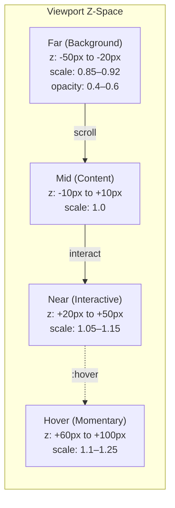
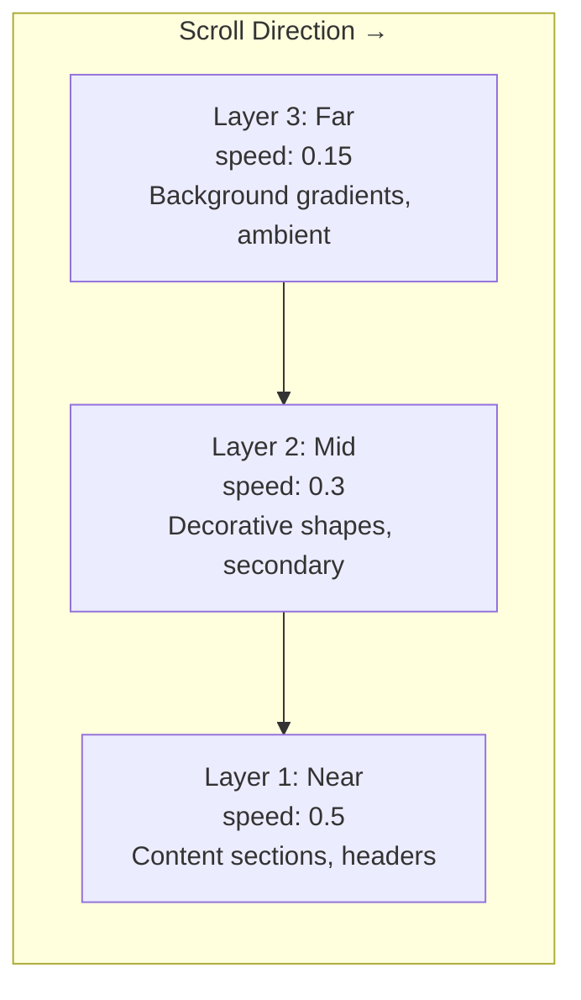
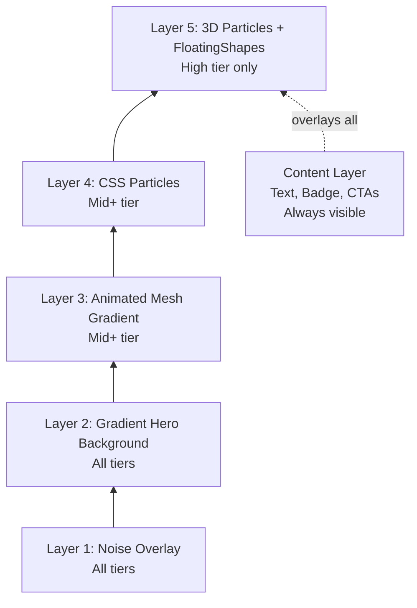
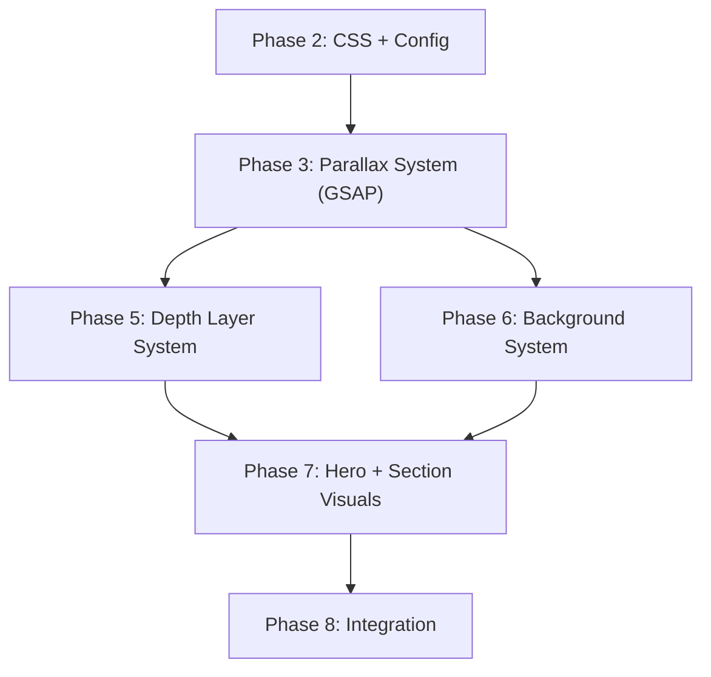

# Immersive Experience — Visual Effects & Background Systems

> **Document:** `08o-IMMERSIVE-EXPERIENCE.md` | **Version:** 1.1 | **Last Updated:** June 2026
> **Status:** ✅ Active | **Owner:** Design Lead | **Review Cadence:** Quarterly
> **⚠️ Disambiguation:** This document overlaps with other 3D/design docs. For the canonical reference, see:
> - 3D Architecture Strategy: `3D_ARCHITECTURE.md`
> - 3D Technical Implementation: `08k-3D-ARCHITECTURE.md`
> - 3D Usage Guidelines: `08j-USAGE-GUIDELINES.md`
> - Motion System: `08l-MOTION-SYSTEM.md`
> - Neumorphism: `08n-NEUMORPHISM.md`
> **Dependencies:** `DesignTokens.md` (Brand), `08a-DESIGN-SYSTEM-EXTENDED.md` (Tokens), `08j-3D-USAGE-GUIDELINES.md` (3D), `08k-3D-ARCHITECTURE.md` (3D), `08l-MOTION-SYSTEM.md` (Motion), `InteractionPatterns.md` (Interaction), `08n-NEUMORPHISM.md` (Neumorphism), `AccessibilityArchitecture.md` (A11y)
> **Implements:** `DesignTokens.md` §8 (Motion), §9 (3D), §11 (Glassmorphism), §12 (Depth), §13 (Shadows)

---

## Executive Summary

This document is the single source of truth for all visual effects used across the portfolio platform. It consolidates depth layering, parallax, background systems, lighting, particles, gradients, noise, blur, glow policy, hero/section visuals, and immersive experience rules into a unified reference. Every effect defined here respects device tier, connectivity, and accessibility constraints.

**Visual Effects Architecture:**

```
                    IMMERSIVE EXPERIENCE (08o)
                    /     |      |      |     \
          Parallax  Depth  Bg     Glow   Hero/Section
            |        |      |       |        |
          GSAP    z-space  Gradients 3D     Visual
        ScrollTrigger      Noise    split  Archetypes
              |              |
           08l-MOTION      DesignSystem
```

**Key Principles:**
- **Performance first**: No effect runs on Low-tier devices unless it's CSS-only and lightweight
- **Progressive enhancement**: All effects are additive — core experience works without them
- **Accessibility default**: Reduced motion kills all animated effects; high contrast removes decorative ones
- **Tiered degradation**: High → Mid → Low → Fallback, each step removes non-essential effects

---

## Table of Contents

1. [Depth Layer System](#1-depth-layer-system)
2. [Parallax System](#2-parallax-system)
3. [Background System](#3-background-system)
4. [Gradient System](#4-gradient-system)
5. [Noise System](#5-noise-system)
6. [Glow Policy](#6-glow-policy)
7. [Blur System](#7-blur-system)
8. [Particle System](#8-particle-system)
9. [Lighting System](#9-lighting-system)
10. [Hero Visuals](#10-hero-visuals)
11. [Section Visual Archetypes](#11-section-visual-archetypes)
12. [Immersive Experience Rules](#12-immersive-experience-rules)
13. [Device Tier Matrix](#13-device-tier-matrix)
14. [Implementation](#14-implementation)
15. [Cross-References](#15-cross-references)
16. [Risk Register](#16-risk-register)
17. [Architecture Decision Records](#17-architecture-decision-records)
18. [Test Strategy](#18-test-strategy)
19. [KPI & Metrics Dashboard](#19-kpi--metrics-dashboard)
20. [Integration Contracts](#20-integration-contracts)
21. [Change Log](#21-change-log)

---

## 1. Depth Layer System

### 1.1 Depth Architecture

The depth layer system creates a z-space illusion using CSS `perspective` and `translateZ`. It divides the viewport into three spatial layers that the user perceives as "near", "mid", and "far".



### 1.2 Depth Tokens

| Token | Value | Use |
|-------|-------|-----|
| `--perspective-container` | `1000px` | Parent perspective for all depth layers |
| `--z-space-far` | `-50px` to `-20px` | Background layer (gradients, noise, ambient particles) |
| `--z-space-mid` | `-10px` to `+10px` | Content layer (cards, text, images, interactive) |
| `--z-space-near` | `+20px` to `+50px` | Interactive layer (CTAs, featured elements) |
| `--z-space-hover` | `+60px` to `+100px` | Hover state layer (momentary, interactive only) |
| `--depth-scale-far` | `0.85` to `0.92` | Scale applied to far-layer elements |
| `--depth-scale-near` | `1.05` to `1.15` | Scale applied to near-layer elements |
| `--depth-opacity-far` | `0.4` to `0.6` | Opacity applied to far-layer elements |

### 1.3 Depth Layer Rules

| Rule | Implementation |
|------|---------------|
| **Fixed perspective parent** | `perspective: 1000px` on the section container; never on body/html |
| **TranslateZ only** | Use `transform: translateZ()` for depth, never `translateY` or `scale` alone |
| **Preserve-3D on children** | `transform-style: preserve-3d` on all direct children of perspective parent |
| **Will-change** | `will-change: transform` on depth layers (GPU promotion) |
| **No depth on mobile** | Skip depth layers on `pointer: coarse` or viewport < 768px |
| **Reduce distance on Mid tier** | Far: -20px max (not -50px); Near: +20px max (not +50px) |
| **No depth on Low tier** | All elements at `translateZ(0)` |
| **Reduced motion** | Depth layers are static (no translation animation on scroll) |
| **Max 3 layers** | Far + Mid + Near. Never add a 4th. |
| **Hover layer = additive** | Elements at Near may temporarily elevate to Hover on `:hover` |

### 1.4 CSS Implementation

```css
.depth-section {
  perspective: 1000px;
  perspective-origin: 50% 50%;
}

.depth-far {
  transform: translateZ(-50px) scale(0.85);
  opacity: 0.5;
  will-change: transform;
}

.depth-mid {
  transform: translateZ(0);
}

.depth-near {
  transform: translateZ(30px) scale(1.08);
  will-change: transform;
}

.depth-hover {
  transform: translateZ(80px) scale(1.15);
  transition: transform 200ms ease-out;
}
```

---

## 2. Parallax System

### 2.1 Parallax Architecture

Parallax creates a sense of depth by moving background layers at a slower rate than foreground layers during scroll. The system uses GSAP ScrollTrigger for scroll-linked animations.



### 2.2 Parallax Speed Levels

| Speed | Value | Layer | Use |
|-------|-------|-------|-----|
| **Subtle** | 0.15 | Far | Background gradients, ambient textures, noise |
| **Medium** | 0.3 | Mid-back | Decorative shapes, secondary visuals |
| **Fast** | 0.5 | Mid-front | Content sections, section headers |
| **Cinematic** | 0.8 | Near-hero | Hero foreground (use sparingly) |
| **Max** | 1.0 | — | Absolute ceiling — never exceed |

### 2.3 Parallax Rules

| Rule | Implementation |
|------|---------------|
| **GSAP ScrollTrigger** | All scroll-linked parallax uses GSAP with ScrollTrigger plugin |
| **Reduced motion = speed 0** | Parallax layers stay at original position (no scroll-linked movement) |
| **No parallax on mobile** | Skip on `pointer: coarse` or viewport < 768px |
| **Mid tier: cap at 0.3** | Maximum speed 0.3 on Mid-tier devices |
| **Low tier: no parallax** | All parallax disabled; static layout |
| **Max speed 1.0** | Absolute speed ceiling — beyond that breaks entrophy and causes nausea |
| **yPercent only** | Always use `yPercent` or `translateY` for parallax, never `top` or `margin` |
| **Clamp to viewport** | Parallax elements must never scroll out of their parent bounds |
| **Batch DOM reads** | Use `ScrollTrigger.refresh()` after dynamic content loads |
| **will-change: transform** | Applied to all parallax layer elements |

### 2.4 Parallax Implementation

```tsx
// Hook: useParallax(speed, direction?)
// Components: ParallaxLayer, ParallaxSection

// ParallaxLayer — wraps any element with parallax scroll behavior
<ParallaxLayer speed={0.3} direction="up">
  <div>Content moves slower than scroll</div>
</ParallaxLayer>

// ParallaxSection — full section with background + foreground layers
<ParallaxSection
  backgroundSpeed={0.15}
  foregroundSpeed={0.5}
  background={<MeshGradient />}
>
  <SectionContent />
</ParallaxSection>
```

### 2.5 GSAP ScrollTrigger Configuration

```tsx
import { gsap } from 'gsap';
import { ScrollTrigger } from 'gsap/ScrollTrigger';

gsap.registerPlugin(ScrollTrigger);

// Per-element parallax timeline
gsap.fromTo(
  element,
  { y: 0 },
  {
    y: () => -(element.offsetHeight * speed * 0.5),
    ease: 'none',
    scrollTrigger: {
      trigger: element.parentElement,
      start: 'top bottom',
      end: 'bottom top',
      scrub: true,
      invalidateOnRefresh: true,
    },
  }
);
```

---

## 3. Background System

### 3.1 Background Architecture

The background system provides a unified way to apply visual backgrounds to any section or element. Each background type has a CSS custom property, a Tailwind utility class, and device tier support.

```
Background Variants:
  ┌──────────────────────────────────────────┐
  │  None / Solid / Gradient / Glass /       │
  │  Noise / Dots / Mesh / Scrim / Image     │
  └──────────────────────────────────────────┘
```

### 3.2 Background Tokens

| Token | CSS Variable | Type | Default Value |
|-------|-------------|------|---------------|
| `--gradient-hero` | `--gradient-hero` | Gradient | `linear-gradient(135deg, accent-500, cyan)` |
| `--gradient-cta` | `--gradient-cta` | Gradient | `linear-gradient(135deg, accent-500, accent-700)` |
| `--gradient-glass` | `--gradient-glass` | Gradient | `linear-gradient(135deg, rgba(255,255,255,0.1), rgba(255,255,255,0.05))` |
| `--gradient-mesh-1` | `--gradient-mesh-1` | Gradient | Mesh gradient (3-5 color CSS radial gradient) |
| `--gradient-mesh-2` | `--gradient-mesh-2` | Gradient | Mesh gradient variant 2 |
| `--noise-opacity` | `--noise-opacity` | Opacity | `0.02` (light), `0.03` (dark) |
| `--scrim-light` | `--scrim-light` | Scrim | `rgba(0,0,0,0.3)` |
| `--scrim-dark` | `--scrim-dark` | Scrim | `rgba(0,0,0,0.6)` |
| `--overlay-subtle` | `--overlay-subtle` | Overlay | `rgba(0,0,0,0.05)` |
| `--overlay-medium` | `--overlay-medium` | Overlay | `rgba(0,0,0,0.15)` |
| `--overlay-heavy` | `--overlay-heavy` | Overlay | `rgba(0,0,0,0.3)` |
| `--dot-color` | `--dot-color` | Dot pattern | `var(--border-primary)` |
| `--dot-size` | `--dot-size` | Dot size | `1px` |
| `--dot-spacing` | `--dot-spacing` | Dot spacing | `20px` |
| `--grid-color` | `--grid-color` | Grid line | `var(--border-primary)` |
| `--grid-size` | `--grid-size` | Grid size | `24px` |

### 3.3 Background Variant Specification

| Variant | CSS | Device Tier | Performance Cost |
|---------|-----|-------------|-----------------|
| **None** | `background: none` | All | 0 |
| **Solid** | `background: var(--surface-*)` | All | 0 |
| **Gradient (simple)** | `background: var(--gradient-hero)` | All | 0 |
| **Gradient (mesh)** | `background: var(--gradient-mesh-1)` | Mid+ | Low |
| **Glass** | `.glass-subtle/medium/prominent` | All | Low (backdrop-filter) |
| **Noise** | `.noise-overlay` | All | Low (CSS only) |
| **Dots** | `.bg-dots` | All | Low |
| **Grid** | `.bg-grid` | All | Low |
| **Mesh gradient (animated)** | CSS `@keyframes` mesh animation | High | Medium (re-layout) |
| **Scrim** | `.scrim-*` | All | 0 |
| **Image** | `background-image: url()` | Mid+ | Varies by file size |

### 3.4 Background Utility Classes

```css
/* ── Dot Pattern ────────────────────────────── */
.bg-dots {
  background-image: radial-gradient(circle, var(--dot-color) var(--dot-size), transparent var(--dot-size));
  background-size: var(--dot-spacing) var(--dot-spacing);
}

/* ── Grid Pattern ───────────────────────────── */
.bg-grid {
  background-image: linear-gradient(var(--grid-color) 1px, transparent 1px),
                    linear-gradient(90deg, var(--grid-color) 1px, transparent 1px);
  background-size: var(--grid-size) var(--grid-size);
}

/* ── Mesh Gradient ──────────────────────────── */
.bg-mesh-1 {
  background:
    radial-gradient(ellipse 80% 50% at 50% -20%, var(--accent-500), transparent),
    radial-gradient(ellipse 50% 80% at 80% 50%, #06b6d4, transparent),
    radial-gradient(ellipse 50% 80% at 20% 50%, #a78bfa, transparent);
}

.bg-mesh-2 {
  background:
    radial-gradient(ellipse 60% 60% at 20% 80%, var(--accent-500), transparent),
    radial-gradient(ellipse 60% 60% at 80% 20%, #6ee7b7, transparent),
    radial-gradient(ellipse 60% 60% at 50% 50%, #a78bfa, transparent);
}

/* ── Scrim Overlays ─────────────────────────── */
.scrim-light {
  position: relative;
}
.scrim-light::after {
  content: '';
  position: absolute;
  inset: 0;
  background: var(--scrim-light);
  pointer-events: none;
}

.scrim-dark {
  position: relative;
}
.scrim-dark::after {
  content: '';
  position: absolute;
  inset: 0;
  background: var(--scrim-dark);
  pointer-events: none;
}

/* ── Overlay Subtle/Medium/Heavy ────────────── */
.overlay-subtle { position: relative; }
.overlay-subtle::after {
  content: '';
  position: absolute;
  inset: 0;
  background: var(--overlay-subtle);
  pointer-events: none;
}
```

### 3.5 Background Selection Matrix per Section

| Section | Default Bg | Mobile | Mid Tier | High Tier |
|---------|-----------|--------|----------|-----------|
| **Hero** | Gradient-hero + noise | Gradient-hero (static) | +3D particles | +3D particles + parallax |
| **About** | Noise + glass cards | Noise + flat cards | +Glass cards | +Glass cards |
| **Skills** | Glass cards | Flat cards | +Glass cards | +Glass cards |
| **Projects** | Mesh-1 | Solid alt | +Mesh-1 | +Mesh-1 animated |
| **Experience** | Dots + subtle gradient | Solid alt | +Dots | +Dots + parallax timeline |
| **Testimonials** | Glass + blur cards | Flat cards | +Glass | +Glass |
| **Blog Preview** | Noise + glass | Flat cards | +Glass | +Glass |
| **Contact** | Mesh-2 | Solid | +Mesh-2 | +Mesh-2 |
| **Footer** | Solid (surface-secondary) | Solid | +Noise | +Noise |

---

## 4. Gradient System

### 4.1 Gradient Tokens

| Token | Value (Light) | Value (Dark) | Usage |
|-------|--------------|--------------|-------|
| `--gradient-hero` | `linear-gradient(135deg, #6366F1, #06b6d4)` | `linear-gradient(135deg, #6366F1, #0891b2)` | Hero background |
| `--gradient-cta` | `linear-gradient(135deg, #6366F1, #4F46E5)` | `linear-gradient(135deg, #6366F1, #818CF8)` | CTA buttons, accent sections |
| `--gradient-glass` | `linear-gradient(135deg, rgba(255,255,255,0.12), rgba(255,255,255,0.06))` | Same | Glass card background layer |
| `--gradient-text-hero` | `linear-gradient(135deg, #6366F1, #06b6d4)` | Same | Hero heading text (via `background-clip: text`) |
| `--gradient-success` | `linear-gradient(135deg, #22C55E, #16A34A)` | Same | Success banners, badges |
| `--gradient-error` | `linear-gradient(135deg, #EF4444, #DC2626)` | Same | Error banners, badges |

### 4.2 Gradient Classes

```css
.bg-gradient-hero {
  background: var(--gradient-hero);
}

.bg-gradient-cta {
  background: var(--gradient-cta);
}

.text-gradient-hero {
  background: var(--gradient-text-hero);
  -webkit-background-clip: text;
  background-clip: text;
  -webkit-text-fill-color: transparent;
}
```

### 4.3 Gradient Usage Rules

| Rule | Implementation |
|------|---------------|
| **Hero heading only for text gradients** | Gradients on text via `background-clip: text` are only for the hero H1 |
| **Two-color max for UI gradients** | Hero gradient is accent → cyan; CTAs accent → deeper accent |
| **Mesh gradients can have 3-5 colors** | Mesh gradients use radial gradients with CSS only (no images) |
| **Never gradient on interactive text** | Links, buttons, labels — solid color only (readability) |
| **Gradient background ≠ gradient text** | Background colors may use gradients independently of text |
| **No animated gradients on Low tier** | Static gradient only; no `@keyframes` gradient animation |

---

## 5. Noise System

### 5.1 Noise Specification

| Property | Light Theme | Dark Theme |
|----------|-------------|------------|
| Opacity | 0.02 | 0.03 |
| Filter type | `fractalNoise` | `fractalNoise` |
| Base frequency | 0.9 | 0.9 |
| Octaves | 4 | 4 |
| z-index | 100 (page overlay) | 100 |

### 5.2 Noise Rules

| Rule | Implementation |
|------|---------------|
| **Global page overlay** | `.noise-overlay` applied to body via layout.tsx |
| **Per-section override** | Sections may set `z-index: auto` on noise to layer within section context |
| **No noise on modals** | Modal content sits above noise overlay |
| **SVG filter only** | Uses inline SVG `feTurbulence` filter (no image loading, no JS) |
| **No animation** | Noise texture is static — never animate the SVG filter |
| **Reduced motion unaffected** | Noise isn't motion — keep it active even with `prefers-reduced-motion: reduce` |

---

## 6. Glow Policy

### 6.1 Enterprise Glow Split

Per ADR (see also `DesignTokens.md` §13.2 update), glow effects follow a strict split:

```
GLOW POLICY
├── 3D/Particle Context ✅ ALLOWED
│   ├── Three.js BloomEffect (physically-based)
│   ├── Particle glow in shaders (physically-based)
│   └── ChromaticAberration (post-processing)
│
└── UI Context ⚠️ LIMITED
    ├── Focus rings: allowed (accent-colored box-shadow)
    ├── Active/selected states: allowed (accent inner shadow)
    ├── Accent CTA hover: allowed (subtle accent shadow)
    └── ❌ NO neon glow, NO blur glow, NO text glow
```

### 6.2 UI Glow Tokens

| Token | Value | Usage |
|-------|-------|-------|
| `--shadow-accent-focus` | Light: `0 0 0 3px rgba(99,102,241,0.35)`, Dark: `0 0 0 3px rgba(129,140,248,0.5)` | Focus ring on interactive elements |
| `--shadow-accent-active` | Light: `inset 0 0 0 2px rgba(99,102,241,0.2)`, Dark: `inset 0 0 0 2px rgba(129,140,248,0.3)` | Active/pressed state on accent elements |
| `--shadow-accent-hover` | Light: `0 4px 14px rgba(99,102,241,0.25)`, Dark: `0 4px 14px rgba(129,140,248,0.35)` | Hover state on primary CTA buttons |

### 6.3 What Is Not Glow

| Effect | Classification | Policy |
|--------|---------------|--------|
| `backdrop-filter: blur()` | Glassmorphism | Allowed (not glow) |
| `box-shadow: 0 4px 6px rgba(0,0,0,0.1)` | Standard shadow | Allowed (not glow) |
| `text-shadow: 0 2px 4px rgba(0,0,0,0.1)` | Text shadow | Allowed (not glow) |
| `drop-shadow()` filter | Standard shadow | Allowed (not glow) |
| Three.js `UnrealBloomPass` | 3D post-processing | Allowed (3D context) |
| `box-shadow: 0 0 20px rgba(99,102,241,0.5)` | Colored shadow glow | ❌ Not allowed in UI |

### 6.4 3D Glow Rules

| Rule | Implementation |
|------|---------------|
| **Bloom only on High tier** | `UnrealBloomPass` threshold: 0.8; strength: 0.3; radius: 0.5 |
| **No bloom on Mid/Low** | Fallback to unbloomed rendering |
| **Particle glow via shader** | Custom `particleColor` shader handles glow falloff |
| **Reduced motion** | Bloom effect still renders (not motion-based), but reduce intensity by 50% |

---

## 7. Blur System

### 7.1 Blur Tokens

| Token | Value | Usage |
|-------|-------|-------|
| `--blur-sm` | `4px` | Subtle blur (decorative backgrounds) |
| `--blur-md` | `8px` | Glass subtle level |
| `--blur-lg` | `12px` | Glass medium level |
| `--blur-xl` | `16px` | Glass prominent level |
| `--blur-2xl` | `24px` | Decorative orb blur (Hero) |
| `--blur-3xl` | `48px` | Large decorative blur |

### 7.2 Blur Rules

| Rule | Implementation |
|------|---------------|
| **Backdrop blur ≠ blur** | Glass uses `backdrop-filter: blur()`, decorative uses `filter: blur()` |
| **Max backdrop blur 16px** | Beyond 16px causes motion sickness per 07-DESIGN §11.3 |
| **Decorative blur max 48px** | For animated background orbs only |
| **No blur on text** | Never apply blur to text elements (unreadable) |
| **Reduced motion** | Animated blur elements stop; static blur remains |

---

## 8. Particle System

### 8.1 Particle Types

| Type | Technology | Context | Performance Cost | Device Tier |
|------|-----------|---------|-----------------|-------------|
| **3D Three.js** | `@react-three/fiber` + `PointsMaterial` | Hero ambient background | Medium-High | High only |
| **CSS particles** | CSS `@keyframes` + `translate` loops | Hero fallback, section accents | Low | Mid+ |
| **Canvas 2D** | `<canvas>` + `requestAnimationFrame` | Background particle overlay | Medium | Mid+ (fallback if WebGL unavailable) |

### 8.2 3D Particle Specification

See [`08k-3D-ARCHITECTURE.md`](./08k-3D-ARCHITECTURE.md) §4 (Particle System) for full specification. Summary:

| Property | Value |
|----------|-------|
| Count | 100-200 (High), 50-100 (Mid fallback) |
| Material | `PointsMaterial` with custom ShaderMaterial |
| Size | 0.02-0.08 units |
| Movement | Ambient float (mouse-reactive on desktop) |
| Colors | Accent-500 + cyan, theme-aware via `themeColors.ts` |

### 8.3 CSS Particle Specification

```css
/* ── Lightweight CSS particle overlay ────────── */
.particle-container {
  position: absolute;
  inset: 0;
  overflow: hidden;
  pointer-events: none;
}

.particle {
  position: absolute;
  width: 4px;
  height: 4px;
  background: var(--accent-500);
  border-radius: 50%;
  opacity: 0.3;
  animation: particle-float 6s ease-in-out infinite;
}

.particle:nth-child(2n) {
  animation-delay: -2s;
  width: 3px;
  height: 3px;
  opacity: 0.2;
}

.particle:nth-child(3n) {
  animation-delay: -4s;
  width: 6px;
  height: 6px;
  opacity: 0.15;
}

@keyframes particle-float {
  0%, 100% {
    transform: translateY(0) translateX(0);
  }
  25% {
    transform: translateY(-20px) translateX(10px);
  }
  50% {
    transform: translateY(-10px) translateX(-5px);
  }
  75% {
    transform: translateY(-30px) translateX(15px);
  }
}
```

---

## 9. Lighting System

### 9.1 3D Lighting

See [`08k-3D-ARCHITECTURE.md`](./08k-3D-ARCHITECTURE.md) §5 (Lighting System). Summary:

| Light | Type | Intensity | Position |
|-------|------|-----------|----------|
| Ambient | `ambientLight` | 0.5 | N/A |
| Primary | `directionalLight` | 1.0 | (5, 10, 5) |
| Fill | `directionalLight` | 0.4 | (-3, 2, -4) |
| Rim | `directionalLight` | 0.3 | (0, -5, -8) |
| Point accent | `pointLight` | 0.6 | Moves with cursor |

### 9.2 CSS Ambient Lighting

CSS lighting simulates directional light through gradient placement and shadow direction:

| Property | Light Source | Value |
|----------|-------------|-------|
| Default gradient direction | Top-left → Bottom-right | `135deg` |
| Neumorphism light shadow | Top-left | Same direction |
| Neumorphism dark shadow | Bottom-right | Opposite direction |
| Hero gradient direction | Top-left → Bottom-right | `135deg` |
| Shadow bias | Light source is top-left | All shadows fall bottom-right |

### 9.3 Lighting Rules

| Rule | Implementation |
|------|---------------|
| **Consistent light source** | All shadows, gradients, and neumorphism assume top-left lighting |
| **3D light matches CSS light** | 3D scene directional lights originate from top-left quadrant |
| **No colored 3D lighting** | 3D lights are white/neutral; color comes from materials |
| **Ambient light only on Low tier 3D** | Directional lights cause visible polygons on low geometry |

---

## 10. Hero Visuals

### 10.1 Hero Visual Architecture

The hero section uses a layered visual approach that progressively enhances based on device capability:



### 10.2 Hero Visual Specifications

| Element | Implementation | Device Tier | Motion? |
|---------|---------------|-------------|---------|
| Background | `--gradient-hero` | All | Static |
| Animated orbs | CSS blur orbs (`blur-3xl`, translate animation) | Mid+ | Animated (reduced-motion aware) |
| Noise overlay | `.noise-overlay` | All | Static |
| Mesh gradient | CSS radial gradient overlay | High | Static |
| CSS particles | CSS animated dot overlay | Mid+ | Animated |
| 3D particles | Three.js `Particles.tsx` (100-200) | High | Animated + mouse-reactive |
| Floating shapes | Three.js `FloatingShapes.tsx` (3-5) | High | Animated + mouse-reactive |
| Content | Text, badge, CTAs | All | Staggered entrance (fade-in-up) |

### 10.3 Hero Fallback Chain

```
High Tier ──→ 3D Particles + FloatingShapes + MeshGradient + GradientHero + Noise
    ↓ (WebGL unavailable)
Mid+ Tier ───→ CSS Particles + MeshGradient + GradientHero + Noise
    ↓ (reduced-motion)
Mid Tier ─────→ GradientHero + MeshGradient (static) + Noise
    ↓ (Low device / poor connectivity)
Low Tier ─────→ GradientHero + Noise
    ↓ (prefers-contrast: more)
High Contrast → Solid surface-secondary background + 1px border
```

---

## 11. Section Visual Archetypes

### 11.1 Section Visual Matrix

Each section type has a defined visual archetype that determines its background, decoration, and effects:

| Section | Archetype | Background | Decoration | Depth | Parallax | Glass Cards |
|---------|-----------|------------|-------------|-------|----------|-------------|
| Hero | **Immersive** | Gradient-hero | 3D/CSS particles, blur orbs | Far layer | Cinematic (0.8) hero bg | No |
| About | **Clean** | Noise on surface-primary | None | Mid only | None | Yes (subtle) |
| Skills | **Technical** | Glass on surface-secondary | Dot pattern | Mid + Near | None | Yes (medium) |
| Experience | **Timeline** | Dots on surface-primary | Subtle gradient top | Mid only | Medium (0.3) timeline | Yes (subtle) |
| Projects | **Gallery** | Mesh-1 on surface-secondary | None | Mid + Near (hover) | Fast (0.5) section header | No (flat cards) |
| Testimonials | **Testimonial** | Glass on surface-primary | Noise | Mid only | None | Yes (prominent) |
| Blog Preview | **Content** | Noise on surface-primary | None | Mid only | Subtle (0.15) | Yes (subtle) |
| Stats/Counters | **Metric** | Solid surface-elevated | None | Mid + Near (neu) | None | No (neu cards) |
| Contact | **Action** | Mesh-2 on surface-secondary | Noise | Mid only | None | Yes (subtle) |
| FAQ | **Clean** | Solid surface-primary | None | Mid only | None | No (flat) |
| Services | **Feature** | Glass on surface-secondary | Dots | Mid + Near | None | Yes (medium) |
| Footer | **Terminal** | Solid surface-secondary | Noise | Mid only | None | No |

### 11.2 Archetype Definitions

| Archetype | Visual Language | Mood | Best For |
|-----------|----------------|------|----------|
| **Immersive** | Full depth stack, 3D, gradients, parallax | Bold, captivating | Hero, landing |
| **Clean** | Minimal effects, generous whitespace | Professional, clear | About, content |
| **Technical** | Glass cards, dot patterns, monospace | Precise, developer-oriented | Skills, services |
| **Timeline** | Vertical line, dots, subtle parallax | Narrative, chronological | Experience, case studies |
| **Gallery** | Card grid, hover depth, mesh bg | Visual, showcase | Projects, portfolio |
| **Testimonial** | Glass quotes, prominent cards | Trustworthy, social proof | Testimonials, reviews |
| **Content** | Noise texture, readability-first | Focused, readable | Blog, articles |
| **Metric** | Neumorphic stat cards, bold numbers | Data-driven, impactful | Stats, KPIs |
| **Action** | Vibrant mesh, clear CTAs | Motivational, directed | Contact, newsletter |
| **Feature** | Glass cards, dot accents, consistent grid | Comparative, feature-list | Services, features |
| **Terminal** | Minimal, dark/clean, footer-safe | Grounded, complete | Footer, copyright |

### 11.3 Section Transition Rules

| Transition | Direction | Duration | Easing | Stagger |
|------------|-----------|----------|--------|---------|
| Hero → About | Fade + slide up | 600ms | ease-out-smooth | 80ms per child |
| General section entrance | Fade + slide up | 500ms | ease-out-smooth | 80ms per child |
| CTA section entrance | Slide in from right | 400ms | ease-out | 100ms per child |
| Footer entrance | Fade in only | 300ms | ease-out | None |

---

## 12. Immersive Experience Rules

### 12.1 When to Combine Effects

| Combination | Allowed? | Rules |
|-------------|----------|-------|
| Depth + Parallax | ✅ | Far layer parallax + mid content = natural depth |
| Depth + Glass | ✅ | Glass cards at Mid layer, background at Far |
| Depth + Neumorphism | ✅ | Neu elements at Near layer, never at Far |
| Glass + Noise | ✅ | Noise on parent, glass on child |
| Gradient + Noise | ✅ | Gradient bg + noise overlay = standard hero pattern |
| Parallax + Particles | ✅ | Particles in Far layer with slow parallax |
| Depth + 3D | ✅ | 3D scene renders at Far layer, content at Mid |
| Blur Orbs + Mesh Gradient | ✅ | Orbs float above mesh background |
| Glow + Glass | ❌ | Glow on transparent surface breaks visual |
| Glow + Neumorphism | ❌ | Competing shadow/glow pairs look muddy |
| Neumorphism + Glass | ❌ | Solid + transparent on same element |
| Parallax + Mobile | ❌ | No parallax on `pointer: coarse` |
| 3D + Reduced Motion | ❌ | 3D scene degrades to static gradient |
| Animated Mesh + Low Tier | ❌ | Mesh gradient is static on Low tier |

### 12.2 Maximum Effects Per Section

| Section Tier | Max Active Effects | Notes |
|-------------|-------------------|-------|
| Hero | 5 (gradient, noise, particles, depth, parallax) | Hero is the immersive showcase |
| Content section (About, FAQ) | 2 (noise, glass) | Content > decoration |
| Gallery section (Projects) | 3 (mesh, depth, hover) | Visual balance |
| Data section (Stats) | 1 (neumorphism) | Numbers must be readable |
| Footer | 1 (noise) | Minimal, grounding |

### 12.3 Performance Budget per Effect

| Effect | CPU Cost | GPU Cost | Memory | Bundle Size |
|--------|----------|----------|--------|-------------|
| Depth layer (CSS) | 0 | Low | 0 | 0KB |
| Parallax (GSAP) | Low | Low | 0 | ~20KB (lazy) |
| Gradient (CSS) | 0 | 0 | 0 | 0KB |
| Noise (CSS) | 0 | Low | 0 | 0KB |
| Glassmorphism (CSS) | 0 | Low | 0 | 0KB |
| Blur (CSS) | 0 | Low | 0 | 0KB |
| CSS Particles | Low | Low | 0 | 0KB |
| Mesh Gradient (CSS) | Low | Low | 0 | 0KB |
| Dot/Grid pattern (CSS) | 0 | 0 | 0 | 0KB |
| Scrim overlay (CSS) | 0 | 0 | 0 | 0KB |
| 3D Three.js | Medium | High | Medium | ~50KB (lazy) |
| 3D Bloom (post-proc) | Low | High | Low | ~8KB (lazy) |

### 12.4 Tier Gating Rules

| Device Tier | Parallax | Depth | 3D | Animated Mesh | Bloom | CSS Particles | Glass | Neumorphism | Noise |
|-------------|----------|-------|-----|---------------|-------|---------------|-------|-------------|-------|
| **High** | ✅ 0.5 max | ✅ Full | ✅ | ✅ | ✅ | ✅ | ✅ | ✅ | ✅ |
| **Mid** | ✅ 0.3 max | ✅ Reduced | ❌ | ✅ Static | ❌ | ✅ | ✅ | ✅ | ✅ |
| **Low** | ❌ | ❌ | ❌ | ✅ Static | ❌ | ❌ | ✅ | ❌ | ✅ |
| **Reduced motion** | ✅ Speed 0 | ✅ Static | ❌ | ❌ Static | ✅ -50% | ❌ | ✅ | ✅ | ✅ |

### 12.5 Reduced Motion Override

When `prefers-reduced-motion: reduce` is active:

| Effect | Behavior | Exception |
|--------|----------|-----------|
| Parallax | Speed forced to 0 (static position) | None |
| Depth layer | Static (no translation animation) | None |
| 3D particles | Scene degrades to static gradient | None |
| CSS particles | Removed entirely | None |
| Animated mesh gradient | Static render (no color-shift animation) | None |
| Glassmorphism | Unaffected (no motion) | N/A |
| Neumorphism | Unaffected (no motion) | N/A |
| Noise | Unaffected (no motion) | N/A |
| Focus ring glow | Unaffected (no motion) | N/A |
| Loading shimmer | Reserved via `.essential-motion` class | Per 08l motion accessibility |

### 12.6 High Contrast Override

When `prefers-contrast: more` is active:

| Effect | Behavior |
|--------|----------|
| Parallax | Removed (speed 0) |
| Depth layer | Removed (all layers at z=0) |
| 3D scene | Removed (solid background) |
| Mesh gradient | Removed (solid background) |
| Glassmorphism | Removed (solid `surface-elevated` background, 1px border) |
| Neumorphism | Removed (solid background, 1px border) |
| Noise | Removed |
| Blur orbs | Removed |
| Glow/focus shadow | Increased to 3px solid accent border (no opacity) |

---

## 13. Device Tier Matrix

### 13.1 Tier Detection

| Tier | Detection | GPU | CPU Cores | Memory | Connection |
|------|-----------|-----|-----------|--------|------------|
| **High** | `hardwareConcurrency ≥ 8`, `deviceMemory ≥ 4`, `maxTouchPoints ≤ 0` | Dedicated GPU likely | 8+ | 4GB+ | 4G+ |
| **Mid** | `hardwareConcurrency ≥ 4`, `deviceMemory ≥ 2` | Integrated GPU | 4-7 | 2-4GB | 3G+ |
| **Low** | `hardwareConcurrency < 4`, `deviceMemory < 2`, `pointer: coarse` | Software rendering | < 4 | < 2GB | 2G/3G |
| **Reduced motion** | `prefers-reduced-motion: reduce` | Any | Any | Any | Any |
| **High contrast** | `prefers-contrast: more` | Any | Any | Any | Any |

### 13.2 Feature Support by Tier

| Feature | High | Mid | Low | Reduced Motion | High Contrast |
|---------|------|-----|-----|---------------|---------------|
| CSS transitions | ✅ | ✅ | ✅ | ❌ | ✅ |
| CSS animations | ✅ | ✅ | ✅ | ❌ | ✅ |
| `backdrop-filter: blur()` | ✅ | ✅ | ✅ | ✅ | ❌ (replaced) |
| GSAP ScrollTrigger | ✅ | ✅ | ❌ | ✅ (speed 0) | ❌ |
| WebGL 2.0 | ✅ | ✅ | ❌ | ❌ | ❌ |
| WebGL 1.0 | ⬇ fallback | ⬇ fallback | ❌ | ❌ | ❌ |

---

## 14. Implementation

### 14.1 File Inventory

| File | Purpose | Phase |
|------|---------|-------|
| `apps/web/src/styles/globals.css` | Depth, blur, scrim, dot, grid, mesh classes; glow tokens; animation vars | P2 |
| `apps/web/tailwind.config.ts` | Neumorphism utilities, depth/perspective tokens, gradient extensions | P2 |
| `apps/web/src/hooks/useParallax.ts` | GSAP ScrollTrigger parallax hook | P3 |
| `apps/web/src/components/effects/ParallaxLayer.tsx` | Generic parallax wrapper component | P3 |
| `apps/web/src/components/effects/ParallaxSection.tsx` | Full-section parallax with bg + fg layers | P3 |
| `apps/web/src/components/effects/DepthLayer.tsx` | z-space depth positioning component | P5 |
| `apps/web/src/components/effects/DepthScene.tsx` | Multi-layer depth container | P5 |
| `apps/web/src/components/effects/MeshGradient.tsx` | CSS animated mesh gradient | P6 |
| `apps/web/src/components/effects/DotGrid.tsx` | Background dot pattern component | P6 |
| `apps/web/src/components/layout/SectionBackground.tsx` | Unified background wrapper | P6 |
| `apps/web/src/components/effects/HeroParticles.tsx` | CSS particle overlay (3D fallback) | P7 |
| `apps/web/src/components/sections/Hero.tsx` | Visual enhancement (depth, parallax, mesh) | P7 |
| `apps/web/src/components/layout/SectionWrapper.tsx` | Add bg-mesh, bg-dots variants | P7 |

### 14.2 Dependency Graph



### 14.3 GSAP Package Installation

```bash
npm install gsap
```

GSAP is lazy-loaded via `next/dynamic` on pages where parallax is needed. It is not bundled globally. The 08l-MOTION-SYSTEM.md budget for GSAP is ~20KB lazy-loaded.

---

## 15. Cross-References

| Document | Section | Relationship |
|----------|---------|-------------|
| [`DesignTokens.md`](./DesignTokens.md) | §8 Motion, §9 3D, §11 Glass, §12 Depth, §13 Shadow, §14 Animation | Immersive system implements these visual rules at the component level |
| [`08a-DESIGN-SYSTEM-EXTENDED.md`](./08a-DESIGN-SYSTEM-EXTENDED.md) | §2.1 Color, §2.5 Elevation, §2.7 Animation | Tokens extended with mesh gradients, depth, glow-accent-focus |
| [`08j-3D-USAGE-GUIDELINES.md`](./08j-3D-USAGE-GUIDELINES.md) | §4 Device Tiers, §5 Fallback Chain | 3D tier detection reused; fallback chain extended with CSS particles |
| [`08k-3D-ARCHITECTURE.md`](./08k-3D-ARCHITECTURE.md) | §4 Particles, §5 Lighting, §6 Effects | 3D particle count, lighting system, bloom specification |
| [`08l-MOTION-SYSTEM.md`](./08l-MOTION-SYSTEM.md) | §9 Reduced Motion, §10 Performance | Parallax motion rules, GSAP lazy-load budget, reduced-motion kill-switch |
| [`InteractionPatterns.md`](./InteractionPatterns.md) | §8 Scroll, §10 3D Interaction | Scroll-reactive parallax, 3D mouse-reactive interaction |
| [`08n-NEUMORPHISM.md`](./08n-NEUMORPHISM.md) | §2 Elevation, §3 Color, §7 Composition | Neumorphism as additive effect for metric sections |
| [`AccessibilityArchitecture.md`](./AccessibilityArchitecture.md) | §4 Color, §5 Motion, §8 High Contrast | All immersive effects respect a11y constraints; HC mode overrides |

---

## 16. Risk Register

| ID | Risk | Likelihood | Impact | Severity | Mitigation |
|----|------|-----------|--------|----------|------------|
| R-001 | GSAP bundle load delays scroll-linked effects on slow connections | Medium | Medium | High | Lazy-load GSAP; parallax is additive (content visible without it) |
| R-002 | Multiple depth layers cause scroll jank on integrated GPUs | Medium | High | High | Cap at 3 layers; skip depth on Mid tier; `will-change: transform` GPU promotion |
| R-003 | CSS mesh gradients cause repaints on scroll | Low | Medium | Medium | Static mesh only on Mid tier; animate only on High |
| R-004 | Noise overlay at z-index 100 covers modals | Low | High | High | Modal container at z-index 110; or use per-section noise instead of global |
| R-005 | `backdrop-filter: blur()` fails on Firefox Linux | Medium | Low | Low | Global fallback to solid `surface-elevated` if `@supports not (backdrop-filter: blur())` |
| R-006 | Dot/grid patterns cause moiré on high-DPI screens | Low | Low | Low | Adjust `--dot-spacing` and `--grid-size` with `min-resolution` media query |
| R-007 | Parallax + reduced motion conflict: position snap on speed=0 | Low | Medium | Medium | Reduce motion: set `y: 0` via ScrollTrigger, not `display: none` |
| R-008 | CSS particle count causes layout thrash on mobile | Low | Medium | Medium | CSS particles limited to viewport-relative sizing; max 20 particles |
| R-009 | Mesh gradient colors clash with content text | Low | High | High | Always verify text contrast on mesh backgrounds; scrim overlay if needed |
| R-010 | 3D scene + mesh gradient + parallax = excessive GPU draw calls on Mid tier | Medium | High | High | Tier gating prevents 3D + animated mesh + parallax on Mid; max 2 heavy effects |

---

## 17. Architecture Decision Records

### ADR-001: CSS Perspective Over JS Z-Space

| Field | Value |
|-------|-------|
| **Decision** | Use CSS `perspective` + `translateZ` for depth layering rather than JavaScript-based z-positioning or Three.js scene depth |
| **Options** | CSS perspective + translateZ, Three.js scene layering, JS-calculated `transform: translateY()` parallax, CSS 3D transforms |
| **Rationale** | CSS perspective is GPU-composited, zero JS cost, works with existing layout. Three.js depth would require a full 3D scene wrapper even for 2D content. JS parallax re-calculates on every scroll event (jank risk). |
| **Tradeoffs** | Limited to 3 layers + hover; no intersection between layers; cannot animate between layers |

### ADR-002: GSAP ScrollTrigger Over Intersection Observer

| Field | Value |
|-------|-------|
| **Decision** | Use GSAP ScrollTrigger for scroll-linked parallax rather than native Intersection Observer or Framer Motion scroll |
| **Options** | GSAP ScrollTrigger, Intersection Observer, Framer Motion `useScroll`, scroll event listeners |
| **Rationale** | GSAP provides scrub (scroll-proportional animation), `invalidateOnRefresh` for dynamic layouts, ease control, and built-in kill switch. Framer Motion's `useScroll` couples to React render cycle (extra re-renders). Intersection Observer lacks scrub. |
| **Tradeoffs** | ~20KB lazy-loaded dependency; requires `next/dynamic` wrapper |

### ADR-003: CSS-Only Particles Over Canvas

| Field | Value |
|-------|-------|
| **Decision** | Use CSS `@keyframes` for Mid-tier particles (no Canvas/JS) and Three.js for High-tier (not Canvas 2D) |
| **Options** | CSS keyframes only, Canvas 2D `requestAnimationFrame`, Three.js `PointsMaterial`, no particles |
| **Rationale** | CSS particles are 0KB, zero JS, and composited on GPU. Canvas 2D requires `<canvas>` setup, resize handling, and RAF loop. Three.js is already available for High tier. Two-tier approach covers all device levels. |
| **Tradeoffs** | CSS particles are limited (no mouse interaction, no variable count) — acceptable for fallback |

### ADR-004: Enterprise Glow Policy Split

| Field | Value |
|-------|-------|
| **Decision** | Strict split between 3D/particle glow (allowed, physically-based) and UI glow (limited to accent-colored focus/active/hover shadows) |
| **Options** | Full glow everywhere, no glow anywhere, split policy |
| **Rationale** | Full glow in UI creates distracting neon effects. No glow prevents 3D from looking cinematic. Split policy gives 3D creative freedom while keeping UI professional and accessible. |
| **Tradeoffs** | Enforcement requires code review + lint rules; edge cases (e.g., hybrid 3D/UI elements) need manual classification |

### ADR-005: Device Tier Detection via Feature Queries

| Field | Value |
|-------|-------|
| **Decision** | Use client-side feature detection (`navigator.hardwareConcurrency`, `deviceMemory`, `pointer: coarse`, `prefers-reduced-motion`, `prefers-contrast: more`) rather than server-side user-agent parsing |
| **Options** | Client-side feature detection, server-side user-agent parsing, combination approach |
| **Rationale** | Feature detection reflects actual device capability, not marketing name. UA parsing is unreliable (spoofing, new devices). Combination approach duplicates logic. CSS media queries handle reduced-motion and contrast natively. |
| **Tradeoffs** | Initial render may show default content before tier detection completes; mitigated by CSS-only first render with JS enhancement |

---

## 18. Test Strategy

### 18.1 Test Levels

| Level | Scope | Tool | Frequency |
|-------|-------|------|-----------|
| **Unit** | Component render, prop combinations, state transitions | Vitest + React Testing Library | Every commit |
| **Visual regression** | Effect rendering, theme appearance, device tier simulation | Playwright + Percy | Every PR |
| **Accessibility** | Keyboard nav, focus management, HC mode, reduced motion | axe-core + manual keyboard | Every PR |
| **Integration** | Multi-effect combination, tier switching, section layout | Vitest + jsdom | Every sprint |
| **Cross-browser** | WebGL support, backdrop-filter support, GSAP behavior | Playwright (3 engines) | Weekly |
| **Performance** | Paint time, reflow cost, GPU draw call count | Lighthouse CI + DevTools | Every PR |

### 18.2 Effect Test Matrix

| Effect | Unit Tests | Visual Tests | A11y Tests | Perf Tests |
|--------|-----------|-------------|------------|------------|
| Depth layer | Render with far/mid/near/hover props | Snapshot at each layer | HC mode flattens to z=0 | Paint time < 1ms |
| Parallax | Hook returns correct speed | Scroll-triggered position | RM speed = 0 | Layout shift check |
| Background system | All 10 variants render | Screenshot each variant | HC mode: solid fallback | Bundle size < 0KB (CSS) |
| MeshGradient | Animated vs static variant | Screenshot both variants | HC mode: solid bg | Repaint count |
| DotGrid | Custom spacing/dot-size props | Screenshot 3 configs | N/A | Paint time < 0.5ms |
| SectionBackground | All variant combos | Screenshot 5 key combos | N/A | N/A |
| HeroParticles | Render with count prop | Screenshot default | RM: removed entirely | DOM node count |
| Hero visual stack | Tier simulation (High/Mid/Low/HC) | Screenshot each tier | HC mode verified | LCP budget check |

### 18.3 Device Tier Simulation Tests

| Test | Setup | Expected |
|------|-------|----------|
| High tier | `hardwareConcurrency=8`, `deviceMemory=8`, `pointer=fine` | 3D particles + animated mesh + parallax active |
| Mid tier | `hardwareConcurrency=4`, `deviceMemory=4`, `pointer=fine` | CSS particles + static mesh + parallax (0.3 cap) |
| Low tier | `hardwareConcurrency=2`, `deviceMemory=1`, `pointer=coarse` | Gradient only + noise; no parallax, no depth, no particles |
| Reduced motion | `prefers-reduced-motion: reduce` | All animations stopped; parallax speed=0; particles removed |
| High contrast | `prefers-contrast: more` | All effects removed; glass → solid+border; focus 3px solid |

### 18.4 Acceptance Criteria

| Criterion | Pass Condition | Method |
|-----------|---------------|--------|
| No effect breaks content readability | Text contrast ≥ 4.5:1 on all backgrounds | axe-core CI |
| All effects degrade gracefully | Each tier renders without JS errors | Playwright console check |
| Zero layout shift from effects | CLS contribution ≤ 0.01 | Lighthouse CI |
| HC mode removes all decorative effects | Visual diff vs flat baseline | Percy |
| RM mode kills all animations | `getAnimations()` returns empty for non-essential | DevTools check |
| Bundle for lazy-loaded effects | GSAP < 20KB; 3D < 60KB | bundle-analyzer |

---

## 19. KPI & Metrics Dashboard

### 19.1 Adoption & Quality KPIs

| Metric | Target | Measurement | Threshold | Owner |
|--------|--------|-------------|-----------|-------|
| Sections using visual effects | ≥ 80% | Design audit (monthly) | < 60%: review adoption | Design Lead |
| Tier-gating accuracy | 100% correct tier assignment | Manual audit per release | < 95%: fix detection | Dev Lead |
| Effect-related a11y violations (axe) | 0 critical, 0 serious | CI per PR | Any: block release | A11y Lead |
| Glass card readmore rate | ≥ 45% click-through | Analytics | < 30%: revisit affordance | UX Lead |
| Hero section engagement delta | ≥ +15% vs flat hero | A/B test analytics | < +5%: remove effects | Design Lead |

### 19.2 Performance SLAs

| Metric | P0 Target | P1 Target | Monitoring |
|--------|-----------|-----------|-----------|
| LCP contribution (all effects combined) | < 50ms | < 100ms | Lighthouse CI |
| Total effect CSS bytes | < 20KB | < 30KB | Bundle analyzer |
| GSAP lazy-loaded impact | < 20KB gzip | < 30KB | Import analysis |
| 3D scene load impact | 0ms (deferred) | < 100ms deferred | Web Vitals |
| Effect GPU memory (High tier, hero) | < 64MB | < 128MB | Chrome Task Manager |
| Animation frame rate (High tier) | 60fps | 55fps | `requestAnimationFrame` delta |
| Frame time budget per effect | < 2ms | < 4ms | DevTools Performance |

### 19.3 Section Visual Engagement Targets

| Section | Effect | Target CTR | Current | Goal |
|---------|--------|-----------|---------|------|
| Hero | Full visual stack (depth + parallax + particles) | ≥ 60% scroll-to-content | — | Add 10% vs flat |
| Projects | Mesh bg + hover depth | ≥ 35% click-to-detail | — | Add 5% vs flat |
| Experience | Dots + parallax timeline | ≥ 40% scroll depth | — | Add 8% vs flat |
| Testimonials | Glass cards | ≥ 20% quote click | — | Add 3% vs flat |
| Contact | Vibrant mesh | ≥ 15% form start | — | Add 5% vs flat |

### 19.4 Budget Alert Thresholds

| Alert | Threshold | Action |
|-------|-----------|--------|
| CSS effects exceed budget | > 25KB | Code review to remove unused variants |
| GSAP bundle exceeds 25KB | > 25KB gzip | Audit ScrollTrigger usage; consider tree-shaking |
| 3D scene load time (lazy) | > 500ms | Reduce particle count or simplify geometry |
| Glass card perf regression | > 3ms paint time | Replace backdrop-filter with solid fallback |

---

## 20. Integration Contracts

### 20.1 Effect → Section Interface

```typescript
// Each effect exposes this contract to section wrappers
interface EffectConfig {
  /** Unique effect identifier */
  id: string;
  /** Device tier gate: high | mid | low | all */
  tier: 'high' | 'mid' | 'low' | 'all';
  /** Reduced motion behavior: keep | static | remove */
  reducedMotion: 'keep' | 'static' | 'remove';
  /** High contrast behavior: keep | remove | solid */
  highContrast: 'keep' | 'remove' | 'solid';
  /** CSS bundle cost (bytes) */
  cssBytes: number;
  /** JS bundle cost (bytes gzip, 0 = CSS-only) */
  jsBytes: number;
  /** Whether effect requires client-side hydration */
  requiresHydration: boolean;
}

// Each effect provides these lifecycle hooks
interface EffectLifecycle {
  /** Called when effect enters viewport */
  onMount?: () => void;
  /** Called when effect leaves viewport */
  onUnmount?: () => void;
  /** Called when device tier changes */
  onTierChange?: (tier: DeviceTier) => void;
  /** Called when theme changes */
  onThemeChange?: (theme: 'light' | 'dark') => void;
  /** Called when reduced-motion preference changes */
  onMotionChange?: (reduced: boolean) => void;
}
```

### 20.2 Section ↔ Background Contract

```typescript
// SectionBackground accepts any background variant
type BackgroundVariant =
  | 'none' | 'solid'
  | 'gradient-hero' | 'gradient-cta'
  | 'glass' | 'noise'
  | 'dots' | 'grid'
  | 'mesh-1' | 'mesh-2'
  | 'scrim-light' | 'scrim-dark';

interface SectionBackgroundProps {
  variant: BackgroundVariant;
  /** Override default opacity/color via CSS custom properties */
  style?: React.CSSProperties;
  /** Children rendered ON TOP of background */
  children: React.ReactNode;
  /** Optional noise overlay on gradient/mesh variants */
  noiseOverlay?: boolean;
}
```

### 20.3 Depth ↔ Parallax Contract

```typescript
// Depth and parallax combine via ParallaxSection
interface ParallaxSectionProps {
  /** Speed for background layer (typically 0.15–0.3) */
  backgroundSpeed?: number;
  /** Speed for foreground layer (typically 0.3–0.5) */
  foregroundSpeed?: number;
  /** Background content rendered in far depth layer */
  background: React.ReactNode;
  /** Foreground content rendered in mid depth layer */
  children: React.ReactNode;
  /** Optional CSS perspective value (default: 1000px) */
  perspective?: string;
  /** Direction of parallax movement */
  direction?: 'up' | 'down';
}
```

### 20.4 Theme System Contract

```typescript
// All effects read theme from nearest [data-theme] ancestor
interface ThemeTokens {
  '--gradient-hero': string;
  '--gradient-cta': string;
  '--gradient-glass': string;
  '--gradient-mesh-1': string;
  '--gradient-mesh-2': string;
  '--noise-opacity': number;
  '--blur-sm' | '--blur-md' | '--blur-lg': string;
  '--shadow-accent-focus': string;
  '--shadow-accent-active': string;
  '--shadow-accent-hover': string;
  // Depth tokens inherit from parent perspective container
}

// Effects must NOT set theme variables themselves
// Theme is set once at <html> level via ThemeProvider
// Effects read via var() CSS functions
```

### 20.5 Effect Combination Rules (Formal)

```typescript
interface EffectCompatibility {
  effectA: string;
  effectB: string;
  /** allowed | denied | conditional */
  compatibility: 'allowed' | 'denied' | 'conditional';
  condition?: string;
}

const EFFECT_COMPATIBILITY_MATRIX: EffectCompatibility[] = [
  // Allowed pairs
  { effectA: 'depth', effectB: 'parallax', compatibility: 'allowed' },
  { effectA: 'depth', effectB: 'glass', compatibility: 'allowed' },
  { effectA: 'depth', effectB: 'neumorphism', compatibility: 'allowed' },
  { effectA: 'glass', effectB: 'noise', compatibility: 'allowed' },
  { effectA: 'gradient', effectB: 'noise', compatibility: 'allowed' },
  { effectA: 'parallax', effectB: 'particles', compatibility: 'allowed' },
  { effectA: 'depth', effectB: '3d', compatibility: 'allowed' },
  { effectA: 'blur-orb', effectB: 'mesh-gradient', compatibility: 'allowed' },
  // Denied pairs
  { effectA: 'glow', effectB: 'glass', compatibility: 'denied' },
  { effectA: 'glow', effectB: 'neumorphism', compatibility: 'denied' },
  { effectA: 'neumorphism', effectB: 'glass', compatibility: 'denied' },
  { effectA: 'parallax', effectB: 'mobile', compatibility: 'denied' },
  { effectA: '3d', effectB: 'reduced-motion', compatibility: 'denied' },
  // Conditional pairs
  { effectA: 'mesh-animated', effectB: 'low-tier', compatibility: 'conditional', condition: 'Static mesh only, no animation' },
];
```

---

## Decision Log

| ID | Decision | Rationale | Alternatives Considered | Date | Approver |
|----|----------|-----------|------------------------|------|----------|
| D-IE-001 | Parallax depth layers with CSS transforms for Mid/High tiers, disabled on Low/Mobile | Subtle depth cue without heavy JS; CSS transforms are GPU-accelerated; zero effect on mobile to preserve battery | JS-based parallax (rejected — scroll jank on low-end); no parallax (rejected — flat visual experience) | Jun 2026 | Design Lead |
| D-IE-002 | Background particle system using InstancedMesh (High tier only) | Thousands of particles in a single draw call; GPU-efficient; distinctive ambient visual | CSS particle animation (rejected — poor performance at scale); no particles (rejected — misses ambient depth opportunity) | Jun 2026 | Design Lead |
| D-IE-003 | Ambient glow via CSS gradient/box-shadow stack (all tiers) | Zero JavaScript; GPU-composited; works on all tiers including reduced motion; subtle enough for Low tier | Three.js bloom post-processing (rejected — ~15KB bundle, High tier only); SVG glow filters (rejected — inconsistent browser rendering) | Jun 2026 | Design Lead |
| D-IE-004 | Hero section with tier-dependent visual complexity (High: 3D mesh-animated, Mid: CSS parallax, Low: static gradient) | Every tier gets a visually appealing hero; no tier feels broken or empty; graceful degradation path | Single hero visual for all tiers (rejected — either over-engineered for Low or under-delivers on High); no hero effect (rejected — missed first-impression opportunity) | Jun 2026 | Design Lead |
| D-IE-005 | Noise texture overlay via CSS (all tiers) + animated SVG noise (Mid/High) | Adds subtle organic texture; CSS noise costs nothing; SVG animation adds depth on capable devices | Three.js noise shader (rejected — over-engineered for subtle background texture); no noise (rejected — flat, artificial feel) | Jun 2026 | Design Lead |
| D-IE-006 | Glow policy: 3 levels (none, subtle, prominent) mapped to device tier | Consistent glow language across all components; automatic tier-appropriate selection; no manual per-component decisions | Binary glow on/off (rejected — too coarse); per-component glow config (rejected — inconsistent across pages) | Jun 2026 | Design Lead |

---

## 21. Change Log

| Version | Date | Changes | Author |
|---------|------|---------|--------|
| 1.0 | Jun 2026 | Initial immersive experience documentation — depth layers, parallax, background system, gradients, noise, glow policy, blur, particles, lighting, hero visuals, section archetypes, device tier matrix, immersive rules | Design Lead |
| 1.1 | Jun 2026 | Enterprise audit: Mermaid diagrams (4), ADRs (5), test strategy (4 test levels, effect matrix, tier simulation), KPI dashboard, integration contracts (5 contracts) | Chief Architect |

---

*End of Document 08o — Immersive Experience*

---

## Glossary

| Term | Definition |
|------|------------|
| **Parallax** | A visual effect where background elements move slower than foreground elements, creating an illusion of depth |
| **Depth Layer** | A stacked visual plane positioned at varying Z-distances from the viewer to create dimensional hierarchy |
| **InstancedMesh** | A Three.js technique that renders multiple copies of the same geometry in a single draw call, used for all particle systems |
| **Noise Texture** | A procedurally generated pattern of random values used to add organic texture variation to surfaces |
| **Bloom** | A post-processing effect that makes bright areas appear to glow or bleed into surrounding areas |
| **CSS Gradient** | A CSS-generated smooth transition between two or more colors, used for ambient backgrounds without JavaScript |
| **GLSL** | OpenGL Shading Language — used for custom vertex and fragment shaders running on the GPU |
| **Ambient Glow** | A subtle radial or linear light effect applied as a decorative background element |
| **Tier Degradation** | The automatic reduction of visual complexity based on device capability (High → Mid → Low → Off) |
| **Floating Particle** | A small element (dot, star, geometric shape) animated to drift slowly, creating ambient depth |
| **Mesh Animation** | 3D geometry that deforms or moves over time, used for dynamic hero section visuals |
| **CSS Transform** | CSS properties (translate, rotate, scale) used for GPU-accelerated element positioning and animation |
| **SVG Filter** | XML-defined graphical effects (blur, noise, color matrix) applied to SVG or HTML elements via `filter` attribute |
| **Hero Section** | The prominent top section of a page, typically the first visual the visitor sees |
| **Section Archetype** | A reusable visual layout pattern for different page sections (hero, content, gallery, contact) |

---

## Cross-References

| Reference | Description |
|-----------|-------------|
| See MASTER-INDEX.md | Full document dependency graph and cross-reference map |

---

## Cross-References

| Reference | Description |
|-----------|-------------|
| See MASTER-INDEX.md | Full document dependency graph and cross-reference map |

---

## Cross-References

| Reference | Description |
|-----------|-------------|
| docs/MASTER-INDEX.md | Full document dependency graph and cross-reference map |
