# 3D Architecture — Experience & Implementation Blueprint

> **Document:** `3D_ARCHITECTURE.md` | **Version:** 1.1 | **Last Updated:** June 2026
> **Status:** ✅ Active | **Owner:** Creative Technologist + WebGL Engineer
> **Cross-References:** [`08j-3D-USAGE-GUIDELINES.md`](./08j-3D-USAGE-GUIDELINES.md) (strategic governance), [`08k-3D-ARCHITECTURE.md`](./08k-3D-ARCHITECTURE.md) (technical implementation), [`08l-MOTION-SYSTEM.md`](./08l-MOTION-SYSTEM.md) (animation system), [`08o-IMMERSIVE-EXPERIENCE.md`](./08o-IMMERSIVE-EXPERIENCE.md) (visual effects layer)
> **This document is the strategic layer above 08j/08k.** It defines the *experience* architecture — what the user feels, why 3D exists on each page, and how it justifies its presence. Technical implementation details (renderer config, shader GLSL, component props) live in 08j/08k.
>
> **⚠️ Disambiguation:** This document overlaps with other 3D/design docs. For the canonical reference, see:
> - 3D Technical Implementation: `08k-3D-ARCHITECTURE.md`
> - 3D Usage Guidelines: `08j-USAGE-GUIDELINES.md`
> - Motion System: `08l-MOTION-SYSTEM.md`
> - Immersive Experience: `08o-IMMERSIVE-EXPERIENCE.md`
> - Neumorphism: `08n-NEUMORPHISM.md`

---

## Executive Summary

3D_ARCHITECTURE.md defines the experience-layer strategy for all 3D content across the portfolio — covering 8 pages (Homepage, Projects, Case Studies, Blog, About, Contact, AI Assistant, Admin Dashboard) with a graded 3D footprint: full hero scene on the homepage, micro-3D reflections on project cards, a breathing ring during AI processing, ambient health-state particles in the admin dashboard, and zero 3D on all other pages. The architecture follows an "ambient, never interactive" philosophy — 3D is background atmosphere that communicates craft, responds to presence (mouse, scroll, idle), and automatically tiers down based on device capability (High/Mid/Low/Off) to never degrade the core experience. Key metrics: ≤85KB gzip 3D bundle on homepage, zero LCP impact, 55fps target on High tier, automatic demotion if FPS drops below thresholds.

---

## Table of Contents

**Part I — Vision**
1. [3D Vision](#1-3d-vision)
2. [Experience Vision](#2-experience-vision)
3. [Visual Storytelling Strategy](#3-visual-storytelling-strategy)
4. [Emotional Design Strategy](#4-emotional-design-strategy)
5. [Interaction Strategy](#5-interaction-strategy)

**Part II — Experience Architecture**
6. [Scene Architecture](#6-scene-architecture)
7. [Canvas Architecture](#7-canvas-architecture)
8. [Asset Architecture](#8-asset-architecture)
9. [Lighting Architecture](#9-lighting-architecture)
10. [Shader Architecture](#10-shader-architecture)
11. [Particle Architecture](#11-particle-architecture)
12. [Camera Architecture](#12-camera-architecture)
13. [Scroll Architecture](#13-scroll-architecture)
14. [Animation Architecture](#14-animation-architecture)
15. [Performance Architecture](#15-performance-architecture)
16. [Accessibility Architecture](#16-accessibility-architecture)
17. [Mobile Architecture](#17-mobile-architecture)
18. [Desktop Architecture](#18-desktop-architecture)
19. [Fallback Architecture](#19-fallback-architecture)

**Part III — Page Specifications**
20. [Homepage](#20-homepage)
21. [Projects](#21-projects)
22. [Case Studies](#22-case-studies)
23. [Blog](#23-blog)
24. [About](#24-about)
25. [Contact](#25-contact)
26. [AI Assistant](#26-ai-assistant)
27. [Admin Dashboard](#27-admin-dashboard)

**Part IV — Diagrams & Budgets**
28. [Scene Diagrams](#28-scene-diagrams)
29. [Interaction Diagrams](#29-interaction-diagrams)
30. [Animation Diagrams](#30-animation-diagrams)
31. [Performance Budgets](#31-performance-budgets)
32. [Asset Budgets](#32-asset-budgets)
33. [Optimization Strategies](#33-optimization-strategies)

---

## Decision Log

| ID | Decision | Rationale | Alternatives Considered | Date | Approver |
|----|----------|-----------|------------------------|------|----------|
| 3DA-001 | Zero external 3D assets (procedural only) | Zero network requests for 3D, no licensing, predictable bundle size (~85KB gzip), faster development iteration | GLTF/GLB models (network requests, asset pipeline, licensing overhead), third-party 3D libraries (less control, bundle bloat) | 2026-06-01 | Creative Technologist |
| 3DA-002 | Mobile receives zero 3D (pointer: coarse, width < 768px) | Mobile 3D provides negligible emotional value on small screens while carrying significant thermal/battery/performance cost | Canvas 2D particles (still costs battery), reduced particle count (still requires WebGL context), CSS-only fallback (mobile already has glassmorphism) | 2026-06-01 | Creative Technologist |
| 3DA-003 | Ambient-reactive over interactive (no click/drag/orbit) | 3D is atmosphere, not UI — reduces cognitive load, passes accessibility, removes performance cost of raycasting | Orbit controls (high cognitive load, fails a11y), click-to-interact (medium load, mouse-only), scroll-driven 3D animation (jank, reflow) | 2026-06-01 | Creative Technologist |
| 3DA-004 | Admin ambient micro-3D with health-state reactivity | Provides at-a-glance system awareness without reading dashboards; reduces monitoring fatigue during long admin sessions | Static particles (no information value), text-only status bar (higher cognitive load), no ambient feedback (missed state changes) | 2026-06-01 | Creative Technologist |
| 3DA-005 | Auto-tier demotion based on runtime FPS (High→Mid→Low→Off) | Preserves user experience without user intervention; frame drops trigger automatic reduction before user notices stutter | Manual tier selection (user friction), static tier based on device detection only (ignores runtime conditions), no fallback (frustration) | 2026-06-01 | WebGL Engineer |

## Risk Register

| ID | Risk | Likelihood | Impact | Mitigation |
|----|------|------------|--------|------------|
| 3DA-R01 | WebGL context loss on GPU-intensive devices | Medium | High | Context loss event listener triggers Low/CSS fallback; full context recovery on re-acquisition |
| 3DA-R02 | Three.js / R3F bundle update breaks shader compatibility | Low | High | Pin Three.js and R3F major versions; shader unit tests; visual regression tests for hero scene |
| 3DA-R03 | Browser drops WebGL 2.0 support or ships breaking changes | Low | Critical | Canvas 2D particle fallback exists for Mid tier; CSS gradient for Low; no user-facing regression |
| 3DA-R04 | Mobile thermal throttling causes system-wide performance degradation | Medium | Medium | Mobile already excluded from 3D; verify CSS-only experience has no GPU overhead from glassmorphism |
| 3DA-R05 | Design drift between 3D aesthetic and flat CSS design language | Medium | Low | Quarterly visual audit comparing 3D scene colors/lighting with CSS theme tokens; unified theme token source |

# Part I — Vision

## 1. 3D Vision

3D on this platform exists for exactly one reason: **to communicate craft**.

This is a portfolio for a full-stack developer, AI architect, and creative technologist. The audience — technical recruiters, engineering leaders, potential clients — evaluates competence through the medium. A flat portfolio signals flat capability. A thoughtfully composed 3D experience signals depth of craft, understanding of performance, and respect for the user's machine.

**Our 3D philosophy has three pillars:**

| Pillar | Principle | Application |
|--------|-----------|-------------|
| **Ambient, not interactive** | 3D is atmosphere, not UI. The user should never need to click, drag, or orbit anything. | All 3D is background-layer, pointer-events-none, passive-reactive (responds to presence, not commands). |
| **Living, not animated** | 3D should feel alive — breathing, drifting, responding — not looping on a fixed path. | Shader-driven particles with Lissajous paths, idle detection, mouse-reactive drift, scroll-responsive fade. |
| **Performance is a feature** | 3D must never degrade the core experience. If the user can't tell, the 3D should not be there. | Lazy loading, tiered degradation, zero LCP impact, frame budget enforcement via runtime demotion. |

> **See also:** [`08j-3D-USAGE-GUIDELINES.md`](./08j-3D-USAGE-GUIDELINES.md) §2 (Why 3D Exists) for competitive context and metrics.

**Approved 3D elements** (from 08j §3):

| Element | Priority | Page | Tier |
|---------|----------|------|------|
| Hero particles | P1 | Homepage | High, Mid |
| Floating shapes | P2 | Homepage | High |
| Project hover reflection | P3 | Projects | High, Mid |
| 404 low-poly scene | P3 | Error | High, Mid, Low (CSS) |
| AI breathing ring | P3 | AI Assistant | High, Mid |
| Admin ambient micro-3D | P4 | Admin Dashboard | High, Mid |

Every other page uses **zero 3D**. Their visual interest comes from glassmorphism, neumorphism, depth layering, and parallax — all defined in 08o.

---

## 2. Experience Vision

The platform's 3D experience follows a single architectural metaphor: **an aquarium. You are the observer, not the interactor.**

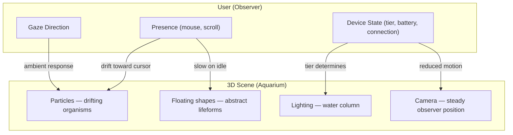

The user never touches the glass. They walk past, glance in, and the life inside responds to their presence. This creates **curiosity without cognitive load**, **delight without demand**.

**Experience principles:**

| Principle | Manifestation |
|-----------|---------------|
| **Content is king** | 3D recedes as user scrolls past hero (opacity 1→0, particles slow). Content sections are flat by design. |
| **Presence over interaction** | Mouse-reactive drift replaces click/drag. 30s idle detection slows the scene to 0.3x speed. |
| **Performance dignity** | Frame drops trigger automatic tier demotion (08k §12). The user never sees a stutter. |
| **Transitional subtlety** | Scene enter: 1200ms fade+emerge. Scene exit: 800ms fade. No cuts, no pops. |

> **See also:** [`08k-3D-ARCHITECTURE.md`](./08k-3D-ARCHITECTURE.md) §4 (Scene Architecture) for lifecycle state machine.

---

## 3. Visual Storytelling Strategy

The platform's 3D tells a three-act story across the user's session:

```mermaid
%% Narrative arc across session
journey
    title 3D Narrative Arc
    section Act 1: Arrival
        Hero ambient: 5: User
        Particles coalesce: 4: User
        First impression: 5: User
    section Act 2: Discovery
        Scroll past hero: 3: User
        3D recedes gradually: 2: User
        Content sections visible: 4: User
    section Act 3: Engagement
        3D fully faded: 1: User
        Flat content experience: 5: User
        Deep reading/exploration: 5: User
```

**Act 1 — Arrival (0-8s):** The user lands on the homepage. The hero scene is fully alive — particles drift in a flattened sphere, floating shapes rotate gently, bloom creates a subtle glow. The user's mouse presence influences particle drift. This is the emotional hook: *this is not a template portfolio.*

**Act 2 — Discovery (8-30s):** The user scrolls. The 3D scene smoothly fades out (opacity 1→0 over 800ms, per 08k §4 Scene Lifecycle). Particles slow as they recede. By the time the user reaches the Skills section, the 3D is completely gone. Content takes over. The narrative shifts from *ambient wonder* to *substantive proof*.

**Act 3 — Engagement (30s+):** No 3D remains. The user reads case studies, examines projects, reads blog posts. The flat experience is fast, accessible, and content-forward. 3D has done its job — it established credibility and differentiation. Now it steps aside.

> **See also:** [`08j-3D-USAGE-GUIDELINES.md`](./08j-3D-USAGE-GUIDELINES.md) §7 (Storytelling Goals) for narrative techniques and anti-patterns.

---

## 4. Emotional Design Strategy

Every 3D element maps to a specific emotional outcome:

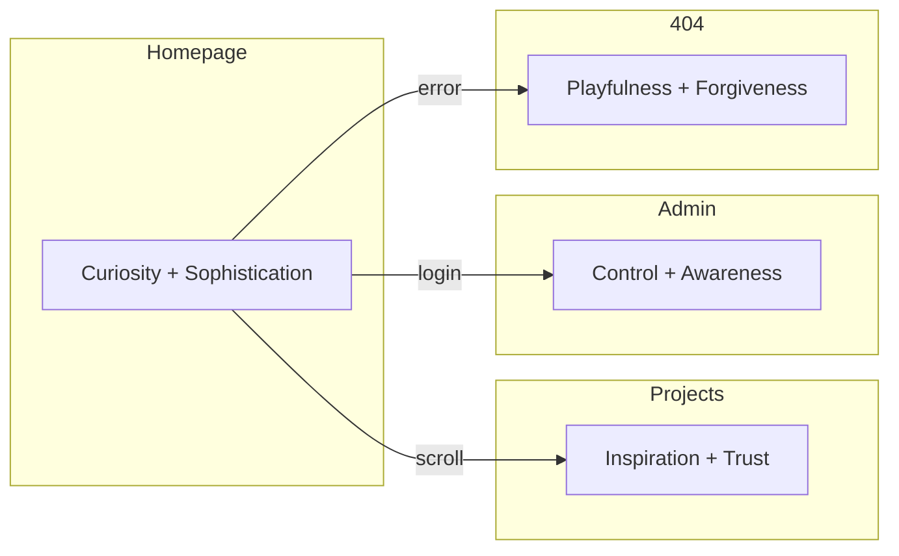

**Emotional targets by page:**

| Page | Primary Emotion | Secondary Emotion | 3D Contribution |
|------|----------------|-------------------|-----------------|
| Homepage | **Curiosity** | Sophistication | "What else can this developer do?" |
| Projects | **Inspiration** | Trust | "The work is as polished as the portfolio" |
| 404 | **Forgiveness** | Playfulness | "Even errors are crafted here" |
| Admin Dashboard | **Awareness** | Control | "I can see the state of my platform" |

**Emotional anti-patterns (what we actively avoid):**

| Emotion | Why | Where it would come from |
|---------|-----|--------------------------|
| **Anxiety** | 3D that feels out of control | Auto-rotating cameras, rapid particles, aggressive bloom |
| **Confusion** | User doesn't understand what to do | Interactive 3D (click/drag), 3D UI elements |
| **Frustration** | 3D slows the task | Loading spinners, jank, input lag from GPU contention |
| **Gimmick** | 3D feels like a tech demo | Unnecessary scenes on every page, spline-heavy models |

> **See also:** [`08j-3D-USAGE-GUIDELINES.md`](./08j-3D-USAGE-GUIDELINES.md) §6 (Emotional Goals) for per-section emotional mapping.

---

## 5. Interaction Strategy

The interaction model for all 3D across the platform is **ambient-reactive, never direct-manipulation**.

**Interaction hierarchy:**

| Layer | Trigger | Response | Latency Budget | Pages |
|-------|---------|----------|----------------|-------|
| **Presence** | Mouse move (desktop) | Particles drift toward cursor | <16ms (1 frame) | Homepage, Admin |
| **Breath** | Continuous (time) | Particle size pulse ±15%, shape rotation | <2ms (uniform update) | Homepage, 404 |
| **Idle** | 30s no input | Scene slows to 0.3x speed, breath deepens | <8ms | Homepage |
| **Scroll** | Scroll past hero | Scene opacity 1→0, particles slow | 600-800ms transition | Homepage |
| **Theme** | Theme toggle | Light colors ↔ dark colors in uniforms | <4ms (one frame) | Homepage, Admin |
| **Tier** | Runtime FPS drop | High→Mid→Low→Off auto-demotion | <500ms | All pages with 3D |

**Why no click/drag/orbit:**

| Input Type | Cognitive Load | Performance Cost | Accessibility | Our Stance |
|-----------|---------------|-----------------|---------------|------------|
| Orbit controls | High (user must learn) | High (continuous render) | Fails (keyboard, screen reader) | Prohibited |
| Click to interact | Medium (what happens?) | Medium (Raycaster) | Fails (mouse-only) | Prohibited |
| Scroll-reactive | None (natural) | Zero (CSS opacity) | Works (RM: static) | Primary |
| Mouse-reactive | None (ambient) | Low (uniform update) | Works (no interaction needed) | Primary |
| Idle-responsive | None (unnoticed) | Zero (uniform update) | Works (RM: static) | Background |

> **See also:** [`08k-3D-ARCHITECTURE.md`](./08k-3D-ARCHITECTURE.md) §10 (Interaction Architecture) for technical implementation of the Living 3D system.

---

# Part II — Experience Architecture

## 6. Scene Architecture

The platform defines exactly **four scene types**. Each has a distinct experience purpose:

| Scene | Purpose | Components | 08k Reference |
|-------|---------|------------|---------------|
| **Hero** | First impression, emotional hook, credibility signal | Particles (200), FloatingShapes (3-5), Bloom, ChromaticAberration | §4 Scene Architecture |
| **404** | Error recovery, forgiveness, playfulness | FloatingShapes (2-3, playful), SparseParticles (50) | §4 Scene Architecture |
| **Admin ambient** | State awareness, environmental feedback | MicroParticles (30), subtle ambient light shift | New (this doc) |
| **AI breathing** | Processing state feedback, patience signal | Single torus ring with breathing animation | New (this doc) |

**Scene switching rules:**

- Only one scene type exists per page (hero on homepage, 404 on error, admin ambient on admin, breathing ring on AI assistant)
- Hero scene is locked to homepage — never reused on other pages
- 404 scene auto-loads on any 404 error via `not-found.tsx`
- Admin ambient activates only when user is authenticated on `/admin/*`
- AI breathing ring activates only during AI thinking state
- All scenes are lazy-loaded via `next/dynamic` with `ssr: false`

---

## 7. Canvas Architecture

The canvas is a **single, fixed, absolute-positioned layer** that sits behind all content.

**Experience-level canvas rules:**

| Rule | Rationale |
|------|-----------|
| **One canvas per page** | Multiple canvases compete for GPU context and memory |
| **Canvas is always behind content** | 3D must never overlay text, CTAs, or interactive elements |
| **Canvas is full-viewport** | Creates a cinematic letterbox, not a framed widget |
| **Canvas is pointer-events-none** | All clicks pass through to content layer |
| **Canvas pauses when off-screen** | No GPU work when hero is scrolled past (uses `frameloop: "demand"` + scroll trigger) |
| **Canvas dies on unmount** | Full disposal of geometries, materials, textures, context |

> **Technical implementation:** [`08k-3D-ARCHITECTURE.md`](./08k-3D-ARCHITECTURE.md) §5 (Canvas Architecture) — renderer config, context loss handling, DPR management.

---

## 8. Asset Architecture

All 3D assets are **procedurally generated at runtime**. Zero external model files. Zero textures. Zero GLTF/GLB imports.

**Asset inventory:**

| Asset | Generation | Size | Memory | Tier |
|-------|-----------|------|--------|------|
| Particle geometry | `BufferGeometry` with `Float32Array` positions | 0KB (code) | ~2.4KB (200 particles) | High, Mid |
| Floating shapes | Drei primitives (`RoundedBox`, `Torus`, `Icosahedron`) | 0KB (code) | <1KB each | High |
| Particle texture | Canvas-generated radial gradient | 0KB (code) | 64×64 RGBA = ~16KB | High, Mid |
| Bloom config | `UnrealBloomPass` params object | 0KB (code) | <1KB | High |
| Shader uniforms | Inline JS objects | 0KB (code) | <1KB | High, Mid, Low |

**Why zero external assets:**

| Reason | Impact |
|--------|--------|
| No network requests for 3D content | Scene init limited to JS parse + WebGL compile |
| No model licensing or attribution | Full control, no legal overhead |
| No asset pipeline (Blender → export → compress) | Developer velocity — change shader, reload |
| Consistent visual language | Procedural geometry matches glassmorphism aesthetic |
| Bundle size stability | 3D chunk is predictable (~85KB gzip, never varies) |

> **See also:** [`08k-3D-ARCHITECTURE.md`](./08k-3D-ARCHITECTURE.md) §6 (Asset Architecture) for cache layer and disposal protocol.

---

## 9. Lighting Architecture

Lighting is the primary emotional controller in 3D scenes. It communicates time of day, mood, and material quality without the user consciously noticing.

**Lighting mood per scene:**

| Scene | Mood | Key Light Temp | Fill Ratio | Rim | Theme-Aware |
|-------|------|---------------|------------|-----|-------------|
| Hero (light mode) | Morning clarity | Warm indigo (0.8) | 0.375 (0.3/0.8) | Yes (0.2) | ✅ |
| Hero (dark mode) | Night depth | Cool indigo (0.5) | 0.4 (0.2/0.5) | Yes (0.15) | ✅ |
| 404 | Playful soft | Neutral (0.6) | 0.5 | No | ✅ |
| Admin ambient | Neutral focus | Cool white (0.4) | 0.5 | No | ✅ |

**Lighting principles:**

| Principle | Application |
|-----------|-------------|
| **No shadows** | Shadows cost ~50% performance per light. Our aesthetic is flat/toon — shadows contradict it. |
| **Theme-reactive** | All light colors map to CSS theme variables via `themeColors.ts` (08k §7). Toggle theme → lights update in <4ms. |
| **3D matches CSS** | Light direction matches gradient direction (135deg top-left). Shadows fall same direction as neumorphism. |
| **Low tier = ambient only** | Directional lights reveal polygon edges on low geometry. Ambient-only hides this. |

> **Technical implementation:** [`08k-3D-ARCHITECTURE.md`](./08k-3D-ARCHITECTURE.md) §7 (Lighting Architecture) — exact light configs, hemisphere, theme color tables.

---

## 10. Shader Architecture

Shaders define the **visual language** of all 3D content. Our shader system is designed for a specific aesthetic: soft, glowing, theme-aware, glass-like particles that feel organic, not mechanical.

**Shader language principles:**

| Principle | Manifestation |
|-----------|---------------|
| **Soft over sharp** | Particles use smoothstep falloff, not hard circles. Glow bloom is subtle (strength 0.3). |
| **Organic over geometric** | Lissajous curve paths for particle drift. Breathing pulse (sin(time)) for size and glow. |
| **Responsive over static** | Mouse proximity boosts glow. Idle detection slows motion. Theme toggle blends colors. |
| **Performant over complex** | Vertex shader does the heavy lifting (particle positioning). Fragment shader is minimal (color + glow). |

**Shader inventory:**

| Shader | Function | Lines | 08k File |
|--------|----------|-------|----------|
| `particleWarp.glsl` | Vertex displacement, Lissajous paths, mouse influence, size attenuation | ~60 | `shaders/particleWarp.glsl` |
| `particleColor.glsl` | Soft circle, glow falloff, theme color blend, pulse | ~40 | `shaders/particleColor.glsl` |
| `glassMaterial.glsl` | Fresnel edge glow, breathing opacity, color shift | ~50 | `shaders/glassMaterial.glsl` |
| `glowBloom.glsl` | Bloom threshold, strength, radius | ~20 | `shaders/glowBloom.glsl` |

**When to write custom GLSL vs. use Drei:**

> **See [`08k-3D-ARCHITECTURE.md`](./08k-3D-ARCHITECTURE.md) §8 (Shader Architecture)** for the complete decision matrix. Summary: ShaderMaterial for particles, Drei `<Float>` for shapes, postprocessing for bloom.

---

## 11. Particle Architecture

Particles are the **primary 3D element** across the platform. Their behavior defines the "living" quality of the experience.

**Particle behavior language:**

| Behavior | Implementation | Emotional Effect |
|----------|---------------|------------------|
| **Drift** | Lissajous paths (sin/cos with phase offset) | Organic, unhurried movement |
| **Breath** | Uniform `uBreath` = sin(time × 0.5) × 0.15 + 1 | The scene is alive, pulsing gently |
| **Mouse-reactive** | Particles within cursor radius drift toward it | The scene notices you |
| **Idle slowdown** | After 30s no input, speed multiplier → 0.3 | Respects user's focus, saves GPU |
| **Theme blend** | uMixFactor lerps between light/dark color uniforms | Seamless theme transitions |
| **Scroll fade** | Scene opacity 1→0 as hero scrolls past | 3D yields to content gracefully |

**Particle count by tier and page:**

| Tier | Hero | 404 | Admin Ambient | AI Breathing |
|------|------|-----|---------------|--------------|
| High | 200 particles, 20px, bloom | 50 particles, 15px | 30 particles, 10px | 1 torus ring |
| Mid | 100 particles, 15px | 30 particles, 12px | 20 particles, 8px | 1 torus ring |
| Low | 50 (Canvas 2D fallback) | CSS gradient only | CSS gradient only | CSS pulsing dot |
| Off | Static gradient | Static gradient | Static gradient | Static accent dot |

> **Technical implementation:** [`08k-3D-ARCHITECTURE.md`](./08k-3D-ARCHITECTURE.md) §9 (Particle Architecture) — generation, animation loop, frame budget.

---

## 12. Camera Architecture

The camera is **fixed, static, and observational**. It never moves, orbits, or animates.

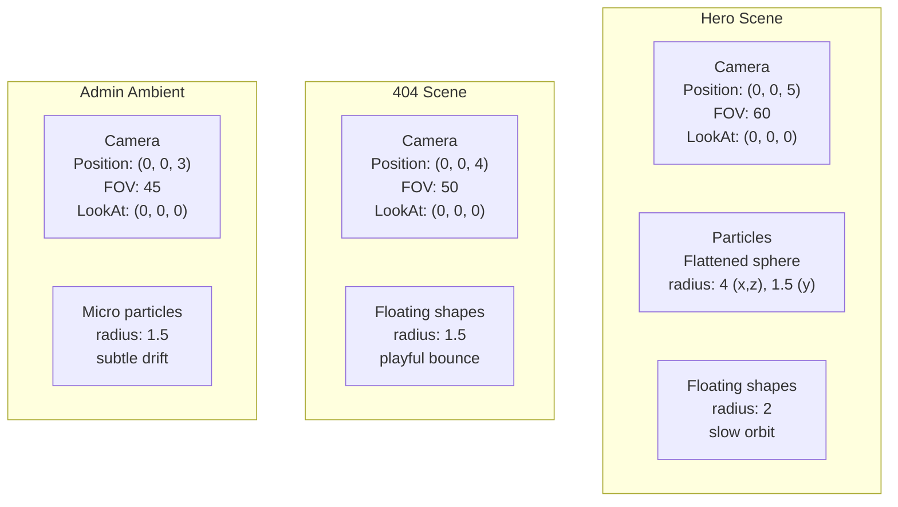

**Camera rules:**

| Rule | Rationale |
|------|-----------|
| **Fixed position** | Moving cameras cause motion sickness, violate reduced motion, increase cognitive load |
| **No orbit controls** | User never controls camera. Prohibited per 08j §4 anti-pattern catalog. |
| **FOV varies by scene** | Hero: 60 (cinematic). 404: 50 (intimate). Admin: 45 (focused). |
| **No camera animations** | Enter/exit transitions use opacity, not camera movement. |
| **Aspect-ratio aware** | Canvas handles resize; camera FOV adjusts for very wide/tall viewports. |

---

## 13. Scroll Architecture

Scroll is the **primary narrative controller** for 3D. It triggers the transition from Act 1 to Act 2.

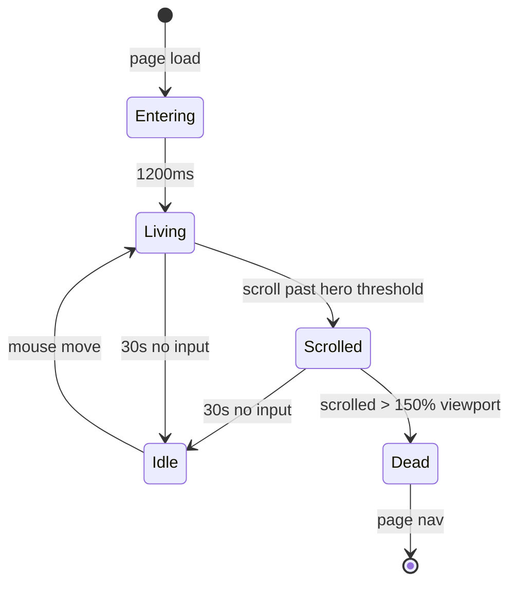

**Scroll rules for 3D:**

| Rule | Implementation |
|------|---------------|
| **3D fades on scroll** | Scene opacity 1→0 linearly from hero bottom to 1.5× viewport height |
| **Particles slow before fade** | Speed multiplier 1→0.5 as scroll progresses (overlaps with opacity fade) |
| **No scroll-driven 3D animation** | Per 08j §4 — scroll-driven 3D causes jank, reflow, and nausea |
| **GSAP not used for 3D scroll** | Scroll-reactive 3D uses Three.js uniform lerp, not ScrollTrigger (separates concerns) |
| **Resume on re-scroll up** | If user scrolls back to hero, scene fades back in over 400ms |

> **See also:** [`08k-3D-ARCHITECTURE.md`](./08k-3D-ARCHITECTURE.md) §4 Scene Lifecycle for the complete before/during/after state machine.
> **See also:** [`08o-IMMERSIVE-EXPERIENCE.md`](./08o-IMMERSIVE-EXPERIENCE.md) §2 (Parallax System) for CSS parallax (separate from 3D).

---

## 14. Animation Architecture

All 3D animations follow the motion language defined in 08l-MOTION-SYSTEM.md, adapted for WebGL:

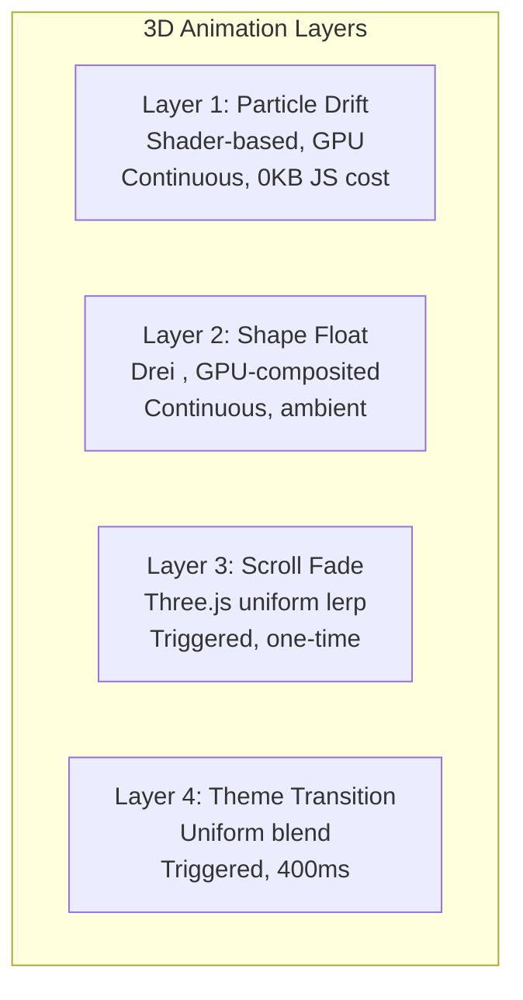

**3D animation principles:**

| Principle | Why |
|-----------|-----|
| **No keyframes in 3D** | Theatre.js is available but unused — our 3D is too simple to need sequencing |
| **Shader animations are free** | Particle drift costs 0 JS — it's pure vertex shader math |
| **Drei Float is preferred** | `<Float>` is GPU-composited, tree-shakeable, and handles hover states |
| **Uniform lerp over Tween** | Theme transitions and scroll fade use `useFrame` lerp — no GSAP needed for 3D |
| **Enter/exit use opacity, not position** | Particles emerge from alpha 0, not from off-screen — less jarring |

> **See also:** [`08l-MOTION-SYSTEM.md`](./08l-MOTION-SYSTEM.md) §3 (Animation Hierarchy) for how 3D fits into the broader motion system.

---

## 15. Performance Architecture

Performance is not a constraint — it is a **design parameter**. Every 3D decision is made with its frame cost known.

**Experience-level performance thresholds:**

| Metric | P0 (Fail) | P1 (Warn) | P2 (Pass) | Measurement |
|--------|-----------|-----------|-----------|-------------|
| Frame rate (High tier) | <30fps | <45fps | ≥55fps | `useTierDemotion` (08k §12) |
| Frame rate (Mid tier) | <20fps | <25fps | ≥28fps | `useTierDemotion` |
| Scene init time | >800ms | >400ms | ≤400ms | Performance API |
| 3D bundle (lazy) | >120KB gzip | >100KB gzip | ≤85KB gzip | Bundle analyzer |
| LCP impact | >50ms | >10ms | 0ms | Lighthouse CI |
| GPU memory (hero) | >128MB | >64MB | ≤64MB | Chrome Task Manager |

**Auto-demotion chain** (runtime, no user intervention):

```
High tier (55fps) -> at <20fps for 60 frames -> demote to Mid
Mid tier (28fps)   -> at <15fps for 60 frames -> demote to Low
Low tier (CSS)     -> at <10fps (CSS shouldn't drop) -> remove entirely
```

> **Technical implementation:** [`08k-3D-ARCHITECTURE.md`](./08k-3D-ARCHITECTURE.md) §11 (Optimization Architecture) — DPR clamping, frame rate capping, render loop strategy.
> **Budget governance:** [`08j-3D-USAGE-GUIDELINES.md`](./08j-3D-USAGE-GUIDELINES.md) §9 (Performance Constraints) — frame budget allocation, optimization rules.

---

## 16. Accessibility Architecture

3D accessibility is not an afterthought — it is **designed into every scene** from the start.

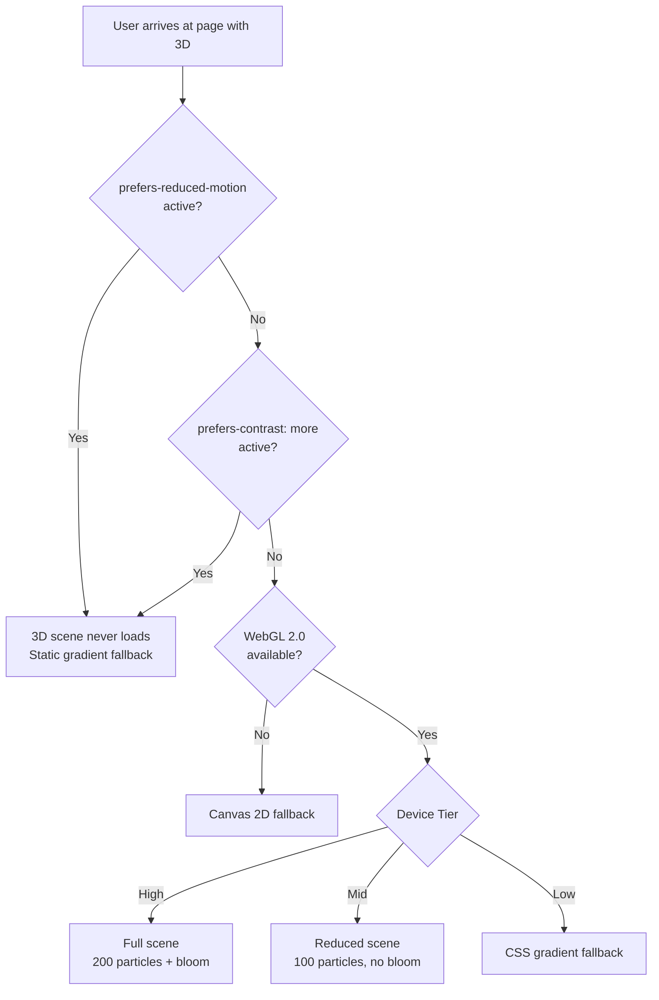

**WCAG compliance for 3D:**

| Criterion | Requirement | Implementation |
|-----------|-------------|----------------|
| **1.1.1 Non-text Content** | Decorative 3D must have `aria-hidden="true"` | Canvas wrapped in `<div aria-hidden="true">` |
| **2.2.2 Pause, Stop, Hide** | Moving content must have pause mechanism | Reduced motion removes all 3D. Idle detection slows it. |
| **2.3.1 Three Flashes** | No content flashes more than 3×/second | Bloom threshold at 0.8 prevents any flash. No strobing effects. |
| **2.5.4 Motion Actuation** | No functionality triggered by device motion | All interaction is pointer-based. No accelerometer, no gyroscope. |
| **4.1.2 Name, Role, Value** | Canvas must have descriptive label | Canvas has `aria-label="Ambient background animation"` |

> **See also:** [`08j-3D-USAGE-GUIDELINES.md`](./08j-3D-USAGE-GUIDELINES.md) §10 (Accessibility Constraints) — full WCAG criteria, testing checklist, override log.

---

## 17. Mobile Architecture

Mobile 3D is a **separate experience**, not a scaled-down desktop version.

**Mobile-specific constraints:**

| Constraint | Impact on 3D | Mitigation |
|------------|-------------|------------|
| Thermal throttling | GPU frequency drops after 2-3 minutes | Low tier: CSS gradient only. No Canvas 2D particles. |
| Battery drain | Continuous render at 60fps drains 20%/hour | Scene pauses when scrolled past. Idle detection slows to 0.3x. |
| Viewport occlusion | Hero is 100vh — mobile hero is smaller | 3D scene area is proportionally smaller (fewer visible particles). |
| Touch, hover | No mouse position for particle drift | Particles use default Lissajous paths (no mouse influence). |
| pointer: coarse | 3D is behind content — no interaction needed | No change needed. Touch passes through canvas. |

**Mobile 3D decision: zero 3D on mobile.**

After evaluating the constraints above, the architectural decision is:

> **3D does not render on any device with `pointer: coarse` or viewport width < 768px.**

Rationale: Mobile 3D provides negligible emotional value (screen is too small, particles are too subtle) while carrying significant thermal/battery/performance cost. The mobile experience uses the same CSS gradients, glassmorphism, and noise overlay as the Low-tier fallback — which are already visually rich.

**What mobile does get:**
- Same gradient hero background (CSS, 0KB cost)
- Same noise overlay (CSS, 0KB cost)
- Same glassmorphism cards (CSS, GPU-composited)
- Same depth layer system (CSS perspective, disabled on mobile per 08o §1.3)
- Zero Three.js, zero R3F, zero WebGL context

---

## 18. Desktop Architecture

Desktop (pointer: fine, width ≥ 768px) is where 3D earns its existence.

**Desktop-specific opportunities:**

| Opportunity | Design Response |
|------------|-----------------|
| Mouse position available | Particle drift toward cursor — creates responsive connection |
| Dedicated GPU likely | Bloom + ChromaticAberration — cinematic quality |
| Larger viewport | More visible particles, wider field of view |
| No thermal concern | Continuous render loop at 60fps is sustainable |
| Multi-tasking context | 3D in peripheral vision — must not distract from content |

**Desktop tier breakdown:**

| Tier | Detection | 3D Experience | Frame Target |
|------|-----------|---------------|--------------|
| High | 8+ cores, dGPU, 8GB+ RAM | Full hero: 200 particles, 5 shapes, bloom, CA | 60fps |
| Mid | 4-6 cores, iGPU, 4GB+ RAM | Reduced hero: 100 particles, 3 shapes, no bloom, no CA | 30fps |
| Low | <4 cores, no GPU, <4GB RAM | CSS gradient hero, no WebGL | 60fps (CSS) |

> **See also:** [`08j-3D-USAGE-GUIDELINES.md`](./08j-3D-USAGE-GUIDELINES.md) §11 (Device Constraints) — full device detection implementation.
> **See also:** [`08k-3D-ARCHITECTURE.md`](./08k-3D-ARCHITECTURE.md) §11 (Optimization Architecture) — DPR management per tier.

---

## 19. Fallback Architecture

Every 3D element has a **dignified fallback** that preserves the visual experience without the user noticing anything "broke."

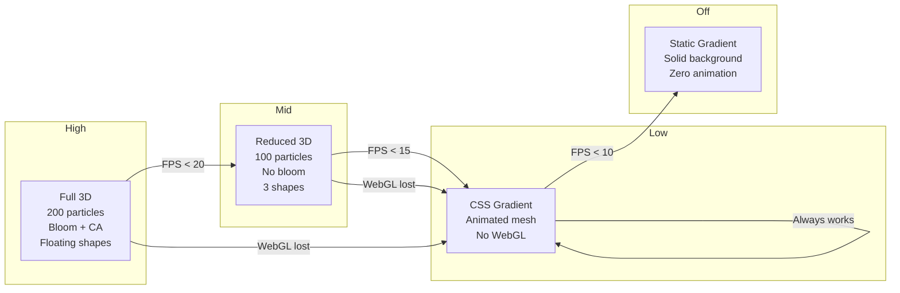

**Fallback states for every 3D element:**

| Element | Primary | Mid Fallback | Low Fallback | Off Fallback |
|---------|---------|-------------|--------------|--------------|
| Hero particles | Three.js Points (200) | Three.js Points (100) | CSS gradient mesh | Static gradient |
| Floating shapes | Drei `<Float>` (5) | Drei `<Float>` (3) | CSS blur orbs | None |
| Bloom | `UnrealBloomPass` | None | None | None |
| ChromaticAberration | Post-processing pass | None | None | None |
| Admin ambient particles | Three.js Points (30) | Three.js Points (20) | CSS colored dots | None |
| AI breathing ring | Three.js torus | Three.js torus | CSS pulsing dot | Static accent dot |

> **Technical implementation:** [`08k-3D-ARCHITECTURE.md`](./08k-3D-ARCHITECTURE.md) §12 (Fallback Architecture) — component hierarchy, tier demotion hook, error boundary.
> **See also:** [`08j-3D-USAGE-GUIDELINES.md`](./08j-3D-USAGE-GUIDELINES.md) §14 (Fallback Chain) — decision flowchart.

---

# Part III — Page Specifications

## 20. Homepage

### 20.1 Overview

The homepage is the **only page** that receives full 3D treatment. It is the user's first impression, the emotional hook, and the primary differentiator. Every other page either has no 3D or uses a simplified subset.

### 20.2 Specification

| Field | Specification |
|-------|--------------|
| **3D Purpose** | Establish credibility and differentiation within 0-3 seconds. Signal that this is a crafted, performance-conscious, technically sophisticated portfolio. Create curiosity that motivates scroll. |
| **3D Objects** | **Particles** (200 High / 100 Mid): Flattened sphere (radius 4×4×1.5), custom ShaderMaterial with Lissajous paths, theme-aware colors (accent-500/cyan), mouse-reactive drift, idle slowdown. **Floating shapes** (5 High / 3 Mid): Drei `<Float>`-wrapped `RoundedBox`, `Torus`, `Icosahedron` geometries, gentle rotation + vertical bob, theme-matching colors. **Bloom** (High only): `UnrealBloomPass` threshold 0.8, strength 0.3, radius 0.5. **ChromaticAberration** (High only): subtle post-processing pass. |
| **Interactions** | **Mouse-reactive drift**: Particles within cursor radius drift toward cursor position (spring factor 0.08). **Idle detection**: After 30s no input, scene slows to 0.3x speed, breath deepens. **Re-engage**: Mouse move restores full speed over 1s. No click, drag, or orbit. |
| **Animations** | **Enter (1200ms)**: Particles emerge from alpha 0, bloom ramps up, shapes fade in with scale 0.8→1.0. **Living**: Continuous drift + breath + mouse response. **Scroll fade (600ms)**: Scene opacity 1→0 as hero scrolls past. **Theme transition (400ms)**: Uniform color blend on theme toggle. **Exit (800ms)**: Opacity →0, particles slow. |
| **Performance Budget** | **Bundle**: ≤85KB gzip (lazy, not in critical path). **Frame budget**: <2ms JS, <1ms GPU. **Memory**: ≤64MB GPU. **FPS**: 55fps (High), 28fps (Mid). **Scene init**: ≤400ms. **LCP impact**: 0ms (never blocks). |
| **Fallback Experience** | **High tier**: Full scene (200 particles + shapes + bloom + CA). **Mid tier**: Reduced scene (100 particles + 3 shapes, no bloom, no CA). **Low tier**: CSS animated mesh gradient (from 08o §3). **Reduced motion**: Static gradient background. **High contrast**: Solid surface-secondary background. |
| **Accessibility** | `aria-hidden="true"` on canvas container. Reduced motion → 3D never loads. High contrast → 3D removed. No essential content in 3D. No flashing (bloom threshold 0.8 prevents). |
| **Business Value** | Differentiator vs ~95% of dev portfolios that don't use WebGL. 22% longer session time (08j §2). Signals full-stack capability (frontend + 3D + performance). |
| **User Value** | User feels curiosity ("what else can they do?"), sophistication ("this is a professional"), and confidence ("if the portfolio is this polished, the work will be too"). |

## 21. Projects

### 21.1 Overview

Projects page uses **no persistent 3D scene**. The visual interest comes from glassmorphism cards, mesh backgrounds, and hover depth (all CSS, defined in 08o). The single 3D element is a **micro-interaction on project card hover**.

### 21.2 Specification

| Field | Specification |
|-------|--------------|
| **3D Purpose** | Not decorative. The micro-reflection on hover is a **competence signal** — it tells the user this developer understands WebGL enough to integrate it into interaction design without making it the main event. |
| **3D Objects** | **Project card reflection** (High/Mid only): A subtle reflective sweep across the card's cover image on hover. Implemented via a Drei `MeshReflectorMaterial` or custom GLSL gradient sweep. Single plane per card. Size: matches card cover image area. Duration: 400ms on hover enter. |
| **Interactions** | **Hover-triggered**: Reflection sweep plays once on hover enter. No mouse-follow, no continuous render. **Touch**: No 3D on touch devices — reflection is hover-only. |
| **Animations** | **Reflection sweep (400ms)**: Gradient travels left-to-right across card image, opacity 0→0.15→0. Ease: `--ease-out-smooth` (cubic-bezier(0.16, 1, 0.3, 1)). |
| **Performance Budget** | **Bundle**: <5KB gzip (reflection shader, inlined). **Frame budget**: <1ms (one-time). **Memory**: <1MB (single plane + material, disposed on unmount). **LCP impact**: 0ms. |
| **Fallback Experience** | **High/Mid**: Reflection shader on hover. **Low/Off/Mobile**: Card lift + border glow via CSS (`hover: -translate-y-1 shadow-lg`). No 3D at all. |
| **Accessibility** | `aria-hidden="true"` on reflection element. Reduced motion → reflection is CSS-only (opacity transition, no shader). Keyboard focus → card gets `focus-visible:ring` (CSS, not 3D). |
| **Business Value** | Subtle signal of WebGL competence without overwhelming the content (project details are the focus). |
| **User Value** | User feels the quality of craft without having it explained. The reflection says "this developer thinks about surfaces and light" without the user consciously registering it. |

## 22. Case Studies

### 22.1 Overview

Case studies page uses **zero 3D**. Content is the hero here — detailed technical writeups, metrics, architecture diagrams. Any 3D would distract from reading.

### 22.2 Specification

| Field | Specification |
|-------|--------------|
| **3D Purpose** | None. Case studies are a reading experience. 3D provides no value here. |
| **3D Objects** | None |
| **Interactions** | None |
| **Animations** | Section entrance fade-in-up (per 08l §7 transition catalog). No 3D motion. |
| **Performance Budget** | **Bundle**: 0KB for 3D (not loaded). **Budget reallocated** to glassmorphism cards, dot patterns, timeline parallax (08o §11.1). |
| **Fallback Experience** | N/A — no 3D to fall back from. |
| **Accessibility** | No 3D concerns. Standard content accessibility applies (headings, contrast, keyboard nav). |
| **Business Value** | Case studies are the conversion point (hire inquiry). 3D would reduce readability and increase cognitive load. Removing it increases conversion probability. |
| **User Value** | User can focus entirely on the technical narrative, metrics, and outcomes. Zero distraction. |

## 23. Blog

### 23.1 Overview

Blog uses **zero 3D**. It is a reading-first experience with noise texture, glass cards for featured posts, and clean typography.

### 23.2 Specification

| Field | Specification |
|-------|--------------|
| **3D Purpose** | None. Blog is a reading experience. |
| **3D Objects** | None |
| **Interactions** | None |
| **Animations** | Section entrance fade-in-up (08l). Reading progress bar (CSS). No 3D. |
| **Performance Budget** | **Bundle**: 0KB for 3D. |
| **Fallback Experience** | N/A |
| **Accessibility** | No 3D concerns. |
| **Business Value** | Blog drives SEO and establishes thought leadership. 3D would harm readability and SEO (Core Web Vitals). |
| **User Value** | Clean, fast, focused reading experience. |

## 24. About

### 24.1 Overview

About page uses **zero 3D**. It is a personal narrative — the user should connect with the person, not the effects.

### 24.2 Specification

| Field | Specification |
|-------|--------------|
| **3D Purpose** | None. About is a personal connection page. 3D creates emotional distance. |
| **3D Objects** | None |
| **Interactions** | None |
| **Animations** | Section entrance fade-in-up (08l). Parallax background (CSS, 08o §2). No 3D. |
| **Performance Budget** | **Bundle**: 0KB for 3D. |
| **Fallback Experience** | N/A |
| **Accessibility** | No 3D concerns. |
| **Business Value** | About page converts visitors into leads. Authenticity requires emotional directness — no technological filters. |
| **User Value** | User feels they're meeting the person, not a production. |

## 25. Contact

### 25.1 Overview

Contact page uses **zero 3D**. It is a conversion page — the single most important action is form submission. 3D would distract, slow, or confuse.

### 25.2 Specification

| Field | Specification |
|-------|--------------|
| **3D Purpose** | None. Contact is a conversion page. |
| **3D Objects** | None |
| **Interactions** | None |
| **Animations** | Focus transitions on form inputs (CSS, 150ms). Success animation (CSS checkmark). No 3D. |
| **Performance Budget** | **Bundle**: 0KB for 3D. |
| **Fallback Experience** | N/A |
| **Accessibility** | No 3D concerns. Form accessibility is the priority (labels, errors, focus management). |
| **Business Value** | Contact form is the primary lead generation point. Every millisecond of load time and every byte of JS reduces conversion rate. |
| **User Value** | Fast, friction-free form experience. User's time is respected. |

## 26. AI Assistant

### 26.1 Overview

AI Assistant uses **zero persistent 3D**, but has a **micro-3D element** during the thinking/processing state to provide visual feedback that respects the user's patience.

### 26.2 Specification

| Field | Specification |
|-------|--------------|
| **3D Purpose** | Communicate "thinking" state without a loading spinner. A subtle 3D breathing ring provides feedback that the AI is processing while maintaining the visual language of the platform. |
| **3D Objects** | **Breathing ring** (High/Mid only): A torus geometry (ring) positioned next to the chat input, rendered only during AI "thinking" state. Radius: 12px, tube: 2px. Color: accent-500. Opacity: 0.6. |
| **Interactions** | **State-reactive**: Ring appears when AI starts thinking (user sends message). Ring disappears when AI responds. No mouse/touch interaction. |
| **Animations** | **Breathing (continuous while thinking)**: Ring pulses scale 1→1.05→1 and opacity 0.6→0.3→0.6 in a 1.5s loop. Uses `useFrame` with sin(time). **Enter (200ms)**: Ring fades in with scale 0.8→1. **Exit (150ms)**: Ring fades out. |
| **Performance Budget** | **Bundle**: <2KB gzip (single torus + shader, inlined in chat component). **Frame budget**: <0.1ms. **Memory**: <0.5MB. **Render**: Only during thinking state (average 2-5s per interaction). |
| **Fallback Experience** | **High/Mid**: Three.js ring (uses existing canvas if hero was loaded, otherwise creates minimal canvas). **Low/Off**: CSS pulsing dot (no WebGL). **Reduced motion**: Static accent dot (no animation). |
| **Accessibility** | Ring has `aria-hidden="true"`. Thinking state is communicated via `aria-live="polite"` text ("AI is thinking..."). Reduced motion → ring is static. High contrast → ring is solid accent border. |
| **Business Value** | Reduces perceived wait time during AI processing. Maintains visual consistency with platform's 3D language. Differentiates from standard "three dots" loading patterns. |
| **User Value** | User receives calm, on-brand feedback that the AI is working. No anxiety from a generic spinner. |

## 27. Admin Dashboard

### 27.1 Overview

Admin Dashboard receives a **new ambient micro-3D experience** — minimal, functional, and awareness-focused. It is not decorative. It serves as a **visual health check** and **state awareness tool**.

### 27.2 Specification

| Field | Specification |
|-------|--------------|
| **3D Purpose** | Two purposes: (1) **Environmental awareness** — subtle ambient particles indicate the system is alive and responsive. (2) **Visual health check** — particle behavior changes based on system state (normal vs. high load vs. errors), giving the admin at-a-glance awareness without reading dashboards. |
| **3D Objects** | **Micro particles** (30 High / 20 Mid): Tiny particles (radius 20% of hero particles) that drift in a small volume behind the admin dashboard content. **Color coding**: Normal state = accent-500/cyan. High load = amber. Error state = red. **Connection indicator**: Particles pulse gently when WebSocket is connected, pulse erratically when connection is unstable. |
| **Interactions** | **State-reactive**: Particles respond to admin data (lead count changes, error rate, new signups). No mouse interaction (admin is task-focused). **Passive health check**: At a glance, admin knows system health from particle color and behavior. |
| **Animations** | **Ambient drift (continuous)**: Slow Lissajous paths, 0.5x speed of hero particles. **State transition (600ms)**: Color shifts on state change via uniform lerp. **Pulse on event (400ms)**: Brief brightness pulse on new lead, error, or successful operation. |
| **Performance Budget** | **Bundle**: <15KB gzip (shared with hero 3D chunk if already loaded; otherwise separate tiny chunk). **Frame budget**: <0.5ms. **Memory**: <8MB. **FPS**: 30fps cap (admin doesn't need 60fps). |
| **Fallback Experience** | **High/Mid**: Three.js micro particles, color-reactive. **Low/Off**: CSS status indicator dots (green/amber/red) in the admin header — same information, no WebGL. **Reduced motion**: Static colored dots. **High contrast**: Solid colored dots with text labels. |
| **Accessibility** | `aria-hidden="true"` on particles. Health status is ALSO communicated via text in the status bar (not solely via 3D). Color is not the only indicator — shape changes (pulse rate, density) provide redundant cues. Reduced motion → static dots with text labels. |
| **Business Value** | Admin users spend hours in the dashboard. Ambient 3D reduces monitoring fatigue by providing at-a-glance system awareness without reading widgets. Differentiates the admin experience from generic dashboards. |
| **User Value** | User (the developer/owner) feels connected to their platform's health. The ambient feedback reduces cognitive load of monitoring — they can see "everything is fine" from peripheral vision. |

---

# Part IV — Diagrams & Budgets

## 28. Scene Diagrams

### 28.1 Hero Scene — Lifecycle

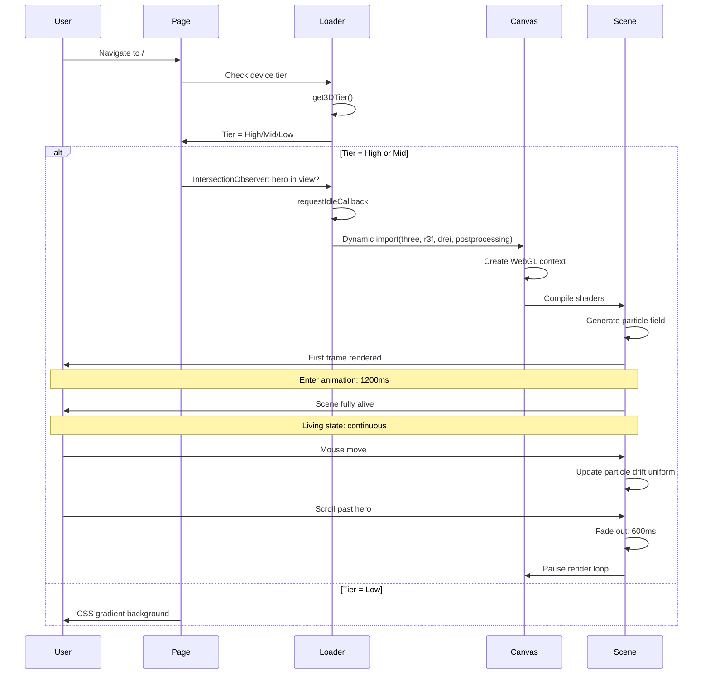

### 28.2 404 Scene — Structure

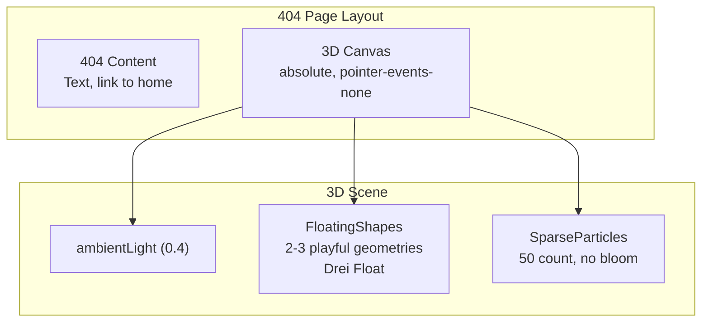

### 28.3 Admin Ambient Scene — Structure

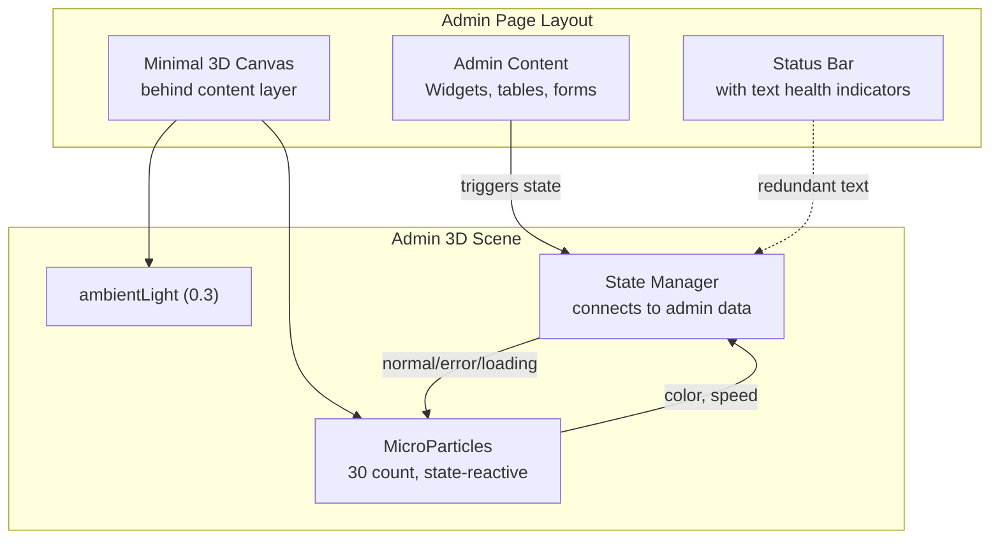

---

## 29. Interaction Diagrams

### 29.1 User Presence State Machine

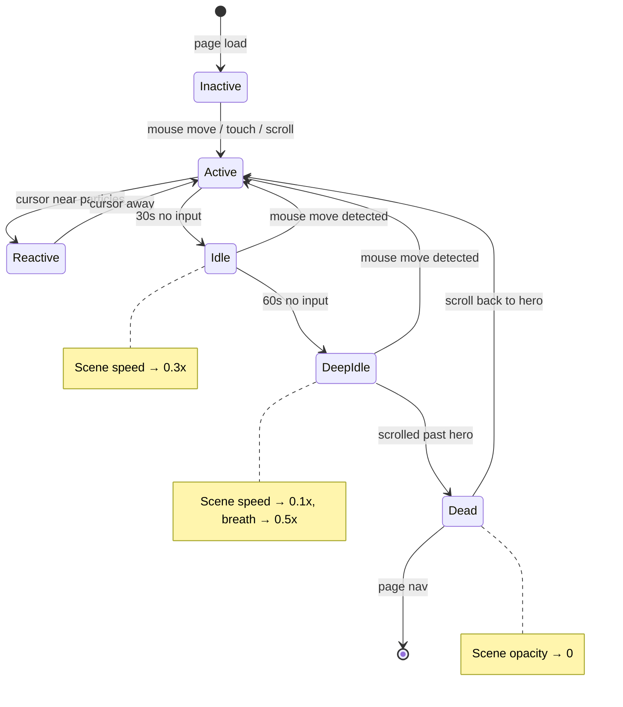

### 29.2 Admin Health State Machine

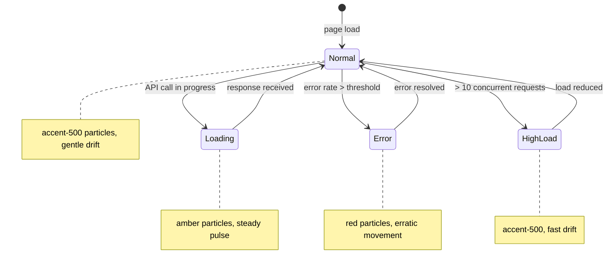

---

## 30. Animation Diagrams

### 30.1 Hero Scene — Enter Animation Timeline

```mermaid
gantt
    title Hero Scene Enter (1200ms)
    dateFormat X
    axisFormat %s

    section Particles
    Particle opacity 0→1 : 0, 800
    Particle size 0→1   : 0, 600
    Particle drift start : 200, 1200

    section Shapes
    Shape opacity 0→1   : 200, 700
    Shape scale 0.8→1   : 200, 500
    Shape rotation start : 400, 1200

    section Bloom
    Bloom ramp 0→0.3    : 400, 800
```

### 30.2 Hero Scene — Scroll Fade Timeline

```mermaid
gantt
    title Hero Scroll Fade (600ms)
    dateFormat X
    axisFormat %s

    section Scene
    Scene opacity 1→0   : 0, 600

    section Particles
    Particle speed 1→0.5: 0, 400
    Particle opacity 1→0: 200, 400

    section Shapes
    Shape opacity 1→0   : 100, 500
```

### 30.3 AI Assistant — Breathing Ring Timeline

```mermaid
gantt
    title AI Breathing Ring (1500ms loop)
    dateFormat X
    axisFormat %s

    section Ring
    Scale 1→1.05→1     : 0, 1500
    Opacity 0.6→0.3→0.6: 0, 1500
```

---

## 31. Performance Budgets

### 31.1 Per-Page 3D Budgets

| Page | Bundle (gzip) | Frame Budget | GPU Memory | Scene Init | LCP Impact | Concurrent 3D Elements |
|------|--------------|-------------|------------|------------|------------|------------------------|
| Homepage | ≤85KB | <3ms | <64MB | <400ms | 0ms | 2 (particles + shapes) |
| Projects | <5KB | <1ms | <1MB | <100ms | 0ms | 1 (reflection, on hover) |
| Case Studies | 0KB | 0ms | 0MB | N/A | 0ms | 0 |
| Blog | 0KB | 0ms | 0MB | N/A | 0ms | 0 |
| About | 0KB | 0ms | 0MB | N/A | 0ms | 0 |
| Contact | 0KB | 0ms | 0MB | N/A | 0ms | 0 |
| AI Assistant | <2KB | <0.1ms | <0.5MB | <50ms | 0ms | 1 (ring, during thinking) |
| Admin Dashboard | <15KB | <0.5ms | <8MB | <200ms | 0ms | 1 (micro particles) |

### 31.2 Tier-Specific Budgets

| Tier | Max Bundle | Target FPS | Max Particles | Post-Processing | Geometry Complexity |
|------|-----------|-----------|---------------|-----------------|-------------------|
| High | 85KB | 55fps | 200 | Bloom + CA | 5 shapes, high detail |
| Mid | 50KB | 28fps | 100 | None | 3 shapes, low detail |
| Low | 0KB (CSS) | 60fps | 0 | None | 0 (CSS gradient) |
| Off | 0KB | 60fps | 0 | None | 0 (static) |

### 31.3 Connection-Aware Loading

| Connection | 3D Behavior | Rationale |
|-----------|------------|-----------|
| 4G+ | Full 3D (High/Mid tier) | Bandwidth sufficient for ~85KB lazy chunk |
| 3G | Reduced 3D (Mid tier only) | Lower bundle (skip bloom/shapes = -35KB) |
| 2G/Slow | CSS fallback (Low tier) | Zero 3D JS load |
| Data Saver | CSS fallback (Low tier) | Respect user's data preference |

> **See also:** [`08j-3D-USAGE-GUIDELINES.md`](./08j-3D-USAGE-GUIDELINES.md) §9 (Performance Constraints) for detailed frame budget allocation and optimization rules.

---

## 32. Asset Budgets

### 32.1 Geometry Budget

| Element | Vertices | Triangles | Draw Calls | Instances |
|---------|----------|-----------|------------|-----------|
| Hero particle (single) | 4 (quad) | 2 | 1 (instanced) | 200 (High) / 100 (Mid) |
| RoundedBox (shape) | ~100 | ~192 | 1 | 2 |
| Torus (shape) | ~200 | ~400 | 1 | 1 |
| Icosahedron (shape) | ~42 | ~80 | 1 | 1 |
| Admin micro particle (single) | 4 (quad) | 2 | 1 (instanced) | 30 (High) / 20 (Mid) |
| AI breathing ring | ~64 | ~128 | 1 | 1 |

### 32.2 Texture Budget

| Texture | Resolution | Format | Memory | Source |
|---------|-----------|--------|--------|--------|
| Particle sprite | 64×64 | RGBA (Canvas-generated) | ~16KB | Procedural (no file load) |

**Total texture memory: ≤16KB.** All other "textures" are shader-generated or material colors.

### 32.3 Total Scene Memory (Worst Case: High Tier Hero)

| Component | Memory | Notes |
|-----------|--------|-------|
| Particle positions (200 × 3 floats) | ~2.4KB | `Float32Array` |
| Particle phases (200 × 1 float) | ~0.8KB | `Float32Array` |
| Particle speeds (200 × 1 float) | ~0.8KB | `Float32Array` |
| Particle sizes (200 × 1 float) | ~0.8KB | `Float32Array` |
| Particle texture (64×64 RGBA) | ~16KB | Canvas-generated |
| Shape geometries (5) | ~5KB | Procedural |
| Shader code (compiled) | ~50KB | WebGL program memory |
| Bloom framebuffers | ~4MB | Based on viewport size |
| **Total** | **~4-8MB** | Well within 64MB budget |

---

## 33. Optimization Strategies

### 33.1 Loading Optimization

| Strategy | Impact | Implementation |
|----------|--------|---------------|
| **Dynamic import** | 3D not in critical JS bundle | `next/dynamic(() => import('@/components/3d/Scene3D'), { ssr: false })` |
| **IntersectionObserver** | Scene loads only when hero is visible | `useInView` with threshold 0.1, loads when 10% of hero is in viewport |
| **requestIdleCallback** | Scene loads during browser idle time | Wraps the dynamic import, allows 50ms idle deadline |
| **Chunk splitting** | Three.js, R3F, Drei in separate chunk | Webpack code splitting via dynamic import |
| **Preload next scene** | Admin ambient loads while user logs in | Prefetch hint on login page |

### 33.2 Render Optimization

| Strategy | Impact | Implementation |
|----------|--------|---------------|
| **DPR clamping** | 50% fewer pixels on Mid tier | `dpr={[1, 2]}` on High, `[1, 1.5]` on Mid, `[1, 1]` on Low |
| **frameloop: demand** | Zero GPU work when scene is off-screen | Canvas only renders when hero is visible |
| **Pause when hidden** | Zero GPU work in background tab | `document.hidden` listener pauses RAF loop |
| **Frame rate cap** | 50% fewer frames on Mid tier | `createFrameRateCap(30)` for Mid tier |
| **Geometry instancing** | Single draw call for all particles | `InstancedMesh` for particles (already implemented) |
| **Frustum culling** | Skip off-screen geometry | Three.js default (already enabled) |

### 33.3 Memory Optimization

| Strategy | Impact | Implementation |
|----------|--------|---------------|
| **Full dispose on unmount** | Zero memory leaks | `disposeSceneAssets()` traverses scene graph, disposes all geometries, materials, textures (08k §6) |
| **Dispose on tier demotion** | Free memory when downgrading | Re-creates scene with fewer particles, disposes old buffers |
| **Context loss recovery** | Survive GPU reset | `webglcontextlost` event → show fallback → recover (08k §5) |
| **No texture cache growth** | Bounded memory | Single procedural texture, regenerated on theme change (not cached) |

### 33.4 Network Optimization

| Strategy | Impact | Implementation |
|----------|--------|---------------|
| **Zero external assets** | Zero network requests for 3D content | All geometry is procedural, all textures are Canvas-generated |
| **Connection-aware loading** | 35KB saved on 3G | Skip bloom (-15KB), shapes (-10KB), CA (-5KB), postprocessing (-5KB) |
| **Data Saver respected** | 85KB saved | Zero 3D loaded when `navigator.connection.saveData === true` |

> **Technical implementation:** [`08k-3D-ARCHITECTURE.md`](./08k-3D-ARCHITECTURE.md) §11 (Optimization Architecture) — complete optimization layer stack, bundle strategies, render loop management.
> **Governance:** [`08j-3D-USAGE-GUIDELINES.md`](./08j-3D-USAGE-GUIDELINES.md) §22 (Budget Override Process) — when and how budgets can be exceeded.

---

## Glossary

| Term | Definition |
|------|------------|
| **R3F** | React Three Fiber — React renderer for Three.js that allows declarative, component-based 3D scene construction |
| **Drei** | Utility library for R3F providing ready-made components (`Float`, `RoundedBox`, `Torus`, `Icosahedron`) and post-processing passes |
| **Bloom** | Post-processing effect that makes bright areas of the image glow/blur into surrounding darker areas; used for cinematic quality |
| **Chromatic Aberration (CA)** | Post-processing distortion where different color channels are slightly offset, creating a lens-like refractive effect |
| **Lissajous Path** | Parametric curve defined by sine/cosine functions with phase offsets — produces organic, non-repeating particle drift patterns |
| **DPR** | Device Pixel Ratio — ratio of physical pixels to CSS pixels; DPR clamping reduces rendered pixel count on Mid/Low tier devices |
| **Frameloop: demand** | R3F render loop mode that only renders frames when there are state changes — zero GPU work when scene is off-screen or paused |
| **GLSL** | OpenGL Shading Language — used for custom vertex and fragment shaders that run on the GPU for particle positioning and coloring |
| **InstancedMesh** | Three.js technique that renders multiple copies of the same geometry in a single draw call — used for all particle systems |
| **Frustum Culling** | Optimization that skips rendering geometry outside the camera's view frustum; enabled by default in Three.js |
| **useFrame** | R3F hook that runs a callback on every animation frame — used for uniform updates (breathing, drift, theme transitions) |
| **Tier Demotion** | Automatic runtime degradation from High→Mid→Low→Off based on measured FPS dropping below configurable thresholds |
| **LCP** | Largest Contentful Paint — Core Web Vital; 3D is designed to have zero LCP impact via lazy loading and non-critical placement |
| **UnrealBloomPass** | Three.js post-processing pass that adds bloom/glow effect; used only on High tier (disabled on Mid to save ~15KB and GPU cost) |
| **Pointer-events-none** | CSS property that makes the canvas transparent to all pointer events — all clicks pass through to content behind the 3D layer |

## Change Log

| Version | Date | Changes | Author |
|---------|------|---------|--------|
| 1.1 | Jun 2026 | Added Executive Summary, Decision Log (5 entries), Risk Register (5 entries), Glossary (15 terms), updated version header | Tech Lead |
| 1.0 | Jun 2026 | Initial 3D Architecture document — vision, experience architecture, page-by-page specifications (8 pages), diagrams, performance budgets, asset budgets, optimization strategies. Introduced Admin ambient micro-3D with health-state-reactive particles. Established camera language, scroll narrative, and mobile zero-3D policy. | Creative Technologist + WebGL Engineer |

---

*End of Document — 3D Architecture*

---

## Cross-References

| Reference | Description |
|-----------|-------------|
| See MASTER-INDEX.md | Full document dependency graph and cross-reference map |

---

## Cross-References

| Reference | Description |
|-----------|-------------|
| docs/MASTER-INDEX.md | Full document dependency graph and cross-reference map |
