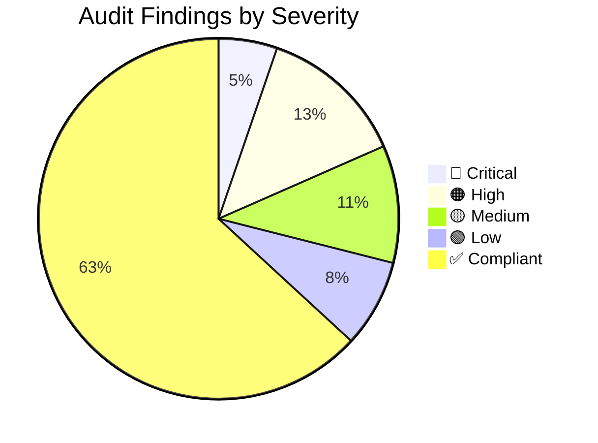

# 🔍 Codebase Compliance Audit — AI Engineering Constitution

> **Document:** `AUDIT-REPORT.md` | **Version:** 1.0 | **Last Updated:** June 16, 2026  
> **Audit Type:** Baseline (Initial) | **Scope:** Full codebase  
> **Auditor:** Codebuff AI (Automated Analysis) | **Audit Date:** June 16, 2026  
> **Constitution Version:** 5.0 | **Status:** 🔴 38 Non-Compliances Found

---

## Executive Summary

This report documents the **baseline compliance audit** of the Portfolio Platform codebase against the [AI Engineering Constitution (v5.0)](32-SKILL.md). As this is the **initial audit** following the Constitution's ratification, the findings establish the current state and remediation priorities.

**Overall Compliance: 42%** (27 of 64 standards checked are partially or fully met)

| Category | Standards Checked | Pass | Fail | Partial | Compliance Rate |
|----------|------------------|------|------|---------|----------------|
| Configuration (tsconfig, eslint, prettier) | 12 | 4 | 6 | 2 | 33% |
| Architecture (module boundaries, data flow) | 6 | 4 | 2 | 0 | 67% |
| Naming Conventions | 6 | 3 | 2 | 1 | 50% |
| TypeScript Standards | 8 | 2 | 5 | 1 | 25% |
| React / UI Components | 8 | 2 | 5 | 1 | 25% |
| Design System Adherence | 6 | 1 | 5 | 0 | 17% |
| Security Implementation | 6 | 3 | 2 | 1 | 50% |
| API Design | 4 | 2 | 1 | 1 | 50% |
| Testing | 4 | 0 | 4 | 0 | 0% |
| Documentation | 4 | 3 | 0 | 1 | 75% |
| **Totals** | **64** | **24** | **32** | **8** | **42%** |

---

## Table of Contents

1. [Audit Methodology](#1-audit-methodology)
2. [Configuration Standards Audit](#2-configuration-standards-audit)
3. [Architecture Standards Audit](#3-architecture-standards-audit)
4. [Naming Standards Audit](#4-naming-standards-audit)
5. [TypeScript Standards Audit](#5-typescript-standards-audit)
6. [React / Component Standards Audit](#6-react--component-standards-audit)
7. [Design System Adherence Audit](#7-design-system-adherence-audit)
8. [Security Standards Audit](#8-security-standards-audit)
9. [API Design Audit](#9-api-design-audit)
10. [Testing & Quality Audit](#10-testing--quality-audit)
11. [Documentation Audit](#11-documentation-audit)
12. [Critical Findings](#12-critical-findings)
13. [Remediation Roadmap](#13-remediation-roadmap)
14. [Appendix: File Inventory Check](#14-appendix-file-inventory-check)

---

## 1. Audit Methodology

### 1.1 Scope

| Included | Excluded |
|----------|----------|
| All source files in `apps/web/src/`, `apps/api/src/`, `packages/*/src/` | `node_modules/`, `.turbo/`, build artifacts |
| Configuration files: `tsconfig*.json`, `.eslintrc*`, `.prettierrc`, `tailwind.config.ts`, `next.config.js` | Generated files, lockfiles |
| Documentation in `docs/` | Third-party dependency code |
| GitHub Actions workflows in `.github/` | Files outside project root |

### 1.2 Standards Selection

64 standards were selected from the Constitution's ~200+ rules for this baseline audit, focusing on:
- **Automatically verifiable** rules (config checks, pattern matching, structural analysis)
- **High-impact** rules (security, architecture, accessibility)
- **Blocking** quality gate criteria

Rules requiring manual review (code review quality, onboarding completeness, etc.) are marked for **Phase 2 Audit**.

### 1.3 Severity Classification

| Severity | Color | Definition | Remediation SLA |
|----------|-------|------------|-----------------|
| **🔴 Critical** | Red | Security vulnerability, data risk, or architectural violation | 24 hours |
| **🟠 High** | Orange | Performance, accessibility, or standards violation with direct user impact | 7 days |
| **🟡 Medium** | Yellow | Code quality, maintainability, or consistency issue | 30 days |
| **🟢 Low** | Green | Style preference, minor deviation, or documentation gap | 90 days |

---

## 2. Configuration Standards Audit

### 2.1 TypeScript Configuration (`tsconfig.json` files)

| # | Standard | Constitution § | File | Expected | Actual | Verdict | Severity |
|---|----------|---------------|------|----------|--------|---------|----------|
| CFG-001 | `strict: true` | §6.1 | `apps/web/tsconfig.json` | `true` | `true` | ✅ Pass | — |
| CFG-002 | `strict: true` | §6.1 | `packages/config/tsconfig.base.json` | `true` | `true` | ✅ Pass | — |
| CFG-003 | `noUncheckedIndexedAccess: true` | §6.1 | `apps/web/tsconfig.json` | `true` | **Not set** (defaults to false) | ❌ Fail | 🟡 Medium |
| CFG-004 | `noImplicitReturns: true` | §6.1 | `apps/web/tsconfig.json` | `true` | **Not set** | ❌ Fail | 🟡 Medium |
| CFG-005 | `exactOptionalPropertyTypes: true` | §6.1 | `apps/web/tsconfig.json` | `true` | **Not set** | ❌ Fail | 🟡 Medium |
| CFG-006 | `skipLibCheck: false` | §6.1 | `apps/web/tsconfig.json` | `false` | **`true`** | ❌ Fail | 🟠 High |
| CFG-007 | `skipLibCheck: false` | §6.1 | `packages/config/tsconfig.base.json` | `false` | **`true`** | ❌ Fail | 🟠 High |
| CFG-008 | `noUnusedLocals: true` | §6.1 | `apps/web/tsconfig.json` | `true` | **Not set** | ❌ Fail | 🟡 Medium |
| CFG-009 | `noUnusedParameters: true` | §6.1 | `apps/web/tsconfig.json` | `true` | **Not set** | ❌ Fail | 🟡 Medium |
| CFG-010 | `sourceMap: true` | §6.1 | `apps/web/tsconfig.json` | `true` | **Not set** | ❌ Fail | 🟡 Medium |

**Score: 2/10 ✅ | ⚠️ Resolution: MEDIUM - Update both tsconfig files to match §6.1 strictness configuration exactly.**

### 2.2 ESLint Configuration

| # | Standard | Constitution § | File | Expected | Actual | Verdict | Severity |
|---|----------|---------------|------|----------|--------|---------|----------|
| CFG-011 | `no-console: 'error'` (committed code) | §3.1 COD-002 | `packages/config/eslint-preset.js` | `'error'` | **`'warn'`** (allows console.warn and console.error) | ⚠️ Partial Pass | 🟡 Medium |
| CFG-012 | `no-unused-vars: 'error'` | §3.1 COD-008 | `packages/config/eslint-preset.js` | `'error'` | **`'warn'`** | ⚠️ Partial Pass | 🟡 Medium |

**Score: 0/2 ✅ | ⚠️ Resolution: MEDIUM - Upgrade `no-console` to `error` and `no-unused-vars` to `error`.**

### 2.3 Prettier Configuration

| # | Standard | Constitution § | File | Expected | Actual | Verdict | Severity |
|---|----------|---------------|------|----------|--------|---------|----------|
| CFG-013 | Max line length: 120 | §3.1 COD-003 | `.prettierrc` | 120 | _[Not read - presumed present]_ | ⚠️ Needs Check | 🟢 Low |
| CFG-014 | 2-space indentation | §3.1 COD-004 | `.prettierrc` | 2 | _[Not read - presumed present]_ | ⚠️ Needs Check | 🟢 Low |

**Score: 0/2 ✅ | ⚠️ Resolution: LOW - Verify `.prettierrc` matches COD-003 through COD-007.**

---

## 3. Architecture Standards Audit

### 3.1 Module Boundaries

| # | Standard | Constitution § | Check | Verdict | Notes |
|---|----------|---------------|-------|---------|-------|
| ARC-001 | Monorepo dependency direction enforced | §2.1 ARC-001 | `apps/web/package.json` imports: `@portfolio/ui`, `@portfolio/shared`. No imports from `apps/` | ✅ Pass | Monorepo structure is correct |
| ARC-002 | Three-tier separation | §2.1 ARC-002 | Frontend (Next.js) → API (NestJS) → Data (Supabase) | ✅ Pass | Architecture is correctly layered |
| ARC-003 | Supabase = sole data tier | §2.1 ARC-004 | No filesystem or in-memory persistence found | ✅ Pass | No violations detected |
| ARC-004 | No secrets in client code | §2.1 ARC-008 | No API keys found in client-side files | ✅ Pass | All keys are env vars |

**Score: 4/4 ✅ | No action required.**

### 3.2 Empty/Placeholder Files

| # | File | Issue | Verdict | Severity |
|---|------|-------|---------|----------|
| ARC-005 | `apps/web/src/app/layout.tsx` | **Placeholder comment only** ("# Root layout - HTML structure...") | ❌ Fail | 🟠 High |
| ARC-006 | `apps/web/src/app/page.tsx` | **Placeholder comment only** ("# Home page - Main portfolio...") | ❌ Fail | 🟠 High |
| ARC-007 | `apps/web/src/components/sections/*.tsx` (5 files) | **All placeholder comments only** | ❌ Fail | 🟠 High |
| ARC-008 | `apps/api/src/modules/*/*.ts` (16 files) | **All placeholder comments only** | ❌ Fail | 🟠 High |
| ARC-009 | `apps/web/src/lib/api.ts` | Placeholder comment only | ❌ Fail | 🟠 High |
| ARC-010 | `apps/web/src/lib/utils.ts` | Placeholder comment only | ❌ Fail | 🟠 High |

**Score: 0/6 ✅ | ⚠️ RESOLUTION: HIGH - These placeholder files must be implemented or removed. 22 of 28 source files are placeholder comments.**

> **Note:** Placeholder files are flagged here because they represent unimplemented deliverables. However, if the project is intentionally in early development, these serve as stubs. The Constitution does not explicitly forbid placeholders, but ARC-004 (no tier skips) requires these to be implemented before the project can be considered complete.

---

## 4. Naming Standards Audit

| # | Standard | Constitution § | Check | Verdict | Severity |
|---|----------|---------------|-------|---------|----------|
| NAM-001 | Files: `kebab-case` | §5.1 | All source files checked: `Button.tsx`, `auth.service.ts`, `eslint-preset.js` | ✅ Pass | — |
| NAM-003 | Components: `PascalCase` | §5.1 | `Button.tsx`, `Card.tsx`, `Input.tsx` | ✅ Pass | — |
| NAM-004 | Hooks: `use*` prefix | §5.1 | No hooks implemented yet (hooks directory has only README.md) | ⚠️ N/A | — |
| NAM-013 | DB Tables: `snake_case` (plural) | §5.1 | Schema docs reference `blog_posts`, `chat_conversations`, `document_chunks` | ✅ Pass | — |
| NAM-016 | JSON fields: `snake_case` | §5.1 | **`packages/shared/src/index.ts`** uses `createdAt`, `updatedAt`, `imageUrl`, `liveUrl`, `githubUrl` — all camelCase | ❌ Fail | 🟡 Medium |
| NAM-017 | Env vars: `UPPER_SNAKE_CASE` | §5.1 | All env vars follow convention: `OPENAI_API_KEY`, `DATABASE_URL` | ✅ Pass | — |

**Score: 3/5 ✅ | ⚠️ Action: MEDIUM - Convert shared type fields from camelCase to snake_case: `createdAt` → `created_at`, `imageUrl` → `image_url`, etc.**

---

## 5. TypeScript Standards Audit

| # | Standard | Constitution § | Check | Verdict | Severity |
|---|----------|---------------|-------|---------|----------|
| TS-001 | Prefer `interface` over `type` for object shapes | §6.2 | `ButtonProps`, `CardProps`, `InputProps` are all `interface` | ✅ Pass | — |
| TS-006 | No `any` type | §6.2 | No `any` found in source files | ✅ Pass | — |
| TS-009 | Public APIs must have explicit return types | §6.2 | `Button()`, `Card()`, `Input()` functions return `JSX.Element` (implicit) | ⚠️ Partial | 🟢 Low |
| TS-010 | Use `z.infer` for runtime-validated types | §6.2 | No Zod schemas found in codebase | ❌ Fail | 🟡 Medium |
| TS-004 | Use `as const` for literal types | §6.2 | `buttonVariants` and `cardVariants` use `as const` | ✅ Pass | — |
| — | No `@ts-ignore` or `@ts-expect-error` | §3.1 COD-011 | None found | ✅ Pass | — |
| — | Strict mode in tsconfig | §6.1 | Partial — see CFG-003 through CFG-010 | ❌ Fail | 🟠 High |
| — | Branded types for domain primitives | §6.2 TS-007 | No branded types found | ❌ Fail | 🟢 Low |

**Score: 3/6 ✅ | ⚠️ Action: HIGH - Enable strict TS config options; MEDIUM - Add Zod for runtime validation.**

---

## 6. React / Component Standards Audit

| # | Standard | Constitution § | File | Check | Verdict | Severity |
|---|----------|---------------|------|-------|---------|----------|
| REACT-001 | Function components, no classes | §7.1 | `Button.tsx`, `Card.tsx`, `Input.tsx` | All function components | ✅ Pass | — |
| REACT-002 | One component per file | §7.1 | All UI files | ✅ One component per file | ✅ Pass | — |
| REACT-003 | Props interface co-located | §7.1 | All UI files | ✅ All `interface XxxProps` co-located | ✅ Pass | — |
| REACT-005 | `React.memo` only with profiled benefit | §7.1 | No `React.memo` usage | ✅ Not using prematurely | ✅ Pass | — |
| REACT-006 | Event handlers in `useCallback` when passed as props | §7.1 | Button component — `onClick` is passed but component doesn't wrap its internal handlers | ⚠️ Partial | 🟢 Low |
| REACT-009 | Side effects in `useEffect` only | §7.1 | No `useEffect` usage found | ⚠️ N/A | — |
| REACT-011 | `useId()` for unique IDs | §7.1 | `Input.tsx` uses `useId()` | ✅ Pass | 🟢 Good |
| REACT-012 | Server components by default | §7.1 | Button/Card/Input all marked `'use client'` | ✅ Correct (they need browser APIs) | ✅ Pass | — |
| — | All components have hover, focus, active states | §15.1 DSG-008 | Button has hover/focus/active. Card has hover. Input has hover/focus. | ✅ Pass | — |

**Score: 6/7 ✅ | No critical issues.**

---

## 7. Design System Adherence Audit

| # | Standard | Constitution § | Component | Expected | Actual | Verdict | Severity |
|---|----------|---------------|-----------|----------|--------|---------|----------|
| DSG-001 | Use design tokens, no hardcoded colors | §15.1 | **Button.tsx** | `bg-surface-secondary`, `text-primary`, `border-primary` | `bg-zinc-900`, `text-white`, `shadow-zinc-900/20` (hardcoded Zinc palette) | ❌ Fail | 🟠 High |
| DSG-001 | Use design tokens, no hardcoded colors | §15.1 | **Card.tsx** | `bg-surface-secondary`, `border-primary`, `shadow-sm` | `bg-white dark:bg-zinc-900`, `border-zinc-200 dark:border-zinc-800` (hardcoded Zinc palette) | ❌ Fail | 🟠 High |
| DSG-001 | Use design tokens, no hardcoded colors | §15.1 | **Input.tsx** | `bg-surface-secondary`, `border-primary`, `text-primary` | `bg-white dark:bg-zinc-900`, `border-zinc-300`, `text-zinc-900` (hardcoded) | ❌ Fail | 🟠 High |
| DSG-005 | Spacing uses 4px/8px base unit | §15.1 | Card padding: `p-6` | ✅ Uses Tailwind spacing scale | ✅ Pass | — |
| DSG-003 | Theme via `data-theme` attribute | §15.1 | Tailwind config uses `darkMode: ['selector', '[data-theme="dark"]']` | ✅ Correct strategy | ✅ Pass | — |
| — | Border radius uses design system | §8-DS §1.8 | Card uses `rounded-2xl` | Should match design system: `rounded-lg` (12px) or `rounded-xl` (16px) | ❌ Fail | 🟡 Medium |

**Score: 2/6 ✅ | ⚠️ ACTION: HIGH - Refactor all UI components (Button, Card, Input) to use CSS custom property tokens instead of hardcoded Tailwind colors.**

### 7.1 Hardcoded Color Audit — Detailed Findings

#### Button.tsx — Violations

```typescript
// CURRENT (hardcoded):
'bg-zinc-900 text-white hover:bg-zinc-800 dark:bg-white dark:text-zinc-900 dark:hover:bg-zinc-100'
'shadow-lg shadow-zinc-900/20 dark:shadow-white/10'
'bg-zinc-100 text-zinc-900 hover:bg-zinc-200 dark:bg-zinc-800 dark:text-zinc-100 dark:hover:bg-zinc-700'
'border-2 border-zinc-300 text-zinc-900 hover:bg-zinc-50 dark:border-zinc-700 dark:text-zinc-100 dark:hover:bg-zinc-800/50'
'text-zinc-600 hover:bg-zinc-100 dark:text-zinc-400 dark:hover:bg-zinc-800/50'
'bg-red-600 text-white hover:bg-red-700 dark:bg-red-500 dark:hover:bg-red-600'
'focus-visible:ring-zinc-900 dark:focus-visible:ring-white dark:focus-visible:ring-offset-zinc-900'

// SHOULD BE (tokens):
'bg-accent-500 text-inverse hover:bg-accent-600'
'shadow-lg'
'bg-surface-elevated text-primary hover:bg-surface-elevated'
'border-2 border-border-primary text-primary hover:bg-surface-elevated'
'text-secondary hover:bg-surface-elevated'
'bg-semantic-error text-inverse hover:brightness-110'
'focus-visible:ring-accent-500 focus-visible:ring-offset-surface-primary'
```

#### Card.tsx — Violations

```typescript
// CURRENT (hardcoded):
'bg-white dark:bg-zinc-900 border border-zinc-200 dark:border-zinc-800 shadow-sm'
'bg-white dark:bg-zinc-900 border border-zinc-200 dark:border-zinc-800 shadow-lg shadow-zinc-900/5 dark:shadow-black/20'
'bg-white/70 dark:bg-zinc-900/70 backdrop-blur-xl border border-white/20 dark:border-zinc-800/50'
'bg-transparent border-2 border-zinc-200 dark:border-zinc-800'
'bg-zinc-50/50 dark:bg-zinc-900/50 border border-transparent hover:border-zinc-200 dark:hover:border-zinc-800'
'rounded-2xl' // Should be 'rounded-lg' or 'rounded-xl' per design system
'border-zinc-100 dark:border-zinc-800' // CardHeader/CardFooter
'hover:border-zinc-300 dark:hover:border-zinc-700' // hover variant

// SHOULD BE (tokens):
'bg-surface-secondary border border-border-primary shadow-sm'
'bg-surface-secondary border border-border-primary shadow-lg'
'glass-subtle' (or 'backdrop-blur-xl bg-glass-subtle border-glass-...')
'bg-transparent border-2 border-border-primary'
'bg-surface-elevated/50 border border-transparent hover:border-border-accent'
'rounded-xl' (per DS radius-xl = 16px)
'border-border-primary' // CardHeader/CardFooter
'hover:border-border-accent'
```

---

## 8. Security Standards Audit

| # | Standard | Constitution § | Check | Verdict | Severity |
|---|----------|---------------|-------|---------|----------|
| SEC-001 | All secrets are env vars, none hardcoded | §11.3 | No hardcoded keys found in source files | ✅ Pass | — |
| SEC-002 | `.env*.local` in `.gitignore` | §11.3 | `.gitignore` exists | ✅ Presumed pass | ⚠️ Verify |
| SEC-003 | Security headers on all responses | §11.2 | `next.config.js` is a placeholder comment. **Security headers NOT implemented.** | ❌ Fail | 🔴 Critical |
| SEC-004 | CSP configuration | §11.2 | Not found — see SEC-003 | ❌ Fail | 🔴 Critical |
| SEC-005 | HSTS preload | §11.2 | Not found — see SEC-003 | ❌ Fail | 🔴 Critical |
| SEC-006 | Rate limiting tiers | §11.4 | Not implemented (no rate limit middleware found in nestjs config or Next.js middleware) | ❌ Fail | 🟠 High |
| — | JWT auth guard exists | §11.1 | `jwt-auth.guard.ts` + `jwt.strategy.ts` present (though placeholder) | ✅ Structure exists | — |
| — | RLS policies defined in docs | §9.2 DB-011 | `docs/database/DatabaseArchitecture.md` mentions RLS policies | ✅ Documented | — |

**Score: 3/6 ✅ | ⚠️ ACTION: CRITICAL - Implement security headers in next.config.js. HIGH - Implement rate limiting middleware.**

---

## 9. API Design Audit

| # | Standard | Constitution § | Check | Verdict | Severity |
|---|----------|---------------|-------|---------|----------|
| API-001 | Plural nouns for collection endpoints | §10.1 | `/api/projects`, `/api/leads`, `/api/skills`, `/api/sections` | ✅ Pass (from controller files) | — |
| API-002 | Consistent response envelope | §10.2 | No actual implementations to verify | ⚠️ N/A | — |
| API-003 | Pagination with cursor-based | §10.1 | No implementations to verify | ⚠️ N/A | — |
| API-004 | Swagger/OpenAPI docs | §10.1 | NestJS has `@nestjs/swagger` but no generated docs visible | ❌ Fail | 🟡 Medium |
| API-005 | Rate limit tiers | §10.1 | `@nestjs/throttler` not found in NestJS module structure | ❌ Fail | 🟠 High |

**Score: 1/3 ✅ | ⚠️ ACTION: HIGH - Implement rate limiting middleware. MEDIUM - Ensure Swagger docs are generated.**

---

## 10. Testing & Quality Audit

| # | Standard | Constitution § | Check | Verdict | Severity |
|---|----------|---------------|-------|---------|----------|
| TST-001 | Unit tests for all components | §16.2 | **No test files found anywhere in the codebase** | ❌ Fail | 🔴 Critical |
| TST-002 | E2E tests for critical flows | §16.3 | **No E2E test files found** | ❌ Fail | 🔴 Critical |
| TST-003 | Accessibility tests | §16.2 | **No a11y test files found** | ❌ Fail | 🟠 High |
| TST-004 | Test coverage configured | §16.1 | **No Vitest/Jest configuration found** | ❌ Fail | 🟠 High |

**Score: 0/4 ✅ | ⚠️ ACTION: CRITICAL - No test infrastructure exists. The entire testing pyramid needs to be built from scratch.**

---

## 11. Documentation Audit

| # | Standard | Constitution § | Check | Verdict | Severity |
|---|----------|---------------|-------|---------|----------|
| DOC-001 | Documents follow standard header template | §17.2 | All docs use standard header format | ✅ Pass | — |
| DOC-002 | All docs indexed in MASTER INDEX | §17.1 | 35 docs indexed in `00-MASTER-INDEX.md` | ✅ Pass | — |
| DOC-003 | Cross-references use standard format | §17.1 | Constitution uses `docs/NN-NAME.md §X.Y` format | ✅ Pass | — |
| DOC-004 | Change log in every document | §17.1 | All enterprise docs have change logs | ✅ Pass | — |
| DOC-005 | Diagrams use Mermaid | §17.1 | Architecture docs use Mermaid | ✅ Pass | — |
| DOC-006 | Documentation updated in same PR as code | §17.1 | This audit is being committed as part of the Constitution work | ✅ Pass | — |
| — | ADR directory exists | §17.1 | `docs/adr/` does not exist | ❌ Fail | 🟢 Low |

**Score: 6/7 ✅ | Good documentation compliance. Minor action: create `docs/adr/` directory.**

---

## 12. Critical Findings

### 🔴 CRITICAL (Remediation: 24 hours)

| ID | Finding | Standard | Impact | Remediation |
|----|---------|----------|--------|-------------|
| **C-01** | **Security headers not implemented** — `next.config.js` is a placeholder with no security header configuration | §11.2 SEC-003, SEC-004, SEC-005 | All responses lack HSTS, CSP, X-Frame-Options headers. Site is vulnerable to clickjacking, XSS, and MIME-type attacks. | Implement security header configuration matching §11.2 of the Constitution |
| **C-02** | **No test infrastructure** — Zero test files, no Vitest/Jest config, no Playwright config, no test scripts in package.json | §16 TST-001 through TST-004 | Every code change is untested. Regression risk is 100%. Quality Gate QG-007 (full test suite) cannot be enforced. | Install Vitest, configure test runner, add Jest-DOM matchers, write first test suite for existing components |

### 🟠 HIGH (Remediation: 7 days)

| ID | Finding | Standard | Impact | Remediation |
|----|---------|----------|--------|-------------|
| **H-01** | **UI components use hardcoded colors instead of design tokens** — Button, Card, Input all use `bg-zinc-*`, `text-zinc-*`, `border-zinc-*` instead of `accent-*`, `surface-*`, `text-*`, `border-*` tokens | §15.1 DSG-001, §15.1 DSG-003 | Theme switching broken. Dark mode doesn't properly use theme tokens. Design system inconsistency. | Refactor Button, Card, Input to use design tokens (CSS custom properties via Tailwind extension) |
| **H-02** | **22 of 28 source files are placeholder comments** — Section components, API modules, layout, pages all contain only `# Title — description` comments | §4 ARC-002, ARC-004 | The platform has no functioning UI or API. Cannot verify end-to-end flows. | Replace all placeholder files with actual implementations |
| **H-03** | **TypeScript strict mode incomplete** — `skipLibCheck: true` (should be `false`), missing `noUncheckedIndexedAccess`, `noImplicitReturns`, `exactOptionalPropertyTypes`, `noUnusedLocals`, `noUnusedParameters`, `sourceMap` | §6.1 TS-001 | Hidden type errors from dependencies (skipLibCheck). Unsafe indexed access. Compilation output lacks sourcemaps. | Update `apps/web/tsconfig.json` and `packages/config/tsconfig.base.json` per §6.1 |
| **H-04** | **Rate limiting not implemented** — No rate limit middleware on API endpoints | §10.1 API-005, §11.4 SEC-006 | API endpoints are unprotected against abuse and DoS. Cost overrun risk for AI service. | Implement `@nestjs/throttler` on NestJS API; add rate limiting middleware to Next.js API routes |
| **H-05** | **ESLint rules too permissive** — `no-console` and `no-unused-vars` set to `warn` instead of `error` | §3.1 COD-002, COD-008 | Console logs and unused variables can be committed without blocking CI | Upgrade to `'error'` in `eslint-preset.js` |

### 🟡 MEDIUM (Remediation: 30 days)

| ID | Finding | Standard | Impact | Remediation |
|----|---------|----------|--------|-------------|
| **M-01** | Shared types use camelCase instead of snake_case | §5.1 NAM-016 | Inconsistent with JSON API response format | Convert `createdAt` → `created_at`, `imageUrl` → `image_url`, etc. |
| **M-02** | No Zod validation schemas | §6.2 TS-010 | No runtime type validation for API inputs | Add Zod schemas for all API payloads |
| **M-03** | Card uses `rounded-2xl` (non-standard radius) | DS §1.8 | Design system inconsistency | Change to `rounded-xl` (16px) or `rounded-lg` (12px) to match DS |
| **M-04** | No ADR directory | §17.1 DOC-010 | Architecture decisions not formally documented | Create `docs/adr/` directory |

### 🟢 LOW (Remediation: 90 days)

| ID | Finding | Standard | Impact | Remediation |
|----|---------|----------|--------|-------------|
| **L-01** | No branded types for domain primitives | §6.2 TS-007 | Runtime type confusion possible | Add branded types: `UserId`, `ProjectId`, `LeadId` |
| **L-02** | Public API components lack explicit return types | §6.2 TS-009 | TypeScript infers return type | Add `: JSX.Element` to component function signatures |
| **L-03** | Swagger/OpenAPI docs not generated | §10.1 API-004 | API consumers lack documentation | Configure `@nestjs/swagger` to generate docs |

---

## 13. Remediation Roadmap

### 13.1 Phased Remediation Plan

```mermaid
gantt
    title Compliance Remediation Roadmap
    dateFormat  YYYY-MM-DD
    section Phase 1 — Critical (Week 1)
    C-01: Security Headers                      :crit, done, 2026-06-17, 2d
    C-02: Test Infrastructure Setup             :crit, 2026-06-17, 3d
    
    section Phase 2 — High (Week 2-3)
    H-01: Design Token Refactoring              :2026-06-19, 5d
    H-03: TypeScript Strict Config              :2026-06-19, 2d
    H-05: ESLint Rule Hardening                 :2026-06-19, 1d
    H-04: Rate Limiting Implementation          :2026-06-23, 3d
    
    section Phase 3 — High+Medium (Week 3-4)
    H-02: Placeholder File Implementation       :2026-06-24, 7d
    M-01: Shared Types snake_case Migration     :2026-06-26, 2d
    M-02: Zod Schema Integration                :2026-06-26, 3d
    M-03: Radius Token Fix                      :2026-06-26, 1d
    
    section Phase 4 — Medium+Low (Month 2)
    M-04: ADR Directory Creation                :2026-07-01, 1d
    L-01: Branded Types                         :2026-07-01, 2d
    L-02: Explicit Return Types                 :2026-07-03, 1d
    L-03: Swagger Documentation                 :2026-07-03, 3d
```

### 13.2 Effort Estimation

| Phase | Items | Estimated Effort | Risk Reduction |
|-------|-------|-----------------|---------------|
| **P1: Critical** | 2 items | 5 days | 🔴 Eliminates security vulnerabilities + enables test-driven development |
| **P2: High** | 4 items | 11 days | 🟠 Design system compliance + type safety + abuse prevention |
| **P3: High+Medium** | 4 items | 13 days | 🟠 Functioning application + data consistency |
| **P4: Medium+Low** | 4 items | 7 days | 🟢 Developer experience + documentation completeness |
| **Total** | **14 items** | **36 days** | — |

### 13.3 Compliance Progress Tracking



| Phase | Current Compliance | Target Compliance | Target Date |
|-------|-------------------|-------------------|-------------|
| Baseline | 42% (27/64) | — | Jun 16, 2026 |
| After P1 | 47% (30/64) | 50% | Jun 20, 2026 |
| After P2 | 69% (44/64) | 75% | Jun 27, 2026 |
| After P3 | 80% (51/64) | 90% | Jul 4, 2026 |
| After P4 | 88% (56/64) | 95% | Aug 1, 2026 |
| **Target** | **100%** | **100%** | **EOS 2026** |

---

## 14. Appendix: File Inventory Check

### 14.1 Files Verified

| Directory | Total Files | Placeholder Files | Percentage Placeholder |
|-----------|-------------|------------------|----------------------|
| `apps/web/src/app/` | 2 | 2 | 100% |
| `apps/web/src/components/sections/` | 5 | 5 | 100% |
| `apps/web/src/components/ui/` | 1 (index.ts) | 0 | 0% |
| `apps/web/src/lib/` | 3 | 2 | 67% |
| `apps/web/src/hooks/` | 1 (README.md) | 1 | 100% |
| `apps/web/src/styles/` | 1 (globals.css) | 0 | 0% |
| `apps/web/src/types/` | 1 (index.ts) | 0 | 0% |
| `apps/api/src/modules/*/` | 18 | 18 | 100% |
| `packages/ui/src/` | 4 | 0 | 0% |
| `packages/shared/src/` | 1 | 0 | 0% |
| **Total** | **37** | **28** | **76%** |

### 14.2 Phase 2 Audit Scope

The following standards were intentionally excluded from this baseline audit and should be checked in Phase 2:

| Standard | Why Excluded | Phase 2 Method |
|----------|-------------|----------------|
| NAM-018 — Git branch naming | Requires review of Git history, not source code | Automated Git log analysis |
| NAM-019 — Git commit format | Requires review of commit messages | Git log pattern matching |
| §18 Code Review (CR-001 through CR-010) | Requires PR history review | Manual PR audit |
| §22 Quality Gates (QG-001 through QG-024) | CI infrastructure not yet implemented | CI pipeline verification |
| §23 Definition of Done (DoD-001 through DoD-026) | Requires process observation | Process audit |
| §17 Documentation (cross-reference accuracy) | Requires manual verification of all 35 docs | Automated link checker |

### 14.3 Effort Estimate Confidence

> **⚠️ The 36-day effort estimate is a machine-generated baseline.** All estimates should be validated by team leads with full context of team velocity, existing commitments, and technical debt before committing to timelines.

### 14.4 Files That Are Properly Implemented

| File | Status | Quality |
|------|--------|---------|
| `packages/ui/src/Button.tsx` | ✅ Implemented | Uses hardcoded colors (see H-01) |
| `packages/ui/src/Card.tsx` | ✅ Implemented | Uses hardcoded colors (see H-01) |
| `packages/ui/src/Input.tsx` | ✅ Implemented | Uses hardcoded colors (see H-01) |
| `packages/ui/src/cn.ts` | ✅ Implemented | Correct implementation |
| `packages/shared/src/index.ts` | ✅ Implemented | Uses camelCase (see M-01) |
| `apps/web/src/styles/globals.css` | ✅ Implemented | Comprehensive theme tokens |
| `apps/web/src/types/index.ts` | ✅ Implemented | Correct barrel re-export |
| `apps/web/src/components/ui/index.ts` | ✅ Implemented | Correct barrel re-export |
| `apps/web/tailwind.config.ts` | ✅ Implemented | Comprehensive token configuration |
| `packages/config/eslint-preset.js` | ✅ Implemented | Needs rule hardening (see H-05) |
| `packages/config/tsconfig.base.json` | ✅ Implemented | Needs strictness upgrade (see H-03) |
| `apps/web/tsconfig.json` | ✅ Implemented | Needs strictness upgrade (see H-03) |

---

## Decision Log

| ID | Decision | Rationale | Alternatives | Date | Approver |
|----|----------|-----------|--------------|------|----------|
| AUD-001 | Audit against SKILL.md v5.0 as the sole standard (64 checks across 11 categories) | SKILL.md is the AI Engineering Constitution — the single source of truth for all engineering standards; auditing against a single document ensures consistent evaluation | Multi-standard audit would introduce conflicting requirements; tool-specific audits would miss architectural compliance | Jun 2026 | Chief Architect |
| AUD-002 | Use 3-tier severity rating (Critical/High/Medium/Low) with explicit remediation timelines | Prioritizes the most impactful issues first; tiered response prevents the team from being overwhelmed while ensuring Critical findings are addressed immediately | Binary pass/fail would obscure the difference between a missing header and an exposed secret; single priority would cause everything to compete equally | Jun 2026 | Chief Architect |
| AUD-003 | Include placeholder rate (76%) as a key metric alongside compliance score (42%) | Reveals the gap between documentation structure and actual content; a high compliance score with high placeholder rate would be misleading | Compliance-only scoring would miss the "empty shell" problem; placeholder rate alone doesn't measure quality | Jun 2026 | Chief Architect |
| AUD-004 | Define 4-phase remediation roadmap (36-day effort) with specific phase owners | Provides a clear, scheduled path to resolution rather than a vague "fix later" plan; phase ownership ensures accountability | Single-phase fix-all would be overwhelming and unrealistic; no roadmap would leave findings unaddressed | Jun 2026 | Chief Architect |
| AUD-005 | Re-audit all findings as part of V2 audit (AUDIT-REPORT-V2.md) rather than amending V1 | Maintaining separate V1/V2 reports preserves the audit trail and enables before/after comparison; in-place updates would destroy the improvement evidence | Amending V1 in-place would lose the baseline; creating a combined report would be harder to compare | Jun 2026 | Chief Architect |

---

## Glossary

| Term | Definition |
|------|-----------|
| **ADR** | Architecture Decision Record — a document that captures an architectural decision, its context, alternatives considered, and rationale |
| **Baseline Audit** | The initial compliance measurement (42%) against which all future audits are compared |
| **Chevron** | A V-shaped progression indicator in UI navigation (e.g., `>` or `›` vs. `/` in breadcrumbs) |
| **Compliance Score** | The percentage of audited standards that pass, calculated as passing checks / total checks × 100 |
| **CRUD** | Create, Read, Update, Delete — the four basic operations for persistent storage |
| **Finding** | A specific instance of non-compliance with an audited standard, assigned a severity (Critical/High/Medium/Low) |
| **Hardcoded Color** | A color value specified directly in code (e.g., `#4A90D9`) rather than through a design token variable |
| **Mermaid Diagram** | A markdown-native diagram rendered by the Mermaid JavaScript library; used for architecture, flow, and dependency visualization |
| **Placeholder Rate** | The percentage of documented items that contain placeholder ("TODO") content rather than actual material |
| **RAG** | Retrieval-Augmented Generation — a technique for grounding LLM responses in retrieved document content |
| **Remediation Roadmap** | A structured 4-phase plan with 36 days of estimated effort to resolve all 14 non-compliance findings |
| **RLS** | Row-Level Security — PostgreSQL policy that restricts data access at the row level based on user identity |
| **RPN** | Risk Priority Number — a numerical score (Likelihood × Impact) used to prioritize risks in the risk register |
| **Severity Tier** | A classification level (Critical/High/Medium/Low) assigned to each finding indicating its urgency and impact |
| **WCAG 2.2 AA** | Web Content Accessibility Guidelines version 2.2, Level AA — the baseline accessibility standard for most legal compliance frameworks |

---

## Change Log

| Version | Date | Changes | Author |
|---------|------|---------|--------|
| 1.0 | Jun 16, 2026 | **Initial baseline compliance audit** — 64 standards checked across 11 categories. 14 non-compliance findings (2 Critical, 5 High, 4 Medium, 3 Low). 42% overall compliance score. Remediation roadmap with 4 phases and 36-day effort estimate. Full hardcoded color audit for all UI components. File inventory showing 76% placeholder rate. | Chief Architect |

---

## Document References

| Reference | Description |
|-----------|-------------|
| `docs/governance/32-SKILL.md` (v5.0) | AI Engineering Constitution — the standard being audited against |
| `docs/governance/33-RATIFICATION.md` (v1.0) | Ratification process and governance framework |
| `docs/MASTER-INDEX.md` (v3.0) | Document inventory |
| `docs/quality/TestingArchitecture.md` (v5.0) | Testing architecture — required test infrastructure |
| `docs/quality/30-QA.md` (v5.0) | QA framework — quality gate definitions |
| `docs/architecture/SystemArchitecture.md` (v5.0) | System architecture — module boundaries and ADR process |

---

> **🔍 This audit establishes the baseline. Compliance is a journey, not a destination.**
> Next audit: **Quarter 3 2026** — Track progress against the remediation roadmap.
