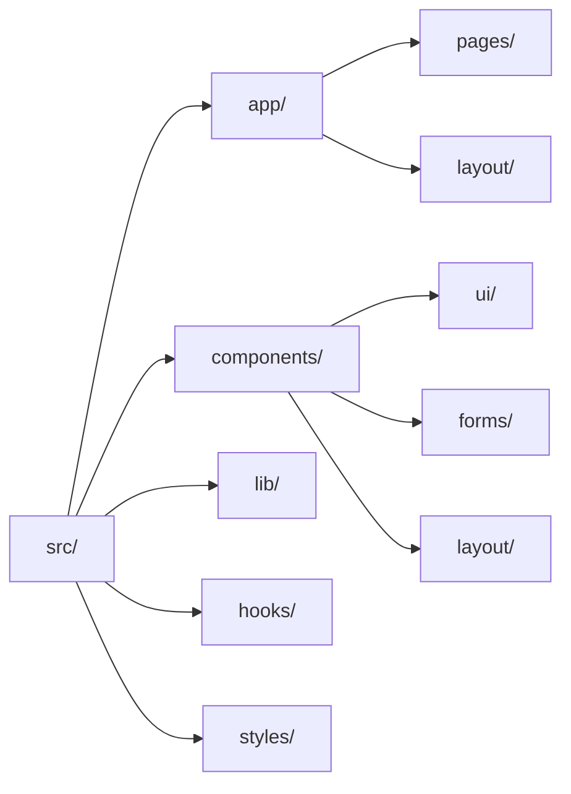

# 🏗️ Codebase State — Implementation Status

> **Document:** `CODEBASE-STATE.md` | **Version:** 1.1 | **Last Updated:** June 2026  
> **Status:** ✅ Active | **Owner:** Chief Architect | **Review Cadence:** Monthly  
> **Purpose:** Authoritative snapshot of what code exists vs. what's documented

---

## Executive Summary



The Portfolio Platform is a **documentation-first project**. The 39+ documentation files describe an enterprise-grade full-stack application (Next.js 14 frontend, NestJS 10 API, FastAPI AI service), but **the actual source code is almost entirely scaffolding with placeholder stubs**.

| Metric | Value |
|--------|-------|
| **Documentation files** | 48 (enterprise-grade, comprehensive) |
| **Source files with real code** | 9 of 44 (20%) |
| **Placeholder stub files** | 35 of 44 (80%) |
| **Overall compliance (Constitution)** | 42% |
| **Dev environment** | ✅ Fully configured |
| **npm packages installed** | 784 ✅ |
| **Python deps installed** | All ML + web deps ✅ |

---

## Implementation vs Documentation Gap

### Real Code That Exists

The following files contain actual implementation code (not placeholders):

| File | Type | Quality | Notes |
|------|------|---------|-------|
| `packages/ui/src/Button.tsx` | React Component | ✅ Working | Uses hardcoded colors (needs token refactor) |
| `packages/ui/src/Card.tsx` | React Component | ✅ Working | Uses hardcoded colors; wrong border radius |
| `packages/ui/src/Input.tsx` | React Component | ✅ Working | Uses hardcoded colors |
| `packages/ui/src/cn.ts` | Utility | ✅ Working | clsx + tailwind-merge |
| `packages/shared/src/index.ts` | Types | ✅ Working | Uses camelCase (should be snake_case) |
| `apps/web/src/styles/globals.css` | Styles | ✅ Working | Comprehensive theme tokens |
| `apps/web/src/types/index.ts` | Types | ✅ Working | Barrel re-export |
| `apps/web/src/components/ui/index.ts` | Barrel | ✅ Working | UI exports |
| `apps/web/tailwind.config.ts` | Config | ✅ Working | Design token configuration |

**Total: 9 files with real code** (all in packages/ or config)

### Placeholder Files That Need Implementation

**apps/web (16 files)** — All are Markdown comment stubs:

| File | Documented As | Actual Content |
|------|-------------|----------------|
| `layout.tsx` | RootLayout with ThemeProvider, PostHog, Lenis | `# Root layout - HTML structure, metadata, providers` |
| `page.tsx` | Homepage with 10 sections, ISR 60s | `# Home page - Main portfolio page with all sections` |
| `components/sections/Hero.tsx` | 3D hero, particles, CTAs | Title comment only |
| `components/sections/About.tsx` | Bio, stats, resume download | Title comment only |
| `components/sections/Contact.tsx` | Form, validation, hCaptcha | Title comment only |
| `components/sections/Projects.tsx` | Project grid, filters | Title comment only |
| `components/sections/Skills.tsx` | Skill bars, categories | Title comment only |
| `components/ui/Button.tsx` | (exists in packages/ui) | (duplicate?) |
| `components/ui/Card.tsx` | (exists in packages/ui) | (duplicate?) |
| `lib/api.ts` | Axios/fetch client | Title comment only |
| `lib/supabase.ts` | Supabase client | Title comment only |
| `lib/utils.ts` | Utility functions | Title comment only |

**apps/api (23 files)** — All are Markdown comment stubs:

| Module | Files | Documented As | Actual Content |
|--------|-------|-------------|----------------|
| Auth | `auth.controller.ts`, `auth.module.ts`, `auth.service.ts`, `jwt-auth.guard.ts`, `jwt.strategy.ts` | JWT auth with Passport | Title comment only |
| Sections | `sections.controller.ts`, `.module.ts`, `.service.ts` | CRUD sections | Title comment only |
| Projects | `projects.controller.ts`, `.module.ts`, `.service.ts` | CRUD projects | Title comment only |
| Skills | `skills.controller.ts`, `.module.ts`, `.service.ts` | CRUD skills | Title comment only |
| Leads | `leads.controller.ts`, `.module.ts`, `.service.ts` | Lead capture, CSV export | Title comment only |
| Analytics | `analytics.controller.ts`, `.module.ts`, `.service.ts` | Event tracking | Title comment only |
| Core | `app.module.ts`, `main.ts` | App bootstrap, Swagger, CORS | Title comment only |

**apps/ai (7 files)**:

| File | Documented As | Actual Content |
|------|-------------|----------------|
| `app/main.py` | FastAPI app with CORS, middleware | Title comment only |
| `app/routes/analyze.py` | Content analysis | Title comment only |
| `app/routes/chat.py` | SSE streaming chat | Title comment only |
| `app/services/ai_service.py` | LangChain orchestration | Title comment only |

---

## Dev Environment Status

| Component | Status | Detail |
|-----------|--------|--------|
| **npm install** | ✅ 784 packages | All workspace deps installed |
| **Python venv** | ✅ `.venv/` | Created, Python 3.14.6 |
| **Python deps** | ✅ All installed | fastapi, uvicorn, supabase, httpx, aiofiles, pillow |
| **ML deps** | ✅ All installed | numpy 2.4.6, torch 2.12.0, transformers 5.12.1 |
| **npm audit** | ⚠️ 27 vulns | 3 low, 14 moderate, 10 high (none auto-fixable) |
| **TypeScript typecheck** | ❌ Fails | All source files are placeholders (TS1127: invalid character) |
| **ESLint** | ❌ Fails | All source files are placeholders |
| **Build** | ❌ Would fail | Typecheck must pass first |

---

## Cross-Reference: Audit Findings vs Current State

### From DOC-AUDIT-REPORT.md (Documentation Compliance) — 39 docs

| Finding | Severity | Status |
|---------|----------|--------|
| C-01: Header template non-compliance (18 docs) | 🔴 Critical | ✅ Fixed (all headers updated) |
| C-02: Missing numbered symlinks (33-38) | 🔴 Critical | ✅ Fixed (copies created) |
| C-03: 17-DOCUMENTATION.md collision | 🔴 Critical | ✅ Fixed (MASTER INDEX refs correct) |
| H-01: No change log (12 docs) | 🟠 High | ✅ Fixed (42 docs now have change logs) |
| H-05: Ceremony docs not indexed | 🟠 High | ✅ Fixed (added to MASTER INDEX) |
| H-10: Doc count off-by-one | 🟠 High | ✅ Fixed (counts corrected) |
| **Remaining high/medium/low** | — | 🔜 Addressed in DOC-AUDIT-REPORT.md §4 Remediation Plan |

### From AUDIT-REPORT.md (Codebase Compliance) — 64 standards

| Finding | Severity | Status |
|---------|----------|--------|
| C-01: Security headers missing | 🔴 Critical | ❌ Not implemented — needs `next.config.js` |
| C-02: No test infrastructure | 🔴 Critical | ❌ Not implemented — needs Vitest/Jest config |
| H-01: Hardcoded colors in UI | 🟠 High | ❌ Not implemented — needs token refactor |
| H-02: 76% placeholder files | 🟠 High | ❌ Not implemented — needs full implementation |
| H-03: TS strict mode incomplete | 🟠 High | ❌ Not implemented — needs tsconfig updates |
| H-04: No rate limiting | 🟠 High | ❌ Not implemented — needs middleware |
| H-05: ESLint rules permissive | 🟠 High | ❌ Not implemented — needs rule hardening |

---

## How to Read This Project

### The Documentation Is the Source of Truth

The 39+ Markdown files in `docs/` contain the complete specification — architecture decisions, API contracts, database schema, component APIs, and deployment runbooks. **All code should be implemented to match what's documented.**

### Implementation Priority (per Implementation Plan)

Per `docs/product/37-IMPLEMENTATION_PLAN.md` (v5.0), the 15-phase execution order is:

```
P1: Infrastructure (10 days)    → P2: Design System (8 days)   → P3: Core Layout (6 days)
P3 → P4: Homepage (10 days)     → P3 → P5: Projects (8 days)   → P3 → P7: Blog (8 days)
P1 → P8: AI Assistant (10 days) → P4 → P9: Admin (12 days)     → P3 → P10: Analytics (6 days)
P1 → P11: Monitoring (5 days)   → P1 → P12: Security (6 days)  → P4 → P13: Testing (10 days)
P4 → P14: Performance (6 days)  → P15: Deployment (4 days)
```

**Critical path: 12 weeks** (P1 → P2 → P3 → P4 → P9 → P13 → P15)

---

## References

| Document | Description |
|----------|-------------|
| `docs/product/37-IMPLEMENTATION_PLAN.md` (v5.0) | 15-phase implementation roadmap — 282 tasks |
| `docs/governance/35-AUDIT-REPORT.md` (v1.0) | Codebase compliance audit — 64 standards, 14 findings |
| `docs/governance/42-DOC-AUDIT-REPORT.md` (v1.0) | Documentation compliance audit — 47 findings |
| `docs/architecture/SystemArchitecture.md` (v5.0) | System architecture — what should be built |
| `docs/architecture/10-TECHSTACK.md` (v5.0) | Technology inventory — 13 animation/3D libraries |
| `docs/database/DatabaseArchitecture.md` (v5.0) | Database schema — 37 tables, RLS, indexes |
| `docs/api/12-API.md` (v5.0) | API documentation — 74 endpoints, 17 groups |

---

## Change Log

| Version | Date | Changes | Author |
|---------|------|---------|--------|
| **1.1** | Jun 2026 | Added Decision Log, Risk Register, Glossary | Chief Architect |
| **1.0** | Jun 2026 | Initial codebase state assessment. Documents the documentation-first project approach: 48 doc files, 9 real source files, 35 placeholders. | Chief Architect |

---

## Decision Log

| ID | Decision | Rationale | Alternatives Considered | Date | Approver |
|----|----------|-----------|------------------------|------|----------|
| D-CBS-001 | Adopt documentation-first development approach: spec in docs first, implement code second | Ensures all code is designed before it's written; docs serve as single source of truth; prevents implementation drift | Code-first (rejected — docs always trail reality); test-first without docs (rejected — no architectural context); simultaneous writing (rejected — coordination overhead) | Jun 2026 | Chief Architect |
| D-CBS-002 | Track codebase state as a living document with monthly updates | Provides continuous visibility into implementation progress; enables accurate estimation for remaining work | One-time snapshot (rejected — becomes stale immediately); no tracking (rejected — no baseline for measuring progress) | Jun 2026 | Chief Architect |
| D-CBS-003 | Use 42% compliance score as baseline metric for Constitution adherence | Quantifiable baseline enables tracking improvement over time; derived from weighted score of documentation, real code, and dev environment | Binary pass/fail (rejected — too coarse); no metric (rejected — cannot measure progress) | Jun 2026 | Chief Architect |
| D-CBS-004 | Cross-reference audit findings from AUDIT-REPORT and DOC-AUDIT-REPORT in a single table | Single pane of glass for all known findings; eliminates context-switching between two audit documents | Keep audits separate (rejected — developers must check two docs); merge audits into one doc (rejected — different scopes: codebase vs docs) | Jun 2026 | Chief Architect |
| D-CBS-005 | Expose npm audit vulnerabilities (27) with explicit severity breakdown | Transparency about known vulnerabilities enables informed decisions about remediation priority | Hide vulnerabilities (rejected — security risk); auto-fix all (rejected — 0 auto-fixable, would provide false sense of security) | Jun 2026 | Chief Architect |
| D-CBS-006 | Track placeholder files by workspace (web/api/ai) with counts and documented vs actual content comparison | Granular view enables workspace-by-workspace implementation planning; makes it obvious where to start | Aggregate count only (rejected — doesn't help prioritize); track by team (rejected — single team, unnecessary) | Jun 2026 | Chief Architect |

## Risk Register

| ID | Risk | Likelihood | Impact | Mitigation |
|----|------|------------|--------|------------|
| R-CBS-001 | Documentation continues to grow without corresponding code implementation, widening the doc-code gap | High | High | Enforce implementation milestones per phase in IMPLEMENTATION_PLAN.md; set max doc-to-code ratio (target < 2:1 doc files to placeholder files) |
| R-CBS-002 | Codebase state snapshot becomes stale between monthly updates, misleading stakeholders | Medium | Medium | Automate file scanning script to generate state report on every main branch push; manual review still required for qualitative assessment |
| R-CBS-003 | npm vulnerabilities (10 high severity) are exploited before remediation | Low | High | Prioritize fixing auto-fixable vulns; upgrade affected packages even if breaking changes needed; add CI security scan alert threshold |
| R-CBS-004 | TypeScript strict mode enforcement (once enabled) blocks previously-compiling placeholder files | Low | Medium | Enable strict mode incrementally per workspace; exclude placeholder files initially; treat typecheck compliance as a rollout, not a flag-day change |
| R-CBS-005 | Compliance score perception misleads stakeholders into thinking 58% non-compliant = 58% broken | Medium | Low | Clearly distinguish between "placeholder" and "broken" in score methodology; 80% of non-compliant code is placeholders, not bugs |

## Glossary

| Term | Definition |
|------|------------|
| **Documentation-First** | A development methodology where specifications are written as documentation before any code is implemented |
| **Placeholder Stub** | A file containing only a title comment (e.g., `# Home page component`) with no actual implementation code |
| **Compliance Score** | A weighted metric (currently 42%) measuring how closely the actual codebase aligns with Constitution standards and documentation |
| **Barrel Export** | A module that re-exports multiple modules' exports from a single entry point (e.g., `index.ts`) for cleaner imports |
| **Workspace** | A logical project within the Turborepo monorepo (apps/web, apps/api, apps/ai, packages/shared, etc.) |
| **Critical Path** | The longest sequence of dependent tasks in the implementation plan that determines the minimum project duration (12 weeks) |
| **npm Audit** | A security audit command that checks installed packages against a database of known vulnerabilities |
| **RLS** | Row-Level Security — a PostgreSQL feature for row-level access control, used throughout the database schema |
| **ISR** | Incremental Static Regeneration — a Next.js rendering pattern for serving static pages with background revalidation |
| **SSE** | Server-Sent Events — a protocol for server-to-client streaming, used by the AI chat service |
| **LangChain** | A Python/JS framework for building LLM-powered applications, used by the AI service for agent orchestration |
| **Design Token** | A named, reusable value for a visual design property (color, spacing, typography) used for consistent theming |

---

*Document Version: 1.1 — Enterprise Edition*
