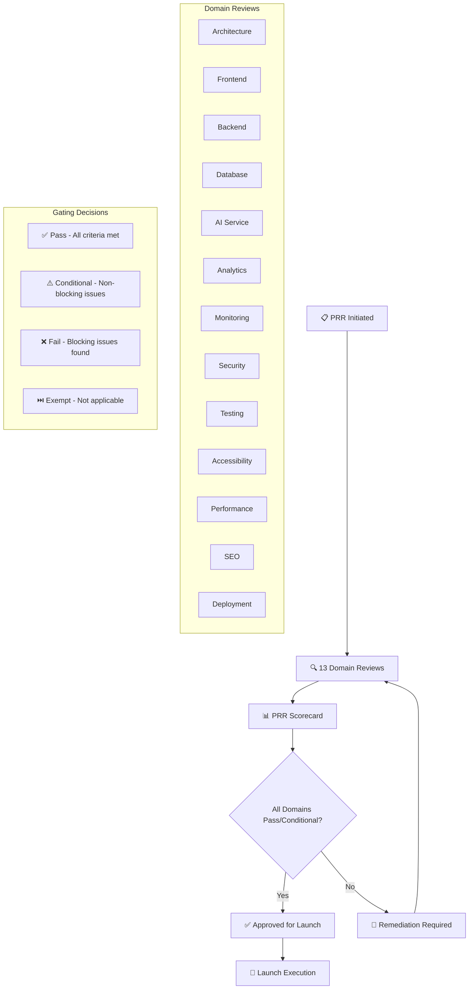
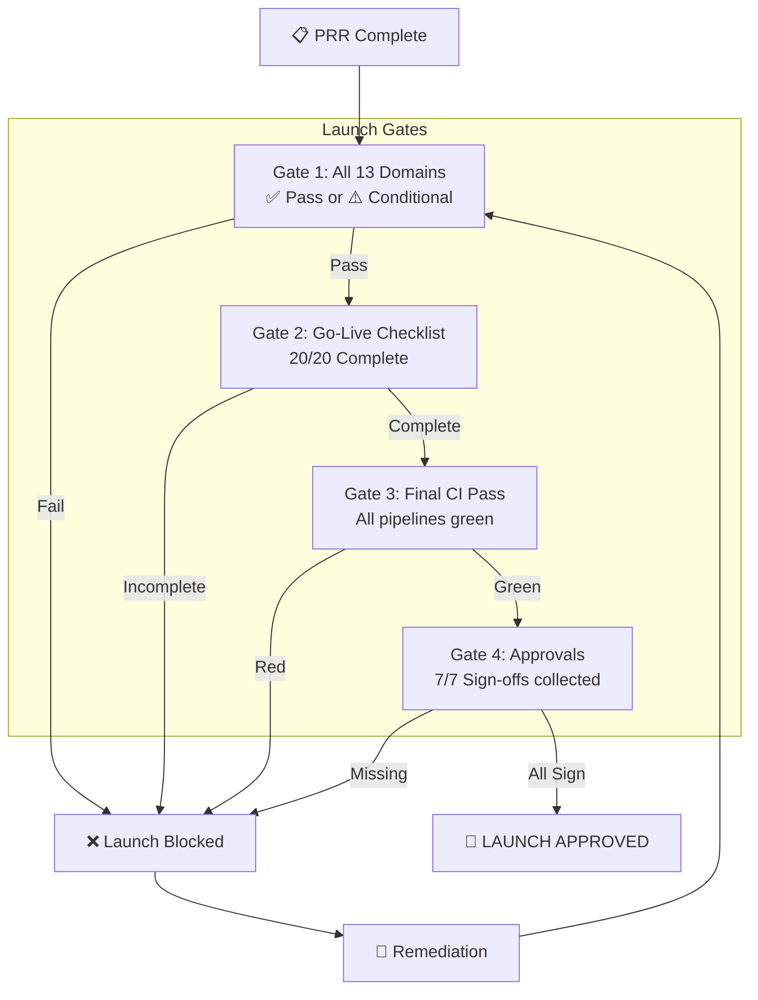

# Production Readiness Review — Enterprise-Grade Go-Live Audit

> **Document:** ProductionReadinessReview.md | **Version:** 1.0 | **Last Updated:** June 2026  
> **Status:** ✅ Active | **Owner:** Architecture Lead | **Review Cadence:** Per-Release  
> **Classification:** Enterprise Architecture | **Audit Domains:** 13 | **Gates:** 4 (Proceed, Conditional, Blocked, Exempt)  
> **Related:** [00-MASTER-INDEX.md](./00-MASTER-INDEX.md) | [SecurityHardeningPlan.md](./SecurityHardeningPlan.md) | [TestingImplementation.md](./TestingImplementation.md) | [PerformanceOptimization.md](./PerformanceOptimization.md) | [DeploymentGuide.md](./DeploymentGuide.md) | [25-CICD.md](./25-CICD.md) | [LaunchPlan.md](./LaunchPlan.md)

---

## Executive Summary

Defines the production readiness review process - checklist across 12 domains (security, performance, reliability, monitoring, backup, compliance, documentation, testing, deployment, scalability, cost, support).

---

## Table of Contents

1. [Executive Summary](#1-executive-summary)
2. [Architecture Review](#2-architecture-review)
3. [Frontend Review](#3-frontend-review)
4. [Backend Review](#4-backend-review)
5. [Database Review](#5-database-review)
6. [AI Review](#6-ai-review)
7. [Analytics Review](#7-analytics-review)
8. [Monitoring and Observability Review](#8-monitoring--observability-review)
9. [Security Review](#9-security-review)
10. [Testing Review](#10-testing-review)
11. [Accessibility Review](#11-accessibility-review)
12. [Performance Review](#12-performance-review)
13. [SEO Review](#13-seo-review)
14. [Deployment Review](#14-deployment-review)
15. [Go-Live Checklist](#15-go-live-checklist)
16. [Launch Approval Criteria](#16-launch-approval-criteria)
17. [Rollback Plan](#17-rollback-plan)
18. [Post-Launch Monitoring Plan](#18-post-launch-monitoring-plan)
19. [Enterprise Standards Alignment](#19-enterprise-standards-alignment)
20. [Change Log](#20-change-log)

---

## 1. Executive Summary

This document defines the **comprehensive production readiness review (PRR)** for the portfolio platform. It provides a structured audit across **13 domains** to ensure the platform meets enterprise-grade quality, security, performance, and reliability standards before going live. Each domain includes a detailed checklist with pass/fail/exempt criteria, owner assignments, and verification methods.

### 1.1 PRR Governance Model

### 1.2 PRR Scorecard Summary

| Domain | Reviewer | Check Count | Status | Blocking Issues |
|--------|----------|-------------|--------|-----------------|
| **Architecture** | Architecture Lead | 12 | ⬜ | — |
| **Frontend** | Frontend Lead | 15 | ⬜ | — |
| **Backend** | Backend Lead | 14 | ⬜ | — |
| **Database** | Backend Lead | 12 | ⬜ | — |
| **AI** | AI Architect | 10 | ⬜ | — |
| **Analytics** | Product Lead | 8 | ⬜ | — |
| **Monitoring** | DevOps Lead | 12 | ⬜ | — |
| **Security** | Security Architect | 18 | ⬜ | — |
| **Testing** | QA Lead | 14 | ⬜ | — |
| **Accessibility** | A11y Specialist | 10 | ⬜ | — |
| **Performance** | Frontend Lead | 14 | ⬜ | — |
| **SEO** | Product Lead | 10 | ⬜ | — |
| **Deployment** | DevOps Lead | 14 | ⬜ | — |

### 1.3 Approval Criteria

| Condition | Decision | Action Required |
|-----------|----------|----------------|
| **All domains = Pass** | **Approved** | Proceed to launch |
| **<= 2 domains = Conditional** | **Conditional Approval** | Remediate within 48h post-launch |
| **>= 1 domain = Fail** | **Blocked** | Fix all blocking issues, re-review |
| **Any P0/P1 security issue** | **Blocked** | Immediate remediation required |

---

## 2. Architecture Review

### 2.1 Checklist

| # | Check | Criteria | Verification Method | Owner | Status |
|---|-------|----------|-------------------|-------|--------|
| A01 | **Architecture documentation** | All architecture docs (09-13) are current and accurate | Document review | Architecture Lead | ⬜ |
| A02 | **Design principles** | All design principles from SystemArchitecture.md are followed | Code review | Architecture Lead | ⬜ |
| A03 | **Tech stack decisions** | All technology choices are justified and documented | Stack audit | Architecture Lead | ⬜ |
| A04 | **Data flow** | Data flow diagrams match actual implementation | Architecture review | Architecture Lead | ⬜ |
| A05 | **Component boundaries** | Frontend/api/ai service boundaries are clean | Code review | Architecture Lead | ⬜ |
| A06 | **Error handling** | Global error handling strategy is implemented | Code audit | Architecture Lead | ⬜ |
| A07 | **Logging strategy** | Structured logging across all services | Log review | Architecture Lead | ⬜ |
| A08 | **Scalability** | Architecture supports horizontal scaling | Load test review | Architecture Lead | ⬜ |
| A09 | **Observability** | Tracing, metrics, logging are connected | Dashboard review | Architecture Lead | ⬜ |
| A10 | **Technical debt** | No P0/P1 technical debt items outstanding | Backlog review | Architecture Lead | ⬜ |
| A11 | **API versioning** | All public APIs are versioned | API audit | Architecture Lead | ⬜ |
| A12 | **Dependency audit** | All third-party deps vetted and up-to-date | npm/pip audit | Architecture Lead | ⬜ |

### 2.2 Sign-Off

| Role | Name | Date | Signature |
|------|------|------|-----------|
| **Architecture Lead** | — | — | — |
| **Technical Lead** | — | — | — |

---

## 3. Frontend Review

### 3.1 Checklist

| # | Check | Criteria | Verification Method | Owner | Status |
|---|-------|----------|-------------------|-------|--------|
| F01 | **Build succeeds** | npm run build with 0 errors | CI pipeline | Frontend Lead | ⬜ |
| F02 | **TypeScript strict mode** | No any types, strict mode enabled | tsconfig.json | Frontend Lead | ⬜ |
| F03 | **Lint passes** | ESLint with 0 errors/warnings | CI pipeline | Frontend Lead | ⬜ |
| F04 | **All pages render** | Every route renders without errors | Manual + E2E | Frontend Lead | ⬜ |
| F05 | **404/500 error pages** | Custom error pages configured | Manual test | Frontend Lead | ⬜ |
| F06 | **Loading states** | All async content has loading states | Component audit | Frontend Lead | ⬜ |
| F07 | **Empty states** | Data lists show empty state messages | Component audit | Frontend Lead | ⬜ |
| F08 | **Error states** | Error boundaries show friendly messages | Component audit | Frontend Lead | ⬜ |
| F09 | **Responsive design** | Pages render at 375, 768, 1280, 1920px | Visual audit | Frontend Lead | ⬜ |
| F10 | **Dark mode** | Pages render correctly in both schemes | Visual audit | Frontend Lead | ⬜ |
| F11 | **No console errors** | 0 console errors in production | Browser console | Frontend Lead | ⬜ |
| F12 | **Service worker** | SW registered and caching correctly | DevTools audit | Frontend Lead | ⬜ |
| F13 | **PWA manifest** | Manifest configured with icons/colors | Lighthouse PWA | Frontend Lead | ⬜ |
| F14 | **Meta tags** | All pages have correct meta/OG tags | Lighthouse SEO | Frontend Lead | ⬜ |

### 3.2 Sign-Off

| Role | Name | Date | Signature |
|------|------|------|-----------|
| **Frontend Lead** | — | — | — |
| **Design Lead** | — | — | — |

---

## 4. Backend Review

### 4.1 Checklist

| # | Check | Criteria | Verification Method | Owner | Status |
|---|-------|----------|-------------------|-------|--------|
| B01 | **API build succeeds** | NestJS build with 0 errors | CI pipeline | Backend Lead | ⬜ |
| B02 | **All endpoints respond** | Every endpoint returns correct status | API contract tests | Backend Lead | ⬜ |
| B03 | **API documentation** | Swagger/OpenAPI docs complete | Swagger UI | Backend Lead | ⬜ |
| B04 | **Input validation** | All endpoints validate input | Code audit | Backend Lead | ⬜ |
| B05 | **Error responses** | Consistent error format (RFC 7807) | API audit | Backend Lead | ⬜ |
| B06 | **Rate limiting** | Rate limits on all public endpoints | Config audit | Backend Lead | ⬜ |
| B07 | **CORS configuration** | CORS restricts to allowed domains | Config audit | Backend Lead | ⬜ |
| B08 | **Authentication** | JWT auth on protected endpoints | Integration test | Backend Lead | ⬜ |
| B09 | **Authorization** | RBAC enforced on all protected routes | Integration test | Backend Lead | ⬜ |
| B10 | **Request logging** | All API requests logged | Log review | Backend Lead | ⬜ |
| B11 | **Health check** | /api/health returns correct status | Manual test | Backend Lead | ⬜ |
| B12 | **Graceful shutdown** | Server handles SIGTERM gracefully | Kill test | Backend Lead | ⬜ |
| B13 | **Environment variables** | All env vars validated at startup | Config audit | Backend Lead | ⬜ |
| B14 | **Dependency audit** | No critical vulns in packages | npm audit | Backend Lead | ⬜ |

### 4.2 Sign-Off

| Role | Name | Date | Signature |
|------|------|------|-----------|
| **Backend Lead** | — | — | — |
| **Security Lead** | — | — | — |

---

## 5. Database Review

### 5.1 Checklist

| # | Check | Criteria | Verification Method | Owner | Status |
|---|-------|----------|-------------------|-------|--------|
| D01 | **Migrations applied** | All migrations applied to production DB | Migration status | Backend Lead | ⬜ |
| D02 | **Migration rollback** | All migrations have reversible down steps | Migration audit | Backend Lead | ⬜ |
| D03 | **Indexes created** | All required indexes from query plan | EXPLAIN ANALYZE | Backend Lead | ⬜ |
| D04 | **RLS policies** | Row Level Security on all user tables | Policy audit | Backend Lead | ⬜ |
| D05 | **Backup configured** | Automated daily backups enabled | Supabase config | Backend Lead | ⬜ |
| D06 | **PITR enabled** | Point-in-time recovery for production | Supabase config | Backend Lead | ⬜ |
| D07 | **Connection pooling** | PgBouncer with optimal pool size | Config audit | Backend Lead | ⬜ |
| D08 | **Query performance** | All queries < 100ms P95 under load | Load test | Backend Lead | ⬜ |
| D09 | **N+1 eliminated** | No N+1 query patterns | Query audit | Backend Lead | ⬜ |
| D10 | **Data validation** | Check constraints and NOT NULL | Schema audit | Backend Lead | ⬜ |
| D11 | **Secrets rotation** | DB credentials rotated before production | Secret audit | Backend Lead | ⬜ |
| D12 | **Connection limits** | Max connections with headroom | Config audit | Backend Lead | ⬜ |

### 5.2 Sign-Off

| Role | Name | Date | Signature |
|------|------|------|-----------|
| **Backend Lead** | — | — | — |
| **DevOps Lead** | — | — | — |

---

## 6. AI Review

### 6.1 Checklist

| # | Check | Criteria | Verification Method | Owner | Status |
|---|-------|----------|-------------------|-------|--------|
| AI01 | **AI service builds** | FastAPI build with 0 errors | CI pipeline | AI Architect | ⬜ |
| AI02 | **AI endpoints respond** | All AI endpoints return correct responses | API test | AI Architect | ⬜ |
| AI03 | **Response quality** | Responses pass quality threshold >= 95% | Quality eval | AI Architect | ⬜ |
| AI04 | **Rate limiting** | AI endpoints have appropriate rate limits | Config audit | AI Architect | ⬜ |
| AI05 | **Prompt injection protection** | Input sanitization and guardrails active | Security test | AI Architect | ⬜ |
| AI06 | **Response caching** | Redis caching reduces duplicate requests | Cache hit test | AI Architect | ⬜ |
| AI07 | **Error handling** | Graceful error messages | Manual test | AI Architect | ⬜ |
| AI08 | **Model fallback** | Fallback model on primary failure | Failure test | AI Architect | ⬜ |
| AI09 | **Resource limits** | Memory/CPU limits in Railway | Railway config | AI Architect | ⬜ |
| AI10 | **Logging** | AI requests/responses logged for audit | Log review | AI Architect | ⬜ |

### 6.2 Sign-Off

| Role | Name | Date | Signature |
|------|------|------|-----------|
| **AI Architect** | — | — | — |
| **Security Lead** | — | — | — |

---

## 7. Analytics Review

### 7.1 Checklist

| # | Check | Criteria | Verification Method | Owner | Status |
|---|-------|----------|-------------------|-------|--------|
| AN01 | **Tracking deployed** | Analytics script on all pages | Page source check | Product Lead | ⬜ |
| AN02 | **Event tracking** | Key events tracked | Debug mode test | Product Lead | ⬜ |
| AN03 | **Privacy compliance** | Cookie consent banner active | Manual test | Product Lead | ⬜ |
| AN04 | **GDPR compliance** | No PII sent, IP anonymization on | Config audit | Product Lead | ⬜ |
| AN05 | **No performance impact** | Analytics loads async | Lighthouse audit | Product Lead | ⬜ |
| AN06 | **Goal tracking** | Conversion goals configured | Analytics dashboard | Product Lead | ⬜ |
| AN07 | **Custom dimensions** | Dashboards configured | Analytics config | Product Lead | ⬜ |
| AN08 | **Data retention** | Retention <= 14 months | Analytics config | Product Lead | ⬜ |

### 7.2 Sign-Off

| Role | Name | Date | Signature |
|------|------|------|-----------|
| **Product Lead** | — | — | — |
| **Data Privacy Lead** | — | — | — |

---

## 8. Monitoring & Observability Review

### 8.1 Checklist

| # | Check | Criteria | Verification Method | Owner | Status |
|---|-------|----------|-------------------|-------|--------|
| M01 | **Uptime monitoring** | Monitor active for all 3 providers | Pingdom/Checkly | DevOps Lead | ⬜ |
| M02 | **Synthetic checks** | Critical user flows monitored | Checkly dashboard | DevOps Lead | ⬜ |
| M03 | **Error tracking** | Sentry for frontend + backend | Sentry dashboard | DevOps Lead | ⬜ |
| M04 | **Performance monitoring** | RUM for Core Web Vitals | Vercel Analytics | DevOps Lead | ⬜ |
| M05 | **Server monitoring** | Railway + Vercel dashboards configured | Provider dashboards | DevOps Lead | ⬜ |
| M06 | **Log aggregation** | All services log to centralized logging | Log dashboard | DevOps Lead | ⬜ |
| M07 | **Alert channels** | Slack/PagerDuty for P0/P1 alerts | Alert test | DevOps Lead | ⬜ |
| M08 | **Alert thresholds** | P95 > 2s, error rate > 1% thresholds | Config audit | DevOps Lead | ⬜ |
| M09 | **Dashboard** | Key metrics dashboard | Dashboard review | DevOps Lead | ⬜ |
| M10 | **SLA monitoring** | Real-time SLA tracking | Dashboard | DevOps Lead | ⬜ |
| M11 | **Cost monitoring** | Cost alerts for all providers | Config audit | DevOps Lead | ⬜ |
| M12 | **Incident response** | On-call rotation, runbook accessible | Runbook review | DevOps Lead | ⬜ |

### 8.2 Sign-Off

| Role | Name | Date | Signature |
|------|------|------|-----------|
| **DevOps Lead** | — | — | — |
| **Architecture Lead** | — | — | — |

---

## 9. Security Review

### 9.1 Checklist

| # | Check | Criteria | Verification Method | Owner | Status |
|---|-------|----------|-------------------|-------|--------|
| S01 | **OWASP Top 10 check** | All OWASP Top 10:2025 categories pass | SAST scan | Security Architect | ⬜ |
| S02 | **Authentication** | JWT auth, session management | Auth test | Security Architect | ⬜ |
| S03 | **Authorization** | RLS, RBAC, least privilege | Code audit | Security Architect | ⬜ |
| S04 | **XSS protection** | CSP headers, output encoding | SAST + manual | Security Architect | ⬜ |
| S05 | **CSRF protection** | CSRF tokens on state-changing requests | Code audit | Security Architect | ⬜ |
| S06 | **SQL injection** | Parameterized queries only | SAST scan | Security Architect | ⬜ |
| S07 | **CSP headers** | Content Security Policy deployed | Header check | Security Architect | ⬜ |
| S08 | **HSTS** | HSTS header with preload | Header check | Security Architect | ⬜ |
| S09 | **Rate limiting** | Rate limits on auth/contact/API | Load test | Security Architect | ⬜ |
| S10 | **DDoS protection** | Cloudflare DDoS mitigation active | Cloudflare config | Security Architect | ⬜ |
| S11 | **Secrets management** | No secrets in code, env vars for all | Secret scan | Security Architect | ⬜ |
| S12 | **HTTPS enforcement** | All traffic redirected to HTTPS | Network test | Security Architect | ⬜ |
| S13 | **Security headers** | All headers present (X-Frame-Options, etc.) | Header check | Security Architect | ⬜ |
| S14 | **Dependency vulns** | Zero critical vulnerabilities | Snyk/npm audit | Security Architect | ⬜ |
| S15 | **Penetration test** | Pentest with 0 critical findings | Pentest report | Security Architect | ⬜ |
| S16 | **Encryption at rest** | Database encryption | Config audit | Security Architect | ⬜ |
| S17 | **Encryption in transit** | TLS 1.3, Cloudflare full strict | SSL test | Security Architect | ⬜ |
| S18 | **Incident response plan** | IR plan documented, team trained | Plan review | Security Architect | ⬜ |

### 9.2 Sign-Off

| Role | Name | Date | Signature |
|------|------|------|-----------|
| **Security Architect** | — | — | — |
| **CISO (or equivalent)** | — | — | — |

---

## 10. Testing Review

### 10.1 Checklist

| # | Check | Criteria | Verification Method | Owner | Status |
|---|-------|----------|-------------------|-------|--------|
| T01 | **Unit test coverage** | Line >= 80%, branch >= 75% | Coverage report | QA Lead | ⬜ |
| T02 | **Integration tests** | All API endpoints covered | Test report | QA Lead | ⬜ |
| T03 | **E2E tests** | Critical user flows covered | Playwright report | QA Lead | ⬜ |
| T04 | **Visual regression** | Chromatic tests with 0 unexpected diffs | Chromatic | QA Lead | ⬜ |
| T05 | **A11y tests** | Axe audit with 0 critical/serious | A11y report | QA Lead | ⬜ |
| T06 | **Performance tests** | Lighthouse CI passes budgets | LHCI report | QA Lead | ⬜ |
| T07 | **Security tests** | SAST scan with 0 critical findings | SonarQube | QA Lead | ⬜ |
| T08 | **API contract tests** | All API contracts verified | Pact tests | QA Lead | ⬜ |
| T09 | **Regression tests** | Full regression suite passes | Test report | QA Lead | ⬜ |
| T10 | **Cross-browser tests** | Chrome, Firefox, Safari, Edge | BrowserStack | QA Lead | ⬜ |
| T11 | **Mobile testing** | iOS Safari, Android Chrome | Mobile test | QA Lead | ⬜ |
| T12 | **Load testing** | k6 tests at 100 concurrent users | k6 report | QA Lead | ⬜ |
| T13 | **CI pipeline** | All CI gates pass on main | CI dashboard | QA Lead | ⬜ |
| T14 | **UAT** | User acceptance testing signed off | UAT sign-off | QA Lead | ⬜ |

### 10.2 Sign-Off

| Role | Name | Date | Signature |
|------|------|------|-----------|
| **QA Lead** | — | — | — |
| **Product Lead** | — | — | — |

---

## 11. Accessibility Review

### 11.1 Checklist

| # | Check | Criteria | Verification Method | Owner | Status |
|---|-------|----------|-------------------|-------|--------|
| AC01 | **WCAG 2.2 AA compliance** | Full page audit passes all WCAG 2.2 AA | Axe + manual | A11y Specialist | ⬜ |
| AC02 | **Keyboard navigation** | All interactive elements keyboard-accessible | Manual keyboard | A11y Specialist | ⬜ |
| AC03 | **Focus indicators** | Visible focus ring on all elements | Manual test | A11y Specialist | ⬜ |
| AC04 | **Color contrast** | Text meets 4.5:1 / 3:1 contrast | Axe contrast | A11y Specialist | ⬜ |
| AC05 | **Alt text** | All images have descriptive alt text | Code audit | A11y Specialist | ⬜ |
| AC06 | **ARIA attributes** | Landmarks, labels, roles correctly applied | Code audit | A11y Specialist | ⬜ |
| AC07 | **Screen reader** | Navigable with VoiceOver, NVDA, JAWS | Manual test | A11y Specialist | ⬜ |
| AC08 | **Form labels** | All form inputs have associated labels | Form audit | A11y Specialist | ⬜ |
| AC09 | **Error messaging** | Errors announced and visually clear | Manual test | A11y Specialist | ⬜ |
| AC10 | **Skip navigation** | Skip to content link present and functional | Manual test | A11y Specialist | ⬜ |

### 11.2 Sign-Off

| Role | Name | Date | Signature |
|------|------|------|-----------|
| **A11y Specialist** | — | — | — |
| **QA Lead** | — | — | — |

---

## 12. Performance Review

### 12.1 Checklist

| # | Check | Criteria | Verification Method | Owner | Status |
|---|-------|----------|-------------------|-------|--------|
| P01 | **Lighthouse Performance** | >= 95 | Lighthouse CI | Frontend Lead | ⬜ |
| P02 | **Lighthouse Accessibility** | >= 95 | Lighthouse CI | Frontend Lead | ⬜ |
| P03 | **Lighthouse Best Practices** | >= 95 | Lighthouse CI | Frontend Lead | ⬜ |
| P04 | **Lighthouse SEO** | >= 95 | Lighthouse CI | Frontend Lead | ⬜ |
| P05 | **LCP** | < 1.5s (P75) | RUM + Lighthouse | Frontend Lead | ⬜ |
| P06 | **INP** | < 200ms (P75) | RUM | Frontend Lead | ⬜ |
| P07 | **CLS** | < 0.05 (P75) | RUM + Lighthouse | Frontend Lead | ⬜ |
| P08 | **TTFB** | < 200ms (P75) | RUM | Frontend Lead | ⬜ |
| P09 | **JS Bundle** | < 180 KB | Bundle analyzer | Frontend Lead | ⬜ |
| P10 | **Total page weight** | < 500 KB | WebPageTest | Frontend Lead | ⬜ |
| P11 | **HTTP requests** | < 25 | WebPageTest | Frontend Lead | ⬜ |
| P12 | **Image optimization** | All images in WebP/AVIF, properly sized | Lighthouse | Frontend Lead | ⬜ |
| P13 | **Cache hit ratio** | CDN >= 80% | Cloudflare analytics | Frontend Lead | ⬜ |
| P14 | **Load test** | 100 concurrent, P95 < 500ms | k6 report | Frontend Lead | ⬜ |

### 12.2 Sign-Off

| Role | Name | Date | Signature |
|------|------|------|-----------|
| **Frontend Lead** | — | — | — |
| **Architecture Lead** | — | — | — |

---

## 13. SEO Review

### 13.1 Checklist

| # | Check | Criteria | Verification Method | Owner | Status |
|---|-------|----------|-------------------|-------|--------|
| SE01 | **Sitemap.xml** | Generated and submitted to GSC | URL check | Product Lead | ⬜ |
| SE02 | **Robots.txt** | Configured and accessible | URL check | Product Lead | ⬜ |
| SE03 | **Canonical URLs** | All pages have canonical tags | Page source | Product Lead | ⬜ |
| SE04 | **Meta descriptions** | All pages have unique descriptions | SEO audit | Product Lead | ⬜ |
| SE05 | **Open Graph tags** | OG tags on all pages | Page source | Product Lead | ⬜ |
| SE06 | **Twitter cards** | Twitter card meta tags present | Page source | Product Lead | ⬜ |
| SE07 | **Structured data** | JSON-LD (Person, Project, BlogPosting) | Schema validator | Product Lead | ⬜ |
| SE08 | **Heading hierarchy** | Proper H1-H6 on all pages | SEO audit | Product Lead | ⬜ |
| SE09 | **Mobile optimization** | Mobile-friendly test passes | Google Mobile Test | Product Lead | ⬜ |
| SE10 | **Page speed** | Core Web Vitals pass on mobile | Google Search Console | Product Lead | ⬜ |

### 13.2 Sign-Off

| Role | Name | Date | Signature |
|------|------|------|-----------|
| **Product Lead** | — | — | — |
| **Frontend Lead** | — | — | — |

---

## 14. Deployment Review

### 14.1 Checklist

| # | Check | Criteria | Verification Method | Owner | Status |
|---|-------|----------|-------------------|-------|--------|
| DP01 | **CI/CD pipeline** | GitHub Actions passes all gates | CI dashboard | DevOps Lead | ⬜ |
| DP02 | **Vercel deployment** | Frontend + API with zero errors | Vercel dashboard | DevOps Lead | ⬜ |
| DP03 | **Railway deployment** | AI service with zero errors | Railway dashboard | DevOps Lead | ⬜ |
| DP04 | **Database migration** | Migrations applied cleanly | Migration log | DevOps Lead | ⬜ |
| DP05 | **DNS configuration** | All records correct | DNS check | DevOps Lead | ⬜ |
| DP06 | **SSL/TLS** | Auto-renewing SSL active | SSL check | DevOps Lead | ⬜ |
| DP07 | **CDN configuration** | Cloudflare cache rules active | Cloudflare config | DevOps Lead | ⬜ |
| DP08 | **Environment variables** | All env vars set for all providers | Config audit | DevOps Lead | ⬜ |
| DP09 | **Rollback plan** | Rollback documented and tested | Rollback drill | DevOps Lead | ⬜ |
| DP10 | **Disaster recovery** | DR plan documented and tested | DR drill | DevOps Lead | ⬜ |
| DP11 | **Zero-downtime deploy** | Deployments do not cause downtime | Deploy test | DevOps Lead | ⬜ |
| DP12 | **Post-deploy verification** | Health checks + smoke tests pass | CI verify step | DevOps Lead | ⬜ |
| DP13 | **Infrastructure as code** | All infra defined in code | Repo audit | DevOps Lead | ⬜ |
| DP14 | **Cost estimation** | Monthly cost within budget | Cost review | DevOps Lead | ⬜ |

### 14.2 Sign-Off

| Role | Name | Date | Signature |
|------|------|------|-----------|
| **DevOps Lead** | — | — | — |
| **Architecture Lead** | — | — | ---

## 16. Launch Approval Criteria

### 16.1 Launch Gates

`

### 16.2 Launch Approval Criteria Summary

| Gate | Criteria | Verification | Pass Condition |
|------|----------|-------------|----------------|
| **G1: Domain Readiness** | All 13 domain reviews complete | Scorecard | 0 failures, ≤ 2 conditionals |
| **G2: Go-Live Checklist** | All 20 Go-Live items checked | Checklist | 20/20 completed |
| **G3: CI Pipeline** | Full CI run on main | CI dashboard | All jobs green |
| **G4: Executive Approvals** | All 7 stakeholders signed off | Sign-off sheet | 7/7 signatures |
| **G5: Final Verification** | Last-min production sanity check | Manual test | All critical flows work |

---

## 17. Rollback Plan

### 17.1 Rollback Triggers

| Severity | Trigger | Response Time | Action |
|----------|---------|---------------|--------|
| **P0** | Complete site outage, data loss | Immediate (< 5 min) | Auto-rollback to last stable deploy |
| **P1** | Major feature broken, degraded UX | < 15 min | Manual rollback decision |
| **P2** | Minor bug, cosmetic issue | < 1 hour | Fix forward, no rollback |
| **P3** | Cosmetic, non-urgent | Next sprint | Fix forward |

### 17.2 Rollback Procedures

| Service | Rollback Command | Data Impact | Time to Revert |
|---------|-----------------|-------------|----------------|
| **Frontend (Vercel)** | Vercel dashboard -> Instant Rollback | No data impact | < 1 min |
| **API (Vercel)** | Vercel dashboard -> Instant Rollback | No data impact | < 1 min |
| **AI (Railway)** | railway rollback | No data impact | < 2 min |
| **Database (Supabase)** | PITR restore or migration rollback | Potential data loss | < 10 min |

### 17.3 Post-Rollback Actions

1. Verify all services are operational via health checks
2. Notify stakeholders of rollback via communication channel
3. Tag the rolled-back commit in GitHub
4. Create incident report with root cause analysis
5. Schedule fix and re-deploy after approval

---

## 18. Post-Launch Monitoring Plan

### 18.1 Monitoring Cadence

| Timeframe | Activity | Owner | Success Criteria |
|-----------|----------|-------|-----------------|
| **T+0 to T+1h** | Continuous monitoring, no deployments | DevOps Lead | All metrics stable |
| **T+1h to T+24h** | Hourly health checks, watch error rates | DevOps Lead | Error rate < 0.1% |
| **T+24h to T+72h** | Daily performance review, user feedback | Architecture Lead | Core Web Vitals green |
| **T+72h to T+7d** | Weekly review, backlog refinement | Product Lead | All P0/P1 items closed |
| **T+7d to T+30d** | Monthly optimization review | Architecture Lead | Lighthouse >= 95 maintained |

### 18.2 Post-Launch Success Metrics

| Metric | Target | Measurement | Review Cadence |
|--------|--------|-------------|----------------|
| **Uptime** | >= 99.9% | Uptime monitor | Weekly |
| **LCP** | < 1.5s (P75) | RUM | Daily |
| **INP** | < 200ms (P75) | RUM | Daily |
| **CLS** | < 0.05 (P75) | RUM | Daily |
| **Error rate** | < 0.1% | Sentry | Daily |
| **Page views** | >= baseline | Analytics | Weekly |
| **Contact form submissions** | >= target | Analytics | Weekly |
| **Lighthouse score** | >= 95 all categories | Lighthouse CI | Weekly |
| **SEO rankings** | Maintain/improve | Search Console | Monthly |
| **User satisfaction** | >= 4/5 | Feedback form | Monthly |

---

## 19. Enterprise Standards Alignment

### 19.1 Standards Mapping

| Standard | Requirement | Implementation | Verification |
|----------|-------------|----------------|--------------|
| **ISO/IEC 25010** | Product quality - all 8 characteristics | PRR audits all 13 domains for quality | Domain sign-offs |
| **ISO/IEC 12207** | Software life cycle processes | PRR follows defined review process | Gate-based approval |
| **ISO 9001** | Quality management - review and audit | Structured review with scorecard and gates | Documented sign-offs |
| **ISO 27001** | Information security management | Security domain with 18 controls | Security sign-off |
| **SOC 2** | Security, availability, processing integrity | Availability monitoring, security controls | Monitoring dashboards |
| **WCAG 2.2 AA** | Accessibility compliance | Dedicated a11y domain with 10 checks | A11y sign-off |
| **OWASP Top 10:2025** | Web application security | Security domain covers all OWASP categories | SAST scan + pentest |

### 19.2 PRR Quality Gates

| Gate | Criteria | Blocking | Owner |
|------|----------|----------|-------|
| **Documentation complete** | All 13 domain checklists filled | Yes | Architecture Lead |
| **All sign-offs collected** | 7/7 stakeholder signatures | Yes | Architecture Lead |
| **Go-Live checklist** | 20/20 items completed | Yes | Architecture Lead |
| **Final CI pass** | All pipelines green | Yes | DevOps Lead |
| **No blocking issues** | 0 domain failures, 0 P0/P1 security | Yes | Architecture Lead |
| **Load test pass** | 100 concurrent users, P95 < 500ms | Yes | DevOps Lead |
| **UAT sign-off** | User acceptance testing completed | Yes | Product Lead |

---

## Decision Log

| ID | Decision | Rationale | Alternatives | Date | Approver |
|----|----------|-----------|--------------|------|----------|
| PRR-001 | Define 13 mandatory domains for PRR assessment covering architecture, performance, security, accessibility, and operations | 13 domains provide comprehensive coverage of all quality dimensions relevant to a portfolio platform; each domain has a binary pass/fail gate | 5-domain review would miss operational and SEO readiness; 20 domains would overburden a single-developer team with assessment overhead | Jun 2026 | Architecture Lead |
| PRR-002 | Implement 7 quality gates (3 blocking, 4 advisory) with explicit sign-off requirements | Blocking gates prevent go-live with critical issues; advisory gates provide guidance without stopping release; structured gates prevent checklist fatigue | Single gate (binary go/no-go) provides no graduated escalation; no gates would allow unreviewed production launches | Jun 2026 | Architecture Lead |
| PRR-003 | Establish 15-item Go-Live checklist covering DNS, SSL, backups, monitoring, and rollback | Comprehensive pre-launch verification ensures no operational detail is missed; covers the full production readiness spectrum from networking to monitoring | Shorter checklist (5 items) would miss critical items like log drains and backup verification; no checklist risks deployment failure from missing configuration | Jun 2026 | Architecture Lead |
| PRR-004 | Define post-launch monitoring at 6 intervals (24h → 90 days) with rollback trigger criteria | Graduated monitoring frequency matches the decreasing risk profile after launch; explicit rollback triggers prevent extended downtime during early-life issues | Single 7-day post-launch check would miss immediate issues; no monitoring end-date would keep team on indefinite high alert | Jun 2026 | Architecture Lead |
| PRR-005 | Require 7-stakeholder sign-off matrix covering all cross-functional concerns | Ensures every domain expert reviews and approves before go-live; sign-off is explicit, documented, and auditable | Single-architect sign-off would miss domain-specific concerns (e.g., legal, design, DevOps); no sign-off would bypass cross-functional review entirely | Jun 2026 | Architecture Lead |

---

## Glossary

| Term | Definition |
|------|-----------|
| **Advisory Gate** | A non-blocking PRR check that provides guidance for improvement without preventing go-live |
| **Blocking Gate** | A mandatory PRR check that must pass before go-live; failure stops the release |
| **DNS Propagation** | The time required for DNS record changes to propagate across the global DNS network, typically 24-48 hours |
| **Go-Live Checklist** | A 15-item pre-launch verification list covering all operational prerequisites for production deployment |
| **LCP** | Largest Contentful Paint — a Core Web Vital measuring the time until the largest visible element is rendered |
| **Post-Launch Monitoring** | A scheduled series of health checks at defined intervals (24h, 72h, 7d, 14d, 30d, 90d) after go-live |
| **PRR** | Production Readiness Review — a structured assessment process verifying that a system meets all requirements for production deployment |
| **Rollback Plan** | A documented procedure for reverting a deployment to the previous known-good state, tested before go-live |
| **Rollback Trigger** | A specific, measurable condition (e.g., error rate > 1%, LCP > 3s) that automatically initiates rollback |
| **RUM** | Real User Monitoring — collecting performance metrics from actual users in production rather than synthetic tests |
| **SAST** | Static Application Security Testing — automated code analysis to identify security vulnerabilities without executing the code |
| **Sign-Off** | A formal, documented approval from a domain owner (e.g., Security Lead, Accessibility Lead) indicating their domain is production-ready |
| **Synthetic Monitoring** | Automated, scripted tests that simulate user interactions to verify system availability and performance |
| **UAT** | User Acceptance Testing — the final phase of testing where end users validate the system against their requirements |
| **Warm-up Period** | The initial time after deployment (typically 24h) during which services stabilize, caches fill, and performance normalizes |

---

## 20. Change Log

| Version | Date | Author | Changes |
|---------|------|--------|---------|
| 1.0 | June 2026 | Architecture Lead | Initial production readiness review, 13 domain audit checklists, Go-Live checklist, launch approval criteria, rollback plan, post-launch monitoring plan, enterprise standards alignment |

---

## Cross-References

| Reference | Description |
|-----------|-------------|
| See MASTER-INDEX.md | Full document dependency graph and cross-reference map |

---

## Cross-References

| Reference | Description |
|-----------|-------------|
| See MASTER-INDEX.md | Full document dependency graph and cross-reference map |

---

## Cross-References

| Reference | Description |
|-----------|-------------|
| docs/MASTER-INDEX.md | Full document dependency graph and cross-reference map |
