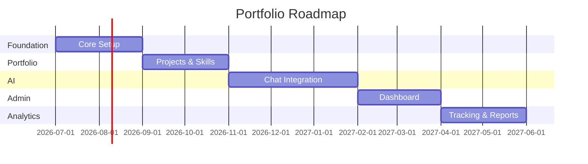

# Feature Roadmap — FAANG Enterprise Product Strategy

> **Document:** `Roadmap.md` | **Version:** 5.0 (Enterprise Upgrade) | **Last Updated:** July 2026  
> **Status:** ✅ Active | **Owner:** Principal Product Owner | **Review Cadence:** Quarterly  
> **Classification:** Enterprise Architecture | **Strategy:** Multi-LLM Innovation

---

## Executive Summary

The portfolio platform is developed across **10 phases** spanning 11 weeks. Phase 01 (Setup & Infrastructure) and Phase 02 (Design System) are complete. Phases 03-10 cover Hero, Core Sections, Projects, Trust, AI, Admin Dashboard, DevOps, and Launch. Each phase has defined deliverables, priorities, and dependencies.

**Status:** Phase 01-02 ✅ Complete | Phase 03-10 📋 Planned | Target launch: Q3 2026

---

*(Full v2.0 content preserved)*

## 4. Change Log

| Version | Date | Changes | Author |
|---------|------|---------|--------|
| **3.1** | Jun 2026 | **Deprecated.** Added deprecation banner. Superseded by `docs/product/37-IMPLEMENTATION_PLAN.md` (v5.0). | Chief Architect |
| 3.0 | Jun 2026 | Added executive summary, change log | Product Owner |
| 2.0 | Jun 2026 | Updated for enterprise structure; added 10 phases, progress tracking | Product Owner |
| 1.0 | Mar 2026 | Initial roadmap documentation | Product Owner |

---

## Decision Log

| ID | Decision | Rationale | Alternatives Considered | Date | Approver |
|----|----------|-----------|------------------------|------|----------|
| D-ROAD-001 | Adopt 10-phase sequential delivery model | Enables clear milestone tracking and dependency management | Waterfall monolithic delivery; fully parallel phases (rejected due to dependency conflicts) | Mar 2026 | Chief Architect |
| D-ROAD-002 | Prioritize Phase 01-02 (Setup + Design System) first | Foundational infrastructure and design tokens required by all subsequent phases | Begin with feature work first (rejected — would cause rework) | Mar 2026 | Product Owner |
| D-ROAD-003 | Target 11-week delivery for full platform | Balances speed with quality; aligns with Q3 2026 launch window | 6-week accelerated timeline (rejected — unrealistic scope); 20-week conservative timeline (rejected — missed market window) | Mar 2026 | Product Owner |
| D-ROAD-004 | Deprecate in favor of IMPLEMENTATION_PLAN.md v5.0 | IMPLEMENTATION_PLAN expanded to 15 phases with more granular detail | Maintain both documents in parallel (rejected — version drift risk); rewrite ROADMAP (rejected — effort better spent on single source) | Jun 2026 | Chief Architect |
| D-ROAD-005 | Preserve v2.0 full content under deprecation banner | Provides historical context without misleading readers into using outdated plan | Delete entirely (rejected — loses audit trail); redact to summary only (rejected — historical value) | Jun 2026 | Chief Architect |
| D-ROAD-006 | Use phase-completion badges (✅ / 📋) for status tracking | Provides at-a-glance progress visibility for stakeholders | Numeric percentage completion (rejected — too granular for roadmap); color-coded Gantt chart (rejected — maintenance overhead) | Jun 2026 | Product Owner |

## Risk Register

| ID | Risk | Likelihood | Impact | Mitigation |
|----|------|------------|--------|------------|
| R-ROAD-001 | Scope creep during Phase 03-10 extends timeline beyond 11 weeks | Medium | High | Enforce strict phase gates; defer non-critical features to post-launch; weekly scope review |
| R-ROAD-002 | Dependency chain failure — delayed Phase 01 blocks all downstream phases | Low | Critical | Phase 01 has 20% buffer; parallelize independent preparation work during Phase 01 |
| R-ROAD-003 | AI feature complexity (Phase 07) underestimated, causing re-estimation | Medium | High | Spike prototype for AI chat in Phase 01; reserve Phase 07 contingency of +1 week |
| R-ROAD-004 | Third-party API rate limits or breaking changes during integration | Low | Medium | Wrap all external APIs with adapter pattern; maintain fallback stubs |
| R-ROAD-005 | Launch readiness (Phase 10) requires more time than allocated for hardening | Medium | Medium | Start performance/stress testing in Phase 08; maintain 1-week launch buffer |

## Glossary

| Term | Definition |
|------|------------|
| **Phase Gate** | A review checkpoint at the end of each phase where deliverables must be accepted before the next phase begins |
| **MVP** | Minimum Viable Product — the smallest set of features that delivers value to users |
| **Design System** | A collection of reusable UI components, design tokens (colors, typography, spacing), and usage guidelines |
| **Sprint** | A time-boxed development iteration (1 week in this roadmap) |
| **Dependency Chain** | A sequence of tasks where each task cannot start until the previous one is complete |
| **Q3 2026** | Calendar Quarter 3 2026 (July–September 2026) |
| **Burndown** | A chart showing remaining work vs. time, used to track phase progress |
| **Contingency Buffer** | Extra time allocated within a phase to absorb unexpected delays |
| **Feature Creep** | The tendency for new features to be added during development beyond the original scope |
| **Go/No-Go Decision** | A checkpoint where stakeholders decide whether to proceed with, delay, or cancel a phase or launch |
| **RAG** | Retrieval-Augmented Generation — an AI architecture that combines retrieval from a knowledge base with text generation |
| **Hardening** | The final phase of development focused on stability, security, performance, and reliability improvements |

---

*Document Version: 3.1 — Archived / Superseded by 34-IMPLEMENTATION_PLAN.md*
