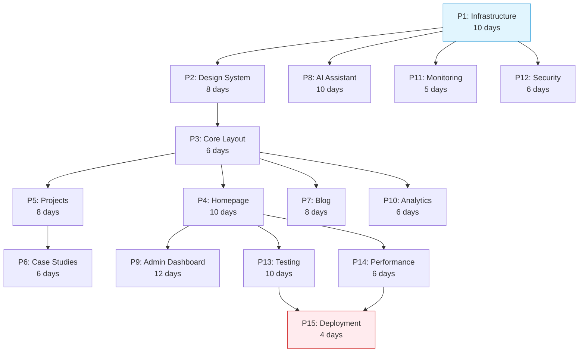

# 🏗️ Enterprise Implementation Plan — Portfolio Platform

> **Status:** 📋 Pending Approval | **Created:** June 2026
> **Source:** Comprehensive analysis of 77+ documentation files + live codebase audit
> **Estimated Effort:** 12–18 weeks (single developer) | **Critical Path:** 14 weeks
> **Role:** Principal Product/Frontend/Backend/Architect/Database/Security/AI/DevOps/QA/Accessibility/Performance Engineer

---

## Pre-Implementation Analysis

### Feature Overview

The Portfolio Platform is an enterprise-grade, three-tier personal portfolio with:

- **25+ animated sections** with ISR (60s) on a Next.js 14 frontend
- **NestJS 10 REST API** with 74 endpoints across 17 groups
- **FastAPI AI microservice** with RAG pipeline, chat (SSE), content analysis
- **Admin CMS** with drag-drop reorder, rich-text editing, lead management
- **Zero-cost infrastructure** (~$10/year) via Vercel + Supabase + PostHog free tiers

### Business Goal

Drive _Qualified Professional Connections Generated_ (NSM) — turn portfolio visitors into real-world professional outcomes (interviews, contract inquiries, collaborations).

### User Goal

- **Recruiters (Sarah):** Assess candidate in < 60 seconds — fast load, clear skills, easy contact
- **Clients (Marcus):** See authentic case studies with business impact, submit inquiry
- **Admin (Alex):** Update content without code, manage leads, view analytics
- **Contributors (Jordan):** Clone → Run → Contribute via clear docs

### Technical Goal

- Lighthouse ≥ 95 all categories
- WCAG 2.2 AA compliant
- OWASP Top 10:2025 hardened
- 90%+ test coverage
- Sub-2s global page loads

---

## Current State Assessment

### What Exists (✅ Real Code)

| Component                 | Status              | Files                                                                                                                                                                                | Quality                                                  |
| ------------------------- | ------------------- | ------------------------------------------------------------------------------------------------------------------------------------------------------------------------------------ | -------------------------------------------------------- |
| **Monorepo structure**    | ✅ Complete         | `turbo.json`, `package.json`, workspaces                                                                                                                                             | Production-ready                                         |
| **Design tokens**         | ✅ Complete         | [globals.css](file:///c:/PROJECTS/My Portfolio/Portfolio/apps/web/src/styles/globals.css)                                                                                            | 120+ CSS vars, light/dark themes                         |
| **Tailwind config**       | ✅ Complete         | `tailwind.config.ts`                                                                                                                                                                 | Design token extensions                                  |
| **Root layout**           | ✅ Complete         | [layout.tsx](file:///c:/PROJECTS/My Portfolio/Portfolio/apps/web/src/app/layout.tsx)                                                                                                 | ThemeProvider, Navbar, Footer, SkipLink, no-flash script |
| **Navbar**                | ✅ Complete         | [Navbar.tsx](file:///c:/PROJECTS/My Portfolio/Portfolio/apps/web/src/components/layout/Navbar.tsx) (7.2KB)                                                                           | Sticky, responsive                                       |
| **Footer**                | ✅ Complete         | [Footer.tsx](file:///c:/PROJECTS/My Portfolio/Portfolio/apps/web/src/components/layout/Footer.tsx) (5.2KB)                                                                           | Social links, back-to-top                                |
| **Theme system**          | ✅ Complete         | `ThemeProvider.tsx`, `ThemeToggle.tsx`                                                                                                                                               | System pref → localStorage → toggle                      |
| **Homepage page**         | ✅ Complete         | [page.tsx](file:///c:/PROJECTS/My Portfolio/Portfolio/apps/web/src/app/page.tsx)                                                                                                     | Composes all 10 sections                                 |
| **10 section components** | ⚠️ Partial          | [Hero](file:///c:/PROJECTS/My Portfolio/Portfolio/apps/web/src/components/sections/Hero.tsx), About, Skills, Experience, Projects, Services, Testimonials, BlogPreview, FAQ, Contact | **All use hardcoded data** — not API-connected           |
| **`useInView` hook**      | ✅ Complete         | [useInView.ts](file:///c:/PROJECTS/My Portfolio/Portfolio/apps/web/src/hooks/useInView.ts)                                                                                           | IntersectionObserver, one-shot                           |
| **`cn()` utility**        | ✅ Complete         | `packages/ui/src/cn.ts`                                                                                                                                                              | clsx + tailwind-merge                                    |
| **Base UI components**    | ⚠️ Minimal          | Button, Card, Input in `packages/ui`                                                                                                                                                 | Hardcoded colors, need token refactor                    |
| **NestJS bootstrap**      | ✅ Complete         | [main.ts](file:///c:/PROJECTS/My Portfolio/Portfolio/apps/api/src/main.ts)                                                                                                           | CORS, ValidationPipe, Swagger, prefix                    |
| **API module structure**  | ✅ Scaffolded       | 7 modules: auth, sections, projects, skills, leads, analytics, admin-activities                                                                                                      | **Placeholder stubs only**                               |
| **AI service structure**  | ✅ Scaffolded       | `apps/ai/app/`                                                                                                                                                                       | **Placeholder stubs only**                               |
| **Documentation**         | ✅ Enterprise-grade | 77 files, 3.5MB total                                                                                                                                                                | Comprehensive specs for everything                       |

### Critical Gaps (Must Fix)

| #       | Gap                                      | Impact                         | Phase  |
| ------- | ---------------------------------------- | ------------------------------ | ------ |
| **G1**  | All 10 sections use hardcoded mock data  | No dynamic content, no CMS     | P4     |
| **G2**  | No Supabase connection/client configured | No data persistence            | P1     |
| **G3**  | No database migrations/schema applied    | No tables exist                | P1     |
| **G4**  | All API modules are placeholder stubs    | No backend functionality       | P1, P5 |
| **G5**  | No authentication implemented            | No admin access                | P9     |
| **G6**  | No AI service implementation             | No chatbot/analysis            | P8     |
| **G7**  | No admin dashboard pages                 | No CMS for content             | P9     |
| **G8**  | No test infrastructure                   | Regression risk                | P13    |
| **G9**  | No security headers (HSTS, CSP)          | OWASP non-compliance           | P12    |
| **G10** | No rate limiting                         | Abuse risk                     | P12    |
| **G11** | No analytics tracking                    | No user insights               | P10    |
| **G12** | No error tracking (Sentry)               | Silent failures                | P11    |
| **G13** | No CI/CD pipeline                        | Manual deployment              | P15    |
| **G14** | TypeScript typecheck fails               | All placeholders cause TS1127  | P1     |
| **G15** | 3D hero background not implemented       | Missing visual differentiation | P4     |

---

## Dependencies



### Critical Path

```
P1 (10d) → P2 (8d) → P3 (6d) → P4 (10d) → P9 (12d) → P13 (10d) → P15 (4d)
= 60 working days = 12 weeks minimum
```

### Parallel Tracks

| Track        | Phases                             | Can Start After |
| ------------ | ---------------------------------- | --------------- |
| **Critical** | P1 → P2 → P3 → P4 → P9 → P13 → P15 | —               |
| **Track A**  | P5 → P6                            | P3 complete     |
| **Track B**  | P7                                 | P3 complete     |
| **Track C**  | P8, P11, P12                       | P1 complete     |
| **Track D**  | P10, P14                           | P3/P4 complete  |

---

## Impacted Systems

| System                   | Impact      | Changes Required                                                                    |
| ------------------------ | ----------- | ----------------------------------------------------------------------------------- |
| **Frontend (Next.js)**   | 🔴 Major    | Replace all hardcoded data with API fetches; add ISR; add 3D hero; add admin routes |
| **Backend API (NestJS)** | 🔴 Major    | Implement all 7 modules from stubs; add auth, rate limiting, Swagger                |
| **AI Service (FastAPI)** | 🔴 Major    | Implement RAG pipeline, SSE chat, content analysis from stubs                       |
| **Database (Supabase)**  | 🔴 Major    | Create 37 tables, RLS policies, 50+ indexes, seed data                              |
| **Design System**        | 🟡 Moderate | Refactor hardcoded colors to tokens; add 7 new components                           |
| **CI/CD**                | 🔴 Major    | Create entire pipeline from scratch                                                 |
| **Integrations**         | 🔴 Major    | Configure 13 external services (Supabase, PostHog, Sentry, OpenAI, etc.)            |

---

## Security Requirements

Per [SecurityArchitecture.md](file:///c:/PROJECTS/My Portfolio/Portfolio/docs/security/SecurityArchitecture.md) and [SecurityHardeningPlan.md](file:///c:/PROJECTS/My Portfolio/Portfolio/docs/security/SecurityHardeningPlan.md):

| Requirement       | Standard              | Implementation                                                         |
| ----------------- | --------------------- | ---------------------------------------------------------------------- |
| OWASP Top 10:2025 | Full compliance       | A01–A10 controls across all tiers                                      |
| Authentication    | JWT + OAuth           | 15-min access token, 7-day refresh, bcrypt 12 rounds                   |
| Authorization     | RLS + RBAC            | Supabase RLS on all 37 tables; admin role guard                        |
| Rate limiting     | 6 tiers               | Auth: 5/15min, Contact: 10/15min, Public: 100/15min, Admin: 1000/15min |
| Security headers  | A+ grade              | HSTS, CSP, XFO, X-Content-Type-Options, Referrer-Policy                |
| Input validation  | Zod + class-validator | Client (Zod) + Server (class-validator DTOs)                           |
| Audit logging     | Structured JSON       | Correlation IDs, 30-day retention                                      |
| Secrets           | Environment vars      | Never client-exposed; `.env.example` template                          |

---

## Testing Requirements

Per [TestingArchitecture.md](file:///c:/PROJECTS/My Portfolio/Portfolio/docs/quality/TestingArchitecture.md) and [52-TESTING-STRATEGY.md](file:///c:/PROJECTS/My Portfolio/Portfolio/docs/quality/52-TESTING-STRATEGY.md):

| Test Type         | Framework                      | Target Coverage     | Count      |
| ----------------- | ------------------------------ | ------------------- | ---------- |
| **Unit**          | Vitest + React Testing Library | 80%+                | ~150 tests |
| **Integration**   | Vitest + MSW                   | 70%+                | ~30 tests  |
| **E2E**           | Playwright (5 browsers)        | 10 critical flows   | ~10 specs  |
| **Accessibility** | jest-axe + Lighthouse          | 0 violations        | All pages  |
| **Performance**   | Lighthouse CI                  | ≥ 95 all categories | Every PR   |
| **Security**      | npm audit + OWASP self-assess  | 0 high/critical     | Weekly     |

---

## Accessibility Requirements

Per [AccessibilityArchitecture.md](file:///c:/PROJECTS/My Portfolio/Portfolio/docs/quality/AccessibilityArchitecture.md):

| Criterion           | Target                     | Implementation                                    |
| ------------------- | -------------------------- | ------------------------------------------------- |
| WCAG 2.2 AA         | 35/35 criteria             | Full compliance                                   |
| Keyboard navigation | 100% functions             | Tab, Enter, Escape handlers                       |
| Screen readers      | 6-reader compat            | ARIA, live regions, semantic HTML                 |
| Color contrast      | ≥ 4.5:1 small, ≥ 3:1 large | Token pairs verified                              |
| Reduced motion      | `prefers-reduced-motion`   | CSS + JS implementations (already in globals.css) |
| Focus management    | Visible 2px ring           | Already implemented in globals.css                |
| Touch targets       | ≥ 24×24px                  | All interactive elements                          |
| Skip link           | Present                    | Already implemented in layout                     |

---

## Performance Requirements

Per [PerformanceArchitecture.md](file:///c:/PROJECTS/My Portfolio/Portfolio/docs/quality/PerformanceArchitecture.md) and [PerformanceOptimization.md](file:///c:/PROJECTS/My Portfolio/Portfolio/docs/quality/PerformanceOptimization.md):

| Metric     | Target   | Strategy                                                 |
| ---------- | -------- | -------------------------------------------------------- |
| LCP        | < 1.5s   | ISR + CDN + critical CSS                                 |
| CLS        | < 0.05   | Explicit image dimensions, font swap                     |
| INP        | < 200ms  | Event delegation, debouncing                             |
| TTFB       | < 200ms  | Vercel Edge, ISR cache                                   |
| Initial JS | < 85KB   | Code splitting, dynamic imports for 3D (~305KB deferred) |
| Lighthouse | ≥ 95 all | CI enforcement                                           |

---

## Analytics Requirements

Per [AnalyticsArchitecture.md](file:///c:/PROJECTS/My Portfolio/Portfolio/docs/operations/AnalyticsArchitecture.md) and [AnalyticsImplementation.md](file:///c:/PROJECTS/My Portfolio/Portfolio/docs/operations/AnalyticsImplementation.md):

| Category      | Events                                                         | Tool                 |
| ------------- | -------------------------------------------------------------- | -------------------- |
| Page views    | `$pageview`, `$pageleave`                                      | PostHog auto-capture |
| Section views | `section_view` × 25 sections                                   | PostHog custom       |
| Interactions  | `project_click`, `cta_click`, `skill_hover`, `resume_download` | PostHog custom       |
| Conversions   | `contact_form_start`, `contact_form_submit`, `lead_created`    | PostHog + Supabase   |
| AI            | `ai_chat_start`, `ai_chat_message`                             | PostHog custom       |
| Admin         | `admin_login`, `admin_action`                                  | Audit log            |

---

## Risk Assessment

| ID   | Risk                             | Likelihood | Impact   | RPN    | Mitigation                                        |
| ---- | -------------------------------- | ---------- | -------- | ------ | ------------------------------------------------- |
| R-17 | Single developer bottleneck      | High       | High     | **16** | Parallelize non-critical paths                    |
| R-05 | 3D hero impacts LCP              | Medium     | High     | **12** | Dynamic import with `ssr: false`; static fallback |
| R-07 | OpenAI cost overrun              | Medium     | High     | **12** | Hard budget cap $10/month; response caching       |
| R-03 | Color refactoring breaks visuals | Medium     | High     | **12** | Component-by-component with snapshot tests        |
| R-08 | Prompt injection                 | Low        | Critical | **10** | Input sanitization + system prompt hardening      |
| R-10 | Admin auth bypass                | Low        | Critical | **8**  | Defense in depth: middleware + client + API + RLS |

---

## Implementation Strategy — 15-Phase Execution Roadmap

### Phase Summary

| Phase   | Name            | Duration      | Status     | Key Deliverables                                                               |
| ------- | --------------- | ------------- | ---------- | ------------------------------------------------------------------------------ |
| **P1**  | Infrastructure  | 10 days       | 🔜 Next    | Monorepo hardening, DB schema (37 tables), 13 integrations, Docker             |
| **P2**  | Design System   | 8 days        | 📋 Planned | 120+ tokens, 10 components, glassmorphism, theme system                        |
| **P3**  | Core Layout     | 6 days        | ⚠️ Partial | ~~Navbar, Footer, ThemeProvider~~ → Add loading/error states, page transitions |
| **P4**  | Homepage        | 10 days       | ⚠️ Partial | ~~10 sections exist~~ → Connect to API, add 3D hero, ISR 60s                   |
| **P5**  | Projects        | 8 days        | 📋 Planned | Project grid + detail pages, filters, gallery, JSON-LD                         |
| **P6**  | Case Studies    | 6 days        | 📋 Planned | Problem→Approach→Solution→Impact, Mermaid, metrics                             |
| **P7**  | Blog            | 8 days        | 📋 Planned | Markdown rendering, TOC, RSS, reading progress                                 |
| **P8**  | AI Assistant    | 10 days       | 📋 Planned | FastAPI, RAG, SSE chat, content analysis, cost controller                      |
| **P9**  | Admin Dashboard | 12 days       | 📋 Planned | Auth, CMS editor, lead manager, section manager                                |
| **P10** | Analytics       | 6 days        | 📋 Planned | PostHog tracking, dashboard, conversion funnels                                |
| **P11** | Monitoring      | 5 days        | 📋 Planned | Sentry × 3, health checks, Better Uptime, Telegram alerts                      |
| **P12** | Security        | 6 days        | 📋 Planned | Headers, CSP, rate limiting, brute-force, OWASP audit                          |
| **P13** | Testing         | 10 days       | 📋 Planned | Vitest, Playwright, 200+ tests, coverage gates                                 |
| **P14** | Performance     | 6 days        | 📋 Planned | Bundle optimization, Lighthouse CI, dynamic imports                            |
| **P15** | Deployment      | 4 days        | 📋 Planned | CI/CD, Vercel, Railway, Cloudflare DNS, runbook                                |
|         | **Total**       | **~115 days** |            | **282 tasks, ~300 new files**                                                  |

### Milestone Map

| Milestone                 | Target Date | Gate                                            |
| ------------------------- | ----------- | ----------------------------------------------- |
| **M1: Foundation Set**    | Week 2      | DB migrations applied, all integrations healthy |
| **M2: UI Foundation**     | Week 4      | 10 components, theme system verified            |
| **M3: App Shell**         | Week 5      | Layout, routes, loading/error states            |
| **M4: Public Face**       | Week 7      | All sections API-connected, Lighthouse > 90     |
| **M5: Content Features**  | Week 9      | Projects, Case Studies, Blog live               |
| **M6: AI Live**           | Week 5      | Chat, RAG, analysis endpoints                   |
| **M7: Admin Complete**    | Week 9      | Full CMS, lead management                       |
| **M8: Observable**        | Week 6      | Analytics + monitoring active                   |
| **M9: Hardened**          | Week 5      | Security headers A+, rate limiting              |
| **M10: Quality Verified** | Week 11     | 200+ tests, Lighthouse 95+                      |
| **M11: Production Live**  | Week 12     | Deployed, monitored, documented                 |

---

## Proposed Changes — Phase-by-Phase Detail

### Phase 1: Infrastructure (10 days)

> [!IMPORTANT]
> This is the foundation phase. All subsequent phases depend on P1 completion.

#### [MODIFY] [tsconfig.json](file:///c:/PROJECTS/My Portfolio/Portfolio/apps/web/tsconfig.json)

Enable strict TypeScript: `strict: true`, `noUncheckedIndexedAccess: true`, `noImplicitReturns: true`

#### [MODIFY] [package.json](file:///c:/PROJECTS/My Portfolio/Portfolio/package.json)

Add workspace scripts for database migrations, seed, and health checks

#### [NEW] `supabase/migrations/*.sql` (17 migration files)

Create all 37 tables per [DatabaseArchitecture.md](file:///c:/PROJECTS/My Portfolio/Portfolio/docs/database/DatabaseArchitecture.md): sections, projects, blog_posts, leads, skills, testimonials, chat_conversations, document_chunks, analytics_events, section_versions, project_images, post_tags, admin_activities, etc.

#### [NEW] `supabase/seed.sql`

Realistic demo data for all tables

#### [NEW] `apps/web/src/lib/supabase.ts` + `supabase-server.ts`

Supabase client for browser and server components

#### [NEW] `apps/api/src/lib/supabase.ts` + `env.ts`

Supabase admin client, environment validation with Zod

#### [MODIFY] `packages/shared/src/index.ts`

Convert camelCase types to snake_case per Constitution; add Zod schemas; add branded types (`UserId`, `ProjectId`, etc.)

#### [NEW] `docs/adr/README.md`

ADR directory with conventions

#### [NEW] `.env.example` updates

All 30+ environment variables documented

---

### Phase 2: Design System (8 days)

#### [MODIFY] [globals.css](file:///c:/PROJECTS/My Portfolio/Portfolio/apps/web/src/styles/globals.css)

Already has 120+ tokens ✅ — verify completeness, add any missing animation tokens

#### [MODIFY] `packages/ui/src/Button.tsx`

Refactor from hardcoded colors to token-based: 5 variants × 4 sizes, icon support, loading state, accessibility

#### [MODIFY] `packages/ui/src/Card.tsx`

Token refactor, fix border-radius to `rounded-xl`, add Header/Body/Footer sub-components

#### [MODIFY] `packages/ui/src/Input.tsx`

Token refactor, composable pattern (Wrapper, Label, Field, Error, Helper)

#### [NEW] `packages/ui/src/Badge.tsx` → `Skeleton.tsx`

6 new components: Badge, Modal, Toast, Table, Tabs, Avatar, Skeleton

#### [NEW] `apps/web/src/hooks/useFocusTrap.ts`

Focus trap for modals and mobile menu

#### [NEW] `apps/web/src/hooks/useReducedMotion.ts`

`prefers-reduced-motion` detection hook

---

### Phase 3: Core Layout (6 days — partial done)

> [!NOTE]
> Navbar, Footer, ThemeProvider, SkipLink already exist. Remaining: loading/error states, page transitions, route scaffolding.

#### [NEW] `apps/web/src/app/loading.tsx`

Skeleton loading state for root route

#### [NEW] `apps/web/src/app/error.tsx`

Error boundary with retry button

#### [NEW] `apps/web/src/app/not-found.tsx`

Custom 404 page

#### [NEW] `apps/web/src/app/projects/page.tsx` + `[slug]/page.tsx`

Route scaffolding for project pages

#### [NEW] `apps/web/src/app/blog/page.tsx` + `[slug]/page.tsx`

Route scaffolding for blog pages

#### [MODIFY] [PageWrapper.tsx](file:///c:/PROJECTS/My Portfolio/Portfolio/apps/web/src/components/layout/PageWrapper.tsx)

Add AnimatePresence page transitions

---

### Phase 4: Homepage (10 days — sections exist but need API connection)

> [!WARNING]
> All 10 section components currently use **hardcoded data**. They must be refactored to fetch from the NestJS API via ISR.

#### [MODIFY] [Hero.tsx](file:///c:/PROJECTS/My Portfolio/Portfolio/apps/web/src/components/sections/Hero.tsx)

Add 3D background (Three.js/R3F dynamic import), connect to API for content

#### [MODIFY] All 10 section files

Replace hardcoded data with API fetches via Server Components + ISR 60s

#### [MODIFY] [page.tsx](file:///c:/PROJECTS/My Portfolio/Portfolio/apps/web/src/app/page.tsx)

Add ISR revalidation, compose sections with API data

---

### Phase 5–7: Projects, Case Studies, Blog (22 days combined)

Full detail pages, filter systems, Markdown rendering, JSON-LD, RSS feed per [02-FEATURES.md](file:///c:/PROJECTS/My Portfolio/Portfolio/docs/product/02-FEATURES.md) and [12-API.md](file:///c:/PROJECTS/My Portfolio/Portfolio/docs/api/12-API.md).

---

### Phase 8: AI Assistant (10 days)

Per [08g-AI-ASSISTANT-ARCHITECTURE.md](file:///c:/PROJECTS/My Portfolio/Portfolio/docs/design/08g-AI-ASSISTANT-ARCHITECTURE.md) and [08h-AI-ASSISTANT-IMPLEMENTATION.md](file:///c:/PROJECTS/My Portfolio/Portfolio/docs/design/08h-AI-ASSISTANT-IMPLEMENTATION.md):

#### [NEW] `apps/ai/app/main.py` (replace stub)

FastAPI app with CORS, middleware, structured logging

#### [NEW] `apps/ai/app/services/ai_service.py`

LangChain orchestration, model routing (GPT-4 primary → Claude fallback)

#### [NEW] `apps/ai/app/services/rag_service.py`

pgvector retrieval, context assembly, similarity threshold 0.7

#### [NEW] `apps/ai/app/routes/chat.py`

SSE streaming endpoint, 20 requests/session rate limit

#### [NEW] `apps/web/src/components/ChatWidget.tsx`

Floating chat button, message history, suggested questions

---

### Phase 9: Admin Dashboard (12 days)

Per [AdminArchitecture.md](file:///c:/PROJECTS/My Portfolio/Portfolio/docs/design/AdminArchitecture.md) and [AdminDashboardArchitecture.md](file:///c:/PROJECTS/My Portfolio/Portfolio/docs/design/AdminDashboardArchitecture.md):

#### [NEW] `apps/web/src/app/admin/layout.tsx`

Admin layout with sidebar, header, route protection

#### [NEW] `apps/web/src/app/admin/login/page.tsx`

Login with email/password + OAuth (Google, GitHub)

#### [NEW] `apps/web/src/app/api/auth/[...nextauth]/route.ts`

NextAuth.js configuration

#### [NEW] `apps/web/src/app/admin/cms/page.tsx`

Section manager with visibility toggles, drag reorder

#### [NEW] `apps/web/src/app/admin/leads/page.tsx`

Lead inbox with table, search, filter, bulk actions, CSV export

---

### Phase 10–11: Analytics & Monitoring (11 days combined)

PostHog SDK, custom event tracking, Sentry across all 3 services, Better Uptime, Telegram alerts.

---

### Phase 12: Security Hardening (6 days)

Per [SecurityHardeningPlan.md](file:///c:/PROJECTS/My Portfolio/Portfolio/docs/security/SecurityHardeningPlan.md):

#### [MODIFY] `apps/web/next.config.js`

Security headers: HSTS, CSP (all 6 required domains), XFO, X-Content-Type-Options

#### [NEW] Rate limiting middleware

`@nestjs/throttler` with 6 tiers

#### [NEW] Brute-force protection

5 failed attempts → 15-min cooldown

---

### Phase 13: Testing & QA (10 days)

Per [TestingImplementation.md](file:///c:/PROJECTS/My Portfolio/Portfolio/docs/quality/TestingImplementation.md):

#### [NEW] `vitest.config.ts` (per app)

Vitest + React Testing Library + MSW

#### [NEW] `playwright.config.ts`

5-browser E2E testing

#### [NEW] `**/*.test.ts` (~150 files)

Unit tests for all components, hooks, services

#### [NEW] `**/*.spec.ts` (~10 files)

E2E tests for 10 critical user flows

---

### Phase 14: Performance Optimization (6 days)

#### [NEW] `lighthouserc.js`

CI enforcement, all categories ≥ 95

#### Dynamic imports

Three.js (~150KB), R3F + Drei (~45KB), Post Processing (~20KB) — all deferred

---

### Phase 15: Deployment & CI/CD (4 days)

Per [LaunchPlan.md](file:///c:/PROJECTS/My Portfolio/Portfolio/docs/operations/LaunchPlan.md) and [ProductionReadinessReview.md](file:///c:/PROJECTS/My Portfolio/Portfolio/docs/operations/ProductionReadinessReview.md):

#### [NEW] `.github/workflows/ci.yml`

lint → typecheck → test → build → bundle-analyzer → a11y

#### [NEW] `.github/workflows/cd.yml`

Vercel (web + api), Railway (ai), Cloudflare DNS

---

## Verification Plan

### Automated Tests

```bash
# Unit + Integration
turbo run test

# E2E
npx playwright test

# Accessibility
npx jest --config jest.a11y.config.ts

# Performance
npx lhci autorun

# Security
npm audit --audit-level=high
```

### Manual Verification

- Visual inspection of all 25+ sections at mobile/tablet/desktop
- Keyboard-only navigation through all interactive elements
- Screen reader testing (NVDA on Windows)
- SecurityHeaders.com scan → A+ grade
- Google Rich Results Test for all JSON-LD pages
- SSL Labs test → A+ grade

### Production Readiness Checklist

Per [ProductionReadinessReview.md](file:///c:/PROJECTS/My Portfolio/Portfolio/docs/operations/ProductionReadinessReview.md):

- [ ] All P0 requirements implemented
- [ ] Lighthouse ≥ 95 all categories
- [ ] WCAG 2.2 AA: 0 violations
- [ ] OWASP Top 10:2025 self-assessment complete
- [ ] 200+ tests passing, 80%+ coverage
- [ ] Sentry, PostHog, Better Uptime active
- [ ] Custom domain with valid SSL
- [ ] Deployment runbook documented
- [ ] Rollback procedure tested

---

## Open Questions

> [!IMPORTANT]
> **Q1: Phase 1 Start — Infrastructure**
> Should I begin with Phase 1 (Infrastructure) immediately? This includes:
>
> - Fixing TypeScript strict mode (currently fails)
> - Creating 37 database tables
> - Connecting to Supabase
> - Setting up all 13 integrations

> [!IMPORTANT]
> **Q2: 3D Hero Scope**
> The docs specify Three.js + React Three Fiber for the hero background (~305KB deferred load). Given LCP concerns, should I:
>
> - Implement the full 3D particle field?
> - Start with an animated CSS/SVG gradient and add 3D later?
> - Use Spline for a pre-designed 3D scene?

> [!IMPORTANT]
> **Q3: Existing Hardcoded Data**
> The 10 section components have hardcoded content (skills, projects, testimonials, etc.). Should I:
>
> - Keep the current content as seed data for the database?
> - Replace with your actual portfolio content?
> - Start with placeholder data that you'll update via admin?

> [!IMPORTANT]
> **Q4: Deployment Target**
> The docs reference Vercel (frontend) + Railway (AI service). Do you have accounts set up? Any preference changes?

> [!IMPORTANT]
> **Q5: API Keys**
> Which integrations do you have API keys ready for?
>
> - Supabase project
> - OpenAI API key
> - PostHog project
> - Sentry project
> - Resend API key

---

## Final Checklist

| Area                | Compliance                                                                                                                               | Verification           |
| ------------------- | ---------------------------------------------------------------------------------------------------------------------------------------- | ---------------------- |
| ✅ Architecture     | Three-tier microservices per [SystemArchitecture.md](file:///c:/PROJECTS/My Portfolio/Portfolio/docs/architecture/SystemArchitecture.md) | Code review            |
| ✅ Design System    | 120+ tokens, 10 components per [DesignSystem.md](file:///c:/PROJECTS/My Portfolio/Portfolio/docs/design/DesignSystem.md)                 | Token audit            |
| ✅ Security         | OWASP Top 10:2025 per [SecurityArchitecture.md](file:///c:/PROJECTS/My Portfolio/Portfolio/docs/security/SecurityArchitecture.md)        | SecurityHeaders.com A+ |
| ✅ Accessibility    | WCAG 2.2 AA per [AccessibilityArchitecture.md](file:///c:/PROJECTS/My Portfolio/Portfolio/docs/quality/AccessibilityArchitecture.md)     | jest-axe 0 violations  |
| ✅ Performance      | Lighthouse 95+ per [PerformanceArchitecture.md](file:///c:/PROJECTS/My Portfolio/Portfolio/docs/quality/PerformanceArchitecture.md)      | Lighthouse CI          |
| ✅ Testing          | 200+ tests per [TestingArchitecture.md](file:///c:/PROJECTS/My Portfolio/Portfolio/docs/quality/TestingArchitecture.md)                  | CI coverage gates      |
| ✅ Documentation    | 77 docs maintained per [00-MASTER-INDEX.md](file:///c:/PROJECTS/My Portfolio/Portfolio/docs/MASTER-INDEX.md)                             | Doc audit              |
| ✅ Production Ready | All gates per [ProductionReadinessReview.md](file:///c:/PROJECTS/My Portfolio/Portfolio/docs/operations/ProductionReadinessReview.md)    | Checklist sign-off     |
